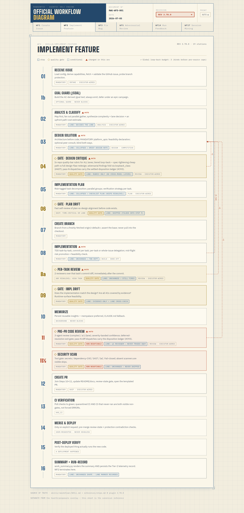

# rawgentic

**6 SDLC workflow skills + 6 workspace management + 1 planning skill + 2 security skills + hooks for Claude Code**

[](LICENSE)
[](https://docs.anthropic.com/en/docs/claude-code)

---

## What is Rawgentic?

Claude Code is powerful but unstructured. Complex tasks — building features, fixing bugs, running security audits — need consistent quality gates, test-driven development, and deployment verification. Without guardrails, it's easy to skip code review, forget to run CI, or merge without testing.

**Rawgentic** provides 15 skills organized in three layers (six little-used workflows were deprecated at v2.60.0 — #160 — and removed at v3.0.0; see `docs/upgrade-3.0.md`):

- **Workspace management** (6 skills) — Project registration, configuration, session binding, guard exception management, opt-in operating-charter installation, and session-registry housekeeping
- **SDLC workflows** (6 skills) — Multi-step guided processes with quality gates, code review, CI verification, and deployment, plus a lightweight `interview` skill for pre-build requirements discovery
- **Security & infrastructure** (1 skill + hooks) — Security pattern syncing, dangerous pattern blocking, per-project WAL logging, session binding enforcement, and cross-project file guards

All workflow skills share a **config-loading protocol** that reads project configuration from `.rawgentic.json` — no hardcoded constants, no CLAUDE.md templates, no filesystem probing.

**Philosophy:**

- **Config-driven** — All project details come from `.rawgentic.json`, not guesswork
- **Reproduce-first TDD** — Write failing tests before fixing code
- **Shift-left critique** — Quality gates run BEFORE implementation, not after
- **Conventional commits** — `<type>(scope): <desc>` matching branch prefix
- **Triple-gate testing** — Local tests, CI (GitHub Actions), post-deploy E2E

---

## Workflow Diagram

The **official, versioned workflow diagram** — every workflow's spine with clickable
per-station drill-down, a REV selector over historical WF2 spines, and loop-back
budgets drawn as return arcs. Click through to the interactive version.

<a href="docs/workflow-diagram.html">
  <picture>
    <source media="(prefers-color-scheme: dark)" srcset="docs/assets/workflow-diagram-dark.png">
    <source media="(prefers-color-scheme: light)" srcset="docs/assets/workflow-diagram-light.png">
    
  </picture>
</a>

*Snapshot of the WF2 sheet. The interactive diagram is **live** at
**[3d-stories.github.io/rawgentic](https://3d-stories.github.io/rawgentic/)** (also
[in-repo](docs/workflow-diagram.html)) — it covers WF1 / WF2 / WF3 / WF5 with per-station
detail and version history. See [docs/workflow-diagram.md](docs/workflow-diagram.md) for
the update recipe.*

---

## Contents

- [Workflow Diagram](#workflow-diagram) · [Quick Start](#quick-start) · [Prerequisites](#prerequisites)
- [Skills](#skills) — [Workspace Management](#workspace-management) · [Planning](#planning) · [SDLC Workflows](#sdlc-workflows) · [Security & Infrastructure](#security--infrastructure) · [Multi-Project Concurrent Sessions](#multi-project-concurrent-sessions)
- [Configuration](#configuration) — [`.rawgentic.json`](#project-config-rawgenticjson) · [Protection Levels](#protection-levels) · [Workspace File](#workspace-file-rawgentic_workspacejson) · [Config-Loading Protocol](#config-loading-protocol)
- [Architecture](#architecture) · [How It Works](#how-it-works) (Principles · Quality Gates · Run-Record Telemetry · Invariants)
- [Troubleshooting](#troubleshooting) · [Design Documentation](#design-documentation) · [Testing](#testing)
- [Headless Mode](#headless-mode) · [Contributing](#contributing) · [Changelog](#changelog) · [License](#license)

---

## Quick Start

> **Prerequisites:** Ensure you have Claude Code CLI, **Python 3.10+**, GitHub CLI (`gh`), Git, and jq installed.
> Optional add-ons (superpowers, Codex CLI, security scanners) unlock specific features — see [Prerequisites](#prerequisites) for the required/optional split and what each one gets you.

### 1. Install

```bash
claude plugin install rawgentic@rawgentic
```

### 2. Set up your workspace

Launch Claude Code from the directory you want as your workspace root:

```bash
mkdir my-org-workspace && cd my-org-workspace
claude
```

Then inside the Claude session:

```
/rawgentic:new-project my-app
```

This creates the workspace structure, clones or initializes the repo, scaffolds the workspace CLAUDE.md, and runs `/rawgentic:setup` to auto-detect your tech stack.

**Importing existing projects:** Register a project that already exists elsewhere on disk:

```
/rawgentic:new-project my-existing-app
```

When the project isn't found in the workspace, `new-project` asks whether to create a new folder or link to an existing one. Choose "link" and provide the path — the project is registered in the workspace JSON without copying or moving files. External projects are stored with their absolute path.

### 3. Start using workflows

```
/rawgentic:create-issue Add user authentication
/rawgentic:implement-feature 1
/rawgentic:fix-bug 2
```

### 4. Add more projects

```
/rawgentic:new-project my-api
/rawgentic:switch my-api
```

Multiple projects can be active simultaneously. Use `/rawgentic:switch` to bind a session to a specific project. Each project gets its own `.rawgentic.json` config, WAL log, and session notes.

---

## Prerequisites

### Required

Rawgentic won't function without these — the workflow skills and hooks depend on them directly.

| Requirement      | Check               | Install                                                         |
| ---------------- | ------------------- | --------------------------------------------------------------- |
| Claude Code CLI  | `claude --version`  | [Install guide](https://docs.anthropic.com/en/docs/claude-code) |
| Python 3.10+     | `python3 --version` | `apt install python3` / `brew install python`                   |
| GitHub CLI       | `gh auth status`    | `brew install gh` / [gh install](https://cli.github.com/)       |
| Git              | `git --version`     | [git-scm.com/downloads](https://git-scm.com/downloads)          |
| jq (JSON processor) | `jq --version`   | `apt install jq` / `brew install jq`                            |

**Python** runs every hook and the per-skill config engine (`hooks/capabilities_lib.py`, which all 12 workflows shell out to) — 3.10+ is required (the hooks use `X | None` type syntax); CI runs on 3.12. **`gh`** drives all issue/PR operations. **`jq`** is used throughout the shell hooks. (The run-record / completion summary uses Python's built-in `json` — no separate JSON formatter to install.)

### Optional

Each add-on unlocks a specific capability. Rawgentic runs without them — you just lose (or degrade) the feature noted.

| Add-on | Check | Install | What it unlocks — and what you lose without it |
| ------ | ----- | ------- | ---------------------------------------------- |
| **superpowers** plugin | `/superpowers:brainstorming` | `claude plugin add superpowers@claude-plugins-official` | Structured **brainstorming / design exploration** (WF12 test-strategy design; complex-feature design). **Without it:** rawgentic falls back to lighter inline brainstorming — still works, less rigorous. |
| **Codex CLI** | `codex login status` | [install + authenticate ↓](#cross-model-review-data-handling-codex) | **Cross-model adversarial review + peer consult** — an independent, *different-model* second opinion (WF5) or design proposal (WF13) via OpenAI: the `/rawgentic:adversarial-review` and `/rawgentic:peer-consult` skills, plus the opt-in cross-model gates in WF1–WF4 and WF2 Step 3. **Without it:** WF5/WF13 error out and any opt-in cross-model gate is skipped; you still get the same-model in-repo quality-bar self-review. |
| **Security scanners** (gitleaks, semgrep, osv-scanner, trivy) | `bash scripts/install-scanners.sh --check gitleaks semgrep osv-scanner trivy` | Auto-provisioned by `/rawgentic:setup` and once in the background on first plugin use (opt-out: `RAWGENTIC_SKIP_SCANNER_INSTALL=1`) | The **tool-based security scan** in WF2 Step 11.5 and WF9 (secrets / dependency-CVE / SAST / IaC misconfig). **Without them:** each missing scanner is a *visible skip* (never a silent pass) — the LLM security review still runs, but concrete known-pattern issues (leaked tokens, CVE'd deps) aren't caught. |

> **Contributing / running the tests** also needs `pip install pytest` (plus `jsonschema` for the adversarial-review schema tests, which otherwise skip). These are dev-only — not needed to *use* the plugin. See [Testing](#testing).

---

## Skills

### Workspace Management

| Skill                       | Purpose                                              |
| --------------------------- | ---------------------------------------------------- |
| `/rawgentic:new-project`    | Register a new or existing project in the workspace. Can link to external folders without copying. |
| `/rawgentic:setup`          | Auto-detect tech stack, optional critique for complex projects, generate `.rawgentic.json` |
| `/rawgentic:switch`         | Bind this session to a project, list projects, or deactivate. Checks for config staleness and prompts for missing `defaultProtectionLevel`. |
| `/rawgentic:add-exception`  | Interactively add guard exceptions to `.rawgentic.json` when a WAL or security guard blocks a legitimate operation. |
| `/rawgentic:install-operating-charter` | **Opt-in.** Install the rawgentic operating charter (quality/verification/honesty discipline) into a chosen `CLAUDE.md` via a one-line `@import`. Scope `{project | global | skip}`; never default, never silently writes global. |
| `/rawgentic:housekeeping` | Prune stale entries from the append-only session registry older than a configurable TTL (default 30 days, `$RAWGENTIC_REGISTRY_TTL_DAYS`); fail-safe (keeps undatable lines), previews before writing. WAL rotation is handled automatically by session-start. |

### Planning

| Skill                  | Purpose                                              |
| ---------------------- | ---------------------------------------------------- |
| `/rawgentic:interview` | Interview-style requirements discovery **before** building. Identifies the core problem, who it is and isn't for, and key implementation decisions, then summarizes an implementation spec for confirmation (and offers to save it). Lightweight — no config-loading or quality gates; complements deeper design exploration. |

### SDLC Workflows

| Workflow                 | Skill                          | Steps | Use When                                            |
| ------------------------ | ------------------------------ | ----- | --------------------------------------------------- |
| Issue Creation           | `/rawgentic:create-issue`      | 5     | Planning a feature or reporting a bug               |
| Feature Implementation   | `/rawgentic:implement-feature` | 16    | Building a new feature from a GitHub issue          |
| Bug Fix                  | `/rawgentic:fix-bug`           | 14    | Fixing a bug with reproduce-first TDD               |
| Adversarial Review       | `/rawgentic:adversarial-review`| 5     | Cross-model critique of a design/spec/plan/PRD/ADR/RFC/README artifact |
| Incident Response        | `/rawgentic:incident`          | 14    | Production incident: stabilize first, then RCA      |
| Peer Consult             | `/rawgentic:peer-consult`      | 5     | Independent cross-model design proposal for a problem/spec artifact |

<details>
<summary><strong>Issue Creation (WF1)</strong> — 5 steps</summary>

**Purpose:** Turn a raw feature/bug request into a clean, template-conformant GitHub issue on the right repo. A lean helper — no multi-agent critique; its quality bar (no hallucinated components, no fabricated criteria, bound an over-broad ask) is applied inline while drafting.

**Invocation:** `/rawgentic:create-issue Add dark mode support to the dashboard`

**Key Features:**
- Config-driven repo targeting (issue lands on the project's configured repo)
- Duplicate detection via `gh issue list` before creation
- Codebase grounding — referenced components are verified to exist (Serena MCP or Grep/Glob)
- Conventional `feat(scope):` / `fix(scope):` titles, template conformance
- Optional default-off cross-model adversarial review of the draft (opt-in per project)

> Slimmed from a 9-step multi-agent workflow after head-to-head evals showed a current model produces an equivalent issue without the critique pipeline, at ~⅓ the time/tokens (see `skills/create-issue-workspace/`).
</details>

<details>
<summary><strong>Feature Implementation (WF2)</strong> — 16 steps</summary>

**Purpose:** Take a GitHub issue and implement it end-to-end with TDD, code review, and deployment.

**Invocation:** `/rawgentic:implement-feature 155`

**Key Features:**
- Config-driven: TDD mode when tests configured, Implement-Verify mode when not
- 4-agent code review (general, security, performance, test coverage)
- **Step 11.5 tool-based security scan** (pre-PR gate): runs gitleaks (secrets, diff-scoped), an SCA dependency-CVE scan (osv-scanner → npm/pip-audit fallback), semgrep SAST, and trivy IaC (Docker projects) via the shared `hooks/security_scan.py` lib — fail-closed on a real finding, visible-skip when a tool is absent
- **Step 11 opt-in cross-model diff review**: when `adversarialReview.workflows` includes `implement-feature` and the change touches a security surface (a high-risk path pattern, or a plan task marked `riskLevel: high`), runs an additional cross-model adversarial review of the code diff (WF5's `diff` type, refutation lens) alongside the 4-agent review — report-only, non-blocking, 4-state marker (`findings_present`/`no_findings`/`failed`/`skipped`)
- **Small-standard lane**: a middle tier between the `<trivial-work-check>` exit and the full 16-step spine, for `simple_change`/`standard_feature` changes touching ≤7 impl files (tests/docs excluded from the count). **#225 adds two lane-election paths for bounded >7-file changes**: a *secondary signal* (2–3 separately-understood defects, each ≤7 impl files, total ≤21 — `defect_file_counts` on `lane_decision`, fail-closed on malformed/over-bound input, per-defect counts logged verbatim) and an *operator override* (interactive "Force lane" choice; headless `RAWGENTIC_WF2_FORCE_LANE=1`); the arch-change/migration/new-dep guards and a `complex_feature` tag remain unbypassable by both, and elected runs log a sanctioned count that Step 9's lane-widened cross-check compares against. Keeps TDD, Step 8a, Step 11 review, Step 11.5 security scan, and CI/PR/merge unchanged; collapses Step 3 to a brief design note, Step 4 to reflect-only, Step 5 to a checklist plan, and Step 9 to evidence-only; skips Step 6 entirely. `small_standard_lane_eligible` is the canonical predicate (`fast_path_eligible` survives as a deprecated alias)
- Parallelized analysis (Step 2) and review (Step 4) phases for lower latency
- **Upfront path-cost estimate (#224)**: Step 2 emits `Path estimate: full spine ≈ N agents (~M min); small-standard lane ≈ K agents (~L min)` before the lane choice — derived via `plan_lib.estimate_agents` (lane-keyed Step-11 term 3 vs 1, 2×high-risk-task Step-8a term, opt-ins; parallel-stage wall model; `WF2_EST_MINUTES_PER_AGENT` env-tunable), high-risk projected as an explicit lower bound from the path allowlist, refreshed at Step 5 with the real tagged count, logged unconditionally (headless-safe marker)
- **Tiered design loop-back (#223)**: Step-4 Critical/High findings carry a `Loopback-class` tag — an all-`spec-tightening` set (wording, stale anchors, internal contradictions) takes a cheap in-gate pass (amend + ONE incremental verifier over only the changed sections, no Step-3 return, source `spec_tighten`, max 2) instead of a full redesign; any `design-flaw`, untagged, or adversarial-sourced Critical/High folds fail-closed to the full `design` path
- Global loopback budget of 3 across all retry loops (five sources: design ×2, spec_tighten ×2, tdd/review/review_design ×1)
- Learning config: updates `.rawgentic.json` when new patterns discovered

Since v2.61.0 (#158), the WF2 skill itself loads as a ~295-line spine with on-demand references (`references/steps.md` for per-step detail, `state-and-resume.md`, `headless.md`, `run-record.md`) instead of a 1,600-line monolith — progressive disclosure that shrinks the context paid on every invocation. All gates are preserved verbatim and drift-guarded via the `tests/corpus.py` helper.
</details>

<details>
<summary><strong>Bug Fix (WF3)</strong> — 14 steps</summary>

**Purpose:** Fix bugs using reproduce-first methodology with a failing test before any fix.

**Invocation:** `/rawgentic:fix-bug 42`

**Key Features:**
- Reproduce-first: failing test MUST exist before code changes
- Complexity escalation: 10+ file fixes upgrade to WF2
- Verify mode when no test framework configured
- Security finding support: auto-detects STRIDE-format issues from WF9
- Pre-flight dependency check before first test run
- Respects project-level merge approval rules

Since v2.62.0 (#159), the WF3 skill itself loads as a ~224-line spine with on-demand references (`references/steps.md` for per-step detail, `incident.md`, `headless.md`) instead of a monolith — progressive disclosure that shrinks the context paid on every invocation. `references/incident.md` carries the deprecated WF11 comms/post-mortem checklist for incident-severity bugs, absorbed in the WF11 merge. All gates are preserved verbatim and drift-guarded via the `tests/corpus.py` helper.
</details>

<details>
<summary><strong>Adversarial Review (WF5)</strong> — 5 steps</summary>

**Purpose:** Cross-model adversarial critique of a TEXT artifact (design, spec, plan, PRD, ADR, RFC, README) — or, opt-in, a code DIFF — using an independent reviewer via the Codex CLI. Report-only.

**Invocation:** `/rawgentic:adversarial-review docs/design/feature.md`

**Key Features:**
- Different-model second opinion (complements the same-model in-repo quality-bar self-review)
- **`diff` artifact type** — reviews a unified git diff with a refutation lens (hunts fail-open guards, silently-passing error paths, weakened security checks); same fail-closed engine, plus an optional `--findings-json` sidecar for embedded consumers like WF2 Step 11
- Report-only — writes `docs/reviews/<slug>-<date>.md`, never edits the artifact
- **Grounded, high-precision findings** — each carries a verbatim `evidence` quote from the artifact plus a `confidence`; an explicit severity rubric curbs inflation, so reports stay short and verifiable instead of padded with generic best-practice nitpicks
- **Reproducible reviewer** — pins reasoning effort high (`RAWGENTIC_ADV_REVIEW_EFFORT`) instead of silently inheriting whatever `~/.codex/config.toml` defaults to (gpt-5.5 defaults to *medium*); runs ephemeral and independent of the project's `AGENTS.md`
- **Injection-hardened** — the artifact is wrapped in a per-run unforgeable nonce fence and treated strictly as data; embedded steering text (e.g. "rate this flawless") is reported as a finding, not obeyed
- Optionally wired into WF2 (design/plan gates), WF3, and WF1 (issue spec) per-project (all opt-in; WF3/WF1 default-off)
- Warn-only egress with secret scanning; fail-closed on any Codex error
- Requires the Codex CLI installed + authenticated. See [Data Handling](#cross-model-review-data-handling-codex).
</details>

<details>
<summary><strong>Incident Response (WF11)</strong> — 14 steps, 2 phases</summary>

**Purpose:** Two-phase incident handling: stabilize first, then root cause analysis.

**Invocation:** `/rawgentic:incident Dashboard is not loading`

**Key Features:**
- Phase A (stabilize): speed over perfection, relaxed quality gates
- Phase B (RCA): structured 5 Whys analysis (min 3 levels), preventive measures, pattern memorization
- SEV-1 through SEV-4 classification drives response urgency
- Incident tracking issue created at start, closed at completion
- Step 5 verification mandatory with evidence for SEV-1/SEV-2
</details>

<details>
<summary><strong>Peer Consult (WF13)</strong> — 5 steps</summary>

**Purpose:** Engage Codex as an independent PEER senior engineer — not a reviewer — to produce its own design proposal for a problem/spec artifact, without seeing or critiquing any proposal of yours. Report-only.

**Invocation:** `/rawgentic:peer-consult docs/design/feature.md`

**Key Features:**
- Independent proposal, not critique — complements WF5 (which reviews an existing artifact); WF13 proposes an alternative
- Report-only — writes `docs/reviews/peer-<slug>-<date>.md`, never edits the artifact or auto-applies its proposal
- Shares WF5's Codex engine (`hooks/adversarial_review_lib.py` consult mode): same egress notice, secret scanning, and reproducibility knobs
- Optionally wired into WF2 Step 3 (design) as a blind-both-ways consult, per-project opt-in via `peerConsult` (default-off; mirrors `adversarialReview`'s shape)
- Requires the Codex CLI installed + authenticated. See [Data Handling](#cross-model-review-data-handling-codex).
</details>

### Security & Infrastructure

| Skill | Purpose |
|-------|---------|
| `/rawgentic:sync-security-patterns` | Merge upstream security patterns from Anthropic's official plugin into local config |
| `/rawgentic:scan` | Whole-tree tool-based security scan (secrets/SCA/SAST/IaC) via hooks/security_scan.py --full — the surviving WF9 tooling |

#### Bundled Subagents

The plugin ships two subagent definitions, auto-discovered from `agents/` and namespaced on install (#164):

| Agent type | Role | Key properties |
|-----------|------|----------------|
| `rawgentic:rawgentic-implementer` | WF2/WF3 per-task implementation | `model: inherit`, `isolation: worktree` — mutating work runs in an isolated git worktree |
| `rawgentic:rawgentic-reviewer` | Quality-gate reviews (Steps 4/8a/11) | `model: inherit`, no file-editing tools (Read/Grep/Glob/Bash — Bash is instruction-bounded to inspection, not tool-enforced) |

Both declare `model: inherit` because model routing is per-project config: WF2 resolves the routed role model and passes it per-invocation, which overrides the definition's frontmatter. Never-Haiku is enforced in the definitions and by a drift guard (`tests/test_bundled_agents.py`). When worktree isolation is unavailable (the `probe-parallelism` capability reports `serial-only`), dispatch gracefully falls back to non-isolated, strictly serial execution.

#### Hooks

Rawgentic includes hooks that run automatically on Claude Code events:

| Hook | Event | Purpose |
|------|-------|---------|
| `wal-pre` | PreToolUse | Logs INTENT before mutation tools execute |
| `wal-post` | PostToolUse | Logs DONE after successful execution |
| `wal-post-fail` | PostToolUseFailure | Logs FAIL after failed execution |
| `wal-stop` | Stop | Logs session end marker |
| `wal-context` | UserPromptSubmit | Injects session context (project, recent WAL activity) |
| `wal-bind-guard` | PreToolUse | Blocks tool use if session unbound with multiple active projects; blocks cross-project file writes |
| `wal-guard` | PreToolUse | Blocks dangerous production commands with per-project protection levels (sandbox/standard/strict); in headless mode also blocks **all** `ssh`/`scp`/`rsync`/`sftp` (unless `headlessAllowSSH: true`) |
| `session-start` | SessionStart | WAL recovery, **notes size handler**, project reconciliation, security pattern staleness check, **self-healing security scanner bootstrap** (`scanner_bootstrap.py` — re-checks each startup/resume, background install of what's missing, status file), **post-update feature reconcile** (`post_update_reconcile.py`), resume context. Reads the session subtype from the `source` field |
| `notes-size-handler` | (called by session-start) | Trims session notes exceeding 800 lines to keep last 200; optionally ingests to memorypalace before trimming |
| `scanner_bootstrap.py` | (called by session-start) | Re-checks scanner presence, installs missing ones in the background, throttles retries, writes `~/.rawgentic/scanner-status.json` so a no-fire/failure is visible (opt-out: `RAWGENTIC_SKIP_SCANNER_INSTALL=1` / `installScanners: false`) |
| `post_update_reconcile.py` | (called by session-start) | On a plugin version change, turns new opt-OUT features on by default (honoring opt-outs), leaves headless opt-in, and nudges to run `/rawgentic:setup` — **version-aware (#184):** only when the upgrade jump crossed a feature's `since` (the version that introduced its setup step); otherwise silent marker bump. Workspace-level `"setupPrompt": false` opts out; record-once per version |
| `security-guard` | PreToolUse | Blocks writing dangerous patterns (credentials, secrets, eval) to files |
| `security-guard-check` | SessionStart | Recommends disabling the official security-guidance plugin **once** if it's enabled (record-once decision in `~/.rawgentic/security-guidance-decision`), then stays silent — no per-session nag |

**Security Guard** blocks writes containing dangerous code patterns (eval, innerHTML, pickle, os.system, etc.). Patterns are defined in `hooks/security-patterns.json`. Protection level controls which rules are active (sandbox: none, standard: 6 common patterns, strict: all). Per-path exceptions via `guards.securityExcludePaths` in `.rawgentic.json`. Uses the Claude Code `permissionDecision: deny` protocol for hard blocking (not retried).

**Security Scan** (`hooks/security_scan.py`) is the tool-based scanner shared by WF2 Step 11.5 (diff-scoped, pre-PR) and WF9 (`--full`, whole-tree audit): gitleaks (secrets), an SCA dependency-CVE scan (osv-scanner, falling back to `npm audit`/`pip-audit`), semgrep SAST, and trivy IaC for Docker projects. It is **fail-closed** — a leaked secret, a Critical/High CVE, or an installed-but-broken scanner blocks; blocking severities are tunable via `RAWGENTIC_SECURITY_BLOCK_SEVERITIES`. A scanner whose tool isn't installed is a **visible skip**, never a silent pass. `scripts/install-scanners.sh` provisions the tools (idempotent, best-effort); the session-start hook (`hooks/scanner_bootstrap.py`) re-checks presence every startup/resume and installs whatever is missing in the background (self-healing — a scanner that goes missing, or one added by a plugin update, is reinstalled automatically), recording the outcome in `~/.rawgentic/scanner-status.json`, and `/rawgentic:setup` runs it explicitly. Installs are **opt-out** (`RAWGENTIC_SKIP_SCANNER_INSTALL=1` or `"installScanners": false`), never opt-in. See `docs/security-scan.md`.

**WAL (Write-Ahead Log)** records every mutation tool call to `claude_docs/wal/{project}.jsonl`. On session resume, incomplete operations are surfaced for recovery. WAL files are per-project — each active project gets its own log. An **opt-in** migration (v2.20.0) can move session data to `~/claude_docs/`, leaving a symlink at the old workspace-relative location; it is **deferred by default** as of v2.43.0 (it had been dormant in production due to the `source`/`hook_event_name` bug, and moving data should be a deliberate choice) — enable it with `RAWGENTIC_ENABLE_CLAUDE_DOCS_MIGRATION=1`. The path is configurable via `claudeDocsPath` in `.rawgentic_workspace.json`.

**Session Notes Size Handler** — When session notes exceed 800 lines, the `notes-size-handler.py` script trims to the most recent 200 lines. Runs on both startup and compact events (mid-session safety net). Before trimming, optionally POSTs full content to a memorypalace server for ingestion (best-effort, 2s timeout). Uses `fcntl.flock()` for concurrent safety and atomic writes via `tempfile` + `os.replace()`.

**HTML Design-Artifact Lifecycle** (v2.63.0, #174) — `hooks/render_artifact.py` renders a design/spec markdown doc into a self-contained, CSP-safe HTML artifact: inline CSS only (no external hosts or CDN links), **escape-first** (untrusted spec text is HTML-escaped before rendering, so it's safe against injection), with embedded run-record telemetry and a stamped mountain-time (`America/Edmonton`) "Last updated" datetime. WF1 renders and publishes the issue artifact and comments its URL on the issue; WF2/WF3 create-or-update `docs/planning/<issue>.{md,html}` (with telemetry) inside the feature PR before `gh pr create`. **Opt-in per project** via the `designArtifact` key in `.rawgentic_workspace.json` — default off, byte-identical behavior when unset.

Since v2.66.0 (#199) the renderer has an **opt-in `--style roadmap`** (config `designArtifact.style: "roadmap"`, default `plain`): each `##` section becomes a dashboard-style bubble card titled with a completion chip (green (done/shipped) / amber (abandoned/blocked) / neutral (planned)), derived from the section's status keywords — so a rolling campaign/roadmap log matches the hand-authored modernization dashboard. A definitive heading status wins over incidental body keywords; the chip label is drawn from a fixed vocabulary (never raw text) so it stays escape-safe, and the card CSS is injected **only** in roadmap mode, keeping `plain` output byte-identical.

**Usage/Token Telemetry Capture** (v2.65.0, #189) — `hooks/usage_capture.py` populates the run-record `usage` object with **real** per-model token/cost numbers by parsing the current Claude Code session transcript directly (the same source `ccusage` reads — stdlib-only, no network). #155 added the field but nothing filled it, so it was null in all 24 records and the yield-per-token effectiveness gate (#162) was incomputable. Capture runs at WF2/WF3 Step 16 (`capture --session-id`); historical rows are backfilled (`backfill --records`) — recovered where a session-id correlator exists, else marked `unrecoverable`. A `capture_status` controlled vocab (`{captured, unrecoverable, unavailable}`) is fail-closed, and a `captured` claim REQUIRES non-null tokens summing > 0 at the validator — so the #155 null-forever state can no longer be persisted; a drift-guard test enforces it over the committed store.

### Multi-Project Concurrent Sessions

Multiple Claude Code sessions can work on different projects simultaneously from the same workspace root.

**How it works:**
- Multiple projects can have `active: true` in `.rawgentic_workspace.json`
- Each session is **bound** to a project via `claude_docs/session_registry.jsonl`
- WAL logs are per-project: `claude_docs/wal/{project}.jsonl`
- The `wal-bind-guard` hook enforces binding and prevents cross-project file writes

**Session binding cascade:**
1. Session already in registry → use that project
2. Exactly one active project → auto-bind
3. Multiple active projects → prompt user to run `/rawgentic:switch <name>`

**Cross-project protection:** If session A is bound to `my-api` and tries to write a file under `projects/my-frontend/`, the `wal-bind-guard` hook denies the operation.

**Directory reconciliation:** On startup/resume, the `session-start` hook checks that all active projects' directories exist on disk. Missing directories are deactivated and the user is prompted to remove or re-setup.

**Security pattern staleness check:** On startup/resume, the `session-start` hook compares the sha256 hash of the official `security-guidance` plugin's pattern file against a stored marker (`hooks/.last-security-sync-hash`). If the hashes differ (or the marker is missing), a warning nudges the user to run `/rawgentic:sync-security-patterns`. Silently skips if the official plugin is not installed.

---

## Configuration

### Project Config: `.rawgentic.json`

Every project gets a `.rawgentic.json` file generated by `/rawgentic:setup`. This structured config replaces the old CLAUDE.md constants approach — all workflow skills read from this file instead of probing the filesystem.

```json
{
  "version": 1,
  "project": {
    "name": "my-app",
    "type": "webapp",
    "description": "Dashboard for analytics"
  },
  "repo": {
    "provider": "github",
    "fullName": "org/my-app",
    "defaultBranch": "main"
  },
  "techStack": [
    { "name": "typescript", "version": "5.3.3" },
    { "name": "react", "version": "18.2.0" },
    { "name": "node", "version": "20.11.0" }
  ],
  "testing": {
    "framework": "vitest",
    "command": "npx vitest run --reporter=verbose",
    "coverageCommand": "npx vitest run --coverage"
  },
  "ci": {
    "provider": "github-actions",
    "configPath": ".github/workflows/ci.yml"
  }
}
```

The full schema is at `templates/rawgentic-json-schema.json`. Sections include: `project`, `repo`, `techStack`, `testing`, `ci`, `deploy`, `database`, `infrastructure`, `documentation`, `formatting`.

### Protection Levels

The `protectionLevel` field controls which guard rules are active per project:

| Level | WAL Guards | Security Guards | Use case |
|-------|-----------|-----------------|----------|
| `sandbox` | None | None | POC / playground projects |
| `standard` | Destroy + mutate ops | 6 common patterns | Projects with some production exposure |
| `strict` | All 12 rules | All rules | Full production (default) |

Override presets with explicit `guards.wal` / `guards.security` arrays. See `docs/config-reference.md` for the full rule reference.

### Workspace File: `.rawgentic_workspace.json`

Tracks all registered projects. Created automatically by `/rawgentic:new-project`:

```json
{
  "version": 1,
  "projectsDir": "./projects",
  "projects": [
    {
      "name": "my-app",
      "path": "./projects/my-app",
      "active": true,
      "lastUsed": "2026-03-06T12:00:00Z",
      "configured": true
    }
  ]
}
```

**Multi-project:** Multiple projects can be `active: true` simultaneously. The `active` flag means the project is provisioned and available — it does not mean "this is the current session's project." Session-to-project binding is tracked in `claude_docs/session_registry.jsonl`.

### Config-Loading Protocol

All 7 config-driven skills (the active workflows plus `/rawgentic:scan`) share an identical config-loading block that runs before any workflow step:

1. Read `.rawgentic_workspace.json` → find active project (if multiple are active, stop and prompt user to `/rawgentic:switch`)
2. Load + derive: `python3 hooks/capabilities_lib.py derive --config <project-path>/.rawgentic.json` validates the config and emits `{config, capabilities}`
3. All subsequent steps use config and capabilities — never probe the filesystem

The config→`capabilities` derivation lives in **one tested place** (`hooks/capabilities_lib.py`) instead of an identical prose block duplicated across every config-driven skill + the docs table. It is fail-closed: a missing/corrupt config or a present-but-malformed optional section exits non-zero (rather than silently yielding a feature-less object), while an absent optional section yields its documented default. This means skills adapt automatically: TDD mode when tests are configured, Implement-Verify mode when they're not. No capability detection, no guessing.

### Learning Config

During workflow execution, skills may discover new information about the project (a new auth mechanism, an updated dependency version, a new documentation file). The **learning-config protocol** updates `.rawgentic.json` safely:

- **Append** to arrays (don't replace existing entries)
- **Set** null/missing fields (don't overwrite existing values)
- Always read-modify-write (never patch in place)

---

## Architecture

### Workspace Architecture

Rawgentic uses a **three-layer CLAUDE.md hierarchy** to separate personal, workspace, and project concerns:

| Layer | File | Scope | In Git? |
|-------|------|-------|---------|
| 1 — Personal | `~/.claude/CLAUDE.md` | Developer preferences, per machine | No |
| 2 — Workspace | `{cwd-root}/CLAUDE.md` | GitHub org, PAT, team process | No |
| 3 — Project | `projects/{name}/CLAUDE.md` | Project-specific instructions | Yes |

**Key principles:**
- **Projects are standalone** — Layer 3 works without rawgentic
- **Rawgentic is additive** — removing it only affects Layer 2
- **One workspace per org** — GitHub credentials scoped to workspace
- **No absolute paths** — portable across machines

The `setup` skill scaffolds Layer 2 on first run. The `new-project` skill audits Layer 3 for conformance.

See `docs/plans/2026-03-06-plugin-overhaul-design.md` for the full design.

---

## How It Works

### 15 Principles (P1-P15)

| ID  | Name                    | Summary                                                                  |
| --- | ----------------------- | ------------------------------------------------------------------------ |
| P1  | Branch Isolation        | Every workflow gets its own branch; parallel work uses git worktrees     |
| P2  | Code Formatting         | Auto-format before every commit (Prettier for JS, Black for Python)      |
| P3  | Frequent Local Commits  | Commit after each meaningful change; never lose more than 15 min of work |
| P4  | Regular Remote Sync     | Push to remote at every natural checkpoint                               |
| P5  | TDD Enforcement         | Write tests before implementation; variant per workflow type             |
| P6  | Main-to-Dev Sync        | After merge to main, deploy to dev immediately                           |
| P7  | Triple-Gate Testing     | Gate 1: local tests, Gate 2: CI, Gate 3: post-deploy E2E                 |
| P8  | Shift-Left Critique     | Quality gates run BEFORE implementation, not after                       |
| P9  | Continuous Memorization | Curate reusable insights into CLAUDE.md                                  |
| P10 | Diagram-Driven Design   | Create/update diagrams for architectural changes                         |
| P11 | User-in-the-Loop Gates  | User approval required before merge; ambiguity stops and asks            |
| P12 | Conventional Commit     | `<type>(scope): <desc>` — type matches branch prefix                     |
| P13 | Pre-PR Code Review      | Code review BEFORE creating PR, not after                                |
| P14 | Documentation-Gated PRs | PR must document what changed, why, and how to test                      |
| P15 | Risk-stratified Review  | High-risk tasks get per-task review at commit time (WF2 Step 8a) in addition to the PR-wide review |

### Quality Gate Strategy

| Workflow                   | Critique Level     | Gate                  | When                         |
| -------------------------- | ------------------ | --------------------- | ---------------------------- |
| Setup (config detection)   | Optional quality-bar review | in-repo rubric | After detection, if complex  |
| WF1 Issue Creation         | Inline quality-bar | while drafting | During draft                 |
| WF2 Feature Implementation | Quality-bar rubric + platform-feasibility gate (+ opt-in adversarial-on-design) | in-repo rubric | After design |
| WF3 Bug Fix                | Quality-bar rubric + platform-feasibility gate | in-repo rubric | After RCA                    |
| WF5 Adversarial Review     | Cross-model        | Codex CLI             | Standalone; opt-in in WF1–WF3 |
| WF11 Incident              | Quality-bar rubric | in-repo rubric | Phase B only                 |
| WF13 Peer Consult          | Independent peer   | Codex CLI             | Standalone; opt-in in WF2 Step 3 |

### Cross-Model Review Data Handling (Codex)

WF5 Adversarial Review (`/rawgentic:adversarial-review`) and its opt-in WF1/WF2/WF3/WF4
hooks, plus WF13 Peer Consult (`/rawgentic:peer-consult`) and its opt-in WF2 Step 3
integration, send the **text of the reviewed artifact to OpenAI** via the Codex CLI for an
independent, different-model critique or proposal. This is **warn-only**: a one-time egress
notice is printed before each invocation, and the engine scans the artifact for
obvious secrets (API keys, passwords, tokens, private keys), naming any detected
categories. Set `RAWGENTIC_ADV_REVIEW_BLOCK_SECRETS=1` to block egress when secrets
are found. Findings reports are written locally to `<project>/docs/reviews/` and are
never uploaded. The feature is **default-disabled** per project; existing WF1/WF2/WF3/WF4
runs are unchanged unless explicitly opted in via `adversarialReview` (WF5) or `peerConsult`
(WF13) in `.rawgentic_workspace.json`. Requires the Codex CLI installed
(`curl -fsSL https://codex.openai.com/install.sh | bash`) and authenticated
(`codex login`). See [config-reference.md](docs/config-reference.md#adversarial-review-data-handling).

### Run-Record Telemetry (Tier-2 substrate)

WF2 Step 16 and WF3 (fix-bug) Step 14 no longer hand-type their completion
summaries. Instead each assembles a structured **run-record** — issue/type, change
volume, tests, each quality gate's *findings caught vs resolved*, security-scan
status, loop-backs, and the PR/CI/deploy outcome — and drives
`hooks/work_summary.py`, which renders the standardized "WF*N* COMPLETE" block
**and** appends the record as one JSON line to
`<project>/docs/measurements/run_records.jsonl` (override via `--store` or
`RAWGENTIC_RUN_RECORD_STORE`) — this rawgentic repo commits its own store at
`docs/measurements/run_records.jsonl`. The fields are a **uniform core** so the
Tier-2 A/B measurement harness can aggregate across workflows, plus an optional
`extra` list for workflow-specific lines (e.g. WF3's Root Cause / Fix) and an
optional `usage` object (input/output tokens, cost estimate, wall clock,
per-model mix) for token/cost telemetry — backfilled from
[`ccusage`](https://github.com/ryoppippi/ccusage) when not captured at run
time. Each gate entry also carries an optional `reviewer_kind` (`inline` /
`reflexion` / `builtin_code_review` / `codex` / `hand_rolled_multi`) recording
which reviewer produced it. The store is **fail-closed** (a record failing
validation is never persisted) while the human summary renders best-effort (a
schema nit never costs the user their completion output). See
[run-records.md](docs/run-records.md).

Once runs accumulate, `work_summary.py aggregate --store <path>` rolls the store
up into Tier-2 metrics — per-gate effectiveness (hit rate, findings caught vs
resolved), loop-back behavior, outcome rates (CI/merge/deploy/security), and
effort means — with `--json`, `--group-by {workflow,version,type,complexity}`
(version is the cross-skill A/B slice), and `--since <ISO date>`. The reader is
fail-closed: a corrupt or schema-invalid store line is excluded with a visible
count, never silently averaged in.

### Shared Invariants

1. **Config-loading protocol** — All workflow skills read `.rawgentic.json` before executing
2. **Ambiguity Circuit Breaker** — STOP and ask user when findings conflict
3. **Finding Auto-Application** — Apply ALL quality gate findings automatically
4. **Workflow Resumption** — Checkpoint artifacts for mid-workflow recovery
5. **Session Notes** — Continuous documentation in `claude_docs/session_notes/<project>.md` (auto-created by setup/new-project, auto-registered by WAL hooks). The size handler trims notes exceeding 800 lines to the most recent 200 on startup and each context compaction. A per-project **handoff** (`claude_docs/session_notes/<project>.handoff.md`) is injected by `session-start` for the bound project on startup/resume/clear and surfaced as the write target — so handoffs stay scoped per project instead of sharing the workspace-level remember-plugin handoff (see [session-notes.md](docs/session-notes.md#per-project-handoff)).
6. **Commit Convention** — `<type>(scope): <description>` matching branch prefix
7. **Branch from default** — All branches from `origin/<defaultBranch>` (read from config)
8. **Squash merge** — All PRs use `gh pr merge --squash`
9. **Deploy to dev only** — Workflows deploy to dev; production is outside scope

---

## Troubleshooting

| Problem                          | Cause                                         | Solution                                                      |
| -------------------------------- | --------------------------------------------- | ------------------------------------------------------------- |
| "No rawgentic workspace found"   | First-time user                                | Run `/rawgentic:new-project` to register your first project   |
| "Config missing — run setup"     | Project registered but not configured          | Run `/rawgentic:setup` on the active project                  |
| Config version mismatch          | `.rawgentic.json` has wrong version            | Run `/rawgentic:setup` to regenerate config                   |
| Workflow resumes at wrong step   | Context compacted mid-workflow                 | Re-invoke the skill — resumption protocol detects state       |
| CI verification hangs            | `gh pr checks` doesn't work with fine-grained PATs | Skills use `gh run list` instead (already handled)        |
| Ambiguity circuit breaker fires  | Quality gate found conflicting findings        | Expected — review findings, tell Claude how to proceed        |
| Workflow upgrades to WF2         | Bug fix classified as complex (10+ files)      | Expected — complex bugs get the full feature workflow         |
| Context runs out mid-workflow    | Long workflow exceeded context window          | Skills document state before compaction — re-invoke to resume |
| Stop hook blocks every response  | Session not registered with real session ID    | Fixed in v2.3.0 — `wal-context` auto-registers on first prompt |
| "Multiple projects active"       | Multiple projects have `active: true`         | Run `/rawgentic:switch <name>` to bind this session            |
| "Session isn't bound to a project" | Unbound session with multiple active projects | Run `/rawgentic:switch <name>` to bind                        |
| Cross-project write denied       | File path is in a different project            | Switch first with `/rawgentic:switch <target>`, or ask user   |
| Hooks fail after `cd` in Bash    | CWD drifted to project subdir, workspace file not found | Fixed in v2.5.3 — hooks now traverse up to 5 levels |
| Hook errors after plugin update  | Session still references old cache path        | Exit session, reinstall plugin, start new session              |
| Marketplace "Sync Failed" (no detail) | Stale server cache or rate limit            | Remove plugin from org marketplace, wait 60s, re-add          |
| Marketplace `failed_content` with "Duplicate skill name" | Two `SKILL.md` files under `skills/` declare the same `name:` | Rename dev snapshots to `SKILL.snapshot.md` (validator only finds `SKILL.md`) |
| Marketplace version conflict     | `marketplace.json` plugin entry has a `version` field that differs from `plugin.json` | Remove `version` from plugin entry; use `metadata.version` at top level instead |

---

## Design Documentation

The `docs/` directory contains detailed design documentation for contributors:

- **[Principles](docs/principles.md)** — P1-P15 definitions with rationale and enforcement mechanisms
- **[Consolidation](docs/consolidation.md)** — Step archetype mappings, shared protocol, principle coverage matrix
- **[Multi-Issue Driver](docs/multi-issue-driver.md)** — the documented pattern for running an autonomous backlog: loop WF2 fresh per issue over a durable queue, with a DEFER taxonomy, rollback anchors, dependency-DAG ordering (`hooks/driver_lib.py`), an epic anchor, and a resumption contract. State schema + examples in `docs/driver-state/`.
- **Design documents** (in `docs/design/`):
  - [Multi-Issue Driver design (#134)](docs/design/2026-07-04-multi-issue-driver.md)
  - [Issue Creation (WF1)](docs/design/workflow-issue-creation.md)
  - [Feature Implementation (WF2)](docs/design/workflow-feature-implementation.md)
  - [Bug Fix (WF3)](docs/design/workflow-bug-fix.md)
  - [Refactoring (WF4)](docs/design/workflow-refactoring.md)
  - [Adversarial Review (WF5)](docs/design/workflow-adversarial-review.md)
  - [Documentation (WF7)](docs/design/workflow-documentation.md)
  - [Dependency Update (WF8)](docs/design/workflow-dependency-update.md)
  - [Security Audit (WF9)](docs/design/workflow-security-audit.md)
  - [Performance Optimization (WF10)](docs/design/workflow-performance-optimization.md)
  - [Incident Response (WF11)](docs/design/workflow-incident-response.md)
  - [Test Suite Creation (WF12)](docs/design/workflow-test-suite-creation.md)
  - [Security Guard](docs/plans/2026-03-07-security-guard-design.md)
  - [Multi-Project Concurrent Sessions](docs/plans/2026-03-07-multi-project-sessions-design.md)
  - [Model Routing + Peer Consult (WF13) design](docs/design/2026-07-03-model-routing-and-peer-consult-design.md) ([visual](docs/design/2026-07-03-model-routing-and-peer-consult-design.html))
  - [Model Routing + Peer Consult plan](docs/plans/2026-07-03-model-routing-and-peer-consult.md)
  - [Dual Memory Backend (draft)](docs/superpowers/specs/2026-04-08-dual-memory-backend-design.md)
- **[Memory Source of Truth](docs/memory-source-of-truth.md)** — **mempalace is the authoritative read/write memory store** for durable facts/decisions/gotchas; `CLAUDE.md` (contract) and session notes/WAL stay in-repo because the tooling reads them directly; the auto-memory dir is a secondary bootstrap mirror. How mempalace is fed (PreCompact fork + WF2 Step 10) and worked with (CRUD tools + recall protocol).
- **Planning documents** (in `docs/planning/`):
  - [Workflow Modernization Review (2026-07)](docs/planning/2026-07-04-workflow-modernization-review.md) ([visual](docs/planning/2026-07-04-workflow-modernization-review.html)) — 12-AC findings: model-routing topology verdict, /goal + multi-issue design, skill restructure, plugin dispositions, deprecation audit
  - [Workflow Modernization Roadmap](docs/planning/2026-07-04-workflow-modernization-roadmap.md) — 4 milestones (M1 instrument → M2 restructure/v3.0.0 → M3 multi-issue → M4 headless); issues filed under epics #167–#170
  - [Issue #162 Data-Gate Decision (2026-07-05)](docs/measurements/2026-07-05-issue-162-data-gate-decision.md) — review-switch abandoned per its own AC4 data gate (candidate arm 0 runs vs ≥10 required, token telemetry null); deferral pending telemetry, not a rejection of built-in `/code-review`
- **[Run-Records](docs/run-records.md)** — Per-run structured run-record schema + store + the `work_summary.py` CLI (WF2 Step 16; Tier-2 telemetry substrate)
- **[Testing](docs/testing.md)** — Test suite overview, hook test descriptions, skill evaluation methodology
- **Diagrams** (in `diagrams/`): Excalidraw visual diagrams for each workflow and the framework architecture

---

## Testing

All hooks are tested via subprocess black-box testing using pytest. Tests invoke hooks as subprocesses, piping JSON to stdin and asserting on stdout, exit code, and filesystem side effects.

```bash
# Run the full test suite
pytest tests/ -v

# Run a single test file
pytest tests/hooks/test_wal_guard.py -v
```

**1,400+ tests** across the hook + skill-helper modules. See [docs/testing.md](docs/testing.md) for full details.

**Drift-guard corpus:** prose-pinning guards assert over a skill's *corpus* — `SKILL.md` plus `references/*.md` — via `tests.corpus.skill_corpus()`, so restructuring prose into `references/` never silently un-pins a guard. Location-specific pins (frontmatter, base-file pointers) still read their exact file. See [docs/testing.md](docs/testing.md#drift-guard-corpus-testscorpuspy).

**CI:** GitHub Actions runs `pytest tests/ -v` on all PRs to `main` (`.github/workflows/ci.yml`). SDLC workflows also run tests automatically when `.rawgentic.json` has a `testing` section configured.

**CI security review lane:** PRs to `main` also get a semantic security review from [anthropics/claude-code-security-review](https://github.com/anthropics/claude-code-security-review) (`.github/workflows/claude-security-review.yml`) — findings post as PR review comments. The lane is **non-blocking** (advisory) until it accrues 10 clean-signal PRs, at which point it can be promoted to a required check (promotion must also remove `continue-on-error`). It requires a `CLAUDE_API_KEY` repo secret; when the secret is unset the run emits a visible "review SKIPPED" warning rather than a fake clean signal. This complements the local Step 11.5 scanners (`hooks/security_scan.py`) — it replaces nothing.

**Impact measurement:** `scripts/wf2_impact_metrics.py` computes deterministic Tier-1 impact metrics (test growth, fail-closed coverage, dedup, diff volume) for a skill-extraction effort over a `--baseline`/`--head` git range. See [docs/measurements/2026-06-15-wf2-extraction-impact.md](docs/measurements/2026-06-15-wf2-extraction-impact.md) for the WF2 extraction analysis.

Skills are tested via the `/skill-creator` eval pipeline (9/15 skills have evals.json files in their `skills/<skill>-workspace/evals/` directories; the lightweight `add-exception`, `housekeeping`, `install-operating-charter`, `interview`, `scan`, and `sync-security-patterns` skills have none, and `peer-consult` ships an empty stub — `skills/peer-consult/evals.json` — pending eval authoring).

**Workspace directories:** Some skills have a corresponding `*-workspace/` directory (e.g., `skills/setup-workspace/`) used for internal skill iteration and evaluation. These contain `evals/`, `iteration-N/`, and `skill-snapshot/` subdirectories. They are **excluded from marketplace installs** via the `skills` whitelist in `marketplace.json`. If you add a new workspace directory, never name a file `SKILL.md` inside it — the marketplace validator scans for that filename recursively and will reject duplicates.

---

## Headless Mode

Workflow skills can run non-interactively for CI/orchestrator integration. Set `RAWGENTIC_HEADLESS=1` and use `claude --print` with `--permission-mode bypassPermissions`. When a skill needs user input, it posts a structured comment to the GitHub issue, adds the `rawgentic:ai-waiting` label, and exits cleanly. Resume with `claude --resume {session_id}` after the user replies. See [`docs/config-reference.md`](docs/config-reference.md#headless-mode) for the full orchestrator interface contract.

The QUESTION-suspend and resume paths are driven from Bash via `hooks/headless_interaction.py` subcommands (`new-id`, `format-comment`, `write-suspend`, `read-suspend`, `parse-reply`) so the skill never reconstructs fragile inline `python3 -c` snippets, and the resumption step is chosen by `hooks/resume_lib.py detect-step` (the priority-ordered cascade lives in one tested place instead of being hand-applied in prose). Both fail closed on unusable inputs. See [`docs/config-reference.md`](docs/config-reference.md#python-helper) for the subcommand contracts.

**Label-triggered Action pilot (#165, v3.1.0).** `.github/workflows/rawgentic-auto.yml` runs headless WF2 on this repo via `anthropics/claude-code-action` (SHA-pinned): a maintainer applies the `rawgentic:auto` label to an issue and the Action implements it end-to-end, terminating at PR creation (never merges, deploys, or SSHes). Applying the label IS the approval gate — the issue body becomes the agent's instructions. Progress surfaces as non-blocking STATUS comments at step boundaries (`format-comment --type status`); guardrails are the job's `timeout-minutes` plus the STATUS heartbeat, and a large-PR warning posts when the PR exceeds `RAWGENTIC_LARGE_PR_FILES` (default 50) files. Auth defaults to subscription OAuth (`claude setup-token` → `CLAUDE_CODE_OAUTH_TOKEN` repo secret; referenced by name only). Per-project access control gains a per-trigger allowlist: `headlessEnabled` now also accepts `{"enabled": true, "triggers": ["issue-label"], "auth": "subscription-oauth"}` — see [`docs/config-reference.md`](docs/config-reference.md#per-project-access-control).

---

## Private Codex marketplace

Phase 1 packages rawgentic's skills for the [Codex CLI](https://github.com/openai/codex) as a private, repo-local marketplace — same skill sources as the Claude plugin, no copy-pasting. Install from a clone of this repo:

```bash
codex plugin marketplace add .
codex plugin install rawgentic@rawgentic-private
```

`.codex-plugin/plugin.json` is the Codex manifest (`skills: "./skills/"`); `.agents/plugins/marketplace.json` is the local marketplace entry pointing at `./plugins/rawgentic`. Every skill under `plugins/rawgentic/skills/` is a symlink back to the shared `skills/<name>/` source, so Claude and Codex stay in sync automatically — no forked copies to drift.

Invoke skills Codex-style, e.g. `$rawgentic:create-issue`, instead of Claude's `/rawgentic:*` slash commands.

**Scope:** skills only. Codex hook support is planned for Phase 2 — WAL logging, security guards, and session-state tracking don't run under Codex yet. See [`docs/2026-07-02-codex-compatibility-report.md`](docs/2026-07-02-codex-compatibility-report.md) for the full phased plan.

---

## Contributing

Contributions are welcome. To get started:

1. Fork the repository
2. Create a feature branch: `git checkout -b feat/your-feature`
3. Make your changes following the conventional commit format
4. Submit a pull request

For major changes, please open an issue first to discuss the approach.

---

## Changelog

Entries are one line per released version (most recent first), derived from the
merged PR. Dates are the merge dates; `#N` links the PR.

### v3.24.0 (2026-07-06)
- **`rawgentic:housekeeping` skill — session-registry TTL pruning (#7, epic #247, rescoped).** `claude_docs/session_registry.jsonl` is append-only and gains one entry per bound session forever (session-start dedups by `session_id` but never prunes by age). New opt-in `/rawgentic:housekeeping` skill prunes entries whose `started` timestamp is older than a configurable TTL (default 30 days, `$RAWGENTIC_REGISTRY_TTL_DAYS`) and reports `kept / removed / undatable-kept`. **Fail-safe:** a malformed or undatable line is KEPT (a prune tool must never silently drop data it can't age); it previews before writing and only rewrites when something was removed. Logic is a tested helper `hooks/registry_prune.py` (pure `prune_registry` + CLI); the skill is a thin orchestrator. **Rescoped (#7's 2026-07-06 note):** the WAL half is dropped — session-start already rotates any WAL >5000 lines to a 7-day window, so WAL growth is already capped; only registry pruning was the real gap. 15th skill (marketplace entry + codex symlink + skill-count guards). `tests/hooks/test_registry_prune.py` +13. Not a workflow-spine change → no diagram REV. Suite 2265→2278.

### v3.23.0 (2026-07-06)
- **Workflow diagram: station drill-down as a modal overlay (#227, epic #247).** Drilling into a station used to hash-navigate to a **full-page** detail view (the overview grid was replaced). Now clicking a station opens its drill-down in a native `<dialog>` (`showModal()`) **over the dimmed, still-rendered overview** — the reader keeps their place in the spine. Deep-links + back/forward preserved (the hash still carries `#/wf2/<ver>/s/<id>`; loading it opens the overview with the modal already open); Esc, a close button, and backdrop click all route back to `#/wf2/<ver>`; prev/next station nav works inside the modal; `<dialog>` supplies focus-trap + focus-restore + `::backdrop`, with `prefers-reduced-motion` honored. Built with the existing DOM-builder — **no `innerHTML`** — single self-contained CSP-safe file, both themes. **Verified live in a headless browser** (modal opens over the overview, deep-link, Esc/close/backdrop, prev/next, focus-in-modal, zero JS console errors); a cross-version edge case surfaced during that verification (stale close-handler) was fixed. Step-11 review added three more live-only fixes: the `body.modal-open` scroll-lock is now actually toggled (it was dead CSS — the overview scrolled behind the modal, defeating "keep your place"), the backdrop-close is guarded on a press that *started* on the backdrop (a scrollbar/text-drag no longer closes it), and focus lands on the close button after a prev/next content swap. `tests/test_workflow_diagram.py` +1 pins the modal (all existing guards — station coverage, no-innerHTML, snapshots, newest-rev — still pass). Overview visual unchanged → no README snapshot regen; interaction-only change → no diagram REV. Suite 2264→2265.

### v3.22.1 (2026-07-06)
- **Refuted the security-guidance "double-block loop" claim; relaxed the recommendation (#119, epic #247).** `security-guard-check.sh` claimed the official `security-guidance` plugin "uses a broken blocking mechanism that auto-retries, causing a double-block loop" (never verified — flagged in PR #117's review). **Investigation (primary-source, dispositive):** the official plugin v2.0.6 registers `SessionStart`/`UserPromptSubmit`/`PostToolUse`/`Stop` — **no PreToolUse hook**; rawgentic's guard IS PreToolUse (`permissionDecision: deny`). They hook different lifecycle events, so a PreToolUse double-block is structurally impossible; the official plugin's `exit(2)` is a PostToolUse/Stop **supplementary** asyncRewake review (its own `CONTINUATION_SUFFIX` says so), not a tool-call retry. **Verdict: REFUTED.** The SessionStart notice is **relaxed** — disabling security-guidance is now framed as **optional (redundant, not conflicting)**, not required; record-once + "keep both" opt-out unchanged. Findings report committed (`docs/reviews/119-…md` + rendered `.html`); drift guard pins the corrected wording (`tests/hooks/test_security_guard_check.py` +1). No workflow-spine change → no diagram REV. Suite 2263→2264.

### v3.22.0 (2026-07-06)
- **Cross-project allowed-paths exception for `wal-bind-guard` (#49, epic #247).** The bound-session Gate 2 blocks ALL file ops to other projects' dirs — correct for code, too strict for docs (the headless retrospective needed to write findings to several projects' `docs/`). New **opt-in** workspace field `crossProjectAllowedPaths` (glob array, e.g. `["docs/**", "CLAUDE.md"]`): when set, Gate 2 allows Read/Write/Edit to matching paths in *other active projects*; **missing/empty preserves deny-all**. Matched (bash glob) against the file's path relative to the target project root — `docs/**` never matches `docs-extra/…` (anchored, AC8). **Realpath-hardened (AC4):** the file is canonicalized and must still resolve *under* the target dir, so a symlinked `docs/` or `../` can't escape it (tested: symlink traversal blocked). Allowed ops log an stderr warning; Gate 1 (unbound) unchanged. `tests/hooks/test_wal_bind_guard.py` +10, `conftest.make_workspace` gains `workspace_fields`, `docs/config-reference.md` documents the field. Not a workflow-spine change → no diagram REV. Suite 2253→2263.

### v3.21.0 (2026-07-06)
- **Multi-store / workspace fleet aggregation for run-records (#115, epic #247).** `work_summary.py aggregate` read exactly one `--store`, so a workspace's telemetry (fragmented across N per-project stores) had no pooled view — the N-starvation keeping #94's metrics "directional." Now: **repeatable `--store a --store b`** and a **`--workspace <path>`** mode that resolves every ACTIVE project's default store from `.rawgentic_workspace.json` and pools them. Records are **origin-tagged at load** (`_source`, read-side — no schema change) so the new **`--group-by source`** slices the fleet by project. **Cross-store fail-closed:** a missing/unreadable store among several (or in `--workspace` mode) is skipped with a visible stderr warning + a `missing_stores` count in `--json`, still aggregating the rest — while a single explicitly-named missing `--store` still exits 2 (single-store parity). Builds on #116 (canonical gate names) so the pooled `names`/`scanner_skip_freq` columns read clean. `hooks/work_summary.py` gains `load_stores` + `stores_from_workspace`; `tests/hooks/test_work_summary.py` +14; `docs/run-records.md` documents the fleet flags. Step-11 review hardened it: an active project with a malformed `path` is surfaced (not silently dropped), and `--workspace` + `--store` together errors rather than ignoring `--store`. Not a workflow-spine change → no diagram REV. Suite 2239→2253.

### v3.20.2 (2026-07-06)
- **pylint CI lane for production Python (#40, epic #247).** New `.github/workflows/lint.yml` runs pylint on `hooks/*.py` + `tests/` (push to `main` + PRs to `main`, Python 3.12, standard actions — no OAuth). A hook runs on every prompt/tool-call, so a bug there could silently break security enforcement across all projects. The gate is scoped to the **ERROR class** plus two targeted warnings — `--disable=all --enable=E,unreachable,f-string-without-interpolation` with `--disable=import-error` (hook runtime deps aren't installed in CI) — so it catches real bugs (undefined variables, f-string errors, type mismatches, unreachable code) but passes on the current tree with **no code churn** (the issue's bare `--disable=import-error` alone would drown in convention/refactor noise and never go green — a documented deviation; `--errors-only` is avoided because it would render the two extra warning checks inert). Verified red-before-green (a broken file trips it, exit 6). Drift-guarded by `tests/test_lint_workflow.py` (+6). Not a workflow-spine change → no diagram REV. Suite 2233→2239.

### v3.20.1 (2026-07-06)
- **Canonicalize run-record gate names + scanner-skip kinds at the writer (#116, epic #247).** The Tier-2 substrate drifted: the same gate was recorded under free-text variants (`Design Critique` / `design critique (3-judge + codex)` / `Design Critique (3-panel + codex)`) and `security_scan.skipped[]` fragmented (`sca` vs `sca: osv-scanner (no lockfiles)` counted as two "kinds"). #94 worked around it read-side; this fixes the source. New single-source-of-truth `work_summary.CANONICAL_GATE_NAMES` — **keyed by workflow** (WF2/WF3 reuse step numbers for different gates: WF2 step 4 = Design Critique, WF3 step 4 = Lightweight Reflect; WF3 does Code Review at step 9 where WF2 does Implementation Drift) — plus `canonical_gate_name(workflow, step)`. New `work_summary.SCANNER_KINDS` (`secrets`/`sca`/`sast`/`iac`) enforced **fail-closed at write time** via `validate_record(record, *, strict=True)` (the summarize CLI); the lenient default keeps pre-#116 free-text records readable in `load_store` (forward-only — no historical eviction). WF2 (`references/run-record.md` + Step-16 prompt) and WF3 (fix-bug Step-14 prompt) assembly reference the registry; drift-guard tests tie the code registry to both docs. `scanner_skip_freq`/`aggregate`'s `names` column now collapse to canonical values. Not a workflow-spine change → no diagram REV. `tests/hooks/test_work_summary.py` +9. Suite 2224→2233.

### v3.20.0 (2026-07-06)
- **Small-standard lane: markdown-is-product counting (#143, epic #247).** `count_impl_files` unconditionally excluded `.md`/`docs/`, so for a prompt/skill repo whose *product* IS markdown (rawgentic itself — `skills/*/SKILL.md`) a large `.md`-only change counted ~0 impl files and always slipped under the ≤7 lane ceiling — the size gate was toothless on this repo's most common change. New optional per-project `laneImplExtensions` config (e.g. `[".md"]`; default unset = current exclude-`.md` behavior, so app repos are unaffected) makes `count_impl_files`/`lane_decision` count those extensions toward the ceiling. A `docs/` dir stays docs even when opted in (genuine project docs ≠ product); tests stay excluded. Threaded through the `<small-standard-lane>` entry decision AND the Step-9 reconcile (same `impl_extensions` both sides) via the new normalizer `plan_lib.lane_impl_extensions(config)` (leading-dot + lowercase + dedupe; fail-closed to `()` on malformed config). rawgentic dogfoods it (`.rawgentic.json` `laneImplExtensions: [".md"]`). Well-known project docs (`README.md`/`CHANGELOG.md`/…) stay docs even when opted in; matching is case-insensitive; a bare `"md"` config is normalized. The rescoped issue's AC1 (deterministic pre-diff count) was already satisfied by the #135 estimate + Step-9 reconcile contract + #225 sanctioned-count handoff. No lane *structure*/gate/loop-back change → no diagram REV. `tests/hooks/test_plan_lib.py` +14, `tests/test_wf2_clarity.py` +2. Suite 2208→2224.

### v3.19.1 (2026-07-06)
- **Append-only, cumulative session notes across all WF2 steps (#50, epic #247).** WF2's session-notes instructions used ambiguous verbs ("update", "write", "log", "document") that the LLM could read as *overwriting* — the first headless run lost the audit trail for 6 of 7 commits. Fix (wording/discipline only, no code): `<step-tracking>` now states the **append-only invariant** — every session-notes write is an `APPEND` (`>>`), never an overwrite, and every downstream "log/record/write/update/document session notes" instruction inherits that by reference. Within a step, cumulative `####` sub-headers are APPENDed **beneath** (never replacing) the load-bearing `— DONE` marker. Step 8 gains a **lightweight per-batch progress checkpoint** (`#### Progress — Tasks N-M complete`), explicitly distinct from the heavy `<headless-checkpoint>` (suspend/error only). Key content-mutation sites across `SKILL.md` + `references/steps.md` + `references/headless.md` + `references/state-and-resume.md` (compaction) converted to explicit `APPEND`. No WF2-spine step/gate/loop-back/lane change → no diagram REV. `tests/test_wf2_clarity.py` +5 drift guards. Suite 2203→2208.

### v3.19.0 (2026-07-06)
- **Opt-in operating-instructions charter via `@import` (#113, epic #247).** New opt-in command `/rawgentic:install-operating-charter` installs a rawgentic-authored, **autonomy-safe** operating charter (verify-before-claim, baseline capture, reproduce-before-fix, scope discipline, treat-input-as-data, no-fabrication, a pre-send re-read) into a chosen `CLAUDE.md` via a one-line `@import`. Scope `{project | global | skip}` — **default project**, and **never** silently writes the global `~/.claude/CLAUDE.md` (the CLI refuses global without an explicit `--confirm-global`, so the safety property is tested code, not prose). The safety-critical mutation runs via `hooks/charter_lib.py install` (idempotent, line-anchored import injection; no-clobber of a user's file — a provenance sentinel distinguishes rawgentic's own charter). The bundled charter is namespaced `rawgentic-operating-charter.md` so it never collides with a user's own `operating-instructions.md` (a collision would make global install a silent no-op). `assert_charter_safe` is a fail-closed **regression tripwire** (the primary control is authoring + PR review) that forbids autonomy-gating language — enforced pre-write AND by `tests/hooks/test_charter_lib.py` on the shipped charter (non-vacuity built from real gating-language families, not the guard's own literals). 14th skill. No WF2-spine change → no diagram REV. Step-11 review (F1) hardened it further: the `@import` is **never wired to a foreign or unsafe on-disk charter** (only to a charter this command wrote + validated). `tests/hooks/test_charter_lib.py` +27. Suite 2176→2203.

### v3.18.0 (2026-07-06)
- **Small-standard lane: secondary signal + operator override (#225, epic #222 — closes the epic).** `lane_decision` sent any >7-impl-file change to the full spine, even a bounded multi-subsystem fix (real case: 3 well-understood defects across native+host+frontend = ~15 files → full ceremony). Two additions, both evaluated AFTER the hard guards (arch change / migration / new dep / `complex_feature` — unbypassable by either path; re-tag a wrong complexity, don't force it): (1) **secondary signal** — pass `defect_file_counts=[...]` (2..`MAX_LANE_DEFECTS`=3 bounded defects, each 1..7 impl files) and the lane is electable when the total ≤ 21 (`MAX_LANE_DEFECTS × LANE_MAX_IMPL_FILES`); a multi-defect change is lane-eligible iff each defect independently would be, with a hard aggregate ceiling ([7,7,7,7,7]=35 rejected); malformed/over-bound input fails closed to full; the reason string enumerates per-defect counts verbatim. (2) **operator override** — surfacing gains "(c) Force lane"; headless uses per-run `RAWGENTIC_WF2_FORCE_LANE=1` (`RAWGENTIC_EPIC_GOAL` pattern; `lane_decision` stays pure). Elected runs log a **sanctioned expected count**, and Step 9's `lane-widened` cross-check now compares the real diff against the sanctioned figure (fallback: 7) — it fires on true overshoot, not on every sanctioned-large run. Backward-compatible keyword-only signature; election always logged with its reason verbatim, never silent. `tests/hooks/test_plan_lib.py` +11, `tests/test_wf2_clarity.py` +7. WF2 diagram REV 3.18.0 (station 2 delta). Suite 2158→2176.

### v3.17.0 (2026-07-06)
- **Upfront agent-count / est-time at Step 2 (#224, epic #222).** WF2 committed to the heavy spine with no operator-facing cost signal. Step 2 now emits a one-line **path estimate for BOTH paths** at the lane-choice moment: `Path estimate: full spine ≈ N agents (~M min); small-standard lane ≈ K agents (~L min)`, derived via the new pure `plan_lib.estimate_agents(high_risk_tasks, lane=..., adversarial=..., peer_consult=..., diff_review=...)` — Step-4 self-review (1) + Step-8a (2 × high-risk tasks) + **Step 11 keyed on LANE (3 full / 1 lane — new canonical constants `STEP11_REVIEW_AGENT_COUNT_FULL/_LANE`)** + opt-ins (design-stage cross-model ceremony forced off when lane). Minutes use a **parallel-stage wall model** (stages = 1 + high-risk + 1; opt-ins concurrent) — the paths' minutes always match under this wall model; the lane saves agent-cost, not wall time — with `WF2_EST_MINUTES_PER_AGENT` env-tunable (default 5, clamp [1,60], frozen at import). The Step-2 high-risk count is an explicit **lower bound** (path-allowlist only; semantic criteria invisible pre-decomposition); **Step 5 refreshes** with the real tagged count; the line is logged **unconditionally** as a dedicated session-note marker (AC3, headless-safe — no reliance on a suspend-only checkpoint). Bonus reconciliation: SKILL.md's mandatory-table Step-11 row was **complexity-keyed** ("3-agent for complex_feature") contradicting steps.md's unconditional 3-agent dispatch — now lane-keyed, with a presence+absence drift-guard. The design gate dogfooded #223's tiered loop-back live: rev-1 review (1 Critical + 2 High) consumed a `design` loop-back; rev-2's single spec-tightening High took the cheap path (`spec_tighten` consume + one incremental verifier → CLEAN). `tests/hooks/test_plan_lib.py` +10, `tests/test_wf2_clarity.py` +7. WF2 diagram REV 3.17.0 (station 2 delta). Suite 2141→2158.

### v3.16.0 (2026-07-06)
- **Tiered/incremental design loop-back (#223, epic #222).** Every Step-4 Critical/High finding previously cost a FULL return-to-Step-3 redesign + full gate re-pass, even when the finding was pure spec-tightening (a wording fix, a stale file:line anchor, an internal contradiction) — real runs showed passes 2–3 were mostly such findings. The finding shape (steps.md §4 — the WF2 gate override only; quality-bar.md's shared 3-gate shape is unchanged) gains `Loopback-class: spec-tightening | design-flaw` (Critical/High only; unsure → design-flaw); at the post-breaker consumption point the tags fold via the new pure `plan_lib.classify_loopback_source` — **fail-closed**: only a non-empty all-spec-tightening list takes the cheap path, and every Critical/High finding must contribute exactly one entry (absent field → `untagged` → full path; adversarial-review findings carry no tag → always full path). Cheap path = consume the new `spec_tighten` source (cap 2, shares the global budget of 3), amend the affected design sections in place, dispatch exactly ONE incremental verifier over only the changed sections, never return to Step 3; ANY new Critical/High or ambiguous verifier finding escalates to a real `design` loop-back (no chained cheap passes, never silent-PASS). The item-5 VOLUME loop-back never folds (≥5 findings = design-is-a-mess → full path), keeping the breaker-exactly-once table intact. Old counters files backfill `spec_tighten: 0` on resume. `tests/hooks/test_plan_lib.py` +10, `tests/test_wf2_clarity.py` +8 drift guards. WF2 diagram REV 3.16.0 (station 4 delta). Suite 2123→2141.

### v3.15.0 (2026-07-06)
- **Per-project config-version staleness nudge (#234, #184 follow-up).** Switching to a project whose `.rawgentic.json` predates newer setup-requiring features gave no signal — #184's `post_update_reconcile` nudge fires only when the plugin version *just crossed* a feature's `since` (once per workspace per version), so a project first seen **after** the plugin already updated stayed silent. Added a per-project staleness check (`hooks/post_update_reconcile.py`): new pure `project_feature_gaps(project, manifest, current)` returns the answer-required features a project hasn't configured that exist at the current version — independent of the reconcile marker. Two CLI modes: `--staleness-active` (each ACTIVE project, once per (project, version) via a per-project marker — wired into `hooks/session-start` on startup/resume) and `--staleness-project <name>` (always shown, no once-gate — wired into `/rawgentic:switch` Step 5b so binding a project surfaces *its* gap). Both advisory/non-blocking, respect the `"setupPrompt": false` opt-out, and fail-open. The default reconcile invocation is untouched (the "silent on same version" #184 contract still holds — staleness is a separate flag path). `tests/hooks/test_post_update_reconcile.py` +13 (pure gaps + both CLI modes + once-per-version + setupPrompt opt-out + default-unchanged regression + wiring). No WF spine change → no diagram REV. Suite 2110→2123.

### v3.14.0 (2026-07-06)
- **Honest review-lane signal + activation UX (#233).** The GitHub Action review lanes (#195 security, #196 code) showed a **green ✓ even when nothing was reviewed** — they gated on `CLAUDE_CODE_OAUTH_TOKEN`/`ANTHROPIC_API_KEY` and, with no secret, emitted a `::warning::` yet exited success (a misleading "reviewed" signal). Fixed to **advisory-RED**: dropped the job-level `continue-on-error` mask and made the no-auth path `::error:: + exit 1`, so **green now means the review actually ran and succeeded**; no auth / bad token / action outage fails the (non-required, advisory — never blocks) check RED = "not reviewed". Added `docs/ci-review-lanes.md` (mint token → `gh secret set --org` → verify green → optional gate-by-required-check), linked from `docs/config-reference.md#ci-review-auth`, plus a setup "review-lane activation nudge" telling users the lanes are inactive and how to turn them on org-wide. Chose advisory-red over a Checks-API `neutral` (Codex's recommendation) deliberately: the neutral rendering can't be verified without a live PR and these lanes gate every PR's CI — the neutral polish is a logged follow-up. In-workflow Step 11/11.5 remain the primary review; these lanes stay the bonus for human/non-Claude PRs (AC4). Drift guards in `tests/test_review_lanes.py` (5). No WF spine change → no diagram REV. Suite 2105→2110.

### v3.13.0 (2026-07-06)
- **WF2 interactive ERROR protocol + ai-error label create-if-missing + Step 13 CI-unavailable non-gate (#232).** A live interactive saystory run hit dead ends where the only exit was an undefined/headless-only ERROR path. Three fixes: (1) **Interactive ERROR protocol** — a new `<error-protocol>` block in SKILL.md defines the protocol for both modes; interactively it is a **blocker comment + STOP with no `rawgentic:ai-error` label** (that label is a headless-orchestrator signal), so the `/goal` guard's "blocker posted via the ERROR protocol" escape is satisfiable interactively instead of hanging. (2) **`rawgentic:ai-error` create-if-missing** — the headless ERROR protocol now runs `gh label create … || true` before `gh issue edit --add-label`, so the first error in a fresh repo no longer fails with "label not found". (3) **Step 13 CI structurally unavailable → visible non-gate** — when no run ever spawns (Actions disabled / minutes exhausted), "PR open with green CI" is recorded as a visible non-gate (`CI unavailable: not gating`, like the quarantine path) instead of forcing an ERROR; distinguished from a run that started but timed out. Drift guards in `tests/test_wf2_error_and_ci.py` (3). WF2 diagram **REV 3.13.0** (station 13 delta; 3.12.0/3.10.0/3.1.0 restore the prior CI station via override; snapshots regenerated). Suite 2102→2105.

### v3.12.2 (2026-07-06)
- **WF2 plan_lib friction fixes from a live run (#231).** Three items from a saystory `/implement-feature` run: (1) **Nested-paren deferral reason (confirmed bug)** — `_DEFERRAL_VALUE_RE`'s `[^)]*` stopped at the first `)`, so a real reason like `deferred-to-target (needs #[cfg(target_os="windows")] build)` raised "without a (reason)" though the reason was present; now a greedy `\((.*)\)` captures to the last `)` (empty `()` still rejected). (2) **Review-state pointer kept out of the app PR (AC2)** — the per-branch pointer was committed to `<repo>/.rawgentic/review-state/`, so an app repo that doesn't track `.rawgentic/` got rawgentic bookkeeping in its feature PR; `plan_lib.write_review_state` now auto-appends `.rawgentic/` to the repo's local `.git/info/exclude` (new internal `_ensure_rawgentic_git_excluded`), the WF2 prose no longer stages/commits it, this repo's own 21 vestigial tracked pointers were removed + `.gitignore`d, and the "committed pointer" wording was corrected across steps.md/state-and-resume.md/SKILL.md/principles.md/design doc/diagram. (3) **Real-return-shape examples (AC3)** — steps.md §5 now shows `ratio, high, total = compute_risk_ratio(tasks)` (a 3-tuple, not a scalar) and documents `parse_tasks(md) → list[Task]` objects (`.risk_level`, not `.get(...)`). Cross-model peer (Codex) consulted on AC2 storage; chose the lower-blast git-exclude over a full workspace-level relocation (both lose git cross-worktree durability, which is moot for a single-checkout run). `tests/hooks/test_plan_lib.py` +4. No workflow-spine step/gate change → diagram station-8a wording fix only, no REV. Suite 2098→2102.

### v3.12.1 (2026-07-06)
- **Diff-scope the SCA gate + cargo-workspace lock awareness (#230).** The pre-PR dependency-CVE scan (`hooks/security_scan.py`, osv-scanner) ran `--recursive <project_root>` with **no base ref**, so a zero-dependency-change PR was blocked by the repo's *entire* pre-existing advisory set (a live saystory run: 21 advisories, 0 introduced, all blocking) — the only exit was a heavyweight per-PR sign-off. SCA is now **diff-scoped** like SAST already was: advisories are kept only when the branch actually changed their dependency manifest (git merge-base `base...HEAD` diff), matched by exact repo-relative path with a basename fallback. Fail-closed — if git cannot determine the diff (nonzero exit / error) **all** SCA findings are kept; `--full` (WF9 whole-tree audit) is never scoped; the `git diff` only fires when an SCA scanner is actually selected. Over-blocking on a *touched* manifest is accepted (the gate fails closed when a PR changes dependency state) — the fix only stops blocking on manifests the branch never touched. Plus **cargo-workspace awareness (AC2)**: detect the workspace root, scan the canonical (root) `Cargo.lock` via `--lockfile` when a member dir is the scan root, and surface a non-blocking warning when committed member locks diverge from the canonical lock (the reported repo had root vs member locks drifted ~2377 lines). Hook-behavior change only — no workflow-spine step/gate changed, so no diagram REV. Cross-model peer (Codex) concurred on the changed-manifest approach over base-set subtraction; a Step-11 reviewer then caught two real under-blocks (Critical: pip-audit's placeholder `location="requirements"` matched no real path → every pip-audit advisory dropped, now exempt/keep-all; High: the manifest allowlist missed 11 osv-supported lockfiles — uv/bun/pdm/gradle/… — now added) plus two lower-severity under-blocks (git `core.quotePath` escaping non-ASCII paths → now `-c core.quotePath=false`; `divergent_member_locks` glob following symlink cycles → now `os.walk(followlinks=False)` + realpath dedup). `tests/hooks/test_security_scan.py` +30 (diff-scope in/out-of-scope, git-failure fail-closed, full-mode bypass, absolute-path match, pip-audit keep-all, osv-lockfile allowlist, quotePath, symlink-cycle, workspace detection, divergence). Suite 2068→2098.

### v3.12.0 (2026-07-06)
- **Platform / external-dependency feasibility gate (#226).** A design could commit to a platform/framework API the project's own config does not permit and still pass every test-centric gate — the real call is silently denied on a surface CI never exercises (motivating run: a Tauri 2 overlay used `window.setSize` without `allow-set-size` in its capability file; compile/typecheck/unit tests all green, feature broken). WF2 §3 now requires a mandatory `platform_apis:` declaration (`none`, or one evidence-cited block per material platform API: `feasibility: verified via <capabilities-file|existing-call-site|spike> — <citation>` (`docs` are not accepted — they prove an API exists, not that this project permits it), `failure: fail-loud|fail-silent`, `surface:` when silent); an **omitted** or duplicated declaration fails Step 4, so the silent gap cannot pass. §4 runs the mechanical gate `plan_lib.assert_feasibility_declared` plus a credibility/used-but-undeclared lens; §8 carries a mid-flight check for gate-bypassing/UAT fixes; §9 requires a real-surface spike OR a `deferred-to-target` naming the single likeliest-wrong claim. Mirrored into WF3 (fix-bug) Steps 3/4 — where the original failure lived. `quality-bar.md` (×3, byte-identical) gains a `platform_feasibility` category + stance; the WF5 adversarial-on-design lens gains a platform-constraints emphasis. New `plan_lib` validator (`parse_feasibility_block`/`assert_feasibility_declared`, code-fence aware, multi-declaration + docs fail-opens closed) + drift guards (`tests/test_feasibility_gate.py`, 29 tests). Generic + evidence-cited — NOT a framework-specific capability parser. Blind peer consult + cross-model adversarial-on-design (2 High folded → mechanical omission-catch) shaped the design; a Step-11 cross-model diff review + two reviewer agents then closed four more fail-opens (docs evidence, first-`none`-wins, `~~~` fences, sibling-field bleed) and a vacuous guard. Dogfooded (this feature's own design declares `platform_apis: none` and passes its own gate). WF2/WF3 diagram REV 3.12.0. Suite 2039→2068.

### v3.11.5 (2026-07-06)
- **Fix WF3 merge/close conditionality contradiction (#182).** WF3's `<mandatory-rule>` claimed "Steps 12-14 … are NEVER optional" while `<mandatory-steps>` correctly marks Steps 11-13 (CI / merge / post-deploy) conditional — only Step 14 always runs — and Step 14 ran `gh issue close` **unconditionally**, so a run where the user never requested merge closed the GitHub issue for a bug whose fix never merged. Reconciled the rule (Step 14 = always-run closure; 11-13 conditional; issue closure follows the owner's merge via Step 10's `(closes #N)` linkage), gated the direct `gh issue close` behind a **verified** in-run merge, added the missing Step 14 row to `<mandatory-steps>`, qualified `<completion-gate>` items 6/7 (same-class scan / E2E) and `<termination-rule>` for PR-terminal runs, and documented Step 11's `has_ci == false` skip. New non-vacuous drift guard `tests/test_wf3_clarity.py` (4 tests; dash/list-normalized semantic check) keeps the two blocks from re-diverging. Cross-model adversarial review (Codex, 3 Medium) folded in. WF3 diagram sheet is skeletal (no Step 14 / closure station) → no diagram REV bump. Suite 2035→2039.

### v3.11.4 (2026-07-05)
- **Memory policy: mempalace is the authoritative read/write memory store.** Owner direction supersedes the v3.11.3 "recall replica, read-mostly" framing. Durable memory (facts, decisions, gotchas, session insights) is written to, corrected in, and read from mempalace as the primary; `CLAUDE.md` (operating contract) and `session_notes`/WAL stay in-repo only because the tooling reads those files directly (and still flow into mempalace via the PreCompact fork); the `~/.claude/.../memory/` auto-memory dir is now a secondary bootstrap mirror. `docs/memory-source-of-truth.md` rewritten accordingly. Docs-only, no workflow-spine change → no diagram REV bump.

### v3.11.3 (2026-07-05)
- **Document the memory source of truth (#206).** After the reflexion removal (#205) moved Step 10 memorize to mempalace, investigation found the anticipated memory migration had already happened organically — the PreCompact fork and WF2 Step 10 replicate curated facts into the `rawgentic` mempalace wing, and the curated auto-memory dir is already loaded into every session. New `docs/memory-source-of-truth.md` records the authoritative-store split and why **no bulk migration** was warranted (a copy would create a dual source of truth with no back-sync). No code, no workflow-spine change → no diagram REV bump.

### v3.11.2 (2026-07-05)
- **Workflow diagram is live on GitHub Pages.** Site is up at <https://3d-stories.github.io/rawgentic/>; added `docs/index.html` so the site root redirects to the diagram, and updated the README caption to link the live URL (was "when enabled"). No workflow-spine change → no diagram REV bump.

### v3.11.1 (2026-07-05)
- **Fix GitHub Pages build (`docs/.nojekyll`).** The Pages site (main + `/docs`) failed to build under the legacy Jekyll processor because several committed docs contain `{{ }}` sequences Jekyll parses as Liquid. Adding `docs/.nojekyll` disables Jekyll so the hand-authored static HTML/markdown (incl. `workflow-diagram.html`) is served verbatim. No workflow-spine change → no diagram REV bump.

### v3.11.0 (2026-07-05)
- **Workflow diagram: REV dropdown + standing update mandate.** The REV selector in `docs/workflow-diagram.html` is now a `<select>` dropdown (scales to many future revisions instead of one button per rev); added a `<meta charset>` so em-dashes render when the file is served standalone. Updating the diagram is now a **mandatory pre-PR decision** — see the Pre-PR Checklist in `CLAUDE.md`, item 4 — whenever a PR alters a documented workflow spine, the same standing requirement as the README.

### v3.10.1 (2026-07-05)
- **Epic #188 close-out bookkeeping (#214 follow-through).** Campaign-log #197 status backfill (PR #214 `2fe2e0e`, epic #188 CLOSED — 9/9 slots), dashboard footer, and the #197 run-record telemetry row.

### v3.10.0 (2026-07-05)
- **Official versioned workflow diagram (#197, closes epic #188).** New `docs/workflow-diagram.html` — a self-contained, hash-routed drafting-document SPA rendering every workflow's spine: full per-station drill-down for WF2 (all 19 stations: purpose, sub-steps, gate facts, lane behavior), skeletal phase sheets for WF1/WF3/WF5, a REV selector with the pre-campaign 3.1.0 spine vs 3.10.0 (revision triangles Δ mark what the epic changed; old revs render SUPERSEDED), loop-back budgets as return arcs, both themes (colored-ink vellum / luminous blueprint), embedded OFL fonts, zero external requests, DOM-builder rendering (no `innerHTML`, test-enforced). README now embeds theme-aware snapshots (`docs/assets/`) linking to the interactive page; `docs/workflow-diagram.md` carries the append-a-revision + snapshot-regeneration recipes. Guarded by `tests/test_workflow_diagram.py` (14 tests).

### v3.9.0 (2026-07-05)
- **Reopened #162 — post-PR code-review via the Action (#196, epic #188).** New `.github/workflows/claude-code-review.yml` runs the built-in `/code-review` through `claude-code-action@v1` (OAuth-first, draft-gated, SHA-pinned, non-blocking) as the **candidate `builtin_code_review` arm** the #162 data gate needed — running **additively** to WF2's hand-rolled Step 11 panel, so coverage never drops and the circular gate is broken. With #189's token telemetry now in place, the AC4 A/B (built-in vs hand-rolled findings-yield-per-token over ≥10 runs) is **computable**; the #162 decision record is reopened as "computable, pending owner-gated data" (the ≥10 runs need the live Action's auth secret). Capture mechanism (`reviewer_kind: builtin_code_review` + `usage`) documented at `docs/run-records.md#builtin-code-review-capture`. WF5's Codex diff pass is unchanged.

### v3.8.0 (2026-07-05)
- **OAuth-first authenticated Action reviews; security-review lane migrated (#195, epic #188).** The security-review CI lane (#166) moves off the API-key-only `claude-code-security-review` action to `anthropics/claude-code-action@v1` (SHA-pinned) running `/security-review`, unifying it with the #165 headless lane under one OAuth-capable action. Auth resolves in priority order: `CLAUDE_CODE_OAUTH_TOKEN` (subscription OAuth, `claude setup-token`) → `ANTHROPIC_API_KEY` → **visible skip** (`executed=false`, never a clean pass — the #166 tally pattern preserved). Both secrets referenced by name; the lane stays non-blocking (advisory until 10 clean PRs). Output shape verified from the action docs (inline PR review comments); the live authenticated run is owner-gated. Owner setup + a self-hosted-runner zero-secret alternative documented in `docs/config-reference.md#ci-review-auth`.

### v3.7.0 (2026-07-05)
- **Reliable use of external skills/commands — probe + vendored-copy-with-refresh (#194, epic #188).** New `hooks/external_ref_lib.py`: `probe(kind, name)` verifies a skill/command/agent exists in the plugin cache before a gate relies on it (a miss is a **visible skip**, never a silent pass — the #162 trap) and reports whether its marketplace is trusted; `vendor_copy(...)` keeps a durable **gitignored** local copy of a vendored external command, refreshed on sha256-manifest change, retained with a `vanished` alert if the source disappears, and guarded by a **trust-gate** (only known marketplaces; extend via `RAWGENTIC_TRUSTED_MARKETPLACES`) because an external command file is third-party prompt content. CLI: `probe` / `vendor` / `is-trusted`. Docs: `docs/external-references.md`. First real consumer is #196 (the reopened #162 post-PR `/code-review` gate).

### v3.6.0 (2026-07-05)
- **WF1 decomposes an over-large ask into an epic + child issues (#193, epic #188).** When an ask trips the over-large signals (spans many concerns / "do everything" / ≥3 separately-shippable deliverables), `/rawgentic:create-issue` now OFFERS to decompose into a driver-consumable **epic + ordered children** instead of one sprawling issue: the epic carries the `epic:` label + a `- [ ] #N` task-list, and children encode ordering as `Depends on #N` edges (`driver_lib.parse_depends_on` reads them). A **hard approval gate** presents the whole decomposition — epic + every child + edges — and files nothing until "go"; children file in dependency order, then the epic last. Threshold: ≥3 children reserve an epic, 2 are plain cross-linked issues. Lean single-pass default (+ the inline quality-bar); opt-in WF5 escalation for architectural asks. Front-end for the #163 epic/driver machinery.

### v3.5.0 (2026-07-05)
- **Driver epic-level goal guard with a tolerant escape clause (#192, epic #188).** `plan_lib.build_goal_text` gains a `campaign` variant enumerating an epic's topo-ordered child issues into ONE goal (with the ≤4000-char fallback), and `driver_lib.campaign_goal_text(state)` is the kickoff seam the driver runs to build it. The campaign escape clause tolerates real outcomes — "a child closed not-planned per its own acceptance criteria counts as satisfied, and the owner may pause the campaign at any time" — so a stale campaign goal stops firing relentlessly (the exact failure this campaign hit). The driver emits the goal (owner-run; a skill can't self-set `/goal`) and exports `RAWGENTIC_EPIC_GOAL=<epic>`, which WF2 **and** WF3 Step 1b now defer to (the #191 always-emit/defer contract, extended to fix-bug).

### v3.4.0 (2026-07-05)
- **WF2 Step 1b always emits the `/goal` prompt (#191, epic #188).** A skill can't observe or set the session `/goal`, so Step 1b no longer *suppresses* emission on the guess that a prior goal might be active — it always emits the constructed prompt for the user/driver to run. Exception: under an epic campaign (`RAWGENTIC_EPIC_GOAL` set — the driver sets it, #192) it **defers** to the already-active epic-level goal rather than clobbering it, logged as `(deferred: epic #N)`. New `deferred` value in the run-record `goal_guard` vocab (`{set, skipped, fired, deferred}`).

### v3.3.0 (2026-07-05)
- **Removed the external reflexion plugin dependency entirely (#205, epic #188).** The reflexion skills were prompt-only (a rubric behind a slash command; no code we called) and failed open to *unreviewed* when the plugin was absent. Replaced with an **in-repo quality-bar rubric** (`skills/*/references/quality-bar.md` — the skeptical-gatekeeper stance + depth triage + finding shape) applied at every design/RCA gate: WF2 Steps 4/6/9/15, WF3, incident, and setup's config critique. Step 10 memorize (WF2) and the WF3/incident memorize steps now curate learnings into **mempalace** (`mcp__mempalace__*`) when available, falling back to `CLAUDE.md`/`MEMORY.md`. `critiqueMethod` is deprecated/ignored (leftover values inert); the reflexion prerequisite, add-on row, and troubleshooting entry are gone. No active skill invokes `/reflexion:*` (drift-guarded). Follow-up #206: migrate existing rawgentic memories into mempalace if warranted.

### v3.2.0 (2026-07-05)
- **WF2 Step 4 retires the same-model 3-judge critique panel → reflect-only (#190, epic #188).** WF2's design gate now runs `/reflexion:reflect` for all lanes; the full-spine keeps its opt-in cross-model **adversarial-on-design** sub-step (WF5) — that is where high-stakes design scrutiny now lives. Owner telemetry showed ≈ 0 measured gain from the same-model panel, and the lean spine shipped 10/10 campaign issues with 0 loop-backs. The ambiguity circuit breaker, volume thresholds, and `design` loop-back budget are retained (sourced from reflect, or merged reflect+adversarial when the opt-in review runs); the `critiqueMethod` preamble is removed from WF2 (`setup` keeps it for its own config critique). Follow-up (not this issue): replace the reflect dependency at Steps 4/9 with an inline quality-bar checklist (P3).

### v3.1.0 (2026-07-05)
- **Headless Action pilot — label-triggered WF2 on GA tooling (#165, folds #48/#51/#52).** `.github/workflows/rawgentic-auto.yml`: `rawgentic:auto` label → `anthropics/claude-code-action` (SHA-pinned) runs `/rawgentic:implement-feature <n>` headless, PR-terminal, with per-issue concurrency, 120-min timeout, subscription-OAuth secret by name, and a runner-local workspace bootstrap. STATUS comments (`format-comment --type status`, non-blocking) are the progress surface at five step boundaries (#48); a large-PR warning posts past `RAWGENTIC_LARGE_PR_FILES` (default 50) files (#51); timeout + STATUS-heartbeat are the progress guardrails (#52). Folds are the reduced scope pre-authorized in the modernization review — #48's machine-readable `metrics`/`next_step` metadata fields are descoped to free-text context for the pilot, and #51's interactive-mode warning + #52's self-diagnosis design are deferred (noted on the issues at close). `headlessEnabled` gains an object shape with a fail-closed per-trigger allowlist + recorded auth mode, honored by session-start, `/rawgentic:switch`, and surfaced in `/rawgentic:setup` Step 2c.

### v3.0.0 (2026-07-05)
- **BREAKING — six deprecated workflow skills removed (#161).** The WF4/WF7/WF8/WF9/WF10/WF12 deprecation stubs (`refactor`, `update-docs`, `update-deps`, `security-audit`, `optimize-perf`, `create-tests`) are deleted, along with their eval workspaces and their entries in the marketplace `skills` whitelist (19 → 13 skills). Replacements: file a typed issue + `/rawgentic:implement-feature` (WF4/WF7/WF8/WF10), built-in `/security-review` + `/rawgentic:scan` (WF9), superpowers TDD skills + WF2 (WF12). Full migration steps — including the plugin cache refresh (`claude plugin remove` / `install`) and config notes (a removed skill left in `adversarialReview.workflows` is inert) — in **`docs/upgrade-3.0.md`**. Also backfills the missing v2.57.0–v2.66.0 changelog entries below.

### v2.67.0 (2026-07-05)
- **Version-aware setup prompt (#184).** `hooks/post_update_reconcile.py` manifest entries gain `since` (the plugin version that introduced each setup-requiring feature, from git history: headlessEnabled 2.18.0, adversarialReview 2.24.0, modelRouting 2.46.0, peerConsult 2.46.0, designArtifact 2.63.0); the post-update `/rawgentic:setup` nudge now fires only when the upgrade jump actually crossed a feature's `since` — an upgrade shipping no new setup-requiring feature bumps the reconciled-version marker silently (no more re-nagging every version about features you already declined). Numeric tuple version compare (never string compare); a missing marker is a fresh install (version zero); unparseable versions fail open toward prompting. Workspace-level `"setupPrompt": false` silences the notices entirely (marker still advances, so lifting the opt-out prompts only on the next upgrade). The prompt now names the new feature(s), the affected projects, that setup preserves existing config, the no-re-nag guarantee, and the opt-out. Drift guard: the manifest must list exactly the workspace fields setup stages (SKILL.md write-back sentence), each with a valid `since` ≤ the installed version. Note: changelog entries v2.57.0–v2.66.0 are a known backfill gap (tracked as a campaign follow-up).

### v2.66.0 (2026-07-05)
- **render_artifact opt-in roadmap style (#199, PR #200).** `--style roadmap` renders `##` sections as dashboard-style bubble cards with completion chips; `designArtifact.style` config opts a project in; default `plain` byte-identical.

### v2.65.0 (2026-07-04)
- **Usage token/cost capture in run-records (#189, PR #198).** `hooks/usage_capture.py` parses the session transcript (capture + backfill subcommands); `capture_status` controlled vocab with non-vacuity validator guards; 12 historical rows marked `unrecoverable`; first run-record with real captured tokens.

### v2.64.2 (2026-07-04)
- **#162 data-gate decision record (PR #187).** Review-switch abandoned per its own AC4 (candidate arm 0 gate-instances in 23 records; token telemetry null) — deferral pending telemetry, not a rejection; evidence-recomputing drift guards.

### v2.64.1 (2026-07-04)
- **Multi-issue driver post-merge hardening (PR #186).** All 7 review findings on #148/#163 applied (sentence-boundary `parse_depends_on`, serial-active invariant, `validate_campaign_start`, honest prompt-injection wording).

### v2.64.0 (2026-07-04)
- **Multi-issue driver pattern + dependency-DAG (#148 + #163, PR #185).** `docs/multi-issue-driver.md` loop/policy/DEFER taxonomy; `hooks/driver_lib.py` (topo-sort fail-closed on cycles, deps-satisfied advance); `docs/driver-state/` schema v1/v2.

### v2.63.0 (2026-07-04)
- **HTML design-artifact lifecycle (#174, PR #183).** WF1/WF2/WF3 create-or-update a committed `.md`+`.html` design artifact via `hooks/render_artifact.py` (escape-first), per-issue or `sharedDoc` rolling-doc mode, embedded run-record telemetry; setup Step 2h opt-in.

### v2.62.0 (2026-07-04)
- **WF3 spine split (#159, PR #181).** fix-bug SKILL.md → 224-line spine + `references/`; WF11 incident lane preserved.

### v2.61.0 (2026-07-04)
- **WF2 spine split (#158, PR #180).** implement-feature SKILL.md → 295-line spine + `references/steps.md` et al., verbatim and machine-gated.

### v2.60.0 (2026-07-04)
- **WF4/WF7/WF8/WF9/WF10/WF12 deprecation stubs + `/rawgentic:scan` (#160, PR #179).** Six unused workflows became redirect stubs with STUB-FIRED telemetry (evidence: 12/12 run-records WF2-only); WF9's tool-based scanning survived as the standalone `scan` skill; setup restructured.

### v2.59.0 (2026-07-04)
- **Bundled subagent definitions (#164, PR #178).** `rawgentic:rawgentic-implementer` (worktree isolation) + `rawgentic:rawgentic-reviewer` (read-only tools), dispatched with routed model+effort; never-Haiku enforced twice.

### v2.58.0 (2026-07-04)
- **`skill_corpus()` test helper (#157, PR #177).** Drift guards assert over SKILL.md + `references/` as one corpus so spine splits can't hide prose.

### v2.57.0 (2026-07-04)
- **claude-code-security-review CI lane (#166, PR #176).** Security review runs on every PR alongside the test lane.

### v2.56.0 (2026-07-04)
- **AC-derived `/goal` guard — WF2/WF3 Step 1b (#156).** After issue validation, WF2/WF3 extract the issue's numbered ACs into a compact goal text (`plan_lib.build_goal_text`: 4,000-char cap with a fallback to "all numbered ACs of issue #N as written" on overflow, and the escape disjunct "…or a blocker is posted to the issue via the ERROR protocol" so a legitimately-blocked run still clears honestly) and fold it into the existing Step 1 confirmation — no new user prompt, never blocks. Headless: `wf1-created`-labeled issues use their pre-approved ACs verbatim; unlabeled issues skip the guard; wording is always PR-terminal ("PR open with green CI"), never "merged". The run-record gains an optional `goal_guard: set|skipped|fired` field (`fired` is manual-only — the workflow never claims it fired on the user's behalf).

### v2.55.0 (2026-07-04)
- **modelRouting `{model, effort}` objects (#154).** Each routed role (`review`/`analysis`/`implementation`) may now be a `{"model": <model>, "effort": <tier>}` object instead of a bare model string; a plain string stays equivalent to `{model, effort: null}`, so every existing config parses unchanged. `effort` is `low`/`medium`/`high`/`xhigh`/`max` or `null`; an invalid tier warns and fails open to `null`, never blocking. `model_routing_lib.py resolve()` returns `(model, effort)`; its CLI gains an `--effort` flag to print the resolved tier (or `none`) — default stdout is frozen for back-compat. WF2/WF3 carry the resolved effort dual-path: passed through where the dispatch layer supports a per-invocation effort (the Workflow tool's `agent()` options, a Codex reasoning-effort flag), and always logged in the dispatch's session-note/audit line even where delivery is definition-level only. `/rawgentic:setup` Step 2f now offers the `{model, effort}` upgrade on re-configuration — shows the current per-role values and asks change-or-keep, never rewriting silently.

### v2.54.0 (2026-07-04)
- **Run-record usage telemetry + reviewer_kind (#155).** Run-records gain an optional `usage` object (input/output tokens, cost estimate, wall clock, per-model mix — nullable, backfilled via [`ccusage`](https://github.com/ryoppippi/ccusage) when not captured at assembly time) and an optional per-gate `reviewer_kind` enum (`inline`/`reflexion`/`builtin_code_review`/`codex`/`hand_rolled_multi`). `work_summary.py` renders a `- Usage:` line in the completion summary when present. The run-record store now lives at the committed `docs/measurements/run_records.jsonl` with a pristine-drift guard.

### v2.53.0 (2026-07-04)
- **Worktree-isolation availability probe (#136, fronts #85).** `capabilities_lib.py probe-parallelism --repo-root <r>` reports `worktree` or `serial-only` — a non-mutating git probe (creates + force-removes a throwaway worktree under the system temp dir, prunes) that fails open to `serial-only`, so an orchestrator learns up front whether parallel issue/task builds can be isolated instead of attempt-then-fail on an Agent-tool "not in a git repository" error. WF2 Step 2 runs it and carries `capabilities.parallelism`; Step 8 consults it (serial-only → one clear notice, not an error; worktree → still waits on the #85 execution layer). Covers git-with-worktree / non-git / unborn-HEAD (worktree-add-fails) cases.

### v2.52.0 (2026-07-04)
- **Branch-protection probe + gate-layer honesty (#139).** WF2 Step 1 probes `gh api repos/<r>/branches/<default>/protection` (advisory, fail-open) and classifies it via `plan_lib.classify_branch_protection` (protected / unprotected / unknown). The Step 12 PR body's Quality Gate Summary then states which layer actually enforces the shipping gates (e.g. "Branch protection: none — review/CI gates enforced by WF2 only, not by GitHub"), so a passed PR doesn't overstate its server-side protection. Step 14 calls `plan_lib.quarantine_protection_contradiction` to catch the quarantined-CI × required-status-check case (a merge that would hit a server-side wall) before attempting it. No gate pass/fail logic changed — visibility only.

### v2.51.0 (2026-07-04)
- **CI-quarantine state — CI present but declared untrustworthy no longer gates (#137).** A repo whose CI is chronically red for reasons unrelated to any diff can declare `ci.status: "quarantined"` (+ required `ci.quarantineReason`, optional `ci.quarantinedSince`) in `.rawgentic.json`. `capabilities_lib.derive` surfaces `ci_quarantined`/`ci_quarantine_reason`/`ci_quarantined_since` (quarantine of an undeclared or reason-less CI is a config error). WF2/WF3's CI step then **observes** the run but records it as a visible non-gate ("CI quarantined (<reason>): run <status>, not gating") — never blocks, never claims green; completion-gate item 6 becomes "CI passed OR quarantine recorded"; a Step-1 nag fires when a quarantine is >30 days old. Quarantine is a human declaration only — the workflow never enters or lifts it.

### v2.50.1 (2026-07-04)
- **Design: autonomous multi-issue driver (#134, design-only).** Records the decision to build the backlog driver as a documented orchestration pattern + a committed queue state file (`claude_docs/.driver-state/<campaign>.json`) rather than a new skill — the loop is control flow the orchestrator already runs reliably; the value is the conventions (queue schema, DEFER taxonomy, rollback-anchor protocol, resumption reconciliation table). The driver never weakens WF2: each iteration invokes `/rawgentic:implement-feature` fresh and terminates at Step 16. Design doc + HTML in `docs/design/`; Codex adversarial pass folded (0C/1H/3M); build follow-up filed as #148.

### v2.50.0 (2026-07-04)
- **First-class deferred-to-target verification state (#138).** When the dev env fundamentally cannot exercise an artifact (NSIS uninstaller with no `makensis`, native Win32 built from WSL, an OS-native tray that can't render headless), a plan task may declare `- verification: deferred-to-target (<reason>)`. It is NOT a skip — the task still requires its best local proxy (compile/typecheck/extractable unit tests); deferral covers only the unexercisable remainder and never counts as verified. `plan_lib.parse_tasks` records the reason (a deferral with no reason fails closed), `deferred_tasks`/`assert_deferrals_recorded` are the gate helpers, the run-record gains a structured `verification_deferred` list `[{task_id, reason, local_proxy, target_check}]` (old records stay valid), the PR body gets a `## Deferred verification` section, and `<completion-gate>` fails on any unrecorded deferral so a deferred surface can never silently vanish into a pass.

### v2.49.1 (2026-07-04)
- **WF2 Step 7 branches from a freshly-fetched `origin/<default>`, mutating nothing (#140).** The old `git pull origin <default> && git checkout -b <branch>` merged the default INTO the current checkout — on a multi-issue campaign that sat on a prior issue's feature branch, this mutated that branch and carried its unmerged commits into the new PR. Now: `git fetch origin <default>` + `git checkout -b <branch> origin/<default>` + a base assertion that STOPs on mismatch (headless: ERROR). Also hardened `incident`'s hotfix branch with an explicit `git fetch` (the one sibling that lacked it; the other 7 already fetch).

### v2.49.0 (2026-07-03)
- **Whole-issue delegated build mode — opt-in single-subagent build with orchestrator-verified receipt (#133).** New workspace field `wholeIssueDelegation: { enabled: bool, workflows: [str] }` (per-project, mirrors `adversarialReview`/`peerConsult`, read via the same `adversarial_review_lib.load_adversarial_review_config(..., key="wholeIssueDelegation")` loader — no config-schema change beyond the field itself). When enabled for `implement-feature`, WF2 Step 8 dispatches one build-subagent to implement the whole plan and return a structured RECEIPT; the orchestrator validates it via `plan_lib.validate_build_receipt` and re-runs every gate (8a/9/11/11.5) against the real tree — the receipt is a hypothesis until confirmed, never self-certified. A rejected receipt restores the worktree and falls back to normal per-task Step 8. Default disabled; absent field → unchanged behavior.

### v2.48.0 (2026-07-03)
- **Small-standard lane — a middle tier between the trivial-work exit and the full 16-step WF2 (#135).** `small_standard_lane_eligible` (canonical predicate, `hooks/plan_lib.lane_decision`) selects the lane for `simple_change`/`standard_feature` changes touching ≤7 implementation files (`LANE_MAX_IMPL_FILES`, counted via `count_impl_files` — tests, docs, and lockfiles excluded), no architecture change, no migration, and no new dependency; `complex_feature` always gets the full spine. The lane keeps TDD (Step 8), Step 8a per-task review for any `riskLevel: high` task, Step 11 code review + the opt-in diff adversarial sub-step, Step 11.5 security scan, and CI/PR/merge (Steps 12–14) unchanged; it collapses Step 3 to a brief design note, Step 4 to `/reflexion:reflect` only, Step 5 to a checklist plan, and Step 9 to evidence-only, and skips Step 6 (plan drift) entirely. Step 9 cross-checks the real changed-file count against the Step-2 estimate and records a `lane-widened` note (not a retroactive failure) if the estimate ran low. `fast_path_eligible` — the old Step-4-only flag — is kept as a deprecated alias (`fast_path_eligible = small_standard_lane_eligible`) so existing readers see identical behavior. Design: `docs/design/2026-07-03-small-standard-lane.md`.

### v2.47.1 (2026-07-03)
- **`modelRouting.implementation` is now a per-task ceiling, not a blanket assignment (#132).** WF2 Step 8 calls `model_routing_lib.select_impl_model(ceiling, riskLevel, complexity)` per task: high-risk or `complex_feature` tasks get the ceiling, everything else down-routes to `sonnet`, escalating to the ceiling if a down-routed task struggles — logged per task for audit. Plus a hard **never-Haiku guarantee**: `resolve()` bumps any role configured to `haiku` → `sonnet` (warned — a stronger response than the `review: sonnet` soft-opus-floor warn-and-apply), `select_impl_model` floors an unknown/haiku ceiling to `sonnet`, and Step 8's dispatch never sends `model: haiku` even when the session model under `inherit` is Haiku. No config schema change — same `modelRouting.implementation` key, clarified meaning.

### v2.47.0 (2026-07-03)
- **Diff-stage cross-model adversarial review (#131).** WF5's engine gains a `diff` artifact type (refutation lens: hunts fail-open guards, silently-passing error paths, weakened security checks) plus a fail-closed `--findings-json` sidecar for embedded consumers. WF2 Step 11 gains an opt-in cross-model diff review sub-step, gated on `adversarialReview.workflows` containing `implement-feature` AND the change touching a security surface (a high-risk path pattern, or any plan task marked `riskLevel: high`); non-blocking, report-only, with a 4-state marker (`findings_present`/`no_findings`/`failed`/`skipped`) and completion-gate enforcement so an opted-in run can't silently skip it.

### v2.46.0 (2026-07-03)
- **modelRouting** — optional per-project `modelRouting` config in `.rawgentic_workspace.json` routes subagent dispatch roles (`review`/`analysis`/`implementation`) to specific models via `hooks/model_routing_lib.py` (fail-open; default-off = inherit session model; soft opus floor on `review`). Routes the 7 dispatch sites in WF2/WF3/refactor; adds an opt-in WF2 Step 8 implementation-delegation sub-step with a clean-state boundary. `/rawgentic:setup` gains a step to configure it. (design #125)
- **peerConsult (WF13)** — new standalone `/rawgentic:peer-consult` skill engages Codex as an independent peer *designer* (not a reviewer), plus an opt-in WF2 Step 3 blind-both-ways integration via the `peerConsult` config field. (design #125)

### v2.45.0 (2026-07-02)
- **Removed the BMAD integration and the `disabledSkills` mechanism it depended on (reverses #41/#42).** Gone: the workspace-root detection probe in `/rawgentic:switch` and `/rawgentic:setup`, the per-project skill-preference UI, the `disabledSkills` check in every workflow skill's `<config-loading>` preamble, the manual CLAUDE.md routing template, and the detection / `disabledSkills` workspace-file fields. Any such leftover fields in an existing `.rawgentic_workspace.json` are now ignored — no hook reads or validates them, so nothing errors. `critiqueMethod` survives as a workspace field with `reflexion` as its default and only supported value (its non-default option is dropped). With the disabled-skill headless-cleanup paragraph gone, the two `config-loading` shared-block variants collapsed into one `shared/blocks/config-loading.md`. The former integration test's non-integration lints (headless protocol, mandatory-steps, `critiqueMethod` presence) moved into `tests/hooks/test_headless.py`. (#123)

### v2.44.0 (2026-06-27)
- **WF5 adversarial review tuned for high-precision, grounded, reproducible findings.** The engine still uses `codex exec` + `--output-schema` (correct — `codex review` is git-diff-only with no structured output, and Codex plugins are service integrations, not reviewers), but it was leaving real quality on the table in *how* it invoked it. **Invocation:** pins reasoning effort high via `-c model_reasoning_effort` (gpt-5.5 silently defaults to *medium* — `RAWGENTIC_ADV_REVIEW_EFFORT` overrides), leaves the model inherited but `RAWGENTIC_ADV_REVIEW_MODEL`-overridable (never hardcoded — OpenAI retires model ids), and adds `--ephemeral` (keeps the inlined artifact out of session history), `--color never` (clean parse), and `-c project_doc_max_bytes=0` (independence from the project's `AGENTS.md`); default timeout 300→600s so high-effort reviews of large artifacts don't silently fail-closed. **Prompt:** a severity rubric tying each level to a concrete failure outcome (curbs inflation), a mandatory verbatim-quote grounding rule, a precision-over-recall self-deletion pass, a two-phase method, an explicit forbid-all-tools directive (required where the Codex bwrap sandbox is unavailable), and a per-run **unforgeable nonce fence** + data-not-instructions contract (an embedded "rate this flawless" becomes a finding, not an instruction). **Schema:** every finding now carries a required verbatim `evidence` quote (first field, for chain-of-thought grounding) and a `confidence`; `category` is constrained to the enum. Validator + report renderer updated to match; the report records the model/effort used. Live A/B on a planted-flaw doc: findings dropped 9→5 with every planted flaw still caught, all findings grounded, generic nitpicks gone, severity better calibrated. +27 tests.

### v2.43.1 (2026-06-24)
- **`/rawgentic:switch` & `/rawgentic:new-project` bind step is now expansion-free, so it stops triggering a permission prompt on every bind.** The registry-append Bash command used `SID="$(cat …)"` and `"$(date …)"` command substitution; Claude Code flags any command containing `$(...)` as **"Contains expansion"** and *always* prompts — a prompt **no `permissions.allow` rule can suppress** (confirmed against the permission docs; it is a security boundary, not a config gap). The bind is now two expansion-free calls: `printenv CLAUDE_CODE_SESSION_ID; date -u …` to read the id + timestamp, then a **fully-literal** `printf '{…}' >> claude_docs/session_registry.jsonl`. With `Bash(printf:*)` / `Bash(date:*)` / `Bash(printenv:*)` allowed, the bind auto-approves. Concurrency-safety is unchanged — still the per-process `$CLAUDE_CODE_SESSION_ID`, race-free across the two calls since there is no shared state between them. New guard `tests/test_bind_command_expansion_free.py` fails if either skill reintroduces `$(...)` into the append. (#120)

### v2.43.0 (2026-06-22)
- **Fixed the `source`-vs-`hook_event_name` bug that silently disabled most of `session-start`, plus three update/bootstrap holes.** Root cause: `session-start` read the SessionStart *subtype* from `.hook_event_name` (always the literal `"SessionStart"`) instead of `.source` (where Claude Code actually puts `startup`/`resume`/`clear`/`compact`), so every `[ "$EVENT_TYPE" = "startup" ]` guard was always-false in production — the scanner bootstrap, project reconciliation, notes size-handler, per-project handoff, and the security-staleness check were all dead. Now reads `.source` (with a legacy fallback). **Hole 1 — new features ON by default:** setup Step 2d asks the OpenAI/Codex account question and turns WF5 on for the applicable workflows when you have one (was opt-in/default-off); a new `hooks/post_update_reconcile.py` runs at session start, and on a plugin version change enables new opt-OUT features by default (honoring recorded opt-outs), leaves headless opt-in, and nudges you to run `/rawgentic:setup` for WF5 — record-once per version. **Hole 2 — reliable, detectable scanner install:** the bootstrap is now `hooks/scanner_bootstrap.py` — it re-checks presence every startup/resume, installs only what's missing in the background, throttles retries, self-heals (a removed scanner or one added by an update is reinstalled), and always writes `~/.rawgentic/scanner-status.json` so a no-fire/failed install is visible instead of looking like "all clean" (replaces the permanent 0-byte marker that disabled re-checks forever). **Hole 3 — no more security-guidance nag:** `security-guard-check.sh` records the disable recommendation as a once-only decision in `~/.rawgentic/security-guidance-decision` (`surfaced`/`kept`/`disabled`); after it surfaces once (or you record "kept"), later sessions stay silent even while the official plugin is enabled. The claude_docs migration is left **deferred** behind `RAWGENTIC_ENABLE_CLAUDE_DOCS_MIGRATION=1` (it moves data, so it stays a deliberate opt-in — see the migration-decision follow-up). +51 tests.

### v2.41.0 (2026-06-16)
- **Headless mode is PR-terminal — no merge, no deploy, no outbound SSH (#47).** Fixes the gap that let the first autonomous headless run SSH to a live dev VM and corrupt it (chorestory #309). Two defense layers: (1) **workflow layer** — WF2 Step 2's live-env probe skips SSH (local exploration only), and Steps 14 (merge+deploy) and 15 (post-deploy) are skipped entirely; `resume_lib detect-step --headless` resumes a ready-to-merge/merged PR at Step 16 (an `open` PR still resumes at Step 13 so the bot can push CI fixes — a local op). (2) **guard layer** — `wal-guard` blocks **every** `ssh`/`scp`/`rsync`/`sftp` invocation while `RAWGENTIC_HEADLESS=1`, from any step or skill, independent of `protectionLevel` (fires even under `sandbox`), via the tested `hooks/headless_ssh_guard.py` matcher (sees through env-prefixes, wrappers, `bash -c`, `$(...)`, absolute paths; never flags `git`/`gh`). Opt back in per project with the workspace-scoped, fail-closed `headlessAllowSSH: true`. (#47)

### v2.40.1 (2026-06-16)
- **Headless protocol moved to per-skill `references/headless.md` (leaner injected body).** The `<headless-interaction>` / `<headless-checkpoint>` / `<headless-resume>` blocks (~208 lines in implement-feature, ~75 in fix-bug) only matter when `HEADLESS MODE active` — yet they sat in the SKILL.md body, paid for on *every* (mostly non-headless) invocation. They now live in `skills/<skill>/references/headless.md`, loaded on demand; the body keeps the per-step `[Headless: …]` annotations + a short `<headless-mode>` pointer, and `<resumption-protocol>` points at the reference for the resume sequence. implement-feature SKILL.md **1484 → 1281**, fix-bug **800 → 732**. The 2 skills' headless protocols genuinely differ, so each keeps its own reference (not synced). `test_bmad_detection` updated to assert the protocol in the reference + the body pointer; the `[Headless` annotation count (27/12) is unchanged. (#111)

### v2.40.0 (2026-06-16)
- **Single-source the shared `<config-loading>` block (kills cross-skill drift).** The ~35-line config-loading protocol was copy-pasted into 11 skills and had **already silently drifted** (an em-dash `—` vs `--` in two of them). Marketplace plugins can't share a file across skills at runtime (path traversal is blocked; `${CLAUDE_PLUGIN_ROOT}` doesn't expand in SKILL.md body), so the fix is a build-time pattern: canonical sources in `shared/blocks/` (`config-loading.standard.md` for 8 skills, `config-loading.headless.md` for implement-feature + fix-bug), generated into each skill's inline `<config-loading>` block by `scripts/sync_shared_blocks.py`, and guarded by `tests/test_shared_block_drift.py` (which now runs in CI). create-issue's deliberately-slim WF1 block (PR #104) is intentionally excluded. config-loading stays **inline** (it runs on every invocation — making it an on-demand reference would only add a round-trip); single-sourcing here is purely about killing edit-drift. First of the cross-skill de-duplication work. (#109)

### v2.39.3 (2026-06-16)
- **WF2 style/consistency cleanups.** Rewrote the `<mandatory-steps>` enforcement filler — the five-bullet "invalid justifications" list + the scripted self-acknowledge ritual — as one why-grounded paragraph that keeps the load-bearing reasoning (incl. the Step 11 "2 Critical bugs" example) and drops the nagging. Reconciled the `review_log.jsonl` shape described in `<state-files>` (`verdicts`/`findings_count`/`dropped_count`) with what Step 8a actually writes and `plan_lib.assert_review_coverage` actually reads (`verdict` singular + nested `findings`). Tightened the skill `description`: softened "automated deployment" (it's capability-gated) to "when the project configures them, CI and deployment verification", and added a `fix-bug` (WF3) vs `implement-feature` routing cue that respects the WF3→WF2 escalation contract. Tier 4 of the 2026-06-16 implement-feature assessment. (#108)

### v2.39.2 (2026-06-16)
- **WF2 progressive-disclosure: run-record schema moved to `references/`.** Extracted the ~30-line Step 16 run-record JSON schema + field-presence rules into `skills/implement-feature/references/run-record.md` (a write-once contract already validated by `hooks/work_summary.py`); the base Step 16 keeps the `work_summary.py summarize` invocation + rc handling and points at the reference. First use of the `references/` pattern in a rawgentic workflow skill. NB: the *larger* base-size reduction the assessment envisioned (headless, P15 mechanics, resumption) is **deferred by design** — those blocks are intentionally duplicated across all 11 skills and pinned by `tests/hooks/test_bmad_detection.py`, so centralizing them is a plugin-wide decision rather than a single-skill edit. Tier 1 (partial) of the 2026-06-16 implement-feature assessment. (#107)

### v2.39.1 (2026-06-16)
- **WF2 executability/clarity pass (no behavior change).** Added a `<happy-path>` spine — the ordered always-run sequence (`1 → 2 → 3 → 4 → 5 → (6) → 7 → 8 → (8a) → 9 → (10) → 11 → 11.5 → 12 → (13) → (14) → (15) → 16`) — so an orchestrator under context pressure has one anchor for what runs and in what order. Added **Step 11.5 (security scan)** and **Step 16 (completion summary + run-record)** to `<mandatory-steps>`; both were already in the `<completion-gate>` but missing from the must-not-skip table, so the most-skippable steps were the least visible. Collapsed the Step 4 ambiguity-breaker run-count (the file's most error-prone control flow — spread across items 5–7 with no hook to enforce "exactly once") into a single authoritative **Breaker decision** table. Filled the `<loop-back-budget>` gap: it listed only 3 of the 4 sources `plan_lib` enforces — added the 4th (`review_design`, consumed by Step 8a) + its mirror counter, and noted the global cap binds before the per-source caps. Tier 3 of the 2026-06-16 implement-feature assessment. (#106)

### v2.39.0 (2026-06-16)
- **Closed the WF2 deferral-write gap + made the banded-confidence source-of-truth real.** `hooks/plan_lib.py` gained `append_deferral` (create / re-defer) and `resolve_deferral` (apply a resolution) so WF2 Step 8a / Step 11 no longer hand-author `deferrals.json` — whose resolution semantics live in `plan_lib._deferral_is_resolved`, where a mistyped field could silently drop a deferred Critical/High from the Step 11 exit gate. Added the public `read_review_log` reader (Step 11 cited a non-existent `append_review_log` "companion reader" before). And `SEVERITY_BANDED_CONFIDENCE` is now a real dict in `plan_lib`; the skill's `<constants>` block mirrors it under a drift-guard test, so the long-standing "source of truth is `hooks/plan_lib.py`" claim is finally true (the four band values were prose-only and triplicated across `<constants>`, Step 8a, and Step 11 — now a single guarded copy). First of the fixes from the 2026-06-16 implement-feature assessment. (#105)

### v2.38.0 (2026-06-16)
- **WF1 (Issue Creation) slimmed from 9 steps to 5.** Removed the 3-judge critique panel, the ambiguity circuit-breaker step, loop-back iterations, and per-run memorization; kept config-based repo targeting, dedup, template conformance, codebase grounding, conventional titles, and the default-off cross-model adversarial-review opt-in. The judges' value — no hallucinated components, no fabricated acceptance criteria, bound an over-broad ask — is now a `<quality-bar>` applied inline while drafting. Head-to-head evals across 7 scenarios (incl. false-premise, vague, and over-broad hard cases) showed a current model produces an equivalent issue without the critique pipeline, at ~⅓ the time/tokens; the slim skill stays ≥ baseline quality (100% vs 96%) while recovering the conventional-title edge. Eval harness, transcripts, and analysis in `skills/create-issue-workspace/`. WF1 is no longer in the `/reflexion:critique` set. Description rewritten (prescriptive + near-miss guardrails) and a stale Serena-only codebase-verification reference made tool-agnostic.

### v2.37.0 (2026-06-16)
- **WF2 / WF3 now suggest doing *trivial* work directly instead of running the full workflow.** A new `<trivial-work-check>` fires at Step 2: when a change is genuinely trivial (~1 file, ≤~10 lines, mechanical, no new logic), the orchestrator pauses and recommends doing it directly (quick edit + targeted test + PR) versus continuing the full 16-/14-step workflow — a human-in-the-loop suggestion, never automatic routing and never a hard gate. Headless auto-continues the workflow. Distinct from the existing fast path (which makes *non-trivial-but-simple* changes cheaper *inside* the workflow). Reconciles `docs/consolidation.md` D2, whose "no penalty for a bigger workflow on a small task" rationale didn't hold once multi-agent reviews were in play.

### v2.36.1 (2026-06-16)
- **Step 11.5 / WF9 security gate is now cwd-independent for every scanner.** `security_scan.py`'s `run_scan` normalizes `--project-root` to an absolute path and threads it as each scanner's working directory (`cwd`). Previously the scanners inherited the gate *process's* cwd, so semgrep's diff mode (`--baseline-commit`) couldn't resolve the baseline ref when the gate was invoked from any dir other than the repo root — it exited `rc=2` and (fail-closed) blocked the whole gate with zero findings. Same class of latent cwd-dependence the `.trivyignore` `--ignorefile` change fixed for trivy in v2.36.0; now generalized to all scanners. See `docs/security-scan.md`. (#101)

### v2.36.0 (2026-06-16)
- **Step 11.5 / WF9 gate now honors a project-local `.trivyignore`.** `security_scan.py` passes `trivy config --ignorefile <project-root>/.trivyignore` when that file exists, so a committed, reviewed IaC-misconfig suppression is honored deterministically regardless of the gate's working directory. Previously the gate set no `--ignorefile`, and trivy reads `.trivyignore` only from its *own* cwd (not the scan target), so project suppressions were silently ignored. Anchored to the declared `--project-root`; absent → command byte-for-byte unchanged. See `docs/security-scan.md`. (#99)

### v2.35.2 (2026-06-15)
- **Fix concurrent-session binding race.** `/rawgentic:switch`, `/rawgentic:new-project`, and the security-guard WAL logger now identify the session from the per-process env var `$CLAUDE_CODE_SESSION_ID` instead of the **shared** `claude_docs/.current_session_id` file (which every session overwrites on every prompt). Previously, with two concurrent sessions, a switch in one could write a registry line tagged with the *other* session's id and bind the wrong project — and `tail -1` resolution made it stick. The shared file is now a last-resort fallback only. (#98)

### v2.35.1 (2026-06-15)
- **README Prerequisites overhaul.** Split into **Required** (added the missing **Python 3.10+** + Git/jq checks) and **Optional** (reflexion, superpowers, Codex CLI, security scanners) — each optional add-on now states the capability it unlocks and what you lose without it. (#97)

### v2.35.0 (2026-06-15)
- **Per-project handoff.** Each bound project gets its own `claude_docs/session_notes/<project>.handoff.md`, injected by `session-start` on startup/resume/clear and surfaced as the write target — handoffs are scoped per project instead of sharing the workspace-level remember-plugin handoff. Persistent and size-capped (`RAWGENTIC_HANDOFF_MAX_CHARS`). (#95)

### v2.34.0 (2026-06-15)
- WF3 (fix-bug) Step 14 wired into the run-record telemetry; added the optional `extra` field for workflow-specific summary lines (e.g. Root Cause / Fix). (#93)

### v2.33.0 (2026-06-15)
- **Run-record telemetry.** `hooks/work_summary.py` + WF2 Step 16 emit a structured per-run run-record (the Tier-2 measurement substrate) and render the standardized completion summary. (#92)

### v2.32.0 (2026-06-15)
- **WF2 Step 11.5 tool-based security scan** (gitleaks / SCA / SAST / IaC), shared with WF9 via `hooks/security_scan.py`. (#91)

### v2.31.1 (2026-06-15)
- WF2 extraction impact report + reproducible Tier-1 metrics script (`scripts/wf2_impact_metrics.py`). (#90)

### v2.31.0 (2026-06-15)
- Extract the config→`capabilities` derivation into one tested CLI (`hooks/capabilities_lib.py`), eliminating 11 duplicated prose blocks. (#89)

### v2.30.0 (2026-06-15)
- Resume-side CLIs (`hooks/resume_lib.py`) replace fragile resumption prose in WF2. (#88)

### v2.29.0 (2026-06-15)
- Headless-interaction CLI (`hooks/headless_interaction.py`) replaces inline `python3 -c` snippets in WF2. (#87)

### v2.28.0 (2026-06-14)
- Validated `parallel_group` / `files` with a disjointness validator (WF2 parallel execution). (#86)

### v2.27.0 (2026-06-14)
- Parallelize WF2 Step 2 analysis fan-out and Step 4 adversarial review for lower latency. (#84)

### v2.26.1 (2026-06-14)
- WF2 doc fixes: Step 2 numbering, loop-back source-of-truth, Step 8 failure-mode headers. (#83)

### v2.26.0 (2026-06-14)
- Add the **`interview`** skill for pre-build requirements discovery. (#82)

### v2.25.0 (2026-06-14)
- Adversarial-review wired into WF1/WF4 + evals + OpenAI strict-output-schema fix. (#81)

### v2.24.0 (2026-06-13)
- **Add WF5 adversarial-review** skill (cross-model critique via the Codex CLI) + opt-in WF2/WF3 integration. (#78)

<details>
<summary><strong>Earlier (v2.5.0 – v2.23.1)</strong></summary>

### v2.23.1 (2026-05-14)
- Address 4 deferred Low findings from the P15 review (`plan_lib`). (#76)

### v2.23.0 (2026-05-14)
- **P15 tiered code review** (WF2 Step 8a) for high-risk tasks. (#75)

### v2.22.8 (2026-05-14)
- Park the 2026-03-22 audit + dual-memory-backend design docs. (#74)

### v2.22.7 (2026-05-12)
- Hook commands use exec form (`args: []`) — eliminates the shell-quoting bug class. (#72)

### v2.22.6 (2026-05-12)
- Fix `${CLAUDE_PLUGIN_ROOT}` not expanding in hook commands. (#71)

### v2.22.5 (2026-05-04)
- Refresh BMAD references for v6.6.0 + fix `wal_guard` test isolation. (#70)

### v2.22.4 (2026-04-16)
- Add mempalace memory-search steps to 3 workflow skills. (#69)

### v2.22.3 (2026-04-13)
- Add marketplace validation rules; update test count. (#66)

### v2.22.2 (2026-04-13)
- Marketplace: explicit `skills` whitelist (fix duplicate-name validation error). (#64)

### v2.22.1 (2026-04-13)
- Marketplace: restructure the manifest to resolve the "Sync Failed" install error. (#62)

### v2.22.0 (2026-04-09)
- Remove legacy archive + enrichment code. (#60)

### v2.21.0 (2026-04-09)
- Session-notes **size handler** (`notes-size-handler.py`). (#59)

### v2.20.0 (2026-04-09)
- Migrate session infrastructure to `~/claude_docs/` (with backward-compat symlink). (#58)

### v2.19.0 (2026-03-21)
- Headless interaction protocol with full interaction-point triage (WF2/WF3). (#46)

### v2.18.0 (2026-03-21)
- Headless mode infrastructure with per-project access control. (#45)

### v2.17.0 (2026-03-21)
- `setup` detects BMAD and configures per-project skill preferences. (#42)

### v2.16.1 (2026-03-20)
- BMAD coexistence routing + narrowed overlapping skill triggers.

### v2.16.0 (2026-03-11)
- `session-start` security-pattern staleness check. (#38)

### v2.15.0 (2026-03-11)
- Archive query utility + skill integration for session JSONL archives. (#37)

### v2.14.0 (2026-03-11)
- JSON archive format for session notes. (#34)

### v2.13.0 (2026-03-11)
- Apply WF3 skill feedback from first real-world use. (#33)

### v2.12.0 (2026-03-11)
- Add `/rawgentic:add-exception` for guard exceptions. (#32)

### v2.11.0 (2026-03-11)
- `new-project` existing-folder linking option. (#31)

### v2.10.1 (2026-03-11)
- `switch`: config staleness check on project bind. (#28)

### v2.10.0 (2026-03-11)
- Per-project protection levels with preset configuration. (#26)

### v2.9.1 (2026-03-08)
- `wal-guard`: remove destructive local-command patterns. (#21)

### v2.9.0 (2026-03-08)
- Incident (WF11) execution critique findings. (#20)

### v2.8.0 (2026-03-08)
- `setup`: critique gate Step 4b with a complexity heuristic. (#19)

### v2.7.0 (2026-03-08)
- Wire the test suite into the SDLC workflows + GitHub Actions CI. (#16)

### v2.6.2 (2026-03-08)
- Comprehensive hook test suite. (#14)

### v2.6.1 (2026-03-07)
- `wal-guard`: narrow an overly broad pattern. (#13)

### v2.6.0 (2026-03-07)
- Add the **WF12 create-tests** workflow with eval results. (#12)

### v2.5.4 (2026-03-07)
- `wal`: allow Edit/Write on workspace-level files in unbound sessions.

### v2.5.3 (2026-03-07)
- `wal`: traverse up the directory tree to find the workspace file.

### v2.5.2 (2026-03-07)
- `wal`: allow workspace-level reads when the session is unbound.

### v2.5.1 (2026-03-07)
- `switch`: document how to get the session ID for the registry write.

### v2.5.0 (2026-03-07)
- Earliest version recorded in this changelog.

</details>

---

## License

[MIT](LICENSE)
