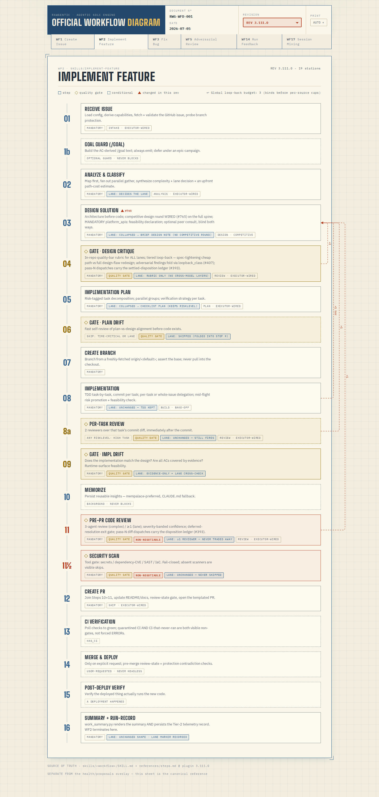

# rawgentic

**9 SDLC workflow skills + 12 workspace management + 1 planning skill + 2 security skills + hooks for Claude Code**

[](LICENSE)
[](https://docs.anthropic.com/en/docs/claude-code)

---

## What is Rawgentic?

Claude Code is powerful but unstructured. Complex tasks — building features, fixing bugs, running security audits — need consistent quality gates, test-driven development, and deployment verification. Without guardrails, it's easy to skip code review, forget to run CI, or merge without testing.

**Rawgentic** provides 24 skills organized in four layers (six little-used workflows were deprecated at v2.60.0 — #160 — and removed at v3.0.0; see `docs/upgrade-3.0.md`):

- **Workspace management** (12 skills) — Project registration, configuration, session binding, guard exception management, opt-in operating-charter installation, session-registry housekeeping, full-text session-history recall, gated pane handoff to a fresh session, epic-child revalidation against a moved `main`, and three supervision commands (`away`, `sleeping`, `back`) that declare whether anybody is watching the session
- **SDLC workflows** (9 skills) — Multi-step guided processes with quality gates, code review, CI verification, and deployment, plus a post-run `run-feedback` self-assessment (WF14), a telemetry-driven epic post-mortem (WF19), and human-gated session-history mining (WF17)
- **Planning** (1 skill) — A lightweight `interview` skill for pre-build requirements discovery
- **Security & infrastructure** (2 skills + hooks) — Whole-tree security scanning, security pattern syncing, dangerous pattern blocking, per-project WAL logging, session binding enforcement, and cross-project file guards

All workflow skills share a **config-loading protocol** that reads project configuration from `.rawgentic.json` — no hardcoded constants, no CLAUDE.md templates, no filesystem probing.

**Philosophy:**

- **Config-driven** — All project details come from `.rawgentic.json`, not guesswork
- **Reproduce-first TDD** — Write failing tests before fixing code
- **Shift-left critique** — Quality gates run BEFORE implementation, not after
- **Conventional commits** — `<type>(scope): <desc>` matching branch prefix
- **Triple-gate testing** — Local tests, CI (GitHub Actions), post-deploy E2E

---

## Workflow Diagram

The **official, versioned workflow diagram** — every workflow's spine with clickable
per-station drill-down, a REV selector over historical WF2 spines, and loop-back
budgets drawn as return arcs. Click through to the interactive version.

<a href="docs/workflow-diagram.html">
  <picture>
    <source media="(prefers-color-scheme: dark)" srcset="docs/assets/workflow-diagram-dark.png">
    <source media="(prefers-color-scheme: light)" srcset="docs/assets/workflow-diagram-light.png">
    
  </picture>
</a>

*Snapshot of the WF2 sheet. The interactive diagram is **live** at
**[3d-stories.github.io/rawgentic](https://3d-stories.github.io/rawgentic/)** (also
[in-repo](docs/workflow-diagram.html)) — it covers WF1 / WF2 / WF3 / WF5 with per-station
detail and version history. See [docs/workflow-diagram.md](docs/workflow-diagram.md) for
the update recipe.*

---

## Contents

- [Workflow Diagram](#workflow-diagram) · [Quick Start](#quick-start) · [Prerequisites](#prerequisites)
- [Skills](#skills) — [Workspace Management](#workspace-management) · [Planning](#planning) · [SDLC Workflows](#sdlc-workflows) · [Security & Infrastructure](#security--infrastructure) · [Multi-Project Concurrent Sessions](#multi-project-concurrent-sessions)
- [Configuration](#configuration) — [`.rawgentic.json`](#project-config-rawgenticjson) · [Protection Levels](#protection-levels) · [Workspace File](#workspace-file-rawgentic_workspacejson) · [Config-Loading Protocol](#config-loading-protocol)
- [Architecture](#architecture) · [How It Works](#how-it-works) (Principles · Quality Gates · Run-Record Telemetry · Invariants)
- [Troubleshooting](#troubleshooting) · [Design Documentation](#design-documentation) · [Testing](#testing)
- [Headless Mode (retired)](#headless-mode-retired) · [Contributing](#contributing) · [Changelog](#changelog) · [License](#license)

---

## Quick Start

> **Prerequisites:** Ensure you have Claude Code CLI, **Python 3.10+**, GitHub CLI (`gh`), Git, and jq installed.
> Optional add-ons (superpowers, Codex CLI, security scanners) unlock specific features — see [Prerequisites](#prerequisites) for the required/optional split and what each one gets you.

### 1. Install

#### Claude Code

```bash
claude plugin install rawgentic@rawgentic
```

#### Private Codex marketplace

Phase 1 exposes rawgentic's existing skills in Codex through a private repo-local marketplace. From the rawgentic repository root, add the marketplace and restart Codex:

```bash
codex plugin marketplace add .
```

Then open `/plugins`, choose **Rawgentic Private**, install **Rawgentic**, and start a new Codex thread. Invoke skills through Codex's skill picker or by naming the skill directly, for example:

```text
$rawgentic:create-issue Add user authentication
$rawgentic:implement-feature 1
$rawgentic:fix-bug 2
```

Codex hook support is planned for Phase 2. Until then, the Codex package provides the workflow skills only; Claude Code remains the hook-supported runtime for WAL, session binding, and security guards. The Codex manifest and private marketplace are structured for eventual public marketplace publication.

### 2. Set up your workspace

Launch Claude Code from the directory you want as your workspace root:

```bash
mkdir my-org-workspace && cd my-org-workspace
claude
```

Then inside the Claude session:

```
/rawgentic:new-project my-app
```

This creates the workspace structure, clones or initializes the repo, scaffolds the workspace CLAUDE.md, and runs `/rawgentic:setup` to auto-detect your tech stack.

**Importing existing projects:** Register a project that already exists elsewhere on disk:

```
/rawgentic:new-project my-existing-app
```

When the project isn't found in the workspace, `new-project` asks whether to create a new folder or link to an existing one. Choose "link" and provide the path — the project is registered in the workspace JSON without copying or moving files. External projects are stored with their absolute path.

### 3. Start using workflows

```
/rawgentic:create-issue Add user authentication
/rawgentic:implement-feature 1
/rawgentic:fix-bug 2
```

### 4. Add more projects

```
/rawgentic:new-project my-api
/rawgentic:switch my-api
```

Multiple projects can be active simultaneously. Use `/rawgentic:switch` to bind a session to a specific project. Each project gets its own `.rawgentic.json` config, WAL log, and session notes.

---

## Prerequisites

### Required

Rawgentic won't function without these — the workflow skills and hooks depend on them directly.

| Requirement      | Check               | Install                                                         |
| ---------------- | ------------------- | --------------------------------------------------------------- |
| Claude Code CLI  | `claude --version`  | [Install guide](https://docs.anthropic.com/en/docs/claude-code) |
| Python 3.10+     | `python3 --version` | `apt install python3` / `brew install python`                   |
| GitHub CLI       | `gh auth status`    | `brew install gh` / [gh install](https://cli.github.com/)       |
| Git              | `git --version`     | [git-scm.com/downloads](https://git-scm.com/downloads)          |
| jq (JSON processor) | `jq --version`   | `apt install jq` / `brew install jq`                            |

**Python** runs every hook and the per-skill config engine (`hooks/capabilities_lib.py`, which all 12 workflows shell out to) — 3.10+ is required (the hooks use `X | None` type syntax); CI runs on 3.12. **`gh`** drives all issue/PR operations. **`jq`** is used throughout the shell hooks. (The run-record / completion summary uses Python's built-in `json` — no separate JSON formatter to install.)

### Optional

Each add-on unlocks a specific capability. Rawgentic runs without them — you just lose (or degrade) the feature noted.

| Add-on | Check | Install | What it unlocks — and what you lose without it |
| ------ | ----- | ------- | ---------------------------------------------- |
| **superpowers** plugin | `/superpowers:brainstorming` | `claude plugin add superpowers@claude-plugins-official` | Structured **brainstorming / design exploration** (WF12 test-strategy design; complex-feature design). **Without it:** rawgentic falls back to lighter inline brainstorming — still works, less rigorous. |
| **Codex CLI** | `codex login status` | [install + authenticate ↓](#cross-model-review-data-handling-codex) | **Cross-model adversarial review + peer consult** — an independent, *different-model* second opinion (WF5) or design proposal (WF13): the `/rawgentic:adversarial-review` and `/rawgentic:peer-consult` skills, plus the opt-in cross-model gates in WF1–WF4 and WF2 Step 3. Backend-selectable (#403): `gpt` (this Codex CLI, default), `glm` (Zhipu GLM via `pip install "zhipuai>=2.1.5"` + `ZHIPUAI_API_KEY` — a z.ai Coding Plan subscription key works), or `both` (two independent reviews/proposals; degrades to the ready backend with a PARTIAL exit 5). **Without any ready backend:** WF5/WF13 error out and any opt-in cross-model gate is skipped; you still get the same-model in-repo quality-bar self-review. |
| **Security scanners** (gitleaks, semgrep, osv-scanner, trivy) | `bash scripts/install-scanners.sh --check gitleaks semgrep osv-scanner trivy` | Auto-provisioned by `/rawgentic:setup` and once in the background on first plugin use (opt-out: `RAWGENTIC_SKIP_SCANNER_INSTALL=1`) | The **tool-based security scan** in WF2 Step 11.5 and WF9 (secrets / dependency-CVE / SAST / IaC misconfig). **Without them:** each missing scanner is a *visible skip* (never a silent pass) — the LLM security review still runs, but concrete known-pattern issues (leaked tokens, CVE'd deps) aren't caught. |

> **Contributing / running the tests** also needs `pip install pytest` (plus `jsonschema` for the adversarial-review schema tests, which otherwise skip). These are dev-only — not needed to *use* the plugin. See [Testing](#testing).

---

## Skills

### Workspace Management

| Skill                       | Purpose                                              |
| --------------------------- | ---------------------------------------------------- |
| `/rawgentic:new-project`    | Register a new or existing project in the workspace. Can link to external folders without copying. |
| `/rawgentic:setup`          | Auto-detect tech stack, optional critique for complex projects, generate `.rawgentic.json` |
| `/rawgentic:switch`         | Bind this session to a project, list projects, or deactivate. Checks for config staleness and prompts for missing `defaultProtectionLevel`. |
| `/rawgentic:add-exception`  | Interactively add guard exceptions to `.rawgentic.json` when a WAL or security guard blocks a legitimate operation. |
| `/rawgentic:housekeeping` | Prune stale entries from the append-only session registry older than a configurable TTL (default 30 days, `$RAWGENTIC_REGISTRY_TTL_DAYS`); fail-safe (keeps undatable lines), previews before writing. WAL rotation is handled automatically by session-start. |
| `/rawgentic:pane-handoff` | Pass this session's work to a fresh guarded successor pane (#700). Splits a pane, starts a fresh session, then delivers three separately-verified turns — the project bind (gated on the session-registry row), the work prompt (gated on its marker reaching the successor's transcript), and `/goal` last (gated on the `met:false` row) — via one `launcher_lib ad-hoc-handoff` call, never hand-driven primitives. Retiring your own pane is the DEFAULT (owner decision 2026-07-29) — the goal is cleared and the clear confirmed before the pane closes, the pane must provably host your session, and an unconfirmed clear leaves it open; `--no-teardown` opts out for an additive handoff and says so loudly, because your `/goal` stays armed. Requires `HERDR_ENV=1`. |
| `/rawgentic:revalidate-children` | Re-check an epic's remaining child issues against a freshly observed `origin/main` after a merge, and write the receipt that lets the driver hand out the next child (#840). Mechanises the 2026-08-02 audit that found **14 of 23** open children carrying rotted claims. Every stamp carries evidence — the claim quoted from the body, what it was checked against, and what the check found; an empty `claims` list is refused, which is what stops a pass that validates nothing. Corrections are posted as COMMENTS and never edit an issue body, and an obsolete child is marked for an owner decision rather than closed. |
| `/rawgentic:session-recall` | Full-text search over past Claude Code session history (all projects) via a local SQLite FTS5 index (`hooks/session_index.py`: incremental `index`, provenance-carrying `search`, freshness `status`). Derived, rebuildable, gitignored store; explicit invocation only — no hooks, no daemon. Rebuild needs disk headroom ≈ 2× the final DB size. |

### Planning

| Skill                  | Purpose                                              |
| ---------------------- | ---------------------------------------------------- |
| `/rawgentic:interview` | Interview-style requirements discovery **before** building. Identifies the core problem, who it is and isn't for, and key implementation decisions, then summarizes an implementation spec for confirmation (and offers to save it). Lightweight — no config-loading or quality gates; complements deeper design exploration. |

### SDLC Workflows

| Workflow                 | Skill                          | Steps | Use When                                            |
| ------------------------ | ------------------------------ | ----- | --------------------------------------------------- |
| Issue Creation           | `/rawgentic:create-issue`      | 5     | Planning a feature or reporting a bug               |
| Feature Implementation   | `/rawgentic:implement-feature` | 16    | Building a new feature from a GitHub issue          |
| Bug Fix                  | `/rawgentic:fix-bug`           | 14    | Fixing a bug with reproduce-first TDD               |
| Adversarial Review       | `/rawgentic:adversarial-review`| 5     | Cross-model critique of a design/spec/plan/PRD/ADR/RFC/README artifact |
| Incident Response        | `/rawgentic:incident`          | 14    | Production incident: stabilize first, then RCA      |
| Peer Consult             | `/rawgentic:peer-consult`      | 5     | Independent cross-model design proposal for a problem/spec artifact |
| Run Feedback             | `/rawgentic:run-feedback`      | 5     | Post-run assessment of the workflow machinery itself (WF14) |
| Session Mining           | `/rawgentic:session-mining`    | 5     | Mine session history for recurring skill/command candidates — detect→queue→propose→human gate (WF17). Report-only; accepted candidates route to WF1; recurrence ≥ 3 distinct sessions |

<details>
<summary><strong>Issue Creation (WF1)</strong> — 5 steps</summary>

**Purpose:** Turn a raw feature/bug request into a clean, template-conformant GitHub issue on the right repo. A lean helper — no multi-agent critique; its quality bar (no hallucinated components, no fabricated criteria, bound an over-broad ask) is applied inline while drafting.

**Invocation:** `/rawgentic:create-issue Add dark mode support to the dashboard`

**Key Features:**
- Config-driven repo targeting (issue lands on the project's configured repo)
- Duplicate detection via `gh issue list` before creation
- Codebase grounding — referenced components are verified to exist (Serena MCP or Grep/Glob)
- Conventional `feat(scope):` / `fix(scope):` titles, template conformance
- Optional default-off cross-model adversarial review of the draft (opt-in per project)

> Slimmed from a 9-step multi-agent workflow after head-to-head evals showed a current model produces an equivalent issue without the critique pipeline, at ~⅓ the time/tokens (see `skills/create-issue-workspace/`).
</details>

<details>
<summary><strong>Feature Implementation (WF2)</strong> — 16 steps</summary>

**Purpose:** Take a GitHub issue and implement it end-to-end with TDD, code review, and deployment.

**Invocation:** `/rawgentic:implement-feature 155`

**Key Features:**
- Config-driven: TDD mode when tests configured, Implement-Verify mode when not
- 4-agent code review (general, security, performance, test coverage)
- **Step 11.5 tool-based security scan** (pre-PR gate): runs gitleaks (secrets, diff-scoped), an SCA dependency-CVE scan (osv-scanner → npm/pip-audit fallback), semgrep SAST, and trivy IaC (Docker projects) via the shared `hooks/security_scan.py` lib — fail-closed on a real finding, visible-skip when a tool is absent
- **Step 11 opt-in cross-model diff review**: when `adversarialReview.workflows` includes `implement-feature` and the change touches a security surface (a high-risk path pattern, or a plan task marked `riskLevel: high`), runs an additional cross-model adversarial review of the code diff (WF5's `diff` type, refutation lens) alongside the 4-agent review — report-only, non-blocking, 4-state marker (`findings_present`/`no_findings`/`failed`/`skipped`)
- **Small-standard lane**: a middle tier between the `<trivial-work-check>` exit and the full 16-step spine, for `simple_change`/`standard_feature` changes touching ≤7 impl files (tests/docs excluded from the count). **#225 adds two lane-election paths for bounded >7-file changes**: a *secondary signal* (2–3 separately-understood defects, each ≤7 impl files, total ≤21 — `defect_file_counts` on `lane_decision`, fail-closed on malformed/over-bound input, per-defect counts logged verbatim) and an *operator override* (interactive "Force lane" choice; headless `RAWGENTIC_WF2_FORCE_LANE=1`); the arch-change/migration/new-dep guards and a `complex_feature` tag remain unbypassable by both, and elected runs log a sanctioned count that Step 9's lane-widened cross-check compares against. Keeps TDD, Step 8a, Step 11 review, Step 11.5 security scan, and CI/PR/merge unchanged; collapses Step 3 to a brief design note, Step 4 to reflect-only, Step 5 to a checklist plan, and Step 9 to evidence-only; skips Step 6 entirely. `small_standard_lane_eligible` is the canonical predicate (`fast_path_eligible` survives as a deprecated alias)
- Parallelized analysis (Step 2) and review (Step 4) phases for lower latency
- **Upfront path-cost estimate (#224)**: Step 2 emits `Path estimate: full spine ≈ N agents (~M min); small-standard lane ≈ K agents (~L min)` before the lane choice — derived via `plan_lib.estimate_agents` (lane-keyed Step-11 term 3 vs 1, 2×high-risk-task Step-8a term, opt-ins; parallel-stage wall model; `WF2_EST_MINUTES_PER_AGENT` env-tunable), high-risk projected as an explicit lower bound from the path allowlist, refreshed at Step 5 with the real tagged count, logged unconditionally (headless-safe marker)
- **Tiered design loop-back (#223)**: Step-4 Critical/High findings carry a `Loopback-class` tag — an all-`spec-tightening` set (wording, stale anchors, internal contradictions) takes a cheap in-gate pass (amend + ONE incremental verifier over only the changed sections, no Step-3 return, source `spec_tighten`, max 2) instead of a full redesign; any `design-flaw`, untagged, or adversarial-sourced Critical/High folds fail-closed to the full `design` path
- Global loopback budget of 3 across all retry loops (five sources: design ×2, spec_tighten ×2, tdd/review/review_design ×1)
- Learning config: updates `.rawgentic.json` when new patterns discovered

Since v2.61.0 (#158), the WF2 skill itself loads as a ~295-line spine with on-demand references (one `references/step-<N>.md` per step since #874, plus `state-and-resume.md`, `run-record.md`) instead of a 1,600-line monolith — progressive disclosure that shrinks the context paid on every invocation. All gates are preserved verbatim and drift-guarded via the `tests/corpus.py` helper.
</details>

<details>
<summary><strong>Bug Fix (WF3)</strong> — 14 steps</summary>

**Purpose:** Fix bugs using reproduce-first methodology with a failing test before any fix.

**Invocation:** `/rawgentic:fix-bug 42`

**Key Features:**
- Reproduce-first: failing test MUST exist before code changes
- Complexity escalation: 10+ file fixes upgrade to WF2
- Verify mode when no test framework configured
- Security finding support: auto-detects STRIDE-format issues from WF9
- Pre-flight dependency check before first test run
- Respects project-level merge approval rules

Since v2.62.0 (#159), the WF3 skill itself loads as a ~224-line spine with on-demand references (`references/steps.md` for per-step detail, `incident.md`) instead of a monolith — progressive disclosure that shrinks the context paid on every invocation. `references/incident.md` carries the deprecated WF11 comms/post-mortem checklist for incident-severity bugs, absorbed in the WF11 merge. All gates are preserved verbatim and drift-guarded via the `tests/corpus.py` helper.
</details>

<details>
<summary><strong>Adversarial Review (WF5)</strong> — 5 steps</summary>

**Purpose:** Cross-model adversarial critique of a TEXT artifact (design, spec, plan, PRD, ADR, RFC, README) — or, opt-in, a code DIFF — using an independent reviewer via the Codex CLI. Report-only.

**Invocation:** `/rawgentic:adversarial-review docs/design/feature.md`

**Key Features:**
- Different-model second opinion (complements the same-model in-repo quality-bar self-review)
- **`diff` artifact type** — reviews a unified git diff with a refutation lens (hunts fail-open guards, silently-passing error paths, weakened security checks); same fail-closed engine, plus an optional `--findings-json` sidecar for embedded consumers like WF2 Step 11
- Report-only — writes `docs/reviews/<slug>-<date>.md`, never edits the artifact
- **Grounded, high-precision findings** — each carries a verbatim `evidence` quote from the artifact plus a `confidence`; an explicit severity rubric curbs inflation, so reports stay short and verifiable instead of padded with generic best-practice nitpicks
- **Reproducible reviewer** — pins reasoning effort high (`RAWGENTIC_ADV_REVIEW_EFFORT`) instead of silently inheriting whatever `~/.codex/config.toml` defaults to (gpt-5.5 defaults to *medium*); runs ephemeral and independent of the project's `AGENTS.md`
- **Injection-hardened** — the artifact is wrapped in a per-run unforgeable nonce fence and treated strictly as data; embedded steering text (e.g. "rate this flawless") is reported as a finding, not obeyed
- Optionally wired into WF2 (design/plan gates), WF3, and WF1 (issue spec) per-project (all opt-in; WF3/WF1 default-off)
- Warn-only egress with secret scanning; fail-closed on any Codex error
- Requires the Codex CLI installed + authenticated. See [Data Handling](#cross-model-review-data-handling-codex).
</details>

<details>
<summary><strong>Incident Response (WF11)</strong> — 14 steps, 2 phases</summary>

**Purpose:** Two-phase incident handling: stabilize first, then root cause analysis.

**Invocation:** `/rawgentic:incident Dashboard is not loading`

**Key Features:**
- Phase A (stabilize): speed over perfection, relaxed quality gates
- Phase B (RCA): structured 5 Whys analysis (min 3 levels), preventive measures, pattern memorization
- SEV-1 through SEV-4 classification drives response urgency
- Incident tracking issue created at start, closed at completion
- Step 5 verification mandatory with evidence for SEV-1/SEV-2
</details>

<details>
<summary><strong>Peer Consult (WF13)</strong> — 5 steps</summary>

**Purpose:** Engage Codex as an independent PEER senior engineer — not a reviewer — to produce its own design proposal for a problem/spec artifact, without seeing or critiquing any proposal of yours. Report-only.

**Invocation:** `/rawgentic:peer-consult docs/design/feature.md`

**Key Features:**
- Independent proposal, not critique — complements WF5 (which reviews an existing artifact); WF13 proposes an alternative
- Report-only — writes `docs/reviews/peer-<slug>-<date>.md`, never edits the artifact or auto-applies its proposal
- Shares WF5's Codex engine (`hooks/adversarial_review_lib.py` consult mode): same egress notice, secret scanning, and reproducibility knobs
- Optionally wired into WF2 Step 3 (design) as a blind-both-ways consult, per-project opt-in via `peerConsult` (default-off; mirrors `adversarialReview`'s shape)
- Requires the Codex CLI installed + authenticated. See [Data Handling](#cross-model-review-data-handling-codex).
</details>

### Security & Infrastructure

| Skill | Purpose |
|-------|---------|
| `/rawgentic:sync-security-patterns` | Merge upstream security patterns from Anthropic's official plugin into local config |
| `/rawgentic:scan` | Whole-tree tool-based security scan (secrets/SCA/SAST/IaC) via hooks/security_scan.py --full — the surviving WF9 tooling |

#### Bundled Subagents

The plugin ships one subagent definition, auto-discovered from `agents/` and namespaced on install (#164, contracted in #866 M0c):

| Agent type | Role | Key properties |
|-----------|------|----------------|
| `rawgentic:rawgentic-reviewer` | Runner dispatch for review gates (WF2 Steps 4/8a/11, WF3 Step 9, WF5, WF13) | Runs exactly ONE `hooks/review_runner.py` command and reports the result path + exit code; `model: inherit`, no file-editing tools (Read/Grep/Glob/Bash — Bash is instruction-bounded, not tool-enforced) |

The cross-model review itself happens inside the runner (pinned reviewer identity, reopen-token choke point, transport policy) — the subagent only dispatches it, and never adds its own retry loop. Implementation work runs inline (D174); genuinely parallel tasks may use generic Agent-tool worktree subagents. The definition's safety properties are pinned by `tests/test_bundled_agents.py`. When worktree isolation is unavailable (the `probe-parallelism` capability reports `serial-only`), parallel dispatch gracefully falls back to non-isolated, strictly serial execution.

#### Hooks

Rawgentic includes hooks that run automatically on Claude Code events:

| Hook | Event | Purpose |
|------|-------|---------|
| `wal-pre` | PreToolUse | Logs INTENT before mutation tools execute |
| `wal-post` | PostToolUse | Logs DONE after successful execution |
| `wal-post-fail` | PostToolUseFailure | Logs FAIL after failed execution |
| `wal-stop` | Stop | Logs session end marker |
| `wal-context` | UserPromptSubmit | Injects session context (project, recent WAL activity) |
| `wal-bind-guard` | PreToolUse | Blocks tool use if session unbound with multiple active projects; blocks cross-project file writes |
| `wal-guard` | PreToolUse | Blocks dangerous production commands with per-project protection levels (sandbox/standard/strict) |
| `session-start` | SessionStart | WAL recovery, **notes size handler**, project reconciliation, security pattern staleness check, **self-healing security scanner bootstrap** (`scanner_bootstrap.py` — re-checks each startup/resume, background install of what's missing, status file), **post-update feature reconcile** (`post_update_reconcile.py`), resume context. Reads the session subtype from the `source` field |
| `notes-size-handler` | (called by session-start) | Trims session notes exceeding 800 lines to keep last 200; optionally ingests to memorypalace before trimming |
| `scanner_bootstrap.py` | (called by session-start) | Re-checks scanner presence, installs missing ones in the background, throttles retries, writes `~/.rawgentic/scanner-status.json` so a no-fire/failure is visible (opt-out: `RAWGENTIC_SKIP_SCANNER_INSTALL=1` / `installScanners: false`) |
| `post_update_reconcile.py` | (called by session-start) | On a plugin version change, turns new opt-OUT features on by default (honoring opt-outs) and nudges to run `/rawgentic:setup` — **version-aware (#184):** only when the upgrade jump crossed a feature's `since` (the version that introduced its setup step); otherwise silent marker bump. Workspace-level `"setupPrompt": false` opts out; record-once per version |
| `security-guard` | PreToolUse | Blocks writing dangerous patterns (credentials, secrets, eval) to files |
| `security-guard-check` | SessionStart | Recommends disabling the official security-guidance plugin **once** if it's enabled (record-once decision in `~/.rawgentic/security-guidance-decision`), then stays silent — no per-session nag |
| `context_meter.py` | UserPromptSubmit **+** PostToolUse **+** Stop | **Context-pressure trigger (#687, #713).** Reads the session's own transcript, expresses usage as a fraction of the context window, and injects an advisory (default 35%) then a directive (default 50%) nag — once each per session per effective window **per delivery channel**. Throttled to every 5 turns **or** 5 minutes, whichever comes first: the turn arm rides `UserPromptSubmit`, the minute arm rides `PostToolUse`, because a long autonomous run gets one prompt and then works for hours. The `Stop` arm (#713) speaks where `/goal` decides whether to re-prompt, and is narrower by design — directive tier only, only when `stop_hook_active` is true, throttle-exempt — because at `Stop` every channel that reaches the model also continues the turn. At that same point it also **INSERTS A PROSE PROMPT** into its own pane asking for the pane-handoff skill (#718) — injected text is data a model may decline, an inserted prompt is user input; bounded to once per session per window on its own `stop-insert` channel, herdr-only, project-config required, kill switch `insertPrompt`. Fail-open, but never silent about being disabled. Tunable via the `contextMeter` config block — see `docs/context-meter.md` |

**Security Guard** blocks writes containing dangerous code patterns (eval, innerHTML, pickle, os.system, etc.). Patterns are defined in `hooks/security-patterns.json`. Protection level controls which rules are active (sandbox: none, standard: 6 common patterns, strict: all). Per-path exceptions via `guards.securityExcludePaths` in `.rawgentic.json`. Uses the Claude Code `permissionDecision: deny` protocol for hard blocking (not retried).

**Security Scan** (`hooks/security_scan.py`) is the tool-based scanner shared by WF2 Step 11.5 (diff-scoped, pre-PR) and WF9 (`--full`, whole-tree audit): gitleaks (secrets), an SCA dependency-CVE scan (osv-scanner, falling back to `npm audit`/`pip-audit`), semgrep SAST, and trivy IaC for Docker projects. It is **fail-closed** — a leaked secret, a Critical/High CVE, or an installed-but-broken scanner blocks; blocking severities are tunable via `RAWGENTIC_SECURITY_BLOCK_SEVERITIES`. A scanner whose tool isn't installed is a **visible skip**, never a silent pass. `scripts/install-scanners.sh` provisions the tools (idempotent, best-effort); the session-start hook (`hooks/scanner_bootstrap.py`) re-checks presence every startup/resume and installs whatever is missing in the background (self-healing — a scanner that goes missing, or one added by a plugin update, is reinstalled automatically), recording the outcome in `~/.rawgentic/scanner-status.json`, and `/rawgentic:setup` runs it explicitly. Installs are **opt-out** (`RAWGENTIC_SKIP_SCANNER_INSTALL=1` or `"installScanners": false`), never opt-in. See `docs/security-scan.md`.

**WAL (Write-Ahead Log)** records every mutation tool call to `claude_docs/wal/{project}.jsonl`. On session resume, incomplete operations are surfaced for recovery. WAL files are per-project — each active project gets its own log. An **opt-in** migration (v2.20.0) can move session data to `~/claude_docs/`, leaving a symlink at the old workspace-relative location; it is **deferred by default** as of v2.43.0 (it had been dormant in production due to the `source`/`hook_event_name` bug, and moving data should be a deliberate choice) — enable it with `RAWGENTIC_ENABLE_CLAUDE_DOCS_MIGRATION=1`. The path is configurable via `claudeDocsPath` in `.rawgentic_workspace.json`.

**Session Notes Size Handler** — When session notes exceed 800 lines, the `notes-size-handler.py` script trims to the most recent 200 lines. Runs on both startup and compact events (mid-session safety net). Before trimming, optionally POSTs full content to a memorypalace server for ingestion (best-effort, 2s timeout). Uses `fcntl.flock()` for concurrent safety and atomic writes via `tempfile` + `os.replace()`.

**HTML Design-Artifact Lifecycle** (v2.63.0, #174; engine extracted in #807) — the `design-doc-publish` add-on renders a design/spec markdown doc into a self-contained, CSP-safe HTML artifact: inline CSS only (no external hosts or CDN links), **escape-first** (untrusted spec text is HTML-escaped before rendering, so it's safe against injection), with embedded run-record telemetry and a stamped mountain-time (`America/Edmonton`) "Last updated" datetime. WF1 renders and publishes the issue artifact and comments its URL on the issue; WF2/WF3 create-or-update `docs/planning/<issue>.{md,html}` (with telemetry) inside the feature PR before `gh pr create`. **Opt-in per project** via the `designArtifact` key in `.rawgentic_workspace.json` — default off, byte-identical behavior when unset.

Since v2.66.0 (#199) the renderer has an **opt-in `--style roadmap`** (config `designArtifact.style: "roadmap"`, default `plain`): each `##` section becomes a dashboard-style bubble card titled with a completion chip (green (done/shipped) / amber (abandoned/blocked) / neutral (planned)), derived from the section's status keywords — so a rolling campaign/roadmap log matches the hand-authored modernization dashboard. A definitive heading status wins over incidental body keywords; the chip label is drawn from a fixed vocabulary (never raw text) so it stays escape-safe, and the card CSS is injected **only** in roadmap mode, keeping `plain` output byte-identical.

**Usage/Token Telemetry Capture** (v2.65.0, #189) — `hooks/usage_capture.py` populates the run-record `usage` object with **real** per-model token/cost numbers by parsing the current Claude Code session transcript directly (the same source `ccusage` reads — stdlib-only, no network). #155 added the field but nothing filled it, so it was null in all 24 records and the yield-per-token effectiveness gate (#162) was incomputable. Capture runs at WF2/WF3 Step 16 (`capture --session-id`); historical rows are backfilled (`backfill --records`) — recovered where a session-id correlator exists, else marked `unrecoverable`. A `capture_status` controlled vocab (`{captured, unrecoverable, unavailable}`) is fail-closed, and a `captured` claim REQUIRES non-null tokens summing > 0 at the validator — so the #155 null-forever state can no longer be persisted; a drift-guard test enforces it over the committed store.

### Multi-Project Concurrent Sessions

Multiple Claude Code sessions can work on different projects simultaneously from the same workspace root.

**How it works:**
- Multiple projects can have `active: true` in `.rawgentic_workspace.json`
- Each session is **bound** to a project via `claude_docs/session_registry.jsonl`
- WAL logs are per-project: `claude_docs/wal/{project}.jsonl`
- The `wal-bind-guard` hook enforces binding and prevents cross-project file writes

**Session binding cascade:**
1. Session already in registry → use that project
2. Exactly one active project → auto-bind
3. Multiple active projects → prompt user to run `/rawgentic:switch <name>`

**Cross-project protection:** If session A is bound to `my-api` and tries to write a file under `projects/my-frontend/`, the `wal-bind-guard` hook denies the operation.

**Directory reconciliation:** On startup/resume, the `session-start` hook checks that all active projects' directories exist on disk. Missing directories are deactivated and the user is prompted to remove or re-setup.

**Security pattern staleness check:** On startup/resume, the `session-start` hook compares the sha256 hash of the official `security-guidance` plugin's pattern file against a stored marker (`hooks/.last-security-sync-hash`). If the hashes differ (or the marker is missing), a warning nudges the user to run `/rawgentic:sync-security-patterns`. Silently skips if the official plugin is not installed.

---

## Configuration

### Project Config: `.rawgentic.json`

Every project gets a `.rawgentic.json` file generated by `/rawgentic:setup`. This structured config replaces the old CLAUDE.md constants approach — all workflow skills read from this file instead of probing the filesystem.

```json
{
  "version": 1,
  "project": {
    "name": "my-app",
    "type": "webapp",
    "description": "Dashboard for analytics"
  },
  "repo": {
    "provider": "github",
    "fullName": "org/my-app",
    "defaultBranch": "main"
  },
  "techStack": [
    { "name": "typescript", "version": "5.3.3" },
    { "name": "react", "version": "18.2.0" },
    { "name": "node", "version": "20.11.0" }
  ],
  "testing": {
    "framework": "vitest",
    "command": "npx vitest run --reporter=verbose",
    "coverageCommand": "npx vitest run --coverage"
  },
  "ci": {
    "provider": "github-actions",
    "configPath": ".github/workflows/ci.yml"
  }
}
```

The full schema is at `templates/rawgentic-json-schema.json`. Sections include: `project`, `repo`, `techStack`, `testing`, `ci`, `deploy`, `database`, `infrastructure`, `documentation`, `formatting`.

### Protection Levels

The `protectionLevel` field controls which guard rules are active per project:

| Level | WAL Guards | Security Guards | Use case |
|-------|-----------|-----------------|----------|
| `sandbox` | None | None | POC / playground projects |
| `standard` | Destroy + mutate ops | 6 common patterns | Projects with some production exposure |
| `strict` | All 12 rules | All rules | Full production (default) |

Override presets with explicit `guards.wal` / `guards.security` arrays. See `docs/config-reference.md` for the full rule reference.

### Workspace File: `.rawgentic_workspace.json`

Tracks all registered projects. Created automatically by `/rawgentic:new-project`:

```json
{
  "version": 1,
  "projectsDir": "./projects",
  "projects": [
    {
      "name": "my-app",
      "path": "./projects/my-app",
      "active": true,
      "lastUsed": "2026-03-06T12:00:00Z",
      "configured": true
    }
  ]
}
```

**Multi-project:** Multiple projects can be `active: true` simultaneously. The `active` flag means the project is provisioned and available — it does not mean "this is the current session's project." Session-to-project binding is tracked in `claude_docs/session_registry.jsonl`.

### Config-Loading Protocol

All 9 config-driven skills (the active workflows plus `/rawgentic:scan`) share an identical config-loading block that runs before any workflow step:

1. Read `.rawgentic_workspace.json` → find active project (if multiple are active, stop and prompt user to `/rawgentic:switch`)
2. Load + derive: `python3 hooks/capabilities_lib.py derive --config <project-path>/.rawgentic.json` validates the config and emits `{config, capabilities}`
3. All subsequent steps use config and capabilities — never probe the filesystem

The config→`capabilities` derivation lives in **one tested place** (`hooks/capabilities_lib.py`) instead of an identical prose block duplicated across every config-driven skill + the docs table. It is fail-closed: a missing/corrupt config or a present-but-malformed optional section exits non-zero (rather than silently yielding a feature-less object), while an absent optional section yields its documented default. This means skills adapt automatically: TDD mode when tests are configured, Implement-Verify mode when they're not. No capability detection, no guessing.

### Learning Config

During workflow execution, skills may discover new information about the project (a new auth mechanism, an updated dependency version, a new documentation file). The **learning-config protocol** updates `.rawgentic.json` safely:

- **Append** to arrays (don't replace existing entries)
- **Set** null/missing fields (don't overwrite existing values)
- Always read-modify-write (never patch in place)

---

## Architecture

### Workspace Architecture

Rawgentic uses a **three-layer CLAUDE.md hierarchy** to separate personal, workspace, and project concerns:

| Layer | File | Scope | In Git? |
|-------|------|-------|---------|
| 1 — Personal | `~/.claude/CLAUDE.md` | Developer preferences, per machine | No |
| 2 — Workspace | `{cwd-root}/CLAUDE.md` | GitHub org, PAT, team process | No |
| 3 — Project | `projects/{name}/CLAUDE.md` | Project-specific instructions | Yes |

**Key principles:**
- **Projects are standalone** — Layer 3 works without rawgentic
- **Rawgentic is additive** — removing it only affects Layer 2
- **One workspace per org** — GitHub credentials scoped to workspace
- **No absolute paths** — portable across machines

The `setup` skill scaffolds Layer 2 on first run. The `new-project` skill audits Layer 3 for conformance.

See `docs/plans/2026-03-06-plugin-overhaul-design.md` for the full design.

---

## How It Works

### 15 Principles (P1-P15)

| ID  | Name                    | Summary                                                                  |
| --- | ----------------------- | ------------------------------------------------------------------------ |
| P1  | Branch Isolation        | Every workflow gets its own branch; parallel work uses git worktrees     |
| P2  | Code Formatting         | Auto-format before every commit (aspirational — no formatter is wired; this repo's style gate is pylint E-only) |
| P3  | Frequent Local Commits  | Commit after each meaningful change; never lose more than 15 min of work |
| P4  | Regular Remote Sync     | Push to remote at every natural checkpoint                               |
| P5  | TDD Enforcement         | Write tests before implementation; variant per workflow type             |
| P6  | Main-to-Dev Sync        | After merge to main, deploy to dev immediately                           |
| P7  | Triple-Gate Testing     | Gate 1: local tests, Gate 2: CI, Gate 3: post-deploy E2E                 |
| P8  | Shift-Left Critique     | Quality gates run BEFORE implementation, not after                       |
| P9  | Continuous Memorization | Curate reusable insights into CLAUDE.md                                  |
| P10 | Diagram-Driven Design   | Create/update diagrams for architectural changes                         |
| P11 | User-in-the-Loop Gates  | User approval required before merge; ambiguity stops and asks            |
| P12 | Conventional Commit     | `<type>(scope): <desc>` — type matches branch prefix                     |
| P13 | Pre-PR Code Review      | Code review BEFORE creating PR, not after                                |
| P14 | Documentation-Gated PRs | PR must document what changed, why, and how to test                      |
| P15 | Risk-stratified Review  | High-risk tasks get per-task review at commit time (WF2 Step 8a) in addition to the PR-wide review |

### Quality Gate Strategy

| Workflow                   | Critique Level     | Gate                  | When                         |
| -------------------------- | ------------------ | --------------------- | ---------------------------- |
| Setup (config detection)   | Optional quality-bar review | in-repo rubric | After detection, if complex  |
| WF1 Issue Creation         | Inline quality-bar | while drafting | During draft                 |
| WF2 Feature Implementation | Quality-bar rubric + platform-feasibility gate (+ opt-in adversarial-on-design) | in-repo rubric | After design |
| WF3 Bug Fix                | Quality-bar rubric + platform-feasibility gate | in-repo rubric | After RCA                    |
| WF5 Adversarial Review     | Cross-model        | Codex CLI \| GLM \| both (#403) | Standalone; opt-in in WF1–WF3 |
| WF11 Incident              | Quality-bar rubric | in-repo rubric | Phase B only                 |
| WF13 Peer Consult          | Independent peer   | Codex CLI             | Standalone; opt-in in WF2 Step 3 |

### Cross-Model Review Data Handling (Codex)

WF5 Adversarial Review (`/rawgentic:adversarial-review`) and its opt-in WF1/WF2/WF3/WF4
hooks, plus WF13 Peer Consult (`/rawgentic:peer-consult`) and its opt-in WF2 Step 3
integration, send the **text of the reviewed artifact to OpenAI** via the Codex CLI for an
independent, different-model critique or proposal. This is **warn-only**: a one-time egress
notice is printed before each invocation, and the engine scans the artifact for
obvious secrets (API keys, passwords, tokens, private keys), naming any detected
categories. Set `RAWGENTIC_ADV_REVIEW_BLOCK_SECRETS=1` to block egress when secrets
are found. Findings reports are written locally to `<project>/docs/reviews/` and are
never uploaded. The feature is **default-disabled** per project; existing WF1/WF2/WF3/WF4
runs are unchanged unless explicitly opted in via `adversarialReview` (WF5) or `peerConsult`
(WF13) in `.rawgentic_workspace.json`. Requires the Codex CLI installed
(`npm install -g @openai/codex`) and authenticated
(`codex login`). See [config-reference.md](docs/config-reference.md#adversarial-review-data-handling).

### Run-Record Telemetry (Tier-2 substrate)

WF2 Step 16 and WF3 (fix-bug) Step 14 no longer hand-type their completion
summaries. Instead each assembles a structured **run-record** — issue/type, change
volume, tests, each quality gate's *findings caught vs resolved*, security-scan
status, loop-backs, and the PR/CI/deploy outcome — and drives
`hooks/work_summary.py`, which renders the standardized "WF*N* COMPLETE" block
**and** appends the record as one JSON line to
`<project>/docs/measurements/run_records.jsonl` (override via `--store` or
`RAWGENTIC_RUN_RECORD_STORE`) — this rawgentic repo commits its own store at
`docs/measurements/run_records.jsonl`. The fields are a **uniform core** so the
Tier-2 A/B measurement harness can aggregate across workflows, plus an optional
`extra` list for workflow-specific lines (e.g. WF3's Root Cause / Fix) and an
optional `usage` object (input/output tokens, cost estimate, wall clock,
per-model mix) for token/cost telemetry — backfilled from
[`ccusage`](https://github.com/ryoppippi/ccusage) when not captured at run
time. Each gate entry also carries an optional `reviewer_kind` (`inline` /
`reflexion` / `builtin_code_review` / `codex` / `hand_rolled_multi`) recording
which reviewer produced it. The store is **fail-closed** (a record failing
validation is never persisted) while the human summary renders best-effort (a
schema nit never costs the user their completion output). See
[run-records.md](docs/run-records.md).

Once runs accumulate, `work_summary.py aggregate --store <path>` rolls the store
up into Tier-2 metrics — per-gate effectiveness (hit rate, findings caught vs
resolved), loop-back behavior, outcome rates (CI/merge/deploy/security), and
effort means — with `--json`, `--group-by {workflow,version,type,complexity}`
(version is the cross-skill A/B slice), and `--since <ISO date>`. The reader is
fail-closed: a corrupt or schema-invalid store line is excluded with a visible
count, never silently averaged in.

### Shared Invariants

1. **Config-loading protocol** — All workflow skills read `.rawgentic.json` before executing
2. **Ambiguity Circuit Breaker** — STOP and ask user when findings conflict
3. **Finding Auto-Application** — Apply ALL quality gate findings automatically
4. **Workflow Resumption** — Checkpoint artifacts for mid-workflow recovery
5. **Session Notes** — Continuous documentation in `claude_docs/session_notes/<project>.md` (auto-created by setup/new-project, auto-registered by WAL hooks). The size handler trims notes exceeding 800 lines to the most recent 200 on startup and each context compaction. A per-project **handoff** (`claude_docs/session_notes/<project>.handoff.md`) is injected by `session-start` for the bound project on startup/resume/clear and surfaced as the write target — so handoffs stay scoped per project instead of sharing the workspace-level remember-plugin handoff (see [session-notes.md](docs/session-notes.md#per-project-handoff)).
6. **Commit Convention** — `<type>(scope): <description>` matching branch prefix
7. **Branch from default** — All branches from `origin/<defaultBranch>` (read from config)
8. **Squash merge** — All PRs use `gh pr merge --squash`
9. **Deploy to dev only** — Workflows deploy to dev; production is outside scope

---

## Troubleshooting

| Problem                          | Cause                                         | Solution                                                      |
| -------------------------------- | --------------------------------------------- | ------------------------------------------------------------- |
| "No rawgentic workspace found"   | First-time user                                | Run `/rawgentic:new-project` to register your first project   |
| "Config missing — run setup"     | Project registered but not configured          | Run `/rawgentic:setup` on the active project                  |
| Config version mismatch          | `.rawgentic.json` has wrong version            | Run `/rawgentic:setup` to regenerate config                   |
| Workflow resumes at wrong step   | Context compacted mid-workflow                 | Re-invoke the skill — resumption protocol detects state       |
| CI verification hangs            | `gh pr checks` doesn't work with fine-grained PATs | Skills use `gh run list` instead (already handled)        |
| Ambiguity circuit breaker fires  | Quality gate found conflicting findings        | Expected — review findings, tell Claude how to proceed        |
| Workflow upgrades to WF2         | Bug fix classified as complex (10+ files)      | Expected — complex bugs get the full feature workflow         |
| Context runs out mid-workflow    | Long workflow exceeded context window          | Skills document state before compaction — re-invoke to resume |
| Stop hook blocks every response  | Session not registered with real session ID    | Fixed in v2.3.0 — `wal-context` auto-registers on first prompt |
| "Multiple projects active"       | Multiple projects have `active: true`         | Run `/rawgentic:switch <name>` to bind this session            |
| "Session isn't bound to a project" | Unbound session with multiple active projects | Run `/rawgentic:switch <name>` to bind                        |
| Cross-project write denied       | File path is in a different project            | Switch first with `/rawgentic:switch <target>`, or ask user   |
| Hooks fail after `cd` in Bash    | CWD drifted to project subdir, workspace file not found | Fixed in v2.5.3 — hooks now traverse up to 5 levels |
| Hook errors after plugin update  | Session still references old cache path        | Exit session, reinstall plugin, start new session              |
| Marketplace "Sync Failed" (no detail) | Stale server cache or rate limit            | Remove plugin from org marketplace, wait 60s, re-add          |
| Marketplace `failed_content` with "Duplicate skill name" | Two `SKILL.md` files under `skills/` declare the same `name:` | Rename dev snapshots to `SKILL.snapshot.md` (validator only finds `SKILL.md`) |
| Marketplace version conflict     | `marketplace.json` plugin entry has a `version` field that differs from `plugin.json` | Remove `version` from plugin entry; use `metadata.version` at top level instead |

---

## Design Documentation

The `docs/` directory contains detailed design documentation for contributors:

- **[Principles](docs/principles.md)** — quarantined historical design rationale (2026-03 planning artifact); its top-of-file STATUS table is the authoritative per-principle enforcement record, mirrored against the P-table above by a drift guard
- **[Consolidation](docs/consolidation.md)** — Step archetype mappings, shared protocol, principle coverage matrix
- **[Multi-Issue Driver](docs/multi-issue-driver.md)** — the documented pattern for running an autonomous backlog: loop WF2 fresh per issue over a durable queue, with a DEFER taxonomy, rollback anchors, dependency-DAG ordering (`hooks/driver_lib.py`), an epic anchor, and a resumption contract. State schema + examples in `docs/driver-state/`.
- **Design documents** (in `docs/design/`):
  - [Multi-Issue Driver design (#134)](docs/design/2026-07-04-multi-issue-driver.md)
  - [Issue Creation (WF1)](docs/design/workflow-issue-creation.md)
  - [Feature Implementation (WF2)](docs/design/workflow-feature-implementation.md)
  - [Bug Fix (WF3)](docs/design/workflow-bug-fix.md)
  - [Refactoring (WF4)](docs/design/workflow-refactoring.md)
  - [Adversarial Review (WF5)](docs/design/workflow-adversarial-review.md)
  - [Documentation (WF7)](docs/design/workflow-documentation.md)
  - [Dependency Update (WF8)](docs/design/workflow-dependency-update.md)
  - [Security Audit (WF9)](docs/design/workflow-security-audit.md)
  - [Performance Optimization (WF10)](docs/design/workflow-performance-optimization.md)
  - [Incident Response (WF11)](docs/design/workflow-incident-response.md)
  - [Test Suite Creation (WF12)](docs/design/workflow-test-suite-creation.md)
  - [Security Guard](docs/plans/2026-03-07-security-guard-design.md)
  - [Multi-Project Concurrent Sessions](docs/plans/2026-03-07-multi-project-sessions-design.md)
  - [Model Routing + Peer Consult (WF13) design](docs/design/2026-07-03-model-routing-and-peer-consult-design.md) ([visual](docs/design/2026-07-03-model-routing-and-peer-consult-design.html))
  - [Model Routing + Peer Consult plan](docs/plans/2026-07-03-model-routing-and-peer-consult.md)
  - [Dual Memory Backend (draft)](docs/superpowers/specs/2026-04-08-dual-memory-backend-design.md)
- **[Memory Source of Truth](docs/memory-source-of-truth.md)** — **mempalace is the authoritative read/write memory store** for durable facts/decisions/gotchas; `CLAUDE.md` (contract) and session notes/WAL stay in-repo because the tooling reads them directly; the auto-memory dir is a secondary bootstrap mirror. How mempalace is fed (PreCompact fork + WF2 Step 10) and worked with (CRUD tools + recall protocol).
- **Planning documents** (in `docs/planning/`):
  - [Workflow Modernization Review (2026-07)](docs/planning/2026-07-04-workflow-modernization-review.md) ([visual](docs/planning/2026-07-04-workflow-modernization-review.html)) — 12-AC findings: model-routing topology verdict, /goal + multi-issue design, skill restructure, plugin dispositions, deprecation audit
  - [Workflow Modernization Roadmap](docs/planning/2026-07-04-workflow-modernization-roadmap.md) — 4 milestones (M1 instrument → M2 restructure/v3.0.0 → M3 multi-issue → M4 headless); issues filed under epics #167–#170
  - [Issue #162 Data-Gate Decision (2026-07-05)](docs/measurements/2026-07-05-issue-162-data-gate-decision.md) — review-switch abandoned per its own AC4 data gate (candidate arm 0 runs vs ≥10 required, token telemetry null); deferral pending telemetry, not a rejection of built-in `/code-review`
- **[Run-Records](docs/run-records.md)** — Per-run structured run-record schema + store + the `work_summary.py` CLI (WF2 Step 16; Tier-2 telemetry substrate)
- **[Testing](docs/testing.md)** — Test suite overview, hook test descriptions, skill evaluation methodology
- **Diagrams** (in `diagrams/`): Excalidraw visual diagrams for each workflow and the framework architecture

---

## Testing

All hooks are tested via subprocess black-box testing using pytest. Tests invoke hooks as subprocesses, piping JSON to stdin and asserting on stdout, exit code, and filesystem side effects.

```bash
# Run the full test suite
pytest tests/ -v

# Run a single test file
pytest tests/hooks/test_wal_guard.py -v
```

**1,400+ tests** across the hook + skill-helper modules. See [docs/testing.md](docs/testing.md) for full details.

**Drift-guard corpus:** prose-pinning guards assert over a skill's *corpus* — `SKILL.md` plus `references/*.md` — via `tests.corpus.skill_corpus()`, so restructuring prose into `references/` never silently un-pins a guard. Location-specific pins (frontmatter, base-file pointers) still read their exact file. See [docs/testing.md](docs/testing.md#drift-guard-corpus-testscorpuspy).

**CI:** GitHub Actions runs `pytest tests/ -v` on all PRs to `main` (`.github/workflows/ci.yml`). SDLC workflows also run tests automatically when `.rawgentic.json` has a `testing` section configured.

**CI security review lane:** PRs to `main` also get a semantic security review from [anthropics/claude-code-security-review](https://github.com/anthropics/claude-code-security-review) (`.github/workflows/claude-security-review.yml`) — findings post as PR review comments. The lane is **non-blocking** (advisory) until it accrues 10 clean-signal PRs, at which point it can be promoted to a required check (promotion must also remove `continue-on-error`). It requires a `CLAUDE_API_KEY` repo secret; when the secret is unset the run emits a visible "review SKIPPED" warning rather than a fake clean signal. This complements the local Step 11.5 scanners (`hooks/security_scan.py`) — it replaces nothing.

**Impact measurement:** `scripts/wf2_impact_metrics.py` computes deterministic Tier-1 impact metrics (test growth, fail-closed coverage, dedup, diff volume) for a skill-extraction effort over a `--baseline`/`--head` git range. See [docs/measurements/2026-06-15-wf2-extraction-impact.md](docs/measurements/2026-06-15-wf2-extraction-impact.md) for the WF2 extraction analysis.

Skills are tested via the `/skill-creator` eval pipeline (11/24 skills have evals.json files, in `skills/<skill>-workspace/evals/` or the skill's own `evals/` directory; the lightweight `add-exception`, `away`, `back`, `epic-post-mortem`, `housekeeping`, `interview`, `revalidate-children`, `run-feedback`, `scan`, `session-mining`, `session-recall`, and `sleeping` skills have none, and `peer-consult` ships an empty stub — `skills/peer-consult/evals.json` — pending eval authoring). The fraction and the have-none list are computed from disk by a drift guard. The eval data is also read by the **behavioural selection gate** (`hooks/skill_evals.py`, #928): `discover` reports every file's cases and their intents (`trigger` / `slash` / `refuse`), and a live verdict is a documented manual gate — see `docs/skill-evals.md`.

**Workspace directories:** Some skills have a corresponding `*-workspace/` directory (e.g., `skills/setup-workspace/`) used for internal skill iteration and evaluation. These contain `evals/`, `iteration-N/`, and `skill-snapshot/` subdirectories. They are **excluded from marketplace installs** via the `skills` whitelist in `marketplace.json`. If you add a new workspace directory, never name a file `SKILL.md` inside it — the marketplace validator scans for that filename recursively and will reject duplicates.

---

## Supervision state (replaces headless mode)

The headless orchestration mode — the session-start access gate, the GitHub-comment
QUESTION/suspend protocol, and the label-triggered Action pilot — was **retired in the M0
executor retreat (#866, M0d)**. Its last remnant was a bare environment variable that
meant only "nobody is watching", with no way to say whether the owner was reachable, and
no way for a session to clear it. **That variable is retired as of #943**; nothing reads
it, and setting it now has no effect.

In its place, supervision is **declared**, in
`<workspace>/claude_docs/.supervision.json`:

| Command | Meaning |
|---|---|
| `/rawgentic:away [until]` | absent, still reachable by phone |
| `/rawgentic:sleeping <wake time>` | unreachable until a stated time (required) |
| `/rawgentic:back` | watching again — the ONLY thing that lifts the guards |

Two guards read it, and they fail safe in **opposite** directions, which is why there are
two predicates rather than one flag:

- **`nobody-to-ask`** decides whether a context-pressure nag says "hand over" or "tell
  me". An expired declaration relaxes it — past a stated return time, assume the owner is
  back, since the only cost is which advice is printed.
- **`installs-forbidden`** decides whether missing security scanners may be
  auto-installed. An expired declaration does **not** relax it, and neither does a state
  file that cannot be parsed: installing packages is an outward act, and a clock passing a
  timestamp is not evidence anybody returned.

Blocker routing while unsupervised — texting the owner, consulting cross-model, parking a
campaign — is **not** part of this and is deliberately gated off; it lands in #947. See
`docs/supervision.md`.

---

## Private Codex marketplace

Phase 1 packages rawgentic's skills for the [Codex CLI](https://github.com/openai/codex) as a private, repo-local marketplace — same skill sources as the Claude plugin, no copy-pasting. Install from a clone of this repo:

```bash
codex plugin marketplace add .
codex plugin install rawgentic@rawgentic-private
```

`.codex-plugin/plugin.json` is the Codex manifest (`skills: "./skills/"`); `.agents/plugins/marketplace.json` is the local marketplace entry pointing at `./plugins/rawgentic`. Every skill under `plugins/rawgentic/skills/` is a symlink back to the shared `skills/<name>/` source, so Claude and Codex stay in sync automatically — no forked copies to drift.

Invoke skills Codex-style, e.g. `$rawgentic:create-issue`, instead of Claude's `/rawgentic:*` slash commands.

**Scope:** skills only. Codex hook support is planned for Phase 2 — WAL logging, security guards, and session-state tracking don't run under Codex yet. See [`docs/2026-07-02-codex-compatibility-report.md`](docs/2026-07-02-codex-compatibility-report.md) for the full phased plan.

---

## Contributing

Contributions are welcome. To get started:

1. Fork the repository
2. Create a feature branch: `git checkout -b feat/your-feature`
3. Make your changes following the conventional commit format
4. Submit a pull request

For major changes, please open an issue first to discuss the approach.

---

## Changelog

### v3.138.1 (2026-08-07)
- **A command that MENTIONS a step's needle no longer stamps that step, and the review
  input cap doubles (#963 follow-up).** Measured on the #963 run: 18 of 38 recorded
  step-transitions were stamped `Step 14 Merge` with no merge in sight, putting 2,661s —
  **30% of that run's wall clock** — under a step it never entered. The cause was raw
  substring matching in `hooks/step_state_post.py`: `grep -rn 'gh pr merge' skills/`
  stamped a merge, and so did writing a brief whose heredoc quoted the broker command.
  Every phase number in `run_records.jsonl` inherits that error, which makes the
  telemetry unusable for the optimization work it exists to serve. New pure
  `executable_text()` strips quoted strings and any heredoc body before matching, in both
  `detect_signature` and the `_may_have_signature` prefilter, so a grep no longer even
  pays for the state read. It errs toward removing text: a missed stamp leaves the prior
  position standing, while a wrong one corrupts the record. Separately,
  `adversarial_review_lib._MAX_BYTES_DEFAULT` goes 200 KB → 400 KB (owner decision
  2026-08-07): 200 KB refused a routine feature diff (#963's was 256,989 bytes, ~70% of
  it tests) and cost a full review round trip to discover, and a reviewer who cannot see
  the tests cannot judge coverage. The oversize REFUSAL is untouched (#834) — input is
  never truncated-and-continued. Tests added in `test_step_state_hook.py`
  (`TestSignaturesIgnoreQuotedAndHeredocText`) and `test_adversarial_review_config.py`
  (`TestReviewInputCap`). No workflow-spine change → no diagram REV. Suite 6192→6210.

### v3.138.0 (2026-08-06)
- **Supervised-merge broker — the #947 authority core gets its live caller, with decision
  telemetry (#963, epic #871).** New `launcher_lib.py broker-merge` runs a campaign-scoped
  merge through `evaluate_campaign` → `authority_permits` → `claim_action` →
  `begin_execution` → `gh pr merge` → probe-confirmed `mark_executed`, with
  `reconcile_claim` on anything ambiguous (rc 0 merged / 12 refused / 13 parked;
  re-running is always safe). Authorization binds to `{campaign, issue, repo, pr}` before
  authority is read, and the merge SHA only ever comes from `gh pr view`, never from the
  merge command's exit code. The deletion hole #947 deferred closes first: a new
  `.supervision.declared.json` marker, maintained in lockstep with the state record by
  every writer, makes a deleted or crash-stale declaration read `invalid` instead of
  `attended` — so `authority_permits`, `consult_check`, `installs_forbidden` and the
  claims revision fence all deny, and `supervision_admin.py bootstrap-marker` migrates a
  workspace that declared before this. New `hooks/supervision_telemetry.py` appends every
  authority decision and claim transition to `claude_docs/supervision-telemetry.jsonl`
  (flock + O_APPEND, strict before an outward action, best-effort after). WF2 Step 14 and
  the epic-run boundary invoke the broker when a campaign is active (guard tests pin the
  prose, the raw path stays for non-campaign runs), and epic-run Step 2 now records the
  `policy.merge_policy` grant the gate had been reading with nothing writing it. #947's
  finding 7 consult residual stays deferred, now refuted by measurement rather than
  budget: the proposed hardening denied a governed campaign that had not started yet.
  Tests added across `test_supervision_lib/admin/route/claims/telemetry`,
  `test_launcher_lib`, `test_step_state_hook`, `test_wf2_clarity`, `test_epic_run_clarity`.
  WF2 diagram REV 3.138.0 (station 14 delta). Suite 6087→6192.

### v3.137.0 (2026-08-06)
- **Supervision behaviour Part B: preflight, routing, claims, authority (#947, epic
  #871).** New `hooks/supervision_route.py` (`CampaignView`/`evaluate_campaign` — the
  ONE authority-evaluating function, single-constructor AST-guarded — `route_for`,
  `authority_permits`, `consult_permitted`), `hooks/supervision_claims.py`
  (revision-bound action claims, execute-once via reconcile-before-retry), and
  `hooks/supervision_preflight.py` (departure-preflight staging). `declare()` gains an
  additive `preflight_token` fold-in and `mark_transport_verified` (Hermes-cross-checked
  evidence); `driver_lib.set_supervision_override` is the tighten-only field's sole
  writer; `review_runner.py` gains `--allowed-backends`. Wired into `skills/away`,
  `skills/sleeping` (preflight sweep), `skills/back` (cancels pending claims), and this
  repo's three real `consult` call sites. A Step-6 cross-model plan review (not just the
  three-round design gate) caught a real gap the design gate couldn't see — the design's
  own §1a already committed to wiring `consult_permitted` into that ONE call site, but no
  task did — and two genuine design-level flaws with the design loop-back budget already
  exhausted: tightened `transport_verified` to require an exact session match; accepted
  the 500-token replay-cap edge case as documented risk. Step 11's full-diff review (5
  more confirmed findings, fixed: claim identity drops `blocker_id`; `claim_action`'s
  lock order now matches `begin_execution`; a corrupt supervision file denies every
  claim mint instead of reading as revision 0; the preflight staging file is sealed
  before its answers fold into a declaration; `--hermes-state-dir` defaults to
  `hermes_bridge`'s own canonical resolution) also surfaced 3 findings deferred with
  documented reasoning (one root cause: no durable, deletion-resistant marker
  distinguishes "never declared" from "declared, then the state file vanished" —
  closing it means hardening the already-merged #943 Part A, real design work the
  exhausted budget can't authorize now) and 1 refuted (an internal dataclass forgery
  concern, already defended by the module's own AST test). Full reasoning:
  `claude_docs/.wf2-state/947/dispositions.jsonl`. New
  `tests/test_askuserquestion_registration.py` guard (AC8). No workflow-spine change
  → no diagram REV. Suite 5896→6087.

### v3.136.0 (2026-08-06)
- **Claim-inventory coverage and the obsolete-child owner gate (#944, epic #871).**
  `rebuild-receipt --bodies` now refuses, before writing anything, when a revalidation record's
  claims do not cover its issue body's mechanical inventory (`extract_claim_inventory` /
  `missing_claim_coverage`, maximum bipartite matching, exact-match on ac/cause text) — the
  constructor alone had zero production callers, so this is the first REAL enforcement point
  (AC1). Restores the pending-disposition owner gate #840 cut and #848 was meant to rebuild:
  `next-child`/`handoff` now refuse a child marked `issue_obsolete` with rc 11, naming the
  `record-child-outcome` write-back remedy, in every supervision state, with no automatic
  continuation of any kind — the scan skips past a lone obsolete-pending candidate to any other
  genuinely ready child and raises only when nothing else is selectable (AC2-4). Closes the
  preflight/locked-commit race in `child_boundary_precondition` and the `_open_and_claim` recheck
  under the same lock. `skills/revalidate-children/SKILL.md` and `docs/multi-issue-driver.md`
  updated to describe the live gate and the `--bodies` contract with a fully worked example.
  no diagram REV. Suite 5888→5888.

### v3.135.2 (2026-08-06)
- **Resume launcher gets a measured-not-guessed reset clock, Part 2 (#586, epic #871).** Part 1
  (v3.135.1) shipped the measurement/lineage-check library with no caller. Part 2 wires it in:
  `overnight-resume.sh` (the workspace-root template, outside any git repo) is rewritten into a
  RECONCILER role (fired by the unchanged recurring `*/20` cron — if stale and a fresh
  `resets_at` observation exists, arms a self-removing ONE-SHOT crontab entry at `resets_at +
  60s` and returns without launching; if missing/overdue or never measured, falls back to the
  pre-#586 blind-staleness launch) and a ONE-SHOT role (removes its own crontab line first, then
  launches — a crash after that point must never leave a live cron field that could re-match
  next month/year). Session resume now reads the campaign's lineage tail from
  `claude_docs/session_registry.jsonl` and confirms it via `check_session_lineage` before
  `--resume`, instead of a session ID pinned at arm time. `.claude/skills/long-run-resume/
  SKILL.md` carries the same rewrite. AC 1's live spike is confirmed via the existing `usagebar`
  cache (fed by the same payload) rather than by touching the bridge script — a narrow edit
  adding the actual persist call was denied by the auto-mode classifier (D249/D253 precedent);
  the one-line patch is handed to the owner in the campaign log instead of silently dropped, and
  the launcher degrades cleanly to `waiting_for_reset_unmeasured` until it's applied. Also fixed
  (not backported): `grep -c PATTERN file || echo 0` doubles its output whenever the count is
  legitimately zero, which then corrupts `$(( ))` arithmetic downstream badly enough to skip an
  intended `exit` — every pre-#586 campaign script carries this idiom, harmless today only
  because none are currently enabled. No pytest surface applies (workspace-root files only);
  validated via an isolated bash harness (stub crontab, fixture registry, stub `claude`) across
  six scenarios, all passing. No workflow-spine change → no diagram REV. Suite 5804→5804.

### v3.135.1 (2026-08-06)
- **Resume launcher gets a measured-not-guessed reset clock, Part 1 (#586, epic #871).** The
  durable overnight launcher pinned a session ID at arm time, so a `/clear` minted a new ID and
  broke `--resume`. Part 1 ships the testable core only: `hooks/reset_resume_lib.py` extracts and
  validates `rate_limits.five_hour.resets_at` from a statusline-shaped payload (rejects a
  non-numeric, past, or implausibly-far-future epoch), asserts freshness on the OBSERVATION
  timestamp advancing rather than on `resets_at` changing (the wave log's measured herdr-tokens
  defect showed a value can legitimately stay constant for hours — a frozen capture, not a
  changed value, is the real failure), computes the one-shot resume epoch (`resets_at + 60s`),
  and runs the conservative session-lineage identity check before any `--continue` (any mismatch,
  tie, or empty transcript listing refuses the shortcut in favor of the generated fresh `-p`
  prompt). The scheduler wiring, the `overnight-resume.sh` template rewrite, and the watchdog-to-
  reconciler demotion are workspace-root changes outside any git repo and ship in a follow-up PR
  (D250). Step-11 cross-model review (gpt-5.6-sol) found 2 High + 3 Medium — all fixed in this
  PR: the freshness check now also bounds observation age against a live clock, the
  session-lineage docstring makes explicit that Part 2 must resume via `--resume
  <verified-tail>` immediately rather than a separately-resolved `--continue`, malformed
  payload/state shapes return clean failures instead of raising, and the `read` CLI's failure
  JSON moved to stdout to match its own documented contract.
  No workflow-spine change → no diagram REV. Suite 5762→5804.

### v3.135.0 (2026-08-06)
- **A handoff now has to say what the predecessor left running (#726, epic #871).** Every gate in
  `perform_handoff` looked FORWARD at the successor; nothing looked backward. Measured 2026-07-30: a
  handoff ran with a design re-gate still dispatched and its 15 KB verdict — 8 findings, 3 High —
  landed two minutes later in a scratchpad scoped to the session being retired, while the handoff
  reported every gate green. Three CLIs (`ad-hoc-handoff`, `handoff`, `mid-child-handoff`) now take
  `--inflight-none` or one `--inflight '<kind>:<ident>:<state>:<detail>'` per item; omission RAISES,
  a `running` item refuses and `--allow-inflight` cannot pass it, abandoning work needs the flag and
  is recorded, and an override of nothing is refused as a false audit record. It is an ATTESTATION
  gate and the code says so: probed live, the harness writes `<scratch-root>/tasks/<id>.output` per
  background task carrying only stdout — no status, no sibling — mid-run and after completion alike,
  so nothing on disk can tell a running task from a finished one. The successor's abandoned-work
  notice is written by the hook and carries a count and allowlisted kinds only; neither the caller's
  `ident` nor its `detail` reaches the prompt, because the ident charset admits
  `ignore_previous_instructions` and exclusion beats fencing. A second check refuses a resume prompt
  that points the successor at a session-scoped path — and NOT for the reason the issue gives: probed,
  `/tmp/claude-<uid>` is `0700` owned by the single host user, so a successor CAN read it; the defect
  is untracked per-session temp state tied to a session being retired. Both fail CLOSED, the opposite
  of the #731 preflight beside them, which fails open only because `agent start` is a second gate.
  On the campaign paths both run BEFORE `mark_split_attempted`, and `_classify_launch` maps the two
  new steps to `no_split_attempted`, so a refusal can never park a campaign. New
  `check-handoff-prompt` subcommand (rc 0/3/2) for callers this repo cannot edit. Three adversarial
  design passes (13 High + 5 Medium; 17 applied, 1 refuted — the reviewer's clock was stale) closed
  the gate budget-exhausted per #798. **Ships as `Part of #726`: AC 4 (automatic polling) is
  UNSATISFIED — there is nothing to poll — and `clear-prep` lives outside this repo, so it is given
  a callable check and nothing more (D247).** New `tests/hooks/test_inflight_handoff_gate.py`, 63
  cases. No workflow-spine change → no diagram REV. Suite 5698→5762.

### v3.134.0 (2026-08-06)
- **The child-boundary learnings sweep is mechanized, and it is a gate (#769, epic #871).** The
  owner's D181 standing order — *"in between each issue, make sure you revalidate future issues in
  the epic based on learnings"* — was done by hand at every boundary and named NOWHERE: a grep of
  `skills/epic-run/SKILL.md` and `docs/multi-issue-driver.md` for reassess / learnings sweep /
  boundary sweep returned zero, so a fresh-session successor could not tell whether the sweep for
  child N had run. New append-only `boundary_sweeps` driver-state field (`driver_lib`:
  `boundary_sweeps`, `sweep_eligible_children`, `record_boundary_sweep`, `boundary_sweep_status`),
  declared in `docs/driver-state/queue.schema.json` with no `schema_version` bump; three
  `launcher_lib sweep` subcommands (`begin`/`record`/`status`); and a shared **rc 8** refusal on
  both `next-child` and `handoff`. Coverage is validated as set EQUALITY against the non-disposed
  children, so a sweep that skipped a child is refused — the gate checks coverage and record
  integrity ONLY and says so in its own prose, never the quality of the judgment. Replay identity
  is `(head, after_issue)` rather than the head alone, because a deferred child moves no commit and
  two real boundaries can share one head; `--expected-head` is re-compared under the state lock so
  assessments cannot be stamped with a head that moved under them. Campaigns predating the contract
  are grandfathered (D242) — gating them would refuse work over a boundary already past. Three
  adversarial design passes (1 Critical + 7 High + 8 Medium + 1 Low; 17 applied, 1 refuted from
  source) closed the gate budget-exhausted per #798. No workflow-spine change → no diagram REV.
  Suite 5636→5698.

### v3.133.0 (2026-08-06)
- **The child boundary is now the DEFAULT, and the one-successor fence actually runs (#927, epic
  #871).** Part 2, and it is the part that makes the feature real: part 1 shipped machinery with no
  caller, so at `19925711` twelve of its functions appeared only in the module that defined them,
  there was no `transport` command of any kind, and `skills/epic-run/SKILL.md` contained the word
  `transport` zero times — AC 1, AC 2 and AC 4 had no live path at all. `_cmd_handoff` now opens the
  generation and CLAIMS before it probes, records a resolution with the pre-split pane inventory
  before any launch, marks `split_attempted` before the split, and closes with the terminal
  outcome, any transport downgrade and the claim release in one locked mutation; a second
  invocation for one boundary loses the claim and exits **rc 7** doing no campaign work, which
  closes **#845** inside this issue. Three new verbs — `transport resolve-creation` (the probed
  default, AC 1), `transport set` (AC 2, guard evaluated inside the write lock) and
  `transport unpark` (so clearing a park is a command rather than hand-editing driver-state) —
  plus advisories on both surfaces (AC 4), on **stderr** because both commands publish JSON that
  skills parse. `--herdr-available` is deleted: a caller-asserted capability is the stale answer
  this issue exists to remove. Two cross-model design passes drew 1 Critical + 11 High + 4 Medium
  (15 applied, 1 refuted with file:line evidence, dispositions in the design doc's §18/§19), the
  §11 negative `pane split` probe part 1 owed was RUN LIVE, and the four dispositions this issue
  owed are recorded on #846/#849/#850/#851. The pre-PR code review then found the fence still had a
  replay hole — the claim is per-GENERATION, and a second invocation opens its own generation, so
  two successors were reachable after the first launch returned; `child_boundary_precondition` now
  also refuses while any boundary resolution is unterminated and after a boundary for that child was
  consumed (4 High + 2 Medium, all applied). Adds 52 tests in `tests/hooks/test_launcher_lib.py` and
  `tests/hooks/test_driver_lib.py`. No workflow-spine change → no diagram REV. Suite 5584→5636.

### v3.132.0 (2026-08-05)
- **The transport model and the one-successor fence, built and tested but NOT YET WIRED (#927
  part 1, epic #871).** Read that scope line literally: this ships `hooks/` machinery with 96
  tests and **no caller** — `_cmd_handoff` is unchanged, so the boundary still behaves exactly as
  it did, and the fence does not execute until part 2 wires it. An earlier draft of this entry
  claimed the boundary "finally has" a fence; the pre-PR cross-model review caught that as a
  Critical, because the code and the claim disagreed. The one piece that IS live is the
  `session_mode` projection, which is enforced inside `_locked_state_update` and therefore active
  from this commit. `session_mode` was a hand-authored, permanent
  answer to a question whose answer changes: herdr can be present at campaign creation and gone
  by boundary four. It becomes `preferred_transport` (`pane_chain` | `inline`, durable) plus a
  per-transition EFFECT that is never stored as a field — it lives in an append-only two-event
  log, so a stale effect cannot become the next boundary's default. `transport_probe` reports its
  two tiers **separately** rather than as one verdict, and that is not cosmetic: campaign creation
  legitimately has no pane reference, so a collapsed verdict would report `inline` there and
  silently preserve the very default this issue exists to invert — an AC-1 regression the design
  gate caught before any code existed. Tier 1 (`herdr pane list`, no pane reference needed —
  `--current` is exactly what fails in a pane-less session) reuses the shape `_pane_inventory`
  already hardens; tier 2 requires the answer to BE about the requested pane, since an rc 0
  response describing a different one is not evidence about this one. **The #845 fence is BUILT
  here and wired in part 2**: the boundary and mid-child paths already shared the
  generation/claim/lease/ack machinery and differed only in a precondition, so only the
  precondition was added — no
  `kind` discriminator, because `_refuse_foreign_kind` documents that this entry point serves the
  handoff "which carries no kind at all" and would have made the boundary refuse its own record
  (D232). The riskiest branch is reconciliation, where `successor_pane: null` must NEVER be read
  as "nothing was created": with `split_attempted` recorded BEFORE the split, a null under a true
  marker is INDETERMINATE and is resolved by diffing a fresh inventory against the recorded
  `panes_before`, never by trusting the null — the Critical the cross-model design review raised
  against an earlier draft that had documented the double-launch window and called it acceptable.
  A pane is also not a running agent, so a recorded successor with no agent entry is
  `start_failed` rather than acked as alive. `session_mode` survives as a write-only projection
  enforced at the single locked writer (`_locked_state_update`), with a guard pinning that
  `_atomic_write` has exactly one call site — a second writer would bypass the projection
  silently. 96 tests added across `tests/hooks/test_launcher_lib.py` and `test_driver_lib.py`,
  including the AC-1 creation test, the indeterminate-relaunch refusal, and the
  unreadable-inventory park. The pre-PR cross-model review returned 1 Critical + 8 High + 1
  Medium, all confirmed against the code and all FIXED in this commit: a missing
  `split_attempted` marker no longer authorises a relaunch (only an explicit `False` does), an
  unreadable agent inventory parks instead of being coerced to "no agent", a duplicate
  `resolution_id` is refused, `_terminal_for` reports the LATEST outcome so an unpark cannot be
  repeated, an unrecognised transport now REMOVES a stale projection rather than leaving a
  rollback to run the opposite one, the guard fails closed on unreadable state, rc 2 is no
  longer presented as a missing pane, and the probe's default runner bounds the stream in the
  reader instead of checking length after buffering. Part 1 changes NO prose surface; the
  epic-run skill and `docs/multi-issue-driver.md` rewrite is part 2. No workflow-spine change → no diagram REV. Suite 5488→5584.

### v3.131.1 (2026-08-05)
- **Three supervision CLI tests carried a dated time bomb and broke `main` an hour after
  merging green (follow-up to #948, epic #871).** `tests/hooks/test_supervision_lib.py` and
  `test_supervision_admin.py` freeze `NOW = 2026-08-05T21:00:00Z` and derive `LATER = NOW + 2h`.
  That is correct for the in-process tests, because every one of them injects that clock. Three
  tests handed `LATER` to a CLI **subprocess** instead, and a subprocess cannot take an injected
  clock — `supervision_admin` deliberately has no `--now` override, since it gates outward
  installs — so it read the real clock. At 2026-08-05T23:00:00Z `LATER` became the past and all
  three failed permanently, not intermittently: `declare` refused with "`until` is in the past",
  `effective` reported `attended-overdue` where the test expected `away`, and `nobody-to-ask`
  inverted its exit code. CI was green at merge only because it ran before that instant. Fixed at
  the boundary rather than at the constant: `_real_future()` / `_real_past()` build every
  timestamp that crosses into `_cli` from the real clock, while the frozen `NOW` stays for the
  injected in-process calls that want determinism. A sensitivity check confirms the assertions
  still bite — inverting the helper reproduces exactly the three original failures, so the tests
  were repaired rather than hollowed out. One guard added
  (`test_no_cli_test_hands_a_frozen_future_timestamp_to_a_subprocess`), narrow by design per
  CLAUDE.md §4 mistake #6: one exact pattern, in the CLI section of the two named files. A
  repo-wide sweep for the same frozen-date-plus-subprocess shape found only
  `tests/hooks/test_registry_prune.py` and `test_step_state.py`, and both are safe — the former
  passes `--now` INTO its CLI, the latter injects into a pure function. No workflow-spine change
  → no diagram REV. Suite 5487→5488.

### v3.131.0 (2026-08-05)
- **Supervision is declared, not guessed — `RAWGENTIC_HEADLESS` is retired (#943 Part A, epic #871).**
  Three code paths asked "is anybody watching?" by reading one environment variable that could
  say only present-or-absent: it could not distinguish the owner stepping out (reachable by phone)
  from the owner asleep, and a session could not clear it, because a process cannot un-export its
  parent's environment. Replaced by a declared workspace state
  (`claude_docs/.supervision.json`) written by three new commands — `/rawgentic:away [until]`,
  `/rawgentic:sleeping <wake time>` (a wake time is required; "unreachable forever" is not a state
  to leave a run in), and `/rawgentic:back`, the only thing that lifts the guards. Split across two
  modules for a measured reason: `supervision_lib` is read-only and **stdlib-imports-only**
  (test-enforced) because `context_meter` consumes it on a hook that runs every tool call, while
  `supervision_admin` holds `plan_lib.file_lock` across the whole read-validate-increment-write
  cycle and lands via `atomic_write_text(fsync=True)`, fenced by `--expected-revision` so a write
  computed against a stale read aborts instead of clobbering a fresher declaration. **Two
  predicates rather than one flag**, because the consumers need opposite safe defaults:
  `nobody-to-ask` relaxes when a declaration expires (it only picks which advice a
  context-pressure nag prints), while `installs-forbidden` does not — installing packages is an
  outward act, and a clock passing a stated wake time is not evidence anybody returned. For the
  same reason present-but-invalid is **not** absence: `ENOENT` under a valid root is the only file
  failure read as absent, so a corrupt file — or a supplied-but-unresolvable workspace root —
  keeps refusing installs instead of a config bug inverting the guard. Also adds the additive
  top-level driver-state `campaign_wait` object (`waiting_for_owner` / `waiting_for_reset`, with
  `clears_when` required) and its `build_goal_text` campaign clause, so a Stop-hook goal loop reads
  an honest pause rather than nagging one — deliberately NOT new `issues[].status` values, since
  that vocabulary is closed and enforced twice with three further closed sets keyed off it, and
  `additionalProperties: true` permits new fields, never new values. The retirement is kept honest
  in both directions: the bare token joins `RETIRED_VOCABULARY` **and** the exact-set assertion is
  retained with an empty allowed set, so any re-introduction fails loudly. Skills 21 → 24. Blocker
  routing while unsupervised — texting, consulting, action claims, `authority_permits`, the
  departure preflight, and any behavioural consumer of `campaign_wait` — is split out to #947 and
  gated off, so an absent owner currently gets an honest park rather than an autonomous decision;
  `docs/supervision.md` says so plainly. 121 tests added across
  `tests/hooks/test_supervision_lib.py`, `test_supervision_admin.py` and
  `test_supervision_campaign_wait.py`, including the asymmetry test that fails if the two
  predicates are ever collapsed and the inert-feature regression proving a bare `/rawgentic:away`
  still guards the hook sites. No workflow-spine change → no diagram REV. Suite 5366→5487.

### v3.130.0 (2026-08-05)
- **Run-records now land exactly once (#888, epic #871).** Closes both measured halves of the
  telemetry-loss problem this issue absorbed. Dropped (#588): WF2 Step 14 gains the merge-grant
  sub-step — assemble, `usage_capture`, `summarize`, commit the JSONL line as `chore(telemetry)`,
  re-verify CI per-sha on the new head, prove it landed with `work_summary.py find --issue`, and
  only then merge — because Step 16 ran after the merge and orphaned the record when anything
  interrupted the gap (saystory epic #204 persisted 1 of 6 children). Duplicated (#355):
  `persist_record` blind-appended, so a Step-16 re-run double-recorded; it is now idempotent on a
  run fingerprint (`run_id`, else a digest excluding `generated_at`/`schema_version`/`timing` —
  `timing` because `_auto_embed_timing` recomputes it on a recovery re-run), no-ops with a
  one-line stderr notice at rc 0, and falls open to appending on an unreadable store since losing
  a record beats duplicating one — and the check plus the append now run under one `flock`, the
  shape `decision_log.append_record` already uses, so two writers cannot both miss and both
  append. Only a line that VALIDATES as a record can shadow a record, after review showed a
  `{"run_id": …}` stub could otherwise suppress the real one. Step 16 gains the `--no-persist`
  render-only path, and Step 14 proves this run's line landed with `git show --numstat` rather
  than the issue-scoped `find`, which an earlier run's record satisfies. 26 tests added in
  `tests/hooks/test_work_summary.py` + `tests/test_wf2_clarity.py`; the existing
  `test_each_line_is_independent_json` was repaired, as the guard would have left it passing on a
  single line while testing nothing it names; `references/step-14.md`'s prose ceiling was raised
  trim-first (4_975 + 256) for the genuinely new gated sub-step. No workflow-spine change → no diagram REV. Suite 5340→5366.

### v3.129.1 (2026-08-05)
- **Ad-hoc pane handoff failures now name their cause (#731, epic #906).** `perform_handoff`
  derives `failure_detail` for every `failed_step` (`record()` auto-notes failed steps from the
  herdr error body; poll and pre-split exits carry inline causes), captures the tentative pane's
  output into the report as `pane_capture` before cleanup closes it, preflights the agent name
  via `herdr agent list` and refuses `name_taken` without splitting a pane (start-time race maps
  to the same name-specific step, never retried); the pane-handoff skill's failure table routes
  operators to `failure_detail` and a fresh `--name`. Tests: injected-runner coverage for the
  preflight, the race, capture-before-close ordering, tail truncation, and every note-less
  failure exit. No workflow-spine change → no diagram REV. Suite 5303→5340.

### v3.129.0 (2026-08-05)
- **Behavioural selection gate for skill evals (#928, epic #906).** `hooks/skill_evals.py` turns
  eleven `evals.json` files from inert data into a runnable gate: `discover_eval_files` finds both
  sanctioned locations plus the skill-root spelling, `load_cases` accepts both on-disk schemas
  (`skill_name`+`evals` and the `peer-consult` stub's `skill`+`cases`), `classify_intent` separates
  the three intents already in the corpus, `skills_selected` parses a transcript for `Skill`
  `tool_use` blocks, and `judge` scores a case — with a **refuse** case counting the skill *firing*
  as the failure. The live `claude -p` spawn is an INJECTED seam, so all 49 new tests
  (`tests/hooks/test_skill_evals.py`) run in the ordinary lane; the transcript shape is measured
  against a real 1.5 MB session transcript, not guessed. Two classifier defects were found by
  running the real 38-case corpus rather than fixtures: a whole-text "does not" match called
  `pane-handoff` cases 1/4/5 refusals (inverting the gate for three dominant real phrasings — those
  negations are about what the skill does not do *internally*), and reading `slash` from
  `expected_output` matched any path-shaped token, mislabelling natural-language cases across five
  skills; `slash` now comes from the prompt, keyed on the skill's own name. Adds
  `skills/epic-run/evals/evals.json` — six cases covering the 403 description characters #909
  restored, which had never been exercised for selection, including both of that description's
  NOT-for-this-skill boundaries. Evals fraction 10/21 → 11/21. `docs/skill-evals.md` records the
  fourth AC's decision: a live verdict is a documented MANUAL gate, not a CI lane, because
  selection runs from the installed plugin cache and reinstalling while hook-using sessions live is
  prohibited (§7, mistake #5) — the same wall that stopped #909. The live end-to-end run is
  explicitly deferred, with the reason and the follow-up recorded in that doc. The Step-11
  cross-model pass (gpt-5.6-sol) returned 7 findings and all 7 were fixed, not deferred: `discover`
  now FAILS on an empty corpus instead of reporting `total cases: 0` and exiting 0; `load_cases`
  refuses a file with neither case key (truncation used to read as a deliberate stub); skill
  matching is namespace-aware, so `other-plugin:pane-handoff` can no longer satisfy a gate on
  `rawgentic:pane-handoff`; a refusal no longer passes on a dead session, and one that names the
  correct route requires that route to fire; the refusal regex is bound to clause order, so
  "Invokes pane-handoff but does not invoke clear-prep" is a trigger; and the manual procedure
  gained real containment (disposable workspace-less cwd + `--disallowed-tools`) because the corpus
  prompts are live requests and this CLI has no `--max-turns`.
  No workflow-spine change → no diagram REV. Suite 5254→5303.

### v3.128.4 (2026-08-05)
- **Milestone epics referenced from the plan (#756 follow-through, part 2).** The five milestone
  epics minted after #934 merged — #935 (M2.5), #936 (M3), #937 (M5), #938 (M6), #939 (M7) — are
  now named in the roadmap's phases block and §4 section headers, and both execution records
  (roadmap §11, disposition doc §8) note the minting; both pages redeployed. With #906 (M2) and
  #871 (M4), every milestone has a GitHub tracking surface. Docs only; no workflow-spine change →
  no diagram REV. Suite 5254→5254.

### v3.128.3 (2026-08-05)
- **Post-M1 backlog rationalization: 116 open issues dispositioned, the roadmap reordered M2-and-
  beyond (#756 follow-through).** 46 issues closed with citing comments (never-executed D174/D178
  rulings, work M0a had already shipped, subjects the retreat deleted, five superseded tracking
  epics, and epic #756 itself with its final summary); 3 duplicates folded (#660→#363,
  #588+#355→#888); 3 owner-approved decision tickets filed for fired watch-list triggers
  (#931/#932/#933); #670 reopened and transferred to claude-skills (now #156 there) after the
  cross-model diff review of this PR prompted a retest proving the wrapped-list-item defect
  persists in the successor engine — the first "verified fixed" close was wrong and is corrected
  on the issue. The roadmap doc gains an updated phases block (M2 amended: #800 shipped;
  #927/#916/#928/#923/#899 placed), new M2.5–M7 milestone sections ordered by impact, a
  refreshed §6 watch list (three triggers fired, statuses verified), §11 recording the
  rationalization, and unwrapped list items throughout so the live page renders lists intact
  until claude-skills#156 lands; the per-issue evidence ships as
  `docs/planning/2026-08-05-backlog-rationalization-post-m1.md` + `.html` (hosted). Consult:
  gpt-5.6-sol via the runner's own `consult` verb, plus a cross-model diff review (5 findings:
  4 applied, 1 declined with reason in the PR). Docs + issue hygiene only — no behavior change;
  no workflow-spine change → no diagram REV. Suite 5254→5254.

### v3.128.2 (2026-08-05)
- **The last two hand-pinned skill-count strings are now computed, finishing the #271 conversion
  (#910, epic #875).** `CLAUDE.md` §4 mistake #2 named "All 7 config-driven skills" and "6 workspace
  management" as the residue the #271 guards never reached. Nothing read those lines, so both had
  already rotted — the real counts are 9 and 9 — and the #528 run record booked exactly that drift
  as a follow-up on 2026-07-20, where it sat for fifteen days. Correcting the numbers is a forced
  consequence of guarding them, not a separate cleanup. The fix extends the checker that already
  exists rather than adding a parallel guard beside it (`hooks/skill_registration_check.py`, #528):
  `CLAUDE.md` joins `SWEEP_GLOBS` — it is not "docs" in the excluded sense but the operating manual
  a model reads as instruction — and `pin:config-driven` is promoted into `COMPUTED_FAMILIES`, so it
  is checked against the tree instead of against its own copies. That promotion is the substantive
  half: consensus had failed in the only way consensus can, with README and its own test literal
  agreeing on 8 while the corpus carried 9, every copy consistent and every copy wrong. A lone pin
  trivially agrees with itself, which is why one occurrence reported OK for months. The two counts are NOT guarded equally, and both the manual and this entry now
  say so rather than implying parity: the config-driven count is computed, while the
  workspace-management count stays **consensus-checked, not computed** — no per-skill category
  metadata exists to derive it from, and inventing a taxonomy would add a hand-maintained surface
  while claiming to remove one. Cross-model review was right that `breakdown-sum` cannot close that
  gap, since a category running low still passes when another absorbs the difference (`[9, 8, 2, 2]`
  sums to 21 exactly as `[9, 9, 1, 2]` does), so the honest description replaced the overstated one. The checker already names the stale surface with file:line, so the failure message
  requirement needed no new machinery. Verified by reverting the prose: `pin:config-driven` reports
  `expected 9, stale at: ... README.md:460 (8), CLAUDE.md:221 (7)` and `pin:workspace` names
  `CLAUDE.md:222 (6)` against six surfaces at 9. Five new tests cover the promotion, the widened sweep, the
  fail-closed path that must never silently demote a computed family back to consensus, AC3's claim
  itself, and — at the reviewers' request — the config-loading **membership** rather than only the
  count, so an omission and a compensating addition can no longer cancel out. The change also exposed a latent bug in the checker's
  own fixture, which claimed two config-driven skills over a tree containing one — the single-copy
  blind spot reproducing itself inside the test suite. No workflow-spine change → no diagram REV.
  Suite 5249→5254.

### v3.128.1 (2026-08-05)
- **Skill frontmatter descriptions brought under Anthropic's 1,024-char cap, two descriptions
  un-truncated, and `incident/SKILL.md` split into `references/` (#909, epic #875).** The headline
  find was not the cap: an unquoted YAML plain scalar treats ` #` as a comment, so `epic-run`'s
  description loaded as 131 of 534 chars — losing every trigger phrase after "cycle through all
  issues in epic" — and `pane-handoff` silently lost `Requires HERDR_ENV=1.`; both are now
  single-quoted and load whole. `pane-handoff` 1,174 → 864 chars keeping every dictated variant
  (#732) and the unprompted-run directive; backend install notes moved from `adversarial-review`
  and `peer-consult` descriptions into their bodies. `incident/SKILL.md` 537 → 216 lines, with the
  SEV-1/SEV-2 verification gate and the destructive-action approval rule deliberately kept in the
  always-loaded body rather than a lazily-read reference. New `tests/test_skill_description_budget.py`
  (present/string/non-empty, the 1,024 cap, and a truncation check that a length-only guard cannot
  make) and `tests/test_skill_reference_structure.py` (flat references, walked recursively; no
  plugin-root token); both `incident` ordering pins rebuilt on a new provenance-preserving
  `corpus.skill_files()` because the joined corpus string cannot express "same file", and verified
  by mutation. Follow-up #928 filed for the behavioural selection gate this repo still lacks.
  No workflow-spine change → no diagram REV. Suite 5208→5249.

### v3.128.0 (2026-08-05)
- **A task class (`disposable` | `internal` | `production`) is now resolved once from the issue body,
  snapshotted write-once, and rendered into every cross-model review and consult prompt (#761,
  epic #875).** New `hooks/task_class_lib.py` resolves the canonical `**Task class:**` line by
  prefix-then-validate (a line with trailing junk is *malformed*, never silently the config default)
  behind a CommonMark line-state walk, so an issue that merely documents the field — as #761 does —
  cannot set it; `os.link` plus a containing-DIRECTORY fsync makes the snapshot atomic AND durable,
  since atomic visibility is not persistence. `build_prompt` / `build_consult_prompt` gained a
  `task_class` argument that always renders and defaults to the strictest class, and
  `hooks/review_runner.py` gained `--task-class` / `--issue` on all three verbs. The load-bearing
  refusal: `--issue` WITHOUT `--task-class` exits 2 before any egress, because an issue-scoped review
  that quietly fell back to the project default would show the reviewer a class the issue never set
  with no failure and no diagnostic. Prose wired at four surfaces (WF1 draft contract, WF2 Step 1
  resolve+snapshot, WF5 and WF13 read-then-pass) and `defaultTaskClass` documented in
  `docs/config-reference.md`. The class is **inert**: reviewers are told it and told explicitly to
  apply the same rubric regardless — no demand scales, no gate relaxes. Shipped under owner override
  **D204**, which closed the Step-4 design gate after two escalations and turned pass-6's 13 findings
  into implementation constraints C1–C13; all 13 are folded into the design doc (Revision 7) with a
  constraint→location map, and the 7 High ones carry terminal ADOPTED dispositions. Scope is the
  owner's rescope (`issuecomment-5187270371`): AC1 + AC5 + AC2's injection half; AC4 and AC6 are
  #923's. Tests: `tests/hooks/test_task_class_lib.py`,
  `test_task_class_prompt_injection.py`, `test_task_class_integration.py` (the integration file drives
  a seeded snapshot through the runner's real prompt path with the snapshot's class and the config
  default deliberately DIFFERENT, so a silent fallback fails rather than passes, and additionally pins
  the four prose handoffs no Python test can execute), plus `TestTaskClassFlags` in
  `test_review_runner.py`; `tests/test_wf2_prose_budget.py` ceilings recalibrated to
  actual + allowed_headroom for `step-01.md` and the corpus total. The Step-8a wave over the three
  high-risk tasks ran two independent passes and found five real defects, all fixed rather than
  deferred: the runner trusted a caller-supplied class without checking the snapshot (resolved under
  owner decision **D207** as verify-if-present, since the reviewer's `design-flaw` classification
  collided with D204's no-further-design-passes override); Step 1's task-class instruction re-fetched
  the issue body with no exit-status gate, so a failed fetch could resolve an EMPTY body and snapshot
  that permanently; a non-string `defaultTaskClass` was silent where a bad string diagnosed; the
  issue-less WF5/WF13 path resolved the project default and then discarded it, so a configured
  `internal` could never reach a prompt; and `resolve`'s failure surface was a raw traceback rather
  than the `task-class: FAILED — <reason>` line its own docs promise. Step 11 then ran two passes plus
  the mandated adversarial diff layer and returned twelve more findings (0 dropped by band, 10 unique):
  nine applied, one declined on the merits, and one — the argument that the runner should refuse
  outright when no snapshot exists — left closed because D207 had already ruled on exactly that
  question. Two are worth naming because they were regressions in the Step-8a fixes themselves: the
  corrected WF5/WF13 instruction was contradicted by its own completion checklist, and gating the
  issue fetch left the `jq` body extraction unguarded, so the empty-body hole had moved rather than
  closed. Also fixed: a newly-created snapshot directory's own entry was never fsynced (durable
  contents inside a directory a crash could still lose); `os.path.exists` followed symlinks, so a
  dangling link read as "absent" and took the trust-the-caller branch; an excluded-candidate notice
  was suppressed whenever the config default was also invalid; and block-quote exclusion missed
  CommonMark lazy continuation, so quoted documentation of the field could set it.
  No workflow-spine change → no diagram REV. Suite 5080→5208.

### v3.127.1 (2026-08-05)
- **herdr re-pinned to v0.8.0 against the migrated `herdrdev/herdr` org, with every value 0.8.0
  changed re-measured from a probe rather than from the release notes (#886, epic #875).**
  `hooks/herdr-pin.json` moves all upstream coordinates plus the asset size and digest, verified
  bit-for-bit against the release API *before* any install. `api_schema.protocol` 17→19 — the release
  notes never mention a protocol bump and it skips 18 — read by running the digest-verified asset from
  a temp path, since `api schema` is served by the binary and not the server, so the new value was
  readable while the live server was still 0.7.5/17. `settings_footprint.reformats_whole_file` and
  `drops_trailing_newline` both true→false (upstream #2066), re-measured by running the shipped 0.8.0
  installer against a sandboxed `$HOME` seeded with a byte copy of the live `settings.json`: key order
  unchanged, trailing newline preserved, a 13-line diff where 0.7.5 produced ~300, and the live file's
  sha256 identical before and after. Two value asserts in `tests/hooks/test_herdr_pin.py` move in the
  same commit — the org/version pair, and the two footprint booleans the issue reported as unpinned
  when a test did pin them. Probed and deliberately unchanged: the claude integration is still
  current (v7) with a byte-identical hook script, and all seven pane/tab commands `launcher_lib`
  drives exist in 0.8.0. Dated Apache-2.0 addenda (relicense verified three ways: API `spdx_id`,
  `LICENSE` at the tag, `Cargo.toml`) on the supply-chain vet artifact and the console plan; no dated
  artifact body rewritten. A Step-11 review finding is adopted rather than waved through: subcommand
  *existence* is not qualification across a protocol jump, so every `launcher_lib`-driven command was
  re-run against the installed 0.8.0 and checked for the argv shape, parsed response fields and exit
  status the code actually consumes — recorded at `pin.cli_surface_qualified` with an explicit
  `not_qualified` note, and guarded by a new test, because `test_launcher_lib.py` runs on
  0.7.5-captured fixtures and so cannot detect a live shape change.
  No workflow-spine change → no diagram REV. Suite 5079→5080.

### v3.127.0 (2026-08-05)
- **A budget-exhausted design-gate close now requires a terminal disposition on every surviving
  Critical/High finding (#903, epic #875).** #798 let WF2's Step-4 gate self-close on budget
  exhaustion alone. Observed live on #874: the design source cap was reached with the breaker
  clear, so the close was available while a High design finding was unresolved and an AC was known
  unmet — the run refused it by hand and escalated. A second instance is on record (epic #667 child
  #665: budget exhausted with two findings still open, run proceeded, recorded as a deviation).
  New `plan_lib.severe_findings_are_disposed` makes "exhaustion over RESOLVED ground" checkable —
  each Critical/High finding in `--findings-file` declares `terminal_disposition`
  (`applied|refuted|deferred`), and `refuted`/`deferred` each need a non-empty
  `disposition_reason`, because a bare token would be a property asserted and never checked, the
  exact defect `findings_are_unambiguous` exists to fix. It is wired into `close-design-gate`
  AFTER the ambiguity check deliberately: an ambiguous finding must keep refusing for AMBIGUITY,
  or that older guard silently stops proving what it claims. The refusal is **self-repairing** —
  it names the field and its accepted values and is explicitly NOT an escalation condition —
  because a merely-correct refusal would have escalated every caller still emitting the old
  findings-file shape, reintroducing the six-consecutive-escalations problem #798 removed (AC4).
  Medium/Low need no disposition. The field is `terminal_disposition`, not `disposition`, because
  the ledger entry already carries its own top-level `disposition: "adopted"` — which means
  adopted INTO THE CLOSE RECORD, not that the recommendation was implemented; `adopted`
  deliberately does not auto-dissolve at the #393 join, so a refuted finding stays re-raisable.
  Bounded limitation stated rather than assumed: this boundary validates the findings it is GIVEN
  and cannot detect a Critical/High the caller omitted, nor verify an `applied` was truly applied.
  WF2 diagram REV 3.127.0 (station 04 delta). Suite 5031→5079.

### v3.126.0 (2026-08-04)
- **Reviewer confidence is now a native number the severity band filter can consume mechanically
  (#902, epic #875).** Ten consecutive cross-model review rounds returned `confidence` as a word
  ("high"/"medium") because the runner's OWN contract demanded words — the `FINDINGS_SCHEMA`
  declared an enum, `validate_finding` enforced it, and the prompt instructed it; reviewers were
  complying, and every round needed a manual word→float mapping before
  `plan_lib.SEVERITY_BANDED_CONFIDENCE` could run. The schema now demands `{"type": "number"}`
  (live-probed on the exact `codex exec --output-schema` invocation before design: native floats,
  rc 0 — external probe evidence recorded in session notes, not CI-reproducible; the checked-in
  strict-keyword ban test pins the schema discipline; range checked in `validate_finding` since
  `minimum`/`maximum` are strict-mode-rejected), the prompt asks
  for 0.0–1.0, and `adversarial_review_lib.coerce_confidence` handles the fallback: legacy words and
  numeric strings map through the ONE existing map `ADV_CONFIDENCE_TO_FLOAT` (AC1's second-map
  triple deliberately dropped per the issue's authority comment) with per-finding
  `confidence_source: native|mapped` and top-level `confidence_mapped` provenance — flagged, never
  silently native; garbage (bool, out-of-range, non-finite) refuses the whole review. The runner
  gives a word round ONE bounded retry (mirrors the #793 truncation retry) before accepting the
  mapped fallback — the GLM backend has no strict schema mode, which is exactly the path the
  fallback exists for. WF2 Step 11 prose now verifies provenance instead of mapping by hand; the
  golden prompt fixture was re-captured (and renamed to drop its stale `pre393` label). Tests: the
  full coerce/validate/normalize matrix, schema pins, runner retry/provenance CLI black-box, and a
  consumer test applying the banded filter mechanically to a mapped result. No workflow-spine
  change → no diagram REV. Suite 4959→5031.

### v3.125.8 (2026-08-04)
- **A closing keyword next to an issue number is now caught before the PR is opened (#901, epic
  #875).** GitHub's closing-keyword parser does not understand negation: a PR body reading "this PR
  does not close #N" matches `close #N` and shuts the issue on merge anyway. It has fired twice for
  real — #568 on the #573 merge (2026-07-21) and #874 on the #898 merge (2026-08-04) — both times on
  a PR that was deliberately `Part of`, with no closing keyword in any commit; the body prose alone
  did it. `hooks/plan_lib.py` gains `find_closing_refs` (a deliberately NAIVE scanner mirroring
  GitHub: keyword, optional colon, at most one line break, then `#N` / `owner/repo#N` / an issues URL
  / `GH-N`), `assert_pr_body_closing_refs`, and a `check-pr-refs` CLI wired into WF2 Step 12 item 4b
  and WF3's PR step 3b — both placed BEFORE `gh pr create`, since a check that runs after the PR
  exists cannot prevent the closure. Two fail-closed choices are load-bearing and pinned: omitting
  `--closes` means the PR closes nothing, so every closing reference flags (fail toward asking), and
  an empty `--pr-body-file` is rc 2 rather than a vacuous rc 0 — the same class as the #796 finding
  on `assert-pr-body`. Code spans are deliberately NOT exempted even though GitHub ignores a keyword
  inside backticks (verified live 2026-07-28), because a markdown span parser would be a new bug
  surface inside the guard that has to be the trustworthy one, and a keyword in backticks is a trap
  in the other direction too — an INTENDED closure silently does not fire. WF3's prose explicitly
  preserves its own `(closes #<issue>)` linkage, which Step 14 relies on, and a pin asserts that
  carve-out so the rule cannot drift into contradicting it. Both incident sentences are pinned
  verbatim; the prose pins anchor to `step-12.md`, never a `references/steps.md` path that #874
  deleted. The Step-8a cross-model pass then closed two fail-open gaps in the guard itself:
  commit MESSAGES were unscanned while the prose claimed the rule bound them (now `--commit-range`),
  and a bare `--closes 901` authorized `other/repo#901` because only the integer was kept (refs now
  carry their `owner/name`, and an unqualified declaration authorizes this repo only). Two further
  fail-closed fixes: a `None`/blank body no longer returns a vacuous pass, and invalid UTF-8 is
  rc 2 rather than a traceback whose rc 1 was indistinguishable from a real finding
  (`UnicodeDecodeError` is a `ValueError`, not an `OSError`). Step 11 then caught a **Critical**
  that made the whole thing inert: both workflows prescribed a `/tmp/...` body file, which the
  gate's own containment check refuses before opening, so the documented command returned rc 2
  every time — reproduced, then fixed by drafting to `./.rawgentic/<wf>-pr-body.md` and publishing
  that same file, since WF2 pointed `gh pr create` at the /tmp path and WF3 rebuilt its body from
  an inline heredoc (either way the gate could read one body while another was published).
  `--commit-range` also became required rather than bracketed — documented-optional is a
  documented opt-out of the fail-open — and the `\x1e`-delimited commit reader, which silently
  skipped segments a crafted message could hide a reference in, became a two-stage read where an
  unparseable commit id is rc 2 rather than skipped. The adversarial layer then caught the WF3
  ordering bug introduced by that very fix (item 3b checked a body item 4 had not written yet) and
  an over-claim in the code comment: a DECLARED reference inside backticks is skipped regardless of
  markdown context, so an intended closure silently does not fire — now named as a known gap and
  pinned by a characterization test rather than only in prose. `references/step-12.md`'s prose
  ceiling rises 13,287→14,999 bytes (actual + the 5% allowed headroom, per the #874 AC7
  convention) because item 4b is new prose; no other row moved. WF2 diagram REV 3.125.8 (station 12
  delta). Suite 4887→4959.

### v3.125.7 (2026-08-04)
- **A `gates[]` row for step 11.5 is now rejected at write time (#904, epic #875).** The run-record
  schema forbids it — Step 11.5's result lives in the `security_scan` section, and
  `CANONICAL_GATE_NAMES` deliberately carries no `11.5` key — but the rule was documented at
  `hooks/work_summary.py:76-77` and never enforced, so Step-16 assembly kept re-adding the row: **28
  of the 205 records** in the committed store carry one, and each renders a DUPLICATE Security-Scan
  line. `validate_record` now rejects such a row in STRICT (write-time) mode only, naming the
  offending index and pointing at `security_scan`, mirroring the `SCANNER_KINDS` vocabulary check.
  Strict-only is the load-bearing choice: `load_store` validates leniently, so a non-strict guard
  would have evicted all 28 historical records — verified against the real store, which still loads
  205 records with 0 excluded. Every write path is covered, because `persist_record` has exactly one
  caller and it is reachable only past the strict validation that returns 1 without persisting. This
  issue's originally filed symptom (a renderer that reported "Security Scan: not run" for a valid
  passing block) was **REFUTED** during queue revalidation and the issue rescoped by owner decision
  D187; the renderer is deliberately unchanged, and the 28 historical records are deliberately not
  rewritten (the store is append-only), so those summaries keep their duplicate line as a stated
  consequence. Tests: 7 new — strict rejection, index naming, the actionable `security_scan` pointer,
  the same record passing once the row is removed, the CLI write path exiting 1 without persisting,
  and two lenient-read pins that go red if the guard is ever moved out of strict mode — one on
  `validate_record`, one on `load_store` itself (the read path that actually consumes the store),
  the latter added from the Step-11 cross-model review. No workflow-spine change → no diagram REV.
  Suite 4880→4887.

### v3.125.6 (2026-08-04)
- **The `project_switched` handoff gate compares `project_path` path-equivalently, and says which
  field disagreed when it refuses (#800, epic #875).** `registry_has_session` matched the registry
  row's `project_path` against the caller's expectation with a bare `!=`, but that value is written
  by a MODEL following the switch skill and it does not reliably pick one representation. Two
  consecutive `ad-hoc-handoff` runs with identical inputs (2026-08-01, both passing
  `--project-path ./projects/claude-skills`) had one successor write the relative form and pass
  while the next wrote the absolute form and FAILED — despite its own transcript saying "Bound to:
  claude-skills" — so a correct bind was torn down. No caller-side value fixes it: the variance is
  on the producer's side, which is why the fix is in the consumer. `project_paths_equivalent`
  compares `(is_absolute, normalized components)` and then resolves relative sides against a
  caller-supplied base, mirroring the convention two siblings already use for this exact value
  (`context_meter.bound_project`, `wal-lib.sh`); with no base the comparison stays exact, so the fix
  is opt-in per caller and fail-closed. A component-suffix rule — the obvious base-free alternative
  — was **refuted by probe** and is deliberately not used: `projects/rawgentic` is a suffix of
  `/other/ws/projects/rawgentic`, and `rawgentic` of `/home/x/rawgentic/projects/rawgentic`, both
  false ACCEPTS on a gate whose job is refusing the wrong project. The project LABEL comparison is
  untouched and stays exact, so #665's wrong-project protection is unchanged, and an equivalent
  false accept found mid-implementation (bare component tuples made `/projects/rawgentic` equal
  `./projects/rawgentic`) is pinned by its own test. Both call sites are fixed: `perform_handoff`
  passes its own `project_root`, and `retire_predecessor` — which holds none — derives one from the
  registry path, but ONLY when that path ends in `claude_docs/session_registry.jsonl`, because
  deriving unconditionally would turn `/x/registry.jsonl` into the base `/` and manufacture exactly
  that false accept. `registry_match_diagnosis` reports whether no row carried the session id, the
  label disagreed, or the path was not equivalent (naming the base), recorded over the same
  post-baseline tail the gate polls: previously a comparison that could never match was
  byte-identical in its output to a 120 s poll timeout, and this campaign published a wrong
  diagnosis off that ambiguity. Tests: 68 new — helper/gate/diagnosis units including both
  probe-derived false-accept counter-examples, the workspace-root derivation guard, and behavioural
  call-site tests at BOTH gates; the primary red reproduced the reported symptom through the
  reporter's own entry path. **The Step-8a cross-model review then found three more, all reproduced
  by execution before being fixed:** lexical normalization equated different directories when `..`
  follows a symlink (a `..` component is now refused outright, and a relative or `..`-bearing base is
  not used); the derived workspace root trusted ANY contract-shaped registry path, so a foreign
  workspace's registry could have authorized a teardown (the base is now cross-checked against the
  already-validated `position["repo_root"]` and dropped when they disagree); and a malformed registry
  line was silently skipped and then reported as "the successor never wrote its bind" — the very
  wrong-diagnosis class this change exists to remove — so corruption is now named as corruption.
  Fixing the first of those also exposed that every pre-#800 registry fixture wrote the SAME
  representation on both sides and left `repo_root` unrelated to `project_path`, which is part of how
  the defect stayed hidden; the shared retire fixtures now model production's shape. **Step 11 then
  had BOTH cross-model passes independently raise the same High**, and it closes a hole OLDER than
  #800: `retire_predecessor` used the derived workspace base when it was available and fell back to
  the exact comparison when it was not — but that fallback refuses nothing, because a row from a
  FOREIGN registry that spells `project_path` relatively (`./projects/rawgentic`) compares equal to
  the expectation before any base is consulted, so the gate passed and could authorize closing the
  predecessor pane. Verified by execution on a symlinked fixture, including that the pre-#800 exact
  comparison accepted it too. A trusted base is now REQUIRED at that gate: the registry must resolve
  to the recorded `project_path` inside the workspace holding the validated `repo_root`, the
  derivation follows `realpath` instead of `abspath` (so a symlinked `claude_docs` cannot vouch for
  the workspace it merely looks like it is in), and a `..` component in the registry path is refused.
  `--registry` is passed through unvalidated at all four CLI call sites, so provenance had to be
  established at the gate. No workflow-spine
  change (a launcher gate's comparison, not a station, gate, loop-back or lane) → no diagram REV.
  Suite 4812→4880.

### v3.125.5 (2026-08-04)
- **driver_lib.py refuses CLI invocation loudly (#905, epic #875).** A bare
  `python3 hooks/driver_lib.py <anything>` imported and exited 0 with no output — a
  success-shaped nothing that was read live (2026-08-04) as a passing gate while the real gate
  (`launcher_lib.py next-child`) was refusing with rc 6. A tail `__main__` stub now writes the
  pure-library refusal to stderr (naming `hooks/launcher_lib.py` as the CLI home) and exits 2;
  `sys` is imported inside the guard so the module's import-time surface stays byte-identical,
  and the purity source-grep guard is untouched. Tests: two red-before-green subprocess
  CLI-refusal tests (args + bare invocation, stdout asserted empty) plus an
  import-stays-silent characterization pin in `tests/hooks/test_driver_lib.py`. No
  workflow-spine change → no diagram REV. Suite 4809→4812.

### v3.125.4 (2026-08-04)
- **WF2 prose budgets gained the symmetric STALE CEILING check, and the characterization-pin sweep landed (#874, epic #875).** Closes #874, the sixth M1 child, whose split shipped separately in #898. PATCH: guards and test-scope only, no behaviour change. **AC7:** the byte-budget guard was one-directional — it caught a file growing past its ceiling but never a ceiling left far ABOVE actual, so after the split shrank every file the provisional ceilings left paste-sized slack a ~30 KB regression would have fitted inside while the guard stayed green. `STALE CEILING` now fires when `ceiling - actual > allowed_headroom(actual)`, with `STALE TOTAL` as the aggregate analog. Margins are hybrid on purpose — per-file `max(256 bytes, 5%)`, aggregate `max(1 KiB, 2%)`: a percentage alone punishes small files (5% of 400 bytes is 20, which no real ceiling fits inside) and an absolute alone becomes disproportionately strict on large ones, while the tighter aggregate stops many individually-legal gaps accumulating into corpus-wide slack. Arithmetic is integer-only (no float drift), `OVER CEILING` and `STALE CEILING` are mutually exclusive by construction with a test pinning that, and the diagnostic names path, actual, ceiling, allowed and excess. Implementing it turned the live-corpus check red with **22 stale ceilings** — the guard forcing **AC5**'s recalibration rather than a regression — so all 24 rows are now `actual + allowed` (total 245,497 against 240,683 actual). **AC3 (owner decision 2026-08-04: conservative sweep):** deleted **7 tests / 8 assertions** that were pure prose wording with no structural half — the #344 design-artifact style sentence, the #330 DISPATCH capture example (a mechanism M0b **retired**, so no live run emits it), two `<probe-before-design>` sentences, one `<early-smoke-install>` sentence, the runFeedback wiring sentence, and a doc-heading presence check. **AC3's premise did not survive per-assertion classification, and that is the finding:** of ~154 assertions outside the six contract areas only 8 were pure wording; the rest carry structural or negative halves that must not go (the lane predicate mirroring `plan_lib.lane_decision`, the append-only rule that exists because a headless run lost 6 of 7 commits' audit trail, a zero-count negative guard against an observed multi-session race, the marker slot table, a constant-versus-prose drift guard). Classification was per **assertion**, never per test function, exactly as two review passes warned. New `TestSixContractAreasStillGuarded` is a completeness FLOOR proving the sweep removed wording and not a contract; it names guard **classes** so rewording cannot break it, asserts the executor-vocabulary area as a separately-counted **negative scan** rather than a prose pin, and names the sibling file that pins reviewer≠author instead of assuming silence means coverage. **AC1 is recorded as deliberately UNMET by owner decision** — research (Exa, Context7, Claude Code skills docs) settled that 500 lines is a soft performance guideline, Anthropic's own docs saying "it's fine to exceed 500 lines" for genuinely complex instructions; the stronger signal is words, where this SKILL.md is 6,292 against a 5,000 guideline, filed as **#899**. Both AC7 and the meta-check sabotage-verified; two mis-targeted sabotage attempts are recorded in the commits because a sabotage that does not create the condition proves nothing. **Step-11 cross-model review then found FIVE High fail-opens in these very guards, all fixed under an owner-authorized round** (the issue's loop-back budget was spent, so the review was diagnostic and could not self-authorize — it escalated, which is the gate working). Two were misclassifications in the AC3 sweep itself: the `<probe-before-design>` exact-invocation rule and the `<early-smoke-install>` run-the-check instruction pinned RULES, not wording, and deleting them left only a marker-presence test — so a proxy probe could have been presented as feasibility evidence, and the smoke check could have vanished, with every guard green. Both restored. The other three were fail-opens in the new code: the six-areas floor checked `class X:` SOURCE TEXT (an emptied class passed) and sibling-file EXISTENCE (an emptied file passed), and the budget guard SKIPPED its aggregate check on an empty mapping (an absent or mis-resolved directory measured as zero files and read as clean). The floor now parses the **AST** and requires real assert statements per area, reads sibling **content**, and refuses an implausible parse; the budget guard emits **EMPTY CORPUS** and returns immediately. Each fix sabotage-verified, and two mis-targeted sabotage attempts are recorded in the commits because a sabotage that does not create the condition proves nothing. No workflow-spine change (guards and test scope only) → no diagram REV. Suite 4802→4809.

### v3.125.3 (2026-08-04)
- **WF2's `references/steps.md` monolith split into one reference file per step (#874, epic #875).** Sixth M1 child, shipped as `Part of #874` — **AC1 (`SKILL.md` <500 lines) is NOT delivered and is not closed by this PR**; it is blocked on an owner decision recorded on the issue, so this PR carries the mechanical split only. PATCH: restructure with no behaviour change. `references/steps.md` (1,938 lines / 157,313 bytes, 18 `## Step` sections behind a 236-line preamble) became **19 flat files** — `step-00-preamble.md` plus `step-01 … step-16` including `step-01b` and `step-11_5`. **There is no `step-08a.md`: Step 8a is a level-3 heading INSIDE Step 8, so it lives in `step-08.md`** — the issue's framing implied 20 files, and the partition measured 19. Flat, not a subdirectory, because `tests/corpus.py:22` reads the FLAT glob `sorted(refs.glob("*.md"))` and a subdirectory would silently escape the corpus and un-pin every content guard (AC2's named hazard). **Correctness is mechanical, not asserted: the split refuses to write unless `concat(preamble, step files in glob order)` equals the original byte-for-byte, and that equality was re-asserted AFTER `sync_shared_blocks.py` against the `origin/main` blob** (157,313 = 157,313) because the sync writes into `step-12.md` and could otherwise invalidate an assertion that had already passed. Probed live beforehand with the exact `sorted(refs.glob("*.md"))` invocation: the split files occupy precisely the slot `steps.md` held, **in step order**, so corpus content pins AND slice pins survive and only direct-path location pins break — loudly, with `FileNotFoundError` at collection. `scripts/sync_shared_blocks.py` MANIFEST retargeted to `implement-feature/references/step-12.md` (the `render-addon` call site was at `steps.md:1427–1555`, inside Step 12) and the sync confirmed a content no-op. Location pins redirected across 7 test files, each to the ONE step file it owns (`test_wf2_error_and_ci` → `step-13`, `test_render_addon_block` → `step-12`, `test_wf_review_sites` → `step-04`/`step-11`, `test_bundled_agents` → `step-08`/`step-11`, `test_wf2_clarity`'s Step-8/8a/9/5 pins → their own files); two module-level constants use a LOCAL step-order concatenation, labelled for removal by AC3's sweep and deliberately not shared via `tests/corpus.py`, since a shared concatenator would outlive the sweep and re-monolith the pins. One negative guard was strengthened rather than moved: the "no `feature/<issue` instruction" scan now covers the SKILL plus EVERY step file, so a forbidden instruction cannot hide in a step the old single-file read missed. 19 provisional byte-budget rows replace the single `references/steps.md` ceiling (AC5), sized at actual + max(1 KiB, 10%) and explicitly recalibrated by the follow-up content commit. NOT in this PR: AC1 (owner-blocked), AC3's pin sweep, AC7's stale-ceiling class, and the block moves. Step-11 cross-model review returned 3 findings: one Critical **refuted with evidence** (it reported the file creations as missing, but the review base was the mechanical commit — the files are created in the preceding commit of the same PR, and 12/12 recent main commits are single-parent so the intermediate never lands alone), and two Medium **accepted and fixed** — the concatenation helpers and the negative scan accepted any matching set, so an extra, stale or renamed `step-*.md` could have altered a slice or let a pin match from the wrong step. Both now assert the EXACT ordered 19-name set, and the §4b ordering guard this PR adds also asserts the split files form one **contiguous interval in the FULL unfiltered corpus glob** — a `step-*`-filtered check would still pass with a non-step markdown file sorted between two step files, which is the exact residual that contaminates a slice. All three fixes sabotage-verified (a stray step file and an intruder sorted mid-sequence each fail loudly). One earlier full-suite run showed a single failure in `test_notes_size_handler.py`, a wall-clock timing flake untouched by this branch that passes 3/3 in isolation and did not recur. No workflow-spine change (prose relocated verbatim; no station, gate, loop-back or lane delta) → no diagram REV. Suite 4798→4802.

### v3.125.2 (2026-08-04)
- **All three version surfaces and both mandatory changelog tail tokens are now checked in one command (#822, epic #875).** Fifth M1 child; PATCH because it adds guards only. Folded into the existing version-pin test rather than adding a CLI, per this epic's note, so the one command is `pytest tests/hooks/test_adversarial_review_registration.py`. **THREE surfaces, not the four the issue body lists** — #866 M0d retired the `phase_executor` canary and `CLAUDE.md` already reads "The version lives in THREE surfaces that must match"; the body's claim was corrected on the issue during queue revalidation. **The gap was real and measured: desyncing `plugins/rawgentic/.codex-plugin/plugin.json` to 9.9.9 left the whole file GREEN at 36 passed**, because `test_plugin_version_bumped` read only `.claude-plugin/plugin.json` — the copy `CLAUDE.md` §4 mistake #1 says everyone forgets was pinned by nothing. It now compares both JSON files against this file's own `EXPECTED_PLUGIN_VERSION` literal (the third surface) and names each stale surface with its value. **AC3 is the criterion that killed #796 rev 4, so the tail-token regexes are validated against the LIVE corpus by a test rather than by assertion — and measuring the corpus first changed the design twice.** 130 of 227 `Suite` tokens are not plain `<int>→<int>` (there are `+1skip` forms, trailing parentheticals, and **45 entries using ASCII `->` instead of `→`**), so a naive pattern rejects the majority; and 112 of 338 entries carry no `Suite` token at all with 114 carrying no diagram token, all predating the convention, so the newest-entry gate is deliberately scoped to the newest entry rather than failing on a third of the corpus. The rev-4 boundary `(?![\w.])` is now quantified in a comment — it misses **198 of 224** token-bearing entries because `no diagram REV.` ends a sentence — and an explicit trailing-period test pins that it must keep matching. Two entries word their token differently (v3.31.1 `Suite unchanged 2556+1skip.`, v3.121.0 `the diagram REV is DEFERRED to M0d`) and are named individually in `LEGACY_*_EXCEPTIONS` with their wording, so a NEW miss fails loudly instead of being absorbed by loosening a regex. Fail mode is **fail-CLOSED** per `CLAUDE.md` §3 and stated in the docstrings: a missing Changelog heading, an unparseable entry, or a section yielding zero entries all raise rather than pass vacuously, since a heading-shape change would otherwise silently disable these guards. All three guards sabotage-verified before commit. No workflow-spine change → no diagram REV. Suite 4793→4798.

### v3.125.1 (2026-08-04)
- **The `switch`/`new-project` session-registry append wrote to a RELATIVE path, so a bind from a drifted cwd silently created a registry in the wrong tree (#885, epic #875).** Fourth M1 child; PATCH because it is a fix with no behavior change beyond the corrected write target. Both bind templates already passed the ABSOLUTE workspace root as a `printf` argument for the line's own `cwd` field (`switch`'s `<root>`, `new-project`'s `<WORKSPACE_ROOT>`) and then redirected to a bare `>> claude_docs/session_registry.jsonl`. Step 5 assumes cwd is the workspace root, but nothing enforced that at the write and the Bash tool's cwd persists across calls, so a session left at `projects/sysop` created `projects/sysop/claude_docs/session_registry.jsonl` — exit 0, `tail -1` echoing the line back, indistinguishable from the documented "create it if absent" first bind. Reads fail loudly; that one write did not, and binding is the input to WFn resume, wal-guard and driver state. Each redirect now reuses the literal the command already carried, double-quoted so a root containing a space stays correct; no `$(...)` is introduced, so the expansion-free bind constraint holds structurally. **Two fixes the gates forced beyond the one-token redirect:** `<root>` had NO definition anywhere in `skills/switch/SKILL.md`, which would have made the fix vacuous (a reader substituting the cwd yields `>> "./claude_docs/…"`), so Step 5 now defines it at the point of use (Step-4 High); and `new-project` was violating its own Step-1 rule that `WORKSPACE_ROOT` is "used for all subsequent file operations" rather than lacking one, so its sibling `claude_docs/session_notes/` creation is absolute too. **The Step 8a cross-model review then caught the guard itself being fail-open** (High): the first version asserted `not target.startswith("claude_docs/")`, which `./claude_docs/…`, `../claude_docs/…`, `sub/claude_docs/…` and a single-quoted bare target all satisfied — the defect could have been reintroduced with the guard green, and `./` is exactly what a cwd substitution produces. Replaced with an exact per-skill allowlist plus a double-quoting assertion, sabotage-verified by injecting `./` and watching it go red. It also caught `why.md` overclaiming that a bad absolute root "fails loudly": only a nonexistent root or a missing `claude_docs/` parent does — an existing but wrong root containing one still misfiles silently. Measured precondition, recorded so the defect is not mistaken for unreachable: `>>` creates a missing file but never a missing parent directory, so the silent misfile needs the drifted cwd to already have `claude_docs/` — **18 of 49 project directories here do**, including the `projects/sysop` of the live report. Tests: `test_bind_append_target_is_absolute` (red-before-green) and `test_guard_rejects_every_bad_target_form` in `tests/test_bind_command_expansion_free.py`, plus a four-arm scripted verification for AC (i) proving a drifted-cwd bind lands in the workspace registry while the old form misfiles. `skills/switch/references/why.md` gains the cwd failure mode, the three rejected alternatives, and the guard's honest limit (it pins template shape; no mechanical check can prove a runtime-substituted root is absolute). **Upgrade note: already-misfiled records are NOT migrated** — the fix is prospective only. A stray `claude_docs/session_registry.jsonl` under a project directory means those sessions were never visible to anything reading the workspace registry; re-run the bind for any session that still matters and delete the stray file. No automatic migration by choice: moving session records between trees on upgrade is riskier than re-binding, and the one observed occurrence was remediated by hand at report time. No workflow-spine change → no diagram REV. Suite 4791→4793.

### v3.125.0 (2026-08-04)
- **Seven friction fixes from the first two post-retreat WF2 runs (#880, epic #875).** Third M1 child; MINOR because Defect G changes WF2 behavior for every project. The Step 9 P15 coverage gate stops passing vacuously and stops reading the wrong file: `plan_lib.assert_review_coverage` raises the new fail-closed `ReviewLogError` on a missing log with high-risk tasks or on a wrong file (>0 non-blank lines, 0 schema-valid entries — the session-notes-as-log_path case measured on the #879 run: 8,878 warnings AND `ok=False`); a missing log with no high-risk tasks passes only WITH a stderr diagnostic naming the path; a "parsed entry" now requires the identity triple (task_id + sha + vocab verdict, one `_valid_review_entry` shared with the writer), so `{}` or a foreign object cannot dodge wrong-file detection and a valid-JSON non-dict line no longer crashes the gate; warnings are capped at 10 plausible lines plus an always-printed final count. The new `append-review-log` CLI is the sanctioned Step 8a writer (validates, delegates, fail-closed exit 2, path containment), Step 8a item 8 finally prescribes the append with the entry shape inline, and Step 9 names `claude_docs/.wf2-state/<issue>/review_log.jsonl` explicitly — before this, no step ever wrote the file the mandatory gate reads. `parse_tasks` accepts shell-safe token ids (`T1`, `1a`, `2.3`) and fails LOUD with a line number on every malformed `### Task ` heading and riskLevel attempt (wrapped reasons forbidden) — a typo can no longer silently parse to a zero-task plan that skips Step 8a. `classify_branch_protection` accepts the probe body as raw JSON text instead of silently returning `unknown`, the less-safe answer. The switch skill's staleness nudge invokes `post_update_reconcile.py` via `${CLAUDE_PLUGIN_ROOT}` so it can fire for the first time (it had exited 2 on every bind since it shipped). `launcher_lib` gains `_retires`: the satisfied-goal evaluation row (sentinel-less `met: true`, byte-equal to a trusted condition) retires cleanly at teardown — the ordinary end state of every successful run had permanently blocked the retire path — with the #758 forgery posture preserved, the refusal REMEDY made conditional (no more prescribing a provably-inert `/goal clear`), and the STILL-ARMED note asserting only checked armedness. `docs/config-reference.md` stops naming the #807-deleted `render_artifact.py` (negative guard). `BRANCH_PREFIX_FEATURE` becomes `feat` with the Step 5 prose pinned to it, and `step_state_post.py`'s issue-rebind regex learns `feat/` — the rename would otherwise have silently broken the statusline rebind. 69 red-first/new tests; 2 launcher tests rewritten with their reversal rationale in the docstrings; `docs/consolidation.md` deliberately untouched (quarantined historical, #270). WF2 diagram REV 3.125.0 (stations 5, 8a, 9 delta). Suite 4722→4791.

### v3.124.0 (2026-08-04)
- **`adversarialReview.diffReviewMode` — force the WF2 Step-11 cross-model diff review on every diff (#879, epic #875).** Second M1 child. `plan_lib.should_run_diff_review` elected the Step-11 1a diff review only on a security-relevant changed path or a `riskLevel: high` plan task, so a prose diff in a repo whose *product* is markdown scored `no security surface` and left the author model reviewing its own work as the only Step-11 pass (#856 run, friction 1; epic #875 D180 mandates cross-model review of every M1 diff). Owner ruling 2026-08-04: config wins. The `adversarialReview` block gains an optional `diffReviewMode` of `"auto"` (default, and what an absent field resolves to — byte-identical for every existing project) or `"always"` (elect on every **non-empty** diff; an empty diff still skips). The field mirrors the #403 `backend` field's shape exactly — sentinel-default read so an explicit `null` refuses, an `"invalid"` sentinel preserving the rejected value as a repr, a stderr warning naming it, and a new `diff-review-mode` CLI verb with the same 0/2 exit contract — so a present-but-invalid value makes the 1a sub-step abort with `failed (invalid diffReviewMode config)` and is **never** coerced to `auto`, which would silently restore the heuristic the operator opted out of. In the gate, `always` sits after the empty-diff guard and before the path/task heuristic so the returned reason names the mode; an unrecognized mode raises rather than falling back. The mode vocabulary is mirrored into `plan_lib` with a drift guard, and two new WF2 clarity pins assert the prose actually *passes* the resolved mode to the gate and that the invalid path is a loud marker. Activation for this repo is a separate hand edit of `.rawgentic_workspace.json` (AC5), deliberately not in this PR. The Step-11 review round added three fixes: the 1a prose now defines a marker for **every** non-zero exit of the mode resolver (not just 0 and 2), states that under `always` an unestablishable base ref means the mandated every-diff review did not run and must be said in the PR body, and both resolver verbs stop double-quoting the rejected value (the error field already holds a `repr`, so `!r` hid an int's type). No workflow-spine change → no diagram REV. Suite 4666→4722.

### v3.123.1 (2026-08-04)
- **CI byte ceilings for the WF2 prose corpus (#856, epic #875).** First M1 child, rescoped 2026-08-04 (the 302-row obligation inventory and the digest instrument were dropped as sunk cost; the steps.md split moved to #874): measures the post-retreat implement-feature corpus — 237,717 bytes / 3,079 lines across 6 files (≈59.4k tokens as a labelled bytes/4 approximation, never asserted; pre-retreat comparator 301,635 B / 7 files) — and pins it in the new `tests/test_wf2_prose_budget.py`: per-file + total byte ceilings at actual + modest headroom (total 245,000 B, ~3.1%), discovered by RECURSIVE glob with glob-exact accounting, so a new unbudgeted file, a rename, or the #874 split must update the budget in the same commit rather than evading the guard; file-specific failures name the offending file, and over-ceiling/over-total failures carry the byte delta (M0 lesson 1: the 606-line accidental-README-paste class now fails at commit time). Guard runs in the existing pytest CI lane — no new dependency. No workflow-spine change → no diagram REV. Suite 4659→4666.

### v3.123.0 (2026-08-04)
- **M0d deletion + cutover: the executor is gone (#866, #449, epic #756).** Last of the four M0 retreat PRs (roadmap 2026-08-03). Deleted outright: the executor phase package and its test trees (−45,205 lines), `hooks/executor_routing_lib.py`, `hooks/seat_outcomes_lib.py`, `hooks/complexity_gate.py` (with `plan_lib`'s module-load import and `--gate-file` branch), `hooks/bakeoff_policy.py`, `hooks/driver_bench_lib.py`, `hooks/diagram_seat_data.py`, the old review engine inside `adversarial_review_lib` (2628→1529 lines; the extracted runner + glm backend stay), the headless orchestration (the session-start gate, suspend/QUESTION protocol, SSH layer, the label-triggered Action pilot, both `references/headless.md` files, the wal-bind-guard dispatch-claim exception), and M0c's capability shims — `RAWGENTIC_HEADLESS` survives ONLY as the bare unattended-session signal (context-meter routing, scanner bootstrap, setup Step 2e; owner decision D184, away mode lands in epic #871). WF2 Step 3's peer consult cut over to the runner's `consult` verb. `hooks/herdr-pin.json` is now self-authoritative (the executor-side version floor it mirrored died). Version surfaces drop 4 → 3 (the behavioral canary retired with its subject). New guards: `tests/test_retirement_tripwire.py` (retired vocabulary fails on any active surface — archival dirs, the versioned diagram, and pragma-marked negative guards exempt) and `tests/test_hooks_smoke.py` (every surviving hook imports; every argparse CLI answers `--help`). The sweep they drove also removed a stale duplicate README Headless-Mode section and rewrote the herdr runbook's dead build-seat dispatch prose. The retreat's ONE diagram REV lands here: **WF2 diagram REV 3.123.0** (full sheet — dispatch stations now inline/runner, 14 station deltas — plus WF3/WF5 skeletal-sheet REVs and removal of the SPA's seat-routing panel). Suite 7037→4659 (2,385 executor-era tests removed with their subjects, 7 new guard tests added; all 24 skips lived in removed trees → 0 skipped).

### v3.122.0 (2026-08-03)
- **M0c config contraction: the executor's config and setup surfaces retire, with shims (#866, epic #756).** Third of the four M0 retreat PRs (roadmap 2026-08-03). The setup skill loses five steps — 2c headless access, 2f model routing, 2i phase-executor seat table, 2j telemetry alerts, 2k executor terminal backend — plus their `references/integrations.md` sections, the Step 6 materialization bullets, and the retired Step 8 write-back fields; the new-features opt-out policy contracts to three answer-required exceptions (2d adversarial review, 2g peer consult, 2h design artifact — the review pass caught that 2h was silently missing from the old four-item list too). `hooks/post_update_reconcile.py`'s FEATURE_MANIFEST drops its headlessEnabled/modelRouting/phaseExecutorTable/executorTerminalBackend rows — a manifest row for a feature with no setup step nudges the user toward a step that no longer exists on every `/rawgentic:switch` bind, forever; the source-aware project_config mechanism survives fixture-tested for future features. `agents/rawgentic-implementer.md` is DELETED (implementation is inline, D174) and `agents/rawgentic-reviewer.md` is rewritten as the runner-dispatch subagent (one `hooks/review_runner.py` command, report the result path + exit code, no caller-side retry; the #510 read-only execution clause retained) — the #474 legacy-rollback target thereby ceases to exist. `docs/config-reference.md` is rewritten for the surviving config shape (the phaseExecutorTable/executorTerminalBackend/telemetryAlerts/modelRouting/executorRouting/defaultArchitecture sections and the whole Headless Mode chapter removed); `docs/model-routing.md` is deleted with its drift guard; the schema template and rawgentic's own `.rawgentic.json` drop the retired keys. **`capabilities_lib` deliberately KEEPS emitting the deprecated derived keys** (`phase_executor_table`, `executor_terminal_backend`) — still-present executor code indexes them until M0d, so the derive cells and the capabilities doc table stay; only the setup/doc surfaces retire. The negative guard (`tests/test_no_executor_prose.py`) widens to `skills/setup` + `agents/` and adds the retired config-key names to its vocabulary; retirement pins replace the deleted doc-surface tests. No workflow-spine change → no diagram REV (the retreat's ONE REV still lands with M0d). Suite 7057→7037 (−20 net: deliberate config-surface pin removals including `tests/test_model_routing_doc.py` deleted, plus new retirement pins and the review-restored Step 2e headless-install-guard pin).

### v3.121.0 (2026-08-03)
- **The M0b behavioral cutover: WF2/WF3 leave the executor (#866, epic #756).** Second of the four M0 retreat PRs (roadmap 2026-08-03, rulings D174–D182) — **WF2 is runnable again the day this merges.** Analysis and implementation run INLINE in the orchestrating session: Step 2's fan-out becomes read-only harness subagents by breadth (D182), Step 8 becomes an inline TDD per-task loop with optional Agent-tool worktree subagents for genuinely parallel tasks, and the executor vocabulary (`begin-run`, `mint-gate`, `dispatch --seat`, `collect`/`land-work-product`, `select_impl_model`, the bundled agent types) left the active prose entirely — a new negative guard (`tests/test_no_executor_prose.py`) pins that it never returns. Cross-model review at Steps 4/8a/11 dispatches `hooks/review_runner.py` from a read-only subagent IN PARALLEL with an inline self-review (two passes, never collapsed; the security lens never the one dropped), with the #855 reopen choke point wired: Steps 8a/11 mint via `plan_lib review-reopen` BEFORE dispatch (the mint debits; exhaustion → a diagnostic round that escalates instead of looping), while Step 4's fold machinery keeps its own `consume_loopback` debit and dispatches its adversarial layer tokenless. WF5 adversarial-review and WF13 peer-consult cut over to the same runner (D179 delivered in M0, as promised). D175 ceremony cuts: `estimate_agents`/`compute_risk_ratio`/`check_ratio_band`/`validate_parallel_groups`/`assert_review_coverage`/the review-state pointers left the prose (the helpers survive until M0d, tracked by a documented M0d-pending allowlist in the reverse guard), and the WF2 completion gate went 13 → 9 items. All 44 `[Headless:]` directives and both `<headless-mode>` pointers removed (D178; the `references/headless.md` files stay on disk until M0d, deliberately un-pointed-to). The run-record schema relaxes `architecture` to optional-legacy with vocab {executor, legacy, inline} (`hooks/work_summary.py`); current runs record `"inline"` and omit `dispatches[]`. Fifteen prose-pin test files rewritten for the new contract (ONE canonical gate-preservation sentence in both corpora; review-site checks assert the runner's structural artifact carrier; headless annotation counts → 0); `tests/test_dispatch_contract_prose.py` deleted. The workflow spine changed (dispatch mechanics at Steps 2/4/8/8a/10/11) but the diagram REV is DEFERRED to M0d — the retreat lands ONE REV with the deletion so the diagram never shows a half-retreated intermediate state. Suite 7105→7057 (−48: deliberate executor-prose-pin removals, including one deleted test file).

### v3.120.0 (2026-08-03)
- **The M0a review runner lands, unused (#866, epic #756).** First of the four M0 retreat PRs (roadmap 2026-08-03, rulings D174/D179): `hooks/review_runner.py` is the ONE small cross-model review entry point that will serve WF2 Steps 4/8a/11, WF5 and WF13 after the M0b cutover — nothing invokes it yet. Three verbs (`review-code --base/--brief`, `review-artifact --type`, `consult`), gpt + glm backends, REUSING the proven pure pieces of `adversarial_review_lib` (schema, prompt builders, validators, GLM transport) rather than duplicating them — M0d deletes the old engine around those kept pieces. It closes the extraction's known holes by contract: reviewer identity is PINNED (an explicit `-m` always rides the codex argv; author==reviewer or an unresolvable reviewer refuses pre-egress; an egressed result never records an empty model string — the `adversarial_review_lib.py:1352` config-inherit hole); the #855 choke point ships as `plan_lib review-reopen` (mints a token file and debits the atomic loop-back budget AT MINT TIME — transport retries reuse the token and never re-debit; tokenless runner runs stamp `diagnostic: true`; a spent or malformed token refuses); oversize input REFUSES instead of truncate-and-continue (#834), with composition time recorded in the result's `timing`; error classes replace the old blanket nonzero-exit retry (#857): transport blip → one bounded retry, org-wide 429/spend limit → terminal never retried, per-account 429 → one permitted backend switch with identity re-checked, anything else → recorded-unclassified terminal; dead process / empty output is a terminal FAILURE (#766); truncated non-JSON output gets exactly one retry (#793); the noise-strip list is fixed and VISIBLE with deliberately no generic docs-only skip (markdown is executable behavior in this plugin); results bind freshness via `input_sha256`/`base_sha`/`head_sha` so the orchestrator can reject a result whose HEAD or artifact moved before disposition; invocation is `codex exec -m <reviewer> --sandbox read-only --output-schema … -o <file>` (flags verified against the installed codex-cli 0.146.0). A pre-PR cross-model review (direct `codex exec`, gpt-5.6-sol, per D180) returned 0 Critical / 4 High / 3 Medium / 1 Low; 7 were fixed in-PR — an actionable result now requires a successful EXCLUSIVE token stamp (a concurrently-spent or unstampable token downgrades to diagnostic, never authorizes); the default GLM transport became a true SINGLE provider attempt (arl.glm_complete blanket-retries internally, which would have multiplied quota attempts underneath the classification); a rename into a noise path no longer hides executable code (both old AND new paths must be noise); schema-invalid/vacuous outputs (`{"findings":[]}` with no summary, an all-empty consult proposal) are invalid_output, never a vacuous pass; the brief became bound input (combined byte cap with the diff, secret-scanned, `brief_sha256` in the result, and fenced as DATA with its own nonce); `--out` is validated and stale receipts invalidated BEFORE egress, and a receipt-write failure is a terminal failure, never exit 0; stdout joins stderr in error classification — and 1 was declined with reason (a mint-registry to make tokens unforgeable is the enforcement state machine roadmap §7 bans; within a single-actor trust boundary the token is a drift tripwire, and the result echoes the nonce for post-hoc audit). Classifier quota-marker shapes were live-verified (exa): Codex's weekly/session-cap sentences carry neither "usage limit" nor "rate limit" and now classify. 74 tests added (66 runner tests, black-box via a PATH-stubbed codex + injected GLM fakes, plus 8 review-reopen CLI tests). No workflow-spine change → no diagram REV. Suite 7031→7105.

### v3.119.1 (2026-08-03)
- **A cost-cap trip is no longer mistaken for a crash, and no longer burns the whole fallback chain (#852, epic #756).** When a Claude-lane dispatch hit `--max-budget-usd`, `resolve_parse_status` returned `nonzero_exit` at its exit-code branch (`adapters/base.py`) **before** ever consulting the envelope — so a terminal cost condition read as an ordinary crash. Two consequences, both measured on the ten preserved `analysis` receipts of the #762 run: the fallback chain advanced opus → fable → sonnet into the identical wall, because the cap is a per-attempt DOLLAR bound and model-independent; and the cause was unreadable from the receipt, since `terminal_reason`/`subtype`/`errors` lived only in `transport.stdout.txt` — which is why a retrospective attributed the failures to "the brief or the harness, not any one model" when it was a $2 cap against a ~$2.1 task. New `budget_exhausted` parse_status, deliberately **absent** from `AVAILABILITY_FAILURES` so `engine.run_with_fallback` (`engine.py:163`) stops instead of advancing, plus an optional-additive `terminal` object on the Observation carrying the provider's own verdict. **Corrects the issue's AC1 on evidence:** the budget-exhausted envelope has **no `result` key at all** (a success carries 11,303 chars), so there is no model output to preserve — the CLI discards the text itself and rawgentic never receives it; 17,434 output tokens were generated and billed and never handed over. What is preserved is the evidence. Observation schema bumped **v2 → v3** with `observation-2.schema.json` frozen, because widening a closed enum in place would break any vendored v2 copy — and the bump had to ship in the same commit, since `build_observation` validates fail-loud on the write path, so the new status without the schema would have turned a diagnosable failure into a crash. Fixtures are the real envelopes, per AC4's ban on stubs. A code review then caught that the distinct classification was **undone one layer down** — `observation_process_failure` tested the positive exit code first, so every downstream consumer read the trip back as `nonzero_exit`; and that `hooks/seat_outcomes_lib.PARSE_STATUS_ENUM` omitted the new status, silently redacting it to null, while its own comment claimed a drift test pinned it against the live schema and **no such test existed**. Both fixed, and the drift guard now exists. 22 tests added. No workflow-spine change → no diagram REV. Suite 7009→7031.
### v3.119.0 (2026-08-03)
- **The review-admission foundation lands: an issue-scoped journal whose lock spans the run-ledger append (#855, epic #756).** #855 found that the three review-loop controls — the loop-back budget, the severity-banded confidence filter and High-deferral discipline — have **zero production call sites**: `plan_lib.py` exposes only `assert-pr-body` and `close-design-gate`, `executor_routing_lib.py` never mentions loopback/deferral/disposition, and every `skills/**` reference is prose telling an LLM to call Python with no runner. So nothing debits under any run-id, and the hand-minted run-id in the issue title is a red herring. Two candidate mechanisms were refuted on evidence across three design-review passes before the third was adopted: gating the `build` seat (all three build call sites are initial plan-task builds — review fixes are applied inline by the orchestrator, so the barrier would never fire on the real path) and a serializing wave barrier on the `review` seat (serializing rounds never *caps* them; a wave finding nothing actionable debits nothing, so #840's thirteen rounds still run one at a time). The selected mechanism is **review admission**: a gate gets exactly one free initial review wave, and every later wave for that issue and gate is a reopening that debits — so a clean review stays free while a clean *re-read* costs budget, bounding wave count with the shipped budgets and no new counter. This release is the foundation only, inert for every existing caller: `ExpectedCallLedger.append_expected` gains an optional keyword-only `review_admission` object whose omission leaves the record **byte-identical** (the key is left out, not written as null, because `_locked_append` serializes with `sort_keys=True`); the new `phase_executor/src/phase_executor/admission_journal.py` provides the durable issue-keyed log whose `precheck` runs under the held `flock` and whose `transaction()` keeps that lock across the caller's run-ledger append; a wired POSIX platform gate refuses rather than degrading to a non-atomic path; and a downgrade pin executes the real `origin/main` reader to establish that an unknown *field* is tolerated while an unknown *kind* fails closed, which is the actual rollback constraint. 60 tests added across five files, including a Step-8a review round in which two independent reviewers converged on the same three defects: the platform gate REQUIRED `dir_fd` support while the journal still opened by pathname (so a symlinked parent escaped containment), durability stopped at the file and never reached its directory entry (so the first reservation was unreachable after a crash), and the size/record caps were checked only against the pre-append state (so one legal append could leave a journal every later read refuses). All fixed, plus short-read/short-write handling, a closed per-kind key set, and lock-errno discrimination so an EIO is not reported as a timeout. One High is deferred with rationale to PR 1b — the admission check is still caller-selectable, which PR 1a cannot close because the gate registry is hook-owned and `phase_executor` must never import `hooks/`. A second review round at Step 11 then caught a fail-OPEN the first fix round had INTRODUCED — `read()` decided "nothing written yet" with a pathname `.exists()` check, which follows symlinks, so a dangling issue-directory symlink read as absent and returned empty state, meaning every slot looked free. Fixed, along with a FIFO leaf that could park a blocking open before the refusal was reachable, an unsupported `schema_version` parsed as though supported, unbounded admission strings, and the ledger's own unchecked single `os.write` with no fsync. Two of the previous round's TESTS were also too weak to prove what they claimed and were replaced rather than kept as coverage that looks like proof. No workflow-spine change → no diagram REV. Suite 6938→7012.

### v3.118.2 (2026-08-02)
- **The notes trimmer no longer destroys decision logs (#847, epic #756).** `hooks/notes-size-handler.py` deleted everything outside the last 200 lines with no archive, and its only preservation path — a POST to `localhost:9077/ingest` (`:47-65`) — had never served, swallowed every exception, and had its result assigned at `:105` and never read. Six epic decision logs were destroyed, most recently `epic-46-autorun-log.md` (960 lines) and `epic-756-autorun-log.md` (848). Reproduced by the reporter's entry path before any fix: an 852-line fixture holding 140 decision entries came back with **0 of 140 surviving**, `"ingested": false` and `"trimmed": true` in the same result, and no archive anywhere on disk. Three defects, each separately sufficient. **(1) Destruction was the primary action** — the cut content now goes to `.notes-archive/<file>.<ts>.archive.md` first, created `O_CREAT|O_EXCL` so a same-second second trim cannot clobber the first archive (`atomic_write_text` ends in `os.replace`, which would), in a dot-directory outside the `session_notes/*.md` glob so archives are never re-trimmed. **(2) It failed OPEN** — the trim is now fail-CLOSED: if the archive does not land, the file is left byte-identical and the refusal is loud on stderr. **(3) Lines were an inverted proxy** for context cost — measured on the old handler, a 100-line 2.0 MB file was spared while an 801-line 2.4 KB file was cut, an 833x inversion; the threshold is now 64,000 characters with a 200-line / 16,000-character kept tail. Decision logs are additionally never trimmed at all, matched by name rather than by the accident that had been sparing them (a dot in the filename stem failed `PROJECT_NAME_RE`, which is the only reason `sysop.handoff.md` survived at 1,670 lines). New `hooks/decision_log.py` gives decisions a durable home at `claude_docs/decisions/<project>.jsonl`, a sibling of `session_notes/` and outside the glob by construction; `session-start` injects the newest 15. Appends use `flock` + `O_APPEND`, a deliberate deviation from AC8's `atomic_write_text`: sabotaging it to read-modify-write lost **31 of 40** concurrent records. Two sabotage runs shaped this change — the first showed the fail-closed test passing with the guard removed (a read-only parent blocked the notes write too, so the OS was doing the work), which is why the archive got its own directory. The integration test also caught the handler destroying a `decisions/*.jsonl` file when handed one directly; it now refuses anything that is not a `.md` notes file. `docs/wal-guide.md` also documented the 800/200 behaviour and was not in the issue's scope list — it would have gone stale silently. Round-1 cross-model review (two independent `gpt-5.6-sol` seats against `anthropic` authorship) returned 0 Critical / 3 High / 8 Medium / 4 Low and materially changed the fix: `os.write` short returns were being ignored so a truncated decision reported `"appended": true`; universal-newline reading silently ate every `\r`, so the archive did not byte-preserve CRLF content and `char_count` under-counted it; a single-line oversized file reported a successful trim while growing the file and writing an empty archive; a digits-only check accepted `RAWGENTIC_DECISION_INJECT_COUNT=999999999`, which is the whole store; and the store rejected dotted project names that `session-start` itself accepts. Four of the reviewers' findings were false-greens in this change's OWN tests — the "exactly at threshold" case used a 7 KB fixture, and the never-trimmed fixtures sat under the char threshold, so deleting the exclusion logic would have left them green. Those tests now fail when the guard is removed. Deferred with rationale: the pre-existing `flock` + `os.replace` inode race (a plain `>>` appender can still lose writes to the replaced inode — unchanged by this fix, and what was formerly lost outright is now archived), and surfacing refusals past session-start's `/dev/null` redirects. Round 2 (same two neutral briefs, fresh diff) found four more real defects, all now fixed: a truncated final JSONL record POISONED the next append, because `O_APPEND` concatenated onto the unterminated line and destroyed both while reporting success; a 40-digit `RAWGENTIC_DECISION_INJECT_COUNT` made bash's own `[ -gt ]` fail with "integer expression expected", so the numeric clamp silently did not clamp (it now bounds the string length first); newly created archive DIRECTORY entries were not fsynced, so a crash could keep the truncation and lose the archive; and the no-progress guard measured only the kept tail, so a tail that fit under the threshold but crossed back over once the header was prepended still "trimmed" successfully and churned a fresh archive every session start. Round 2 also caught four more tests that could not fail — including `test_invalid_project_name_rejected`, whose fixture stem `passwd` is a perfectly valid project name and which asserted only `rc == 0`. **Owner decision 2026-08-02:** the decision WRITERS were pointed at the new store in this PR rather than deferred — `skills/epic-run/SKILL.md` now records forks and substitutions via `decision_log.py append` (with the mandatory `--overturnable`) instead of hand-appending markdown, and `driver_lib`'s fresh-session resume prompt sends the successor to the store rather than the notes log; a drift guard pins both. ONE High remains deferred with owner acknowledgement: the pre-existing `flock` + `os.replace` inode race, where a writer holding the old inode loses its append when the pathname is replaced (`plan_lib.file_lock()` already models the stable-sidecar-lock remedy, and fixing it means changing the shared atomic-write discipline across nine #285 call sites). Also deferred: an archive retention bound, and surfacing refusals past session-start's `/dev/null` redirects. Per the run's two-round review cap, the round-2 fixes themselves were not re-reviewed by a third party. No workflow-spine change → no diagram REV. Suite 6886→6938.

### v3.118.1 (2026-08-02)
- **Severity now has a definition, and review briefs stop accumulating history (#853, epic #756).** Severity was the ONLY trigger for loop-backs (`steps.md:644`, `steps.md:1143`) and had **no definition anywhere in the repo** — a grep of `skills/` and `shared/` returned nothing, so every reviewer invented a scale. Two measured consequences on #840: Highs were treated as hard blockers for thirteen rounds although `steps.md:1144` makes a High deferrable via `plan_lib.append_deferral` (none ever was), and `SEVERITY_BANDED_CONFIDENCE` could not run at all because the briefs never asked for a confidence score. New single-sourced `shared/blocks/review-severity.md`, synced into WF2 and WF3, bands on **impact AND preconditions** rather than vibes, states plainly that a High is deferrable, requires `severity` + `confidence` + a precondition rationale so the existing filter can fire, and carries a worked calibration: #840's `observe_head` stale-ref defect is **High, not Critical** — catastrophic impact, but a non-default git configuration and no observed incidence (the peer consult reached the same calibration independently). **The brief-hygiene rules are measured, not stylistic.** Round 13 was run as a controlled experiment — three adversarial briefs (19.5-19.8 KB, carrying 13 rounds of accumulated failure history) against three neutral ones (3.6 KB), same commit, seat and lane. All six FAILed on the same real defects, so the adversarial framing inflated nothing; but the NEUTRAL arm found a Critical the adversarial arm missed, because the bloated brief had told reviewers that clause was "stable for eight rounds". Accumulated history SUPPRESSES findings — it had grown those briefs 6.5KB→19.8KB for a strictly worse review at 5.4x the tokens. So: never prescribe a verdict, never say which areas are settled, never carry round history, and keep a brief under ~8KB — if it will not fit, the change is too large to review in one pass. No workflow-spine change → no diagram REV. Suite 6886→6886.

Entries are one line per released version (most recent first), derived from the
merged PR. Dates are the merge dates; `#N` links the PR.

### v3.118.0 (2026-08-02)
- **The revalidation gate goes live: no next child while the queue is stale (#840, epic #756).** PR 1 (v3.117.0) shipped the machinery and enforced NOTHING by design. This is the enforcement half, atomically. **The gate:** `next_ready_issue(..., observed_head=)` raises `QueueRevalidationRequired` when the campaign receipt's `validated_head` differs from a freshly observed `origin/main`, when any eligible child's `validated_against` differs from it, and — until it was CUT, see below — when any durably-undisposed child carried a `pending_disposition`. It RAISES rather than returning `None` because `None` already means "nothing ready" and `resume_prompt_for_state` reported it as *the epic finished* — announcing completion over a stale queue is strictly worse than refusing, so `resume_prompt_for_state` now returns a result object and `launcher_lib handoff` exits **6** for a refusal and **5** when the head cannot be observed. **The head must be FRESHLY OBSERVED, not merely supplied** — both pass-3 reviewers found independently that requiring the argument without binding it to a live observation is no guard, since a caller could pass a cached SHA (or `validated_head` itself) and satisfy both clauses after `main` had moved, which would also defeat the abrupt-death recovery because a crashed predecessor's stale head compares equal to itself. So `launcher_lib.observe_head(repo_root)` fetches with an EXPLICIT refspec (`git -C <root> fetch <remote> +refs/heads/<branch>:refs/remotes/<remote>/<branch>`) then `rev-parse`s the tracking ref, checks BOTH return codes, and validates a full 40-char SHA — the refspec is load-bearing, see round 13 below. **It lives in `launcher_lib`, correcting the design**, which named a `driver_state.observe_head`: no such module exists, and `driver_lib` cannot host it because `tests/hooks/test_driver_state_write_back.py:295-301` greps that module's source for `subprocess`. **The `queue_revalidated` rung ships WITH its producer, and the existing suite proved why that is not optional** — adding the rung alone turned 4 tests red, one on the real `perform_handoff` path, because `perform_handoff` gates on `_predecessor_steps(ladder)`, `retire_predecessor` gates on the same prefix, and `evaluate_verifications` treats an unreported step as FAILED. It is the FIRST rung (the queue must be revalidated before a successor is spawned to inherit it), produced at BOTH gate sites by the launcher reading the durable receipt — never by a caller-supplied verification result, which was the peer consult's sharpest point — and in `perform_handoff` it runs after every caller-mismatch validation but before the first effect, so a bad argument still raises and a refusal never leaves an orphan pane. **`handoff_pending.queue`** carries the ordered child list plus `validated_head`, and `handoff_claim` validates the COMPLETE ORDERED payload against durable state; r2's "head and membership" was refuted because membership admits a reordered queue, and order decides which child runs next. Its discriminator is the state's own receipt, NOT the disposition's `kind` — `fresh_session_handoff`'s ready disposition carries no `kind` yet IS a campaign producer, so keying on `kind` would have broken the two tests pinning exactly three persisted keys on that path. **The mandatory correction consumer** closes the last hole: posting a correction comment does not repair a body, and `grep -c correction hooks/driver_lib.py` was **0**, so an agent could pass the gate and then build from the exact stale claim the revalidation had caught. Both prompt builders now render the evidence — the claim verbatim, what it was checked against, what the check found — not merely a URL an unattended successor may never open. New `/rawgentic:revalidate-children` skill mechanises the 2026-08-02 audit method (name the claim, check it, quote the proof; an empty `claims` list is refused; corrections are COMMENTS and an obsolete child is marked for an owner decision, never closed), registered across all surfaces via the checker (whitelist between `peer-consult`/`run-feedback`, codex mirror symlink, counts 20→21, workspace management 8→9, codex `longDescription`, and two stragglers the checker named that hand inspection missed: `.rawgentic.json`'s description and a hand-pinned assert). **An absent `campaign_context` REFUSES** rather than skipping the check — verified at source that no path uses the mid-child ladder without campaign state (the ad-hoc handoff passes no `steps=` and gets the three-rung launch ladder), so "absent" there can only be a caller that forgot the argument, and passing the rung for it would silently skip the whole gate. **The Step-11 cross-model review (`gpt-5.6-sol`) returned FAIL with 3 Critical, 1 High and 2 Medium, every one of the first four reproduced by execution before acceptance, and the owner closed all three Criticals rather than deferring them.** (1) Enforcement was **opt-in theatre**: a campaign with no receipt was not gated at all — the observation was skipped, selection saw neither an observation nor a receipt and proceeded, and the producer returned True without touching git, while nothing in the code would ever have created that first receipt. This was the PR's own most-doubted claim and the reviewer's refutation was decisive: a refusal is recoverable by one command, silent selection is the one direction forbidden. The head is now observed unconditionally and an un-armed campaign is refused, naming its remedy; the migration consequence (an existing campaign refuses until the skill runs once) is documented rather than discovered. (2) **`single-session` was a third bypass** — the mode check was the FIRST thing in `fresh_session_handoff`, so an armed campaign with a stale receipt advanced even with a fresh head supplied, and that mode is the driver's DEFAULT. The gate moved above the mode branch, and because a pure function cannot fetch, a new `launcher_lib next-child` command is the gated selection path the in-session loop must use (rc 0/3/5/6 matching `handoff`). (3) **The no-eligible-children shortcut returned before receipt validation AND before the head comparison**, so with one in_progress child the ladder rung reported PASSED on a malformed or stale receipt — on the path that gates an irreversible teardown; both are now unconditional. (4) An invalidated payload was **illegible**, not permanent: exact equality is kept, and `handoff_queue_is_current` lets `retire_predecessor` report `queue_changed` instead of "a foreign or live claim", which sent the operator after a session that does not exist. A first attempt cancelled the record from `record_child_outcome` and was **reverted** — an AST guard asserts `open_handoff` is the only writer of `handoff_pending` in `driver_lib`, and that single-writer rule is worth more than the convenience. (5) The mid-child command bumped the generation before the first-rung check, so an abrupt death left an uncancelled generation for an unchecked queue; the check moved ahead of the durable write, ordered after the plausibility check so a bad position keeps its own exit code and outside the lock so a `git fetch` never blocks readers. (6) **My own call-site source tests were mutation-insensitive** — `campaign_context=None` still satisfied `assert "campaign_context=" in src` — and are replaced by runtime tests that drive a genuinely stale campaign through each entry point, including one asserting no `herdr pane close` is ever issued on a refused teardown. Making the gate universal forced a real test-infrastructure change worth naming: `test_launcher_lib.py`'s handoff CLI tests moved off `--project-root <repo root>` onto a throwaway repo with a LOCAL origin, because "always observe" would otherwise have made the suite perform a live `git fetch` per test and depend on the network. **A SECOND review round then found four more High defects in the fix round itself, and this is recorded rather than smoothed over: fixing three Criticals introduced a new jam.** The universal gate was **unrecoverable** for a schema-valid legacy campaign — `base_default_branch_sha` is optional and nullable, and `revalidation_worklist` RAISED for an unstamped child without it, so the gate refused the campaign and the clearing skill could not build its first worklist; re-running it changed nothing. The first arm now falls back to `from_sha == to_sha == observed_head` and forces `deep`, failing toward MORE scrutiny, with a round-trip test proving refused→arm→selectable. `next-child` folded `no_project` into rc 3 ("nothing ready"), so a fresh, ready campaign lacking an optional `project` field reported as complete-or-blocked and the loop could stop for good — it now has its own rc. `handoff_queue_is_current` returned True for the migration shape (a pre-#840 handoff in flight has no queue payload; arming the campaign then requires one), so the refusal was reported as a foreign claim. And the documented fresh-session caller in `epic-run` and `docs/multi-issue-driver.md` was never migrated to observe the head at all, while `docs/runbooks/herdr.md` still documented the deleted receipt-less pass — my own prose from the previous round contradicting production, which is the exact defect class this epic exists to remove. **Twenty guards were sabotage-tested individually — nine in the build, six in the first review round, five in the second — and each confirmed red: the per-child clause, the head comparison (tested in ISOLATION, with children stamped at the observed head and only the receipt behind, because the two clauses both refuse the naive stale state and a test built the obvious way proves only that one of them fired), the obsolete check (built otherwise fully stamped and current, differing ONLY by `pending_disposition`), the producer, the rung, both `observe_head` checks, the claim-time comparison, and the mandatory-`queue` branch. **One sabotage initially read as a vacuous guard and that was the harness's error, not the code's** — the patch had landed at the first textual match of a line that occurs twice, in a different function — recorded because "the sabotage missed" and "the guard is vacuous" produce an identical green. PR 1's inertness guard and the driver doc's "the machinery above is INERT" pin are INVERTED rather than left passing; a guard that no longer describes the code is worse than none. `docs/multi-issue-driver.md` and `docs/runbooks/herdr.md` document the live three-layer gate and the seven-rung ladder; `skills/epic-run/SKILL.md` handles the new disposition. **Three cross-model review rounds, each finding defects introduced by the previous round's fixes** — round 1 3 Critical, round 2 4 High, round 3 3 High + 4 Medium, all closed: claim precedence now outranks queue-payload diagnostics (a live foreign claimant could be reported as "no claim was ever created", inviting a competing successor), malformed OR unresolvable baselines fall back to an equal-endpoint forced-`deep` range instead of jamming the migration, the driver doc's own primary loop and advance rule no longer prescribe the gate-bypassing direct selector, and a stamped child whose receipt carries a `pending_disposition` is refused. 180 tests added, measured by AST across the changed test files rather than counted by hand (round-9 Low 2 caught the hand-maintained figure stale). **Diagram decision: no workflow-spine change → no diagram REV** — the gate is on the epic driver's selection and the pane-handoff verification ladder, neither of which is a WF1/WF2/WF3/WF5 station, gate or loop-back (`grep` for the ladder and driver symbols in `docs/workflow-diagram.html` returns 0). **Round 8 changed the METHOD, by owner decision, because seven rounds had each fixed the shape a reviewer named and shipped its twin** — rounds 6, 7 and 8 every one found a fresh variant of a jam an earlier round had already ‘closed’ (round 6 fixed absent receipts, round 8 found corrupt ones; round 7 fixed the merged-child remedy for UNSTAMPED children, round 8 found the stamped twin its fixture omitted). Round 8's own five findings were all reproduced before acceptance: the rung's producer called `next_ready_issue` **without the issue-state probe**, so the rung and the selection it gates disagreed about which children were open and a probe-merged sibling jammed a handoff on a child nobody could revalidate (the probe is now DERIVED inside the producer, since #695's own lesson is that an optional corroboration no caller threads in ships dead); `validate_queue_revalidation` **preempted** the probe-aware owner-gate remedy with the unsafe `deferred|abandoned` wording for the stamped shape, now swallowed at the gate with a `preempted` re-raise that makes the superset argument falsifiable rather than trusted; `_receipt_covers_child` equated **key presence with attestation**, so a corrupt record made selection die while the worklist had nothing to rebuild; and a stale receipt head with a pending-only outstanding set printed ‘re-running it will change nothing’ when the stale head was exactly what re-running fixes (the combined remedy now names both, owner write-back FIRST because disposing a child changes what is left to revalidate). **The durable fix is a MECHANICAL SWEEP, not another round:** `tests/hooks/test_revalidation_jam_matrix.py` drives all **3840** reachable gate states — status × stamp (including a malformed one) × receipt record × receipt head × probe verdict — through their OWN printed instructions, executing each remedy via the production entry points and asserting the gate opens within a bounded chain. It immediately found four defect classes **no review round had reported**: 280 states whose refusal named nothing an operator could run (every one a bare `DriverStateError` from the receipt validator, of which an earlier round-8 fix had patched precisely one — the very mistake this method exists to stop), 39 where a corrupt record belonging to a NON-eligible child could never be rebuilt because the worklist is eligible-only, 810 where the prescribed remedy **crashed** on a malformed `validated_against`, and 24 where the gate hard-errored on a value `revalidation_worklist` had been taught to tolerate at round-3 High 1 — two halves of one feature disagreeing about what is recoverable. All four are fixed **at the boundary rather than per-site**: a wrapper on `validate_queue_revalidation` attaches the remedy to every refusal it raises today and every one added later, an unusable stamp is reported as stale provenance instead of raising, and the new pure `driver_lib.rebuild_receipt` makes SKILL.md step 7 executable — it REBUILDS the receipt from evidence (a record that no longer validates or attests another head is dropped; a stamp whose evidence went with it is cleared; a `pending_disposition` child is recorded but never stamped; an empty audit still advances the head, because a campaign whose children are all merged or in flight must still be armable or the gate is shut for good on the mid-child handoff it serves) and validates its own output before returning. Step 7 was prose until now, and prose is where three of the eight rounds found defects. Four contract surfaces still carrying the old eligible-only pending scope were corrected together (`driver_lib` and `launcher_lib` docstrings, `docs/runbooks/herdr.md` and its rendered `.html`), along with the runbook's false claim that every rung refusal is cleared by revalidation. **Round 9 replaced the single sequential reviewer with THREE parallel ones on distinct lenses** (recoverability, blast radius, prose-vs-code) and returned 5 High + 5 Medium + 2 Low against round 8's 3 High + 2 Medium — with the most serious defect found INDEPENDENTLY by two lenses via different routes. Three of its findings were in code written during the round-8 fix pass, and two guards reported as sound were vacuous; that is recorded rather than smoothed over, because it is the measurement that justified the method change. **The worst of them: `rebuild_receipt` could retire a `pending_disposition` on a durably-undisposed child** — via a dropped malformed record, a dropped stale-head record, or an audited record simply overwriting the marker — so the campaign armed, the gate opened, and a dependent was handed out with no owner having decided anything. **The 3840-state sweep scored all three as PASSES, and the reason is the generalisable lesson:** its only question was *does the gate OPEN*, which is exactly what laundering an obligation achieves. A recoverability property with no safety counterpart rewards laundering. `TestTheGateNeverOpensOverALiveOwnerDecision` is that counterpart — while a durably-undisposed child carries a marker, nothing an operator can run may make the queue selectable, and only a durable owner outcome retires it. The root cause was structural: an owner decision was stored inside a HEAD-SCOPED audit record, so every rule that rebuilds records against a head could destroy it; `rebuild_receipt` now REFUSES while an obligation is live, naming the owner command. Also closed: receipt keys must be canonical decimal ASCII (`"01"`, `"001"` and the Unicode digit `"١"` all validated, all mapped to `int` 1, and all were invisible to `children.get(str(n))` — so a marker filed under one hid the owner gate completely); the remedy is now carried as a STRUCTURAL `remedy` attribute rather than appended-unless-the-text-already-mentions-it, after a receipt whose `version` field held the literal string `revalidate-children` suppressed its own remedy AND fooled the harness, which shared the identical substring blind spot; the sweep now checks that the FIRST refusal DISCLOSED every action the chain takes, which immediately exposed 225 further states where a structural receipt error prescribed only revalidation while an owner decision was pending; a new `launcher_lib rebuild-receipt` command performs the rebuild INSIDE `_locked_state_update` against a freshly observed head and re-reads from disk to validate what landed, closing both the gap where the documented remedy never persisted anything and the lost update where rebuilding from a pre-audit snapshot erased a concurrent `record-child-outcome`; `build_revalidation_record` and `normalize_issue_body` make the eight-field record shape and its previously-undefined `body_hash` derivation executable instead of prose; `retire-predecessor` now surfaces the actionable revalidation reason instead of filing it where the CLI never projects it; and the #840 design doc and its rendered HTML are marked SUPERSEDED rather than left prescribing `driver_state.observe_head`, a module that does not exist. **Round 10 then returned FAIL on all three lenses, and the owner CUT SCOPE rather than running an eleventh round.** The measurement that decided it: four of round 10's six findings lived entirely inside the `pending_disposition` OWNER GATE — a clause added in round 6 that then broke in rounds 7, 8, 9 and 10 — while the head-freshness and per-child-stamp clauses had been stable since round 5. Round 10's sharpest finding is worth recording verbatim because it shipped in round 7 and nine review rounds walked past it: the printed remedy `record-child-outcome --issue N --status deferred|abandoned` is a SHELL PIPELINE. Pasted into bash it WRITES `deferred`, prints `abandoned: command not found` and a `BrokenPipeError`, and exits 127 — so the operator sees a failure, concludes nothing happened, and the child is silently in a terminal status that `record_child_outcome`'s own guard then refuses to correct to `merged`. Verified by execution. Round 10 also found that round 9's own fix had reintroduced round 7's defect at a second, PROBE-BLIND site, which is the pattern in one sentence: several places each computing their own remedy from information some of them did not have. **So this PR now ships the two stable clauses only.** The owner gate, its remedies, the stamped-plus-pending receipt invariant and the rebuild's live-obligation refusal are all removed; `pending_disposition` remains a validated FIELD that gates nothing, exactly as v3.117.0 shipped the rest of this machinery inert, and `TestTheOwnerGateIsInert` pins that — INVERTED by #848 rather than deleted. Cutting it exposed one more jam the sweep caught immediately: the "an obsolete child stays UNSTAMPED" rule existed only to keep such a child un-selectable, so with nothing gating on the marker it stopped protecting anything and instead left the child permanently unstamped, refusing the provenance clause for ever — removed with the gate it served. **Knowingly left open and pinned by a test rather than discovered later:** an obsolete child can still satisfy a dependent's dependency under `deps_satisfied_by: "pr_open"`. That is PRE-EXISTING — nothing enforced it before #840 — so the cut returns to the status quo rather than regressing past it. #848 carries the rebuild, with the acceptance criterion that ONE function owns "what is wrong and what clears it", which is the structural answer to ten rounds of per-site remedy fixes. **Round 11 (three lenses again) returned FAIL on all three, 0 Critical — and the attribution diagnostic, not another fix round, decided what happened next.** Attributing each finding to a sub-feature showed the largest cluster was not a new defect class but MY OWN scope cut left half-applied: the removed owner gate still spoke through the generated successor prompt and four doc/skill surfaces. The worst instance is a High rather than cosmetic — a fully stamped, attested child carrying a marker is now correctly SELECTED, while the prompt still told the successor an owner decision was required “before any work starts”, so an unattended successor stalls on a gate that no longer exists (found independently by two lenses). Finished the cut across the prompt, the skill's frontmatter no-op claim, its candidate rule, `docs/multi-issue-driver.md` and the runbook. Two small bugs fixed rather than filed because both are ≤5 lines and fail in forbidden directions: an UNATTESTED stamp was trusted as a diff baseline and bought a `quick` audit — suppressing exactly the citation checks `deep` runs, which is failing toward LESS scrutiny — now scoped so the legacy no-receipt first-arm path keeps its narrow range (the first attempt at this fix was too broad and its own negative twin caught it); and the `rebuild-receipt` CLI mapped `"1"` and `"01"` to one integer, silently discarding one record and returning rc 0, which is audit evidence lost while reporting success. Two genuinely separate concerns were FILED rather than fixed, per the owner's rule that non-convergence means split: the handoff queue payload omits `claims`, `depends_on` and dependency policy so durable state can move under a live handoff (#849), and the jam matrix drives the pure helper rather than the CLI — a reviewer no-op'd `_cmd_rebuild_receipt` and all 3840 states still passed (#850). That overclaim is corrected in the matrix's own docstring here; the coverage work is #850. **Round 12 (three lenses) then found the same class one level deeper, in the half this PR still ships, and two lenses found it independently:** `rebuild_receipt` DELETED the active `in_progress` child's `body_corrected` record — the worklist is `queued`-only, so nothing re-supplied it — and `produce_queue_revalidated` then reported the rung PASSED. Verified by execution: the mid-child prompt carried the correction before the rebuild and not after. The rung therefore authorised the handoff and eventually the predecessor teardown while the successor lost the mandatory correction and resumed from the stale body — this issue's own thesis defeated on the exact one-`in_progress` path the feature exists to serve. Fixed with BOTH halves, because refusing alone would have been another unrecoverable jam: `carries_successor_evidence` names what a successor still needs (a broken claim, a correction comment, a pending disposition), `rebuild_receipt` REFUSES to drop it for an undisposed child without a replacement, and the worklist now offers that child as a candidate even when it is not `queued` so the refusal is clearable. Ordinary and corrupt records are still dropped freely — that dropping is what makes a corrupt entry recoverable, and a negative twin pins it. Two more from the same round: an OLDER audit could replace a NEWER same-head correction (the state lock serialises WRITES, it does not order EVIDENCE), now refused; and the round-11 canonical-key fix did not catch LITERAL duplicate JSON properties — `json.load` keeps the last silently, before any check sees either — now rejected at decode time via `object_pairs_hook`, tested with duplicate JSON TEXT because a Python dict cannot express the shape that defeated the round-11 test. **Round 13 ran the three adversarial lenses AND, as a control, three NEUTRAL WF2-style briefs against the same commit, same seat, same lane — and the control is the finding.** All six FAILed and converged on the same defects by executed reproduction, so prompt framing was NOT inflating severity. But the neutral arm, at one fifth the prompt size, found a defect the adversarial arm missed: `observe_head` ran `git fetch origin` with NO refspec, so a narrow or filtered `remote.origin.fetch` returns rc 0 WITHOUT advancing the tracking ref and the rev-parse hands back a STALE sha that passes as freshly observed — defeating the freshness clause this feature exists to enforce. The adversarial prompt had told reviewers that clause was "stable for eight rounds"; all three duly cleared it. Accumulated round-history in a review brief SUPPRESSES findings rather than sharpening them, and it had grown 6.5KB→19.8KB across rounds. Three more, each found by all six reviewers: the round-12 evidence-ordering guard rejected only `now < was`, but `validated_at` is an integer epoch SECOND so two audits inside one second TIE and the incoming record won unconditionally — reinstating exactly the loss round 12 closed, now refused as unordered unless the record is IDENTICAL (which keeps an interrupted rebuild re-runnable); the duplicate-property hook guarded ONE decode path of five, leaving `_locked_state_read`, `_locked_state_update`, `next-child` and `handoff` on plain `json.load` — so the durable receipt that actually gates selection and teardown still collapsed to the LAST of two identical properties and opened at rc 0, now one `_load_state_strict` used everywhere, which also refuses a non-object document (a valid `[]` previously reached `fresh_session_handoff` and raised an uncaught AttributeError where the contract is rc 2); and the revalidate-children SKILL still derived candidates as eligible/`queued` only while the round-12 worklist also requires undisposed non-queued children carrying successor evidence, so following the printed remedy literally raised `no extraction supplied for child #N` — the refusal could not clear itself, the seventh instance of this issue's dominant defect class. The new tests EXECUTE the documented procedure rather than hand-feeding the maps, which is how the round-12 test missed it; five guards sabotage-tested individually, each confirmed red with the sabotage verified as valid Python first. Suite 6644→6886.

### v3.117.0 (2026-08-02)
- **Revalidation machinery for epic children — pure, tested, and deliberately INERT (#840, epic #756).** Every merge moves `main` underneath every child that has not started, so their file:line citations, root-cause claims and acceptance criteria rot silently and nothing notices. The 2026-08-02 audit of epic #756 measured the tax: **14 of 23** open children carrying claims that no longer held, three of which had already caused real wasted work (#838's design written against an unmerged branch, #839's recorded fix shape invalidated by a `credential_ref` fact nobody re-checked, #835's body naming a root cause that turned out to be wrong). This PR ships the mechanism only — `cited_paths`, `parse_changed_paths`, `revalidation_worklist`, the `queue_revalidation` state shape and its fail-closed validators — and **refuses nothing**: `QueueRevalidationRequired` is defined but never raised and `next_ready_issue` is byte-identically unchanged, asserted by a test. That split is a design-gate finding, not caution: an earlier plan put the refusal in this PR and its only clearing mechanism in the next, which would have jammed a live campaign between the two. **The central decision came from the owner after both independent cross-model reviewers refuted the original premise**: the cited-paths ∩ changed-files intersection now decides **how hard** to look, never **whether** — a child whose cited files a merge did not touch is still looked at, merely `quick` rather than `deep`. Intersection is an incomplete dependency model, and #835 is the standing proof: its body was wrong about the *cause*, not a filename, so a path filter would have cleared it. A stamp additionally requires evidence — `claims` must be non-empty and each record names the claim, what it was checked against, and the quote from `main` that settles it — because without that an agent could mark every remaining child valid having checked nothing, and the gate would report a fully validated queue. `issue_obsolete` is deliberately not an `outcome`: a stamped child is selectable, so an obsolete child stays unstamped under `pending_disposition` until an owner moves it. Validators RAISE rather than accumulate errors, because `validate_driver_state` is permissive and `queue.schema.json` sets `additionalProperties: true`, so a malformed stamp would otherwise pass every existing check in silence; both new keys are additive, so no `schema_version` bump and every pre-#840 campaign file validates unchanged. Fail direction is uniform: a missing injected extraction or changed-set RAISES rather than defaulting, since an absent value would silently produce `quick` and fail toward *less* scrutiny. Regex over issue bodies is treated as untrusted input — every quantifier bounded (≤8 segments of ≤64 chars), with a ReDoS timing test and a structural guard asserting no `+`/`*` outside a character class. **Four platform behaviours were probed live rather than assumed**, after a reviewer correctly refused evidence that cited skill documentation: `git -C <root> fetch origin` + `rev-parse` (rc 0), `cat-file -e <ref>:<path>` (rc 0 present / rc 128 absent, cleanly separable), `show <ref>:<path>`, and `diff --name-status -M`. That last probe corrected the design twice: the `R` row appears with *and without* `-M` (git detects renames by default), and the load-bearing fact is that a rename row carries **three** tab-separated fields where `M`/`A`/`D` carry two — a two-field parser takes `old_name.py` as the status and loses the old path, sabotage-confirmed. Test fixtures are five REAL epic-#756 bodies with recorded hashes, and every expected classification was MEASURED against `origin/main`, not assumed: that measurement disproved the design's own claim that #797 cites no repository paths (it cites `hooks/context_meter.py:84-85`, which exists), found that #835 now cites two resolvable paths because a prior session corrected it, and identified #775 as the genuinely citation-free body. **Three vacuous passes were caught and fixed during this work** — a trigger keyed on a marker a code path bypasses, a parallel-group declaration where every task had its own group so the validator proved nothing, and a ReDoS guard that bounded quantifiers passed trivially — each rewritten and then deliberately sabotaged to confirm it fails. The generalisable rule is now in the design doc: a test asserting that another test exists, or asserting a value some other rule already forces, is not mutation-sensitive. The Step-8a and Step-11 review waves (four cross-model reviewers plus an adversarial diff pass) then found **13 further High/Medium defects in this very PR**, every one confirmed by execution before it was accepted: the extraction regex matched extension PREFIXES (`web/app.tsx` extracted as `web/app.ts`, `hooks/a.pyc` as `hooks/a.py`) yielding a WRONG path set whose empty intersection produces `quick`; URL scrubbing both left a >2048-char tail to be rescanned as a citation AND swallowed a real citation that followed a URL; returning `paths` as soon as ONE candidate resolved let a resolving decoy manufacture the low-scrutiny verdict; root-level files and dot-directories were invisible; the 'fail-closed' diff parser accepted `MALFORMED` as `M` and silently dropped a third field; injected facts were presence-checked but not value-checked, so `None` became an empty set and produced `quick`; the receipt validator accepted a contradictory record (`still_valid` alongside `broken` claims, an obsolete disposition on a stamped child, a null `body_hash`); enum checks leaked raw `TypeError`; and an unstamped child with no campaign base emitted `from_sha: None`. All fixed, plus a new `validate_queue_revalidation` tying the receipt to the per-child stamps. `cited_paths` was rewritten TOKEN-BASED rather than patched, and self-testing that rewrite caught two more of my own bugs before commit (`strip('.')` ate the leading dot of `.github`; `_` as a token delimiter shattered every `test_*.py`). **Seven vacuous tests were identified and rewritten** — including two the reviewers proved green under their own sabotage — and the ReDoS structural guard was corrected twice, ending as a nested-quantifier check that is itself sabotage-tested. 133 tests added across four new files. No workflow-spine change → no diagram REV (no WFn station, gate or loop-back added; the enforcement rung on the pane-handoff ladder lands in the follow-up PR and will carry its own REV decision). Suite 6511→6644.
### v3.116.2 (2026-08-01)
- **A review seat can no longer be dispatched with nothing attached — via a typed flag, not by reading the brief's prose (#826, epic #756).** A review dispatch that needs an external artifact and carries none is a quality gate that passes while reviewing nothing: the reviewer returns whatever it can infer from the brief, and the gate reads that verdict as a pass. Measured over this repo's own run tree at `3a017dd9`: **167 recorded review-seat observations, 117 with empty `context_hashes`**; a first pass flagged 10 as attachment-referencing and the Step-11 review showed **five were FALSE POSITIVES**, so the real defect class is **~5**. Root cause was a missing required-input contract: `--context-file` appeared exactly ONCE in the whole skill corpus as an optional bracketed flag, and Steps 4, 8a and 11 never mentioned it, while the `build` seat has enforced its own required inputs since #464. **The requirement is now carried OUT OF BAND as a typed `--requires-context` dispatch flag** (owner decision 2026-08-01): declaring it without a usable `--context-file` is refused `review_context_required` (exit 2) at the `_do_dispatch` choke point — pre-receipt, pre-ledger, covering the ordinary, resume AND supervised routes — with the `dispatch_seat` check retained as defense in depth for direct library callers. **Three prior rounds of PROSE INFERENCE were refuted and are deleted outright**, each for a different reason: a phrase list was over-inclusive (5 of 10 flagged dispatches INLINED their artifact, and a false positive refuses live work), a narrowed list was under-inclusive ("the provided spec", "uploaded document"), and an HTML-comment marker was FORGEABLE — an unrestricted substring, so artifact data quoting it sets a control signal, the same control/data confusion #829 existed to close. `CONTEXT_REQUIRED_MARKER`, `prompt_references_attachment` and `prompt_requires_context` are removed rather than left importable, with a test asserting they stay gone so a fourth heuristic cannot quietly reappear. The counter-argument is answered rather than waved away — a caller can forget `--requires-context` just as easily as `--context-file`, but that is a STATIC property of the call sites, so `tests/hooks/test_wf_review_sites.py` reads all four WF review sites and fails if any stops mandating both flags; a wrong prose guess was only ever discoverable in production. That guard was itself verified non-vacuous by sabotaging the WF3 site and confirming it fails with the precise reason. `has_usable_context` survives the redesign unchanged: an empty or whitespace-only context file is cardinality, not content, and still refuses. Ten tests replace twenty-two: the behavioural INVERSION (a brief saying "the attached design" with no flag now PROCEEDS — wording is no longer a control signal), the flag refusing with no receipt minted, the with-context pass, whitespace-only context, a non-review seat proving scope, the CLI surface black-box via `--help`, plus three static site tests. Fail-CLOSED per the §3 decision guide: this is a correctness boundary, not convenience routing. Correction to the originating report, recorded because the citation was wrong while the finding was right: the attempt it named as the dead contentless one carries a context hash and returned real findings; the genuinely dead attempt in that run is `0-a8d3122b`, `.incomplete` with no observation — the receipt-with-no-observation half is #766/#733 work and is deliberately out of scope. No workflow-spine change -> no diagram REV (no station, gate or loop-back added; an existing dispatch gained a required flag). Step-11 review then found the fix ASSERTING something it did not deliver: `--requires-context` is a positive claim that the artifact reached the provider, but the resume and supervised routes drop `--context-file` entirely (#832, open), so the flag would have been true-looking and false. That combination now fails closed with its own `review_context_unsupported_route` code until #832 lands; a resume/supervised dispatch making no such claim is untouched. Two more review findings fixed: the new tests exercised only the defense-in-depth `dispatch_seat` copy — the SAME defect round 3 was rejected for — so a choke-point test now asserts refusal happens BEFORE the expected-call ledger append, which is the only signal that distinguishes the two guards; and the static site test now DISCOVERS sites rather than pinning hand-written sentences. A re-review of that fix round then caught the discovery being **incomplete in the same way it claimed to fix**: keying on the `model-routing: role=review` marker still returned four while a real fifth review dispatch — Step 4's spec-tightening incremental verifier — carried no marker, so the changelog's own claim of protection was false. Discovery now keys on the DISPATCH INSTRUCTION itself, and every review dispatch must be either marker-annotated (flags checked) or named with a reason as needing no external artifact; the verifier is the latter, because `role=review` and "needs an external artifact" are different properties. The same re-review gated the new unsupported-route guard on `role == "review"` for contract consistency. **Every guard added here was verified non-vacuous by sabotage** — and two of them failed that check first: a choke-point test that passed with its guard disabled, and this discovery test. Suite 6497->6511.
### v3.116.1 (2026-08-01)
- **`--context-file` reached the audit trail but never the provider (#829, epic #756).** `engine.py:147` stored the attached context on the `AdapterRequest`, but all three adapters sent `req.prompt` ALONE — `codex_cli.py:175`, `claude_cli.py:168`, `zhipuai_sdk.py:94` — and `capture.hash_context` (via `base.py:150`) was its only consumer. So a dispatch that attached a design or a diff read the file, hashed it into `context_hashes`, and **discarded it**, while the model received only the brief. That is worse than dropping the flag silently: the trail asserts a delivery that never happened, so any reviewer, gate or measurement reading the Observation concludes the artifact was supplied. It also defeated the natural detection path — a review seat carrying Read/Grep often recovered by going to the repo itself, which is why substantive findings came back from dispatches that had in fact been handed nothing. New `base.compose_provider_input(prompt, context)` is the ONE place the provider input is assembled, used by all three adapters for BOTH the transport payload and `cap.write_input`, so `input.md` — the forensic surface a human reads months later — now equals the bytes actually sent. Items are delimited and numbered (`BEGIN/END ATTACHED CONTEXT i of n`) rather than bare-concatenated, because an artifact's own text would otherwise read as further instruction to the model. Empty context returns the prompt BYTE-IDENTICALLY, so the many legitimately self-contained briefs are unaffected — pinned by a regression test. Eleven tests: six on the pure composition (order, verbatim inclusion, delimiting, determinism, `None` tolerance, byte-identity when empty) and five at the adapter boundary asserting the payload handed to the transport and the on-disk capture both CONTAIN the context — a stub returning success is not evidence, which is precisely how this went unnoticed. Red-before-green proven by reverting the three adapters while keeping the new function: the four boundary tests fail with 'sent the prompt without the attached context'. Found by the mandatory Step-11 cross-model review on PR #827 and verified independently against source; #826's guard is blocked on this, since forcing a caller to attach a file that goes nowhere would have manufactured false evidence. No workflow-spine change -> no diagram REV. Step-11 review then found a **fourth** registered adapter the first pass missed — `hermes_http`, in the `ADAPTERS` registry, still sending `req.prompt` at `:255` and `:280` — now wired, with a test that ENUMERATES the registry so the next adapter added cannot be silently left behind. Two more review findings fixed in the same change: the boundary marker now carries a digest derived from the attached bytes (a fixed delimiter is forgeable by artifact content — this repo's own #829 diff contains the literal marker text, so it was demonstrated, not theoretical), and the composed input states explicitly that attachments are DATA, never instructions. Zhipu gained JSON-payload coverage its stdin-shaped sibling test could not give it. Deferred with reasons on the issue: context is still dropped on the supervised/resume routes (#832), the Observation carries no hash of the exact composed input (#833), and attached bytes are unbounded (#834). Suite 6481->6497.
### v3.116.0 (2026-08-01)
- **The render engine leaves this repo; skills invoke the `design-doc-publish` add-on by absolute path (#807, epic claude-skills#11).** `hooks/render_artifact.py` and its 82-test suite are deleted — the engine landed in claude-skills as the add-on's `scripts/render-doc` (#25, `9bcd0a5`). The five invocation sites (the issue says nine; **measured five** at HEAD — four relative, one a `<plugin-hooks>` placeholder nobody ever implemented) now carry one generated `<render-addon>` block, single-sourced in `shared/blocks/render-addon.md` and synced by `scripts/sync_shared_blocks.py`. **The bug being fixed:** `python3 hooks/render_artifact.py` is a RELATIVE path that only resolved when the shell sat in `projects/rawgentic`, so those skills had never rendered anything from a session bound to any other project. The block resolves `${CLAUDE_CONFIG_DIR:-$HOME/.claude}/skills/design-doc-publish/scripts/render-doc` — absolute, so cwd stops mattering. Rejected alternatives, both on measurement rather than assumption: a resolver/detector hook (`python3 hooks/<x>.py` carries the very bug it would fix), and `${CLAUDE_PLUGIN_ROOT}` (substituted into a SKILL.md body at skill-load time but NOT into `references/*.md`, which are only ever Read — it would have worked at three sites and silently failed at two). Four states with distinct exits: `0` rendered, `20` absent, `70` broken, `71` config-error. **`absent` writes its own plain fallback page** rather than delegating to the model, which is what makes AC3/AC5 testable at all; a half-installed add-on (dangling symlink, missing or non-executable launcher, non-zero exit, non-HTML output) is `broken` and never falls back; an unreadable config root is `config-error`, because "cannot tell" must never be reported as "cleanly absent". Rendering goes to a temp file and is renamed only after validating, so a failed render cannot clobber a good artifact, and the five placeholders reach an inline Python program as `argv` inside a quoted heredoc — no shell evaluation, proven with a title carrying `$(...)`, backticks, both quote kinds and a newline. `adversarial_review_lib`'s try/except import of the departed registry is removed outright: the literal vocabulary is now the plain source of truth, and the two silent-success tests that asserted `err == ""` keep passing UNCHANGED, which is the evidence the removal was correct — left alone, the fallback's stderr warning would have fired on every call and failed them. The `_TEMPLATES` equality guard is NOT replaced by a guard pinning the literal to itself (that proves only that nobody edited our copy); it becomes an honest local round-trip contract with the cross-repo dependency documented as unverified. 23 new tests extract the SHIPPED block from real skill files and execute it — every state row, present against a fake launcher so CI never depends on a developer's install, all five broken variants, the injection cases, and the absent path from a non-repository cwd. Migration also covers `CLAUDE.md`, `README.md`, `docs/design-language.md`, `skills/setup/references/integrations.md` and `skills/run-feedback/SKILL.md`. **Diagram decision: the WF14/WF17 "Render Report" station summaries had their tool name corrected, but no station, gate, loop-back or order changed → no workflow-spine change → no diagram REV.** Suite 6542->6481 (net -61: the 82-test engine suite left with the engine; 23 new block tests arrived). Requires claude-skills #26 (`4d7fc97`), which stopped the installed add-on telling users to run the deleted file.

### v3.115.7 (2026-08-01)
- **Shared blocks can target a skill-relative path, and the `${CLAUDE_PLUGIN_ROOT}` docs stop lying (part of #807, epic claude-skills#11).** `scripts/sync_shared_blocks.py`'s `_skill_md` appended `/SKILL.md` to every `MANIFEST` entry, so a shared block could only ever be generated into a skill's `SKILL.md`; a `references/` target resolved to a directory-shaped path and raised `NotADirectoryError`. An entry containing `/` is now treated as a skill-relative path and bare names keep resolving to `SKILL.md` — needed by #807, where two of the five render call sites live in `implement-feature/references/steps.md` and `fix-bug/references/steps.md`. Two subprocess tests in a sandboxed tree copy cover both forms; the skill-relative one was red-before-green with the exact `NotADirectoryError`, and the bare-name companion proves the extension did not break today's behaviour. Separately, three places asserted that `${CLAUDE_PLUGIN_ROOT}` "does not expand in body text" (`CLAUDE.md`, this script's own docstring, and the drift guard's) — **that flat claim is false and it had already propagated into a design.** Measured on Claude Code 2.1.220: it IS substituted into a `SKILL.md` body at skill-LOAD time, it is NOT substituted when a file is opened with the Read tool (so `references/*.md` never sees it), and it is NOT a shell environment variable; the same line of `pane-handoff/SKILL.md` yields an absolute path one way and the literal the other. The cache's cross-directory path blocking — the other half of the original sentence — remains the real and sufficient reason this generator exists, so the mechanism is unchanged and only the false rationale is removed, with the three-fact version recorded in `CLAUDE.md` §1. No workflow-spine change -> no diagram REV. Suite 6540->6542.

### v3.115.6 (2026-08-01)
- **The Step-12 deferral gate is now EXECUTED, not re-derived as prose (#796 candidate 3, epic #756).** `assert_pr_body_has_deferred_section` and `assert_deferrals_recorded` have shipped since #138 with **no production caller** — they existed only inside the WF2 completion-gate prose, which is exactly why the #781 H1 slip fired AFTER merge. New `plan_lib.py assert-pr-body` verb is that caller, and the WF2 completion gate item 13 now runs the command instead of describing the functions. Split out of #796 by owner ruling 2026-08-01: candidate 3 ships alone because it had converged, candidate 1 is re-filed as #822, and the other six stay unshipped for reasons recorded on the issue. Exit codes are three-valued so a caller mistake can never read as a gate pass — `0` holds, `1` fails with findings on stdout, `2` caller error — and both review findings that blocked the candidate as first drafted are enforced: **a plan parsing to ZERO tasks is rc 2, never a vacuous pass** (the pure function returns `(True, [])` on an empty deferred list BY DESIGN, since the section is omitted-when-empty, so a wrong `--plan-file` path would otherwise satisfy the gate silently — "no tasks at all" and "tasks, none deferred" are different facts and only the second is a pass), and **`--gate-file` binds the plan to the gate's recorded `plan_digest`**, refusing a plan revised after the gate was taken and refusing a gate that recorded no digest, mirroring the `gate_stale_for_plan` / `gate_missing_plan_digest` rules `executor_routing_lib` already enforces and reusing `complexity_gate.plan_content_digest` rather than a second digest implementation. Fail-closed throughout, per the §3 decision guide, since this is a completion gate. Eight subprocess tests cover pass, gate-failure, both caller-error refusals, the digest-binding pass and both digest refusals; the unreadable-plan test carries a discriminating assert on the real diagnosis because it would otherwise have passed on the parent commit for the wrong reason (argparse rejecting an unknown subcommand with rc 2 — the #730 review trap). Two self-inflicted defects caught by running the WHOLE test file rather than only the new class: the new helpers were named `_run`/`_plan`/`_gate` and **shadowed a module-level `_run` six existing `TestCloseDesignGateCLI` tests depend on** (renamed `_apb_*`), and loading `complexity_gate` a second time via `spec_from_file_location` broke its dataclasses (now the established `importlib.import_module`). No workflow-spine change -> no diagram REV. Suite 6532->6540.

### v3.115.5 (2026-08-01)
- **Pane-handoff teardown refused on every evaluated goal, so old panes never closed (#782, epic #756).** `live_owner_goal(strict=True)` trusted a `goal_status` row only when it sat at the record's top-level `attachment` AND carried `sentinel: true` AND had a boolean `met` AND a non-blank condition. A Stop-hook goal EVALUATION satisfies every one of those except the sentinel, so after any evaluation the newest row was classed "fails validation", strict mode raised, and teardown exited before a single handoff step ran — hit three consecutive sessions (D47, D55, D65), with `--no-teardown` as the only escape. Measured before fixing rather than assumed: across the 25 most recent transcripts, of 122 trusted-origin rows **85 are exactly this shape** — unstamped, `met: false`, carrying the armed condition **byte-identical** — because that is what the evaluator writes. Two candidate fixes were ruled out on evidence, not taste. Dropping the sentinel check outright would have broken both #758 forgery guards, which construct forged rows at *precisely* the position real evaluator rows occupy, so origin-plus-sentinel cannot separate the two. Fixing the writer is not available here either: `grep -rln goal_status hooks/` returns one file, reader-only, so those rows are written by Claude Code's own harness and stamping them would be an upstream request. The shipped fix narrows the refusal instead, via a new `_corroborates()` predicate: an unstamped row is CORROBORATION rather than ambiguity when `met` is literally `False` **and** its condition is byte-equal to the row already trusted. Both forgery directions stay dead by construction — a sentinel-less `met: true` still cannot spoof "already cleared", and a sentinel-less row proposing a different condition still cannot inject a goal, because with no trusted row to agree with there is nothing to match. Corroboration deliberately does NOT clear a prior `suspicious` flag, so a torn line earlier in the tail still refuses. The refusal message and two skill-doc passages were rewritten in the same commit: they named the evaluator case as "the usual cause", which after this change is actively misleading — that stale-diagnosis defect is exactly what #802 was filed about and what PR #803 left in place by improving only the wording. **Supersedes #802's guidance: an armed goal is no longer a precondition for teardown.** The #803 remedy test is restated rather than deleted, asserting the new pass and keeping the history of why it flipped, plus a companion test proving the remedy is still named when a refusal genuinely IS correct. No workflow-spine change -> no diagram REV. Suite 6529->6532.

### v3.115.4 (2026-08-01)
- **A pane-handoff successor was never told to put the visible task list back up (#819, epic #756).** Found live: session `811192ca` was handed the epic #756 queue via `[handoff-epic756-d65]`, worked it for ~40 minutes with nothing on screen, and the owner had to ask where the task list had gone. Root cause is a seam between two skills, both individually correct: `skills/epic-run/SKILL.md:86-94` owns the run's task list and even handles the resumed case explicitly ("a resumed run — including one created by a PRIOR session of the same run — refresh it instead of creating a second list"), but a successor resumed by **pane-handoff** never reaches that step, because the handoff prompt is its only instruction and `skills/pane-handoff/SKILL.md` did not mention a task list anywhere (`grep -riE 'tasklist|task list|taskcreate'` over the skill returned nothing). The predecessor followed its skill correctly; the skill simply never asked. Classic silent-failure shape for this epic — the run continues and reads as healthy while the owner loses the one surface showing where the work is. Fixed by adding a third prompt requirement beside the two the command already enforces, explicitly labelled as the one the command CANNOT enforce: the prompt must tell the successor to check `TaskList` first and **refresh** an existing list rather than duplicate it. It must say so in **PROSE, never a bare `/tasklist`** — `launcher_lib.validate_inserted_prompt:550-566` records the #718 measurement that a bare slash command is inert inside a goal loop, where `/tasklist` sat queued through five goal-driven turns while prose was acted on in 17 seconds. Deliberately NOT a CLI refusal: a purely additive `--no-teardown` helper handoff has no list worth carrying, so a hard refusal would produce false blocks. Guarded by a two-sided drift test in `tests/test_pane_handoff_skill.py` anchored to the one skill file (repo CLAUDE.md mistake #6) — requiring the words alone would pass on a skill that told the successor to paste a bare `/tasklist`, so the refresh-not-duplicate rule is asserted too. No workflow-spine change -> no diagram REV. Suite 6528->6529.

### v3.115.3 (2026-08-01)
- **Spike evidence for epic #756's five owner-blocked children, in one decision document (epic #756).** Five children (#794, #792, #797, #777, #796) were each blocked on an owner ruling whose evidence lived scattered across a measurement doc, three unmerged evidence branches, and a dozen issue comments — so the rulings could only be made from a summary of a summary. `docs/planning/2026-08-01-epic-756-spike-evidence.md` collects the primary evidence per decision: spike S3's full cache-reuse table (four of five dispatches paid a ~45-51k prefix write, one paid zero and did not repeat) together with the three experiment defects that make it INCONCLUSIVE rather than a NO — dispatches 8.5 min apart when the doc claimed 40 s, provider inputs that were never byte-identical because `prompt_hash` covers only `req.prompt` while the cached prefix spans tools + system, and every write landing on the 1-hour tier when the adapter comment and `phase_executor/README.md` both reasoned from 5 minutes; #735's build-seat spike (works end to end in 17.8 s, canary green, and it isolates by per-dispatch git worktree rather than splitting a pane, so the owner's mental model and the shipped design genuinely diverge); #792's three scope decisions with the four real defects its gates caught; #797's projection table showing the requested 55/75 thresholds fire 5-24 points LATER than today's 50 on a meter that already overshoots; #777's finding that half of AC1 already shipped in #506/#589 and only token attribution is missing; and #796's eight-candidate re-triage. Two author process failures are recorded rather than buried, because in both cases the sequence is the finding: S3 produced four successive wrong answers before review stopped one from unblocking two children on a single anomalous data point, and #796's design shipped a fabricated "verified against the live corpus" claim whose pattern would have rejected five of six real releases. Deployed public to Vercel per the standing design-doc mandate (`rawgentic-analysis-756-spikes`), with the derived docs index refreshed. **Deliberate deviation, recorded because CLAUDE.md §4.13 forbids it by default: this page's `.html` is HAND-AUTHORED, not `render_artifact.py` output** — owner instruction 2026-08-01 after reviewing the `--style report` render, which met no part of the standing visual-quality bar (one flat type weight, no hierarchy pointing at the verdicts, and the template's markdown parser silently dropped every single-asterisk emphasis: measured 34 literal asterisks and 10 literal `---` rules in its output, with `<em>` count zero). The hand-authored page keeps the `.md` as source of record and adds what the decision needs: a cyanotype-blueprint VDL, the S3 cache measurement as the hero (four ~45-51k write bars against one at zero), a sticky five-stop decision rail, and a verdict chip per section. Verified by looking at the rendered page in both themes plus 390/768/1440 widths, zero horizontal overflow. Follow-up worth filing: fold this treatment into a `render_artifact.py` style so future docs inherit it rather than hand-rolling, and fix the template's missing emphasis support. Docs-only; no hook, skill or test behavior changes. No workflow-spine change -> no diagram REV. Suite 6528->6528.

### v3.115.2 (2026-08-01)
- **`ad-hoc-handoff` had no `--predecessor-goal-condition-file`, breaking a pair its own surface establishes twice (#730, epic #756).** `--goal-condition` and `--resume-prompt` each have a `-file` twin; the third condition flag did not, and nothing signalled it — the skill documented the inline form correctly, so this was an API-shape trap rather than doc drift. It failed live during the epic #722 hand-off (`unrecognized arguments: --predecessor-goal-condition-file`), costing a wasted invocation plus a `--help` round-trip at the moment that session had the least context to spend; recoverable only because a human was driving, and a dead hand-off headless. The missing form is also the one the repo's own convention wants: a goal condition routinely carries backticks and `$(...)`, the exact hazard `CLAUDE.md` §2 answers with a file rather than a command line. Added as a mutually-exclusive pair, `required=False` because — unlike the goal/prompt pairs — this whole input is optional, which is why it routes through a new `_read_optional_text_arg` wrapper rather than `_read_text_arg` directly: both-absent must return `None` instead of reaching `open(None)`. The wrapper DELEGATES, so there is still exactly one file reader, and an unreadable path still fails loudly naming the path. A supplied-but-blank value is refused too — but note the rationale, which Step-11 review corrected: a blank value here does NOT hand the successor an empty goal. The successor's guard is the separate required `--goal-condition` pair, blank guards are already refused by `build_goal_command`, and the clear receipt binds to the transcript-derived `live_condition`, never to this caller-supplied string, which is assertion-only. Blank is refused because it is almost always a file the caller meant to fill, and accepting it would emit a misleading "not the newest guard" diagnostic instead of naming the real problem. The same review also caught that the missing-file test passed on the parent commit for the wrong reason (the old parser rejected the unknown option and echoed the path), so it now rejects `unrecognized arguments` explicitly. No workflow-spine change -> no diagram REV. Suite 6520->6528.

### v3.115.1 (2026-08-01)
- **`usage_capture` counted every assistant message once per CONTENT BLOCK; token and cost telemetry was inflated 3.49x (#812, epic #756).** `parse_session_jsonl` summed `message.usage` from every `type == "assistant"` transcript row, but Claude Code writes **one row per content block** of a single message and each row repeats that message's **cumulative** usage — so a message emitting text plus two tool calls was counted three times. Measured on a real transcript: 390 usage rows collapse to **137 distinct messages**, and output tokens fall **562,137 -> 160,978**. Every run-record `usage` object and every `cost_estimate_usd` derived from it was overstated, and because the factor scales with tool-calls-per-message it was **not even constant across runs** — comparing two runs' costs partly compared their tool-call density. Fixed by de-duplicating before accumulation on `message.id` (the billed unit) -> `requestId` -> row `uuid`; a row carrying none of the three is still counted, and the same identity recurring with divergent usage keeps the first and warns on stderr rather than silently picking. `message.id` leads deliberately — `requestId` is a transport identifier reusable across a retry — and the two were measured 1:1 on the observed corpus (137/137, zero collisions either direction). Found while mapping #777, which cannot reconcile per-phase totals against an inflated whole. **Records written before this fix carry inflated values, so pre/post comparisons are invalid**; they are distinguishable by the run-record's `workflow_version` field. A Step-9 review then caught that an EMPTY `message.id` would override a good `requestId` and collapse two distinct messages — a silent UNDER-count, harder to notice than the over-count being fixed — so falsy identity values are treated as absent (measured unreachable today: 0 of 271,196 real rows on this host carry an empty or missing `message.id`, fixed anyway). No workflow-spine change -> no diagram REV. Suite 6511->6520.

### v3.115.0 (2026-08-01)
- **`Observation.usage` now separates cache WRITES from cache READS; spike S3 is recorded as INCONCLUSIVE and its gate stays shut (#794, epic #756).** #794's own AC2 asked for "a measured before/after on `cache_creation_input_tokens`" — **unmeasurable against the shipped code**: `adapters/claude_cli.py` mapped `cached` to `cache_read_input_tokens` and **discarded the creation counter**, with the observation schema `additionalProperties: false` so nothing downstream could add it. `usage.cache_write` fixes that (Anthropic lane reports it, sum of the 5m and 1h tiers; other lanes yield 0). **The spike verdict is deliberately NOT shipped as a result.** Five dispatches gave `cache_write` 49,106 / 46,825 / **0** / 50,941 / 45,013, and Step-11 review established the run cannot support any verdict: the dispatches were **not** evenly spaced (D4 came 8m31s after D3, not "back-to-back" as an earlier draft claimed), the provider inputs were **not** identical even though the brief was (`prompt_hash` covers only the brief; the cached prefix spans tools + system + messages), and **every write landed in the 1-hour tier, not the 5-minute tier** — which invalidated the TTL reasoning in the first two drafts of the doc, the adapter comment and this changelog. **#799 and #795 remain BLOCKED**: an inconclusive gate is not a pass. `docs/measurements/2026-08-01-794-spike-s3-cache-reuse.md` records all four successive wrong readings (n=1 "works", n=2 "fails", n=3 "works with warmup", n=5 "fails") and specifies what a controlled re-run needs. The one solid conclusion: with the counters conflated, the same data supported three contradictory verdicts — which is the argument for landing the telemetry before the optimisation. No workflow-spine change -> no diagram REV. Suite 6508->6511.

### v3.114.1 (2026-08-01)
- **The usage rate card was wrong in both directions; every dollar column before today is unreliable (#791, epic #756).** Verified against live published pricing retrieved 2026-08-01 from `platform.claude.com/docs/en/about-claude/pricing` — deliberately NOT the `claude-api` skill's model table, whose cached snapshot is what let the card drift. **Every row was wrong, not just the two the issue named:** `claude-fable-5` sat at Sonnet rates ($3/$15 vs the real $10/$50, **3.3x UNDER**); `claude-opus-5`/`4-8`/`4-7` at deprecated Opus-4.1 rates ($15/$75 vs $5/$25, **3x OVER**); `claude-sonnet-5` missed its introductory cut ($2/$10 through 2026-08-31); and `claude-haiku-4-5-20251001` carried **Haiku 3.5's** prices ($0.80/$4 vs $1/$5). The fable error mattered most: the card priced it BELOW opus-5 when it is actually **2x** opus-5 per token, inverting the orchestrator-cost comparison drawn from it. `RATE_CARD_SOURCE` now records the URL and retrieval date in the module, and new guards pin every row against live pricing, assert the published cache multipliers (1.25x write / 0.1x read) hold for every row, pin the fable-is-2x-opus direction, and **fail once Sonnet 5's introductory pricing lapses on 2026-08-31** so the card cannot rot silently. `cache_write` is documented as the 5-minute tier — the transcript exposes one `cache_creation_input_tokens` field with no tier discriminator, so a 1-hour write is under-counted; stated rather than silently assumed. **127 of 188 historical run-records carry a dollar figure computed with the old rates**; the store is append-only so they are NOT rewritten, and `docs/run-records.md` plus the owner-notes measurement doc now carry correction notes saying so. Token counts are unaffected — they are summed from transcripts, never priced. No workflow-spine change -> no diagram REV. Suite 6498->6508.

### v3.114.0 (2026-08-01)
- **WF2's Step-4 design gate now CLOSES budget-exhausted instead of escalating the owner (#798, epic #756).** Six consecutive epic-#756 children hit that escalation — #735, #733, #758, #767, #765, #762 — and all seven owner answers (counting the ratification) were identical: apply the final fixes, proceed, no further pass. The escalation is codified away and the close is loud. The carve-out is deliberately narrow: self-close requires the `design` SOURCE cap reached AND the global cap NOT reached AND the ambiguity breaker returning `clear`; exhaustion of `spec_tighten`/`tdd`/`review`/`review_design`, a global-cap refusal, and any ambiguous or conflicting finding all still STOP and escalate. The global-cap condition is load-bearing because `consume_loopback` tests the source cap first and returns before the global check, so a `{design:2, spec_tighten:1, total:3}` state refuses for the source reason and would otherwise read as design-cap-caused. The breaker now runs BEFORE the close — the volume-loopback path previously skipped it and relied on a next Step-4 pass, which a terminal close does not have, so ambiguous findings could have closed unescalated. New `plan_lib.budget_exhausted_close` + `design_close_eligible` and an executable `python3 hooks/plan_lib.py close-design-gate` adapter make the close provable by running it rather than by pinning prose: it enforces eligibility itself, exits non-zero writing nothing when ineligible, and emits an `adopted` ledger entry per applied finding (never `declined` — reviewers are instructed not to re-raise declined findings, so a declined security finding could be buried even if its fix never landed), a TOP-LEVEL run-record `extra` row (a gate-row key validates silently and renders nothing), and the canonical session marker. `MAX_DESIGN_LOOPBACK_ITERATIONS` stays **2** — the retrospective data is right-censored (every measured run stopped at three passes, so no fourth-pass evidence exists), and the owner chose automatic close over raising the budget; every close now records `passes=N`, making the real distribution measurable. **Scoped to WF2 only** — WF3 has no `design` source, no persisted counters and no ledger wiring, so copying the predicate there would be unsafe; filed as #808. Known limitation, not claimed as covered: a prose guard can still pass while a model skips the adapter command. WF2 diagram REV 3.114.0 (station 04 delta). Suite 6463->6498.

### v3.113.4 (2026-08-01)
- **Epic #756's queue is re-ordered and the path is documented stage by stage (owner decision).** The nine issues from the executor-economics review (#791-#799) are **front-loaded ahead of the remaining original children**, ranked most impactful to least, with #777 folded into the same ranking: **#798, #791, #794, #792, #777, #799, #797, #796, #793, #795**, then the original tail (#766 onward) unchanged. Ranking principle: fix what every remaining child pays for, before running fifteen more children through it — so the cheapest compounding win goes first (#798 removes one design pass and one owner escalation per child, after six consecutive children produced seven identical owner answers), then the one-dictionary fix that makes every downstream number true (#791), then the architecture gate. `docs/planning/2026-08-01-epic-756-front-loaded-path.md` + rendered HTML (hosted at `rawgentic-analysis-epic-path.vercel.app`) give each stage a before/after/you-can-now with its cost, its payback across the fifteen remaining children, and what it unlocks. **One hard dependency is called out inside the block:** #794 carries spike S3 (15 minutes), and if byte-identical briefs cannot hit cache the executor path itself is in question — so #799 and #795, which both invest further in the executor, must not start until that spike returns. Rendered with the `roadmap` template (second doc-type template exercised after `dashboard`, per the template-example work). Docs only, no behavior change. No workflow-spine change -> no diagram REV. Suite 6463->6463.

### v3.113.3 (2026-08-01)
- **`pane-handoff` teardown refused undiagnosably; the refusal now names its own remedy (#802).** The default path (retire the predecessor pane) validates the newest `goal_status` row fail-closed, and Stop-hook goal EVALUATIONS carry no `sentinel` — so once a session's goal has been evaluated even once, teardown raises exit 2 BEFORE any step runs, which means `failed_step` is `null` and the skill's diagnostic table said nothing at all. Measured across the 120 most recent transcripts: **53 sessions in the refusing state**, 45 clean, 5 with a live goal. The guard itself is correct and is UNCHANGED — what shipped is diagnosability: `live_owner_goal`'s strict-mode `LauncherError` now names both remedies (`/goal clear` then retry, or `--no-teardown` plus manual retirement), Step 1 of the skill states that clearing an armed goal is **load-bearing for the default path** rather than mere `clear-prep` provenance, and the `failed_step` table gains an explicit `null`/exit-2 row. Two claims the report left unverified were confirmed from transcript evidence before acting and are now locked in as tests: `/goal clear` DOES write a sentinel-bearing `met:true` row and DOES rescue teardown (session 7abd6487, rows 40/148/162), and a sentinel-less `met:TRUE` Stop-hook row refuses too — "the goal is done" is not an escape (session 160a9114). The writer asymmetry that causes all this is #782 and is deliberately out of scope here. No workflow-spine change -> no diagram REV. Suite 6460->6463.

### v3.113.2 (2026-08-01)
- **The owner replied to all 16 answers; the findings page now records their corrections (epic #756).** A second pass on `docs/measurements/2026-08-01-owner-notes-executor-economics.md` adds the owner's replies, four settled decisions, and three answers they corrected — the page had been shipping a recommendation the owner has since rejected, which is a wrong artifact both in git and on the live URL. Corrections: answer 2's "route by provider economics" is WITHDRAWN (owner: route by phase fit); answer 6's "codex seats are nearly free" is now FALSE (codex moved to weekly-only limits and the pool was exhausted, taking a free reset with it); answer 9 understated the rate-card damage — spike S2 verified live pricing and **every row** is wrong, not three (fable-5 $10/$50 vs the card's $3/$15; opus-5/4.8/4.7 $5/$25 vs $15/$75 deprecated-Opus-4.1 rates; sonnet-5 $2/$10 introductory through 2026-08-31; haiku-4.5 $1/$5), plus live pricing has two cache-write tiers where the card models one. Two owner questions answered from primary sources: per-call caps are **11 days old** (commit 92fbb0d, 2026-07-21, #558/#567 — the routing table shipped without them three days earlier), and the herdr build panes **did** spawn (four #762 jobs carry `terminal_backend: herdr` in the registry) but `pane split --current` splits the caller's own pane and `_close_and_verify` closes it on completion, so an 18-second split in a background tab looked like nothing. Spike S1 confirmed the OAuth usage endpoint works on this account (`five_hour` 19.0, `seven_day` 66.0, dollar fields null — the guard must key on utilization). Nine issues now carry the work (#791–#799). Docs only, no behavior change. No workflow-spine change -> no diagram REV. Suite 6460->6460.

### v3.113.1 (2026-08-01)
- **The owner's 16 executor-economics notes, answered from recorded artifacts (epic #756, owner-commissioned).** `docs/measurements/2026-08-01-owner-notes-executor-economics.md` + rendered HTML (hosted at `rawgentic-analysis-owner-notes.vercel.app`) answer the owner's 16 notes on the token-usage analysis, each citing receipts, routing-table entries, or hook source at file:line. Headline verdicts: the analysis-seat failures were budget-cap kills with the partial output discarded (6 of 8 receipts show `error_max_budget_usd` at the old $2 cap; 2 show org-level 429s) — the owner's suspicion confirmed; the usage RATE_CARD in `hooks/usage_capture.py` is wrong in both directions (fable-5 priced 3.3x under at Sonnet rates, opus-5/4.8 priced 3x over at Opus-4.1-era rates), so every dollar column in `run_records.jsonl` is unreliable while token counts remain real; a 5-hour-window dispatch guard is buildable today from the statusline stdin `rate_limits` feed the herdr pane footer already renders; and the +71% orchestrator growth decomposes into five measured mechanisms with the Step-4 budget-exhausted close as the biggest per-child saver. Ships the answer table, six spikes (S4 done — the failed receipts read), and six new-issue candidates (A-F) covering the gaps no epic issue owns. Docs only, no behavior change. No workflow-spine change -> no diagram REV. Suite 6460->6460.

### v3.113.0 (2026-08-01)
- **Two skills that were never rawgentic's business now live in their own repo (#788).** `install-operating-charter` (installs a *personal* discipline file) and `admit-to-org-runners` (GitHub org runner admission + CI migration) shipped from this plugin while doing work unrelated to its purpose. The extraction test applied was **does the skill own its engine, or share one with a workflow?** — both owned theirs (`charter_lib.py`, `org_runners_lib.py`, each used by nothing else), so both left; `session-recall` stayed precisely because `session_index.py` is also WF14's and WF17's, and `scan`/`housekeeping`/`sync-security-patterns` stayed because they maintain rawgentic's own files. `interview` stayed by owner decision — it is WF1's intake step and hands off to `/rawgentic:create-issue`. They now live in the `claude-skills` repo, self-contained (engine in `scripts/`, tests in `tests/`, assets in `assets/`) and installed by symlink; three real changes were needed to make them stand alone, none of them a file move: `admit-to-org-runners` dropped its whole `<config-loading>` block and `capabilities_lib` call for a `--repo` argument so it works in any repo, `charter_lib` resolved its bundled asset by walking up into a `skills/` layout that no longer exists, and `org_runners_lib` imports `atomic_write_lib` (still used by 37 files here) so a vendored copy with a provenance header went with it. Every registration surface moved in this commit — whitelist, codex mirror symlinks, shared-block MANIFEST, README table + four count strings, the config-loading canary (10->9), and the `.rawgentic.json` description straggler that only `hooks/skill_registration_check.py` caught (15/15 surfaces clean). The marketplace guard was repointed at `adversarial-review` and now asserts the whitelist stays sorted rather than pinning one skill's neighbours. No workflow-spine change -> no diagram REV. Suite 6519->6460 (the 59 removed tests pass in their new home).
### v3.112.1 (2026-08-01)
- **Telemetry retrospective: why #762 took so long (epic #756, owner-commissioned).** `docs/measurements/2026-08-01-762-retrospective.md` + rendered HTML answer the owner's D32 question from recorded artifacts only — run-records, `step_state.py timing`, the executor observation receipts, and the session transcripts. Headline: #762 is the epic's most expensive child ($254.21, 2.2x the next; 467.5M input tokens, 1.7x) and, once idle is stripped out, its longest ACTIVE run (3.08 h) — the wall clock only reads shorter than #735/#767 because those two sat 83%/69% idle. Four measured taxes: 5 sessions with 4 mid-child handoffs (~90M input tokens of re-read); a Step-4 gate that ran 3 passes and still closed budget-exhausted (the 6th consecutive child to do so, with 7 identical owner answers); an analysis seat that wasted 1,229 s failing against 347 s succeeding (8 of 10 dispatches `nonzero_exit`, whole fallback chain exhausted, while `build` and `review` went 13/13); and 13 stale pin-guards found across two gates, the second batch after the first batch's lesson was already written down. Also carries the accumulated `run_records.jsonl` rows for all seven merged children (#735, #733, #732, #758, #767, #765, #762) — the chore(telemetry) backlog the retrospective's own figures are computed from. Docs + telemetry only, no behavior change. No workflow-spine change -> no diagram REV. Suite 6519->6519.

### v3.112.0 (2026-08-01)
- **The executor build seat is wired end-to-end — mint-gate → dispatch → exact-path collect → audited landing is now the PRIMARY WF2/WF3 implementation path (#762, epic #756).** The #767 collection contract goes from shipped-but-unused to the operative Step-8 cycle, proven on this PR's own commits (dogfood: Tasks 3–6 and the WF3 drill each ran the full real cycle on gpt-5.6-terra). Task 1 (orchestrator-inline precursor, R5-A — the gate-reviewed sanctioned exception) makes landing safe and audited: `land_work_product` appends a `landed_work_product` audit record bound to the landing identity, the clean-tree gate becomes a SCOPED dirty check (standing telemetry dirt no longer blocks an unrelated landing — the exact case the run's own probe proved impossible before), and the expected-feature-ref persists at collect and is REQUIRED at land (destination authorization; a same-base-sha replay refuses, R5-B). Task 2 (orchestrator-inline per owner decision D31 — an honest task-scoped gate decides bakeoff on `risk_high` and no build bake-off caller exists, so HIGH tasks structurally cannot dispatch today; the live gate-refusal evidence rides this PR, the gap is #779's) arms the reconcile verb: `unlanded_work_product`, `orphan_landing`, `landing_mismatch`, and `landing_conflict` flip `ok:false`, pre-cutover discards classify into the NAMED report-only `pre_cutover_unverifiable` bucket (R5-D), `run_id` passes through, and `LANDING_IDENTITY_FIELDS` goes public with a mirror drift guard. Task 3 retunes the routing table to the owner's verbatim 8-seat matrix (2026-07-31; analysis budget 2.0→10.0; `INCUMBENT_MODEL` → claude-fable-5 — flagged as an owner-veto item R4-E; absent-incumbent now raises loudly; R3-H provenance on `no_sandboxed_mutating_lane`) — and its config-digest change ended run A's dispatch epoch (`run_digest_conflict`, #474 working as designed): run A closed honestly, run B declared, the documented two-run chain with the operational lesson recorded (sequence table retunes LAST). Task 4 lands the WF2 §8 prose truth (audit identity, scoped dirt, dirty baseline, per-workflow-dispatch DISPATCH emission, task-owned legacy restore) and truth-flips the whole-issue-delegation fence to cite follow-up #779 (executor-tier whole-issue receipts + high-risk build path + SHA provenance + build bake-off caller — FILED). Task 5 adopts the build seat into WF3: implementation-role + build contract + the R4-D complexity mapping (`simple_bug`→standard), Step-5 mint-gate plan grammar + plan-level estimated-lines, Step-7 executor-primary, plus a WF3-format mint-gate subprocess e2e. Task 6 flips the docs to the shipped truth (run-records reconciliation states the real landing-audit join; the stale #762 pointer → #779; the false `correlation_id` join-claim corrected) and documents `phaseExecutorTable.file` overrides, `executorRouting` validated-not-selecting, and the R4-G atomic AC1 mutation recipe — executed live this run: all 24 active workspace projects now carry the declarative `executorRouting` block (owner decision D30; backup retained). Task 7 is the AC2 evidence drill: a REAL WF3-format pre-merge dispatch on a throwaway branch (receipt 8a30f0d3, 18.1s, audited landing, byte-exact verify, branch deleted; receipts + landing record persist in run B's audit log), with #730 recorded as the deferred-to-target full check. Step-4 gate: 3 passes, 24 unique findings, 17 dispositions, budget-exhausted close per five identical owner precedents — two owner-veto items presented at the merge gate (R4-E incumbent + the gate close itself). WF2+WF3 diagram REV 3.112.0 (WF2 station 8 delta; WF3 stations 5+7 deltas). Suite 6447->6519.

### v3.111.1 (2026-07-31)
- **Design doc: the Vercel publishing pipeline — doc-type templates × per-project VDL (pre-WF1 design; no issue yet, epic to follow).** `docs/planning/2026-07-31-publish-pipeline-vdl-design.md` + rendered HTML (hosted: rawgentic-design-publish-pipeline.vercel.app) record the 2026-07-31 owner decisions — scripted publish pipeline (`hooks/publish_doc.py`), genuinely distinct doc-type templates, per-project VDL token packs (declared from a project's own design system when one exists, e.g. chorestory `#2c7a9e`; else seeded from the docs-index line colors) — plus the MIT/pattern prior-art steal list and a four-wave roadmap entered via WF1. Docs only, no behavior change. No workflow-spine change -> no diagram REV. Suite 6447->6447.

### v3.111.0 (2026-07-31)
- **The WF2 Step-3 competitive design bake-off is WIRED — owner decision D26, the RETIRE recommendation presented and declined (#765, epic #756).** The carve-out had outlived its closed #472 pointer; the owner-joined fork (two-way /ask-owner RG-761044) chose wiring over retirement. `phase_executor.run_competitive` now accepts and records the caller's `run_id`/`correlation_id` (additive; `Candidate.correlation_id` reaches the AdapterRequest and the harness Observation, so a raising candidate stays attributable — omitted identity keeps the prior random-mint shape byte-compatible), and `hooks/bakeoff_policy.py` gains the workflow-callable `design-round` CLI the Step-3 prose now names verbatim: `--run-id`/`--correlation-id` are REQUIRED (exit 2 — a workflow round can never silently mint a random identity), an interactive judge failure exits 3 fail-loud while `--headless` records a `judge_degraded` incumbent, and `--evidence-out` writes a whitelist-only sanitized record (`sanitize_record`: no payloads, no capture paths; `prompt_sha256`/`rubric_sha256` bind the evidence to its inputs) while the raw sink stays gitignored. AC2 is a committed LIVE proving round (`docs/measurements/bakeoff-765-design-round-evidence.json`: sol vs opus concurrent on real quota pools, glm-5.2 judge live, `judge_degraded: false`, run identity `wf2-765-b9a74758`/`765-s8-live-round`) pinned by a fail-closed guard — the artifact's absence FAILS the suite, and a degraded, wrong-model, payload-bearing or absolute-path-bearing record can never pass as evidence. AC4: the shared-block Step-3 row states the wired truth (command, judge-env prerequisite, failure semantics, lane exemption), `_CARVEOUT_TRUTH` flipped with negative pins (no `#472` deferral survives in block, corpus, or `docs/run-records.md`, whose reconciliation section now states the honest per-stream join truth — design rounds carry workflow identity; the build stream's wiring is #762's), and the decision doc pair ships in `docs/planning/` (hosted: rawgentic-765-decision.vercel.app). Owner mid-run scope (decision log D27): the wired round is gated on a per-project `designBakeoff.enabled` opt-in (workspace project entry, DEFAULT OFF, fail-open-to-off) probed via the new `design-round-enabled` CLI verb (exit 0 enabled / 1 disabled) — Step-3 prose dispatches the bake-off only when the gate answers enabled, `_GATE_TRUTH` drift-pins the sentence, and env self-bootstrap + first-adoption + owner-gated default-ON land in follow-up #775. The Step-11 wave then closed the delivery gap all three reviewers converged on — the operative Step-3 command now names `--winner-out` (the only winner-delivery channel; proven live with a second glm-judged round under the hardened CLI) — and hardened the whole boundary: the round path itself re-enforces the opt-in gate (exit 4), score keys are rubric-bound (`_clean_scores`), the judge is pinned to glm-5.2 with `judge_model` in the evidence contract, raw sinks refuse any committable path in any git work tree, identity strings are grammar-validated, output paths must be pairwise distinct, empty briefs refuse, and legacy `run_competitive` callers keep their exact record shape (`correlation_id` omitted, not null). Bonus, flagged: `skills/rev-diagram/scripts/snapshot.sh` gains `--wait-for-timeout=3000` — the sheet's staggered draw-in animation (~1.3s for 19 stations) froze load-time captures with late stations at opacity 0, a defect the previously shipped snapshot pair also carried (undo: drop the flag). WF2 diagram REV 3.111.0 (station 3 delta). Suite 6414->6447.

### v3.110.1 (2026-07-31)
- **Executor build-seat work now lands through a sanctioned, hardened collection path (#767, epic #756).** The first real mutating build dispatch (#735) proved a contained agent cannot commit — its linked worktree's gitdir is read-only under containment, and a live probe showed the issue's widen-the-grant candidate is unworkable (`git add` already needs the common objects DB; a sufficient grant opens most of the shared `.git`). `collect_work_product` (hooks/executor_routing_lib.py) generalizes from appendix-only to an exact-path per-task policy (new `promote_paths_only` factory — component-tuple equality, so a file→directory type replacement cannot smuggle descendants; repeatable `--promote-path` on the CLI), the durable intent and audited bindings carry the promotion identity (`binding_version: 2` with `target_ref` + NUL-joined `paths_digest`; mistargeted or landed-intent re-requests refuse as `intent_conflict`, corrupt intents refuse as `intent_corrupt`, empty worktrees refuse as `empty_work_product`; legacy v1 logs stay readable and reconcile never cross-matches versions), and Step-8 prose documents the two-tier contract — executor: collect onto a temp ref, then a guarded tri-state fast-forward landing bound to the exact symbolic feature ref (bare `update-ref` on a checked-out branch forbidden); legacy: cherry-pick/fast-forward — with whole-issue delegation fenced fail-closed to the legacy architecture pending #762, ratifying-and-superseding the #735 ba4ceec improvisation. Three-pass design gate closed at budget-exhausted per owner precedent (decision log D22); the Step-8a wave then caught 3 High (intent-identity bypass incl. a receipt double-spend path, vacuous empty-commit collection, fence-contradicting operative prose) — all fixed red-before-green; and the Step-11 wave (lane reviewer + adversarial diff, 9 unique findings, TOCTOU breaker adjudicated at source per D23) hardened the whole route to fail-closed: the empty-work-product guard is unconditional (appendix default included), exact-path collects are ENFORCED onto `refs/rawgentic/collect/<receipt-nonce>` with create semantics (`invalid_collect_ref` otherwise; `--kind code` requires `--promote-path`), every unlanded legacy intent refuses, semantically corrupt intents (`{}`, wrong nonce, mistyped or half-bound fields) refuse as `intent_corrupt` and an identity-changed retry first PROVES the old promotion never landed, the guarded landing ships as the production `land-work-product` verb (clean tree, exact symbolic ref, tri-state SHA, ff-only, postconditions, CAS temp-ref delete — the tests exercise the production op, not a facsimile), `PromotionResult` carries the committed tree so collection and reconciliation bind all three worktree snapshots, and the audit binding schemas are mutually exclusive (hybrid v2-fields-no-version records and non-exact-int versions refuse; writers reject empty identity). Tests: live-git end-to-end with binary byte-fidelity + negative landings incl. a CLI subprocess landing, policy/intent/validator units, new §8 drift pins. No workflow-spine change -> no diagram REV. Suite 6348->6414.
### v3.110.0 (2026-07-31)
- **Owner-authored goals now carry VERBATIM across pane-handoffs, enforced at the handoff boundary instead of trusted to discipline (#758, epic #756).** The measured failure was accretion: owner goals run 1,200–2,000 chars, model-drafted successor goals clustered at 4,000–5,400, and the #720 override rode inside a model-drafted 4,000-char goal — each redraft widening the misinterpretation surface. Now `ad-hoc-handoff`'s retirement path reads THIS session's own transcript (fail-CLOSED when it cannot: it runs before any pane exists, so refusing strands nothing; `--no-teardown` stays the additive-helper escape) and refuses a successor goal that differs byte-for-byte (armed forms, one documented trailing-newline normalization — `strip()` equality was rejected at the design gate) from the live owner goal. The transcript read trusts only `sentinel: true` rows via the new `live_owner_goal` helper — `_find_goal_status` is deliberately recursive, so a forged nested row could otherwise inject a phantom goal or spoof "already cleared" through the sentinel-less `goal_currently_unmet` scan (the pass-2 gate catch, both directions regression-tested). `perform_handoff` gains keyword-only `strict_goal_binding`/`expected_predecessor_goal` (defaults byte-identical for every existing caller): under strict binding the destructive clear re-reads immediately before sending and REFUSES on ANY divergence from the validated snapshot — including a goal appearing where none was (`expected=None` is part of the snapshot) — leaving the pane open (`failed_step: predecessor_goal_binding`) while the successor keeps the validated goal; the residual read→clear race is documented as the platform ceiling (`/goal clear` has no compare-and-clear form; a goal cannot arm mid-turn in a busy pane). A goal change requires the owner's explicit yes/no first, then `--goal-rewrite-approved '<the owner's verbatim answer>'` — a valued flag whose answer rides the output JSON as the audit record, never a bare boolean (no crypto root of trust exists; AC3 permits "rejects or flags"). Refusal messages carry lengths + numeric divergence offset only, never goal content. Skill prose rewritten (the "in its own words" drafting invitation is gone; model state travels in the handoff FILE; the >500-character-paste prohibition is stated) with per-sentence drift guards. Three-pass design gate, budget-exhausted close per owner decisions D15/D18; the Step-8a wave then caught its own Critical (the #707 clear classification consulted the sentinel-insensitive helpers after strict binding passed) plus origin-binding and decode-contract gaps, and the Step-11 wave hardened four more boundaries (affirmative-only approval with consumed-only audit emission and a `--no-teardown` flag refusal; torn/malformed-newest-row ambiguity refuses on strict destructive reads; truncated armed prefixes no longer vouch for differing over-cap texts; `strict_goal_binding` refuses uncoupled parameters via an explicit-snapshot sentinel) — all red-before-green; the pre-existing campaign/mid-child recursive-reader gap is filed as #772, not silently absorbed. No workflow-spine change -> no diagram REV. Suite 6292->6348.

### v3.109.8 (2026-07-31)
- **The advisory tier stops sending sessions to the skill that never hands over (#732, epic #756).** At the advisory tier `nag_text` told sessions to "run `clear-prep`" — the skill that *prepares* a handoff and deliberately does not perform one — so a compliant session wrote the checkpoint, the handoff file, the resume prompt and the /goal text, then stopped with no successor; #713 fixed exactly this for the directive tier and left the advisory tier (the one most sessions reach since the #716/#717 35%/50% defaults) carrying the bug it had just diagnosed, and the owner watched three parallel sessions do it live on 2026-07-30. The advisory branch now names `/rawgentic:pane-handoff` as the route with `clear-prep` only as the step it wraps, keeps its softer timing ("at the next clean seam", never the directive tier's "Break NOW"), and carries the "`clear-prep` ALONE leaves no successor" clause; `nag_text` gains a pure `herdr_available` param (env read at the caller), and the headless no-launcher branch prefers `pane-handoff` when `HERDR_ENV=1`, keeping the stop-cleanly text only for the genuinely-no-pane case. The second jaw from this epic's own field evidence — advisory prepares, directive permits, so from the advisory tier there was NO compliant path to a successor — is opened too: the pane-handoff provenance gate accepts either own-session tier marker as an explicit `compgen -G` disjunction (directive probed first; the printed marker's tier is the timing authority, never the injectable reminder text; a bare `.*.emitted` and a two-glob `ls` were both rejected by the gates — the former admits future marker types, the latter exits 2 in the advisory-only case), with freshness/standing-authorization deliberately deferred to #760. Tests: per-branch full-canonical-sentence drift guards (the directive sentence captured pre-change proves AC5 against rewrites), executable fixture tests that RUN the gate command per case (each tier alone / both / neither / unknown tier / empty session id), and a `_run` fix popping `HERDR_ENV` so herdr-hosted dev shells can't flip the headless tests. `docs/context-meter.md` documents the three-fact routing precedence. No workflow-spine change -> no diagram REV. Suite 6273->6292.

### v3.109.7 (2026-07-30)
- **A killed executor seat can no longer read as a passed gate: dispatch success is now an explicit allowlist, applied at every consumer, with the partial output preserved as a lead instead of a lie (#733, epic #756).** The observed failure — a review SIGKILLed at its timeout returning `ok: true` / exit 0 with `parse_status: "timeout"` beside it — was one instance of a class: `verify_post` answers "did we route to the right model?" (identity), never "did the dispatch succeed?", and every consumer equated the two. The new pure predicate `contract.observation_process_failure` (success = `parse_status ∈ {ok, usage_unavailable}`, deny-by-default; timeout evidence, then any non-zero integer exit, then the non-allowlisted status; malformed status fails as `malformed_status`, never a manufactured success) now gates the sync/supervised/resume result assemblies, `recover_run`, `reconcile_run`'s served-call check, and `collect_work_product` authorization — so a killed attempt no longer reconciles as served and a killed build no longer authorizes promoting partial output. Failed dispatches exit 3 (no renumbering) with `partial`/`partial_payload`/`raw_capture_path`/`observation` attached on every correlation-owned failure (foreign-correlation refusals never carry another dispatch's payload); `retryable` derives from the failure class (engine-killed death yes; definite parse/identity failures no — Hermes encodes 4xx submit failures as `parse_error`). The three-pass design gate (owner decisions RG-562362, RG-255373) and the Step-8a wave hardened the fix itself: attested-wrong-identity now outranks non-completed state verdicts (identity_missing deliberately keeps them — synthetic death envelopes are honest deaths), `resolve_parse_status` classifies produced-nothing envelopes `no_response` before the allowlisted `usage_unavailable`, and recovery refuses a child-supplied foreign correlation even when its expected value is null. Prose: the exit-3 gloss + timeout row and the #753 seat-bound `--timeout` default sentence land on the shared block (synced) and fix-bug's bespoke copy, whose stale per-attempt DISPATCH paragraph is harmonized to the #735 owner-ratified per-workflow-dispatch rule; drift guards pin all three surfaces. The Step-11 pre-PR wave then hardened the fix's own boundary (4 more Highs, red-before-green): a timed-out supervised/resume job whose kill was NOT verified is no longer retryable (`Supervisor.job_record` fresh-registry read; residue is not proven death), the completed branches evaluate process-failure evidence BEFORE the unverified verdict (a missing identity no longer makes a failed envelope MORE retryable), `usage_unavailable` with no payload reads as `no_response` on the READER side too (legacy/in-flight producers pre-date the adapter reorder), and the audit READ boundary now schema-validates every inner observation while `collect_work_product` binds its authorizing observation to the passing receipt's seat/run/correlation. No workflow-spine change -> no diagram REV. Suite 6194->6273.

### v3.109.6 (2026-07-30)
- **The executor's instruction layer stops contradicting its architecture: the always-loaded manuals now route WFn model work to executor seats, the impossible fallback is replaced with a death-proof retry policy, and the stale Step-3 bake-off pointer finally tells the truth (#735, epic #756).** The machinery was never the problem — the spike proved `executor:build` works end-to-end (canary pass, worktree isolation, 17.8 s) — the problem was that the two manuals that never leave context (`~/rawgentic/CLAUDE.md` §2, `~/.claude/CLAUDE.md`) named the legacy Agent-tool types (`rawgentic-implementer`, `deep-reasoner`) for exactly the work the executor owns, and the workspace manual's review fallback named a substitution the architecture canary REFUSES (`architecture_self_check`) — a session following it in good faith was routed into a refusal or a violation. This PR ships the in-repo half and carries the exact out-of-repo replacement text: the shared-block Step-3 row now states that #472 closed 2026-07-21 proving read-only seats only and the bake-off decision lives in #765 (the old row claimed #472 as its proof); steps.md §8's modelRouting-delegation block is legacy-conditioned with a new executor-primary sentence (receipts-asserted adoption is #762's surface); and the design doc (owner-ratified rev 4 through three ask-owner round-trips: RG-065627, RG-227616, RG-662910) pins the ratified policies — retry a dead seat ONCE only on proven death, where a mutating attempt's death requires a VERIFIED kill (`supervisor.py:1067-1102` writes timeout observations with unverified kills — residue is not death), and a failed Codex review is retried once then honestly reported NOT OBTAINED (no substitute exists today: the cross-model rule leaves only the just-failed pool eligible, verified against the chain). The standing dispatch authorization is NARROWED to the exact CLI + three seats (new mechanisms need fresh owner approval). Acceptance evidence from THIS run: the first `executor:build` dispatch by a real WF2 run in recorded history (correlation `735-task2-build-r1`, receipts in `.rawgentic/runs/wf2-735-048888d0/`), plus two systemic finds from actually using the seat — with the bake-off unwired, a plan-wide #429 gate that trips any bakeoff reason makes the build seat structurally unusable for that plan (noted on #762), and a mutating build agent cannot COMMIT because the worktree's git metadata is read-only under containment (the run recovered by orchestrator collection of the agent's diff, provenance in the commit message; filed as #767). Three issues filed from this run: #765 (wire-or-retire the bake-off), #766 (receipt-without-observation, previously untracked), #767 (build seat cannot commit). The pre-PR review (two executor review-seat agents) then caught the fix's own residue and hardened it: the delegation conditioning now names its retry/never-blocks items, the same-model-inline sentence is legacy-scoped (the #332 pin deliberately updated), the shared block's contradictory per-attempt DISPATCH paragraph is replaced by the owner-ratified one-line-per-workflow-dispatch emission rule, and `review_fast` is de-seated across WF2/WF3 dispatch prose (it is a #491 lens tier, not a wired seat — `classify_seat` rejects it). No workflow-spine change -> no diagram REV. Suite 6190->6194 (+4 drift guards: carve-out truth, Step-8 executor-primary, conditioning reach, review_fast de-seating).

### v3.109.5 (2026-07-30)
- **The `code-review` CI lane is removed — it was the biggest single slice of PR wall-clock and the smallest slice of signal (owner decision 2026-07-30).** `.github/workflows/claude-code-review.yml` (#196) ran Claude's built-in `/code-review` on every PR to `main`. It was **advisory** — never a required check, so a red result never blocked anything — and it **duplicated WF2's own Step 11**, which dispatches two independent reviewers and *is* a hard gate. Cost, measured on this repo's own PRs today: **~6 minutes hosted**, and up to **~15 minutes** when the fleet's single linux runner serialises the lanes (`docs/ci-review-lanes.md` records that serial-vs-parallel gap). Nothing downstream depended on it: no branch protection required it, and its verdict never fed a run-record gate. **`security-review` is retained, deliberately** — it is the one lane with *no* in-workflow equivalent that fires on non-WF2 PRs, so a human-opened PR gets a security pass it would otherwise never get. Removed with it: the whole `tests/test_code_review_workflow.py` guard file (#196's shape assertions, meaningless once the workflow is gone), and the lane's entry in `tests/test_review_lanes.py`'s `LANES` list — which keeps its loop parameterised over one entry rather than being un-generalised, so a future lane is an append. In its place a new `test_code_review_lane_stays_removed` asserts the workflow does **not** exist: this was a judgement call about value, not a bug, so a well-meaning restore should have to delete that guard and say why in the same commit rather than sliding back in. Doctrine updated in three places that would otherwise have gone stale and misled a future reader: `docs/ci-review-lanes.md` (retitled to the singular, with a section recording what was removed and why), the repo `CLAUDE.md` §2 CI-lanes rule, and `skills/setup/SKILL.md`'s activation nudge, which had been globbing `claude-{security,code}-review.yml`. Also fixed the now-dangling `on:`-block comment in the surviving workflow that referred readers to the deleted file for its `paths-ignore` rationale. No workflow-spine change -> no diagram REV. Suite 6199->6190 (-9 net: the 10-test `test_code_review_workflow.py` file removed, +1 for the new stays-removed guard).

### v3.109.4 (2026-07-30)
- **A complete operative-content audit of the #720 `switch` trim, run because the owner asked how confident I actually was — it found no fourth missing step, and two small information losses that are now restored (follow-up to #720, epic #722).** #720's Step 11 caught three items that had been demoted from operative instruction to rationale, which raised the obvious question: were there more, and had two reviewers' spot-checks found all of them? Spot-checking cannot answer that, so this replaces it with an exhaustive method — **68 candidates extracted mechanically** from the pre-trim 12,369-byte original (every double-quoted message, every fenced block, every bolded directive), each one then adjudicated against the trimmed `SKILL.md` and `references/why.md`. **The headline is a negative result: no operative step, command, or deny-message is missing, and nothing operative is hiding in `why.md`** — that bucket holds exactly two genuine rationale items. The three already fixed were the whole set at that severity. Of 47 initial "absent" flags, 41 were artefacts: lost **bolding** on structural labels (`**File missing**`, `**Malformed JSON**`) whose content survives as prose, or template placeholders renamed for brevity. Two that looked alarming were false positives worth naming so nobody re-raises them: the registry-append `printf` is present with a byte-identical JSON shape (only `<SESSION_ID from call 1>` → `<ID>`), and the headless "not enabled" STOP message is present with "in the project's entry in" shortened to "in". **What the audit did find is a category the per-finding reviews had no way to see: six verbatim user-facing messages had become paraphrased instructions to emit a message.** Four of those are conversational prompts where varying wording is defensible, and pinning chat phrasing is what bloated this file in the first place — they stay paraphrased, deliberately. **Two were real information losses and are restored here:** a failed project lookup now echoes what was typed (`"No project matching '<input>'. Did you mean one of these?"` — previously the user was asked "did you mean one of these" without being told what had not matched), and the config advisory again states that `/rawgentic:setup` **preserves existing values**, which is the sentence that makes it safe to act on. `SKILL.md` 5,651 → **5,766 bytes** (+115), still under the guard's 6,000-byte regrowth ceiling and still −53.4% against the pre-trim original. **The honest limit, unchanged by any of this:** the audit proves the *text* is present, and cannot prove a fresh session holding only the 5,766-byte file behaves correctly — that needs a plugin reinstall and a real bind, which has still never been run. No workflow-spine change -> no diagram REV. Suite 6199->6199 (0 new tests: this restores prose inside messages no test pins, and the audit is a one-off method, not a guard — the durable guards are `tests/test_switch_skill_trim.py`'s size ceiling and eight rationale anchors from v3.109.2).

### v3.109.3 (2026-07-30)
- **Every executor dispatch that did not hand-tune `--timeout` was silently getting a sixth of its seat's sanctioned budget, and two of two real code reviews had already been killed by it (#735 F4).** `hooks/executor_routing_lib.py` defaulted `--timeout` to a flat **300.0 seconds** while `phase_executor/src/phase_executor/engine.py:86-93` `_effective_timeout` is `min(caller, bounds.timeout_s)` — documented as *"the declared bound tightens, never loosens"*. The seat manifests declare far more: `review` **1800**, `build` **3600**, `analysis` **1200**. Because the clamp only ever tightens, the flat default was not a conservative guard, it was the binding constraint on every un-tuned call — and it discarded 83% of the review seat's budget and 92% of build's. **The cost was already paid twice, measured:** #719's Step 4 review died at `timing_ms: 300053` with `process.exit_code: -9` (a SIGKILL at the default), and its surviving Step 11 reviewer needed **788 s**; #720's Step 11 reviewer needed **399.7 s**. Both would have been killed by the default; both exceeded it on the first try. The fix removes the flat default entirely — `--timeout` now defaults to `None`, meaning *"resolve from this seat's own `bounds.timeout_s`"* via a new pure `resolve_dispatch_timeout()`, applied once in `_do_dispatch` at the single point every dispatch caller routes through. An explicit `--timeout` is still returned unchanged rather than pre-clamped, because `_effective_timeout` owns clamping and one clamp in one place is the property worth keeping. Fail-**safe** rather than fail-closed: a seat declaring no usable bound keeps the historical 300 s instead of dispatching unbounded, and `bool` is rejected explicitly because `True` satisfies `isinstance(x, int)` and would otherwise become a **1-second** timeout. 13 new guards, red before green, covering both real seats, an explicit caller value above and below the bound, and eleven malformed-bound shapes. **Two findings from the same spike are recorded but NOT fixed here**, because one PR is one issue: the `build` seat is fully wired and works — a dispatch completed in 17.8 s, passed the `codex_mutating` canary on all three required checks, and ran inside an executor-created git worktree — so `executor:build`'s zero dispatch count means *never called*, **not** never wired. An engine-level census over all 31 recorded runs found build receipts in only `559-cell1`/`559-cell1b` (development test cells) against `review` receipts in 22 of 31, and **zero** in every real `wf2-*`/`wf3-*` run. That relocates #735's remaining work entirely into the instruction layer, where the always-loaded manuals name `rawgentic-implementer`/`deep-reasoner` and nothing resident in context ever names a build seat. No workflow-spine change -> no diagram REV. Suite 6186->6199.

### v3.109.2 (2026-07-30)
- **`switch`'s SKILL.md is 54% smaller, the <=3,000-char target is MISSED at 5,591 — and Step 11 is why both of those numbers moved: two independent reviewers found the trim had quietly demoted three OPERATIVE items to rationale (#720, epic #722).** The body is injected into the session as a user message on *every* bind, so its size is a per-invocation tax on every project switch: 225 lines of which only 12 sat inside a code fence, the rest largely rationale re-paid in full on binds where nothing went wrong. `skills/switch/SKILL.md` 12,369 -> **5,651 bytes** (5,591 chars, -54.3%), all of it relocated rather than deleted into a new `skills/switch/references/why.md` (9,699 bytes) that loads only when a step fails or the reader wants the reasoning. `switch` is the **pilot**, not the prize — it is the twelfth-largest skill body; the same split applied to `implement-feature` (51,837) and `fix-bug` (30,669) is worth roughly 8× more, and stays out of scope here deliberately. **The trim first hit a test that forbade its own deliverable.** `tests/test_corpus.py:33` asserted `not (SKILLS_DIR / "switch" / "references").is_dir()` — literally the directory this issue creates. That test's subject is `skill_corpus()`'s behaviour when a skill has *no* `references/` dir, not `switch`'s layout, so the no-references candidate is now **computed from the tree** with a non-vacuity assert so it cannot pass by selecting nothing: a fix, not a relaxation, and the same over-specific-pin class this epic keeps turning up. **Then Step 11 returned FAIL from both reviewers, and that is the value of this child.** Three items had been moved into `why.md` that a bind actually *executes*, leaving them unreachable at the moment they are needed: Step 1 lost free-form target extraction, so `/rawgentic:switch bind me to my-api` would have searched the entire phrase and reported no match; Step 5b item 1 lost both the three protection-level descriptions **and** the instruction to write the answer at the workspace **top level** by full read-modify-write, so a user could choose `sandbox` — *no guards active* — without being shown what it means, or the choice could land in a project entry and silently fail to take; and item 2b was compressed to "Advisory, fail-open", dropping the operative rule that a non-zero exit **or** empty output both mean "nothing to nudge, continue" — one of the issue's own four explicit must-nots. All three are restored. **The floor claim was wrong twice, and is now stated at the size that survived review.** It was first justified as "every remaining character is a test-pinned string" — checked and false: a literal sweep of the seven switch-coupled test files matches only 428 of 4,796 chars. Reviewer 1 then made the sharper point, that 4,844 was not a floor at all because it had been reached *by omitting the operative content above*. Restated honestly at **5,651 bytes**, the per-section budget is frontmatter + preamble 647, Step 1 258, Steps 2/3/4 795, Step 5 bind 924 (two expansion-free bash blocks ≈430 of it), item 1 678, items 2 + 2b 652, the headless verdict 738, item 3b 434, Confirm Ready 114, Step 6 321, section heading 30 — and reaching 3,000 from there means replacing quoted user-facing messages with descriptions of them, which changes what the skill emits. **The new guard was itself fake-green on both reviewers' count, and that fix is the more useful half.** A byte floor on `why.md` passes happily while an entire rationale section is deleted: removing `why.md:103-158` drops 3,105 bytes and still leaves 6,594 over a 5,000-byte floor. `tests/test_switch_skill_trim.py` now also pins eight short topic anchors, one per relocated rationale area — deliberately topic keys rather than sentences, because pinning prose verbatim would recreate precisely the `test_corpus.py:33` defect this issue had to repair — and it was confirmed RED on reviewer 1's exact deletion before being accepted as green. The regrowth ceiling rose 5,200 -> 6,000 **in the same commit that restored the three operative items**, which is the raise the guard's own failure message prescribes for an operative addition; it fired on its own author, which is the guard working rather than a nuisance. `tests/test_switch_loads_project_manual.py` — #721's LOCATION pin, written specifically to fail if this very trim swept the bind-time load step into `references/why.md` as prose — passed throughout. **Two further findings are real but PRE-EXISTING, and are filed rather than fixed here**, both confirmed byte-identical at `origin/main`: a headless bind to a `configured: false` project never reaches the fail-closed headless verdict at all, because Step 5 skips item 5b wholesale (base `SKILL.md:119`; 0 of 24 active projects affected today, and already carried as #721's open question), and the registry-append `printf` interpolates workspace-derived names and paths into shell literals. AC3 was verified live against the trimmed procedure: exactly one well-formed registry line appended (376 -> 377), `lastUsed` advanced, the staleness nudge advisory and fail-open, the config verdict reported, and all 24 active projects left active. No workflow-spine change -> no diagram REV. Suite 6183->6186.

### v3.109.1 (2026-07-30)
- **The four `CLAUDE.md` tiers stopped contradicting each other — and the review that checked the checking found two safety rules had been silently deleted (#719, epic #722).** Phase 1 is **placement only**: text moves byte-for-byte between tiers, or is deleted where a verbatim-equivalent copy already survives; the single piece of new prose is the tier map. Three of the four files live in **no git repo** (owner ruling D12), so the PR carries `projects/rawgentic/CLAUDE.md` plus a design doc whose placement tables **are** the reviewable artifact for the other three, with `claude_docs/md-backups/epic-722/719-pre-*.md` as their only undo. **The highest-value move is the one nobody would have noticed was missing:** `operating-instructions.md` — which loads in *every* session in *every* directory — had **no never-push-to-`main` rule at all**, no merge-authorization rule, and no test-first mandate for features (its existing floor covered only reproducing a reported *bug*). Those, plus two escalation gates and escalation hygiene, moved up from the workspace tier, which in exchange gave up 12 of its 19 mistake-catalog entries that duplicated the project manual in staler form. **The instructive part is the granularity.** Step 4's design gate — itself killed at the 300 s dispatch default mid-sentence, which is #733 — got one finding out before dying: a `delete-dup` survivor was materially weaker than the table claimed, because the verdicts had been made at **headline** granularity and never at **clause** granularity. That turned a clause-level verbatim diff of every losing copy against its named survivor into a **prerequisite of the edit rather than a review afterthought**, and the pass found the design's own framing understated the exposure three ways: the tables carry **22 deletions, not the 12** the brief named; **6** rule-3 instances where the doc claimed **2**; and **3 of the 6 real problems sat in the 10 deletions that were never in the checked set**. One verdict **flipped outright** — workspace §6.1 stays, because it is a *consent gate* under "Stop and ask the user" while its proposed survivor only requires knowing the undo and explicitly says it *"never adds a hold"*. Also kept rather than deleted: "Leave `.claude/` untracked", whose only other copy is one project's manual, so a blanket delete would have dropped it for every other project. **Then Step 11 returned FAIL and caught three more, all confirmed at source.** The universal tier had been made to **both forbid and require a hold** — two consent gates moved into the file whose preamble says it never adds one, which is the *same* distinction applied correctly to §6.1 and missed one tier out; the **handoff-file append-only rule had no survivor in any tier**, because the accepted survivor attaches "append-only" to session notes alone (that pair had been marked "clean" by the clause pass — wrongly); and the destructive-command gate had moved **below the tier map's own stated minimum**, so a workspace-root session lost the `git status`/`git diff` pre-check and the warning that `git checkout -- <path>` also discards uncommitted changes. All three restored. **Two acceptance criteria were documented as owner-only and that was false.** The claim "a skill cannot invoke `/context`" was asserted, propagated into a run handoff, and used to defer AC7 and AC8 — until a reviewer disproved it with one command: `claude -p '/context' --output-format json --no-session-persistence --tools ""` runs **locally**, `num_turns: 0`, `total_cost_usd: 0`, `duration_api_ms: 0`. Measured memory-file tokens: `/tmp` **9.2k** (user + universal via `@import`, no workspace manual), `~/rawgentic` **14.1k** (no project manual), project subtree **24.7k**. AC8 is therefore **mechanically verified with zero owner involvement**, and it independently corroborated the third High finding; only the *pre-edit* reading is missing, which was a process miss rather than a tool limit. A deferral is a claim and needs the evidence a confirmation needs. Both Step-11 reviewers were **confirmed non-empty before the gate was treated as met** — `parse_status`/`process.exit_code` read directly, never the `ok` field — because #721 merged on single-reviewer coverage after one died silently; the surviving reviewer needed **788 s**, 2.6× the dispatch default, which is now evidence on the executor spike (#735). Total bytes 65,849 -> 64,488 (-2.1%), reconciling to ~3,907 duplicate deleted plus 2,219 relocated; the saving is *smaller* than the pre-review figure because restoring those two safety rules put 1,694 bytes back, which is the review working rather than a regression. Phase 2 (per-rule shrinking) stays out of scope, and the per-project cleanup splits into a cross-project duplicate-strip plus one issue per project. No workflow-spine change -> no diagram REV. Suite 6183->6183 (0 new tests: no test pins any manual's content, and pinning prose phase 2 exists to rewrite would fight its purpose; the v3.109.0 entry's "6182" was a transcription slip, re-measured as 6183 on the identical tree).

### v3.109.0 (2026-07-30)
- **Binding a project now actually puts its rules in context — and the four design gates it took to get there are the more useful half of this entry (#721, epic #722).** `/rawgentic:switch <p>` bound a session and left the project's `CLAUDE.md` outside the window: the harness auto-loads a manual lazily, on the first use of one of **its own** file tools (`Read`/`Edit`) inside a subtree, and `switch` reads every scrap of config through shell one-liners — deliberately, so a `Bash(printf:*)`-style allow-rule can auto-approve the bind without a prompt. The harness cannot see inside a bash one-liner, so the project tier arrived whenever a session happened to open a file in that repo, and never at bind. Measured live twice on the way in: binding `sysop` all-shell loaded nothing, while a later `Read` of `projects/sysop/.rawgentic.json` injected that manual in full; and during this very run a `Read` of a small test file pulled all 26,569 chars of `projects/rawgentic/CLAUDE.md` into a session whose all-shell bind minutes earlier had not. Same skill, two runs, two outcomes, the only variable being which tool the model reached for — which is the whole bug. **The fix is one `Read` tool call on the bound project's `.rawgentic.json`**, placed after the fail-closed Headless Access Check and before `Confirm Ready`; the harness turns that into a full `CLAUDE.md` injection, and the injected copy is the one that carries memory-file authority rather than being data the model has merely seen. Reading the *config* rather than the manual is what makes the 14-of-24 projects with no `CLAUDE.md` bind **silently** — no existence check, no branch, no message; AC2 is satisfied structurally, by doing less. **The instructive part is what got deleted.** Earlier revisions added a shell `test -f` guard for one cosmetic reason — avoiding a "file not found" on those 14 projects — and that guard, not the feature, generated **every** security finding across four cross-model review passes: command injection through a project path containing `$(...)` (verified live, `"a$(id -u)b"` came back as `a1000b`, and `new-project` accepts absolute external paths), a symlink escape past `wal-bind-guard`'s lexical own-project prefix check, and a check-then-use window between the guard and the read. Each fix was more shell, so each fix grew the surface; the plain version has none of it, because a `Read` tool call runs no shell at all. Three claims made in those revisions were **wrong and are retracted in the design doc rather than quietly dropped**: `wal-bind-guard` was declared `fail-loud` when its own line 7 says fail-**open**; a bounded 60-line read was said to degrade gracefully when line 60 falls *before* the operative sections of both large manuals (rawgentic's conventions start at line 71, chorestory's Golden Rules at 81) and its cost claim was out by 4×; and the assertion that no pytest could verify the injection was false — `claude --plugin-dir` exists and this repo already runs `RUN_LIVE` live-CLI tests, so the dependency is now recorded as **verification deferred to target** (#138) with a local proxy and an owner-attended `/context` check, not dressed up as untestable. The residual symlink exposure is stated plainly as **unchanged by this PR** — the harness already injects whatever a manual points at, unprompted, the first time any session opens any file in that project; this alters *when*, never *whether* or *what* — and the real fix is filed against `wal-bind-guard`, where own-project reads are authorised for every caller instead of one. 7 new drift guards read `skills/switch/SKILL.md` **directly** rather than through `skill_corpus`, because this is a location pin: sibling #720 trims this same file by ~75% into `references/why.md`, and a corpus read would still pass after the step was swept in there as rationale. They pin one canonical operative sentence carrying tool class + target + the Bash prohibition together, three ordering anchors (after the registry append, after the headless verdict, before Ready) with an explicit non-vacuity check so none can pass by matching nothing, the mandatory silence, and the fail-honestly-not-Ready rule. Also recorded as follow-ups, all found during the design and none solved here: rebinding accumulates manuals with no precedence and no harness unload; the headless verdict is skipped entirely for unconfigured projects; and model context is not enforcement. No workflow-spine change -> no diagram REV. Suite 6175->6182.

### v3.108.0 (2026-07-29)
- **The meter stopped hoping and started typing: at the act tier it now INSERTS A PROMPT (#718, epic #626).** #713 made the meter speak where `/goal` decides whether to re-prompt, but it still spoke by *injecting text* — and #713's own probe 12 had already shown injected hook text is **data a model may decline**, naming the directive as possible prompt injection and refusing its imperative while faithfully reporting it. An inserted prompt arrives as **user input**, the one channel treated as authoritative. **AC6 was blocking and it was answered by measurement, not argument**: in a scratch pane running a real unmet `/goal`, prose inserted via `herdr pane send-text` + a separate `Enter` was **acted on in 17 seconds** — the marker file landed while the next tick file did not yet exist, so the loop was provably still running — whereas a **bare slash command sat queued through five goal-driven turns** and was taken up only after `✔ Goal achieved`. Both verdicts rest on file mtimes rather than scraped terminal text. A third observation (a bare slash at a *met* goal, which did execute) is recorded in the design doc as **non-discriminating and explicitly not used as evidence**, because the predecessor session's retracted mistake had exactly that shape. So AC3's "prose, never a bare slash command" is **load-bearing, not stylistic**: the wrong form of the same message is inert for precisely as long as the loop it exists to interrupt keeps running, and `validate_inserted_prompt` refuses anything whose stripped text starts with `/` while deliberately still allowing prose that *contains* a command. **Then the WF5 cross-model design review returned 6 findings (2 High) and all six were confirmed against the code — none refuted, none applied piecemeal.** Four became design changes: the insert takes its **own `stop-insert` reservation** rather than sharing the emit's, released on failure, because sharing it would have spent the session's single attempt on a transient herdr hiccup and left only the channel a model may refuse (H1); the once-only claim is restated with all four keys, `(session, window, directive, stop-insert)`, since the marker's identity includes the channel (M6); "bounded" became a number (M3); and insertion now **requires a resolved project, fail-closed** (H2) — the kill switch lives in a project's `.rawgentic.json`, so outside a project it could not be reached, and the first draft had accepted default-on there while arguing the prose "only asks", which contradicts the very section that relies on the imperative being obeyed. That guard keys on the **project path, not on the config block being non-empty**, because most projects carry no `contextMeter` block at all — this repo included, verified — so an empty-block test would have silently disabled the feature everywhere it matters. **The review's other two findings became a live spike, and it caught a bug that would otherwise have shipped green.** A throwaway `Stop` hook in a scratch session established that the hook **does** inherit `HERDR_ENV`/`HERDR_PANE_ID` and **may** spawn a subprocess — and that an `Enter` sent immediately after the paste returns **rc 0 and submits nothing**: the text sat in the input box through two further goal-driven turns and past goal completion until a later bare Enter arrived. Every gate would have reported success over a paste nobody submitted. With `time.sleep(1.5)` between the paste and the Enter, still inside the hook, it submits — so the hypothesis that produced that experiment ("Claude Code cannot read input while a hook runs, therefore no in-hook delay can work") was itself **refuted**, and round 1 was a race with the bracketed paste rather than a barrier. `INSERT_SUBMIT_DELAY_S = 1.5` is documented as **evidenced, not tuned**: it is the only value measured, so lowering it needs its own measurement. The return value is named `delivered`, never `submitted`, and an earlier plan to verify submission by re-reading the pane was **dropped as unsound rather than shipped** — `pane_shows_unsubmitted_paste` needs a *collapsed* paste marker that short prose never produces, and its own contract records that the marker also appears on successful submissions, so the check could not discriminate in either direction. What the pane read does instead is veto: it runs **before** typing and refuses when a permission dialog is on screen, because an `Enter` accepts whatever is there rather than starting a turn. Terminal primitives stay in `launcher_lib.py` per `skills/pane-handoff/SKILL.md`'s one-rule-that-must-not-drift, as a new `insert-prompt` subcommand over the existing `build_send_text_argv`; the meter reaches it through a single bounded subprocess, which narrows this module's older no-subprocess stance on purpose rather than by accident. New `contextMeter.insertPrompt` kill switch, strictly boolean because `insert_enabled` compares with `is True` and a truthy `"yes"` would be staged by setup and read as OFF by the hook — the exact defect #701 exists to prevent. 40 new tests pin the prose-only rule at both the function and CLI level, the paste-delay-Enter ordering, the permission-dialog veto, release-and-retry after a failed insert, and that the emit's own `stop` reservation is never consumed. No workflow-spine change -> no diagram REV. Suite 6131->6175.

### v3.107.3 (2026-07-29)
- **The context meter was safe and still too late to be useful, so the defaults move to 35%/50% (#716, epic #626).** #687 sized the 60/70 pair against a measured auto-compaction ceiling — sampled 1M sessions reach 99.5–100% before anything resets them, so a 70% directive carried ~30 points of margin. That reasoning was sound and answered the wrong question: **surviving until compaction was never the binding constraint, having room to hand over well is.** #713's run took the directive at 70% of a 1M window — 300,000 tokens still in hand — and rode to ~98% anyway, with the quality of its work degrading in step with the pressure and its final task abandoned rather than done badly. At 35% of the same window a session has ~650,000 tokens: enough to finish the phase it is in, write a resume prompt worth reading, and verify the handoff landed. So the shipped pair is now deliberately **early, not merely safe** — 35% to start writing, 50% to go — with compaction margin restated as a floor these must clear rather than the number they are set to. The gap is 15, above `MIN_TIER_GAP_PCT`, so the pair survives `thresholds()` rather than being silently discarded back to defaults. Every current-state surface moved with the constants (`docs/context-meter.md` tier table, config table and example; `docs/config-reference.md` table and example; `skills/setup/SKILL.md` shipped-default prose; the README hook table), while historical changelog entries keep their original numbers because they are history. Three test classes needed the change and each for a different reason, which is the useful part: the defaults assertion, the fallback-on-bad-config assertion, and the **tier-band fixtures** — `ADVISORY_ROW` was 124,000 tokens (62% of 200k), which is advisory under 60/70 and **directive** under 35/50, so a fixture that silently changed meaning would have made `test_stop_never_carries_the_advisory_tier` assert nothing. It is now 80,000 (40%). Likewise the setup validator's per-key case `checkInPercent: 50` was valid against a default act of 70 and is a zero-gap pair against 50, so it moved to 30. Per-project `contextMeter` blocks and the env twins are untouched and still override, so any project can keep the old pair. No workflow-spine change -> no diagram REV. Suite 6131->6131.

### v3.107.2 (2026-07-29)
- **The context meter never spoke where `/goal` decides to keep going — and one of its two arms had never spoken at all (#713, epic #626).** A real run armed `/goal` with "LOOP until DONE", shipped 14 PRs, and rode a 1M window to **~98%** without handing off; its `Stop` hook fired ~10 times and not one firing carried a handoff instruction, because `context_meter` was registered on `PostToolUse` + `UserPromptSubmit` and **`/goal` re-prompts at `Stop`**. AC1/AC2 were blocking and both landed before any production edit, with the probe harness committed under `docs/planning/2026-07-29-713-probes/` so every citation is re-runnable. **Five live probes on Claude Code 2.1.220 established the contract instead of assuming it**, and two of them changed the design: **(1)** at `Stop` there is **no read-only channel** — both `decision: "block"` and `hookSpecificOutput.additionalContext` continue the conversation (`hooks.md:2271`), measured as a second assistant turn for a one-prompt session, so an ungated `Stop` arm would have turned a convenience nag into a turn-blocker; **(2)** injected hook text is treated as **data, not instruction** — inside a real `/goal` loop the model named the injected directive as a possible prompt injection and declined to act on its imperative while still reporting it, which is why the new text states measured **state** ("a handoff SATISFIES a loop goal") rather than issuing an order, and why AC4 carries the causal weight. So the `Stop` arm is narrower than the other two: **directive tier only**, only when **`stop_hook_active` is true** (a hook-driven loop is already continuing, so speaking costs no turn it was not already taking — confirmed true from the second `Stop` onward in a real goal loop), and **exempt from the cadence throttle**, because being throttled at the decision point is the exact mistiming being fixed. Delivery markers are now keyed by **channel** (`midturn` / `stop`); without that the mid-turn arm's 70% delivery would consume the only marker and silence the `Stop` arm forever, reproducing the reported bug through its own fix. **A live bug in shipped code fell out of the research:** `emit_payload` sent the TOP-LEVEL `additionalContext` shape on `UserPromptSubmit`, recorded in-repo as verified live 2026-07-28 — probes 14 and 14b measured that shape being **silently ignored** (registered alone, with no sibling hook to confound the merge, the probing model replied `NONE`), so that arm had delivered nothing since #687 and the meter had been running on `PostToolUse` alone. One nested shape now serves all three events, confirmed delivered on each. **The cross-model design review returned 7 findings (3 High) and every one was accepted or answered in writing** (dispositions table in the design doc): its refutation of the "no extra turn" claim was correct and the residual cost is now stated plainly — at most **one** extra turn per session per window, only above the act threshold, in a session already looping, carrying the handoff instruction; its refusal of AC4 as an unproven hypothesis produced **probe 15**, which armed a real `/goal` whose condition said a recorded handoff satisfies it and got exactly that verdict from the evaluator, in its own words, with the loop ending instead of demanding another work turn. Two recommendations were **declined with reasons** (dropping the `Stop` arm entirely; an explicit client-version gate). **A second live report the same day fixed the other end of the same gap:** a session broke at a clean seam, wrote its handoff, then **asked permission** to spawn the successor and idled overnight. Per owner decision 2026-07-29, `skills/pane-handoff/SKILL.md` now says **run it, do not offer it** — the earlier "ALSO offer it unprompted" wording was the actual lever, not the skill's per-step gates, which are verification gates inside one tested command rather than permission prompts. AC5 reworded the check-in tier to "write the resume prompt now" instead of "look for a seam", which named no deliverable; AC3/AC6 name `/rawgentic:pane-handoff` as the route and `clear-prep` as what it wraps, because `clear-prep` alone leaves no successor. New `docs/context-meter.md` sections; hook table updated; design doc + rendered HTML committed. **The Step-11 cross-model diff review then returned 4 findings (2 High) and three became code.** Its sharpest was a security one: the unprompted handoff path is triggered by recognising *injected text*, and injected text is data — anything in a file or tool result can imitate a meter reminder, and the action it triggers spawns a session and clears a guard. The skill now requires one check before an unprompted handoff, verifying this session's own directive marker (`~/.rawgentic/context-meter/$CLAUDE_CODE_SESSION_ID.*.directive.emitted`); a user-requested handoff needs no marker. It also caught a real upgrade hazard: the channel-keyed marker changed the namespace, so a session that crossed a tier under <= 3.107.1 would find no marker and re-deliver a tier it had already been given — now a duplicate handoff, not just a duplicate nag. `has_marker` honours the legacy unchannelled marker for the `midturn` channel only, deliberately NOT for `stop`, since that channel never delivered before this version and treating an old record as covering it would leave the new arm born silenced. Third, the real captured `Stop` payload from probe 11 is committed as a fixture with a test pinning it, so the hand-built test payloads are anchored to a live one, plus a parametrized test that only a real JSON `true` opens the gate (a truthy check would admit the string `"false"`). Its first finding — that `stop_hook_active` proves *a* Stop hook continued, not that `/goal` did — was **verified and answered rather than coded around**: `wal-stop` writes only to a notes file and always exits 0, so it cannot continue a turn, and no `/goal`-specific identifier exists in the Stop payload to test against; the gate's honest meaning is "a hook-driven loop is running", and at >=70% context that is when a handoff is wanted regardless of which hook drives it. No workflow-spine change -> no diagram REV. Suite 6109->6131.

### v3.107.1 (2026-07-29)
- **The #701 validator said "ok" to two classes of block the hook then ignores — including the exact failure #701 exists to prevent (#701 follow-up, epic #626).** The Step-11 cross-model diff review of #701 returned 2 High findings and both held on checking. **(1) Unknown keys were not refused.** The validator only checked the keys it knew about, so `{"windowSzie": 1000000}` returned no errors, the CLI printed `ok`, setup staged it — and the hook, seeing no `windowSize`, kept using the 200,000-token fallback. That is the live failure #701 was filed about, reproduced by the fix for it. Unknown keys are now refused against `SETUP_BLOCK_KEYS`, a module constant naming all five documented keys (the three setup offers **plus** `everyTurns`/`everySeconds`, because refusing the cadence pair would make the validator unusable on a block a user had already tuned by hand), and the refusal names the offending key so a typo is obvious rather than mysterious. **(2) The validator could fail OPEN.** `cmd_validate_config` caught only `ValueError` around `json.loads`, and this module's `__main__` deliberately swallows every exception and exits 0 — a PostToolUse hook must never block a turn — so any other exception was reported to setup as SUCCESS and a block nothing validated got staged. `json.loads` raises `RecursionError` on deeply nested input, which is a `RuntimeError` and not a `ValueError`: **verified live**, 5,000 nested arrays still parse and 10,000 raise. Now caught broadly and returned as exit 2, with a test that drives the real CLI at that measured threshold — 100,000 nesting was tried first and died on Linux's 128 KB per-argument cap instead of exercising the path, which is why the depth is documented rather than round. Also re-pinned `canary.EXPECTED_REGISTRATION_DIGEST` again, and the second re-pin exposed a trap worth recording: both digest strings are the same length, so the file size never changes, and two writes inside one mtime second let Python trust a stale `__pycache__/canary.cpython-312.pyc` — the import reported the OLD pin while the source held the new one, and 20 canary tests failed against a file that was already correct. Delete the `.pyc` when a same-length constant is rewritten twice quickly. No workflow-spine change -> no diagram REV. Suite 6098->6109.

### v3.107.0 (2026-07-29)
- **The two percentages and the window that decide when a session is told to hand off are now reachable from setup (#701, epic #626).** #687 shipped the `contextMeter` block, its thresholds and a deliberately conservative 200k window fallback, with an env twin per key — and no way to SET any of it short of hand-editing `.rawgentic.json` after reading the config reference. The cost showed up live on 2026-07-29 in this very repo: a 1M-context session was told it was at **88% of an assumed 200,000-token window** and directed to stop and hand off mid-task, when the real figure was about **18%**. The advisory was working exactly as designed against a denominator nobody had been asked to declare, which is why this is a discoverability gap and not a meter defect — `hooks/context_meter.py`'s reading, thresholds and nag behaviour are untouched. New setup **Step 2l** offers `windowSize`, `checkInPercent` and `actPercent`, each with its shipped default and its consequence in one line (check-in = advisory "look for a seam"; act = directive "break now"), and **states the units and the denominator explicitly** because that is the thing whose absence caused the failure: the percentages are of `windowSize`, and `windowSize` is a count of tokens rather than a percentage of anything. **The validator lives in `context_meter.py` beside the constants it enforces**, exposed as a `validate-config` subcommand in the same shape setup already uses for `telemetryAlerts` — and that placement is the whole point rather than a convenience. The issue's AC asked for `checkInPercent` "strictly less than" `actPercent`; the HOOK requires a gap of at least `MIN_TIER_GAP_PCT`, so validating the weaker rule would have accepted pairs `thresholds()` then discards, leaving a user's tuned values **inert** and the meter silently back on 60/70 — indistinguishable from the bug being fixed. A validator anywhere else would have had to copy that constant and the 1..99 range, and a copy is precisely the drift this removes. Two tests prove the two sides agree rather than assuming it: everything the validator accepts survives `thresholds()` unchanged, and everything it refuses is something the hook would have discarded anyway. `bool` is rejected as a percentage on purpose — it is an `int` subclass in Python, so a bare isinstance check would accept `checkInPercent: true` and quietly mean 1%. **Declining leaves the block ABSENT**, deliberately UNLIKE Step 2j's answered-defaults sentinel: a written-out `60`/`70` is indistinguishable from a deliberate choice on the next read, so a later change to the shipped defaults would silently never reach that project. An existing block is preserved verbatim on decline and read-modify-written on accept. The refusal path fails **CLOSED** even though this module's `__main__` deliberately swallows exceptions and exits 0 for the hook paths — a validation gate that passes on error is worse than none, and a test pins that a bare invocation still runs the hook. `docs/config-reference.md` now says setup configures the first three keys, so the doc and the skill stop disagreeing about how the block gets set; `everyTurns` and `everySeconds` stay hand-edited and are named as such. **A FIFTH version-linked surface surfaced doing this and is worth recording:** `canary.EXPECTED_REGISTRATION_DIGEST` is a length-framed sha256 over `hooks/hooks.json` plus every script its command fields reference, so editing any REGISTERED hook script — `context_meter.py` is one — invalidates the pin and fails 20 canary tests with a digest mismatch. The repo manual documents four version surfaces; this is a separate pin with its own trigger (a registered-hook edit, not a version bump), and `launcher_lib.py` never trips it because it is not a registered hook. No workflow-spine change -> no diagram REV. Suite 6059->6098.

### v3.106.2 (2026-07-29)
- **Teardown could not tell "there was no guard to clear" from "the clear did not land", so it stranded the pane on the documented happy path (#707, epic #626).** Reported from a live lumenquire session on 3.106.1: all four handoff gates passed, the successor came up bound, prompted and guarded — and then retiring the caller's own pane failed with `failed_step: predecessor_goal_clear`, exit 4, and *"Its guard state is AMBIGUOUS"*, when the actual state was **already cleared and safe to close**. The reporter marked their mechanism inferred; it was **confirmed by reading**. v3.106.1's teardown sent `/goal clear` unconditionally and then required a NEW `met:true` sentinel receipt below a pre-send baseline, so with nothing armed no receipt is ever written, the poll exhausts, and three states collapse into two: armed+landed (close), armed+not-landed (leave open, correct), and **nothing-armed (left open, wrong)**. **It is the common path, not an edge case** — the skill tells the operator to run `clear-prep` first and `clear-prep` step 6 clears the guard, so the documented happy path *produces* the precondition that breaks teardown. Fixed by detecting the state explicitly instead of inferring it from a missing receipt: the predecessor's WHOLE transcript is read (the guard was armed long before this baseline, so the tail cannot answer the question), and when nothing is currently armed the clear is skipped, `results.predecessor_goal_clear` records `already_clear`, and the pane closes normally with no `failed_step`. **Liveness is keyed on the NEWEST `goal_status` row, deliberately NOT on the caller's `--predecessor-goal-condition`, and that is the hazard in this fix rather than a detail:** a caller whose supplied condition has since been superseded would otherwise read as "already clear" while a replacement guard is live, and the pane would be closed over it — the same trap #665 Step-11 pass-3 documented for the confirm side, arriving from the other direction. The transcript is therefore the single authority, the supplied condition is demoted to an assertion whose disagreement is recorded as a note, and the confirm binds to the live condition too (binding to a stale string would wait for a receipt nothing will ever write). State 2 is untouched and pinned: a genuinely unconfirmed clear still leaves the pane open and still returns non-zero, and an unreadable predecessor transcript is explicitly **not** evidence that nothing is armed. One older test was rewritten rather than patched — it put ONLY a foreign `met:true` row in the transcript, which under the new logic correctly means "nothing armed", so it had been asserting a failure that no longer makes sense; the intent survives as a coherent history where a foreign receipt sits behind our own live guard. Two smaller reported defects fixed in the same pass, both mine: the skill told operators to read their goal condition "with the `read-goal-condition` subcommand" without naming the flag, and the natural reading is the `--transcript-dir` + `--session-id` pair `ad-hoc-handoff` itself takes — it is `--transcript <file>`, and the exact command is now shown; and Step 2's template still printed `--project-root <project path>` against `--cwd <workspace root>`, precisely the combination Step 1 says `resolve_cwd` refuses as an escape. The delivery sequence and its four gates are untouched — all four passed in the report, so nothing there was implicated. No workflow-spine change -> no diagram REV. Suite 6051->6059.

### v3.106.1 (2026-07-29)
- **The first real handoff left a live pane guarded and looping, and three layers disagreed about whether it should (#700, epic #626).** Found by USING it, on thewanderinginn epic #7 child #5: the handoff itself succeeded — all four gates passed, successor `w1:pDJ` — and then the predecessor pane sat open with its `/goal` still armed and **looped its Stop hook four times** before the owner intervened. That is the #694 pathology reached through a different door, and three separate defects produced it. **(1) Contradictory defaults:** `perform_handoff` defaulted `teardown=True` while the `ad-hoc-handoff` CLI defaulted it False, so a library caller and a CLI caller got opposite behaviour for one operation. Removed rather than reconciled — `teardown` now has **no library default at all**, so every caller states its intent; that also un-vacuums the "teardown is blocked until every check passes" tests, which had been asserting a blocked teardown they never asked for. **(2) Teardown closed a pane whose guard was still armed:** `build_teardown_argv` is close-only, while the successor-owned `retire-predecessor` path (#665) has always done clear → confirm → close. Usually masked because the session dies with the pane — but when the close fails or is skipped, the owner is left with a session that **can never stop**, which is exactly what happened. Ad-hoc teardown now sends `/goal clear`, **confirms it** from the predecessor's own transcript below a pre-send baseline, and only then closes; an unconfirmed clear **leaves the pane open** on purpose, because an ambiguous guard is recoverable and a wrongly-closed pane is not. The receipt is bound to the condition when the caller supplies it (`--predecessor-goal-condition`), because #665 Step-11 pass-3 already proved that accepting any `met:true` row lets a row belonging to a DIFFERENT guard confirm our clear and close a live pane. **The campaign path keeps its previous observable behaviour** — close-only when no predecessor session id is known, since the campaign launcher does not know one and cannot confirm a clear — with the gap RECORDED on the step record rather than silently assumed harmless; giving an unattended path new refusal semantics on the strength of a unit test is not a trade worth making from here. **(3) Teardown OFF said nothing at all:** the default path left the guard armed and never mentioned it, so the surprise was silent. It now returns `predecessor_guard` naming the condition and the required `/goal clear`, printed on stderr as well as in the JSON, and the skill is told to relay it verbatim. **The skill also fought its own triggers**, which is why the owner met the surprising branch: it fires on "pass off", "pass everything over", "clear the context into a new session" — phrasings that mean *retire this one* — and then instructed the model to add teardown "only when the user has actually asked". Rather than have the model classify phrasings, it now **asks once** which the user wants before running. And its documented invocation was simply **wrong**: it said `--cwd` is the workspace root and `--project-root` the project directory, a combination `resolve_cwd` REFUSES as an escape (exit 2), so the first real attempt bounced — both are the workspace root, which is also where `.rawgentic_workspace.json` lives and therefore the only cwd from which the successor's bind can work. **The same PR also carries the WF2 Step-11 diff review #704 never got, run retrospectively.** #704 ran a real design gate but shipped without a pre-PR diff review, on a change that touches `perform_handoff` and therefore the campaign handoff path too. Running WF5 over the merged diff returned **3 findings (2 High, 1 Medium)**, and the Medium was the only genuinely new one: **nothing bound the anchor pane to the calling session.** Verified by reading rather than accepted on assertion — `perform_handoff` validates the anchor's *shape* (`validate_pane_id`) and nothing else, so a stale or mistyped `$HERDR_PANE_ID` passed with `--teardown-predecessor` would split from, and then **close, a stranger's pane**. `retire_predecessor` has held the right rule since #665 (`hooks/launcher_lib.py:2108` — a destructive target must prove it hosts the session claiming authority over it) and it was simply absent on the new path. Fixed by mirroring it: with teardown requested the subcommand now requires `$CLAUDE_CODE_SESSION_ID` (the same discipline as `_own_session_id(require_env=True)`, because "no environment at all" is not a state a real Claude session is in) and refuses unless `herdr pane get <anchor>` proves that pane hosts it, failing **closed** on an unreadable probe. Scoped to the destructive request deliberately: without teardown a wrong anchor is a recoverable mis-split, and demanding a live herdr probe for the harmless case would refuse every environment that has no herdr — which is every CI run. One High was **accepted and strengthened rather than closed**: the `PROMPT_MARKER_MIN_LEN` floor admits an 8-character *phrase*, which is ordinary prose, so a marker must now be a single token with no whitespace — the bind turn's own transcript output is prose and tool JSON and will not contain a `[handoff-700]`-shaped token. Still a heuristic, and the code and the skill both say so; real structural uniqueness would mean mutating the caller's prompt to inject a nonce, considered and rejected as the worse trade. The other High is **recorded as an unfixed residual risk**, which is the honest answer rather than a worse mechanism: a stale paste affordance plus a *reworded* permission dialog could still let a nudge Enter through, and there is nothing better available — the affordance is the only durable evidence about the input box, `agent_status` was measured useless for exactly this (#694), and a structured transcript match was already falsified (`hooks/launcher_lib.py:573-582`). Its reachable path is narrow (the nudge runs only while `prompt_landed` is false, so the affordance in view is normally the unsubmitted prompt's own) and bounded at four Enters into a session we just created — **it is the claim in #700 most likely to be wrong.** One earlier test was **deleted rather than duplicated**: the new precondition means `teardown=True` cannot reach `perform_handoff` without ownership setup, so `test_teardown_is_opt_in` became a strictly weaker copy of `test_teardown_proceeds_when_the_pane_is_provably_ours`, and a pointer replaces it. Dispositions for all three findings are appended to the committed design doc. No workflow-spine change -> no diagram REV. Suite 6036->6041. Teardown default reversed to ON by owner decision 2026-07-29, superseding #700 AC4. No workflow-spine change -> no diagram REV. Suite 6036->6051.

### v3.106.0 (2026-07-29)
- **A callable pane handoff, and the unsubmitted Enter that would have made a helper worse than doing it by hand (#700, epic #626).** #696 shipped **no** helper on purpose and recorded its revisit trigger verbatim — *"Revisit if ad-hoc pane handoffs become routine enough that hand-rolling the poll is a recurring source of error rather than a one-off"* — so this is the documented next step, not a reversal. The trigger was met twice over: the sequence was hand-driven twice in one day, and a mining pass over 94 transcripts from 36 hours found **seven reproaches** ("Why didn't you finish the handoff?", "Why aren't you opening the new pane and passing the session over?") — each one a session that should have fired a skill that **did not exist anywhere**. New `/rawgentic:pane-handoff` plus a thin `launcher_lib ad-hoc-handoff` subcommand: the project, prompt, goal condition and anchor pane arrive **directly**, with no driver-state file and no `--launcher-armed` (which is exactly why `_cmd_handoff` could not serve this — it opens a state file as its first act and gates on `fresh_session_available`), and `perform_handoff` runs unchanged, so the gate order, the ladder and #694's refusal of a self-binding prompt are inherited rather than re-implemented. Teardown shipped **opt-in and OFF** (AC4) and was reversed by owner decision the same day — see v3.106.1 below; the reasoning was sound and the first real handoff refuted it. **The issue's own comment then changed the shape, and the fix deliberately lands in `perform_handoff` rather than only in the new path.** Driving the sequence by hand exposed a third state distinct from both success and transport failure: `project_switched` proves the bind's registry row **landed**, not that its **turn ended** — the same reasoning error #694 corrected for `goal_status met:false` and left standing on its sibling — so the prompt's Enter was eaten by the still-running bind turn and sat unsubmitted as `[Pasted text #1 +9 lines]` while a 120 s poll expired. A bare Enter recovered it with **exactly one** marker occurrence and no double submission. A helper that merely wrapped the sends would have **inherited** that bug and been less reliable than a human who notices the buffer sitting there, so the recovery is now inside send 2 — which is neither a send-order nor a gate change (the order and `prompt_landed` are untouched; a nudge can only let a gate pass where the buffer was intact all along), a reading the issue explicitly invited and one that is **flagged rather than assumed** since the scope line says "unchanged". It also cannot live anywhere else: the subcommand does not send, so fixing it in the skill would mean re-implementing the send, which is the very thing AC2 forbids. **One nudge would not have been enough, and the arithmetic says so:** the row appeared at ~24 s into a turn observed cooking for ~50 s, and `prompt_landed`'s budget is `GOAL_POLL_ATTEMPTS x GOAL_POLL_DELAY_S` ~ 18 s, so a lone Enter at ~42 s lands **inside the same turn**; it is `PROMPT_NUDGE_ROUNDS` (4) rounds of {bare Enter, re-poll}, ~90 s worst case, and zero cost on a handoff that submits normally. Never a re-paste (double submission) and never a truncation (silent corruption) — #696's rule, which this path must not quietly break. **The cross-model design review returned 8 findings and its sharpest one rewrote the recovery.** Bounding the nudge count is **not** a bound on privilege: a bare Enter accepts whatever is on screen, so each nudge is now gated on a fail-safe check — `herdr pane read --source visible` must show a paste affordance (`[Pasted text` / `paste again to expand`) and must **not** show a permission-dialog signature, the dialog check running first because a scrollback paste marker can sit above a live dialog. A failed read, an unrecognised screen and a missing affordance all resolve to **do not nudge**, i.e. byte-identically to the pre-#700 behaviour, and the honest limits are recorded rather than implied: the affordance does **not** prove the buffer is unsubmitted (§7.1.2 says it shows on successful submissions too — the claim is only "an input box, not a dialog"), and the dialog denylist is user-visible strings that a future reword would cost us. `agent_status` was deliberately **not** used for this, per #694's measurement that it is not a synchronisation signal. **Half of one High finding was refuted by reading the code and is recorded as refuted:** it claimed the marker check has no pre-send baseline and no binding to the new successor's transcript, but `transcript_baseline` is captured before SEND 1 and `_prompt_landed` scans only the tail below it on a path built from the session id herdr returned. Its **uniqueness** half held — the contract is membership, not distinctiveness, so `--prompt-marker` is now **required** (an optional marker means the gate is silently skipped, and a skipped check is not a gate) and must be single-line, control-character-free (a transcript stores a newline **escaped**, so a multiline marker could never match) and at least `PROMPT_MARKER_MIN_LEN` characters, a floor documented as the heuristic it is. Four more findings were accepted as-is: `--project-path` is **required** (the caller reads it off its own registry row, so optionality bought nothing), a failed nudge send is its own `send_resume_nudge` failure rather than reported as poll exhaustion, the skill reaches the CLI through `${CLAUDE_PLUGIN_ROOT}` (a bare `hooks/...` path only resolves when the session is bound to *this* repo), and the context-pressure trigger is reworded to what the skill can actually do — react to the context-meter hook's own reminder, whose threshold and window belong to `contextMeter` (#687, configurability #701) — because the draft claimed a capability it does not have. **The AC2 guard got simpler and stronger from the review too:** it forbids the terminal primitives **anywhere** in the skill file, prose included, instead of only inside code fences — the first draft's own stated limit was that unbackticked prose could still instruct a hand-rolled send — so the skill points at the runbook rather than restating it, which deletes both the parser and the hole. The description carries the **mined** vocabulary rather than guesses, including the dictation variants that a description keyed on "handoff" would miss entirely (`pass off` / `passoff` dominates real requests, and "Herder" for herdr and "pain" for pane are how the fastest asks arrive), with 6 evals covering each phrasing cluster plus the already-running-pane refusal. `clear-prep` is **consumed, not invoked** — it lives outside this repository, so the coupling stays a pointer. Registered across all surfaces via the checker (whitelist between `new-project`/`peer-consult`, codex mirror symlink, counts 21->22, workspace management 9->10, codex `longDescription`, and two stragglers the checker named that hand inspection missed: `.rawgentic.json`'s own description and a hand-pinned assert). §7.1.2 rewritten — it claimed no helper is shipped, and now splits the two cases explicitly, because the by-hand recipe remains correct for a pane **already running** a session (not a herdr-registered agent, so no readiness primitive, so none of the gates apply) while the skill owns the fresh-successor launch. No workflow-spine change -> no diagram REV. Suite 5995->6036.

### v3.105.3 (2026-07-29)
- **A child shipped outside the epic driver never wrote its terminal status back, so a resume could re-do a merged child (#695, epic #626).** Observed live on epic #684: `claude_docs/.driver-state/epic-684-watcher-fires.json` still read `{"number": 687, "status": "queued"}` after #687 was **merged** (PR #691) and closed, and the fresh-session resume — obeying its own correct rule, *"derive position from durable state, never in-context memory"* — duly announced #687 as the next ready child. **The good rule produced the bad outcome, because the state it trusted was wrong.** It is structural, not an operator slip: WF2 Step 14 merges and Step 16 writes the run-record, and **neither touches the driver-state file**; the epic driver writes it only when IT sequences children, so any run invoked as `/rawgentic:implement-feature <n>` directly — which is exactly what an epic auto-run does after a handoff — bypasses the writer entirely, silently, on every non-driver child. AC1 was a design decision ("pick one owner and state it"), so it went through a real design gate, and that gate is most of this entry's value. The in-repo reviewer agent **refused** (`{"refused": "architecture_self_check", "reason": "defaultArchitecture is not legacy (#474)"}`) because this project routes review seats through the executor — a dead agent, not a passed gate, and it was not treated as one — so WF5 ran a different-model review of the design instead. It returned **7 findings, 4 High, and all seven held on checking**. Two refuted the first decision outright. **The owner is therefore the locked `record-child-outcome` command, not a step:** v1 named WF2 Step 16, and the review pointed out Step 16 is **not atomic with the merge**, so a crash between merging and reaching it reproduces the defect faithfully — the command now runs at Step 14 immediately after the merge is confirmed AND at Step 16 as idempotent reconciliation, which is what keeps "one owner" true across two call sites (one implementation, one lock, one transition table). **AC2 was shipping DEAD:** v1 added an *optional* probe to `next_ready_issue` and boasted that every existing caller stayed untouched, but `fresh_session_handoff` (`hooks/driver_lib.py:446`) is the sole production caller, so an unwired option changed nothing — the probe is now threaded through it and built by `launcher_lib handoff` from a repo **derived from the project's own `origin` remote** rather than a flag someone must remember. **The probe was also unbuildable as specified:** the installed `gh issue view --json` exposes neither `stateReason` nor `closedByPullRequestsReferences`, so the query was verified live via `gh api graphql` against the actual regression (#687 → `CLOSED` / `COMPLETED` / closed by PR #691 with `merged: true`) and cited as platform-feasibility evidence (#226). It is a **tri-state** — `confirmed_merged` / `confirmed_abandoned` / `confirmed_open` / `unknown` — and a confirmed verdict becomes an **effective-status overlay applied before BOTH dependency evaluation and candidate selection**, because filtering only the candidate (v1, and an earlier draft of the test file asserted it) would leave a child whose prerequisite really merged blocked forever, so an already-stale campaign reports "no ready child" while the prerequisite sits merged on GitHub. The overlay reaches the **complete** verdict too, or a fully-shipped stale campaign would keep its epic open with nothing runnable. `unknown` deliberately does **not** veto, and that is tested: the probe is corroboration and the file is primary once the write-back keeps it correct, so turning a GitHub outage into a total campaign stall is the worse failure — a duplicate PR is visible, a stall is silent. Status validation is now a **transition table** rather than a vocabulary check: `merged` and `abandoned` are non-regressible (membership in `VALID_STATUSES` proves a legal *word*, not a legal *transition*, and walking a merged child back to `queued` is precisely how a shipped issue gets re-run), while `deferred` stays re-queueable. Campaign files are **discovered** rather than configured — a single-session run does not know its campaign, so with `--driver-state` omitted the command scans `claude_docs/.driver-state/*.json` and updates **every** queue naming the issue in sorted order, since writing only the first match leaves the others stale. Fail-open is scoped precisely and is **never silent**: no campaign or no state directory → exit 0, write nothing, reason on **both** streams (stdout alone is lost to any wrapper that captures one, and then a real miss looks like a deliberate no-op), while an off-vocabulary status, a terminal regression or a corrupt state file exits non-zero with the file untouched. The AC2 probe is **opt-OUT** (`RAWGENTIC_ISSUE_STATE_PROBE=0`) with the default pinned ON by its own guard, because corroboration you must switch on is corroboration nobody switches on — the opt-out exists only because several of this repo's own handoff fixtures reuse issue numbers that really are merged here, which turned synthetic queues into genuinely "complete" campaigns and made two CLI tests depend on live GitHub state. `docs/multi-issue-driver.md` now names the owner, replacing an answer that was *"the driver, except when it isn't"*. No workflow-spine change -> no diagram REV. Suite 5896->5995.

### v3.105.2 (2026-07-29)
- **`pane run` is a shell-command runner, `paste again to expand` is not an error, and `herdr wait` was never a command (#696, epic #626).** Docs plus one drift guard; **no runtime code changed**, deliberately — `launcher_lib.build_send_text_argv` already emits `send-text` and a **separate** `send-keys Enter` and already cites #654 for why, so the defect was guidance, not behaviour. Handing work to a sibling pane by hand, a ~1,400-character prompt sent with `herdr pane run` **did not submit**; the pane showed `paste again to expand` and that string was read as evidence the content had been mangled. **The reporter's own headline finding was the misdiagnosis, not the failure.** `paste again to expand` and `[Pasted text +N lines]` are Claude Code's collapsed-display affordances and appear on **successful** submissions — confirmed live on 2026-07-29, where a ~2,500-character multi-line prompt delivered by the two-call pattern submitted, ran, and showed `paste again to expand` in a `pane read` while the receiving agent was already editing files. So the runbook now states that the buffer is **INTACT and must be submitted as-is**, never retried and never truncated, and names the cost of each wrong response rather than just forbidding it: a retry risks **double-submission**, a truncation **silently corrupts the handoff**, which is worse because nothing downstream can tell. The sharper diagnosis is that `pane run` is the **wrong tool** rather than the right tool used badly — its own help reads *"Run a command in a pane"* — so the rule is "never for prompt text, at any length" rather than a byte threshold: the ~1,400-char failure and the ~2,500-char success differ in **method**, not only length, and the mechanism by which `pane run`'s Enter is lost was **not traced** and is recorded as unconfirmed rather than asserted. Submission is verified **from the transcript**, never from `agent_status`, which #694 independently measured as useless for this — `idle` immediately after a prompt was submitted, `done` mid-output, `working` at an empty input line. Two CLI facts are corrected: the top-level `herdr wait` does not exist in 0.7.5, and `herdr agent wait` **keys on an agent NAME, not a pane id** (a pane id for a shell-launched `claude` returns `agent_not_found`), which together mean an ad-hoc sibling pane has **no readiness primitive at all** and must be verified by polling its artifact. The runbook cited **#659** in three places as tracking the missing `wait`; #659 is herdr **version-drift detection**, so nothing actually tracked it — all three are re-pointed, and the old number is named where it is corrected so the wrong attribution cannot quietly return. New `tests/test_herdr_runbook_doc.py` (12 guards) pins all of it, and its `herdr wait` guard is **scoped to instructional surfaces** (`docs/runbooks/`, `skills/`) rather than the whole corpus: ~12 `docs/planning/` files and a README changelog entry legitimately quote the broken command while recording that it does not exist, so a corpus-wide regex would fail on contact — workspace mistake #11. The guard fails on an invocation inside a fenced block or on a bare command line, allows a prose mention only alongside its own negation, and was **verified to bite** by injecting a fenced `herdr wait` and watching it fail. A companion guard refuses to let it be satisfied by deleting the correction outright. **No helper was shipped, on purpose:** `build_send_text_argv` + `_poll_for` + `transcript_has_marker` already compose into a send-and-confirm wrapper and `perform_handoff` IS that composition, so the recipe is documented rather than duplicated, with the revisit trigger stated. **The user-level half cannot ship from here and the docs say so:** `~/.claude/skills/herdr/SKILL.md` documented five invocations of the non-existent command, is fixed locally, and lives outside any git repository, so it is neither committed nor CI-tested here. No workflow-spine change -> no diagram REV. Suite 5884->5896.

### v3.105.1 (2026-07-29)
- **Three sends, each gated on an artifact the successor itself wrote, and `/goal` last (#694).** The owner reported a fresh successor sitting with "the initial prompt stuck in queue", and #694 named the cause as send ORDER — `/goal` before the prompt — asking for switch -> prompt -> goal. **Reproduction refuted the stated mechanism, and a first fix built on the refutation was then falsified by measurement before it shipped.** Both dead ends are recorded here because the conclusion survived while both explanations of it died. Four live runs against a real herdr 0.7.5 server: goal-then-prompt back-to-back ran NOTHING (no transcript file at all, 0 registry rows); the issue's own prescribed order, back-to-back, **failed identically** with `/goal` left unsubmitted; goal alone with a gap ran fine (1 turn) and the prompt still did not land; a lone `/rawgentic:switch` into a settled pane ran correctly. Ordering never discriminated — what did was whether each send was **gated on evidence** rather than fired back-to-back. The first fix concluded "readiness" and gated the resume-prompt paste on `agent_status == "idle"`; two measurements killed it. **X1:** after arming a *real unmet* goal the pane reported `working` on consecutive reads while the `goal_status met:false` row was **already present**, so an idle gate placed after `goal_armed` refuses **every** real handoff — strictly worse than the bug. **X2:** a `/goal` pasted into a session *actively mid-turn* produced its row **while that turn was still running**, so the guard needs no idle window, which is precisely what lets it go last. `agent_status` is not a synchronisation signal at all — `idle` immediately after a prompt was submitted, `done` mid-output, `working` at an empty input line — so `parse_pane_agent_status` survives for **diagnostics only** and no control flow may branch on it. The 22 tests that went green on the falsified gate proved nothing, because the fake runner returned a canned `agent_status: idle`: the same fixture unrealism the module docstring already blames for letting an ordering-free prompt ship. What ships instead is the owner-specified sequence, every gate a **durable artifact**: `/rawgentic:switch <project>` as SEND 1 of its own, gated on the session-registry row; then the resume prompt, gated on its marker reaching the transcript; then `/goal` LAST, gated on the `goal_status met:false` row; then the predecessor is retired. **The bind therefore LEAVES the resume prompt, reversing #682's `resume_prompt_binds_first` precondition and both `driver_lib` prompt builders** — which is the change #682 itself named correct and deferred, verbatim: *"the launcher should send the bind as its own verified turn — it already sends `/goal` that way — which removes the dependence on prose ordering entirely."* #682 checked the bind as a prompt **prefix**, and its own validator docstring is honest that a position check is a *proxy* for "first" rather than a proof; a separate verified send makes the ordering **structural**, so the proxy has nothing left to do. `perform_handoff` now refuses a resume prompt that carries a bind at all, since send 1 already did it and a second one makes the successor run the switch skill twice. A new `include_bind` flag on both builders defaults to **True**, which is load-bearing rather than cosmetic: the interactive hand-back and the `claude -p` fallback launch each deliver exactly ONE prompt and have no second send to put a bind in, so a default of False would silently strand every single-prompt path at an unbound session — one shared `_lead_with_bind` helper decides it for both builders, because a flag copied into each is how the two prompts drifted before. Both verification ladders were reordered to match the send order (`spawned -> project_switched -> goal_armed`, and the mid-child six to `spawned -> project_switched -> prompt_landed -> goal_armed -> position_rebuilt -> state_claimed`), which matters because `evaluate_verifications` stops at the FIRST failure and a ladder listing rungs out of send order reports the wrong step as the thing that broke; a reordered ladder stays refused outright, so the old order cannot be reintroduced through `steps=`. The old ordering's objection is **answered rather than discarded** — the predecessor is not retired until the last rung passes, so "work begins unguarded" never coincides with "the predecessor is already gone", which was the actual harm. **The one open cross-model review finding is fixed:** `_poll_for` bounded attempt count but not wall clock, and each attempt does I/O with no ceiling of its own, so the polls now carry a wall-clock deadline of `POLL_WALL_CLOCK_SLACK` (2x) their nominal `attempts x delay` budget with the first attempt always running — and the same bound was applied to the `agent_start` retry, where the arithmetic actually bit (15 attempts against the runner's 180 s timeout is a 45-minute ceiling on a condition that resolves itself in about a second). **#694's AC4 answered, and the answer is no:** #682's three `project_switched` observations are NOT explained by this, and are contradicted by the H7 live handover, which armed the goal FIRST and landed its prompt with the bind 25.5 s later (`docs/planning/2026-07-28-667-uat-plan/harness/evidence/682-h7-live-handover-2026-07-28.md`); #682's own confound — a synthetic campaign pointing at nonexistent issue 99998 consuming the 120 s budget — remains the best-supported explanation, and its successor transcript shows prompt-DERIVED work, which only exists if the prompt landed. A permission-blocked successor swallows a pasted prompt, but that case was **induced by the test setup** (`--permission-mode default`); the launcher spawns plain `claude` and `_ALLOWED_CLAUDE_ARGS` refuses `--permission-mode` as authority-bearing, so a non-blocking permission mode is a **precondition** of unattended handoff that this code cannot assert — it fails loudly on a stalled bind rather than building an auto-accepter. The `clear-prep` half of AC2 is **not shipped and cannot be**: that skill lives at `~/.claude/skills/clear-prep/SKILL.md`, outside any git repository, so it is neither committed nor CI-tested here. `docs/runbooks/herdr.md` §7.1/§7.1.1/§7.4 rewritten to the shipped design. No workflow-spine change -> no diagram REV. Suite 5840->5884.

### v3.105.0 (2026-07-28)
- **A hook that cannot forget: the context-pressure trigger, and the four review passes that reshaped it (#687, epic #684).** #654 measured how to read a session's context usage and PR #675 committed the findings, but implementation was out of that spike's scope — so every "if context is running low, checkpoint and resume" line in WF2 was model judgment with no signal behind it, and the owner reported it "works sometimes, but not reliable at all." New `hooks/context_meter.py` (pure core + thin CLI) reads the session's own transcript, expresses usage as a **fraction of the context window**, and injects an advisory (default 60%) then a directive (default 70%) nag, **once each per session per effective window**, tunable via a new `contextMeter` config block with an env twin per key. **The load-bearing design choice is that it registers on BOTH `UserPromptSubmit` and `PostToolUse`**: the first draft used `UserPromptSubmit` alone, and the cross-model peer consult's third risk pointed at why that ships a dead feature — that event fires once per *user prompt*, so in a long autonomous run (one prompt, then hours of work) the meter would evaluate once on an empty context and never again, silently dead in exactly the runs that need it most. The 5-turn arm rides the prompt event; the 5-minute arm rides tool calls, and the honest limit is documented rather than implied — hooks fire on events, not on a timer, so the minute arm is *evaluated at the next event*. **Facts were established live instead of assumed, with the harness committed** under `docs/planning/2026-07-28-687-probes/` after the Step-4 verifier rightly refused a citation whose method lived in an unauditable `/tmp` dir: `PostToolUse` does deliver `additionalContext` but **only nested under `hookSpecificOutput`**, not the top-level form `wal-context` uses on `UserPromptSubmit` (spiked with a real `claude -p` session; the canary came back verbatim) — the adversarial reviewer had correctly refused the `UserPromptSubmit` call site as proof for a different event under #226's exact-surface rule; `transcript_path` is present on both events with basename exactly `<session_id>.jsonl`, which is what makes the hardening rule satisfiable; a session's **model name does not reveal its window size** (a 1M session records `claude-opus-5` with no `[1m]` marker), so the window is declared with a conservative 200k default that self-corrects by escalation once a session provably exceeds it; and an **interrupted turn writes an all-zero usage row**, so the reader takes the last NON-ZERO row — a last-row reader reports 0% on a nearly-full session. **The threshold stopped being a guess: both design reviewers flagged it as unevidenced, so it was measured.** A committed scan over 266 transcripts puts the highest in-context reading ever observed at **999,803 tokens = 100.0% of a 1M window**, so auto-compaction did not fire below ~99% in any sampled 1M session and a 70% directive has ~30 points of margin — **this answers the 1M half of #654's Q4**. The 200k window is stated as **unmeasured, because it is unmeasurable here** (zero such sessions in the corpus), so that finding is recorded as mitigated-not-resolved rather than argued away. **Three correctness defects were caught before merge and none by inspection alone:** window escalation would have let a premature 200k-era warning suppress the real one at 600k (emissions are now keyed by effective window, with directive implying advisory); the reservation marker created a *permanent* lost-emission window if the state write then failed, so the marker is now the single record, created immediately before stdout and **released** on a failed delivery; and `os.environ` is `os._Environ`, **not a `dict`**, so an `isinstance(env, dict)` guard silently disabled the entire env-override layer while every dict-based unit test still passed — only the subprocess tests saw it. The seam rule reports a **candidate**, never "safe": a step-state pointer transition proves the recorded step changed, not that the tree is committed or that no review wave is outstanding, so the advisory asks the session to confirm what only it can, and a session with no pointer at all fires immediately because it has no phase to interrupt (found by its own test — folding that case into "wait" would have made the advisory permanently silent in ordinary sessions). AC4's split is **two independent values**, `headless` and `fresh_handoff_capable`, because a headless session with no armed launcher would otherwise be pointed at a command whose guard legitimately refuses it. **AC8's claim was shrunk to the truth:** `clear-prep` does not write a task snapshot (checked, after the reviewer disputed it), so the home is its existing `next actions, in order` list and transfer is **re-derivation via `/tasklist`** — identity-preserving transfer is explicitly DEFERRED with both missing call sites named. Reads the transcript backward in bounded 64 KiB blocks under a 4 MiB cap (the largest transcript here is 83 MB and this hook rides every tool call); fail-OPEN but never invisible, with a once-per-session stderr diagnostic on each of the three self-disabling outcomes. `phase_executor`'s `_add_record` now treats a repeated rel path as **idempotent** rather than fatal, since one script may legitimately be registered on several events and the digest is over the *set* of (path, content) records. New `docs/context-meter.md`; `contextMeter` documented in `docs/config-reference.md` and the config template. **Then Step 11 returned BLOCK from both reviewers, with 21 findings — 1 Critical, 6 High — and every one of them was real.** The Critical was a prompt-injection channel: the step-state pointer's `workflow`/`step` were interpolated VERBATIM into `additionalContext`, and that pointer is a project-controlled file, so a hostile repo could put instruction text where the model reads it as trustworthy (now allowlisted through `_echo_safe`). The worst High was that the feature was dead in its own main case: the `PostToolUse` matcher was `Bash|Edit|Write|NotebookEdit|Task`, omitting `Read`/`Grep`/`Glob`, so a long autonomous run spent reading fired no invocation at all — and the minute arm was the whole justification for riding that event (wildcard matcher now, with a test that fails on any narrowing). The rest: `canary._add_record`'s duplicate branch returned before its symlink/containment checks (my own dedup fix had introduced that); registry-derived `project`/`project_path` reached a filename and a read with no validation or containment; state containment was checked after `mkdir`+`chmod` and only on the final component, so a symlinked `~/.rawgentic` redirected every write; and stdin, the whole registry, config, the pointer and non-regular files were all read unbounded on a hook that runs per tool call under a 5 s timeout. `O_NONBLOCK` was found by the TEST, not the review — the FIFO case hung the suite for five minutes because opening a FIFO blocks AT `open()`, before any check can run. Mediums: window overflow past the largest known tier used the observed count as the window, so the marker key changed every reading and re-delivered the directive forever; the seam search now drops when pressure falls back; the sweep no longer deletes a live session's markers; `reserve` unlinks on post-create failure; tier comparison is integer-exact (`116000/200000*100` computes as `57.99999999999999`); a throttled `PostToolUse` writes nothing. And the sharpest finding was about one of my own tests — the release test redirected stdout to `/dev/null`, where printing succeeds, so deleting the production `release()` call left it green. Two follow-ups are recorded rather than hidden: a single pure `evaluate()`, and a fully fd-based transcript read. A policy contradiction was also resolved — `CLAUDE.md` called `capabilities_lib derive` the "ONLY sanctioned way" to read `.rawgentic.json` while seven hooks read it directly, so the manual now states the real rule and its narrow exception. **A verification pass over the fixes then found three more, all real:** `load_state` had been left out of the bounded-read conversion (a FIFO at the state path hung every invocation), `cmd_read` still called the buggy float tier path, and the `_echo_safe` allowlist was insufficient because `IGNORE-PRIOR-INSTRUCTIONS` satisfies any identifier pattern — so the pointer-echo channel is now **removed** rather than narrowed. A fourth was mine to own: the fixed tail-slice registry read traded one bug for its mirror image, making a live session look unbound when enough was appended after its row, so it is now a bounded backward scan with a visible diagnostic when the row is not found. Two limits are documented rather than papered over: a residual TOCTOU window on the state directory (a fully descriptor-relative write is a filed follow-up) and the absence of a single pure `evaluate()`. No workflow-spine change → no diagram REV. Suite 5703→5840.

### v3.104.2 (2026-07-28)
- **The handoff's resume prompt must bind FIRST, and a review pass caught that the first version of this fix would not have worked at all (#682, epic #684).** `perform_handoff`'s `project_switched` check allows `SWITCH_POLL_ATTEMPTS (40) × SWITCH_POLL_DELAY_S (3.0)` = 120 s for a fresh successor to bind and append to the session registry, then declares `failed_step: project_switched` and **closes the successor's pane** — observed live three times in the epic #667 UAT, with the successor's own transcript showing it was executing the bind when its pane closed. The observation is CONFOUNDED and the issue says so (a synthetic issue 99998 sent the successor investigating a nonexistent issue's provenance); what is not confounded is that the 120 s budget assumes the bind comes first and **nothing enforced the ordering**, while a prudent successor verifies first. The two resume-prompt builders disagreed and only one was right: `_build_mid_child_resume_prompt` (#665) already led with the bind and its reason, while `_build_resume_prompt` (#569) buried it in a comma list that reads as parallel tasks. **Then the Step-4 review found the real defect: both builders emitted a BARE `/rawgentic:switch`, which does not bind anything** — the switch skill enters **list mode** and asks a human which project to use (`skills/switch/SKILL.md` Steps 1-2), so an unattended successor sits at a question, never appends the registry row, and loses its pane when the budget exhausts. Both builders now emit `/rawgentic:switch <project>` through a shared `_bind_clause`, and when no project is known the clause carries no valid command so the handoff is REFUSED rather than a doomed successor spawned. New pure `resume_prompt_binds_first(prompt, project=None)`, called fail-closed from `perform_handoff` before the split so a refusal never leaves a pane behind: with a known project it is an **exact literal match**, fully mechanical; without one it can only check that the command has some argument, a limit stated in the docstring and pinned by a test because it cannot tell a project name from the next English word; and the position check is an openly labelled **proxy** for "first", not a proof. That honesty was earned — the validator's first version was a positional prose classifier, and the same review refuted it by producing both a false positive and a false negative in one pass. The guard also earned its cost immediately: the `RESUME_PROMPT` fixture had **no** `/rawgentic:switch` directive at all, so 55 `perform_handoff` tests were passing against a prompt that could never have made `project_switched` succeed — exactly the unrealism that let an ordering-free prompt ship. **Two claims withdrawn rather than defended:** that 120 s is "generous" (the switch skill does a workspace read, a full workspace REWRITE, an env lookup and a second shell call before appending, none of it timed — now `verification_deferred` against this run's own live handover), and that only the prompt wording changed. **The better design is on the record, not lost:** the launcher should send the bind as its own verified turn — it already sends `/goal` that way — which removes the dependence on prose ordering entirely; deferred because it reorders a ladder whose comment says the order is CAUSAL and whose six steps each carry an ownership invariant earned in #665's review. Also ships the epic #667 **UAT plan rework** (owner instruction): a new tier 7 for #687's context-pressure trigger, and **six checks moved from human-only to agent** after the owner authorised the handoff and the plugin reinstall — six owner tasks become four owner judgements, with the four owner ids deliberately left unregistered in the harness so an agent cannot record them. **A second review round then found the guard itself unsound and the child-boundary path broken by it.** `perform_handoff` requiring a bind it could not verify meant the documented child-boundary handoff would have refused EVERY time: no caller supplied a project, the CLI had no `--project`, and `state["project"]` is absent from the schema and from every real state file — so `--project` is now required on that subcommand and threaded through, and the disposition returns `no_project` **before** `open_handoff` persists anything, because refusing after it bumped `generation` stranded a handoff every retry refused identically. The validator is now a **prefix** check with an **exact token** compare and a **required** project: substring matching had accepted `rawgentic-next` for `rawgentic` (binding the successor to the wrong project), an optional project degraded it to "has any argument" (accepting the English word after a bare directive), and every position-based proxy still admitted "read this first, then bind" — the ordering the whole issue is about. `valid_project_name` now gates the name before it is interpolated into pane-bound prompt text, and the design note's "no new external input" claim is corrected: that interpolation IS a new data flow across a trust boundary. The UAT rework was corrected too — the harness now genuinely **refuses a PASS without a readable, non-empty evidence file** (the plan claimed that and it was false), W8a is reworded to bridge ACCEPTANCE because `notify.sh` discards the body and treats any 2xx as success so it cannot prove handset delivery, R3's pass condition now requires every hook-using session to be handed off or stopped and CONFIRMED before the reinstall, and C3 fails on any two checks inside the window rather than only on consecutive turns. No workflow-spine change → no diagram REV. Suite 5681→5703.

### v3.104.1 (2026-07-28)
- **The blocked-pane watcher fires — and there were TWO reasons it never could, not one (#679, epic #684).** `hooks/pane_watch_lib.py` gains `poll_lines`, a drop-in for `socket_lines` that diffs `herdr api snapshot` reads, plus `merge_agent_sequences`, `_revision_of`, `clamp_poll_interval`, `write_heartbeat(extra=)` and `--source {poll,events}` / `--poll-interval-s`, with **poll** the default. **Cause 1 is what #679 diagnosed:** `events.subscribe` on herdr 0.7.5 delivers ~39 frames in under 3 s and then nothing, ever, so the watcher drained the replay and sat silent forever while reporting healthy. **Cause 2 was found by running the thing live, because the existing synthetic fixtures could not discover the external contract:** a real Claude pane driven to a real permission prompt went `working@revision 3` → `blocked@revision 3`, because herdr bumps `revision` on pane-record changes and not on every `agent_status` transition — so `Reconciler.accepts`, which requires a strictly newer key, refused the one frame the feature exists for. The watcher polled happily, `poll_failures: 0`, and sent **zero notifications**. The `revision 1 → 3` measurement everyone trusted spanned TWO transitions, which is exactly what hid it, and every fixture in the 100-test suite had supplied its own revision numbers — the seventh instance in this epic of a green suite over an invented contract. The dedup key is now **`state_change_seq`**, which lives on `snapshot.agents[]` and advanced 2148 → 2151 across that same transition: the key #612's first design wanted and abandoned **because the `pane.updated` EVENT does not carry it — the SNAPSHOT does**, so the poll path can have what the event path never could. `watch_stream` already took its lines as an argument and never touched a socket, so the debounce, provenance refusal, delivery-retry and startup-sweep logic — nine guards each earned by a separate Step-11 finding during #612 — survive the input swap; the seam is not quite as clean as "only the source changed", because source-specific key normalization also crosses parsing, reconciler initialization and deferred registration (a Step-11 finding corrected the broader claim). **Three review passes each found something real.** Closes now lead every batch absolutely, ahead of the ack and ahead of the regression error, because `watch_stream` runs its whole drain on ANY line once the heartbeat is due and a drain before a close is applied retries a pending send for a pane the same snapshot proves is gone — a test caught the ack itself doing that. Only agent-bearing panes are diffed: `state_change_seq` counts in the thousands and `revision` in single digits, so a fallback between them meant a routine agent detach (a session exits, its pane stays open) read as `2148 → 5` and killed the entire watcher as a bogus source reset; an agent ATTACHING re-baselines through a synthetic close rather than comparing across kinds. `read_snapshot` deliberately does NOT enrich — enriching centrally looked tidy and silently broke the retained events path, whose frames carry only a `revision` that would have been compared against a sequence baseline and dropped the day herdr repairs the feed. A key moving BACKWARDS stops the watcher loudly, compared against a per-pane high-water mark so an unreadable key cannot bridge the regression, because a poll loop survives a herdr restart that used to kill the socket and stale baselines would make it silently blind. The ack is emitted only after a poll has actually succeeded. Tolerated snapshot failures no longer beat once per failed poll, which would have moved the whole drain cadence from 300 s to the poll interval. And the heartbeat now carries `polls`/`poll_failures`, because `events` alone can never prove the input layer is alive — a healthy watcher on a quiet fleet reports a flat `events` too, which is precisely how a permanently silent subscription passed for healthy through an entire epic. **The detection gap is stated honestly rather than understated:** the generator is pull-driven and one drain walks every pending registration and every pending send sequentially, so the gap is cumulative and can be minutes when the transport is already failing — a block that persists is always detected on the next sample, so what degrades is lateness, never loss, and a test pins it. Verified live against a real herdr server (twice failing, then passing): one notification per real block, no pane contents in the body, `esc` clears it with no re-notify, throwaway pane closed; evidence retained at `docs/planning/2026-07-28-667-uat-plan/harness/evidence/`. No workflow-spine change → no diagram REV. Suite 5618→5681.

### v3.104.0 (2026-07-28)
- **`--sender-cmd` makes the blocked-pane watcher testable without paging the owner — and the epic #667 UAT it enabled found that the watcher can never fire (#612, epic #667).** `hooks/pane_watch_lib.py` gains `sender_from_cmd` (pipes the notification body to a shell command on STDIN) and `resolve_sender` (production `_default_sender` unless an override is explicitly asked for), wired into `_cmd_watch` and exposed as `--sender-cmd`. Before this the only transport was `notify.sh`, so every acceptance check for the watcher's behaviour paged a real phone and the feature was effectively unobservable; `--dry-run` prints the subscribe frame and exits, which proves nothing about delivery. The seam already existed — `sender` was injected into both `startup_sweep` and `watch_stream` — only the CLI hardcoded the transport. `shell=True` is deliberate and documented: the command is an operator-supplied argument on the same command line that launched the process, never read from config or wire data, and the body travels on STDIN so pane text can never reach the shell. It is fail-OPEN as a sender (any exception becomes a non-zero rc) because `_send` already records a non-zero rc as a failed send, and a watcher that dies on a mistyped test command is worse than one that reports the send failed. **What it immediately bought:** running the shipped watcher against a live herdr server showed `events: 39` and no growth — `events.subscribe` on herdr 0.7.5 delivers a one-time backlog burst of ~30-40 frames in under 3 seconds and then delivers **nothing, ever**, so the watcher drains the replay and sits silent forever while reporting healthy. Confirmed by five independent lines including a controlled stimulus (three `herdr pane rename` calls on a pane we owned produced 0 frames on a live subscription) and duration-independence (39 events at a 12 s window, 39 at 12 s, 39 at 50 s). Ruled out with evidence rather than assumed: the request shape is correct (`type`, not `event`); `events.subscribe` accepts only `subscriptions` with no `since`/`replay` field; `ping` on a subscribed connection returns **`Connection reset by peer`**, so no keepalive is even possible; and the server exposes exactly two events methods out of 90. Filed as #679 with the fix-vs-redesign call left to the owner. The same UAT confirmed the premise the watcher rests on IS real — a Claude pane does reach `agent_status: blocked` via detection rule `bash_permission_prompt` (priority 850), `revision` 1→3 — and filed #680 (herdr's manifest matches a dead string, `contains expansion`, where Claude Code v2.1.220 now prints `Contains command_substitution`), #681 (the `audit_completeness: 0.75` stale-record theory refuted, quota-denial lead open) and #682 (a confounded observation that `project_switched`'s 120 s window can close a successor mid-bind). No workflow-spine change → no diagram REV. Suite 5612→5618.

### v3.103.0 (2026-07-28)
- **The blocked→notify-owner watcher, built on the herdr events its design was WRONG about first (#612, epic #667).** Closes the epic's last implementation child: `hooks/pane_watch_lib.py` subscribes to herdr's socket, recognises a pane entering `blocked`, and hands one line to the transport that **already exists** — `projects/sentinel/bin/notify.sh` via the `notify-owner` skill (F-1: not rebuilt, and no BlueBubbles POST hand-rolled). **The design's first revision was refuted by its own Step-4 review and by the probes, and that is the useful part of this entry.** R1 was built on `pane.agent_status_changed` plus a `state_change_seq` dedup key; live capture found that event **never fires** (0 frames across 135 s subscribed to all 8 panes and 90 s on two named panes), that it cannot be subscribed globally (its subscription requires `pane_id`, and a global attempt is refused `invalid_request: missing field 'pane_id'`), and that it carries **no sequence number** at all — `state_change_seq` lives on `snapshot.agents`, not on the event and not on `snapshot.panes`. R1's 54 tests passed only because they synthesised the shape R1 assumed, the fifth green-suite-over-an-invented-contract in this epic. **What actually works, all observed on the wire:** `pane.updated` is GLOBAL, needs no `pane_id`, fires on real status changes, and embeds a full pane record with `agent_status`, `label`, `workspace_id`, `tab_id`, `agent` and a monotonic **`revision`** — the dedup key R1 wanted and could not find. So the watcher subscribes globally to `pane.updated` + `pane.closed`, which also dissolves the per-pane problem that subscriptions are fixed for a connection: a pane created later is covered by the same feed. **The backlog replay is real and is why reconciliation is load-bearing:** a fresh subscription delivered created/closed frames for six long-gone panes within 450 ms, one of them created AND closed inside the replay, so every frame is reconciled against `session.snapshot` (whose panes carry `revision`) and a frame with no revision fails CLOSED — without one there is no way to tell a replay from a live event, and guessing wrong pages the owner about a dead pane. A first observation of `blocked` counts as a transition, because an agent already waiting when the watcher starts is exactly the case F2 says to expect. **Debounce now reserves and only a CONFIRMED send commits**, closing a hole the review found in R1 where one failed transport consumed the window and, with no further transition, the owner never heard at all. **AC5 became a PROVENANCE boundary rather than keyword hygiene:** refusing forbidden keyword arguments stops nothing when a caller can pass `label=event.title`, and every pane record carries `terminal_title`, so `body_for_pane` is the only public builder, takes a pane RECORD, and selects `label`/`name`/`pane_id` itself — there is no parameter for caller text to abuse, a label identical to the record's own `terminal_title` is refused, and `pane.output_matched` (which carries `matched_line` and a whole `read.text`) is never subscribed. **AC3 ships with its limits stated:** the heartbeat needed a timer and an observer, so the socket read carries a timeout that yields on expiry and the heartbeat is written to disk for something external to check — a heartbeat nobody reads proves nothing, and that observer is a named follow-up. The stall warning is AC3's literal signal and its message says outright that it is **NOT a missed-prompt detector**, because an idle finished pane and a missed approval are indistinguishable by status and elapsed time. **AC2 is NOT discharged** and is recorded as verification_deferred: driving a real Claude/Codex approval screen needs a live blocking prompt on this host, and since `pane.agent_status_changed` was never seen firing, what herdr emits when a pane genuinely blocks has not been captured. Also narrowed #665's AC7 guard, which correctly fired on this watcher's `["herdr","api","snapshot"]`: it now flags only DRIVING verbs (split/close/send-text/send-keys/start/wait), with tests proving both that observing calls pass and that driving argv is still caught. **Step 11 then returned FAIL with a Blocker and four Highs, all confirmed:** the watcher registered new panes from a `pane_created` frame it **never subscribed to**, so every pane created after the initial snapshot was ignored forever — and the test that claimed to cover it manufactured the unrequested frame. `pane.created` is subscribed now. A pane **already blocked when the watcher starts** was never reported (the snapshot was not examined, any replayed frame is rejected as equal to the baseline, and the transition map starts empty), so a startup sweep notifies for it. A failed transport **still** lost the notification, because `prior` advanced to `blocked` before the send and the next blocked frame was therefore not a transition — the earlier test hid this by inserting a `working` frame between the attempts. Socket EOF **exited 0**, so an unattended watcher stopped watching in silence after a herdr restart; it is now a reported error and a non-zero exit. The AC5 refusal **logged the screen text it was refusing**, since the message interpolated the identity and `main` prints it to stderr — the value is withheld now and only the pane id and field name appear. A frame with an unrecognised status advanced the revision baseline, so a corrected frame at the same revision was then dropped. And `stall_warning` shipped as **dead code** — nothing tracked `since` or called it — so it is wired into the heartbeat tick. **A second Step-11 pass caught that the `pane.created` fix had REOPENED the replay hole** — the replay carries `created → updated(blocked) → closed` for long-gone panes, and an unconditional registration gave such a pane no revision baseline, so its blocked frame was accepted and the owner paged about a pane that died hours ago. A creation is now believed only when the pane is in a CURRENTLY observed pane set, and an unreadable set refuses — fail-closed, because a false page is the failure this class of bug produces. Four more: the stall warning rendered the identity **without** the body builder's content refusal and the heartbeat loop emits it, so a label copied from `terminal_title` leaked into the log (one shared `_refuse_screen_derived_identity` now guards both call sites); a failed transport could **still** lose the block permanently, because `accepts()` consumed the revision before the send and a stable blocked pane producing no further update was never retried (the baseline is rolled back on failure); a suppressed transition left `prior` unset so a later frame after the window looked like a NEW block and paged again though the pane never left `blocked`; and `since` was populated only from accepted stream updates, meaning the stalest panes — those already idle at startup — were exactly the ones the warning could not see, while closing a pane cleaned neither `since` nor its `stalls` entry. **A third Step-11 pass then found the delivery guarantee still broken on two paths, and the fix was to stop patching per-case:** a failed startup-sweep send scheduled no retry and a stable blocked pane emits nothing newer, so the owner was never told; and `rollback()` restored only integer baselines, so a newly registered pane (baseline `None`) had its consumed revision stay consumed and redelivery dropped. Both are now covered by ONE explicit pending-retry mechanism that the heartbeat drains, so delivery no longer depends on another frame arriving — and pending sends are reported at exit rather than vanishing with the process. Three more: a transient live-pane-set failure refused a creation (right) and then FORGOT it (wrong), blinding the watcher to a real pane forever — deferred registrations are retried; `live_pane_ids()` caught only `WatchError`, so a `TimeoutExpired` killed the watcher instead of returning the empty set its contract promises; and the startup sweep could page twice for one continuous block, because the stream began with an empty `prior` — it is now seeded from the sweep. **Two more of my tests were dishonest and a reviewer caught both:** one had a clock that never crossed the debounce window (so `suppressed` was 0 and the assertion proved nothing) and one would have passed with the `since` cleanup removed. Both fixed, and the surviving claims were mutation-checked — where a mutation did NOT fail a test, the test now says so instead of claiming a pin it does not have. **A fourth Step-11 pass found one more way to lose a block, in the deferred-registration path I had just added:** a creation deferred because the live-pane set was unreadable, followed by a `blocked` update that is DROPPED while the pane is still unknown, followed by a heartbeat that registers only the stale creation record (`unknown`, revision 0) — nothing ever notified, and `pending` was empty so there was no evidence either. The heartbeat now sweeps the pane's CURRENT state on registration. Three more from the same pass: a newer frame succeeding did not clear an older pending entry, so the next heartbeat paged the same continuous block twice; a pending send for a pane CLOSED in the same batch was delivered because the drain ran before the close was processed; and sender calls were unguarded while `main` catches only `WatchError`, so the real sender's `TimeoutExpired` killed the watcher AND bypassed the pending queue — every sender call now routes through one guard that treats an exception as a failed send. Four more of my tests were shown not to be mutation-sensitive and were rewritten; each surviving claim in the delivery path was then **mutation-verified** by removing the behaviour and confirming the test fails. **A fifth Step-11 pass found five more, four of them reproduced on HEAD, and one was an AC5 failure I had introduced myself:** the deferred registration was dropped the moment `register_pane` succeeded — BEFORE the current-state snapshot — so if that second snapshot failed the pane was registered but never swept, ending with no notification AND no pending evidence; the registration now stays pending until its sweep resolves. `startup_sweep`'s sender call was still unguarded while the guard lived only in `watch_stream`, and the sweep runs FIRST, so a real `TimeoutExpired` killed the watcher before any pending map came back. The heartbeat drain still ran BEFORE a `pane_closed` line in the same batch, so it paged for a pane that very line said was gone — lifecycle frames are now applied first. And **AC5 failed through a REPORT rather than a body**: a failed startup send stored the whole snapshot record in `pending`, which `_cmd_watch` prints as JSON, so `terminal_title` reached stdout — every record leaving the module now passes through a `safe_record` allowlist. Two more of my tests were caught unable to observe what they claimed (one called `forget_pane()` by hand instead of feeding a close event; one had a clock that never made the heartbeat due), and every pass-5 fix is mutation-verified. **A sixth pass found three more, and confirmed AC5 now passes clean:** `pending_at_exit` reported only failed SENDS, not unresolved deferred REGISTRATIONS — so a genuinely blocked pane whose registration never resolved could exit with `notified=[]` and `pending_at_exit=[]`, its only trace a log line about a deferred creation that says nothing about an undelivered block. Both queues are now reported separately, and an unresolved registration is recorded as an ERROR. A successful deferred sweep also left an older failed stream send queued, so the next drain paged the same continuous block twice. And the None-baseline test passed with `rollback()` no-op'd because the heartbeat retry bypassed reconciliation, so a stream-only test now pins it. **This child took six Step-11 passes and every one found something real** — the review record is the honest artifact here. **A seventh pass found one more, and it is the neatest illustration of the whole child:** the AC5 refusal — added to STOP a leak — was itself raised out of `watch_stream`, bypassing report finalization, so a blocked pane whose label equals its `terminal_title` ended with no notification AND no structured evidence. Refusing to name the pane is right; losing the accounting that proves something was owed is not, so a refusal is now a recorded failed send that lands in `pending_at_exit` with an `AC5 refusal` error. That pass also caught the deferred-sweep regression test pre-registering its pane, so `current_pane` was never called and it exercised an ordinary retry rather than the deferred sweep it named. **An eighth pass then found that my pass-7 AC5 fix had CREATED a real content leak** — the pending record kept the offending `label` while `safe_record` stripped `terminal_title`, so the retry could no longer repeat the provenance comparison and DELIVERED the screen text (reproduced on both the stream and startup paths). A refused pane is now re-queued by `pane_id` ALONE, so its identity falls back to something that is never screen-derived. Two more from the same pass: an unhandled refusal inside the stall loop aborted report finalization, so a DIFFERENT pane's stale label destroyed the accounting for a genuinely blocked one; and startup refusals were stranded in `sweep["errors"]` rather than reaching the top-level report the previous pass claimed they did. All three are mutation-verified. **A ninth pass then found the same leak by a third route, and the real lesson is that I had been patching symptoms of ONE root cause:** `safe_record()` retained a `label` while stripping `terminal_title`, so every later consumer — the pending retry, the deferred sweep's failure branch, the stall warning reading cached metadata — held the offending label but no longer had the field to compare it against, and the provenance check silently could not fire. Fixed at the boundary instead: `safe_record()` now DROPS an identity it cannot verify, so no stored record can carry a screen-derived name on any path, and the identity falls back to `name` or `pane_id`. Removing that one guard fails four tests. The deferred sweep also installs the fresh record into the reconciler, so the stall warning no longer reads scrubbed creation metadata. **A tenth pass confirmed no content leak by any route and found one last structural gap:** installing that fresh record set fresh METADATA but not a fresh revision BASELINE — `safe_record()` deliberately omits `revision`, so the baseline stayed `None` and `accepts()` would then take any positive revision, including one older than the snapshot just read (reproduced: a fresh `working@9` followed by a stale `blocked@1` notified the owner). The baseline is now installed explicitly alongside the metadata. No workflow-spine change → no diagram REV. Suite 5510→5612.

### v3.102.2 (2026-07-28)
- **The herdr runbook gains workspace conventions, attach/detach/remote recipes, measured rough edges and a from-scratch walkthrough (#613, epic #667).** Closes the epic's documentation child, and every figure was read from this host rather than repeated: `docs/runbooks/herdr.md` §9-§12. **§9 corrects the acceptance criterion itself** — AC1 says "one workspace per project", but the live layout is ONE workspace for the whole fleet with ONE TAB PER PROJECT (`w1`, 7 tabs, 8 panes: rawgentic, saystory, sysop, lumenquire, herdr-dashboard, model_bench, thewanderinginn), and the doc recommends keeping it that way because glancing at every project's `agent_status` at once is what `tab list` inside a single workspace gives you. It also records the trap that a tab's display `number` and its `tab_id` suffix are unrelated (`number 30` is `w1:tY`, `number 36` is `w1:t14`), so a tab must be resolved by label or by reading `tab_id` — never built from the number — and that pane labels are optional and sparse (3 of 8 here) while `pane_id` is the only always-present field. **§10** documents attach (`herdr`, `herdr session attach <name>`), detach (**`prefix+q`**, a keybinding not a subcommand, leaving agents running), remote (`herdr --remote <ssh-target>`, `--remote-keybindings` defaulting to `local`, `--handoff`), the `[remote] manage_ssh_config` semantics read from the shipped config — herdr's generated ssh config includes yours FIRST and adds keepalives only as fallbacks, and setting it false does **not** force keepalive or multiplexing off — and why `server reload-config` is the safe lifecycle command while `server stop` takes every pane with it. **§11 measures the rough edges instead of repeating them:** the server (PID 8287, ~89 h elapsed) shows a cumulative average 10.9% CPU and 26.5 MB RSS, while three instantaneous idle samples read 10.0%, 0.0%, 0.0% — so the lifetime average is real but it does not spin at 11% when idle. **Key repeat is reported as UNVERIFIED**: grepping the shipped default config for `repeat|cpu|poll|interval|fps|tick` finds no relevant knob, so rather than assert the AC's claim the doc names what would settle it. Two more measured edges: `allow_nested = false` means an agent inside a pane cannot start its own herdr (so cross-pane work must go through the existing server), and `pane_history = false` means a server restart loses pane screen content — which is precisely why the handoff verifies against files and never scraped pane text. **§12 is the AC4 walkthrough**, with the honest caveat that its own criterion — a *second* operator driving a run from the page alone — cannot be self-certified by its author and is discharged only when somebody else follows it without asking. Suite 5510→5510. No workflow-spine change → no diagram REV.

### v3.102.1 (2026-07-28)
- **#654's Q1 answered from live captures: context pressure is measurable mechanically, and the authoritative source needs no arithmetic (#654, epic #667).** Owner decision D-16 split the context-driven handoff into a mechanism (#665, shipped) and a *measurement* half, and this is the measurement half's findings — Q1 ONLY. Q2 (can a goal be set without a human), Q3 (restart mechanisms), Q4 (threshold arithmetic) and Q5 (recommendation + decomposition) are NOT answered and **#654 stays open** for them. **Source 1, the statusline payload, was captured LIVE** rather than read from a schema: one `printf` line inserted into `~/.claude/rawgentic-statusline.sh` after its existing `input=$(cat)`, a render observed, then the script restored from backup and the restore confirmed by sha256 with the probe line gone and the script still exiting 0. It delivers `context_window` with a pre-calculated `used_percentage: 65`, `context_window_size: 1000000`, `session_id` alongside it, and `exceeds_200k_tokens` for free. **The load-bearing correction:** `total_input_tokens` is NOT a session cumulative but the in-context total for the current request — `2 + 1257 + 652960 = 654219` exactly matches the reported field — so a consumer needs ONE field, not a sum. #654's warning that `usage_capture.py` is off by ~477x applies to the transcript rows, not to this. **Source 2, the transcript fallback, is required rather than optional** because headless and cron runs render no statusline, so nothing ever invokes the command: sum the last `message.usage` row's `input_tokens + cache_read_input_tokens + cache_creation_input_tokens`. On the same live session seconds later it read 652,415 tokens = 65.2%, agreeing with the statusline's 65% to **1,804 tokens, 0.18% of the window** — cache-read drift between two readings, not a methodology error. A second reading from a session with **no statusline at all** (a subagent transcript, confirmed non-interactive) gave 173,667 tokens = 17.4% of a 1M window but **86.8% of a 200k one**, which is why any threshold must be expressed against `context_window_size` and never as an absolute token count. Stated limits rather than glossed: `/context` was NOT run (it is interactive and this run is unattended), so the cross-check is between the two mechanical sources instead; the no-statusline reading is from a subagent rather than a cron-spawned session, so cron is inference on an identical row shape and wants one confirming reading inside the first real cron run; and `used_percentage` is an integer, fine for tiers and too coarse for fractions. Nothing was implemented — #654's Scope puts implementation out of bounds and the statusline is a user-level file outside any git repo, so the ~3-line bridge cannot ship as a tested rawgentic PR; that placement question is Q5's. Findings: `docs/planning/2026-07-28-654-q1-context-measurement.md` (+ `.html`). No workflow-spine change → no diagram REV. Suite 5510→5510.

### v3.102.0 (2026-07-28)
- **Interactive mid-child session handoff, built on #569's primitives rather than beside them — plus the pane-readiness fix the first live run of #611 exposed (#665, #673, epic #667).** #569 crosses a **child boundary**: a child ends, the session ends, a fresh one starts the next child. Nothing covered *"I am mid-child, out of context, hand me over and keep going"*, and doing it by hand on 2026-07-27 half-worked in three ways worth naming, because they are what this prevents: the goal never armed (an AUTO-MERGE run with no completion guard), the predecessor would not die (its unmet goal blocked Stop nine times, leaving the session alive and idle), and the task list did not transfer. The root cause was not a missing call — it was **no verification between steps**, because the handoff bypassed `driver_lib` entirely. The trigger here is **context exhaustion, never cron** (owner decision D-16 decoupled the two: the 5-hour cron window is a separate service that resumes the ALREADY-ACTIVE session, so it needs none of this machinery, and #611's ACs 2/3/5 were withdrawn into it rather than left dangling). **Three things were missing and only three** — durable mid-child position, the claim/ack wiring, and successor-driven teardown — so `driver_lib` gains `mid_child_handoff`, whose disposition the SAME `open_handoff` consumes unchanged, and the successor claims and acks through the same `handoff_claim`/`handoff_ack_started`. `handoff_claim` is deliberately NOT modified: it is #569's tested primitive, so the new cancelled-record refusal lives in the new callers instead. `handoff_pending` gains an optional `kind` and a ten-field `position`; with no position the written record is **byte-identical** to what #569 writes, which is the compatibility proof, and `queue.schema.json` already carries `additionalProperties: true` at every level. **`kind` is a CLOSED allowlist, not an equality test**, because #611's launcher reads the same file: absent means the legacy handoff, `mid_child` is refused there (a second successor would compete for one generation), and any other value — a misspelling, a different case, a non-string — is refused as unrecognised, since equality-only matching would let `MID_CHILD` or `42` fall through to the legacy branch. An aborted handoff **cancels its own record**: the record is written before the pane is split, and until a later `open_handoff` bumps the counter the abandoned record IS the current generation and therefore claimable, so a stray successor could take a lease on it; the cancel is monotonic, winning before the claim is `started` and refused after. Every `.driver-state` read-modify-write on this path goes through **one locked helper** holding `plan_lib.file_lock` across read → validate → atomic replace — an advisory lock only serialises writers that participate, so holding it for the write alone would still let another writer's update land between this one's read and its replace — and it locks a stable `<path>.lock` **sidecar** because `flock` follows the opened inode while an atomic replace installs a new one at the pathname. **The ladder is six checks in causal order**, each reading an on-disk artifact or live git state and none reading pane text: `spawned`, `goal_armed`, `prompt_landed`, `project_switched`, `position_rebuilt`, `state_claimed`. #611's three-step launch ladder is untouched (a separate tuple), and each step carries an `owner` that is load-bearing rather than decorative — a ladder carrying successor-owned checks forces predecessor-side teardown **off**, so a predecessor can never retire itself on the four checks it can make. `prompt_landed` matches its marker as a plain **SUBSTRING**: a live probe found pasted prompt text persisted verbatim in `queue-operation` and `queued_command` attachment rows and **not** in a `type:"user"` row, so a shape-keyed match would have failed every handoff — the same defect class as #611's invented `goal_status` shape, which passed its own tests by feeding the invention back. `project_switched` now requires the session id **and** project **and** project_path on the same line, because matching the id alone let a successor bound to the WRONG project pass and then retire a healthy predecessor. `spawned` is an **identity binding**: a session cannot discover its own pane id (herdr 0.7.5 exposes no pane environment), so the predecessor records `successor: {pane, session}` under the lock immediately after its own `pane get`, and only that recorded session may retire anything. **`position_rebuilt` is an ATTESTATION and is documented as one** — two earlier attempts read stronger than they were: an echo of values the successor had just copied proved nothing, and live `git rev-parse` readings were **vacuous**, because the shared checkout is already on `position.branch` (the predecessor was working there), so a successor that did nothing at all would have passed. What ships is a receipt carrying `{generation, claimant, branch_observed, repo_root_observed, step, test_baseline_observed, ts}`, written under the lock and validated **as read back**, so a stale or foreign receipt fails; `--show-toplevel` is compared before the branch, since a same-named branch in a different repository would otherwise authorise teardown for the wrong tree. No artifact this platform exposes would give independent proof, and the remaining protection is structural: teardown is a separate explicit command, successor-driven, runnable only by the recorded claimant. **Teardown refuses before anything destructive** on a foreign `kind`, a cancelled record, an invalid position, a self-predecessor, a caller that is not the recorded successor, or an `--anchor-pane` disagreeing with durable state; the claim is idempotent, because `handoff_claim` (probed) refuses a same-claimant re-claim inside the lease AND after `started`, so without that branch one failed teardown would block its own retry for the whole 1800 s lease. Then it proves the anchor still hosts the recorded session (a pane id is a reusable handle), and **re-checks that the successor's own guard is still in force** — `goal_armed` proves a guard existed at some point, only this proves the run is guarded NOW, and a **replacement** guard (a newest row for a different condition) refuses too, since a re-armed session has retired what was handed over. `teardown_phase` is persisted BEFORE anything is sent, then `/goal clear` goes out with **both** return codes checked and is **confirmed semantically** by polling for a `met:true, sentinel:true` row — a zero return code proves keystrokes were transported, not that the slash command was parsed, and without that confirmation a silently ignored clear reaches close-before-clear with every other check green. The close retries twice; if it never succeeds the predecessor is **re-armed from its own recorded condition** (reading it from the successor's transcript would arm the predecessor with the wrong guard, silently truncated if the 4000-char cap applied), reporting `alive_and_re_armed`, or `alive_and_unguarded` — the one state treated as an incident. **What is NOT closed is stated rather than buried:** between a confirmed clear and a successful close the predecessor is alive and unguarded, and a successor dying there re-arms nothing; the window is bounded (up to three close attempts, each fenced and probed) and made **discoverable in the normal case** by that persisted phase — a newer generation correctly refuses the generation-scoped incident write, and the report then says so, the consequence is a stalled run rather than lost work, and the fenced recovery actor that would close it properly is filed as a follow-up instead of half-built. AC7 ships as a source-level drift guard whose own negative cases are tested — five synthetic modules exercising each bypass form must each be flagged, because a guard never shown to bite is not a guard — and it is pinned for precision too, since `herdr` is a legitimate backend NAME in three real hooks. AC4's stated order is **amended, not deviated from**: the registry row is a consequence of the resume prompt, so checking it earlier could only pass on stale evidence, and arming the goal after handing over work reproduces failure 1. **#673 rides along because it is the same machinery, found the hard way:** the first live execution of #611's sequence aborted at `agent start` with `{"error":{"code":"agent_pane_busy"}}` — a freshly split pane is not yet an available shell — and the same call succeeded ~30 s later, so the condition is self-resolving. All 145 of #611's tests had passed because an injected runner answers instantly; the gap was between the split and the shell, which only a live run has. `agent start` now retries while herdr reports exactly that code, keyed on the machine-readable `error.code` and never on the human message (which embeds the pane id), with any other refusal staying terminal and a never-ready pane still failing closed and still closing the tentative pane. herdr's error payload is also **preserved on the step record**, which it was not — that omission is why diagnosing a 30-second condition needed a hand reproduction. Also fixed: `plan_lib.file_lock` became public in this change's first task and no skill referenced it, which `test_every_public_helper_is_referenced_in_skill` caught only on a whole-suite run; it is now documented where the loop-back counters it guards are described, rather than the guard being weakened. Docs: `docs/runbooks/herdr.md` §8 (and §7.1/§7.6/§7.8 corrected — §7.6 had claimed the sequence never ran against a live herdr server, which #673 falsified), `docs/multi-issue-driver.md`, and the design doc + rendered `.html`. **WF2 Step 8a then hardened the destructive path, and both independent reviewers converged on the same core defect:** `cancelled` and the claim were validated only at ENTRY, so a cancel or a superseding generation landing mid-teardown could not stop it, and the `teardown_phase` write validated nothing and ignored its own failure — it could stamp a DIFFERENT generation's record. Design §3 R4 had required exactly that re-validation under the lock immediately before the destructive step; the code did not do it. Now one fenced, locked write re-checks kind, cancellation, both generations and the claimant, and a write that does not land aborts rather than opening the unguarded window with nothing on disk to find it by. Five more confirmed findings from the same wave: `--session-id` overrode `$CLAUDE_CODE_SESSION_ID`, so ANY session could pass the recorded successor's id and authorise the teardown — recreating the predecessor-driven path approach C was rejected for; the environment is now authoritative and a contradicting override is refused. Pane identity was proved once and the handle then reused across the clear, the close and every retry, with `pane get`'s return code ignored — it is now re-proved after the clear, and a pane that no longer hosts the predecessor reports `target_changed_after_clear` and touches nothing, because closing or re-arming would both act on a stranger's session. A `TimeoutExpired` from `pane close` escaped to the outer handler, skipping the remaining retries AND the whole re-arm while reporting a generic `error` instead of `alive_and_unguarded`; runner exceptions in that region are now failed attempts, not aborts. A successful `send-text` with a failed Enter left `/goal clear` STAGED in the predecessor's input while the code reset the phase and reported "STILL guarded" — that state is now recorded discoverably as `clear_staged_unsubmitted` and named in the reason. And the ladder itself is validated: an empty `steps` list authorised teardown with nothing proven, and a hand-built subset carrying no `owner` silently disabled the successor-owned half of the gate. Also bound `--repo-root` under `--project-root`, so `project_switched` and `position_rebuilt` can no longer prove two different repositories; gated the predecessor-owned checks BEFORE acking, since a `started` claim is never reclaimable and acking on already-failed evidence stranded the takeover; and re-ran the `kind` allowlist against a locked re-read immediately before launch, narrowing a genuine TOCTOU window. **Step 11 then REFUTED several of those fixes rather than confirming them, and both of its reviewers returned FAIL** — three defects were reproduced by direct probe before being fixed. Narrowing the identity override was not enough: `env -u CLAUDE_CODE_SESSION_ID … --session-id <recorded successor>` restored the whole impersonation, so the environment is now REQUIRED wherever the value carries destructive authority. "Known step names" was not the ladder invariant: `teardown_allowed({"spawned": True}, steps=[{"step": "spawned"}])` returned True, so a ladder must now BE one of exactly three canonical tuples, which also rules out a reordered or duplicated one. Re-proving the pane once after the clear still left the close retries and the re-arm acting on a handle that a close timeout explicitly admits may already be reused, so identity is re-proved before EVERY destructive call. The post-clear identity probe itself bypassed the exception hardening, so a timeout there skipped both close and re-arm while reporting a generic error. A `send-text` that RAISED was treated as proof nothing was transported, erasing the evidence of a staged clear. `_record_successor` no-opped on a superseded generation while `perform_handoff` ignored its verdict, so a losing invocation kept arming a successor nobody could ever retire — that is now a failed launch. `--goal-condition` had no provenance check and `last_unmet_goal_condition` returns a condition a later `met:true` row has satisfied, so the mid-child path now validates the condition is the guard actually in force. The cancel-on-every-exit path caught too narrow a set to survive a `UnicodeDecodeError`. And the rebuild receipt carried a `step` that read-back never compared. Three doc claims were falsified and corrected rather than defended: the design's failure table said `clear_unconfirmed` leaves the predecessor "STILL guarded" (the guard state is genuinely ambiguous there), the runbook claimed the fence stops a supersession "arriving mid-teardown" (it stops one that has landed BY the fence — a lock cannot be held across a herdr call, and closing the final gap needs the fencing token already listed as out of scope), and the position_rebuilt failure row implied a `test_baseline` comparison the receipt does not carry. **A second Step 11 pass then refuted several of THOSE fixes in turn** — both reviewers returned FAIL again, and the honest summary is that this destructive path needed four review waves. The fence had been placed before `send-text` only, so a cancellation or superseding generation landing during the Enter, the confirmation poll, or a close retry stopped nothing; **every** destructive call now re-runs the full state fence, not just an identity probe. The predecessor's OWN guard was never revalidated at teardown time, so a predecessor that had been re-prompted and re-armed a different condition would have that new guard cleared — it is now checked against the recorded condition. The transcript baseline had been hoisted above the fence, which would let a `met:true` row predating the send "confirm" a clear herdr had ignored; it is taken immediately before the send. A transient post-clear `pane get` failure was treated identically to a proven mismatch, abandoning every remaining close retry and the re-arm, so the probe is now tri-state and only a PROVEN mismatch stops the sequence. An identity refusal between the text and the Enter erased the staged-clear warning it had just earned. `--goal-condition` provenance was unenforceable in production because the parser made it mutually exclusive with the transcript that would validate it — the transcript is now required and the flag is an assertion checked against it (and the test that claimed to pin this had fabricated an argparse state the CLI cannot produce). Cancel-on-every-exit moved to a `finally`, since `KeyboardInterrupt` is not an `Exception`. Terminal incident phase-writes now report when they cannot be persisted. `_close_tentative_pane` re-checks the pane still hosts the expected session before closing it. **Two claimed Criticals were NOT fixable and the CLAIMS were withdrawn instead:** teardown identity is an interlock against mistakes, not an authentication boundary — a caller controls its own child's environment, and any party who can set `CLAUDE_CODE_SESSION_ID` can equally edit `.driver-state` or run `herdr pane close` directly — and the gap between the last check and the syscall cannot be closed without a fencing token herdr does not offer. Four dishonest TESTS were fixed rather than left passing: one asserted `... or True`, one confirmed the clear on `send-text` so it could not tell whether the Enter mattered, one overwrote the very receipt whose rejection it claimed to prove, and the shared fixture's `met:true` row lacked `sentinel:true` so it could never have backed the clear reader the design cited it for. **A THIRD Step 11 pass — the fourth review wave on this branch — found the decisive defect, and both reviewers again said DO NOT MERGE:** clear confirmation accepted ANY `met:true, sentinel:true` row rather than one carrying the recorded condition. One reviewer walked it end to end — the predecessor acquired a REPLACEMENT guard, clearing that produced its own `met:true` row, the poll took it as proof that our `/goal clear` had been executed, and an irreversible `pane close` followed on a live session. Confirmation is now bound to `position.goal_condition`. Four further confirmed findings: the predecessor-guard re-check FAILED OPEN (it refused only a differing condition, so an absent row, an unreadable transcript, or a newest row that was already `met:true` all passed) and now positively requires an unmet row for the recorded condition; the transcript baseline still preceded the state fence and identity probe, so a row landing during those round-trips could confirm a clear herdr never ran — the order is now fence → probe → baseline → send; a TRANSIENT state-read failure was collapsed into the same verdict as proven cancellation, so one I/O error after a confirmed clear abandoned every remaining close attempt and the re-arm; and an explicitly asserted condition could be a REPLACED guard, because the still-unmet predicate examines only matching rows, so it must now also be the newest. Plus: the rebuild receipt now carries and compares the recorded test baseline, which #665's own AC4 addendum required and the code had omitted; the staged-clear and `clear_unconfirmed` branches report a phase write they could not persist; and one more of my tests was dishonest — a "supersession" case that never created a supersession, since the command opened a fresh generation before the callback ran. Two doc absolutes were softened to match: the confirmed-clear window is discoverable **in the normal case** (a newer generation correctly refuses the generation-scoped incident write, and the report now says so), and the fence gap is not "one lock release" because a `pane get` follows it. The design's failure table gained the `target_changed_after_clear` state it could produce but did not list. **A fourth Step 11 pass — the fifth wave — found two more, one of them a race neither earlier wave had reached.** First: the pass-3 "fence → probe → baseline → send" claim was still FALSE, because `_destructive_call` re-ran its own state read and a whole `herdr pane get` subprocess between the baseline and the transport, so a `met:true` row for the recorded condition landing during those duplicated reads still confirmed a clear herdr never executed — a reviewer reproduced it by making the transport a no-op. The clear send now goes straight through `_run`, with the fence and probe done once immediately above, so nothing at all happens between the baseline and the send. Second, and independently reproduced: the close path re-checked driver state and pane identity but never GUARD state, so a predecessor that armed a NEW guard between the confirmed clear and the close was closed anyway — a live, guarded session destroyed. The declared clear-to-close window assumes the predecessor stays unguarded; this was the case where it does not. Every close attempt now refuses on a re-armed predecessor (`predecessor_re_armed`) and neither closes nor re-arms. Both reviewers also caught the receipt test being unable to fail if the read-back comparison were deleted; a stale-receipt rejection case was added. The two reviewers independently settled the one open disagreement — a third-wave run had reported `test_driver_bench` failing with `audit_completeness: 0.75`, and neither could find any ordering that reproduces it (isolated and full-suite runs pass, and the generated report's SHA-256 matches the committed file), so it is recorded as an environment artifact with a real underlying non-hermetic risk: the bench CLI recreates a shared capture directory, so genuinely PARALLEL runs can interleave. Filed as a follow-up rather than fixed here. No workflow-spine change → no diagram REV. **A fifth Step 11 pass — the sixth wave — found the re-arm fix had the SAME structural flaw as the clear fix**, and both reviewers reproduced it independently: the check ran, then `_destructive_call` did a state read and a whole `herdr pane get` before the close, so a guard armed during that window was closed anyway. The close loop is now explicit — state fence → identity probe → re-arm check → close, with nothing between the last two — and the re-arm check FAILS CLOSED on an unreadable transcript, because a reviewer hid a real re-arm behind one read error and got a close. Refusing costs a recoverable stall; proceeding destroys a live context. Two of my tests were also shown to be unable to fail: the ordering test asserted an always-empty slice and only checked probe adjacency, which the buggy version also satisfied — it now logs runner AND reader events into one ordered list and asserts the baseline is the last event before the send; and the re-arm test injected its guard before the check rather than during the pre-close probe it was named for. Remaining doc absolutes were reconciled: the receipt shape, the close sequence naming `predecessor_re_armed`, the identity wording (interlock, not authentication) in both the runbook and the design, and the driver doc's claim that every refusal leaves the predecessor guarded — true only before the clear. Suite 5362→5510.

### v3.101.0 (2026-07-28)
- **A herdr launch mode for the durable resume launcher: the ordered handoff sequence, an in-repo entry point that drives it, and verification bound to the launch — the workspace launcher that would call it is not in git and is not wired here (#611, epic #667).** A herdr-gated project routes its WF2 build seat through `herdr pane split --current`; a cron-spawned launcher has no current pane, so the session it starts the ordinary pane-less way dies at its first build-seat dispatch with `no_current_pane` — which is why `twi-epic7-resume.sh` was disabled and epic #7 had no unattended path. **The fix rests on one probed fact and needs no `HerdrBackend` change:** `herdr pane split` accepts an EXPLICIT pane id, not only `--current`, so splitting from a named anchor pane needs no current pane, and the session started in the resulting pane *has* one. `hooks/launcher_lib.py handoff` is the entry point; it reads a campaign's driver-state, takes the disposition from `driver_lib.fresh_session_handoff`, and drives `perform_handoff` through an injectable runner (`subprocess.run(argv, shell=False)`, never a shell string). The workspace `*-resume.sh` launchers that would invoke it live **outside any git repository**, so wiring them is not part of this PR and no crontab line is installed. The sequence is: inventory panes → split from the anchor → `agent start` (carrying no goal) → `agent wait --until idle` → `pane get` for the successor's session id → paste and submit the goal → **verify the guard actually armed** → only then paste the resume prompt → verify the successor switched project → retire the predecessor last. Both orderings there were wrong in earlier revisions: a goal only re-prompts a session that tries to **stop**, so a successor armed but never given work sits idle and the run stalls silently with the predecessor already retired — while work handed to a session whose guard never armed is an unguarded run. The resume prompt is `driver_lib`'s own canonical wording for the next ready child so the two cannot drift, and the goal condition is read **verbatim** from the predecessor's last unmet `goal_status` row rather than retyped. **Verification reads on-disk artifacts only, never scraped pane text**, and is bound to this launch: each artifact gets a baseline of `(length, digest of that prefix)` that only later content is measured against — the registry's taken before the split, the successor transcript's once its session id is known and before the goal is pasted, since the file does not exist any earlier. The digest matters because `registry_prune.py` legitimately replaces the registry wholesale via `os.replace`, and a same-or-longer replacement slips straight past a positional offset. `goal_armed` additionally requires the row's condition to be the one actually armed, in its truncated form when the 4000-char cap applied, and `met: false` specifically — an already-met goal proves nothing. Only `FileNotFoundError` counts as an empty baseline; any other read failure refuses rather than letting a whole pre-existing file read as fresh evidence. Reads are bounded polls with an injected sleeper, since a single read races the hooks that write those files, and a `UnicodeDecodeError` from a read landing mid-character is retried rather than fatal. **Pane ownership is never guessed.** A pane is closed only when proven ours — herdr named it, it is not the anchor, and it was absent from the mandatory pre-split inventory; a `pane list` that fails refuses before anything is created. Otherwise the launcher prints a `POSSIBLE ORPHAN` line naming what appeared and closes nothing: `herdr pane split` takes `--env`, but 0.7.5's `pane get`/`pane list` expose no environment (verified against the live server), so a creation token cannot be read back, and closing a concurrent session's pane is worse than leaking one. That residual leak is a stated limitation, not a fixed problem. The wired path takes a **typed launch mode** rather than caller-supplied Claude options, and there is exactly one, `fresh`: a resumed successor can already own a registry row and an unmet goal row, making its evidence temporal rather than causal, and #569's contract was a fresh no-`--resume` successor anyway. `handoff` likewise accepts only the `herdr` verdict, because `pane_less` means "use the retained `claude --print` path" and splitting for it would retire the predecessor after launching by a different mechanism. The campaign's own `session_mode` decides whether a boundary exists at all, the launcher asserts its own capabilities instead of having them assumed, and `driver_lib.fresh_session_available` now **fails closed when the terminal-backend verdict is omitted** on a fresh-session campaign — the guard is structural rather than a matter of skill prose remembering to pass it, since by the time the launcher discovers the truth the driver has written `handoff_pending` and ended, and "keep the current loop" is no longer possible. `skills/epic-run/SKILL.md` resolves the verdict at that boundary. Two design claims were falsified by review and corrected rather than defended: the goal is no longer armed at birth (herdr refuses a control character in a native agent argument and requires a readiness timeout above 3000 ms, so argv-at-birth fails on exactly the multiline condition the requirement exists for — it is pasted after readiness via the route already proven for a 2847-char, 41-newline condition, and this module validates control characters and the timeout floor itself rather than trusting herdr to); and "argv-only" is no longer overstated as "no shell is involved", since herdr shell-quotes each element and submits a shell command, making the real residual risks argument and authority injection — hence the Claude-option allowlist that refuses `--permission-mode`/`--config`, and a `cwd` canonicalized and confined below the project root. 145 tests drive the module, including every abort path. **Shipped deliberately partial:** ACs 2 and 3 need an owner-gated crontab write, AC5 is blocked by #671, and the sequence has never run against a live herdr server or a real cron — all recorded in `docs/runbooks/herdr.md` §7.6 and in a blocker comment on #611 rather than claimed. Also corrects a documented gotcha: the top-level `herdr wait` is absent in 0.7.5 (#659), but `herdr agent wait` exists and is the readiness primitive. No workflow-spine change → no diagram REV. Suite 5211→5362.

### v3.100.0 (2026-07-27)
- **The herdr Claude Code integration is now documented from measurement, and this repo has a herdr runbook (#610, epic #667).** `herdr integration install claude` was already installed at v7 on this host, so per the epic's verify-and-document rule the install was never re-run against the live harness; instead the footprint was captured by running the real installer against a sandboxed `$HOME`, with the live file's sha256 recorded before and after and proven **unchanged**. The committed evidence is labelled by strength rather than uniformly called "exact": **byte-exact** for the v7 hook script (`tests/fixtures/herdr/herdr-agent-state.v7.sh`, digest-asserted in CI) and for the installer's own unified diff (`tests/fixtures/herdr/install.diff`, regenerated and compared by a test); **redacted** for the before/after settings pair, which is real installer output over a SYNTHETIC settings file carrying a real file's shape and none of its content; **semantic** for claims about the live host. No committed artifact is a verbatim capture of a live `~/.claude/settings.json`, and the runbook says so where a reader will see it — this repo is public and that file holds the operator's permission allowlist. The semantic footprint is exactly **one** `SessionStart` entry — but the installer also re-serializes the whole settings.json with alphabetically sorted keys and drops the trailing newline, so a one-hook change renders as a ~300-line diff; that trap is now written down rather than rediscovered. Two more measured behaviours are recorded: install is idempotent on an exact-path match yet **appends** a duplicate when the wired path differs (so a settings.json carried between hosts or `$HOME`s accumulates a stale entry `install` will never clean up), and uninstall removes only its own entry, dropping the `SessionStart` key entirely when it was the sole member. AC2 is settled by reading rather than assertion: **wal-guard is not in `~/.claude/settings.json` at all** (the plugin registers it, so the installer cannot reach it) and mempalace's `PreCompact`/`Stop` entries survive unchanged — and the disjointness half is now an executable invariant, so a future edit claiming herdr owns `Stop` fails the suite. The runbook's reproduce-it-yourself recipe is **redaction-safe by construction**: it prints only the JSON *paths* that changed, never their values, cleans up its copy of your settings via a `trap`, and routes the unredacted-diff option to a mode-`0600` file in a trusted terminal with an explicit warning never to run it where a transcript would capture it. Lands as `integrations.claude` in `hooks/herdr-pin.json` (a top-level sibling of `pin`, because a v7 host integration and a 0.7.5 binary release version separately) plus `docs/runbooks/herdr.md` + rendered `.html`; 15 new guards extend `tests/hooks/test_herdr_pin.py`, split deliberately into record-integrity guards (which compare the authored record against constants and say so in their docstrings) and fixture-based guards that assert real installer output — the install adds exactly one `SessionStart` entry and every other hook owner comes out value-identical, which is what AC2 actually claims. No workflow-spine change → no diagram REV. Suite 5196→5211.

### v3.99.0 (2026-07-27)
- **The herdr install is now vetted and pinned machine-readably — `hooks/herdr-pin.json` (#609, epic #667).** herdr became load-bearing for two projects' build seats on 2026-07-27 (`projects/rawgentic` at `e673192`, `projects/thewanderinginn` at `f64b467`) while sitting on an install of unrecorded provenance; this closes that gap. **The installed binary is now proven authentic bit-for-bit:** `sha256sum ~/.local/bin/herdr` returns `3dc83288…c59253`, and `gh api repos/ogulcancelik/herdr/releases/tags/v0.7.5` reports asset `herdr-linux-x86_64` with `digest: sha256:3dc83288…c59253` and an identical size of 21,315,048 bytes — so it is the official `v0.7.5` release (`isPrerelease: false`), not a look-alike. Provenance was established by **verification rather than re-installation**: the live herdr server was backing 8 panes with 4 sessions actively working, including another project's in-flight WF2 run, and re-installing would have risked them for no additional assurance. The release publishes no `checksums.txt`, so the API's per-asset `digest` field *is* the published checksum — recorded in the vet artifact so the method is reproducible rather than folkloric. **The pin is one file, not two truths:** `HERDR_VERSION_FLOOR = (0, 7, 5)` already shipped at `phase_executor/src/phase_executor/herdr_backend.py:84` (from #633), and mirrored constants drift silently, so a test asserts the pin file and that floor are equal — neither can move alone. Placement follows the existing convention (`hooks/security-patterns.json`, the same kebab-case JSON-beside-its-consumer shape) rather than inventing a home. **A misread was corrected by reading the source issue instead of trusting the AC text:** AC6 asks for the pin to be "verified by workspace-doctor", and #390 is still OPEN with no doctor in the tree — which looked like a hard block, until #390's own re-scope turned out to gate its herdr checks on *this* issue ("Only applies when the workspace has herdr adopted (HD1.1 config baseline present)"), so #390 depends on #609 and #609's job is only to record the pin in the shape check 8 will read. **Every config key in the hardened baseline was read from `herdr --default-config`, never assumed** — the load-bearing one is `[update] manifest_check`, whose default `true` makes herdr fetch a remote agent-detection manifest from herdr.dev in the background, meaning behavior can change under a pinned binary with no version bump; that is the hole a version pin alone does not close, and why AC2 exists. The baseline is documented with its apply procedure but **not applied to this host**: `herdr server reload-config` reloads config in the running server, so applying it needs no restart and endangers no pane — the earlier assumption that a restart was required was wrong and is corrected in the artifact. The one claim deliberately left unproven is that `reload-config` covers `[update]` and `[ui.sound]` specifically; executing it would have mutated the live shared server, so it is named as the residual risk rather than dressed up as verified. Vet artifact: `docs/reviews/2026-07-27-609-herdr-supply-chain-vet.md` (+ `.html`). No workflow-spine change → no diagram REV. Suite 5189→5196.
### v3.98.1 (2026-07-27)
- **Epic #635's owner-side UAT is COMPLETE — all seven items pass, tracker #656 closed (#656, epic #635).** Docs-only. UAT-2 (the park-then-reset contract) and UAT-4 (the four accepted risks) were the last two open, both pure read-and-decide, and both passed; UAT-3a/3b passed on the owner's live run earlier the same day, closing **GAP-2**, the last unproven thing about the herdr build-seat backend. Final gap ledger recorded in both documents: GAP-1 filed as #661, **GAP-2 closed by UAT-3**, GAP-3 accepted as a scope boundary (D-4, and now moot on this host since all cron is disabled), GAP-4's structural CI half standing by design with its "nobody noticed herdr changed" half filed as #659, and **GAP-5 shipped** by #647. **A finding from UAT-4 is recorded as accepted rather than filed:** #638's AC6 says the named risks are "encoded as comments/guards at the call site" and only **three of four** are — `exec`-injection is not in `herdr_backend.py`, living instead at `tests/phase_executor/live/herdr_ac1_protocol.py:144` (the `launch_argv` docstring, pinned EQUAL to `new_session`'s real call by a CI-safe test) and `README.md:745`; the owner judged that a CI-pinned gate satisfies AC6 better than a comment would, so it is written down to stop it being rediscovered as a defect. The five corrections made to the runbook during the UAT are likewise kept visible rather than quietly edited away — the false "4/4 risks accurate" claim, step 13's literal `<worktree_path>` placeholder that errored when pasted and cost the owner 3a's evidence, step 15's instruction to look for a review row that cannot exist, step 12's "takes minutes" against a 9.6-second real run, and step 17's JSON round-trip that reformatted compact arrays and left the tree dirty. No workflow-spine change → no diagram REV. Suite 5189→5189.
### v3.98.0 (2026-07-27)
- **The herdr terminal backend is now ON for the `build` seat in this project (#638, epic #635).** `.rawgentic.json` gains `"executorTerminalBackend": { "version": 1, "build": "herdr" }` — a one-line config change and no code change; the backend and its gate shipped in #638, and this is the switch being thrown after UAT-3 passed live. Evidence for the flip: a real `dispatch --seat build` launched under herdr (registry row `terminal_backend: "herdr"`, `run_socket: "w1"` — a herdr *workspace id*, not a tmux socket path), the worker genuinely mutated its own isolated worktree while the shared checkout stayed clean, `status --run` reported `completed` with `probe_error: null` (#647's fix reading a real herdr-backed record), and no pane leaked; a review seat in the same run returned `action: "executor"` rather than `executor_supervised` and registered no terminal-backed row at all, which is the negative result confirming only `build` is gated. Verified after the flip through the sanctioned reader rather than by eye: `capabilities_lib derive` yields `executor_terminal_backend: "herdr"`, and a malformed value still fails closed (`build must be "tmux" or "herdr"`, rc 1) rather than silently reverting to tmux. **Operational precondition, and the reason this was not flipped earlier:** GAP-3 — `pane split --current` resolves the *calling* process's pane, so a build-seat dispatch from a detached cron process has nothing to resolve and fails loud. The owner's crontab carried eight active launchers, two of them (`epic475-resume.sh`, `epic-635-resume.sh`) pointed at this project on a 20-minute cycle against epics that are both CLOSED. All eight are now disabled — following the crontab's own established `#DISABLED-<date>-<reason>` convention rather than deleting the lines, so the record of what existed survives — leaving zero active entries and therefore zero paths by which an unattended process can attempt a herdr launch. Rollback is one line: delete the `executorTerminalBackend` key (absent means tmux); the crontab restores from `~/.crontab.bak-20260727-134406`. **`/rawgentic:setup` now offers the choice** — new **Step 2k** (`skills/setup/SKILL.md` + a walkthrough in `references/integrations.md`) presents tmux-vs-herdr, states up front that only the `build` seat is gateable and that every other seat stays on tmux regardless, and makes the operator confirm GAP-3 before herdr can be staged — choosing it means build-seat dispatches and unattended cron-resumed runs are mutually exclusive for that project. It validates the answer through `capabilities_lib derive` rather than by eye (a present-but-invalid section raises, so a non-zero exit re-offers instead of staging), stages the #531 answered-defaults sentinel `{"version": 1, "build": "tmux"}` when the user declines so the staleness nudge stops re-firing, keeps an existing key verbatim on decline, and is registered in `post_update_reconcile.py`'s `FEATURE_MANIFEST` as `project_config`-sourced (`since` 3.98.0) so projects predating it get nudged exactly once without workspace-sourced false positives. Six new tests cover the gap firing, the `since` boundary, both answered shapes, the fail-open on an uninspectable config, and the manifest entry's own shape; one existing end-to-end test had its fixture completed, because its premise that `phaseExecutorTable` was the *only* project_config gap candidate stopped being true. No workflow-spine change → no diagram REV. Suite 5183→5189.
### v3.97.3 (2026-07-27)
- **Spike #654's two open compaction questions answered live, written up as a runnable test plan; the epic #635 UAT console refreshed down to the one item that still needs the owner (#654, #656, epic #635).** Docs-only. Both items the #654 brainstorm left as "open, NOT verified by anyone" were settled by live probe in a throwaway herdr pane, using an env-gated hook rig that exits 0 unless `RG_PRECOMPACT_TEST=1` so it could never touch a live session: **(1) a PreCompact block reason DOES reach the model**, delivered as `<local-command-stderr>` attached to the `/compact` command message — proven by the pane's agent quoting the unguessable marker back from context with no tool call, which also confirms the payload's `trigger` field is present and correctly valued (`trigger=manual`) and so D3's "never hijack a manual compact" rule is implementable as written; and **(2) repeated vetoes do NOT wall the turn for `trigger=manual`** — 5 `/compact` submissions, ≥3 distinct blocks each followed by a genuine assistant reply, pane ending idle, no `stopHookBlockingCount`-style cap hit. Result (2) is deliberately scoped narrowly: it says nothing about an *auto* compaction vetoed at real context pressure, which is the case D3 actually depends on and which is now T4 in the plan. New `docs/planning/2026-07-27-spike-654-test-plan.md` (+ rendered `.html`) covers what remains — T1/T2 for AC1's two reading paths, T3 for the real auto-compact percentage on 1M and 200k windows (shrinking the window via the confirmed `CLAUDE_CODE_MAX_CONTEXT_TOKENS` knob rather than spending hours filling 1M), T4 as the explicit decision gate with its inversion stated in advance, and R1 as the end-to-end restart rehearsal — plus the two herdr gotchas that each nearly produced a wrong answer: `herdr wait …` is documented by the skill but absent from the installed 0.7.5 binary (a live instance of the drift #659 tracks), and `pane wait-output --match` matches your own prompt echo rather than the reply, which produced a false "ALL ROUNDS SURVIVED" before it was caught. `docs/planning/2026-07-24-635-epic-uat-plan.md` and its console are refreshed against the four decisions taken since they were written: UAT-1 retired (the #647 WF2 run drove real executor dispatches through #636's seam under the tmux default — stated precisely, those were *review* seats, so the build-seat argv path still rides UAT-3), UAT-5 retired (all three gate arms observed), UAT-6 closed (GAP-3 accepted as a scope boundary, D-4), GAP-1 filed as #661, GAP-4's "nobody noticed herdr changed" half filed as #659, and GAP-5 marked shipped by #647. The console's checklist drops from six checks to three so the owner is not asked to re-run anything already evidenced — retired items keep their cards and evidence in a new SETTLED section outside `CHECKS`, deliberately not deleted, since a removed item reads as a forgotten one. **UAT-3 itself is rewritten as a verified standalone drill** after the owner reported the step-by-step instructions were confusing: the old version opened with a precondition phrased as a step, gave the config change as a bare JSON fragment with no indication of where it goes, and asked the reader to "run a real issue whose plan dispatches a build seat" — naming no issue, no command, and no way to tell whether an issue qualified, which made the one open UAT item effectively unexecutable. It is replaced by an eight-step ~20-minute drill needing no real issue, whose every command was executed twice on this host before being written down: `mint-gate` (a build seat requires an authenticated gate bound to the plan by digest, and `parse_tasks` fails closed without a `- riskLevel:` line) → `begin-run` → flip the top-level `executorTerminalBackend` key → dispatch → three evidence checks → unconditional teardown. Verifying it surfaced the reason the old wording could never have worked: **the herdr pane self-closes the instant the worker exits and the drill takes ~10 seconds**, so "watch for a new pane" is unobservable unless a watcher is started first — the drill now makes that a required step and points at the durable evidence instead (the registry row's `terminal_backend: herdr` + `run_socket: w1`, a herdr *workspace id*, and `status --run` reporting `completed` with `probe_error: null`, which is #647's fix reading a real herdr-backed record). Two further observed-but-expected surprises are called out so they are not read as failures: the build seat routes to codex/`gpt-5.6-terra` via its cross-model chain entry, and a no-op brief yields `parse_status: no_response`. Verifying the drill then **narrowed UAT-3 itself**, on the owner's call: the launch path is now proven, so asking them to re-run it would be busywork, but the drill's no-op brief deliberately never exercised the two things that matter most. UAT-3 is therefore reduced to exactly those — **3a**, a build seat that actually mutates its isolated worktree (a real build runs for minutes, not the 10 seconds the plumbing test took, and nothing has watched a herdr-hosted worker do real work), and **3b**, the live negative that a review seat in the same run still launches under tmux, which until now was confirmed only by reading `supervisor.resolve_backend` rather than by watching one launch. The proven half moves into the evidence panel labelled as not-to-repeat, and both documents state plainly which commands were executed here and which are the owner's to run — 3a's real-work brief and the whole of 3b are written from the verified skeleton and the CLI's own argument list, not from a run anyone watched. Finally, the owner reported that the confusing item was actually **UAT-2**, not UAT-3 — UAT-2 is the first check on the page, so "three steps, same as before" was UAT-2's untouched three-step body. **UAT-2 and UAT-4 are therefore fleshed out to the same standard**: exact file locations instead of "read the WF2 prose", the dense contract restated as six plain checkable claims, and a decidable question at the end. Writing them surfaced a genuine doc defect — UAT-2 and #637's AC5 both said the contract lives in "WF2/WF3 skill prose", but `skills/fix-bug/` has **zero** `park`, **zero** `worktree` and **zero** build-seat references: WF3 never puts a build seat in a worktree so it has nothing to park, and its design-flaw path hands off to WF2 (`skills/fix-bug/references/steps.md:227`). Readers were being sent hunting for prose that should not exist; the AC text overstates, the implementation is not missing. Both items also now carry a **verified-against-the-code** block, since whether the prose is *accurate* is checkable even though the acceptance is not: UAT-2's park-before-reset and never-trust-`rc==0` claims hold (`worktree.py:585-599`, and the code is in fact stricter than the prose — it resolves its own stash from the `refs/stash` reflog by message, because a positional read is unsafe under concurrency), and all four of UAT-4's risks accurately describe the module (`herdr_backend.py:149`/`:128`, `:389-394`, `:380,418,422`, `:422`). That removes the reading burden from both and leaves only the judgment. The redeploy notices in both documents were then updated once the owner reinstalled the plugin: the installed cache is now **3.97.2**, verified 2026-07-27 to carry `liveness_unknown`, the new `status_live_verdict` helper and the module-level `resolve_backend`, so UAT-3 is ready to run — with the caveat, now stated in both docs, that a session keeps the plugin version it booted with, so UAT-3 must be run from a session started *after* the reinstall. After three rounds of rewording failed to fix it, the owner named the real problem — the instructions were structurally unusable: steps referred to "(command 1)" pointing at copy-boxes rendered further down the page, nothing said these were *terminal* commands rather than something to paste into Claude, no working directory was given, and three separate UAT items had no stated order. The UAT session is therefore rebuilt as **one flat numbered runbook, steps 1–17, top to bottom**: a preamble answering where to type them (a terminal), which directory (one `cd`, in step 1), and what order (1–4 = UAT-2, 5–6 = UAT-4, 7–17 = UAT-3); every command inline under the step that uses it; each decision step ending in "write down PASS or FAIL"; and a results table to post on #656. The console keeps its verdict-recording but its renderer was changed so commands are emitted INSIDE their `<li>` rather than in a trailing block — the cross-reference that caused the confusion is now structurally impossible — and its banner points at the flat list. Hand-editing JSON is gone: flipping and restoring the `executorTerminalBackend` gate are both one-liners. The owner then ran UAT-3 and **both halves passed**: the build seat launched under herdr (`terminal_backend: "herdr"`, `run_socket: "w1"`), the worker really wrote its file into its own isolated worktree with the main checkout left clean, `status --run` reported `completed` with `probe_error: null` — #647's fix reading a real herdr-backed job — and no pane leaked; the review seat in the same run returned `action: "executor"` rather than `executor_supervised` and registered no terminal-backed row at all, which is the negative result. GAP-2 is closed. Running UAT-4 also **overturned a claim this PR had already shipped**: it asserted "4/4 recorded risks are accurate", but what had actually been verified was that the code does what each risk describes — nobody had checked all four were *recorded in the docstring*. Three are; `exec`-injection is not in `herdr_backend.py` at all, living instead at `tests/phase_executor/live/herdr_ac1_protocol.py:144` (the `launch_argv` docstring, pinned EQUAL to `new_session`'s real call by a CI-safe test) and `README.md:745`. It is named and guarded by #639's gate, but not at the call site the way AC6 words it — so UAT-4's remaining decision is now two sharp questions instead of four vague ones. Four instruction defects the live run exposed are fixed rather than papered over: step 13's literal `<worktree_path>` placeholder (which errored when pasted, so the key 3a evidence was never collected) is now a one-liner that resolves the path itself; step 15 no longer tells the reader to look for a review row that cannot exist; step 12 no longer claims the build "takes minutes" when it took 9.6 seconds; and step 17 restores the config with `git checkout --` instead of a JSON round-trip that reformatted compact arrays and left the tree dirty. No code touched: version surfaces only. No workflow-spine change → no diagram REV. Suite 5183→5183.
### v3.97.2 (2026-07-27)
- **The read-only run-status surface now resolves each record's OWN terminal backend instead of always probing tmux, and an undeterminable probe reports `liveness_unknown` rather than claiming the job exited (#647).** `hooks/executor_routing_lib.py`'s `live_fn` ran `tmux -S <record.run_socket> has-session` unconditionally; a herdr-backed record's `run_socket` is a herdr *workspace id*, so tmux exited nonzero for an entirely ordinary reason, the closure returned `(False, None)` with no `probe_error`, and `derive_state` reported `exited_no_sentinel` — a positive claim that the job EXITED, derived from a probe that never ran against the right runtime. This is the last instance of the defect class #638 spent eleven review passes removing from `_live`/`recover`/`reap`/`has_session`/`list_sessions`: an operational failure read as a definitive answer. The fix routes this surface through the seam that already existed — `TerminalBackend.probe_session(endpoint, name) -> Liveness`, contractually non-raising, tri-state — via a new module-level `status_live_verdict(record, *, tmux, herdr, tmux_present)` whose backends are INJECTED, because a closure offers no seam for the acceptance tests and CI has no herdr binary to drive the real thing. Backend resolution moved to a new module-level `supervisor.resolve_backend(terminal_backend, *, tmux, herdr)` that `TmuxSupervisor._resolve_backend` now delegates to, so one rule serves both callers; the lift was necessary rather than cosmetic because `TmuxSupervisor.__init__` constructs a `JobRegistry` whose own `__init__` mkdir/chmods the registry root, a metadata write the `AC-J3` read-only invariant forbids on this surface — the same reason #471 W8 lifted `read_sentinel`/`derive_state`/`run_status`. `derive_state` gains keyword-only `liveness_unknown` (default `False`, so `TmuxSupervisor.status()` is byte-identical — it never sees an indeterminate probe, since `_live()` raises `SupervisorError` on `INDETERMINATE` first), ranked below a valid sentinel and a terminal recorded state and above the `exited_no_sentinel` default; `run_status` derives it from `probe_error is not None`, which already meant "could not tell" on both pre-existing paths, so `live_fn`'s injected contract did not have to change. The new state is DERIVED-ONLY and never written to the registry, so `JOB_STATES` and per-row `recorded_state` keep distinguishing every OQ-8 state. A tmux record's routine "no sessions on this socket" still classifies `CONFIRMED_GONE` through the existing allowlist and still derives `exited_no_sentinel` with `probe_error: null`; what DOES change for tmux is that a socket permission error or unparseable body now reports `liveness_unknown` instead of a false death, which the cross-model reviewer judged the intended correction rather than an AC3 breach. The tmux-availability check moved after backend resolution — evaluated first, a herdr record on a tmux-less host carried `probe_error: "tmux unavailable on this host"`, a true degradation flag with a false reason. Beyond the issue's ACs and flagged as such, `resolve_backend` now RAISES on an unrecognised backend instead of falling through to tmux: `registry.KNOWN_TERMINAL_BACKENDS` makes that unreachable for a decoded record today, but adding a third backend to that frozenset without teaching the resolver would silently probe the wrong runtime. 17 new tests red-before-green across `tests/phase_executor/test_status.py`, `tests/phase_executor/test_supervisor_backend_resolver.py`, `tests/hooks/test_executor_routing.py` and `tests/hooks/test_capabilities_lib.py`, including one that drives the real `_do_status` wiring with an injected backend — added because the cross-model Step-8a review correctly found that the first five tests pinned the verdict helper while leaving the `live_fn` binding free to regress, and one drift guard pinning the new public contract in `docs/config-reference.md` after the Step-11 review found the paragraph unpinned. `test_run_status_probe_error_visible` (#471 gpt-diff A3) is deliberately superseded: it required `exited_no_sentinel` with the degradation merely legible beside it, which is the exact pairing this issue calls a defect; its intent is preserved because `probe_error` is still asserted. No workflow-spine change → no diagram REV. Suite 5166→5183.
### v3.97.1 (2026-07-25)
- **#633 §AC1's PID-identity protocol committed as the re-runnable pre-upgrade gate for the herdr build-seat backend (#639, epic #635 C3).** herdr's `pane run <pane> exec <argv>` launch — the primitive #638's `HerdrBackend` is built on — is herdr-undocumented and herdr-unendorsed (its own guidance is the plain non-`exec` form), so a future herdr release could wrap the command in a child instead of `exec`-replacing the pane's shell and every PID the supervisor holds would silently name the wrong process. #633 qualified the primitive live (40/40 reps against pinned herdr 0.7.5) with a runner that lived in session-tmp and is now gone; this ships that protocol as committed infra so the primitive is **re-qualified rather than re-derived** before the backend is trusted on a new herdr version. New `tests/phase_executor/live/herdr_ac1_protocol.py` holds the harness AND the sentinel worker in ONE file so their on-disk contract cannot drift, with #633's thresholds in code (`GO_MAX_FAILURES = 0`, `REPS_PER_CONDITION = 20`) enforced by `decide()` rather than left to a human reading a table. The verdict is deliberately **TRI-STATE** (`GO` / `NO_GO` / `ERROR`, precedence `NO_GO > ERROR > GO`) and `RepResult` keeps `identity_failures` and `env_faults` as separate lists that are never summed: a failed split or a wedged daemon can never read as GO, and equally never as a regression — the design self-review caught the first draft doing exactly the thing #638 spent eleven review passes removing from the supervisor (an operational failure read as a definitive answer), which cost one design loop-back. `tests/phase_executor/live/test_herdr_pid_identity_live.py` is the gate itself: 20 cold-pane + 20 reused-pane reps, one rep through the PRODUCTION entry point `new_session()`, and a live `preflight` so a herdr upgrade that breaks any single verb (split/rename/run/get/process-info/list/close) is reported by the same gate. Gating is module-level `pytest.mark.live` (the existing conftest skips unless `RUN_LIVE=1`) plus a `skipif` requiring the binary, the qualified version floor, AND a resolvable calling pane — `pane split --current` cannot resolve from a pane-less process, so a herdr-installed-but-pane-less host (cron, a plain headless shell) SKIPS with a named reason instead of failing. 38 CI-safe tests in `tests/phase_executor/test_herdr_ac1_protocol.py` cover everything herdr-less CI can: a fake daemon that stops honoring `exec` drives `NO_GO`, a fake whose provisioning fails drives `ERROR`, a clean fake drives `GO`, and `launch_argv()` is pinned EQUAL to the argv `HerdrBackend.new_session` actually issues, so a change to the product code's launch form fails in CI rather than letting this check quietly qualify a form nothing uses any more. The harness reaches into none of `HerdrBackend`'s privates (identity, liveness and teardown all go through its public surface); reps provision their own pane because `new_session` always splits a fresh one and the `reused` condition needs a pane that already ran a plain non-`exec` command — a pane cannot host two sequential execs, since the first exit kills it. Two deltas from the original runner are stated in the module docstring rather than papered over: that self-provisioning, and the fact that the `new_session` rep cannot observe a pre-`exec` pid because its three calls are atomic from the caller's side. Live evidence on this host (herdr 0.7.5, from a session inside pane `w1:p1`): **GO — cold 20 reps 0 identity 0 env, reused 20 reps 0 identity 0 env**, 40 distinct pids across 40 reps, 40/40 with pre-exec == mid-run == worker-recorded pid, 0 panes left behind; with herdr stripped from PATH the pytest form exits 0 with 3 visible SKIPs, and the gate entry point exits 4 printing "The gate did NOT run — this is not a pass." The pre-upgrade gate is a dedicated entry point — `python3 tests/phase_executor/live/herdr_ac1_protocol.py --gate` — whose EXIT CODE carries the verdict (`0` GO, `2` NO_GO, `3` ERROR, `4` prerequisites unavailable, i.e. the gate did not run), because the pytest form cannot serve as the gate: pytest exits 0 when every test SKIPS, so on any herdr-less host a green exit there means "the check did not run", not "the backend is qualified" — the same no-answer-as-success trap one level up from the one the tri-state closes. That hole, plus a vacuous-check hole (`pane_pid` returns rc=0 carrying whatever herdr reports, so an unparseable `shell_pid` left `pre_pid = None` and every `is not None`-guarded identity comparison silently evaporated, letting a rep that observed NO pid at all count toward GO), were found by the cross-model Codex diff review at Step 11 and are both fixed here: unusable pids are refused as env faults and the pid-chain comparisons are now unconditional. Its third finding — a self-timed-out worker being read as a clean completion — had already been caught and fixed by the author's own review pass, an independent corroboration; its fourth (availability probing spawned herdr subprocesses at pytest COLLECTION time even with `RUN_LIVE` unset, where a wedged daemon on the runner's 30s default could stall the whole suite) is fixed by probing only under `RUN_LIVE=1` with a 5s leash. Docs name the gate as the required step in both `docs/config-reference.md` (the `executorTerminalBackend` switch) and #633's own design doc, closing that doc's named risk #1. No workflow-spine change → no diagram REV. Suite 5128→5166.
### v3.97.0 (2026-07-24)
- **`HerdrBackend` + build-seat config-gate — a second `TerminalBackend` on herdr's pane primitives, tmux stays the default (#638, epic #635 C2).** New `phase_executor/src/phase_executor/herdr_backend.py`: implements the #636 `TerminalBackend` protocol via `pane split --current --direction <right|down>` → `pane rename` → `pane run <pane> exec <argv>` (three herdr calls, not atomic — a failure or exception after `split` best-effort closes the orphaned pane; a successful split with an unparseable body is also treated as a failure). `--current` resolves the CALLING PROCESS's own pane context (confirmed live: an orchestrating session splits its own pane to spin up a build-seat subprocess); the new pane inherits that pane's workspace implicitly. herdr assigns its own pane id rather than accepting a caller-chosen one, so every later call resolves the caller's `name` via `pane list --workspace <ws>` filtered by `label` — confirmed live against this host's own real herdr 0.7.5 daemon that `pane get`/`process-info` do NOT accept a label directly, only `pane list` surfaces it; a FAILED/malformed list is now distinguished from a genuinely-empty successful one (a Step-11 finding — the two were conflated, which made `kill_session` falsely report a transient list failure as a clean idempotent close). herdr has no private per-run env channel like tmux's `subprocess.run(env=...)` on a per-run socket, so `pane_env` (PYTHONPATH, never credentials) threads through `pane split --env KEY=VALUE` instead — an owner-accepted risk (2026-07-24): visible via `ps` to any user on the host for the pane's lifetime, gone when the pane closes, host-local and ephemeral only. New `.rawgentic.json` `executorTerminalBackend` key (`{"version": 1, "build": "tmux"|"herdr"}`, absent = `"tmux"`, malformed fails closed) selects the backend for the `build` seat only, exposed via `capabilities_lib.py` as `executor_terminal_backend`; `select_launch_terminal_backend` is the gate decision itself, keyed on the seat's DECLARED ROLE (never its literal name) so no other seat is ever routed to herdr regardless of config.
  Design critique (Step 4) correctly rejected the first design's file-list scope as too narrow: `TmuxSupervisor` needed a genuine backend RESOLVER (`_resolve_backend`, keyed on a new additive `JobRecord.terminal_backend` field), not just a `backend=` kwarg at the three provisioning sites — `launch`/`_live`/`_kill_job`/`reap`/`kill_server`/`preflight`/`resolve_socket` all resolve per-record, fully backward-compatible. Two independent Codex Step-8a reviews of that fix each found a real, deeper flaw in the fix that preceded it. The Step-11 final review then found FOUR High-severity defects the mocked test suite could not catch because it never exercised the real binary: (1) `pane split` has no `--workspace` option at all — the shipped code could not launch anything against real herdr, only against its own mocks; (2) `reap()`'s bookkeeping tolerance for an unresolvable backend was itself unsafe — skipping only the `list_sessions` contribution left a genuinely-alive job outside `live_fresh`, and the REAL OS-level `dead_fn` check would then correctly-on-its-own-terms call it "not dead," routing it to `kill_tree` and killing a healthy process (the SAME bug was then found by inspection in `recover()` too, which the reviewer hadn't flagged); (3) an exception from `rename`/`run` (e.g. a runner timeout) bypassed orphan cleanup entirely, and a successful split with a malformed body falsely satisfied the success contract; (4) `pane_env` never reached the spawned process's environment at all. All four fixed, then verified against the REAL herdr daemon end-to-end (not mocks): a live launch, PID retrieval, liveness check, and clean kill with no leaked pane, plus a live confirmation that `pane_env` genuinely reaches the spawned process. `resume_dispatch` (site 2) and `_do_recover_run` (site 3) get `herdr_backend` configured for correct recovery of existing records but need no active gate wiring: a build-seat job is always mutating, and `resume_dispatch` already categorically refuses any mutating profile before ever launching. A SECOND, confirming Step-11 review of that fix found the "tolerate an unresolvable backend" fix was itself incomplete: it only guarded a *misconfigured* backend, not a *properly configured* one whose underlying `list`/liveness check merely transiently fails — `has_session()` was still swallowing that failure into an ordinary nonzero result, which `_live()` read as "definitively dead." Fixed by letting the failure propagate instead of being swallowed: `has_session()` now lets a genuine list-command failure raise rather than converting it to a nonzero result; `_live()` catches that and re-raises `SupervisorError`; `recover()`'s guard now wraps the liveness check itself, not just backend resolution; `reap()` excludes every record on a backend whose `list_sessions()` call *raises* (a genuine failure) — but never merely returns nonzero, since that is `TmuxBackend`'s own routine "no sessions on this socket" exit and must keep going through the ordinary OS-level dead-process sweep (a first attempt at this fix conflated the two and broke that ordinary case, caught by re-running the full suite). Also closed: `list_sessions()`'s identical malformed-shape-defaults-to-empty bug (shared a new `_list_panes` helper with `_resolve_pane_id` to fix both at once); a cleanup-time exception in `new_session`'s `finally` block could previously mask the real failure it was cleaning up after (now best-effort, never propagates); and a malformed-but-`rc=0` split response can leak an unlabeled pane with no `pane_id` available to close it — a narrow, structurally-unavoidable residual risk, documented and accepted rather than chased with a racy list-diff heuristic. Re-verified against the REAL herdr daemon end-to-end after these fixes (live split→rename→run→`pane_pid`-based PID retrieval→`has_session`→`list_sessions`→`kill_session`, confirmed no leaked pane afterward). A THIRD confirming Step-11 pass then found three more real High-severity paths to the same destructive outcome, none of them the ones already fixed: (1) `has_session()` resolved a real `pane_id` from a SUCCESSFUL list, then forwarded a nonzero return from the FOLLOW-UP `pane get` call unchanged — so a daemon hiccup on that second call still read as "definitively dead"; only a confirmed `error.code == "pane_not_found"` now returns nonzero (a genuine resolve-then-close race), and every other nonzero/malformed `get` response raises the new `_PaneGetError`. (2) `_list_panes`'s shape validation checked the top-level `result.panes` list but not its ENTRIES, so a body like `{"result":{"panes":[{}]}}` or `panes:[42]` passed and both consumers silently filtered the malformed entries — `_resolve_pane_id` reading "not found", `list_sessions` reporting a successful empty enumeration; every entry must now be a dict carrying a non-empty string `pane_id` (only `label` is ever legitimately absent, for a pane this backend doesn't manage), and a violation raises rather than being dropped. (3) `reap()`'s per-backend `list_sessions` union keyed on the backend OBJECT alone, so two records sharing one herdr backend but different endpoints (two workspaces under one run) silently shared only the FIRST endpoint seen — the second's sessions were never listed at all; now keyed on the `(backend, endpoint)` pair, with exclusion tracked per pair. A FOURTH confirming pass then found three more: (1) `resolve_endpoint` accepted any configured workspace while `split --current` ignores it, so if the calling pane's workspace differed from `HERDR_WORKSPACE_ID` the pane was created in A while every later call searched B — `kill_session` against the empty B reported *idempotent success* while the process in A stayed alive, unregistered, permit released; `new_session`/`preflight` now verify the split response's own `workspace_id` against the endpoint (confirmed present live) and fail closed, and preflight additionally asserts its probe pane is actually VISIBLE in `pane list --workspace <endpoint>` rather than just checking `rc == 0`. (2) The pass-3 entry validation checked `pane_id` but not `label`, so `{"pane_id": "w1:p9", "label": []}` passed and the malformed label compared unequal — a DEFINITIVE "not found" for a live job, sending a healthy record to quarantine/kill; a present `label` must now be a string (absent/`None` stays legitimate — that's an unmanaged pane). (3) `_live()`'s new raise propagated out of `await_job()` uncaught, so one transient probe failure aborted a healthy dispatch with its permit held; an indeterminate probe now means "not known dead" and keeps polling to the existing deadline. A FIFTH pass then found two more High plus a test gap, all fixed here: (1) the launch teardown released the quota permit UNCONDITIONALLY and ignored `kill_session`'s own result, so an unconfirmed teardown (nonzero close, or a runner timeout) freed the slot while a possibly-live, unregistered process kept running — letting the pool over-admit past its ceiling; the permit is now released only on a CONFIRMED teardown and otherwise stays held, exactly as `_finish(release_permit=False)` already does for every other death-not-verified path (a pre-spawn failure still frees it, guarded by its own test), and `HerdrBackend`'s best-effort orphan cleanup now records whether the close confirmed rather than swallowing it silently. (2) The pass-4 label validation accepted a present-but-BLANK label (`""`, `"   "`, newline-only), which then vanished exactly like the non-string case — unequal in `_resolve_pane_id` (a definitive not-found for a live job), falsey so `list_sessions` dropped it, and `reap()` strips whitespace and dropped it too; only an ABSENT/null label now denotes an unmanaged pane. (3) The pass-4 `await_job` indeterminate-probe fix had no regression test; it now has one proving the probe neither aborts the dispatch nor spins past its deadline. Each of these three was confirmed red-before-green by reverting the fix and re-running. A SIXTH pass found three more High plus two Medium and a Low, all fixed here: (1) `spawned` only flipped after a rc=0 `new_session`, so a PARTIAL spawn read as "nothing was created" — a backend's `new_session` is not atomic (herdr splits, renames, then runs before returning; tmux's own can time out after the server accepted it), so a nonzero return now means creation is INDETERMINATE and teardown is attempted regardless, freeing the permit only on confirmation. (2) The pass-5 permit hold was itself unreclaimable: `_release_permit` looks the context manager up by `record.session_name`, but on an unreadable-`pane_pid` failure no `JobRecord` was ever persisted, `reap()` only REPORTS unknown sessions, and the quota stale-reaper deliberately spares a token whose holder pid is alive — two such failures would have pinned both Claude pool slots until the process exited; a quarantined residue record (with `pane_pid`/`pane_pgid` stamped 0, which every kill path refuses as pid ≤ 1) now makes the slot reclaimable through the ordinary machinery. (3) At the deadline, `_kill_job()` can return False and a concurrently-written valid sentinel then win → `completed_with_residue`, but that `_finish` omitted `release_permit=` and took the default True, freeing the slot while residue may still have been executing. Also: `kill_session` forwarded the ordinary list-then-close disappearance race (a structured `pane_not_found` after the pane auto-closed on exit) as a teardown FAILURE, making the supervisor hold a permit for a pane that verifiably no longer exists; `CAPABILITY_REVISION` is bumped 1→2 for the `claude-opus-5` row (the file's own contract says bump on any edit, and the row flips that model from refused to supported — the `hermes-agent` additive precedent does not cover it); and `usage_capture`'s rate card gains `claude-opus-5` so its cost is not silently estimated at zero. One correction worth recording: the first draft of the deadline test passed against pre-fix code — a false green, because a sentinel present from the first poll takes the top-of-loop branch that already gated correctly; it now forces the sentinel to appear only at the deadline re-check and asserts that branch was reached. Every pass-6 fix was then confirmed red-before-green. A SEVENTH pass then found that two of the pass-6 fixes were themselves regressions, and the accumulated pattern finally named the ROOT CAUSE — so this round is a refactor of the seam rather than another patch. The structural fault: every `TerminalBackend` probe returned a `CompletedProcess` whose `returncode` conflates "I confirmed it is gone" with "I could not tell", so every call site had to guess, and each guess-site fixed in isolation created a new wrong guess adjacent to it — which is precisely why seven consecutive passes each found a fresh instance. The seam now speaks a TRI-STATE `Liveness` enum (`CONFIRMED_ALIVE` / `CONFIRMED_GONE` / `INDETERMINATE`) via `probe_session`/`close_session`/`enumerate_sessions`; each backend classifies its OWN errors (tmux parses its stderr, herdr maps its structured codes and the `_PaneListError`/`_PaneGetError` raises), and the supervisor branches on the enum instead of re-deriving meaning from a returncode. The tmux classifier is built from OBSERVED output of the pinned binary, including one trap that inference would have gotten backwards: `error connecting to <sock>` splits on its PARENTHETICAL — `(No such file or directory)` means no socket, hence no server, hence the session verifiably does not exist, while `(Permission denied)` means we could not look at all. Same prefix, opposite verdicts; anything unrecognised fails SAFE to `INDETERMINATE`. The three pass-7 findings this closes: (1) marking every attempted spawn indeterminate (the pass-6 fix) meant an ORDINARY tmux spawn refusal — whose `kill-session` exits nonzero with an absence message — read as an unconfirmed teardown and PINNED its quota permit, so two routine refusals could exhaust the pool; `CONFIRMED_GONE` now covers the already-absent case. (2) The pass-6 residue record's `pane_pid=0` made every pid test vacuously report "dead", so `_kill_job` returned True and `cancel()`/reap's `retain_worktree` released the permit for a possibly-live pane — the record now carries an EXPLICIT additive `JobRecord.identity_unknown` flag (not an inferred pid sentinel: `pane_pid=1` is a long-standing idiom in this suite for "verifies dead immediately", and keying on `<= 1` changed behaviour for ~20 unrelated tests), and for such records the ONLY acceptable death evidence is a backend-confirmed teardown. (3) tmux liveness had the same operational-nonzero-as-absence conflation already fixed on the herdr side — a LIVE server behind a socket permission error read as dead, releasing its permit without kill verification or dropping the record out of reap's `live_names` so its live process entered `kill_tree`. Also closed: the `claude-opus-5` rate-card row had no test (so deleting it would not have failed the suite) — the rate card is now pinned to the shipped routing table itself, and a stale comment claiming the revision pins expect 1 is corrected. Six unfaithful test fixtures were fixed rather than the classifier weakened: they injected a bare nonzero with EMPTY stderr (or an invented "no session" string), which real tmux never emits and which correctly classifies as INDETERMINATE. Verified against the REAL tmux binary on a private socket: no-server probe/close/enumerate all `confirmed_gone`, a live session `confirmed_alive`, a ghost `confirmed_gone`. Every pass-7 fix confirmed red-before-green with the revert itself assertion-guarded, after a pass-6 test turned out to be a false green. An EIGHTH pass then found the tri-state had fixed "couldn't query vs confirmed absent" but RELOCATED the guess one level down, to "session absent therefore process tree dead" — which is false, because the adapter starts the provider with `start_new_session` in its OWN process group, so a pane can be legitimately gone while the provider survives. Eight passes had by then yielded a flat finding count (4H / 4 / 3H / 2H+2M / 2H+1M / 3H+2M+1L / 3H+1L / 3H+2M+1L) with no convergence, and THREE of pass-8's six findings traced to a single thing invented in pass 6 — the launch-failure residue record. Owner scope decision (2026-07-24): scope this PR back to its actual ACs. **The residue record is REVERTED** (removing its recovery-relaunch erasure, its never-released `keep` tier, its lack of crash durability, and the backward-compat hazard where a record persisted by an earlier commit in this same branch would have loaded with the safety flag defaulting False). The launch-failure permit question is now a **documented KNOWN LIMITATION** in `terminal_backend.py`: the slot is released, matching pre-#638 behaviour and unchanged for tmux, with reap()'s CF-11 unknown-session reporting surfacing any pane live on the endpoint but absent from the registry. The remaining invariant — a permit may only be released on proof the process TREE is dead — is #467-era supervisor machinery that predates this issue and is filed as **#648** (which also absorbs #647), design-first, because four successive cheap substitutes each produced a new defect class. Two pass-8 findings WERE in scope and are fixed: the tmux classifier missed tmux 3.4's exact `no sessions` diagnostic (confirmed present in the installed binary via `strings`; reachable when a user's config sets `exit-empty off`), now matched with an anchored pattern that still rejects `no sessions available for the widget`; and the migration hazard vanished with the revert. Correction to an earlier claim in this entry: the unfaithful-fixture repairs number SEVEN, not six (five in `test_supervisor_lifecycle.py`, two in `test_supervisor_recover.py`), and they are fidelity repairs — they would pass against pre-refactor code too, so they are NOT red-before-green evidence and were wrong to imply otherwise. A NINTH (deliberately narrow) pass then found four more, all in scope and all mine: (1) **HIGH, a destructive regression** — pass 6's `spawned = True` placed BEFORE `new_session` meant tmux's ordinary `duplicate session: <name>` refusal (confirmed in the installed binary and reproduced live) sent the cleanup path to `kill-session` on the ALREADY-EXISTING same-name session, since session names are deterministic; it destroyed something the launch never created, and the accompanying "never blind-killed" comment was simply false. `spawned` now flips only after a CONFIRMED-successful `new_session` (origin/main's behaviour), which turned out to be both correct and sufficient — each backend already cleans up its own partial spawn (`HerdrBackend` closes the pane it created if rename/run fails; tmux's `new-session` is atomic), so the supervisor never needed to guess from a returncode at all. Verified live: the pre-existing session survives the refusal. (2) **HIGH** — the `no sessions` pattern used `re.M`, making it LINE-anchored, so `"Permission denied\nno sessions"` classified as CONFIRMED_GONE and recreated the very operational-failure-as-death class the tri-state exists to eliminate; it now takes a whole-message match, operational indicators take explicit PRECEDENCE over any co-occurring absence phrase, and each stream is examined separately (concatenating stderr+stdout had let a mixed pair match). (3) **MEDIUM** — the pass-8 revert deleted `test_await_job_indeterminate_probe_does_not_abort_and_is_bounded`, which predated the residue record and guards retained behaviour; restored. (4) **LOW** — comments still claiming an unconfirmed teardown holds the permit, and `CONFIRMED_GONE`'s "safe to treat as dead", both contradicted the documented KNOWN LIMITATION; corrected, with `CONFIRMED_GONE` now stating plainly that it is evidence about the NAMESPACE only. Also collapsed a two-armed permit release whose arms did the same thing — a self-review catch, since that shape invites a later "fix" to one arm and silently restores the p6–p8 defect chain. All six pass-9 regressions confirmed red-before-green. A TENTH pass found two more, both consequences of pass 9: (1) with `split`+`rename` succeeded and `pane run` failing, `HerdrBackend`'s own close became the ONLY cleanup — pass 9 had correctly stopped the supervisor's second, NAME-based attempt, since that path was what let a `duplicate session` refusal destroy a pre-existing session — so a single failed close leaked a labeled pane with a possibly-live payload; cleanup now RETRIES and then VERIFIES via `pane get`, addressed by `pane_id` (safe in a way retrying by name never was, because the id can only reach the pane this call created). (2) The pass-9 classifier paired substring absence-searches with a DENYLIST of operational phrases, which could never be airtight — `failed to send command` is a real tmux diagnostic that was not on it, so pairing it with an absence phrase still classified CONFIRMED_GONE; inverted to a whole-message ALLOWLIST where every non-empty stream must match a known absence diagnostic IN FULL, so an unenumerated message can only ever make the result indeterminate. Both confirmed red-before-green. Accuracy note: of the pass-9 additions, the retargeted post-spawn test and the restored `await_job` test are complementary coverage rather than red-before-green evidence (each passes against the pre-fix code) — only the refusal, duplicate-session, and classifier tests distinguish it. A self-audit of the new allowlist (run before the next reviewer's report arrived) then found a fault in the opposite direction: the variable parts used `\S+`, so an ordinary absence message whose SESSION NAME or SOCKET PATH contains a space — `can't find session: has space`, `no server running on /tmp/tm x/s p.sock`, both produced by the real binary in a live probe — failed to whole-match and classified INDETERMINATE, which holds quota permits and excludes records from the sweep indefinitely. Widened to `.*`, which still cannot whole-match a multi-line/mixed body because `.` excludes newlines; confirmed red-before-green, and pinned with the live-probed strings as the fixture data. The ELEVENTH pass's sole blocker was exactly that whitespace bug — it reviewed the parent commit, so it was already fixed, and the pass independently confirmed the reachability concern and reported **no second tmux-only regression**, which is this PR's merge bar. Its two non-blocking notes are also addressed: cleanup calls now use a 5s leash rather than the caller's 30s (3 attempts × close+verify put the worst case near 180s of cleanup on a path that had already failed with the caller blocked on it), and its exact space-bearing examples are pinned through the classifier AND all three backend surfaces. Left as a follow-up, out of scope here (filed as **#647**): the read-only run-status surface (`executor_routing_lib.py`) still probes tmux unconditionally, ignoring `record.terminal_backend`. 160 new tests. **Also in this PR — owner seat-table retune (2026-07-24):** `claude-opus-4-8` is retired from the shipped routing table in favour of `claude-opus-5` everywhere it appeared; `intake`/`analysis`/`plan` primaries move to `claude-opus-5`, `intake` and `analysis` effort rises medium→high, and the `analysis`/`plan` fallback chains normalise to `claude-fable-5 → claude-sonnet-5` (dropping `plan`'s `gpt-5.6-terra` tail). `design`/`build`/`review`/`ship`/`offload` primaries are unchanged. Downstream surfaces the table feeds, all updated in step: `model_capabilities.SUPPORTED_EFFORT` gains a `claude-opus-5` row and `CAPABILITY_REVISION` bumps 1→2 with it (the pass-6 review was right that the `hermes-agent` additive precedent does not cover this: the row flips `claude-opus-5` from unknown/refused to supported, so leaving the revision at 1 would make the old and new capability sets indistinguishable in every effort Observation that records it; the retired `claude-opus-4-8` row is KEPT because that registry is a documented superset and a persisted Observation minted against the old id must still resolve), `bakeoff_policy`'s `DESIGN_MODELS`/`BUILD_MODELS`/`INCUMBENT_MODEL` (a drift guard pins `DESIGN_MODELS` to the design seat's own model set, and `_lane_for_model` refuses any model absent from the table), the 8 driver-bench fixtures that encode expected seat models, and the generated `DATA.seatRouting` block. The 25 drift-guard failures the table edit produced were the red-before-green evidence that those guards genuinely pin the values. No workflow-spine change → no diagram REV (`docs/workflow-diagram.html` changed only in its GENERATED `seatRouting` data — config digest + model lists — via `hooks/diagram_seat_data.py write`, no station or step edits). Suite 4963→5128.
### v3.96.0 (2026-07-24)
- **`WorktreeManager.park_and_reset` — the design-level loop-back park-then-reset contract, plus a `RoutingAuditLog.append_park` audit variant (#637, epic #635 C4).** New primitive in `phase_executor/src/phase_executor/worktree.py`: park a build-seat worktree's own uncommitted diff (tracked + untracked) recoverably before resetting it to `base_sha` on a WF2/WF3 design-level loop-back (Step 4→3 / Step 8→3) — never destroys uncommitted work without a named, recoverable stash first. Two Step-8a review waves (4 passes) found and fixed a concurrent-park race (verified via OID capture) and a post-park-failure audit gap (new `ParkThenResetError`, carrying the confirmed `ParkRecord` so a reset/clean failure after a successful park never loses the recovery reference). The Step-11 final review then went three rounds deeper, each an independently-confirmed real finding, not a rubber-stamp: (1) the OID-capture mechanism itself compared `refs/stash`'s tip before/after `stash push` — but `refs/stash` is a repository-GLOBAL ref shared by every linked worktree of one canonical repo (confirmed empirically with two real `git worktree add` checkouts), so a concurrent park in another worktree could misattribute a foreign OID; fixed by resolving the call's own commit via a `refs/stash` reflog MESSAGE search instead of a TIP read. (2) That fix's uniqueness key (`stash_name`, built from run_id+design_version+task_id alone) could still collide across two *different* worktrees under a competitive/bake-off dispatch running several attempts of one task concurrently; fixed by folding `handle.identity.attempt` into the actual push message. (3) `attempt` itself turned out to be an unsafe anchor — a plain caller-supplied string with no enforced uniqueness invariant, only unique by convention at its one current `uuid4()`-based minting call site; the final fix anchors on a hash of `handle.gitdir` instead, git's own linked-worktree admin-directory path, which git itself guarantees is distinct for every live linked worktree of one canonical repo. `RoutingAuditLog.append_park` (new `"park"` audit kind in `enforce.py`) additionally enforces `parked=True ⟹ non-empty stash_oid` / `parked=False ⟹ stash_oid=None` at the WRITER, not just the reader (a Step-11 completeness finding — the reader stays backward-compatible with a pre-existing record missing the key entirely). 25 new tests across `test_worktree_park.py`/`test_enforce.py`, including two-real-linked-worktree race regressions for each of the three Step-11 rounds. No workflow-spine change → no diagram REV. Suite 4938→4963.
### v3.95.0 (2026-07-24)
- **`TerminalBackend` protocol + `TmuxBackend` — injected launch/liveness/enumerate/close seam for the build-seat supervisor, pure refactor (#636, epic #635 C1).** Extracted the tmux-specific primitives inlined in `TmuxSupervisor` (`phase_executor/src/phase_executor/supervisor.py`) into a new `phase_executor/src/phase_executor/terminal_backend.py`: a `TerminalBackend` Protocol (preflight/new_session/pane_pid/has_session/list_sessions/kill_session/resolve_endpoint/teardown_endpoint) and a default `TmuxBackend` implementing it with the EXACT current tmux invocations (byte-identical argv, confirmed against every cited call site). `TmuxSupervisor.__init__` gained an optional `backend` param; absent, it default-constructs `TmuxBackend` from the same `run`/`env`/`runtime_dir`/`state_dir` it already threaded — byte-identical to before for all 3 real construction sites in `hooks/executor_routing_lib.py`, none of which pass `backend=`. Backend-agnostic security machinery (the two-group + descendant-snapshot `os.killpg` kill, `read_sentinel`/`observation.json` status derivation, `recover`/`reap` verdict logic) is untouched. `resolve_endpoint`/`teardown_endpoint` are named backend-agnostically (not `resolve_socket`/`kill_server`) because a future backend's addressing model may not be a socket path — herdr's is workspace+pane ids, confirmed against `docs/planning/2026-07-23-633-herdr-build-seat-launch-backend-design.md`'s own primitive-mapping table, which also surfaced a Step-11 review finding (High, confirmed against that same design doc): herdr's `pane split` assigns its own opaque pane id rather than accepting a caller-chosen one, so the protocol now documents an explicit name-ownership contract — a backend whose native primitive assigns its own id must maintain its own internal name-to-native-id mapping, kept inside that backend, never added to the protocol surface or the job registry schema. Zero test file changes needed for the existing supervisor test suite — the extraction is fully transparent to the injected `run=` fakes already in use; Step 8a review (2 independent dispatches, mechanical + security lens, after an initial pair that legitimately timed out mid-suite-rerun rather than passing cleanly) found and closed one real test-coverage gap (preflight's runner raising, and launch's post-spawn-failure kill+permit-release+re-raise path were both previously untested). No workflow-spine change → no diagram REV. Suite 4924→4938.
### v3.94.5 (2026-07-24)
- **Executor-seat dispatch is no longer denied its own project's files in multi-project workspaces (#640).** Root cause, found live during epic #635's WF2 Step 2 for #636: an executor-dispatched subprocess (`hooks/executor_routing_lib.py dispatch`, via `phase_executor`'s `claude_cli` adapter) is a fresh, unregistered `claude --print --no-session-persistence` session, never written to `claude_docs/session_registry.jsonl` — so `wal-bind-guard`'s Gate 1 treated it as unbound and denied every Read/Edit/Write under a project directory whenever more than one project was active (close to always in this workspace), burning the dispatch's full budget on guaranteed denials before failing. An independent codex review of the first draft (a bare `RAWGENTIC_DISPATCH_PROJECT=<name>` env var, trusted by string equality against the active-project list) correctly flagged it as forgeable ambient authority with no provenance check — the owner chose to harden before merging. Shipped design: `claude_cli.py`'s `run()` writes a `dispatch-claim.json` marker *inside its own capture directory* (already 0700, already rooted under the dispatching project's own `.rawgentic/runs/` tree by construction — `Capture.write_dispatch_claim`) and sets `RAWGENTIC_DISPATCH_CLAIM=<path>` on the subprocess env; `wal-bind-guard` trusts it by **path containment** (realpath-canonicalized, symlink/`../`-escape-proof, prefix-collision-proof) against each active project's own run tree — never by trusting the env value as a string — so only code that can already write into that specific project's capture tree can produce a valid claim. This anchors on `capture_root`, a parameter every dispatch mechanism already threads, rather than a new bespoke field — confirmed by reading `supervisor.py:484` (the tmux resume path threads the identical project-scoped `capture_root` into its pane spec) and `engine.py`'s bake-off `_run_candidate` (same), so the fix covers the sync, resume, and competitive dispatch paths through one shared choke point with no additional plumbing in any of them. Found and flagged, but deliberately left unfixed (out of scope, tracked separately): an unrelated pre-existing quirk where Gate 1's "workspace-level file" exception already allows an unbound session to touch a file under an *inactive* project's own directory, regardless of this fix. Re-pinned `canary.EXPECTED_REGISTRATION_DIGEST` (wal-bind-guard is a referenced enforcer script). No workflow-spine change → no diagram REV. Suite 4908→4924.
### v3.94.4 (2026-07-23)
- **herdr build-seat launch-backend investigation — GO verdict, design doc (#633).** Live-qualified `herdr pane run <pane> exec <argv>` PID-identity preservation against pinned herdr 0.7.5: 40/40 clean (20 cold-pane + 20 reused-pane reps, fixed GO threshold of 0/20 failures per condition set before running) using a two-phase sentinel worker (closer to `pane_runner`'s real shape than `sleep`). New finding: the pane auto-closes the instant the exec'd process exits (normal or killed) — confirmed to match `supervisor.py`'s existing tmux design exactly (`new-session -- argv` already runs the worker directly with no shell, and completion status already comes from `read_sentinel()`'s disk-based `observation.json`, never from tmux/herdr state). Primitive selection: raw `pane run exec` (not `agent start`/`agent prompt` — the build-seat worker isn't a recognized agent kind, `agent_status` reads `unknown` throughout), which makes AC2 (`agent_prompt_stalled`) N/A. Executed (not paper-only) the full tmux→herdr primitive mapping for `new-session`/`display-message`/`has-session`/`list-sessions`/`kill-session` — `pane close` confirmed to actually terminate a live worker process, not just close the UI, and is idempotent on an already-gone/never-existed pane ID. Resolved the worktree-diff-contract hard precondition for the build seat's context-reuse policy: park (git stash, named + audited) then reset the isolated worktree on a design-level loop-back, never destroy-in-place. Design doc: `docs/planning/2026-07-23-633-herdr-build-seat-launch-backend-design.md` (+ `.html`). Named risks (exec-injection is herdr-undocumented, two-call create+launch vs tmux's one atomic call, host-wide singleton daemon) carried into the follow-up implementation issue. No workflow-spine change → no diagram REV. Suite 4908→4908 (version-surface pin updates only, no test additions).
### v3.94.3 (2026-07-23)
- **HD2.0 herdr executor qualification gate — compatibility manifest, NO-GO verdict (#615, stops epic #621).** Fresh live probe of the pinned herdr 0.7.5 binary per plan §2.1b/§4.4: env-injection re-confirmed live (`pane split --env KEY=VALUE` genuinely sets the launched pane's environment); argv-as-initial-process spawn for a generic (non-agent) pane is a hard **NO-GO** — no pane/tab/workspace creation surface accepts an argv override (only `--cwd`/`--env`/`--label`), and the pane's own scrollback (`pane read`) shows `pane run` is keystroke-style text injection into an already-running shell prompt, not a replacement of the pane's initial process; `pane process-info` confirms the same shell PID before and after. Per AC3 and epic #621's own owner-baked-in decision, this NO-GO stops epic #621 (HD2.1/HD2.2 do not proceed on this binary) — HD1 (console qualification) is unaffected, per the plan's own independent sequencing. Compatibility manifest: `docs/planning/2026-07-23-615-hd2-compatibility-manifest.md` (+ `.html`), schema digest pinned. No workflow-spine change → no diagram REV. Suite 4908→4908 (docs-only, no test changes).
### v3.94.2 (2026-07-23)
- **HD1.0 herdr platform qualification — capability manifest, no code changes (#608).** Live-probed the pinned herdr 0.7.5 binary under this host's real permissions per `docs/planning/2026-07-21-herdr-console-plan.md` §4.4: named-session routing (AC2), `agent start -- <argv>` (AC3), event-subscriber reconnect (AC4), and notify-owner transport reachability from a herdr context (AC5) all proven live. AC1 (headless server start under the real cron environment) is only **partially** qualified — two independent, real blockers (crontab write denied by the auto-mode permission classifier; `herdr server`'s singleton lock has no isolated-instance escape hatch via `HERDR_CONFIG_PATH`, and the live production daemon backing this session was not bounced to force a cold-start trial) — both closeable by one owner-run command each, neither worked around. A load-bearing real finding for HD1.4's design: a brand-new `events.subscribe` replays a backlog of historical events before live ones, confirming the plan's own reconcile-via-`session.snapshot` risk mitigation is necessary, not just prudent. Per AC7's gate semantics, this partial AC1 result BLOCKS HD1.2–HD1.4 until the owner closes it. Capability manifest: `docs/planning/2026-07-23-608-hd1-capability-manifest.md` (+ `.html`). No workflow-spine change → no diagram REV. Suite 4908→4908 (docs-only, no test changes).
### v3.94.1 (2026-07-23)
- **Per-step run-record timing telemetry actually populates now (#589).** Root cause was two compounding gaps: the step-state hook's marker/signature detection genuinely covers only a minority of WF2/WF3 steps (verified live against a real run's history), and — the dominant real-world case — `work_summary.py summarize` never computed `timing` itself, depending entirely on a manual, easily-skipped orchestrator step. `_auto_embed_timing` now computes it from the per-run history at assembly time (before validation, never overwriting an orchestrator-supplied value), resolving the project name via `.rawgentic_workspace.json` rather than assuming the directory basename. `derive_wall_clock_s` fills `usage.wall_clock_s` from `timing.total_s` only when `status == "complete"` and no step is `idle_gap`-flagged (guards against a per-issue history file with no run boundary silently combining a stale rerun's events into one misleading total). `timing_coverage_warning` is a new advisory (stderr, never gates) firing on a full-lane run whose timing coverage is missing/absent/partial. New public `step_state.read_history()` replaces a duplicated read-loop. Design gate loop-back 1/1: the first fix draft (warning-only) was correctly rejected by both the Step-4 self-review and an opt-in adversarial review as not actually fixing timing population; the adversarial review also caught an unverified "epic #509 proves it" claim copied from the issue body, corrected against the primary source. Step-9 review (2 independent passes) then caught the missing-history/project-name/multi-run gaps above. 22 new tests. No workflow-spine change → no diagram REV. Suite 4886→4908.
### v3.94.0 (2026-07-23)
- **`rev-diagram` snapshot script — fullPage dual-theme capture + gate, prevents recurrence of the documented viewport-clip failure mode (#535).** New `skills/rev-diagram/scripts/snapshot.sh`: serves `docs/` locally (unbuffered `python3 -u -m http.server 0`, parsed OS-assigned port, bounded readiness poll), drives the pinned `npx playwright@1.61.1 screenshot --full-page --viewport-size=1440,900` CLI at both themes — forced via a new `?theme=light|dark` URL query-param bootstrap read in `docs/workflow-diagram.html` itself (no custom Playwright library script, no committed npm project; `require('playwright')` does not resolve standalone, only the CLI binary does — verified live) — writes the two fixed asset paths, then runs `tests/test_workflow_diagram.py -q` and propagates its exit code. A live cross-model Step-4 design review caught and fixed 3 real gaps before implementation: an untested `--device-scale-factor` flag that doesn't exist in 1.61.1 (dropped; ships at 1x, a named trade-off), an overclaim that the existing snapshot test already caught a viewport clip (it only checked existence + a size floor — added a dependency-free PNG-header height assertion, `tests/test_workflow_diagram.py`), and a buffered-stdout port-parse race in the naive `http.server 0` design (fixed with `-u` + a bounded readiness poll). `docs/workflow-diagram.md`'s snapshot recipe now leads with the script, keeping the manual recipe as a fallback. New `tests/test_rev_diagram_snapshot.py` drift-guards the script's pinned invocation and light/dark mapping. Regenerated `docs/assets/workflow-diagram-{light,dark}.png` via a real live run of the new script. No workflow-spine change → no diagram REV. Suite 4872→4884.
### v3.93.0 (2026-07-23)
- **Executor migration flip — the executor IS the dispatch architecture everywhere by default (#474, closes epic #475).** W12, the last executor-wiring child, owner-ratified 2026-07-22. New workspace top-level `defaultArchitecture` key: absent = `executor` (THE flip — no config anywhere means executor); `legacy` = the manual JOINT rollback (owner + operator together) routing every seat back to the Agent-tool path; any other value refuses fail-closed. A run is 100% executor or 100% legacy, never mixed: new `begin-run` CLI verb declares the architecture at run start in the run ledger's `initial` record (idempotent on (architecture, config_digest)); `dispatch`/`recover-run`/`close-run` CONSUME the pin (undeclared → `run_not_declared`, mixed → `mixed_architecture_run_refused`, exit 4; the lazy seeds are gone; the assertion runs inside the flock-held `append_expected`). NO runtime auto-fallback — an executor failure follows the ERROR protocol, never the Agent tool (#417 made absolute); per-project `executorRouting` seat modes no longer select the tier (a contradicting mode refuses naming the seat). Legacy kept in-tree as the rollback target (owner deviation from "removed"): bundled agents gain a first-instruction architecture SELF-CHECK; dispatch prose architecture-conditioned across WF2/WF3 with new corpus pins; run-record gains a version-gated required `architecture` field + an advisory non-primary-dispatch warn; rollback procedure documented in config-reference. The mechanical Agent-tool interceptor (PreToolUse guard + session-run binding) descoped to #606 after 4 design-gate passes (design r6 §13); #450 re-evaluated post-flip (noted, not actioned). phase_executor 0.10.0→0.11.0 (breaking `append_initial`). WF2 + WF3 diagram REVs 3.93.0 (WF2 stations 02+08, WF3 stations 2+9). Suite 4799→4873.
### v3.92.4 (2026-07-22)
- **Executor supervised-pane PYTHONPATH fix — resume/recovery dispatch no longer `exits_no_sentinel` (#559, epic #560).** Surfaced by the #559 owner-attended live proving (CELL-2): a supervised tmux pane runs `python -m phase_executor.pane_runner`, but `_run_resume`/`_do_dispatch`/`_do_recover_run` set the pane `PYTHONPATH` to the `hooks/` dir instead of `phase_executor/src` — so the pane died on `No module named phase_executor` before writing `observation.json`, which the supervisor read as `exited_no_sentinel`. New `_pane_pythonpath()` (phase_executor/src prepended to any inherited PYTHONPATH) wired into all three supervised-dispatch sites. CI missed it (stub adapter / in-process sync path — the real supervised pane import is a live-only path). Verified LIVE: the executor cross-account resume now completes and echoes the seeded nonce (CELL-2/AC2a passes). New `test_pane_pythonpath_imports_phase_executor` (red-first). Hooks-layer only — phase_executor package unchanged. No workflow-spine change → no diagram REV. Suite 4797→4798.
### v3.92.3 (2026-07-22)
- **Executor recover/resume/collect binding + robustness hardening (#571, epic #560).** Five #559 Step-11/11.5 cross-model follow-ups in `hooks/executor_routing_lib.py`, all OPS-cell-only (zero operational impact today): **F5** `recover_run` binds recovery to the ORIGINAL call's target (from the original receipt), re-validated against the current snapshot, not `eligible_targets[0]`; **F6** `recover_run` refuses a foreign-correlation observation before append (mirrors `resume_dispatch`'s F9); **F7** `collect_work_product` requires a passing `role=build` receipt + a verified completed observation before promoting (`unauthorized_work_product` otherwise — a promotion must be authorized, not merely terminal); **F8** `_run_resume` broadens its `except` to map `SupervisorError`/`WorktreeError` to a structured exit instead of a bare traceback; `_atomic_write_json` switches to a unique `mkstemp` + finally-unlink (no stray `.tmp`). Offline tests for all five (F5 positive+negative binding, F6 foreign-correlation refusal, F7 unauthorized + unverified-obs, F8 structured-exit on provision failure, atomic-write no-stray-temp). Hooks-layer only — phase_executor package unchanged (stays 0.10.0). No workflow-spine change → no diagram REV. Suite 4789→4797.
### v3.92.2 (2026-07-22)
- **Executor `work_product` reconcile signal + collect crash-window recovery (#570, epic #560).** Two OPS-cell-only #559-8a defects (zero operational impact today — the CELL-1 codex mutating cell is deferred): the `missing_work_product` reconcile guard was dead (it keyed off `Observation.work_product`, which no production path sets, so the AC1 "no missing" guarantee was vacuous), and `collect_work_product` lost the record for a landed-but-unrecorded promotion (a crash between `promote`'s update-ref and the `new_sha` write re-promoted → CAS-fail → nothing recorded). Fixes: `collect_work_product` writes a durable `expected_work_product` audit record (new kind + validation in `enforce.py`) that `reconcile_run` keys its missing-half off; and it recovers a landed promotion via a new `WorktreeManager.target_tip` live-ref read (design F-l) instead of re-promoting. Red-first offline tests in `test_enforce.py` + `test_executor_routing.py` (incl. the Step-11 cross-model review's 3 High fixed in-branch: exact-tuple reconcile, marker-before-derive, structural landed-match). phase_executor 0.9.0→0.10.0. No workflow-spine change → no diagram REV. Suite 4781→4789.
### v3.92.1 (2026-07-22)
- **Session-start tests no longer fire a real `pipx install semgrep` (#576).** A session-start invocation inside the suite ran `hooks/scanner_bootstrap.py` with no opt-out, so `decide()` returned `install` and a detached real semgrep install (242M) outlived pytest teardown — orphaning 117G of `semgrep-core` across `/tmp/pytest-of-*` and filling the host disk. Fixed at the true chokepoint: `scanner_bootstrap._pytest_install_optout` opts out of the install whenever it runs under pytest (`PYTEST_CURRENT_TEST` set) with no explicit `RAWGENTIC_SCANNER_INSTALLER` — covering every session-start entry point (the `run_hook` helper, the direct `TestEventSourceContract` callers, and `TestSpawnConsolidation`'s direct `subprocess.run` spawns) where a per-helper guard would miss the direct callers. NEVER fires in production (`PYTEST_CURRENT_TEST` is unset there), so real scanner installs are unchanged; the e2e installer tests set the installer and are unaffected. Adds `TestPytestInstallOptout` (pure, red-before-green) + two behavioral no-leak tests. No workflow-spine change → no diagram REV. Suite 4776→4781.
### v3.92.0 (2026-07-22)
- **Hermes bridge: reply-quote GUID correlation + short RG-NNNNNN ask token (#584).** Live UAT of #568 found the owner's two natural reply gestures both failed the exact-bracketed-token matcher (a quote-reply with no token; a bare token without brackets). `classify_batch` now matches quote-first (`replyToGuid == ask.sent_guid`, both sides required truthy — never a bare `==`, so a null `sent_guid` can never wrong-deliver) with token fallback; `ask_owner` captures its own sent-message GUID via a bounded post-send self-query (earliest-row pick defeats gateway ACK-echo contamination, fail-open to null); the token shrinks to a phone-typeable `RG-` + 6 digits (owner decision — prefix kills accidental all-numeric collisions), word-boundary matched, brackets optional, legacy `[RG-…]` asks still match; ref lines render bare (no trailing punctuation); quote-only "1" replies interpret as their option. Exhaustive property suite (48 single-message cases) + extended self-check pin never-wrong-act. No workflow-spine change → no diagram REV. Suite 4697→4777.
### v3.91.0 (2026-07-22)
- **Telemetry baselines + advisory alerts — the I3 seat-outcomes sidecar (#473, epic #475 W11).** The executor's per-dispatch Observations lived only in an ephemeral, git-excluded `routing-audit.jsonl`; cross-run learning could read nothing. New `hooks/seat_outcomes_lib.py` harvests each WF2/WF3 run's Observations into a durable committed `docs/measurements/seat-outcomes.jsonl` at run end — keyed `(run_id, attempt_id)` (idempotent), consume-time-validated (inner-Observation schema + receipt binding + inner-run_id filter), redaction-hardened (source-mirrored enums + grammar+path-shape allowlists; `credential_ref`/paths/free-text never committed), and written by a flock-first non-destructive rewrite (invalid/unknown-version rows → gitignored `.quarantine`, digest conflict aborts untouched, O_NOFOLLOW opens). It computes rolling per-`(seat, model)` nearest-rank p50/p90 baselines (AC-K2; driver-bench reports as separate anchors) and evaluates **advisory, never-gating** alerts (AC-K3: fallback/dispatch-failure/model-mismatch/parse-failure + seat wall-time/cost/review-findings p90; quota rule deferred, no producer). Alerts ride the run-record `extra` (folded at Step 16, loud-log-and-continue) + session notes. `work_summary.py` gains additive `run_id` + per-gate `findings_critical`/`findings_high` (the I3↔I2 join + review baseline). Config via `telemetryAlerts` (setup Step 2j, strict `validate-config`; runtime fail-open). New `tests/hooks/test_seat_outcomes.py` (~110 tests, red-before-green); design r7 after 5 cross-model design-gate passes; implementation hardened through 4 cross-model diff-review passes (8→4→3→2→0 new High). No workflow-spine change → no diagram REV. Suite 4579→4697 (post-merge with #585).
### v3.90.3 (2026-07-22)
- **Security-guard skills re-synced to the upstream patterns.py refactor (#579).** Two security-guard skills described the rule model as it used to be, silently producing wrong/incomplete config and driving the recurring `⚠ Security patterns may be outdated` banner. Fixes: (1) `hooks/session-start`'s staleness check now hashes `patterns.py` — the upstream file that actually defines `SECURITY_PATTERNS` (`security_reminder_hook.py` only imports it), so real pattern drift re-fires the nudge instead of never firing; (2) `sync-security-patterns` reads `SECURITY_PATTERNS` from `patterns.py`, captures the `regex` field (18 entries), and distinguishes `path_filter` (a scope on a content rule) from `path_check` (a standalone path-only lambda → `"type": "path"` with `"pathPattern"`, the field the consumer matches on), with an honest caveat that the consumer honors substrings/path only today so regex-carrying rules are flagged, not assumed enforced; (3) `add-exception`'s `standard` security preset text is regenerated from the enforced `SECURITY_PRESETS["standard"]` and its stale wal-guard line-number cite removed. Because `session-start` is a `hooks.json`-referenced enforcer script, `phase_executor` `EXPECTED_REGISTRATION_DIGEST` is consciously re-pinned (the #468 guardrail-canary drift guard forces this). New `tests/hooks/test_security_skill_drift.py` (drift guards for the preset, the removed cite, the patterns.py source, and the pathPattern/path_filter contract) + updated `test_session_start.py` staleness tests (all red-before-green). Cross-model (Codex) + Opus review caught the pathPattern and path_filter defects in-branch. Known follow-up: `add-exception` still hardcodes the 10 security rule names (a synced new upstream rule can't yet be excepted). No workflow-spine change → no diagram REV. Suite 4578→4584 (+6 tests).
### v3.90.2 (2026-07-22)
- **Codex CLI install command: dead URL replaced at 7 sites, single-sourced (#580).** The documented install command pointed at a retired domain (NXDOMAIN) — the exact self-fix text printed when the Codex prereq gate STOPs, so a user blocked on a missing Codex CLI could not recover by following it. All 7 occurrences (the issue's 6 sites + README) now carry the official npm method `npm install -g @openai/codex` (verified against the live openai/codex README; the curl installer's domain moved once already — the npm package name is the stable surface). The canonical string is single-sourced as `CODEX_INSTALL_CMD` in `hooks/adversarial_review_lib.py` (`_INSTALL_MSG` builds from it), and a new drift guard (`tests/test_codex_install_drift.py`, 4 tests, red-before-green) pins the constant, requires it verbatim at every doc site, and asserts the dead domain is absent across README/skills/docs/hooks. No workflow-spine change → no diagram REV. Suite 4574+18skip→4578+18skip.
### v3.90.1 (2026-07-22)
- **incident skill bootstraps its label before creating the tracking issue (#581).** The incident workflow's Step-1 `gh issue create --repo … --label incident` (`skills/incident/SKILL.md:150`) had no step creating the `incident` label when absent, so `gh issue create --label` errored on any repo lacking it — the `incident` label was missing even in this repo; Step 1 now runs `gh label create incident … 2>/dev/null || true` first, mirroring the create-issue/run-feedback label-bootstrap pattern. +1 drift-guard test (`tests/test_incident_skill.py`, red-before-green). No workflow-spine change → no diagram REV. Suite 4574→4575.
### v3.90.0 (2026-07-22)
- **Driver-bench LIVE cells on the wired executor path (#449, epic #475).** #430 shipped the bench harness but scored the real orchestration code only through fixture-canned dispatches (a 72-cell model-independent baseline, zero real routing signal); this adds the live path. `live_dispatch()` routes the same seven scorers through the real `phase_executor.engine._dispatch_real` adapter seam (real routing/fallback/enforcement); `run_matrix(live=True)` wraps it in `_guarded_live_dispatch` — a HARD **pre-call** billable-call + reported-USD ceiling that stops before overrun (`aborted: budget_exceeded`, typed partial report) — and records per-dispatch observability (requested/actual model, fallback, `session_policy` requested-vs-actual: an observability dimension, **not** a fresh-vs-resume A/B, which stays deferred to #559-class supervised tooling). Cells the live path cannot honestly run are TYPED, never a misleading 0.0: the `winner_propagation` cell is a skip (a live glm judge is not wired this PR — deferred #138; scoring it with a canned verdict would fabricate the signal), a build-seat sync dispatch is `unsupported` (#558 A-F1) and mean-excluded, and a provider-availability failure (`ChainExhausted`) is a skip (infrastructure, not model quality). CLI `--live` refuses without `RUN_LIVE=1`, defaults to a 3-cell cost-safety subset (`--fixtures all` opts into the full matrix), validates ceilings finite+positive, and exits nonzero on a budget-abort; the library `run_matrix(live=True)` requires both ceilings and `live_dispatch()`'s real adapter is `RUN_LIVE`-gated at the library level too. Live reports land in `docs/measurements/driver-bench/live-<ts>.json` (gitignored run artifacts; the stubbed baseline stays committed) with a cost block naming both the call floor and reported spend. The paid live RUN itself is a deferred owner-attended cell (#138 — glm credential + spend); the tightly-capped `test_live_matrix_end_to_end_small` (8 calls/$3, `RUN_LIVE`-gated) is its local proxy. Cross-model Step-11 (gpt-5.6-sol) caught 3 Critical + 5 High and Step-8a (2 reviewers) 1 Critical + 1 High, all fixed in-branch; docs in `docs/model-routing.md`. Red-first throughout, +33 tests. No workflow-spine change → no diagram REV. Suite 4541→4574.
### v3.89.0 (2026-07-22)
- **Fresh session per child in the epic auto-run — opt-in process boundary (#569).** `epic-run` currently runs "WF2 fresh per child" but all in ONE Claude process, so context accumulates across an epic's children; this adds an opt-in **fresh-session mode** (`.driver-state` `session_mode: "fresh-session"`, chosen at epic-run Step 2; absent → `single-session`, byte-identical default) where each child runs in its own `claude` process with continuity carried by durable state alone. Three pure `hooks/driver_lib.py` helpers: `fresh_session_handoff(state, *, mode)` returns an explicit disposition `{single_session|ready|complete|blocked}` — **never a `None` sentinel**, `complete` fires ONLY when every child is `merged`, and `blocked` (unmerged children remain but none ready) keeps the epic OPEN (never conflated with complete); `fresh_session_available(...)` is the pre-launch fail-open check; `handoff_claim(state, generation)` is the idempotent exactly-one-successor claim. The session ends on ANY terminal child outcome (merged/deferred/abandoned — a blocked child's context must not bleed into an independent successor); the durable `long-run-resume` launcher relaunches the successor with **NO `--resume`** (a `--resume` would reload the prior transcript and defeat the fresh context) and the successor atomically claims the pending handoff under the launcher flock; an unclaimed handoff on a later fire is takeover-failure, surfaced via escalation. Fail-open throughout: an unavailable boundary degrades to the single-session loop with a visible marker, never aborts. Contract documented in `skills/epic-run/SKILL.md` (Step 2 + Step 4) and `docs/multi-issue-driver.md`; the driver still structurally cannot weaken a WF2 gate. The `epic475-resume.sh`/`long-run-resume` launcher edit that skips `--resume` in fresh-session mode + the live cross-session transcript check are deferred owner-attended follow-ups (outside the plugin repo; #568-Phase-1 launcher-glue precedent). Red-first, +22 tests (`test_driver_lib.py`, `test_epic_run_clarity.py`, `test_multi_issue_driver.py`), incl. Step-11 handoff-hardening remediation. No WF2-spine change (epic-run is the driver, not a WF2 station) → no diagram REV. Suite 4519→4541.

### v3.88.0 (2026-07-22)
- **Hermes offload seat + numbered-option asks + unattended fallback policy — #568 Phase-2 (epic #475-adjacent).** Adds a read-only `offload` executor seat backed by the EXISTING darwin Hermes gateway's OpenAI-compatible `/v1/runs` HTTP API (new `hermes` engine adapter, `phase_executor/adapters/hermes_http.py`; provider `nousresearch`, model id `hermes-agent`), plus two owner-comms primitives on the Phase-1 bridge. The seat ships **contract-correct and CI-tested but ACTIVATION-GATED**: its adapter refuses to dispatch unless the gateway reports a confirmably sandboxed backend (fail-closed on `local`/absent), because `tool_grants:["read"]` is caller-side selection, not a gateway sandbox — so on the current unsandboxed darwin config every dispatch degrades chain-aware to the `analysis` lane (claude-sonnet-5), audited via `fallback_reason`, never silent. Identity is attested from the gateway `/health` platform field (`verify_post` verifies with no contract change); absent gateway usage → the existing `USAGE_UNAVAILABLE` status (never a fabricated zero or a new closed-schema field); the Hermes failure taxonomy maps to existing `parse_status`/`AVAILABILITY_FAILURES`. `hooks/hermes_bridge.py` gains numbered-option asks — `validate_options` fail-closed at creation (unique ids + normalized labels), strict `interpret_reply` (digit / unique-label / `N: label` both-agree → selected; else ambiguous or `unmatched_option` under `option_required`), a durable ≤1 clarification marker — fully backward-compatible (an optionless ask is byte-identical to Phase-1). New pure `hooks/hermes_policy.py` decides the unattended fallback table (gateway-down / delivery-uncertain / bb-read-down / reply / terminal-substitution) with enumerated outputs and two property-tested invariants (no `remote_reply_allowed==false` resume-from-text; no critical ask silently continues). Blind peer consult (Codex gpt-5.6-sol) + a Step-4 adversarial design gate (24 findings, one `design` loop-back r2→r3, scope narrowed to activation-gated seat + primitives). The authenticated end-to-end live cell is deferred (`@pytest.mark.live`, #138) behind the owner sandbox precondition (`docs/hermes-offload.md`). Version ×4 + phase_executor 0.8.0→0.9.0. Red-first, +61 tests (adapter/bridge/policy). No workflow-spine change → no diagram REV (DATA.seatRouting digest regenerated for the new seat). Suite 4447→4519.

### v3.87.0 (2026-07-22)
- **Hermes owner-reply bridge — Phase 1, inbound capture (#568).** An unattended harness run can ask the owner a question by text and have the reply captured, correlated, and recorded in a durable inbox for the resume launcher to consume — this PR ships the inbox contract + `render_resume_prompt`, **not** an end-to-end unattended resume (the launcher wiring that feeds the inbox into `claude -p --resume` lives in a workspace launcher outside this repo and is a documented follow-up). New `hooks/hermes_bridge.py` **taps the existing BlueBubbles message store** via its read API (`POST /api/v1/message/query`, idempotent — confirmed by a live probe) rather than rebuilding the Hermes gateway; the AC1 investigation confirmed the gateway already relays inbound (webhook→skills) but not to a harness-readable sink. **Token-only EXACT correlation** (bracketed `[RG-…]`); a **two-store never-lose crash model** (`observed.jsonl` never gates delivery, `consumed.jsonl` is the sole gate, written after the durable inbox file — a crash re-delivers); ambiguity / no-token / unreachable / timeout all deliver nothing (**never wrong-act**); inbound text is untrusted **DATA, never executed**; secrets by name (password in a curl `-K` file, redacted from logs+tracebacks); write-once files via `O_EXCL` create-if-absent + `atomic_write_lib`. Outbound reuses `sentinel/bin/notify.sh` unchanged; delivery uses the existing `claude -p --resume` launcher pattern (`render_resume_prompt`, no bespoke session injection). Blind peer consult (Codex) + a Step-4 adversarial design gate (1 Critical + 3 High, one `design` loop-back) + a Step-8a wave (HIGH `parents[3]` path bug that silently disabled default outbound) + a cross-model Step-11 diff review (Codex) that caught 3 more Critical/High — an **atomic no-clobber inbox install** (a crash mid-write can no longer strand an empty file that replay treats as delivered), **token-closure** so a second reply to a closed ask is `late` not a double-action, and **bounded backlog-stop pagination** — all fixed. **Phase 2+ (offload seat) deferred to a design-doc/WF1 epic; AC4's genuine-human live round-trip deferred (owner away) — the full path is proven mechanically via a simulated reply.** Red-first, +50 tests (`tests/hooks/test_hermes_bridge.py`; fake transport/notify, no live creds in CI). No workflow-spine change → no diagram REV. Suite 4397→4447.

### v3.86.0 (2026-07-21)
- **End-to-end proving-run hardening: recovery-dispatch chokepoint + H1/H2/H3/F1 fixes + AC1/AC2a plumbing (#559, epic #560, H6).** Seven security-hardening tasks ship test-first on the wired executor path: H1 `mark_quota_paused` gets an explicit guard order with a **post-kill sentinel re-read** (the check/kill race finalizes `completed_with_residue`, never a false `quota_paused`; permit released only on a verified kill); H2 `_relaunch` reads digest-verified spec bytes, closing the post-identity-check TOCTOU window (tamper → quarantine); H3 unknown/seatless competitive seats fail loud with no carve-out; F1 the behavioral probe parses OS-denial evidence in memory (raw ephemeral, advisory-only — never flips a verdict, no PII); the **recovery-dispatch chokepoint** `Supervisor.recover(*, dispatch_gate)` (mandatory gate, prelaunch-before-receipt, mutating-recovery refused, `RecoveryAuthorization` target/config-digest bound, recovery grouped under the original expected key); the AC1 `promote_appendix_only` traversal-hardened path policy + `work_product` audit kind + two-phase idempotent `collect-work-product`; and the AC2a `probe-account` identity observation (digest+categories, no PII) + `dispatch --resume-session-id` (claude-only, non-mutating, session-preservation asserted). A two-reviewer Step-8a wave found no Critical/High; L3 (account-digest delimiter collision) fixed by JSON-encoding the identity fields; 5 pre-existing lint errors fixed. **OPS live cells DEFERRED** (owner-gated account switch, owner away) → ships **`Part of #559` / `Part of #560`**, both issues stay OPEN for an owner-attended live pass; the proving-run report + repeatability appendix are committed (`docs/planning/2026-07-21-559-proving-run-report.md`) and published as an Artifact. Confirmed engine gaps filed as #570 (work_product reconcile binding + crash-window durability). Red-first throughout (+56 tests). phase_executor 0.7.0→0.8.0. No workflow-spine change → no diagram REV. Suite 4340→4396.

### v3.85.0 (2026-07-21)
- **Genuine quota detection + per-call caps + classifier persistence (#558, epic #560, H5).** A claude NONZERO_EXIT collection is now classified by a new pure conjunctive classifier (`phase_executor/quota_detect.py`: engine==claude AND exit==1 AND usage-limit language AND temporal reset/retry language — "rate limit"/"upgrade" deliberately negative; per-line casefold matching, digest-pinned v1 rule table, 8 MiB bounded stderr evidence, no raw provider text persisted). `await_job` kills-then-reads (stable dead-writer evidence), gates auto-pause behind two-layer guards (verified spec → read-only → resume-policy → `CALIBRATED_CLASSIFIERS` allowlist → common → kill-verified) returning a deterministic single-reason `PauseDecision`; the allowlist **ships EMPTY (owner D-12: shadow mode)** — every verdict persists as `JobRecord.quota_classification` (additive serde, `RegistryCorrupt` on malformed, relaunch passthrough) but nothing auto-pauses until #559 calibrates a genuine capture. Per-call caps (AC-B4 as amended D-13): `bounds.max_budget_usd` on every claude-bearing seat (analysis/ship 2.0, review/plan/intake/design 5.0, build 10.0), `bounds.max_tokens` schema field + zhipu adapter boundary (default 1024 preserved), claude budget composition boundary, manifest profiles + min-timeout now threaded on the sync/competitive paths, and a MUTATING manifest on those paths rejects fail-loud (build bake-off/sync dispatch documented unavailable until a capped mutating composition exists); codex's compensating bound is the enforced timeout. Red-first throughout (9-fixture corpus + MANIFEST, 24 classifier + 20 supervisor/engine/adapter tests, +7 review-wave hardening tests — read_error short-circuit, envelope unicode safety, session-id bounds, verified-spec-first discriminator, supervisor await-deadline clamp, oversized-envelope resume-assert fallback). phase_executor 0.6.0→0.7.0. No workflow-spine change → no diagram REV (seat-data block regenerated for the new bounds). Suite 4263→4340.

### v3.84.0 (2026-07-21)
- **Behavioral codex containment canary — a sandboxed-child write probe (#556, epic #560, H3).** The codex containment canary was composition-validation ONLY (`_check_codex_containment` re-checks argv/roots); it never proved the sandbox actually *confines* a write, so #472's AC2 ("confined, negative-control passed") was unproven. New `codex_behavioral` canary check + a `codex_behavioral_probe` (`hooks/executor_routing_lib.py`) that, before a real codex MUTATING launch, runs the exact mutating composition in a throwaway worktree and externally verifies an in-worktree write LANDED and an out-of-worktree sibling write was BLOCKED; `require_canary`'s `codex_mutating` policy now requires it (`[codex_containment, codex_behavioral, bare_absent]`). Wired into `supervised_dispatch` STEP 4b as an injected seam gated by `behavioral_needed` (distinct from the claude positive-deny probe stream via `probe_needed`); fail-closed — a missing seam, a probe exception, or a not-both-true result refuses (exit 6) before any spawn. AC2: fixed the broken `test_canary_live.py` (`CanaryEvidence` was missing `codex_containment_root`). AC3: a RUN_LIVE cell proves the gate end-to-end on a codex host (skip-gated where codex is absent). **Known limitation (deferred to #559):** `outside_blocked` is inferred from the sibling's absence — the positive-denial-token calibration against real codex output lands in #559's e2e proving run. Red-first: 7 canary + 4 supervised behavioral tests. phase_executor 0.5.0→0.6.0. No workflow-spine change → no diagram REV. Suite 4248→4263.

### v3.83.0 (2026-07-21)
- **Ledger-aware dispatch chokepoint + expected-call ledger + reconcile verb (#555, epic #560, H2).** The dispatch entry point was ledger-blind — it accepted `--run-id` but never consulted an expected-call ledger nor rejected a dispatch after a "final" reconcile, so "zero uninstrumented dispatch" (#472 AC1) was not enforceable at the chokepoint. New `phase_executor/ledger.py` `ExpectedCallLedger` writes an append-only `<capture_root>/<run_id>/expected-calls.jsonl` (`initial` → per-call `expected` → terminal `run_closed`), hardened fail-closed: `O_NOFOLLOW` leaf, atomic read-check-append under an exclusive `flock`, byte + record caps, run_id equality, first-must-be-`initial`, `run_closed`-last-and-once, no post-close append, duplicate `(seat,correlation_id)` refusal (primary containment is worktree isolation; the file hardening is defense-in-depth). `_do_dispatch` now seeds the ledger, REFUSES a dispatch when the ledger is `run_closed` (exit 4, before any spawn/audit append) and appends the expected call append-before-dispatch; a keyless dispatch is refused. New `close-run` verb (terminal marker) and `reconcile --run-id --mode provisional|final` verb (`provisional` tolerates an open ledger + in-flight calls, failing only on a hard breach; `final` requires `run_closed` last AND zero anomalies; exit 0/1/2, new `EXIT_ANOMALY=1`). The ledger dir is colocated with the audit via the same `sanitize_component`. Red-before-green: parser hardening (symlink/caps/dup/post-close/run-id/first-record), chokepoint post-close refusal, and the verb modes/exit-codes; full `reconcile_run` binding rides `tests/phase_executor/test_enforce.py`. phase_executor 0.4.0→0.5.0. No workflow-spine change → no diagram REV. Suite 4226→4248.

### v3.82.0 (2026-07-21)
- **Reconcile pause/recover model — a resumed call reconciles as one authorized attempt (#554, epic #560, H1).** `reconcile_run` had no model for a quota_paused→recovered call: the original attempt was left with an availability-only Observation (marked unsatisfied) and a fresh recovery `correlation_id` landed as an orphan, so a genuine pause→recover cycle could never reach a zero-anomaly final reconcile (`enforce.py`). Now a recovery attempt keys to its ORIGINAL expected call via an effective key `(seat, recovered_from or correlation_id)` — the orphan checks and per-key grouping use it, so an original attempt + its recoveries reconcile as ONE call: the recovery's verified Observation satisfies it, the original's pause Observation is the forgivable availability failure. `supervisor._relaunch` records recovery provenance (its own `correlation_id` `<origin>#resume<n>` + `recovered_from` = the original; a re-recovery inherits the root origin), and `registry.JobRecord` gains a serialized `recovered_from` field. The no-laundering guarantee is preserved (a breach in either attempt still forces `unverified`; a pause with no verified recovery still refuses; an unknown recovery key fails closed as an orphan; a non-string `recovered_from` is a structured anomaly, not a crash). Red-before-green at the `reconcile_run` unit level plus a tmux provenance round-trip test. **Scope:** this ships the reconcile MODEL + durable provenance; emitting `recovered_from` onto the audit receipt (`check_pre`/`PreReceipt`) and wiring a recovered attempt into the `RoutingAuditLog` is the #555 ledger chokepoint (`reconcile_run` has no live caller until #420) — the #555 PR that feeds real receipts must re-run the #554 laundering battery. phase_executor 0.3.0→0.4.0. No workflow-spine change → no diagram REV. Suite 4217→4226.

### v3.81.0 (2026-07-21)
- **Reconcilable failure Observation for every terminal supervised state (#557, epic #560, H4).** A supervised dispatch that died without a sentinel returned `(exited_no_sentinel, None)`, leaving a receipt with no bindable Observation, so `reconcile_run` reported a missing pair — the failure that most needs auditing was the one lost (surfaced by the #472 proving run). `supervisor.await_job` now emits the supervisor's synthetic Observation (`parse_status=no_response`, `correlation_id` + `routing_config_digest` from the spec) on that path too, atomic-written to the capture dir with the same ordering and 0700 posture as the timeout path; `mark_quota_paused`'s completion guard now keys on the sentinel's SHAPE (availability-failure = recorded failure, resumable; envelope-producing = effectful completion, protected) instead of mere existence, so an `exited_no_sentinel` job with its new synthetic obs is still quota-pausable. `executor_routing_lib` STEP 6.5 comment updated (its obs consumer was already generic). Red-before-green: the synthetic-obs asserts, the `verify_post` no_response classification, and the reconcile recorded-failure-not-missing-pair pin (incl. "cannot be laundered by a sibling success") all failed on main first (`tests/phase_executor/test_supervisor_launch.py`, `test_enforce.py`). phase_executor 0.2.0→0.3.0. No workflow-spine change → no diagram REV. Suite 4213→4217.

### v3.80.0 (2026-07-21)
- **#472 proving-run deliverable — executor-path verdict + 5 safe fixes (#472, epic #475, W9).** The wired executor path (merged W1–W8) HELD for every read-only seat it dispatched: 9/9 observations `requested==actual` (3 analysis on sonnet-5 + 6 cross-model review on gpt-5.6-sol), receipts + schema-v2 Observations durable in the routing audit; the run's one failed receipt is the D9 cross-model rule correctly refusing a review dispatch missing `--author-provider`. It is NOT end-to-end-ready for supervised mutating builds: six missing-engine-capability defects (file:line inventory in the committed report) decomposed to hardening epic #560 (children #554–#559); AC2/AC3 deferred and the A4/F11 SIGKILL-proxy assumption recorded as UNCONFIRMED in the AC doc rather than claimed. Report committed (`docs/planning/2026-07-21-472-proving-run-report.md` + .html) and published as an Artifact. Five safe fixes, all red-before-green: D1 supervised codex composition (`compose_supervised_argv` — codex `build_command` has no `profile` kwarg, so every supervised mutating dispatch died on TypeError), D2 `correlation_id` threaded through `launch` + synthetic observation, D3 verdict-independent supervised audit append (timed-out jobs no longer vanish from the audit), D7 `promote` `path_policy` REQUIRED + explicit `PROMOTE_ANY` (fail-open boundary closed; breaking promote API — phase_executor 0.1.0→0.2.0), F7 `receipt_nonce` serialization (durable audit join); plus two Step-8a review-driven hardenings (authoritative audit correlation stamp, explicit supervised-engine allowlist). No workflow-spine change → no diagram REV. Suite 4201→4213.

### v3.79.1 (2026-07-20)
- **Skill `name:` frontmatter goes bare — fixes doubled slash commands on current Claude Code (#552).** New harness builds namespace plugin skills themselves and forbid a colon in the `name:` field, so the embedded `rawgentic:` prefix was sanitized and every command doubled (`/rawgentic:rawgentic-switch`), unregistering all old-style `/rawgentic:<name>` invocations. All 20 prefixed skills now carry the bare directory name (the harness restores the old commands; the 145 in-body cross-references needed no edits), the registration checker requires the bare form (frontmatter-scoped, newline-safe matching — Step-9 review catches), and a new red-before-green guard (`tests/test_skill_name_frontmatter.py`) rejects any colon. Bonus: `peer-consult` description quoted — fixes a pre-existing Codex-validator YAML failure (validator now passes all 21 skills). Also surfaced+documented a FOURTH version surface (`phase_executor` `canary.py` `EXPECTED_PLUGIN_VERSION`, since #470) — CLAUDE.md version rules updated ×3→×4. No workflow-spine change → no diagram REV. Suite 4197→4201.

### v3.79.0 (2026-07-20)
- **Live run status surface — `status --run <id>` (#471, epic #475, W8/AC-J).** New read-only CLI verb on `hooks/executor_routing_lib.py`: one JSON doc of per-seat rows derived from the durable job registry + launch-frozen pane specs + capture dirs — derived `state` alongside `recorded_state` (all nine OQ-8 states distinguishable; stale/abnormal entries visible, never filtered), requested vs actual model/effort/engine, elapsed per seat and per run, honest `"eta": "no estimate"` until AC-I3 history exists (#449), and the latest capture write + tail line (AC-J1f). Pure derivation lifted to module level in `supervisor.py` (`read_sentinel`/`derive_state`/`run_status` — one derivation source for the method and the CLI, all I/O injected); AC-J3 read-only invariant test-pinned (jobs.json bytes untouched; corrupt registry = structured exit 5 `registry_corrupt`, never an empty view). 38 new tests red-before-green (29 feature + 9 review-driven: Step-8a wave — prompt-leak allowlist, read-only registry read, status short-circuit; Step-11 + gpt cross-model diff review — registry shape/record-corruption guards, terminal rows keep observation metadata, probe_error/spec_status degradation visibility, elapsed clamp). No workflow-spine change → no diagram REV. Suite 4159→4197.
### v3.78.0 (2026-07-20)
- **WF2/WF3 dispatch rewires to the executor tier — the real #417 (#470, epic #475).** The `dispatch` CLI (`hooks/executor_routing_lib.py`) becomes the single skill-facing entry for every phase seat: non-mutating seats keep the sync path byte-identical; a MUTATING profile routes through an internal supervised branch — gate authentication → internally minted plan context (`--plan-file` replaces `--plan-context`; the gate records the plan digest and dispatch refuses `gate_stale_for_plan` on live drift) → stage-and-bind → phase-1 canary (local evidence) → trusted pre-spawn probe session (own short-lived quota permit; OS-non-writable payloads per the `ProbeOutcome` contract) → `require_canary` exactly once → `supervisor.launch` (CLI provisions Supervisor + worktree via `WorktreeManager`; `pane_runner` re-verifies BOTH spec and snapshot digests). `EXIT_REFUSED=6` additive. **Mutating engines are codex-only** (`MUTATING_FS_SANDBOXED`, owner decision honoring contract.py's FS-sandbox constraint — mutating-claude refuses until a bwrap/landlock child ships). D-12: recover-adopt re-establishes the quota permit under the adopting pid, CAS-guarded. Gate-preservation invariant (#450) test-pinned (`tests/test_gate_preservation.py`, prose anchors both corpora + executable black-box cells). WF2 Step 2 fan-out, Step 4/8a/11 review, and Step 8 build prose all dispatch via executor seats; Agent-tool tier retires to declared fallback until W12 (#474); Step 3 bake-off is the one named AC1 carve-out (proven live in #472). Resume protocol queries the executor JobRegistry (`resume_lib --registry-state`, advisory on stderr). Two-phase evidence LIVE-verified on this host (claude 2.1.215/tmux 3.4 — the live cell caught and fixed a stream-correlation parser bug). 97 new tests red-before-green. WF2 diagram REV 3.78.0 (stations 02/03/04/08/8a/11 delta). Suite 4053→4150.
### v3.77.1 (2026-07-20)
- **Workflow-run by-products gitignored (no issue, epic #475 run housekeeping).** `docs/reviews/` (adversarial/peer/diff review reports — ~70 uncommitted accumulated since 2026-07-09) and `docs/measurements/bakeoff_results.jsonl` (bench raw output) are now `.gitignore`d: run by-products stay local instead of accumulating as untracked noise. Already-tracked historical files remain tracked; `docs/measurements/run_records.jsonl` (the committed telemetry store, #92/#93) is unaffected. Formalizes existing practice — the repo manual's "review reports … committed and rides the implementing PR" sentence is now stale (follow-up). Bump also re-pins `canary.EXPECTED_PLUGIN_VERSION` — since #468 the version has a FOURTH surface (`phase_executor/.../canary.py`; the manual's "THREE surfaces" is stale, follow-up). No tests added (config-only). No workflow-spine change → no diagram REV. Suite 4053→4053.
### v3.77.0 (2026-07-20)
- **Observation `work_product` + telemetry, schema v2 with version-dispatch (#469, epic #475).** Per #434(b) the Observation schema bumps to `schema_version:"2"` shipped as its own frozen `observation-2.schema.json`; the pre-change schema is frozen as `observation-1.schema.json`, and `validate_observation` now DISPATCHES on a document's declared version (unknown/missing = fail-closed) — so the v1 kukakuka cross-consumer fixture keeps validating while new writes emit v2. New executor-derived `work_product` (kind, worktree/base/head/**content_tree_sha**, changed_paths, documents, tests, promotion_status): git evidence comes ONLY from the trusted worktree gitdir via `worktree.content_evidence` (one snapshot boundary; `content_tree_sha` binds the full committed+dirty+untracked state), never the agent's self-report (OQ-4) — a supplied `PromotionResult` is reconciled, not copied (mismatch = loud refuse). Adds the AC-I1 typed telemetry fields (session_policy, worktree_id, tmux_session, budget, hook_denials — population wired in #470) and documents the I3 join semantics (the seat-outcomes sidecar is #473). 52 new tests (version-dispatch back-compat, work_product OQ-4 lying-payload, content_tree_sha dirty/untracked binding, per-field additive) — red-before-green. No workflow-spine change → no diagram REV. Suite 4001→4053.
### v3.76.0 (2026-07-20)
- **Fail-closed guardrail canary — the load-bearing hook-layer control (#468, epic #475).** New `phase_executor/.../canary.py`: `evaluate_canary` (pure, never raises, accumulates violations in deterministic policy order) + `require_canary(composition, evidence)` (production API — derives the policy FROM the immutable composition so a caller can't pick a weaker one, binds evidence by `dispatch_nonce` + `snapshot_digest` to reject replay, raises `CanaryRefused` on any non-pass). Five fail-closed checks — registration digest (canonical length-framed sha256 over `hooks.json` + the enforcing scripts it references, collision-resistant; rejects duplicate/symlink/outside-root), plugin-version pin, lane-provisioned (`init.plugins[]`), per-mutating-class positive-deny (classes derived from `hooks.json` PreToolUse matchers — Bash→wal-guard `BLOCKED:`, Edit/Write→security-guard `SECURITY BLOCK:`; every class must show a correlated hook-origin deny), and `--bare` absence (F3a). Additive `canary_result` Observation field (pass-summary only; a refusal never dispatches). Spike-#454-evidenced; #470 wires it into the dispatch choke-point (stage-and-bind snapshot) as the declared proving gate. 59 new tests (canary checks/binding/framing/per-class + digest & version drift-guards + review-hardening: aggregation fail-open, malformed-evidence, codex e2e, PreToolUse-guard-classification; 3 RUN_LIVE probes skipped in CI) — red-before-green. No workflow-spine change → no diagram REV (#470 carries the REV). Suite 3942→4001.
### v3.75.0 (2026-07-20)
- **Workflow diagram renders each WF2 phase's executor seat, default model, and fallback chain (#447, epic #475).** New `hooks/diagram_seat_data.py` (pure `build_seat_dataset`/`classify_seat` + a `write`/`check` CLI) generates a `DATA.seatRouting` block in `docs/workflow-diagram.html` from the #445 routing-table source-of-truth (`executor_routing_lib.resolve_table`) joined with a curated phase→seat manifest — NOT hand-hardcoded. Rendered as a defensive "Routing mode" detail panel + a compact overview seat badge on the 9 seat-mapped stations, gated to the newest rev; routing-mode is the static classification (executor-wired ∈ WIRED_SEATS, competitive for design, gate-flagged bake-off for build), not the per-project runtime action. 24 new tests (18 generator: precedence, verbatim passthrough, fail-closed validation incl. chain-element non-empty-string, seat-reuse-valid, mappedStationIds, projection-derived notes, write→check idempotence; 6 diagram guards: source-of-truth drift, pure-JSON schema, renderer-defensive static pin, newest-rev gate, WF2-scope, manifest↔station-id subset — all red-before-green). The panel/badge are scoped to WF2's newest rev (station ids are reused across workflows) and render off the real 7 WIRED_SEATS (the issue body's "3 seats" was stale, pre-#464); DOM-builder only, no innerHTML. WF2 diagram REV 3.75.0 (9-station delta, #447). Suite 3918→3942.
### v3.74.0 (2026-07-20)
- **Skill-registration surface checker — every count pin, computed (#528, epic #529).** Epic #509's run analysis (lever 3) measured the new-skill registration walk at ~4 min plus one full-suite round-trip per skill, including a burned round-trip discovering a second hand-pinned SDLC count in `tests/test_interview_skill.py` that the guard-file subset doesn't cover. New `hooks/skill_registration_check.py` (pure core + thin CLI, fail-closed): given a skill name it prints every registration surface current-vs-expected — frontmatter, whitelist position and whitelist==disk, codex symlink, `sync_shared_blocks.py` MANIFEST membership, config-loading canary, and the README/description count strings computed from the tree the way the #271 guards do — then grep-sweeps ALL hand-pinned count copies (tests/, README body, plugin/marketplace/codex descriptions, `.rawgentic.json`; negative pins and the Changelog excluded) so stragglers can't hide; exit 1 names each stale surface (CI-invocable). The `add-skill` workspace skill and `docs/skill-development.md` now run it as the verify step. Bonus caught by its own first sweep: `.rawgentic.json`'s description said "8 SDLC workflow skills" vs the pinned 9 — fixed. 41 tests (the 37 core cases red-before-green — fixture stale-trees, negative-pin skip, changelog slice, CLI exit codes, real-repo smoke; +4 pinning the AC3 citation and the Step-11 review hardenings: per-occurrence negative-pin match, fail-closed bad-encoding walk, `re.fullmatch` name anchor). No workflow-spine change → no diagram REV. Suite 3877→3918.
### v3.73.1 (2026-07-20)
- **CI runner routing goes hosted-first with one-command fleet fallback (no issue, epic #529 run D-8).** All 6 workflows now use `runs-on: ${{ fromJSON(vars.RAWGENTIC_RUNS_ON || '"ubuntu-latest"') }}` — GitHub-hosted by default, flipped to the org self-hosted fleet (`3ds-fleet`) by setting one repo variable during a hosted outage (runbook: `docs/ci-review-lanes.md` "Runner routing"). Supersedes the interim full fleet migration (#540, shipped un-bumped during the 2026-07-20 GitHub Actions outage — this entry covers both). No workflow-spine change → no diagram REV. Suite 3877→3877.
### v3.73.0 (2026-07-20)
- **WF2 pre-PR gate goes SCOPED for prose-only post-Step-9 review fixes (#527, epic #529).** Epic #509's run profiler (lever 2) measured 5/9 children re-running the full suite (~2.4 min each, ~11 min per epic) at Step 12 for guard-pinned prose tweaks — §12's re-run trigger made any post-Step-9 commit re-run everything. The `<test-run-discipline>` exception (a) and steps.md §12 item 4 now carry a precise file-list predicate: when EVERY post-Step-9 commit touches ONLY prose/doc files (`*.md`, `docs/`) plus their own guard test files under `tests/` (no `hooks/`, no `phase_executor/`, no `scripts/`, no shared behavior code), the pre-PR gate runs the affected guard files plus the version-pin test SCOPED and consumes the Step 9 full-suite result as the regression evidence, with a session-note marker naming the scoped set; any code-bearing commit keeps today's full re-run. Drift guard: `test_prose_only_scoped_pre_pr_exception` (red-before-green) in `tests/test_wf2_clarity.py`. No workflow-spine change → no diagram REV. Suite 3876→3877.
### v3.72.0 (2026-07-20)
- **epic-run notifies the owner at human-blocked points and recommends the resume launcher at run start (#526, epic #529).** Epic #509's run profiler measured one 56.3-min owner-away stall (18% of run wall) between a Step-11 review verdict landing and the owner's resume — the run had no signal it was blocked on a human. `skills/epic-run/SKILL.md` Step 4 now directs the driver to notify the owner at every human-blocked point (review verdict ready, mid-run policy question, pause honored) via the workspace `notify-owner` skill when available, with a visible fail-open skip marker when not (the notification layer never blocks the run); Step 2 recommends arming the durable resume launcher (`long-run-resume` system-crontab pattern) at RUN START beside the merge-policy question — the same stall class covers unattended quota pauses. Drift guards: `TestEpicRunOwnerNotification` (2 tests, red-before-green) in `tests/test_epic_run_clarity.py`. No workflow-spine change → no diagram REV. Suite 3874→3876.
### v3.71.3 (2026-07-20)
- **`step_state_post.detect_marker` recognizes inline `echo`/`printf` notes appends — the statusbar now-pointer no longer stalls on single-line markers (#533).** The `PostToolUse:Bash` hook matched a `### WFn Step X — DONE` marker only at the start of a stripped line, so a single-line `echo '…' >> claude_docs/session_notes.md` (or `printf`) append stripped to a line beginning with `echo`/`printf` and was silently dropped — the now-pointer (`claude_docs/wal/<project>.state.json`) never advanced even though the append itself landed. Recognition is now tied QUOTE-AWARE to a `>>` redirect into a session_notes path (`_tied_notes_append` in `hooks/step_state_post.py`): the marker's own command must redirect into notes (inline) or be a heredoc body line — shell metacharacters (`;`/`|`/`&`) and a `>>` sitting inside the quoted marker detail are treated as data, not command structure. The #499 read-vs-append defense stays closed (a `grep`/`cat` of marker text, and a compound read-plus-unrelated-append, both return `None`), and the per-line `_MARKER_LINE_CAP` ReDoS guard is preserved. Tests: 11 red-before-green cases in `tests/hooks/test_step_state_hook.py` (inline echo/printf incl. metachar details, the quoted-redirect-in-text false-positive, the F1 compound guard, the cap guard, own-line heredoc unchanged, and the full-hook flow). No workflow-spine change → no diagram REV. Suite 3863→3874.
### v3.71.2 (2026-07-20)
- **WF19 artifact is a designed timing page, not a generic report render (#509 follow-up).** Owner verdict on the first epic-#509 analysis artifact ("just gross"): the `render_artifact.py --style report` output was rejected for this deliverable; the owner-supplied "Epic #475 run profiler — where the time goes" page is the visual bar, vendored verbatim as `skills/epic-post-mortem/references/artifact-template.html`. Step 4 now builds the html on its exact structure: 4-KPI grid, filed banner, average-child profile bar (flex segments, semantic phase colors) with a minutes-annotated legend, per-child fill rows (a stall is flagged beside its row, never drawn inside a phase segment), a ranked leverage÷risk lever table with risk pills and issue links, the "honest part" note card, and a sourced mono footer naming the number most likely wrong. The template is pure static HTML/CSS — inline `flex-basis` percentages, no script; if one is ever needed it is DOM-builder only, no `innerHTML` (the repo security-hook contract) — and its light/dark theming stays intact. The exception is scoped: the vendored template supersedes the house renderer for THIS skill's html only; every other doc surface keeps `render_artifact.py`. Guards updated (template-vendored + shipped, DOM-builder pin, stall-honesty pin; the unicode-bar-floor pin retired with the floor). No workflow-spine change → no diagram REV. Suite 3862→3863.
### v3.71.1 (2026-07-20)
- **Setup answered-defaults sentinel stops the phase-executor seat-table staleness nudge loop (#531, epic #475).** Accepting/declining the seat-table defaults at setup Step 2i staged nothing, so `post_update_reconcile.project_feature_gaps` (presence-based, `key in project_config`) re-fired the "behind rawgentic … phase-executor seat table (setup Step 2i)" nudge on every `/rawgentic:switch`, forever. Step 2i now stages the sentinel `"phaseExecutorTable": {"version": 1, "file": null}` when no key exists (an existing real pointer or sentinel is kept verbatim); `capabilities_lib.derive_capabilities` derives the sentinel identically to an absent section (package default; `phase_executor_table` stays `null`), so `executor_routing_lib.resolve_table` and `driver_bench_lib` need no change — key presence alone records the answer. Fail-closed contract otherwise unchanged: a bare `null` still raises (object-shaped sentinel required), a missing `file` key still raises. Tests: sentinel derive/routing-identity/gap + end-to-end `--staleness-project` silence, red-before-green; the `{"version":1,"file":null}` capabilities param case flipped from must-raise to sentinel-yields-None (deliberate). No workflow-spine change → no diagram REV. Suite 3857→3862.
### v3.71.0 (2026-07-19)
- **WF19 epic post-mortem — where the epic run's wall-clock went, from telemetry (#508, epic #509 capstone).** New `skills/epic-post-mortem/SKILL.md`: takes an epic issue number, derives children from the task-list checkboxes (both states — queue derivation, never dependency parsing), resolves each child's run-record via `work_summary.py find`, and consumes #506's `timing` phase splits when usable — `phases.idle` bucketed separately so stalled time never inflates a phase bar; records without usable timing degrade VISIBLY to `usage.wall_clock_s` totals, never fabricated splits; an absent record is a visible degraded row. The machinery assessment is delegated to WF14 batch mode (#392, `--epic <n>`) and linked — never a duplicated rubric. Output: one `epic-postmortem-<n>-<date>` md+html pair (`render_artifact.py --style report`) with stacked per-child phase bars + average phase split (unicode-block bars — the named presentation floor, inline SVG the upgrade path), cost/tokens per child, a gate-findings-per-step table, and top-3 time-to-completion levers each citing the measured numbers it derives from. Retires the workspace stopgap `epic-run-analysis` (superseded note appended there; final removal is the owner's call). Registration: whitelist (alphabetical), codex symlink, `<config-loading>` MANIFEST+sync with canary 9→10, count strings 20→21 (9 SDLC), evals fraction 9/21 + have-none membership, plugin/marketplace/codex descriptions mirrored. 7 red-first clarity guards. No workflow-spine change (WF19 is a new report-only workflow, not a WF2/WF3 station edit) → no diagram REV. Suite 3850+10skip→3857+10skip.
### v3.70.0 (2026-07-19)
- **WF14 suggest-only filing — interactive candidates need owner approval before landing in the tracker (#507, epic #509).** WF14 Step 4 auto-filed plugin-defect/telemetry issues with no confirmation in every mode; interactively, the first sight of a finding could be the issue appearing. New filing-mode fork ahead of Step 4 item 1: INTERACTIVE invocations default to suggest-first — every candidate presented fully drafted (conventional title, complete body, labels, dup-check verdict), filed only on approval, exactly as drafted; `RAWGENTIC_HEADLESS=1`, embedded WF2-Step-16/WF3-Step-14 callers (explicit `--record` is the embed signal), or the new `--file-issues` flag keep today's autonomous filing byte-for-byte — the #337 embed contract's zero interactive dependency is preserved. Declined candidates carry `routing: not-filed-declined` (extending `not-filed-cap`) and are never erased; the cap counts FILED issues, not suggested candidates (approval per candidate — coordinates with #392's batch-shared pool by construction, landing after it as the epic ordered); the routing section states filed vs suggested-declined counts. 5 section-sliced guards. No workflow-spine change → no diagram REV. Suite 3845+10skip→3850+10skip.
### v3.69.0 (2026-07-19)
- **WF14 batch mode — assess a whole epic or issue list in one invocation, one consolidated report (#392, epic #509).** Observed demand twice (sentinel epic and the epic-333 goal both asked for multi-run assessment; the single-record contract forced N invocations and N `.md` dumps). New `## Batch mode` in `skills/run-feedback/SKILL.md`: `--epic <n>` derives the issue list from the epic body's task-list checkboxes — BOTH `- [ ] #N` and `- [x] #N`, queue-derivation only, never dependency parsing — or `--issues <n,n,...>` explicit; each issue's record resolves via the new `work_summary.py find --issue <n> [--store]` subcommand (last store match wins; rc 1 is a loud miss routing to a visible per-issue degraded section — never a silent skip, the batch continues); embed-compat detection (existing report pair or WF14 DONE marker) links already-assessed runs instead of re-assessing — never double-assesses, never re-files; the unchanged rubric runs per issue; output is ONE consolidated `run-feedback-batch-…` md+html pair (`render_artifact.py --style report`) with per-issue sections plus a cross-run synthesis; the filing cap is shared across the WHOLE batch (never per-run × N) with cross-run recurring findings deduped into ONE filed issue citing all affected runs, and exactly one friction memory per batch. Single-record path byte-identical. Tests: 4 `find` units + 6 section-sliced prose guards. No workflow-spine change → no diagram REV. Suite 3835+10skip→3845+10skip.
### v3.68.0 (2026-07-19)
- **Per-step timing history in run records — phase durations from step-state events, not hand-parsed transcripts (#506, epic #509).** The #480 now-pointer was overwrite-only, so where a run's time went (design vs implement vs review vs CI-wait) was unrecoverable — the epic #493 timing profile hand-parsed session transcripts and measured ~2× off. Now every `step_state.py write` carrying an int issue ALSO appends its event to an append-only per-run history (`claude_docs/wal/history/<project>-issue-<n>.history.jsonl`, keyed project+issue so a paused/resumed multi-session run accumulates ONE history; the pointer's overwrite semantics and fail-open contract untouched; single write path — the PostToolUse hook already routes through the CLI). New pure `compute_timing` + `timing` subcommand: entry-interval durations (last event open-ended → `duration_s: null`, never fabricated), per-workflow phase buckets verified against the skills' real step headers (wf2: design<5/plan<7/implement<9/review<12/pr_ci<15/wrap; wf3: design<5/plan<6/implement<8/review<10/pr_ci<14/wrap), idle-gap handling (an interval above the 1800s threshold keeps the threshold on its step and books the excess to `phases.idle`, flagged — a quota pause is never silently attributed to the step it interrupted), events sorted so negative intervals are structurally impossible, honest `status` complete/partial/absent + `skipped_lines`. `work_summary.py` validates the new optional `timing` record key strictly-when-present (the `usage` pattern) and renders a Timing line; WF2 §16 + WF3 §14 assembly prose runs the CLI and embeds stdout verbatim — never hand-estimates; `docs/run-records.md` documents the schema. Tests: 22 units + 4 prose guards (incl. the review-driven complete-at-PR-creation boundary test). No workflow-spine change → no diagram REV. Suite 3809+10skip→3835+10skip.
### v3.67.0 (2026-07-19)
- **Epic-run puts up a harness task list and keeps it live per child (#517, epic #509).** Filed from live field evidence on the epic #509 auto-run itself: the operator had no on-screen checklist of children and interrupted mid-run to create one by hand. New Step 3b in `skills/epic-run/SKILL.md` — after queue derivation + the merge-policy decision, check `TaskList` first (a resumed run, including one from a prior session of the same run, refreshes the existing list instead of duplicating), else `TaskCreate` one task per queued child (subject `#<n> — <short title>`, `activeForm`, sequential `blockedBy` chain in topo order) plus a close-epic tail task; when the Task tools are unavailable the step skips fail-open with a one-line session-note marker, never blocking the run. Step 4 keeps the list honest (active child `in_progress`, at most one; `completed` only when merged AND epic-ticked; blocked children stay visible; owner-added mid-run children get a task at their queue position) and Step 5 completes the close-epic task. Five section-sliced drift guards in the new `tests/test_epic_run_clarity.py`. No workflow-spine change (epic-run is the driver, not a WF2/WF3 station) → no diagram REV. Suite 3804+10skip→3809+10skip.
### v3.66.4 (2026-07-19)
- **Capture dirs chmod 0700 — directory-metadata exposure closed, posture matched to specs/registry (#513).** `phase_executor`'s `create_capture` made attempt/run/seat dirs with default umask (typically 0755) while the W4 supervisor's specs/ and registry dirs are explicitly 0700 (surfaced by the #467 Step-11 R2 review; pre-existing since the #424 capture layer). The capture FILES were already 0600 via `atomic_write_text`'s `mkstemp`, so contents (`transport.stdout.txt` with the provider `session_id`) were never world-readable — what 0755 dirs leaked was listing/traversal metadata (run ids, seats, attempt ids, filenames, sizes, mtimes), plus a posture inconsistency and no defense against a future non-mkstemp writer. Now every dir a capture-tree creation CREATES is chmod 0700 via a shared `ensure_private_dir` helper (umask-proof; used by BOTH creation sites — `create_capture` and the supervisor's timeout path, which can be the tree's first writer when a child dies before `create_capture` runs), including the capture root itself when the call created it; pre-existing dirs keep their mode (posture set at creation time). Four red-first mode tests (fresh tree, pre-existing intermediate untouched, created root, shared helper idempotence). No workflow-spine change → no diagram REV. Suite 3800+10skip→3804+10skip.
### v3.66.3 (2026-07-19)
- **Step-16 telemetry fields read from source-of-truth state, not in-context memory (#512).** The WF2 #467 record validated clean while semantically wrong: `loop_backs.used` recorded 0 against a persisted counters total of 2 (the loop-backs were consumed in a PRIOR session), and `reviewer_kind[step 11]` credited "codex" when the gate-defining mechanism was the in-house 2-reviewer wave (the #340 merged-gate precedence mismatch). Assembly prose (steps.md §16 + references/run-record.md) now directs `loop_backs.used` at `claude_docs/.wf2-state/<issue>/loopback_counters.json` (the plan_lib source of truth that survives sessions; missing file = zero) and re-derives `reviewer_kind` from the #340 gate-defining enumeration with the additive adversarial layer explicitly excluded. Mechanically enforced: `work_summary.py summarize` gains `--loopback-counters` — divergence or a malformed counters file fails rc 1 and the record is NOT persisted; with the flag omitted it auto-discovers the cwd-relative counters path and checks only when the file exists (absence is ambiguous off the workspace root). The §16 render+persist invocation now carries the flag. Tests: 6 cross-check units (both missing-file semantics pinned) + 4 prose guards. No workflow-spine change → no diagram REV. Suite 3790+10skip→3800+10skip.
### v3.66.2 (2026-07-19)
- **Session-unique run-record path — the concurrent-session clobber ends (#511).** WF2/WF3 prescribed ONE fixed shared temp path for the run-record (`/tmp/wf2-run-record.json` / `/tmp/wf3-run-record.json`); two concurrent sessions overwrite each other — observed live 2026-07-19 when a rawgentic run clobbered the sentinel epic #45 run's record between children (finding T-2). The convention on every surface is now `/tmp/wf<n>-run-record-<issue>-<session-id>.json` (`<session-id>` = `$CLAUDE_CODE_SESSION_ID`; bash blocks may expand `"${CLAUDE_CODE_SESSION_ID}"` directly): WF2 SKILL.md Step 16 stub, steps.md §12 2b `--telemetry` + all §16 assembly/summarize/run-feedback sites, references/run-record.md, WF3 steps.md Step 10 + Step 14 sites, and the living doc docs/run-records.md (historical review records untouched). Drift guards: the two #338 WIRING verbatim pins updated, plus new WF2/WF3 guard classes — zero fixed shared literals in either corpus and the placeholder pinned at each telemetry + assembly surface (section-sliced). No workflow-spine change → no diagram REV. Suite 3784+10skip→3790+10skip.
### v3.66.1 (2026-07-19)
- **Reviewer read-only execution clause — never run the target project's entry points (#510).** Field incident (sentinel epic #45, finding W-1): a WF2 Step 11 reviewer intended a sends-free self-check but invoked the entry script in an unexpected form (`SELFCHECK=1` env var instead of the positional `--self-check`), fell through to the LIVE weekly orchestrator, and executed a fleet-mutating path with an outward send. The `agents/rawgentic-reviewer.md` contract now carries an explicit read-only execution clause (Bash = read-heavy inspection only; never execute the target project's entry-point scripts, deploy paths, or anything that mutates state or sends outward; the only sanctioned executions are the brief-named verification commands from the project's `.rawgentic.json` testing config; do not experiment with invocation forms; when a command's read-only-ness is uncertain, report instead of run), and the WF2 Step 8a + Step 11 and WF3 Step 9 dispatch briefs restate it at dispatch time so pr-review-toolkit slots and generic-tier fallbacks are covered too. Drift guards pin all three surfaces with whitespace/case-normalized anchors and `>=` counts. No workflow-spine change → no diagram REV. Suite 3782+10skip→3784+10skip.
### v3.66.0 (2026-07-19)
- **tmux supervisor — async executor dispatch on a private server, durable job registry, orphan reaper (#467, epic #475).** W4 of the executor wiring: `phase_executor/` gains `registry.py` (atomic `jobs.json` keyed by canonical session name; pure `classify_recovery` adopt/quarantine/relaunch≤2/fail and three-tier `reap_plan`, every kill gated on confirmed BOTH-group death before the worktree-clean probe; a corrupt registry now fails LOUD — `RegistryCorrupt` — never an empty view the next upsert would persist), `pane_runner.py` (the pane's initial process: direct adapter call at the supervisor-fixed capture path, dir-fsynced `observation.json` sentinel, SIGTERM handler that kills its whole /proc descendant tree, provider-pgid sidecar carrying the group leader's start-time), and `supervisor.py` (fail-closed tmux preflight with per-verb probes; private per-run socket outside /tmp with an AF_UNIX 108-byte guard; `launch` acquires the quota permit at launch and holds it for the job; `await_job` collects the validated sentinel independent of `.incomplete`, prefers a child observation found after a timeout kill, and emits a schema-valid supervisor timeout Observation otherwise; `recover` with a machine-signal resume-identity assert over the transport `session_id`; `reap` releases orphaned permits and retains dirty worktrees repeat-safely; `run_seat_tmux` sync wrapper). Adapters gain an additive `resume_session_id` (claude composes `--resume` under `session_policy=resume`; codex/zhipuai refuse fail-loud). Kill-path blast radius is HARD-guarded after a live incident (a `pane_pid=1` record swept the operator's process tree): pid/pgid ≤ 1 refused, pane AND provider identities verified by /proc start-time before any signal (PGID recycle covered), the caller's own ancestor chain excluded, all regression-pinned with recorded-not-sent signals. `quota_paused` is injected-only (W9 #472 owns the genuine usage-limit discriminator); WF2/WF3 wiring to `run_seat_tmux` is W7 #470. Tests: 72 new (registry 18, pane_runner 20, supervisor launch 19, lifecycle 15 incl. reap-twice, resume-identity auto-assert, and both incident regressions); real-tmux integration skips cleanly where tmux is absent. No workflow-spine change → no diagram REV. Suite 3710+10skip→3782+10skip.
### v3.65.0 (2026-07-19)
- **Entry signatures for the step-state pointer — the WF2 5→8 statusline dead zone closed (#502).** `hooks/step_state_post.py`'s per-workflow signature tables gain entry rows: `git checkout -b ` stamps branch-cut entry (WF2 Step 7 / WF3 Step 6, non-monotonic so a same-session follow-up issue can move the pointer down from a prior run's 16), and `git commit` becomes a MONOTONIC entry stamp (WF2 Step 8 / WF3 Step 7 — fires only when the recorded step parses strictly below the target, so fix/docs commits at Steps 11/12 never regress the pointer; no recorded position = no stamp). Row shape is now `(needle, hit, entry_only)` with `detect_signature` growing an optional `current_step` (existing callers unchanged); `_step_num` does the leading-numeric compare off the hot path; substring needles only — the #499 ReDoS posture and the foreign-session gate are untouched (tests prove both for the new rows). Born live: the statusline sat on "step 5" through all of #494's Step 8 (lane dead zone — Step 6 skipped, Step 7 marker-less, Step 8 marker appends at step end); completion-time advance stays the design, this adds the cheap unambiguous entry stamps. Review hardening: the trailing-space needle excludes `git commit-graph`, a guard-blocked entry match classifies definitively (message prose can never fire another row's non-monotonic jump; the compound-input downstream-stamp suppression is a pinned, documented trade-off), and a conventional branch-cut REBINDS the issue from the branch name (`feature/<n>-…` / `fix/<n>-…`), so a same-session follow-up run stamps the new issue immediately. Tests: 15 (10 unit incl. monotonic block/fire, commit-graph exclusion, classification + conservative no-position skip; 5 flow incl. commit-at-11 no-regress, issue rebind + foreign-session checkout). No workflow-spine change → no diagram REV. Suite 3695+10skip→3710+10skip.
### v3.64.0 (2026-07-19)
- **Early smoke-install after the first runnable commit for deploy-bearing children (#494, epic #493).** New canonical `<early-smoke-install>` block in implement-feature's SKILL.md: on a deploy-bearing project (`capabilities.has_deploy`), after the first runnable commit boots something, run a cheap live smoke-install/boot check (install / start / health) before continuing implementation — a crash-on-boot or environment/port clash surfaces as a 2-minute fix instead of an hours-later cutover surprise (the 3dstories-fleet timing post-mortem's move #2). Capability-gated: code-only projects (`has_deploy == false`, e.g. rawgentic itself) are unaffected. Step 8 gains the first-runnable-commit site (incl. whole-issue-delegation collect-time timing) and Step 15 a never-substitutes note — the mandatory post-deploy smoketest is not weakened or replaced. Drift guards added (`TestEarlySmokeInstall`, 3 tests). No workflow-spine change → no diagram REV. Suite 3692+10skip→3695+10skip.
### v3.63.0 (2026-07-19)
- **Hook-level step-state emission — the statusline never goes stale (#499).** New PostToolUse hook `hooks/step_state_post.py` (registered in hooks.json, Bash matcher): derives the workflow now-pointer automatically from the two artifacts the orchestrator already produces reliably — session-notes step DONE markers (parsed straight from the append command's heredoc body; last marker wins, 8a bracket + legacy un-keyed shapes handled) and per-workflow signature commands (WF2: `security_scan.py scan`→S11.5, `gh pr create`→S12, `gh pr merge`→S14, `work_summary.py summarize`→S16; WF3 renumbers these to S10/S12/S14; signature hits reuse the existing record's workflow/issue ONLY on a session-id match — never stamp a foreign context; epic-run keeps its mandatory manual write, no `WF<n>` markers to ride). Writes through the existing `step_state.py write` CLI (one helper, one home); fail-open everywhere (exit 0, empty stdout — PostToolUse output would inject context). The five skills' manual step-entry calls become OPTIONAL belt-and-suspenders; #480's no-gating-hook guard recut to name gating hooks + a PostToolUse-only registration pin. Born from this run: the statusline froze twice when manual emission was skipped under batching. Tests: 20 hook (detectors incl. per-workflow signature tables + ReDoS perf pins, flow, foreign-session skip, garbage-stdin fail-open) + 1 registration guard; the 8a wave caught and fixed a WF3 step-mislabeling High and a measured marker-regex ReDoS (per-line anchored parse, 100k-space adversarial 0.1ms). No workflow-spine change → no diagram REV. Suite 3669+10skip→3692+10skip.
### v3.62.0 (2026-07-19)
- **Fewer/tighter review waves — one 8a wave, Step 11 to 2 (#492, epic #493).** Step 8a now runs as ONE accumulated wave: high-risk commits collect as tasks complete and a single 2-reviewer wave covers the whole set after the last plan task, before Step 9 (per-task coverage preserved — one review-log entry per task, `assert_review_coverage` unchanged; blocking point moves to fix-before-Step-9, bought back by the wave seeing cross-task interactions). Step 11 trims 3→2 reviewers — Reviewer 1 mechanical+bug/logic (fast tier), Reviewer 2 architecture+security (strong): the security lens is never the one dropped (it caught the #466 ReDoS + FIFO-DoS). `plan_lib.STEP11_REVIEW_AGENT_COUNT_FULL` 3→2 and `estimate_agents` models the one-wave 8a term; mirrored prose (mandatory-steps table, `<review-lens-routing>` map, shared-block dispatch examples) updated together with the mirror guards (`TestTighterReviewWaves`, 3 tests; #224 mirror guards recomputed). No mandatory gate removed. No workflow-spine change → no diagram REV. Suite 3666+10skip→3669+10skip.
### v3.61.0 (2026-07-19)
- **Model-tier reviewers — sonnet mechanical lenses, strong security (#491, epic #493).** New `select_review_lens_model` in `hooks/model_routing_lib.py` (+ CLI `resolve --role review --lens <lens>`): WF2 review dispatches at Steps 4/8a/11 pick the model per LENS — the `security` lens is pinned to the resolved review model (a `modelRouting.reviewLenses.security` override is ignored with a warning), while `mechanical`/`ac_completeness`/`test_coverage`/`bug_logic` default to sonnet, per-project tunable via the new optional `modelRouting.reviewLenses` config (documented in config-reference.md). Never-Haiku enforced inside the function on every path (entry-point floor added from an 8a finding); unknown lenses fail safe to the strong model. New WF2-local `<review-lens-routing>` block carries the lens map (Step 4 → security; 8a R1 mechanical / R2 security; Step 11 A1 mechanical, A2 bug_logic, A3 security); the shared `model-routing-resolve` block is untouched (WF3 out of scope). Tests: 20 routing unit/CLI round-trip + 3 drift guards (3 of the routing tests red-first from Step 11 adversarial findings — CLI `--lens` is review-role-only; a present-but-malformed `reviewLenses` warns). No workflow-spine change → no diagram REV. Suite 3643+10skip→3666+10skip.
### v3.60.0 (2026-07-19)
- **Probe the real platform API before the design (#490, epic #493).** New canonical `<probe-before-design>` block in implement-feature's SKILL.md: before a design commits to any load-bearing platform/API behavior (spawn model, syscall, CLI flag, git plumbing verb), run a SHORT live probe of the EXACT invocation the design will ship — never a proxy composition — and cite the probe's real result in the `platform_apis:` block; a `verified via spike` claim must reference the actual shipped invocation (the #467 post-mortem traced two design loop-backs to proxy-composition spikes). The Step 3 platform_apis rules gain a probe-before-claim bullet and the Step 4 feasibility gate treats a proxy-composition spike as a blocking finding; the #226 precedent rule is untouched. Drift guards added (`TestProbeBeforeDesign`, 3 tests). No workflow-spine change → no diagram REV. Suite 3640+10skip→3643+10skip.
### v3.59.0 (2026-07-19)
- **Scoped tests during iteration — full suite exactly twice (#489, epic #493).** New canonical `<test-run-discipline>` block in implement-feature's SKILL.md: the FULL suite runs exactly twice per run (Step 2 baseline, Step 9 final regression gate); Step 8 red→green→refactor iterates on the SCOPED suite for the area under change, and a scoped run never substitutes for the final full-suite gate. Documented scoped-path convention (mirror the changed area into the test tree; prose → its pinning guard file) plus two evidence-driven exceptions (Step 12 re-runs only when post-Step-9 commits touch code or a test-pinned surface; an invalid baseline re-records). Four steps.md sites amended (§2 baseline record, §8 item 1, §9 Part B, §12 item 4); drift guards added (`TestTestRunDiscipline`, 3 tests). No workflow-spine change → no diagram REV. Suite 3637+10skip→3640+10skip.
### v3.58.0 (2026-07-19)
- **Review-wave pipelining — never idle-wait (#488, epic #493).** New canonical `<review-pipelining>` block in implement-feature's SKILL.md: after dispatching any review wave (Step 4 design critique, Step 8a per-task, Step 11 pre-PR) the orchestrator immediately drafts the next phase's non-committing artifact (plan, next task's tests, PR body, version/changelog edits) and reconciles findings on the wave's return; committing, branching, pushing, and every gate verdict still wait — only the idle time is reclaimed, no gate skipped, no verdict pre-empted. Three wave-site pointer sentences in references/steps.md (§4 item 7, §8a item 2, §11 item 2); drift guards added (`TestReviewPipelining`, 3 tests — canonical sentence, gate-semantics sentence, ≥3 pointer sites). No workflow-spine change → no diagram REV. Suite 3634+10skip→3637+10skip.
### v3.57.0 (2026-07-18)
- **feat(executor): engine-managed git worktree lifecycle outside /tmp + orchestrator-only promotion (#466, epic #475 W3).** New extraction-clean `phase_executor/worktree.py` (no `hooks/` import): a pure planning layer (`resolve_root` enforces roots outside /tmp+$TMPDIR per spike #452, `planned_path` keyed to run/seat/attempt through `contract.canonical_contained_worktree`, `decide_disposition`, age-bounded `select_evictions`, `validate_allowlist`) plus a `WorktreeManager` (injected git runner). The security through-line: NEVER `git -C <worktree>` (a child rewrites the worktree `.git` file) — at create the trusted admin gitdir is discovered via `rev-parse --git-common-dir` + a match under `<common>/worktrees/*/gitdir` (reads only under canonical `.git`, probed on git 2.43), and every inspect/promote runs `--git-dir=<trusted> --work-tree=<wt>`. `create` compensates a post-`worktree add` failure (no orphan checkout); `populate` write-aheads each dest before copy; `finalize` routes to `_clean` (zero residue) or `_retain`, which moves the tree to `.retained/` FIRST then redacts the MOVED tree via `os.walk(followlinks=False)` + `O_NOFOLLOW` (closing the gitignored/committed-secret leak porcelain misses), re-reads+asserts each marker, and surfaces `redaction_failures`/`redaction_incomplete` fail-closed; a persistent retention-index feeds the W4 reaper and `pressure` blocks new creates. `promote` builds an immutable candidate tree (temp index in `.meta`), refuses a stale base ("base stale — rebase" — so a candidate can never silently revert peer commits), commits parented on the real base, and CAS-updates the ref. Structural guarantees hold ONLY for an OS-confined codex seat; mutating-claude stays W7-blocked (#465 contract). Design converged on the 2nd volume loop-back (iteration 3, 25-entry disposition ledger across two design passes; CF-1 silent-revert and CF-2 redaction-enumeration both live-probed this host); Step-8a on the 4 high-risk tasks (2 opus reviewers per wave) fixed a laundered `tree_differs`/gitignore comment, a wasted inspect diff, a porcelain `u`-record mis-split, and an unreadable-file teardown strand; Step-11 (3 opus reviewers) fixed a redaction-regex ReDoS + a child-planted-FIFO teardown DoS + over-redaction of benign files, made `promote` fail loud on an unreadable path, guarded the hardlink-truncation vector, and dropped a non-durable `live_identities` field from the reaper contract. Live cells are exercised in W9 #472. No workflow-spine change → no diagram REV. Suite 3576+10skip→3634+10skip.
### v3.56.0 (2026-07-18)
- **feat(executor): agentic adapter launch profiles — conditional persistence, codex sandbox pinning, effort gating (#465, epic #475 W2).** The phase-executor adapters gain a `contract.LaunchProfile` (derived once by `profile_from_manifest`, fail-closed: required `session_policy` ∈ {fresh,resume}, `bash⇒net` closure into an `init=False` `effective_grants`, mutating requires a worktree, mutating claude requires a positive finite `bounds.max_budget_usd`, mutating restricted to {claude,codex}): claude drops `--no-session-persistence` for a `resume` seat (three-way spawn branch — spike #455) and composes `--allowedTools`/`--max-budget-usd` from `effective_grants` (wire==record), pinning cwd to the worktree for a mutating launch; codex gains a `workspace-write` profile pinning the three spike-#452 sandbox overrides + `approval_policy=never` + `-C worktree`, refused at compose time (JSON-escaped `writable_roots`, a re-parsing validator that asserts the array is exactly `[worktree]`, and rejection of unsafe/relative worktree paths — 8a caught a real `writable_roots` injection); a new `model_capabilities.py` registry drives per-model effort resolution (identity/stepdown/adapter_default), `run_seat` resolves once and stamps an optional `effort` object `{requested, native, resolution, capability_revision}` on the Observation (schema-additive, version unchanged). Design converged adversarial pass 3 (volume loop-back pass 1, spec-tighten + verifier CLEAN; 45-entry ledger); Step-8a on the two high-risk tasks fixed a manifest-schema budget gap and the sandbox injection. **Cross-child constraint recorded:** W7 must gate every mutating-codex and grants/budget-claude dispatch on the W5 behavioral canary (#468) — composition validation alone never unlocks it. Live cells are RUN_LIVE-gated (execute in W5 #468 / W9 #472). No workflow-spine change → no diagram REV. Suite 3514+8skip→3576+10skip.
### v3.55.0 (2026-07-18)
- **feat(setup): seed + tweak phase-seat models through /rawgentic:setup (#446, epic #475).** New setup Step 2i shows the RESOLVED seat table (`show-table` — human summary + versioned `--json` projection; the build bake-off set displayed from `bakeoff_policy.BUILD_MODELS`, labeled informational) and collects a sparse per-seat tweak (`primary`/`chain` only) that `apply-table` validates over the resolved current table IN MEMORY through #445's own load path (base + candidate digest guards, canonical symlink-safe dest containment, atomic no-clobber fresh-create via the factored `_publish_bytes`, digest-guarded `os.replace` re-seed incl. reset-to-default) — only validated bytes ever land, accept-defaults is a strict no-op, fresh-create aborts retain-and-warn (never auto-delete). The staleness pass becomes source-aware: `phaseExecutorTable` (a `.rawgentic.json` key) nudges via `/rawgentic:switch` with three-state fail-open inspection, and `reconcile_projects` skips project-config entries. The AC1 "build bake-off set override" parenthetical is DESCOPED (candidates are a module constant the table cannot carry — follow-up issue filed; owner-visible comment on #446). 3-pass adversarial design gate + spec-tighten verifier (31-entry ledger); Step-8a caught and fixed a real symlinked-parent write escape; the codex diff review fixed the reset-mode TOCTOU guard. No workflow-spine change → no diagram REV. Suite 3483+8skip→3514+8skip.
### v3.54.0 (2026-07-18)
- **feat(routing): per-project phase-seat table in config + single executor resolution (#445, epic #475).** The seat table becomes project-owned: a new `.rawgentic.json` `phaseExecutorTable {version, file}` descriptor names a complete-replacement routing-table file (never a merge overlay), surfaced as the `phase_executor_table` capability (derive fails closed on any present-but-invalid section); ONE shared helper `executor_routing_lib.resolve_table` now serves BOTH consumers (`resolve-seat`/`dispatch` and driver-bench — the `_ROUTING_TABLE_REL` and bench `TABLE` constants are retired), resolving the declared override or `phase_executor.routing.default_table_path()` (new package accessor) with lstat entry-probe, canonical symlink-safe containment, a statically-dead-seat check (a seat whose whole chain is forbidden by context-free rows refuses at resolution), uniform exit-2 `MalformedConfig` for every declared-override failure, and `table_source`/`config_digest` CLI observability; `seed_table` byte-copies the package default (atomic write) for #446's setup flow. Design converged on adversarial pass 3 (peer consult + 3 design passes + plan pass + diff pass, 36-entry disposition ledger); Step-8a review on the high-risk task fixed 5 Lows and the 3-agent Step-11 review fixed 3 more; the codex diff review's 3 adopted findings (guarded bench import order, control-char pointer rejection, no-clobber seed publish) shipped in-branch. No workflow-spine change → no diagram REV. Suite 3428+8skip→3483+8skip.
### v3.53.0 (2026-07-18)
- **feat(workflows): step-ENTRY state record — machine-readable current position (#480, rides epic #475's campaign).** New `hooks/step_state.py` writes an observational "now" pointer (`claude_docs/wal/<project>.state.json`, atomic overwrite-in-place, last-writer-wins) at each numbered step entry of all five workflow skills (WF1/WF2/WF3/WF5 + epic-run, one canonical prose line each); `wal-context` prefers a FRESH record over the notes-grep but only when its `session_id` matches the current session (foreign-session records suppressed — the file stays project-scoped for the statusline, whose `jq` recipe lands in `docs/wal-guide.md`). Fail-open everywhere: every failure exits 0, a drift-guard pins that no gating hook references it, and the fail-open wiring was live-proved with a crashing-python3 shim. No workflow-spine change → no diagram REV. Suite 3393+8skip→3428+8skip.
### v3.52.0 (2026-07-18)
- **feat(executor): per-seat capability manifest + full 7-seat table + attested build-audit path (#464, epic #475).** W1 of the executor wiring: every routing-table seat now carries a required `manifest` (`session_policy` — fresh everywhere per D-8, `tool_grants`, normalized `effort`, per-provider `confinement`, `bounds`), validated fail-closed at load (schema + semantic passes: confinement↔chain-provider coverage, `policy.enforced_roles ⊆ ENFORCEABLE_ROLES`, name↔role binding lint); the table grows to 7 seats (+`analysis`, +`design` — design stays competitive-dispatch, single-dispatch refused); `enforce.check_pre` drops the unconditional build hard-deny for a launch-bound `GateAttestation` (outcome routing, anti-replay `launch_input_digest`, receipts carry `role`/gate evidence, denied-build receipts stay audit-readable) and unrecognized non-empty roles fail closed (#434 part 2); `dispatch_seat` gains the gated build path (`--gate-file` + mandatory `--plan-context`, authenticated via the extracted `complexity_gate.verified_decision`); driver-bench admits build audits. Design r3 survived a peer consult + 4 adversarial passes (14-entry disposition ledger; the Step-11 diff review closed a partial-context gap with exact key-set enforcement). No workflow-spine change → no diagram REV. Suite 3332+8skip→3393+8skip.
### v3.51.2 (2026-07-18)
- **ci: docs-only PRs skip the advisory review lanes (#478).** `claude-code-review.yml` and `claude-security-review.yml` gain `paths-ignore: ["docs/**"]` — a diff confined to `docs/**` no longer burns shared subscription quota on near-zero-yield markdown reviews (live cost 2026-07-18: six docs-only PRs × both lanes, one 19-minute hang under pool contention). Scope deliberately narrow: `skills/**` markdown, README.md, and CLAUDE.md still trigger review; `test`/`lint` stay unconditional because drift guards make docs-only diffs able to fail them. An absent advisory check on a docs-only PR now means path-skipped, not "not reviewed" (`docs/ci-review-lanes.md` updated). 2 drift-guard tests added (red-before-green). Named residual: GitHub's live trigger behavior observable only on the next docs-only PR post-merge. No workflow-spine change → no diagram REV. Suite 3330+8skip→3332+8skip.
### v3.51.1 (2026-07-18)
- **fix(adversarial-review): `RAWGENTIC_ADV_REVIEW_EFFORT=xhigh` no longer silently clamps to `high` (spike #456, epic #457).** Spike #456 live-falsified the premise behind `_EFFORT_ALLOWED = {low, medium, high}` (codex gpt-5.5's own 400 error names `xhigh` in its accepted set, and the glm judge endpoint accepts the identical enum), so an explicit xhigh request was downgraded with only a stderr warning — the exact quiet depth-drop the coercion exists to prevent. Widened `_EFFORT_ALLOWED` to include `xhigh` and corrected the docstring; `max` stays deliberately excluded (per-model on codex — gpt-5.6-family only — and the lib has no dispatch-time model-capability gate). Docs updated: adversarial-review + peer-consult SKILL constants, config-reference row. 5 coercion tests added (red-before-green on the two xhigh cells). No workflow-spine change → no diagram REV. Suite 3325+8skip→3330+8skip.
### v3.51.0 (2026-07-17)
- **Driver-bench — measure the orchestrator role (epic #422) (#430).** New `hooks/driver_bench_lib.py` scores the driver/orchestrator across 7 dimensions (seat/fallback selection, gate computation, cross-model enforcement, winner propagation, audit completeness, recovery, token burn) by driving 12 synthetic fixtures through the **real** orchestration code (`phase_executor.run_seat`/`run_competitive`, `complexity_gate.needs_bakeoff`, `enforce.verify_post`, `executor_routing_lib.dispatch_seat`, `bakeoff_policy`) via a fixture-controlled stub dispatch — never a re-model. Per-dimension hybrid mechanism (Step-4 rev-2): engine-driven for recovery/seat-selection/winner-propagation, direct-helper for gate/enforcement/audit/token-burn; audit scoped to the wired seats `{intake, plan, ship}` (build has no audit path), winner scored as propagation *integrity* (returned winner == `results[winner_index]`), token-burn fail-closed to 0 on absent usage. The stubbed 72-cell matrix (12 fixtures × 2 models × 3 reps) is a **reproducibility/regression baseline** — the deterministic code path is model-independent, so the report says plainly the opus-vs-sonnet signal comes from the 3 live cells (`RUN_LIVE`, documented follow-up), not the stubbed matrix. Committed baseline report + a per-dimension discrimination test (a wrong `expected` docks the dimension to 0, proving every scorer compares not rubber-stamps) + a CLI subprocess test. 21 new tests. No workflow-spine change (a measurement tool, not a WF2 station) → no diagram REV. Suite 3304+8skip→3325+8skip.
### v3.50.0 (2026-07-17)
- **Competitive rounds + build bake-off + glm-5.2 judge (epic #422, E5) (#428).** The rawgentic caller-policy layer for the executor's existing `run_competitive` engine, in new `hooks/bakeoff_policy.py`: a glm-5.2 **judge** (`make_glm_judge`) that anonymizes + seed-shuffles the ok candidate drafts, scores them against the vendored **bench-#14 rubric** (`hooks/data/bakeoff_rubrics/{design,build}.md`), and maps the 1-based winning draft back to the original candidate index; a **hybrid failure strategy** (headless → incumbent opus + `judge_degraded`, excluded from telemetry; interactive → persist a degraded trace then propagate = stop-and-ask); an append-only `bakeoff_results.jsonl` **sink**; **design-round** (sol vs opus) and gate-flagged **build bake-off** ({sonnet, opus, terra}, honouring the #429 `policy_digest` anti-tamper) orchestration; and the **D9** reviewer-backend rule (a gpt-authored winner forces a glm reviewer, never gpt). A new public `adversarial_review_lib.glm_complete()` single-sources the raw glm text call through the shared secret-scan / endpoint-validation preamble so the bake-off never bypasses egress guards. Fail-closed on a missing rubric, an unavailable/unparseable judge, an out-of-range or <2-valid-candidate set, or a tampered gate digest. Live glm-5.2 judging demonstrated end-to-end (correctly picked the strong design over the weak one). 26 new tests (25 run — stub judge/dispatch + real-`QuotaCoordinator` wall-clock parallelism on the saturating claude pool — plus 1 live judge gated on `RUN_LIVE=1`). No workflow-spine change (executor policy, no new/changed WF2 station or gate) → no diagram REV. Suite 3273+7skip→3298+8skip.
### v3.49.0 (2026-07-17)
- **WF2/WF3 skill prose — routing fallback chain, concurrency ceiling, driver-seat guidance (epic #422) (#417).** Documents three dispatch contracts in the single-sourced `<model-routing-resolve>` block: (1) **seat fallback chains + circuit breaker** — each seat's model is a config-declared chain, tried in order on availability failure with a chain-aware cross-model skip, and *a chain that exhausts its eligible entries is a handled hard failure, never a silent downgrade*; (2) the **≤3 concurrent Claude subagents** ceiling (effective 2 when the driver dispatches alongside — a prose rule, no programmatic clamp); (3) **driver-seat guidance** (opus-4-8 recommended session model, strong-model-on-top reliability floor, guidance not enforcement — the harness owns the session model). Edited in `shared/blocks/model-routing-resolve.md` + synced into implement-feature; fix-bug's bespoke WF3 block updated directly (no forced unification, per the MANIFEST). A drift-guard (`tests/test_model_routing_resolve_prose.py`) pins the canonical fallback sentence to the shared source. No workflow-spine change (contract prose, no step/gate change) → no diagram REV. Suite 3269+7skip→3273+7skip.
### v3.48.1 (2026-07-17)
- **`docs/model-routing.md` — routing provenance + executable refresh rule (epic #422) (#419).** The decision doc that ties per-seat routing values to bench evidence with a human in the loop (no auto-tuner): the role→phase map (review→review; analysis→intake+design; implementation ceiling→build; driver→design+plan), the **gap test** (candidate median − incumbent median > pooled sd over valid cells, min n=5 — an explicit effect-size heuristic, NOT a significance test), the **floor test** (worst valid cell ≥70 subagent / ≥80 driver; driver every design+plan gate ≥5/6), and the canonical move rule (change only when BOTH pass; ties/void hold the incumbent; re-stamp provenance on every decision including "no change"). A drift-guard test (`tests/test_model_routing_doc.py`) pins the canonical move-rule sentence to the one file. Docs-only; no workflow-spine change → no diagram REV. Suite 3265+7skip→3269+7skip.
### v3.48.0 (2026-07-17)
- **Routing telemetry in run records (epic #422) (#420).** Extends each run-record `dispatches[]` entry with OPTIONAL per-dispatch routing-telemetry fields — `preferred_model`, `actual_model`, `fallback_reason` (str|null), `queued_ms`, `concurrency` (int|null, for ≤3-ceiling visibility), and `selector` (`{risk_level, complexity, ceiling}`, str|null). Same validated-optional pattern as `usage`/`goal_guard`: absent → old records + pre-#420 entries stay `rc=0` (additive, no schema-version bump); a present value is type-checked (fail-closed; bools rejected where an int is expected). Prompt contents excluded. The fields are populated once #417 wires the executor into the WF prose (the executor's Observation supplies `requested`/`actual`/`fallback_reason`/`queued_ms`); this child ships the schema. Small-standard lane; no workflow-spine change → no diagram REV. Suite 3252+7skip→3262+7skip.
### v3.47.0 (2026-07-17)
- **Multi-account Claude lanes via `CLAUDE_CONFIG_DIR` (E8, epic #422) (#431).** The `phase_executor` claude adapter now sets `CLAUDE_CONFIG_DIR=<credential_ref>` per invocation (`adapters/base.run_subprocess` gains an `env` param that MERGES additions onto `os.environ`; `adapters/claude_cli._claude_env` builds it from the lane's `credential_ref`), so a lane's `credential_ref` selects an isolated Claude config tree = an **independent quota pool** (Claude's 5-hour window is per-config-dir). Quota-per-account was already wired (the engine keys permits by `account = lane.credential_ref`), so per-account concurrency ceilings + parallel lanes fall out for free. A lane with no `credential_ref` inherits the environment unchanged (single-account default); codex/zhipu adapters untouched. Adds the per-account setup runbook (`/login` + plugin install per dir) + the owner-acknowledged ToS note (per-account limits are by design; `ANTHROPIC_API_KEY` is the sanctioned no-window alternative) to the `phase_executor` README. Small-standard lane; no workflow-spine change → no diagram REV. Suite 3246+7skip→3252+7skip.
### v3.46.0 (2026-07-17)
- **Deterministic complexity gate — `hooks/complexity_gate.py` (E6, epic #422) (#429).** "Code routes, prose never does" (owner directive): a pure, fail-closed `needs_bakeoff(task, issue, plan_est, cfg) -> GateDecision` the executor will consult (in #428/#430) to decide whether a phase runs a competitive bake-off. Bakes off if ANY holds — task `risk_level == high`, issue `complexity == complex`, a `SECURITY_SURFACE_PATTERNS` glob hit (auth/secrets/payments/migrations/CI/crypto — a narrower repo-owned list than the Step-5 risk allowlist, anchored to path segments), estimated diff lines > threshold, or file_count > threshold (thresholds config-overridable). **Fail-closed:** missing/invalid mandatory metadata (unknown risk_level, bad complexity, non-int/bool sizes, a non-serializable value, or an unparseable `cfg` threshold) forces a bake-off with a `fail_closed:<field>` reason rather than silently passing or loosening. Returns the decision + reason codes + the exact input snapshot + a sha256 policy digest so the executor can recompute it at admission. Shipped in its own module (not `plan_lib`) — it is executor-consumed, not a WF2-prose helper, so it stays out of plan_lib's skill-wired public surface (the `test_skill_helpers` reverse drift-guard caught this). Hardened over a lane single-reviewer pass (fail-closed on non-serializable metadata + unparseable threshold). Small-standard lane; no workflow-spine change → no diagram REV. Suite 3208+7skip→3246+7skip.
### v3.45.0 (2026-07-17)
- **Ship/intake/plan seats through the executor — `hooks/executor_routing_lib.py` (E4, epic #422) (#427).** The FIRST consumer of the `phase_executor` package: a `resolve-seat` / `dispatch` CLI that routes the ship, intake, and plan seats through `run_seat` as a verified choke point, gated by a per-seat `executorRouting` toggle in `.rawgentic_workspace.json` (default `inherit` — the executor is off, so merge changes no live WF until a seat is opted in; the prose call sites land in #417). `dispatch` wraps the injected dispatch in a per-attempt `check_pre` (primary + every fallback target, selected by the attempt-index) → `run_seat` → `verify_post` → append-only routing-audit log; a three-way `inherit`/`executor`/`driver_only` tag (merge/CI-triage/deploy/Step-16 stay driver-inline) and a granular exit taxonomy (2 malformed · 3 availability/quota, retryable · 4 enforcement breach · 5 internal/audit) that emits `{ok:false,error:{code,message,retryable}}` on every non-zero and fails CLOSED (guarded import, corrupt-workspace, table-load, path-traversal all denied, never a silent inherit). Capture/permit dirs derive under the project repo's git-ignored `.rawgentic/runs/`+`/runtime/` (pool-signature-keyed permits); `reconcile_run` deferred to #420; the build seat stays fail-closed until #429. A live ship-seat `claude --print` spike (RUN_LIVE) verified the real `actual_model==sonnet` end-to-end; hardened over a Step-8a 2-reviewer pass + a Step-11 3-agent + Codex adversarial-diff pass (fail-closed corrupt-workspace, repo-root containment, RoutingError/QuotaTimeout/schema-error in the exit taxonomy). Parameterizes `model_routing_lib._load_block` as the shared loader. Supersedes #418. No workflow-spine change → no diagram REV. Suite 3151+6skip→3208+7skip.
### v3.44.0 (2026-07-17)
- **Full seat-table routing config (E3, epic #422) (#426).** Expands the shipped `phase_executor` routing table from review+build to the full 5-seat table per the bench-#14 plan §1: intake (opus→fable→sonnet), plan (opus→fable→terra), build (sonnet→opus→terra), review (fable→sol→sonnet), ship (sonnet→opus→fable) — each with a full unavailability fallback chain; only review/build carry an enforcement `role`. Adds an optional top-level `provenance` stamp to the routing-table schema (bench #14). A live review-seat dispatch AC (RUN_LIVE) verified `requested==actual` on a real fable-5 response; never-Haiku regression + per-seat chain-coverage tests. Supersedes #415/#416. No workflow-spine change → no diagram REV. Suite 3146+5skip→3151+6skip.
### v3.43.0 (2026-07-17)
- **Routing enforcement hooks — `phase_executor/enforce.py` (E2, epic #422) (#425).** New enforcement module ("routing verified, not trusted"): `check_pre`→`PreReceipt` (pre-dispatch: full-target chain membership, `forbidden_combinations`, review-role `author_provider` fail-closed, build-role fail-closed until #429), `verify_post`→`PostCheck` (provider-attested `requested==actual` through canonicalization — a wrong/absent identity on any produced envelope is a non-retryable breach), `RoutingAuditLog` (per-run append-only receipt/observation/epoch JSONL, contained path, thread-safe append+fsync, fail-closed `records()`), `audited_digests` (ordered contiguous epoch chain — physical reorder raises), and `reconcile_run`→`Reconcile` (run-end audit binding every expected seat call to a passed receipt + a verified observation via the observation's OWN `dispatched_lane`; refuses ship on 9 anomaly kinds, fail-closed on empty). Extends E1's Observation schema with an optional `dispatched_lane` (the engine stamps the actually-dispatched target — backward-compatible, kukakuka v1 parity) + an optional seat `role`; enforcement is keyed on the config `role`, not a literal seat name. Hardened over 3 cross-model adversarial design passes + owner decision B (schema extension for independent binding), 6 opus per-task reviews, and a Codex diff + bug/logic whole-diff pass (fixed the receipt↔observation binding, verify_post envelope semantics, breach-never-forgiven, physical-reorder detection, build-gate bypass). Named limits: `dispatched_lane` is executor-recorded not provider-attested; a CLI silently substituting a model is uncatchable (pin versions, fixture-test parsers). No workflow-spine change → no diagram REV. Suite 3086+5skip→3146+5skip.
### v3.42.0 (2026-07-16)
- **`phase_executor/` package — deterministic model-seat execution engine (E1, epic #422) (#424).** New top-level uv-native package (`phase_executor/`, src layout, own `pyproject.toml`+`uv.lock`): normative versioned JSON Schemas (`observation.schema.json` + `routing-table.schema.json` — `contract.py` is one producer, kukakuka's Rust producer emits the same documents), three engine adapters (`claude_cli`/`codex_cli`/`zhipuai_sdk`, each a pure fixture-tested parser + a live `run`), `engine.run_seat` (chain-aware fallback on availability failures) + `engine.run_competitive` (concurrent cross-pool bake-off with a feasibility preflight + caller-supplied judge/failure-strategy/results-sink), declarative `routing.py` (immutable snapshot, cross-language-reproducible config digest + audited reload epoch, `forbidden_combinations` as data — never-Haiku + D9 cross-model author), and an inter-process pool-keyed `QuotaCoordinator` (the Claude ceiling holds across OS processes, not just threads). Extracted from the proven bench cell-runner; consumed by rawgentic + kukakuka. ACs met: adapter parsers fixture-tested vs real captured outputs; a kukakuka-shaped Observation (CCR transport, proxied actual_model, turn-nonce correlation_id) schema-validates; live one-seat-call-per-adapter with requested==actual asserted; a 3-candidate parallel bake-off at 1.01× the slowest candidate. Cross-model peer consult (gpt) + adversarial diff review (gpt, 12 High) shaped the design and hardened `run_competitive` (candidate-exception isolation, forbidden/pool enforcement, empty→no-response fallback, on-write schema validation, live-permit-reap fix, snapshot immutability, no-double-bill retry). Security: overrode `pyjwt>=2.10.1` past zhipuai's vulnerable 2.8 pin. Blocks E2–E6/E8; new package layer documented in CLAUDE.md §1. No workflow-spine change → no diagram REV. Suite 2989+1skip→3086+5skip.
### v3.41.3 (2026-07-16)
- **Model-routing plan rev 2 — full six-model verdict + decision register (owner corrections) (#422).** Rev 1 silently narrowed the routing comparison to Claude models; rev 2 runs all six candidates (fable-5, opus-4-8, sonnet-5, gpt-5.6-sol/terra/luna) through the same noise-band analysis and states the seat constraints openly (the driver IS a Claude session — hard; gpt subagents need a one-time codex dispatch lane — soft, filed as D8). New findings the wider scope surfaced: **sol has the bench's best design floor** (85 vs opus 81, sd 1.2, gate-clean) — judge-dependent (the Gemini-judged fixture-v2 had fable ≥ sol on all phases), so it becomes an evidence **pilot** (D3), not a seat change; fable review and sonnet ship hold as best-in-SIX with REAL gaps (+2.5 over runner-up sol, +6 over sol); gpt is disqualified at build for real (medians 47–62, floors 16–18). Doc restructured around an explicit **decision register D1–D8** (each: alternatives weighed, deciding facts, flip condition) per owner feedback that rev 1's rationale was hard to follow. Adds the **subscription-economics reframe** (owner holds Claude Max AND Codex — quotas are independent pools, so gpt seats load-shed the Claude 5-hour window; all dollar figures are burn-rate proxies). Same-file HTML re-render; stray `---` hr-paragraphs removed. Doc-only. No workflow-spine change → no diagram REV. Suite 2989+1skip→2989+1skip.
### v3.41.2 (2026-07-16)
- **Per-phase model-routing plan from bench #14 — driver=opus-4-8, review=fable-5 (w/ opus fallback), ship tasks→sonnet-5 via a new delegation boundary (planning doc, no behavior change).** Adds `docs/planning/2026-07-16-per-phase-model-routing.md` (+ rendered `.html`): all numbers recomputed from the bench's `tradeoff.json`/`scores.json` (never prose), noise-band analysis showing only three statistically real Claude-family gaps (fable review +4/+3, sonnet ship +3, fable intake +3 vs sonnet), reliability floors (sonnet design/plan worst-cells 46/28 vs opus 81/82 — the driver-seat decider), live-verified pricing (sonnet-5 intro $2/$10 through 2026-08-31), and the audit finding that `select_impl_model`'s riskLevel+complexity fork already implements the owner's requested build-phase cost fork. Independent peer proposals from gpt-5.6-sol and glm-5.2 (WF13 `--backend both`) converged on the same design; adversarial review (WF5 `--backend both`, 11 findings, all applied) forced the two load-bearing fixes — the review-role config flip now depends on the fallback-chain child landing first, and ship down-routing requires an explicit delegation boundary since `select_impl_model` only fires for delegated tasks. Peer + review reports committed under `docs/reviews/`. Plan only — no code, config, or workflow behavior changes in this PR; epic + 8 children queued for owner approval. No workflow-spine change → no diagram REV. Suite 2989+1skip→2989+1skip.
### v3.41.1 (2026-07-15)
- **Codex-mirror plugin description un-drifted + guard gap closed (#406, epic #408).** `plugins/rawgentic/.codex-plugin/plugin.json`'s `description` had drifted at #401 (v3.37.0) — still "9 workspace management" and missing `epic auto-run` while the main plugin/marketplace moved to "9" + the epic-run enumeration. Root cause of the silent drift: `test_codex_long_description_skill_count_matches_disk` guards only the `longDescription` TOTAL ("20 workflow and workspace skills"), and the main plugin's breakdown guard reads `.claude-plugin/` only — nothing pinned the codex mirror's `description` breakdown/enumeration. Fixed by setting the codex `description` byte-identical to the main plugin's, and added `test_codex_description_matches_main_plugin` asserting that equality so any future divergence (count OR enumeration) fails CI and both surfaces must move together. No workflow-spine change → no diagram REV. Suite 2988+1skip→2989+1skip.
### v3.41.0 (2026-07-15)
- **Setup collects the review/consult backend at Step 2d/2g (#405, epic #408).** Closes the deliberate #403 scope-out: enabling `adversarialReview` (Step 2d) or `peerConsult` (Step 2g) now asks which backend — `gpt` (default, Enter keeps it, may omit the field: absent → gpt is the documented contract), `glm` (the offer names the prereqs: `pip install "zhipuai>=2.1.5"` + `ZHIPUAI_API_KEY`, a z.ai Coding Plan key works), or `both` (exit-5 PARTIAL degrade named). The two answers are independent (a project may want `both` reviews and a single-peer consult). Re-configuration shows the current backend and offers it as the default — never a silent reset; a bool-shorthand block is normalized to object shape first. Prereq-aware nudge, never a block: a `glm`/`both` pick with an unready prereq prints the engine's `prereq --backend` guidance verbatim and STILL stages the choice — config is intent, the runtime gate enforces. `docs/config-reference.md` drops the hand-edit scope-out note. Backend selection now goes through the sanctioned setup path (the epic's dogfood flip uses it). 5 new drift guards red-before-green. Setup is not a WF1/2/3/5 spine: no workflow-spine change → no diagram REV. Suite 2983+1skip→2988+1skip.
### v3.40.0 (2026-07-15)
- **WF5/WF2 — settled-disposition ledger injected into pass-N adversarial reviews (#393, epic #408).** Multi-pass gates stop re-litigating settled ground: the WF2 orchestrator persists each Critical/High finding's TERMINAL disposition (`adopted | declined | dissolved` — deferrals stay in `deferrals.json`) to `claude_docs/.wf2-state/<issue>/dispositions.jsonl` at every gate close (`plan_lib` gains `append_disposition`/`read_dispositions`/`fold_dispositions`/`compute_finding_key`/`strip_reopens`; identity = the engine dedupe tuple sha256 with `category` deliberately excluded so relabeling can't dodge the backstop; tolerant per-line binary reader — one bad byte costs one line, never the ledger). Pass-N dispatches fold the ledger to a 0600 temp copy and add `--dispositions <temp> --issue <n>`; the engine re-validates, renders one escaped line per entry (newlines → literal `\n`; C0/C1 + U+2028/U+2029 stripped), caps at 20KB (most-recent kept, truncation loud on stderr), and injects a SECOND independent nonce fence plus a no-re-litigation instruction (`REOPENS <id>:` keeps legitimate reopens open; artifact text claiming "settled" is named as spoof) — both backends share the prompt; no flag → byte-identical pre-#393 prompt, pinned against a committed pre-change golden. Split fail policy: benign failures fail OPEN (`ledger: degraded (<reason>, N lines skipped)`, empty ledger honestly `ledger: empty`), `--issue` mismatch fails CLOSED exit 6 → WF2 loud-abort marker `failed (ledger integrity)`. Steps 4/6/11 wire gate-close persistence, the dispatch sequence, and the join backstop (DECLINED/DISSOLVED key match auto-dissolves as re-litigation; ADOPTED match surfaces as `possible failed remediation`, never auto-dissolved). 8a dual reviews on the 3 high-risk tasks: 1 High fixed red-first (text-mode UnicodeDecodeError dropped the whole ledger) + 5 cheap adopts. Step-11 (3 reviewers + cross-model diff pass that live-dogfooded `--dispositions` on its own diff) caught and fixed 4 more red-first: the no-re-raise instruction wrongly covered ADOPTED entries (starving the failed-remediation backstop), fold order evicted the most-recently-re-decided identity under the cap, the gate-close writer accepted malformed records the next pass would drop, and the untracked design doc (now committed as md+html pair). Suite 2920+1skip→2983+1skip.
### v3.39.0 (2026-07-15)
- **WF5/WF2 — adversarial findings carry a `loopback_class` so text-amendment Highs fold to the spec_tighten cheap path (#407, epic #408).** `FINDINGS_SCHEMA` gains a required-but-nullable `loopback_class` (`spec-tightening` | `design-flaw` | null — plain `["string","null"]`, deliberately NO enum: a null-member enum has no strict-mode precedent, the prompt constrains vocab instead), the review prompt gains the classification rubric (WF2's own wording, unsure→design-flaw, boundary clarifier: contract/behavior/data-shape changes are design-flaw even as doc edits) plus an injection-guard extension naming loop-back-classification steering. `validate_finding` is FULLY permissive on the field (an advisory tag must never parse_error a whole report or drop a Critical); the new pure `loopback_class_entries` helper owns the fail-close: security-category Critical/High route `untagged` UNCONDITIONALLY (case-insensitive, self-contained poisoned-tag defense), vocab values match exact-case after strip (drift stays visible in the sidecar), everything else → `untagged` → the full design path — old engines and stored reports fully backward compatible. WF2 Step 4 item 7 consumes the tag via the helper (security override stated first) and hardens the cheap-path verifier brief: originating findings ride in from the `--findings-json` sidecar and each must be confirmed resolved or the pass escalates to `design`. Three design-gate passes (both reviewers repeatedly re-demonstrated the pre-#407 cost live: every adversarial Critical/High entered `untagged`), 2×2 per-task reviews on the high-risk tasks (1 Low applied: self-contained category override), doc-rot fix named+fixed (engine doc omitted `confidence` since #80). WF2 diagram REV 3.39.0 (station 4 delta). Suite 2889+1skip→2920+1skip.
### v3.38.0 (2026-07-14)
- **WF5/WF13 — selectable GLM review/consult backend: `gpt` | `glm` | `both` (#403).** The cross-model reviewer/peer is no longer hardwired to Codex: a `backend` field on the `adversarialReview` and `peerConsult` config blocks (absent → `gpt`, fully backward compatible) plus a `--backend` CLI/skill argument select **gpt** (Codex, unchanged), **glm** (Zhipu GLM-5.2 via the `zhipuai` SDK — deferred import, sync-STREAMING with a two-layer timeout (SDK read timeout + per-chunk deadline; non-streamed thinking calls die, measured live in rawgentic-next #74), schema-in-prompt + the existing tolerant validators, same nonce-fenced injection defense; a z.ai Coding Plan subscription key works via `ZHIPUAI_API_KEY` + the default `api.z.ai` endpoint), or **both** (two INDEPENDENT reviews/proposals: gpt keeps its exact report/sidecar/out paths byte-identical, glm writes `-glm`-suffixed siblings; one backend failing degrades to a machine-distinguishable PARTIAL exit 5, never aborting the other). Fail-closed everywhere: a present-but-invalid config `backend` REFUSES with exit 2 before any egress (never silently laundered into gpt — that would reroute the artifact to a different provider/jurisdiction); the egress notice names each backend's effective destination (sanitized endpoint); `BLOCK_SECRETS` and the in-run-function secret scan apply to supplied `artifact_text` too. Embedded WF2 call sites (Step 3 consult, Step 11 diff review) resolve the config backend via the new `backend` subcommand and consume exit 5 + dual sidecars with a deterministic merge. Went through 4 design-gate passes (self-review + cross-model adversarial, 38 findings adjudicated) and per-task dual reviews on all 4 high-risk tasks (8 findings fixed red-before-green, incl. a lazy-urlsplit port crash on the consent path and a half-given workspace/project egress-laundering hole). 130 new tests (injected fake clients — CI stays network-free). Step 11 pre-PR review (3 agents + cross-model diff pass) caught and fixed 4 more: the prereq CLI missing --backend (all 4 reviewers converged), an explicit JSON-null backend aliasing to absent, double-empty --workspace/--project laundering to gpt, and the derived consult -glm out-sibling colliding with the artifact. No workflow-spine change → no diagram REV. Suite 2759+1skip→2889+1skip.
### v3.37.0 (2026-07-14)
- **`/rawgentic:epic-run` — bundle the epic-run workspace skill into the plugin (#401).** Promotes the interactive front-end for the multi-issue driver (`docs/multi-issue-driver.md` + `hooks/driver_lib.py`) from a loose workspace skill to `rawgentic:epic-run` so it ships with the plugin: derives the queue from an epic's task-list checkboxes, gets the per-run merge-policy decision (scoped auto-merge vs PR-only), drafts the `/goal` Stop-hook condition with the WF2 per-child contract, and drives child-by-child with the ERROR-comment-and-continue blocker protocol. Registered across all surfaces (whitelist between `create-issue`/`fix-bug`, codex mirror symlink, codex longDescription, counts 19→20 / workspace management 8→9); no `<config-loading>` block (not config-driven — canary unchanged at 9). Bonus: reconciled the `marketplace.json` description, stale at "7 workspace management" since #398 (it missed admit-to-org-runners' documented 7→8 bump) — now correct at 9 with both `admit-to-org-runners` and `epic-run` in its prose list. No workflow-spine change → no diagram REV. Suite 2759+1skip→2759+1skip.
### v3.36.0 (2026-07-12)
- **`/rawgentic:admit-to-org-runners` — admit the bound repo to an org self-hosted runner fleet + migrate its CI off GitHub-hosted runners (#397).** New operational skill: resolves the bound repo via the shared `<config-loading>` block, discovers the org's runner groups and their ONLINE runners with a SEPARATE runner-admin credential (`--admin-token-file` / `$RAWGENTIC_RUNNER_ADMIN_TOKEN`, used ONLY on `orgs/<org>/actions/runner-*` — never the default gh token, never a hosted fallback), and migrates each workflow's hosted `runs-on` to a `{group, labels}` fleet block. Fail-closed by construction: it verifies an online runner carries the target labels BEFORE editing (never strands CI on a label no runner has), refuses the whole file if any hosted lane is unmappable or a `${{ }}`/matrix shape it will not mangle, and never leaves a hosted fallback; idempotent (already-admitted + already-on-fleet = clean no-op); dry-run by default, `--apply` ships the migration as a PR. Risky logic lives in the new tested helper `hooks/org_runners_lib.py` (workflow `runs-on` parse/classify, OS→label map, online-runner label match, hosted-remnant detection); 27 red-before-green tests. Registered across all surfaces (whitelist between `add-exception`/`adversarial-review`, codex mirror symlink, config-loading canary 8→9, counts 18→19 / workspace management 7→8). No workflow-spine change → no diagram REV. Suite 2727+1skip→2759+1skip.
### v3.35.0 (2026-07-10)
- **WF14 rubric v2 — cross-session recurrence evidence wiring (#377, epic #378).** Prose-only change closing the epic's third child: WF14 friction findings gain an OPTIONAL `recurrence: <n> runs (index query, quoted)` tag backed by a #375 session-index query (distinct sessions), upgrading one-off observations to confirmed patterns at higher anchor confidence — the tag is optional, an index-less assessment stays fully valid, degraded-mode rules unchanged. Provenance boundary pinned: the index SUPPLEMENTS evidence; Step 1 marker-grepping remains the SOLE provenance source for run facts (a derived cache can lag mid-run). Step 4 routing: recurrence cross-links on filed findings; WF17 (#376) candidates at recurrence ≥ 3 runs may be filed via WF1 and then SHARE the `MAX_FEEDBACK_ISSUES_PER_RUN` pool — below threshold they stay in the WF17 report/queue, so a candidate never crowds out a defect. Rubric stamped v2 with a comparability note (no anchors changed; v1 reports comparable per-dimension). Tests: 4 new canonical-sentence drift guards red-before-green + the v1 stamp pin updated. No workflow-spine change → no diagram REV (wf14 sheet is skeletal; prose-only). Suite 2723+1skip→2727+1skip.
### v3.34.0 (2026-07-10)
- **WF17 `/rawgentic:session-mining` — detect→queue→synthesize→gate pipeline (#376, epic #378).** New `hooks/session_mining_lib.py` (pure core + thin CLI): deterministic detectors over the #375 FTS5 index (`--literal` phrase queries; friction phrases + restated-error proxies) and `claude_docs/session_notes*` (fenced/backticked commands with same-section UUID session-id resolution; unresolvable = evidence-only, never counts toward the threshold) — no LLM in detect, coverage-honest (v1 never inspects raw tool payloads and claims no absences). Append-only event-log queue (`claude_docs/.mining/candidates.jsonl`, gitignored at workspace level) with sha256 candidate identity (identity_version-bump invariant), human-over-machine reducer (a routine re-detect can never overwrite a decline; later human events always apply), asymmetric corruption policy (torn tail repaired via tail-parse guard — a valid-but-unterminated hand-repaired line is newline-fixed, never wiped; mid-file corruption fails `propose`/`disposition` closed), best-effort named-rule redaction that preserves paths/UUIDs (the evidence signal), verbatim quotes resolved read-only from the #375 DB (fail-loud). Propose gate: recurrence ≥ 3 distinct sessions, Jaccard dedup vs existing skills (0.6 suppress / 0.3 borderline-surfaced), accepted-unfiled candidates always listed as pending WF1 action. New SDLC-workflow skill `session-mining` mirrors WF14's report-only pattern (write-surface enumeration drift-guarded incl. the Step-1 index refresh); WF1 handoff is a template-shaped draft prompt (WF1 re-drafts; nothing auto-filed). Registration 17→18 (SDLC 7→8 across three description copies + three test literals incl. the WF14-era `test_interview_skill.py` miss). Tests: 54 new red-before-green (unit + subprocess CLI + 7 clarity pins). WF17 skeletal diagram registry entry added (order + wf17 block, 5 stations) — no WF2-spine REV. Suite 2670+1skip→2723+1skip.
### v3.33.0 (2026-07-10)
- **FTS5 session index + `/rawgentic:session-recall` skill (#375, epic #378).** New `hooks/session_index.py` — full-text-searchable SQLite FTS5 index over Claude Code session JSONL history (`~/.claude/projects/**/*.jsonl`, recursive — the real corpus nests `subagents/` trees): incremental `index` via per-file `(mtime_ns, size)` high-water marks with per-file transactions and stat-recheck for live-appending files, provenance-carrying `search` (session id, timestamp, project, role, snippet; `--literal` FTS5-phrase quoting, inclusive date filters, deterministic bm25 ordering), and `status` (versions, counts, staleness, DB/WAL sizes). External-content FTS5 table with sync triggers; single-writer `fcntl.flock` (exit 3 on contention) with WAL concurrent readers; startup schema/parser-version gate (exit 2 → `--rebuild`); mass-vanish and missing-corpus-dir guards; textless messages (tool_use/tool_result/thinking-only — 77% of real message lines) classified ignored so the format-drift warning measures true shape failures; lone-surrogate sanitize; dir 0700 / files 0600. The store is derived, rebuildable, gitignored at the workspace level, and never committed (guard test asserts no index artifact in the repo tree). New workspace-management skill `session-recall` wraps it (secrets-by-NAME discipline, `--literal` default); registration across all surfaces (whitelist between `scan`/`setup`, codex mirror symlink, counts 16→17, workspace management 6→7, codex longDescription). Bonus: README:14 layer-breakdown prose fixed (summed 14, now four layers summing 17). `--rebuild` builds a temp DB and atomically swaps it in (readers keep the old index until the swap; the in-place "one-transaction" variant was refuted by the Step 11 adversarial diff review — `executescript()` autocommits); partial-vanish ratio guard (>50% missing refused); readers warn on stale schema/parser versions. Live-verified against the real 2.35 GB corpus (5,139 files, 76,769 messages indexed, 0 rejected). No workflow-spine change → no diagram REV. Suite 2614+1skip→2670+1skip.
### v3.32.2 (2026-07-10)
- **Doc-rot batch (#342, epic #333).** Three WF14-dogfood rot fixes, live-reverified before fixing: the repo CLAUDE.md stale `EXPECTED_CONFIG_LOADING_COUNT` pointer (`test_headless.py:1348` → `:1306`); the `load_adversarial_review_config` docstring now lists the live `runFeedback` key (the issue's cited `is_enabled_for` docstring was already fixed by #338 — the sibling loader had the same rot); the Codex manifest `longDescription` skill count corrected 20 → 16 AND converted from hand-maintained to computed-guarded (`test_codex_long_description_skill_count_matches_disk` asserts the claimed count equals the `skills/*/SKILL.md` disk glob — the #271 pattern, red-before-green at 20 ≠ 16). The workspace `add-skill` skill's matching stale pointer is fixed in place (outside this repo). No workflow-spine change → no diagram REV. Suite 2613+1skip→2614+1skip.
### v3.32.1 (2026-07-10)
- **Step 8 inline-vs-delegated expectation documented (#332, epic #333).** The #328 subagent-dispatch audit measured 6/6 genuine WF2/WF3 runs implementing inline while config said `implementation: opus`; the skill text implied delegation was obligatory whenever the role resolved non-`inherit`. WF2 Step 8 (`skills/implement-feature/references/steps.md`) now states the expectation: when the resolved `implementation` model equals the session/orchestrator model, inline execution is an expected, acceptable outcome — delegation exists for isolation and parallelism, not obligation — citing `docs/reviews/subagent-dispatch-audit-2026-07-09.md`, with the honesty bound that the audit's falsification experiment (route `implementation` to sonnet, re-measure) stays open. Tests: 2 red-before-green drift guards pinning the canonical sentence and the audit citation. No workflow-spine change → no diagram REV. Suite 2611+1skip→2613+1skip.
### v3.32.0 (2026-07-10)
- **Visual design language + per-artifact-type templates for all rawgentic artifacts (#344, epic #333).** `hooks/render_artifact.py` grows from two styles to a seven-template registry (`plain`, `roadmap`, `report`, `design`, `dashboard`, `review`, `spec`): one shared escape-first block renderer, per-template CSS layers over a component stylesheet (score chips, severity badges, RFC-2119 requirement badges, status-table zebra — light+dark), `tpl-<name>` body classes, and narrow inline-stage decorators that skip code spans and bridge hard breaks (`MUST NOT` across a two-space break stays one prohibition badge). Paragraph rendering gains standard markdown soft-wrap semantics: consecutive plain lines join into ONE `<p>` with two-space hard breaks as `<br>`, fixing multi-line bold (the #343 root-cause remainder); CR line endings normalized; unknown library styles warn to stderr and fall back to plain (the CLI still argparse-rejects). `design_artifact_style` accepts the full vocabulary — absent key defaults to `design` (documented), invalid values fall back to `plain` with a warning, cross-module registry import proven by a subprocess test. The design language itself is documented in `docs/design-language.md` with a byte-reproducible rendered exemplar (`docs/design-language-example.{md,html}`), and five in-repo surfaces (WF14 report render, WF2 Step 12, WF3 design artifacts — fixing the WF2/WF3 style-resolution asymmetry — WF1 issue specs, setup integrations) each name their template with a drift-guarded canonical sentence; `docs/config-reference.md` updated. The workspace design-doc-publish skill lives outside the repo — its canonical invocation is pinned repo-side in the design-language doc and the file is updated in place (stated gap: no CI guard). Tests: 55 new red-before-green (net +53 after 2 replaced) across renderer fixtures, decorator escape/code-skip cases, style-resolution semantics, exemplar reproducibility, and 7 canonical-sentence drift guards. No workflow-spine change → no diagram REV. Suite 2556+1skip→2609+1skip.
### v3.31.1 (2026-07-10)
- **WF14 batch run-feedback report for epic sentinel#27 (9 WF2 runs) (#366).** Scorecard, telemetry audit, findings routed to #361-#365; hand-designed dashboard HTML (owner-directed) with the md as canonical source. No workflow-spine change → no diagram REV. Suite unchanged 2556+1skip.
### v3.31.0 (2026-07-10)
- **Markdown-table rendering in the plain artifact renderer + human-first at-a-glance WF14 report structure (#343, epic #333).** `hooks/render_artifact.py` `_render_body_plain` gains a GFM table branch (header row + `| --- | :-: |` separator detection, contiguous pipe rows, escape-first per-cell via `_inline(html.escape(...))`, `close_list()` before emission; a pipe row with no separator stays a paragraph; fenced tables stay code) — previously every table row rendered as a literal `<p>| ... |</p>` in all `--style plain` artifacts (WF14 reports, WF5 reviews, design docs), the raw-pipe-tables defect flagged as A3 in the #340 review. Existing table CSS reused, roadmap cards render tables for free. The WF14 run-feedback report template is now explicitly human-first: `references/rubric.md` gains a "Report structure — human-first" section mandating the `## At a glance` opener (bolded verdict, six dimension scores with one-line verdicts, best catch, worst friction, routed line) before any evidence detail, with `docs/reviews/run-feedback-wf2-337-2026-07-09.md` as the reference shape; SKILL.md Step 3 points there. Tests: 9 new red-before-green renderer tests (escape, fence, list-close, alignment colons, roadmap) + 3 drift guards pinning the canonical sentence and Step 3 mandate. No workflow-spine change → no diagram REV. Suite 2544+1skip→2556+1skip.
### v3.30.0 (2026-07-10)
- **runFeedback embedded invocation wired into WF2 Step 16 / WF3 Step 14 (#338, epic #333).** Follow-up to #337 (which shipped the WF14 run-feedback skill embed-ready but deliberately unwired): both completion steps gain an opt-in embedded self-assessment item — gate on `adversarial_review_lib.py is-enabled --key runFeedback` (the generic key parser, no code change), skip silently when absent/disabled (the peerConsult pattern), and when enabled invoke the `/rawgentic:run-feedback` core path non-interactively with explicit `--record /tmp/wf{2,3}-run-record.json --wf <n> --session-notes <notes-path>`. Fail-open by contract: an assessment failure never blocks workflow completion (log + continue); the invocation runs regardless of the summarize rc (WF14's degraded mode covers a schema-invalid record) and is report-only for the plugin source + PR-terminal-safe, so it runs in headless too — where WF14's own outward writes (report pair, up to 3 filed issues, one mempalace memory) proceed autonomously. Stale "deliberately NOT part of this skill" / "Inert until #338" prose retired in `skills/run-feedback/SKILL.md` and `docs/config-reference.md`. Tests: 4 new red-before-green drift guards (2 per workflow) pinning the wiring sentence and the runFeedback gate command. No workflow-spine change (embedded sub-invocation inside existing completion steps) → no diagram REV. Suite 2540+1skip→2544+1skip.
### v3.29.0 (2026-07-10)
- **Multi-pass gate counting rule + merged-gate `reviewer_kind` precedence (#340, epic #333).** Two documented-and-drift-guarded telemetry semantics decisions close the `gates[]` honesty gap: (1) for a multi-pass gate, `findings` counts UNIQUE findings across all passes (identity = same artifact location AND same required change) and `resolved` counts findings whose FINAL disposition at gate close is terminal (applied / fixed-in-gate / refuted-with-cited-evidence / dropped-by-band — band-drops count in both), with the deduped pair computed at gate close and persisted in the gate's session-note evidence so Step 16 / WF3 Step 14 assembly reads, never re-derives; (2) a merged gate's `reviewer_kind` stays a single value recording the gate-DEFINING mechanism — the additive opt-in adversarial layer is skippable by contract and never changes it (Step 4/6 → `inline`, Step 11 → `hand_rolled_multi`; the `→ codex` mapping is scoped to a gate whose SOLE mechanism is codex). Canonical prose + worked example land in `skills/implement-feature/references/run-record.md`, WF3 `references/steps.md` §14 points there, `docs/run-records.md` gains a `### Gate counting + merged-gate reviewer_kind (#340)` subsection, and the WF14 rubric's gate-count-honesty and reviewer_kind-fidelity weak-spot checks now audit against the two rules (legacy per-pass sums = `known-limitation`). No validator change — shape untouched. Tests: 6 new red-before-green drift guards across the WF2/WF3/run-feedback clarity suites. No workflow-spine change (telemetry-assembly semantics prose only) → no diagram REV. Suite 2534+1skip→2540+1skip.
### v3.28.0 (2026-07-09)
- **Issue-keyed step-marker contract for cross-run marker attribution (#341, epic #333).** Step markers previously carried no issue-scoping, so multiple runs interleaving in the same `claude_docs/session_notes.md` (or a resumed run) couldn't tell which marker belonged to which issue. This introduces a canonical per-marker-type key contract — 5 marker classes, each keyed by its own canonical slot — captured as an AUTHORITATIVE slot table plus an emitter caution and the declared deferrals (what remains unkeyed and why) in both the WF2 and WF3 `<step-tracking>` blocks. 14 prescribed literals across the two workflows now carry the key (12 base literals plus the Step 4-discard marker and the Step 6 adversarial-review marker surfaced by the #331/8a review). `format_promotion_note` (`hooks/plan_lib.py`) gains an `issue` kwarg, TDD'd red-before-green, backward-compatible via a `None` default so existing non-keyed callers are unaffected. Consumer rules are wired run-scoped at every read site: WF2 `state-and-resume`'s `MARKERS_COMPLETE` check, WF3's `§Workflow Resumption`, and WF14 `run-feedback`'s both-shapes attribution (keyed and legacy unkeyed markers both parse). Tests: 15 new red-before-green drift guards and unit tests across the WF2/WF3 clarity suites and `test_plan_lib.py` pinning the slot table, the 14 keyed literals, and the `issue` kwarg's default behavior. No workflow-spine change (marker prose + emitter kwarg only, no station/gate/loop-back delta) → no diagram REV. Suite 2518+1skip→2533+1skip.
### v3.27.1 (2026-07-09)
- **WF3 Step 9 per-slot three-tier review-gate fallback chain + dead-return detection (#331, epic #333).** Step 9's reviewer dispatch gains a declared per-slot fallback chain — tier1 pr-review-toolkit named agent, tier2 rawgentic-reviewer substitute, tier3 generic inline reviewer — that never collapses two review slots into one, and gives both-slots-tier-2 distinct briefs so a double fallback still reviews from two angles. A vacuous subagent return (empty body, `confirmedCount: 0`) is now detected as DEAD rather than trusted: the dispatch relaunches once, and a second death raises `REVIEW_DISPATCH_FAILED` and runs the ERROR protocol; a mid-tier runtime error retries once before descending to the next tier — two new named failure modes. The WF3 resolution table is reworked so `tier1=primary`, `tier2=fallback` (the first real producer), `tier3=generic`, with descent emission split by trigger (a resolve-failure descent emits no line for the tier that never ran; a runtime-error descent adds the abandoned tier's terminal line `outcome=error` with that tier's own resolution value). The shared `:40` fallback-row block is reworded to match and re-synced. WF2 gets the same dead-return rule ported into its 8a item 7 and Step 11 item 2 reviewer dispatch sites. Tests: 6 new red-before-green drift guards across the WF2/WF3 clarity suites pinning the tier chain, the dead-return relaunch-then-`REVIEW_DISPATCH_FAILED` rule, and the reworked resolution table. WF3 diagram REV 3.27.1 (Step 9 gate delta). Suite 2512+1skip→2518+1skip.
### v3.27.0 (2026-07-09)
- **Canonical DISPATCH audit-line grammar + WF2/WF3 assembly wiring for `dispatches[]` (#330, epic #333).** #329/#330 (v3.26.0) shipped the `dispatches[]` schema and rollup but left it unpopulated — no workflow emitted or assembled the field. This closes the loop end to end: a canonical `DISPATCH issue=<n> ...` audit-line grammar in the dispatch prescriptions, synced as a shared block into `skills/implement-feature/SKILL.md` (WF2) via `scripts/sync_shared_blocks.py` and hand-ported as a bespoke variant into `skills/fix-bug/SKILL.md` (WF3, no shared-block sync — the two workflows' dispatch call sites differ enough to warrant a bespoke copy rather than force a shared block over a mismatch), with per-invocation/flush-left/retry/pre-suspend emission rules and a resolution decision table (`fallback` = carried-never-emitted, distinct from `primary`/`generic`). Assembly instructions land at WF2 `references/steps.md` Step 16 item 2d and WF3 `references/steps.md` Step 14 item 3b: grep `^DISPATCH issue=<n>` lines out of `claude_docs/session_notes.md`, `null` fields decode to JSON `null` (never dropped), lines are never deduplicated, a malformed line is skipped and surfaced as an `extra` note rather than failing the record, zero matched lines omits `dispatches` entirely (schema's own no-data rule), and an assembled count *below* the true dispatch count is WF14 `run-feedback`'s job to catch, not this step's. `skills/implement-feature/references/run-record.md` gains the field-population note; `docs/run-records.md` gains a `### Capture (#330)` subsection with a worked example (null-model entry, assembled end to end). Tests: 7 new red-before-green drift guards across `tests/test_wf2_clarity.py` and `tests/test_wf3_clarity.py` (canonical-grammar sentence, per-invocation emission rule, and assembly-sentence guards per workflow, plus a capture-subsection null-model pin). No workflow-spine change (prose + assembly instructions within existing Step 16/Step 14, no station/gate/loop-back delta) → no diagram REV. Suite 2503+1skip→2510+1skip.
### v3.26.1 (2026-07-09)
- **Visual reference for the CI review lanes (docs, #348).** New self-contained HTML page `docs/planning/2026-07-09-ci-review-lanes-visual.html` documenting the two GitHub Action review lanes (`claude-code-review.yml`, `claude-security-review.yml`): per-lane job-flow diagrams with real YAML conditions and red failure branches, the #233 honest-signal contract (green = reviewed, red = NOT reviewed — never "found problems"), the OAuth-first auth resolver with verbatim activation commands and the GitHub-App 401 caveat, exact `GITHUB_STEP_SUMMARY` output formats, the #162 `builtin_code_review` A/B telemetry note, verify/triage/promotion guidance, and supply-chain notes (SHA pin, `id-token: write`, secrets-by-name). Content sourced verbatim from the two workflow YAMLs + `docs/ci-review-lanes.md` (discrepancy check: none). Hand-built HTML rather than `render_artifact.py` — the page is diagram-heavy flowchart markup, not rendered markdown prose. Docs only — no code, no workflow-spine change → no diagram REV. Suite 2503+1skip→2503+1skip.
### v3.26.0 (2026-07-09)
- **Structured `dispatches[]` run-record field + aggregate rollup (#329, epic #309).** Run-records had no structured record of the subagent dispatches inside a run — the run-feedback skill (#337) named this a standing weak spot, auditing `reviewer_kind` fidelity by eye each time. New optional `dispatches` array in the run-record schema (`hooks/work_summary.py::validate_record`), present-optional and present-is-strict per the #155/#156 precedent (an absent field costs nothing; a present-but-malformed one fails closed). Each entry carries `role` (`DISPATCH_ROLES`), `subagent_type`, `model`, `effort`, and two orthogonal enums: `outcome` (`ok`/`error`/`retried`/`dead` — `dead` names the #331 vacuous-return case explicitly, `DISPATCH_OUTCOMES`) and `resolution` (`primary`/`fallback`/`generic`, `DISPATCH_RESOLUTIONS`) — outcome and resolution are independent axes, not one collapsed enum, so "the primary reviewer died and a generic fallback covered it" is representable. `aggregate` emits a `dispatches` key **only when ≥1 loaded record carries the field** (never a zero-filled phantom section on old stores): counts `by_role`/`by_model` (null model renders `"(none)"`, never dropped), `dead_rate` by outcome, `fallback_rate` by resolution, and `runs_with_dispatches`; partitions correctly under `--group-by`. The human-readable renderer gains a `### Dispatches` section, omitted entirely under the same no-data rule. Documented in [run-records.md](docs/run-records.md) (schema table + rollup semantics + worked example). Schema and rollup only — no workflow assembles or emits `dispatches` yet; wiring WF2/WF3 Step 16 to populate it is follow-up #330. Tests: red-before-green schema validator cases (absent/valid/malformed), aggregate rollup cases (zero-record omission, null-model bucketing, mixed outcome/resolution counts), and render-section cases in `tests/hooks/test_work_summary.py`. No workflow-spine change (schema + aggregation + docs, no station/gate/loop-back delta) → no diagram REV. Suite 2435+1skip→2503+1skip.
### v3.25.0 (2026-07-09)
- **WF14 `run-feedback`: post-run workflow self-assessment skill (#337).** New report-only skill assessing the WORKFLOW MACHINERY of a completed WFn run (never its deliverable): gathers run facts into a confirmed/inferred evidence ledger (run-record via `--record <path>` or `latest`; session-note markers with acceptance boundaries; loaded-cache-vs-main version), scores six 1-5 dimensions against anchored rubrics with evidence-quota caps (`skills/run-feedback/references/rubric.md`, v1), audits telemetry field-by-field against session evidence (six-way verdict vocabulary; standing weak spots — session-level usage attribution, `reviewer_kind` fidelity, gate-count honesty, store-lag — named as checks), renders `.md`+`.html` via `render_artifact.py`, and routes feedback: defects dup-checked and filed always against `3D-Stories/rawgentic` (labels incl. auto-created `wf-feedback`, cap 3/run with `not-filed-cap` preservation), telemetry improvements cross-linked to #329/#330/#333, friction as one mempalace memory with a tri-state visible-skip surface. Embed-ready (`runFeedback` config key via the generic `is_enabled_for` parser — no code change); WF2/WF3 invocation wiring deferred to a named follow-up issue. Registration: whitelist, codex symlink, MANIFEST sync, count guards 15->16, `EXPECTED_CONFIG_LOADING_COUNT` 7->8. Tests: red-before-green `tests/test_run_feedback_clarity.py` (15 canonical-sentence drift guards) + a diagram DATA-shape guard. New workflow documented -> WF14 diagram entry @ REV 3.25.0. Suite 2418+1skip→2435+1skip.
### v3.24.26 (2026-07-09)
- **Codex reliability doc: consult routing rule, dead-job protocol, host userns runbook (#334).** Two same-day cross-model "thought partner" dispatches via the third-party `codex:codex-rescue` path lost their shell (Ubuntu 24.04 `apparmor_restrict_unprivileged_userns=1` kills Codex's bwrap sandbox — kernel-audit evidence in #334) and then hung >21 min (the companion runtime has only a 240s status-poll timeout, no job wall-clock watchdog) — while the plugin's own timeout-enforced consult path (WF13 `peer-consult` + the `consult` CLI, 600s fail-closed) already existed, tested, and worked the same day. Root cause: a routing/guidance gap, not missing code. Fix: new `docs/codex-reliability.md` (canonical routing rule — load-bearing consults go through WF13/`consult`, never bare `codex-rescue`; dead-job deadline protocol mirroring #331's dead-agent rule; field-tested AppArmor bwrap-userns runbook with failure signature) + a repo-manual §8 pointer. Tests: red-before-green `tests/test_codex_reliability_doc.py` (doc-exists + 3 canonical-sentence guards + a runbook-recipe token guard). No workflow-spine change (docs + manual pointer, no station/gate/loop-back delta) → no diagram REV. Suite 2413+1skip→2418+1skip.
### v3.24.25 (2026-07-09)
- **Escape project names in the Gate-2 cross-project deny JSON to close a fail-open (#325).** `hooks/wal-bind-guard`'s Gate-2 cross-project deny built its response with a raw heredoc that interpolated `${BOUND_PROJECT}`/`${VIOLATION}` unescaped, so a `"` or `\` in a project name malformed the deny JSON, the runtime dropped the hook output, and a cross-project write Gate 2 meant to deny silently fail-opened; `VIOLATION` is read unvalidated from the workspace `.name` field, so a crafted/hand-edited name reached the builder. The deny is now built with `jq -cn --arg` (the exact construction the Gate-1 deny already uses at `wal-bind-guard:94`, shipped in #318); the allow/deny decision and the documented jq-missing fail-open are byte-for-byte unchanged (AC2/AC4) — only the response construction differs. Tests: red-before-green parametrized `test_cross_project_deny_json_wellformed` (`"` and `\` names) in `tests/hooks/test_wal_bind_guard.py`. No workflow-spine change (guard response construction, no station/gate/loop-back delta) → no diagram REV. Suite 2411+1skip→2413+1skip.
### v3.24.24 (2026-07-09)
- **Fix the new-project register-existing bind catch-22 + make Gate-1 denials legible (#318).** In an unbound session with ≥2 active projects, `hooks/wal-bind-guard` Gate 1 denied every Read/Edit of a file under any active project — so `/rawgentic:new-project <name>` for a project on disk wedged mid-flow (it must read the candidate's `.rawgentic.json`/`CLAUDE.md`/`README.md`), and the deny named neither the tool nor the path. Two-part fix: the guard now builds the Gate-1 deny JSON via `jq --arg` and names the denied tool + file path (diagnosable transcript; no weakening of the deny — AC2); and `skills/new-project/SKILL.md` register-existing binds the session to the target (Step 5) before the Step 3b conformance audit / setup reads, reusing the single expansion-free registry-append block with a bind-verify note. Guard core deny logic unchanged; adversarial-review (cross-model, codex) folded 4 spec-clarity findings into the fix. Tests: red-before-green `test_multi_active_deny_message_names_tool_and_path` + an empty-path deny regression in `tests/hooks/test_wal_bind_guard.py`. No workflow-spine change (guard message + skill bootstrap ordering, no station/gate/loop-back delta) → no diagram REV. Suite 2409+1skip→2411+1skip.
### v3.24.23 (2026-07-09)
- **WF3 port of the #314 mechanical-projection read discipline (#320, epic #309).** PR #319 shipped fail-closed projection reads in WF2 but left `skills/fix-bug/` with zero #314 wiring, though WF3 has the same heavy read points. This ports the prose (no hook changes; the `plan_lib` byte-threshold constants are skill-agnostic and already shipped): `skills/fix-bug/references/steps.md` Step 7 (RED reproduction run + full-suite regression) and Step 8 item 4 now consume test runs as projections — the runner's final-summary tail (counts + failing test ids + first assertion lines), exit code as the verdict, targeted reads of the named failing tests — with the fail-closed rule that an empty/malformed/command-failed projection on a failing run falls back to the inline raw read; Step 11 item 3 consumes `gh run view --log-failed` as a bounded grep (failing job/step + assertion/traceback first lines) when over `WF2_READ_DELEGATE_BYTES_LOG`, measured with a piped `wc -c`. Option-3 scope held: no LLM reader surface added (no `validate_index` wiring, no `step11-diff`/`step2-map` reader in WF3). New `tests/test_wf3_clarity.py::TestDelegatedReadsWF3` — 5 section-sliced, one-canonical-sentence-per-guard drift guards, red-before-green. No workflow-spine change (read-discipline within existing steps, no station/gate/loop-back delta) → no diagram REV. Suite 2404+1skip→2409+1skip.
### v3.24.22 (2026-07-09)
- **WF2 delegated reads — mechanical projections shipped, index reader deferred (#314, epic #309).** Concept from the Anthropic "plan big, execute small" cookbook ([CMA_plan_big_execute_small.ipynb](https://github.com/anthropics/claude-cookbooks/blob/main/managed_agents/CMA_plan_big_execute_small.ipynb)): a raw artifact whose measured size exceeds its surface's byte threshold never enters the orchestrator's context. This release ships the deterministic half — a new `plan_lib.validate_index` (closed-schema, set-equality coverage, verbatim-evidence and patch-shape/vacuous rejection; 32 red-first tests) as dormant infrastructure, plus fail-closed **projection** discipline documented at WF2 Steps 8/9/11.5/13 (test-runner tails, the scan gate object, CI-failure grep) so token-heavy runner/scan/CI output is consumed as a bounded reduction rather than a full-log dump. Per a three-round blinded A/B experiment (`docs/planning/2026-07-08-314-ab-results.md`: quality PASS in the index arm every round; one-shot tokens FAIL +25–71% with no reader implementation that removes it — the slim-agent economics fix was measured dead in round 3), the two LLM reader surfaces (`step11-diff`, `step2-map`) are **built but NOT wired**, gated on the AC4 production carry measurement (owner decision 2026-07-09, option 3). No workflow-spine change (read-discipline within existing steps, no station/gate/loop-back delta) → no diagram REV. Suite 2363+1skip→2404+1skip.
### v3.24.21 (2026-07-08)
- **Worker-token-share derived and surfaced in run-records (#315, epic #309).** Concept from the Anthropic "plan big, execute small" cookbook ([CMA_plan_big_execute_small.ipynb](https://github.com/anthropics/claude-cookbooks/blob/main/managed_agents/CMA_plan_big_execute_small.ipynb)): the fraction of input tokens billed to cheap worker models is the headline metric of coordinator/worker economics — the #303 record's 86% orchestrator share was invisible in the summary. New pure `work_summary.worker_token_share(mix, worker_models)` derives it from the already-captured `usage.model_mix` (workers = models matching the bound project's `modelRouting` values, case-insensitive substring, config-derived never hardcoded); the completion summary's Usage line gains `, worker-share NN%` and `summarize` injects present-optional `usage.worker_token_share` (validator required keys unchanged, no schema bump; fail-open workspace resolution — no config, malformed mix, or zero totals just omit the figure). 7 red-before-green helper/render tests + 3 CLI tests incl. AC5 no-new-required-key guard. Docs: run-records.md derived-field section with the classification rule + provenance link. No workflow-spine change → no diagram REV. Suite 2353+1skip→2363+1skip.

### v3.24.20 (2026-07-08)
- **WAL recovery report expires stale INTENTs (#303, epic #309).** The SessionStart recovery notice re-announced every incomplete INTENT forever (~20 shown per session, oldest from March) — permanent noise that desensitized against real fresh crash INTENTs. `hooks/session-start`'s announce filter now hides incomplete INTENTs older than `WAL_RECOVERY_MAX_AGE_DAYS` (default 7, clamped [1,365], a malformed value defaults with a visible session-context note — stderr is discarded at the callsite, caught by the cross-model diff review) behind a visible suppressed-count line; hidden entries stay on disk for audit (rotation still preserves incomplete entries regardless of age). Fail-open by design: undated entries, a failed date computation, or a filter error announce everything as before — the Step 8a silent-failure review caught the filter's jq-error path failing closed and it now fails open (exit-code gated). 8 boundary tests red-before-green. No workflow-spine change → no diagram REV. Suite 2345+1skip→2353+1skip.

### v3.24.19 (2026-07-08)
- **wal-guard deny() no longer fails open on huge commands (#310).** `deny()` passed the full blocked command as a single jq exec argument; over Linux `MAX_ARG_STRLEN` (~128KiB per argument) the jq exec failed (E2BIG, rc 126), no deny JSON reached stdout, and the deliberately fail-closed guard silently ALLOWED the command (pre-existing; found by the #267 R2 review, reproduced red-first with a 300KB command). The embedded command is now bounded at deny() entry via pure bash parameter expansion — a first-cut `printf|head` pipe died of SIGPIPE under the script's pipefail and failed open again, caught red-first — bounding both the decision JSON and the headless GUARD_BLOCK audit line; truncation is visible in the reason (`[truncated: total N chars]`), never silent. Review hardening (cross-model adversarial High + silent-failure hunter): the decision jq call gains a static printf-builtin **fallback deny** — ANY serializer failure (not just E2BIG) previously meant empty stdout = allow — and the audit path's `ts=$(date …)` is guarded so no audit step can abort the deny under `set -e`. 5 tests red-before-green. No workflow-spine change → no diagram REV. Suite 2340+1skip→2345+1skip.

### v3.24.18 (2026-07-08)
- **Deleted unconsumed external_ref_lib — wire-or-delete resolved as DELETE (#274, epic #280).** The module (probe / vendor / is-trusted, 262 lines, 16 tests, own doc page) was complete but had zero production consumers: its intended consumer — the #196/#162 post-PR `/code-review` gate — shipped as a GitHub Action that does not call it. Owner-directed Codex consult recommended DELETE (recorded on the issue); removed `hooks/external_ref_lib.py`, `tests/hooks/test_external_ref_lib.py`, `docs/external-references.md`, and the two structural parametrization references in `tests/hooks/test_atomic_write_lib.py` (historical changelog entries stay — append-only history). No workflow-spine change → no diagram REV. Suite 2359+1skip→2340+1skip.

### v3.24.17 (2026-07-08)
- **quality-bar.md promoted into the shared-block single-source (#276, epic #280).** The rubric was a hand-synced byte-identical triple (fix-bug/, implement-feature/, setup/ references) with no drift guard — editing one silently diverged the others (C5; the repo manual had called this out as a known trap). `shared/blocks/quality-bar.md` is now the one source; `sync_shared_blocks.py` gains a `FILE_MANIFEST` for whole-file targets (the existing MANIFEST handles tag-delimited SKILL.md blocks) with `--check` and bare-invocation sync support, and the drift tests pin the source + all three copies AND exercise the detect/repair branches in a sandbox tree (red-first: source absent; a drifted copy is flagged by `--check` rc 1 and repaired by running the script). No workflow-spine change → no diagram REV. Suite 2357+1skip→2359+1skip.

### v3.24.16 (2026-07-08)
- **Dead code removed: verify_158_split.py + parse_metadata (#275, epic #280).** `scripts/verify_158_split.py` was a self-described throwaway for the completed #158 migration (C4) — deleted, leftover-checked. `headless_interaction.parse_metadata` had zero production callers (C3): the metadata block is emitted into every headless comment, but resume reads the suspend-state file — nothing ever parsed a comment back. Dropped at the review's wire-or-drop fork (wiring it into resume would be a headless-protocol behavior change, out of a Low/S chore's blast radius; decision logged). The emitted format stays round-trip-validated by a test-local helper; the function's 6-case unit class went with it. Comment metadata emission is unchanged (documented driver/human-visibility surface). No workflow-spine change → no diagram REV. Suite 2363+1skip→2357+1skip (6 unit cases removed with their subject), 0 failing.

### v3.24.15 (2026-07-08)
- **Operating-manual self-rot fixed (#273, epic #279).** The repo manual's §3 cited "two live examples of doc rot" that PR #259 itself fixed in the same commit that wrote the section — the claim went stale on merge; §3 now teaches the pattern with those examples as dated history ("never describe rot as live — date it"). The skill-registration mistake entry deferred to the `add-skill` skill as the authoritative surface list (it said "FOUR surfaces"; add-skill says up to seven — the workspace manual had the same contradiction). Volatile suite/version pins are now dated snapshots with an explicit "read the current count from the gate, never from this file" instruction, and the quality-bar example uses placeholders instead of a real count. The workspace-root CLAUDE.md half (not a git repo) was direct-edited with a dated `.bak` per the run authorization — same fixes: dated table snapshot, defer-to-add-skill, baseline-is-what-you-recorded wording. No workflow-spine change → no diagram REV. Suite 2363+1skip→2363+1skip (docs only).

### v3.24.14 (2026-07-08)
- **Vacuous guards fail loudly (#272, epic #279).** Two guards could pass while checking nothing (C16+C17): `test_no_issue_template_carries_auto_label` silently PASSED with `.github/ISSUE_TEMPLATE` absent (the current state — reproduced) though the auto-label approval-gate property it freezes was never exercised; it now `pytest.skip`s with a visible reason. And `security-guard-check.sh`'s fail-closed-on-the-nag branch (write fails → stay silent, no decision file, retry next session) had no test; a new case makes `~/.rawgentic` unwritable and asserts empty stdout + no decision file — non-vacuity mutation-proven (an emit-despite-failure mutant turns it red). No workflow-spine change → no diagram REV. Suite 2363→2363 passed + 1 visible skip (the skip IS the fix).

### v3.24.13 (2026-07-08)
- **Count guards compute from the tree (#271, epic #279).** Three hand-maintained pins replaced with computed assertions (C14+C15): the evals guard enumerates disk (a skill "has evals" iff `evals.json` exists in its own or its `-workspace` evals dir) and asserts the README renders the computed fraction AND the computed have-none membership — which caught that the count "9/15" was coincidentally right but the membership wrong (`sync-security-patterns` HAS evals at `skills/sync-security-patterns/evals/evals.json`, yet the README listed it under have-none; the review doc's own "10/15" correction was wrong too — red-proven against the old README); the marketplace-whitelist guard now cross-checks the whitelist against the `skills/*/SKILL.md` glob instead of `== 15`; "provides N skills" is rendered from the same glob; and the per-skill `[Headless` substring counts are anchored to the `\[Headless:` annotation form (any incidental substring occurrence broke them). No workflow-spine change → no diagram REV. Suite 2363→2363 (guards strengthened in place).

### v3.24.12 (2026-07-08)
- **principles.md quarantined; P-statements single-sourced (#270, epic #279).** `docs/principles.md` was a March planning artifact for a different target workspace, presented by the README as the plugin's current "enforcement mechanisms" — its present-tense claims described hooks never built here (C18+C19+H-E). It now opens with a quarantine banner plus an authoritative P1–P15 STATUS table (enforced-in-code / process-mandated / convention / not-implemented per row — only P15 is code-enforced, via plan_lib); the four "hook already enforces" sentences are corrected to March-target-workspace framing; the README P2 row drops the unwired formatter names (the real style gate is the pylint E-only lane) and the README pointer describes the doc honestly. A Step 11 reviewer refutation extended the scope: `docs/consolidation.md` — the same class of March artifact — marked P2/P4/P6/P12 "✓ Fully enforced" in its coverage matrix, contradicting the new STATUS table unbannered; it now carries its own quarantine notice and a "designed coverage, not current enforcement" legend. Drift guards (mutation-proven by review) pin README P-table rows == STATUS-table rows, both banner sentences, the tool-name absence, the neutralized legend, and that no row but P15 claims code enforcement — with section-marker slicing per reviewer note. No workflow-spine change → no diagram REV. Suite 2358→2363.

### v3.24.11 (2026-07-08)
- **session-start: python3 spawns bounded, dead archive path removed (#269, epic #278).** Startup spawned python3 once per session-notes file plus a dead two-spawn archive-context section whose helper script was deleted back in #57 (C12+C13); consolidations: the notes-size handler accepts many files in ONE invocation (per-file failures isolated inside — red-before-green delta test pins that 1 vs 6 notes files spawn python3 identically); the dead section is gone (structural pin); the four inline workspace parses are ONE python3 emitting a single parseable state line, with the registry project name passed via argv instead of interpolated into code (removes a latent injection surface); the two post_update_reconcile invocations are ONE `--session-start` combined pass (each sub-pass isolated, fail-open, behavior pinned); the jq-fallback stdin parse is one spawn instead of three, with values transported as shlex-quoted assignments (a Codex diff-review catch: the first draft's newline-delimited transport let a newline inside `cwd` silently shift `session_id` — now pinned by test); and the migration registry-merge snippet now routes through `atomic_write_lib.atomic_write_text`, closing the docstring's documented exclusion (structural no-mkstemp pin added). Folded #268 follow-up: wal-context absolutizes its in-process `WAL_PROJECT_PATH` to match the resolver's shape (registry format unchanged). No workflow-spine change → no diagram REV. Suite 2350→2358.

### v3.24.10 (2026-07-08)
- **wal-bind-guard: bound-session jq cost 6→5 (#268, epic #278).** Two consolidations: `wal_resolve_project` reads the registry's `project`+`project_path` in ONE jq (the #266 `@sh` pattern), and the guard's own-project check + cross-project violation scan run in ONE jq. The first draft fast-pathed on the registry's `project_path` — a Step 11 reviewer refuted it live (Medium): a stale or hand-edited registry entry (`project: alpha, project_path: ./projects/beta`) flipped the old deny into an allow, since `project_path` is unvalidated registry text (#265 validates only the name). The shipped scan derives the bound project's path from the WORKSPACE entry for the validated name — the registry's `project_path` decides nothing. Red-before-green: jq-spawn-count (6→5), cross-project deny with `project_path` present, and the inconsistent-registry deny. wal-lib also strips a leading `./` when absolutizing `project_path` (cosmetic normalization; one test had pinned the accidental `/./` form — pin updated). Named delta: nested project dirs (unsupported, none exist) allow via the own-check where the plain scan denied. No workflow-spine change → no diagram REV. Suite 2347→2350.

### v3.24.9 (2026-07-07)
- **wal-guard: one combined pattern pass on the hot allow-path (#267, epic #278).** `_check_patterns` ran 12 per-pattern greps per tool call (review finding C9); a precomputed union of all 12 EREs (shell-expansion join, no subprocess) now runs as ONE `grep -qiE` pre-filter — no match means allow, done. A match falls through to the unchanged per-pattern loop, which alone decides (active-set filter, ansible exclusion, per-rule reason), so deny/allow decisions and reasons are byte-identical — sound because every pattern shares `-i` and the union of ALL patterns is a superset of any active subset's. Clean-command grep spawns 13→2 (red-before-green PATH-shim count test); 26 parametrized allow/deny cases pin decision parity, and a 600-iteration reviewer fuzz found 0 superset breaks. Step 11 catch shipped with it: only a clean no-match (rc 1) takes the fast path — a grep ERROR (rc ≥ 2, e.g. a future malformed pattern edit) falls through to the per-pattern loop instead of silently allowing, keeping the guard fail-closed (red-before-green shim test). No workflow-spine change → no diagram REV. Suite 2345→2347.

### v3.24.8 (2026-07-07)
- **One jq parse of hook stdin per WAL event (#266, epic #278).** `wal_parse_fields()` spawned four separate jq processes per tool call (the WAL hot path's dominant cost, review finding C8+C11); it now runs ONE jq that emits all four field assignments through jq's `@sh` filter, applied with `eval` — every value arrives single-quoted, so quotes, newlines, and command substitution in field values stay inert (test-enforced, including a marker-file injection probe). The filter binds to exactly one input document (a Codex adversarial diff-review catch: a multi-document stdin previously let a trailing document's assignment group win via eval — now rejected like malformed input), empty stdin stays rc-0 tolerated, defaults are pre-set so malformed stdin yields the same sentinels as missing fields, and `set -e` exit semantics match the old code path (pinned by test from the convergent 8a review note). All 7 WAL hooks route through the one function; red-before-green spawn-count (4→1), malformed-defaults, and multi-document tests. Step 11 also surfaced two wal-guard hardening fixes shipped here: parse failure no longer aborts the fail-closed guard (`|| true` + sentinels keep pattern-matching at strict), and `deny()` builds its decision with `jq -n` (piping stdin through the constant filter emitted duplicate deny objects on multi-document input — unparseable = allow). End-to-end guard test pins multi-document stdin → deny. Suite 2336→2345.

### v3.24.7 (2026-07-07)
- **One shared atomic-write helper; nine sites routed (#264, epic #277).** Atomic tmp+replace was reimplemented across the hooks tree with three weaker variants (`plan_lib.write_review_state`, `headless_interaction.write_suspend_state`, `external_ref_lib._write_manifest` — fixed-name temps with no unlink-on-exception). New `hooks/atomic_write_lib.py::atomic_write_text` (same-dir mkstemp + `os.replace`, unlink on `BaseException`, opt-in `fsync`, policy-neutral re-raise so the caller owns fail-mode) is now the one python home; the issue's seven enumerated sites plus the two additional weak variants the Step-11 sweep found all route through it. One documented exclusion: session-start's embedded `python3 -c` registry snippet (tracked with child 4d). Structural tests pin the routing per-file; plan_lib's unlink-on-exception and the BaseException temp-cleanup were red-before-green. No workflow-spine change → no diagram REV. Suite 2304→2336.

### v3.24.6 (2026-07-07)
- **Project names from the registry are validated before building paths (#265, epic #277).** A session-registry entry is user-editable text, but a project name like `../evil` was interpolated raw into `claude_docs/wal/<name>.jsonl` and `session_notes/<name>.md` by every path-building hook except `wal-stop`/`wal-suspend` (which carried their own local checks). One shared `wal_validate_project_name()` now rejects separators and leading `..` centrally in `wal_resolve_project()`; the fallback-name sites (`wal-stop`, `wal-suspend`, `wal-context`) call the same helper, `session-start` validates its independently-parsed registry name (a coverage hole both Step-11 reviewers caught: its WAL-recovery path could read — and via rotation rewrite — an escaped `.jsonl` outside `wal/`), and `security-guard.py` carries the python mirror (invalid → `unknown`). Red-before-green: end-to-end tests proved `../evil` actually escaped `wal/` via both `wal-pre` and `session-start` before the fix. Depends-on #262's shared resolver. No workflow-spine change → no diagram REV. Suite 2295→2304.

### v3.24.5 (2026-07-07)
- **Headless guard blocks are auditable again (#263, epic #277).** `wal-guard`'s `deny()` promised a GUARD_BLOCK audit line in headless mode but gated it on `WAL_FILE`, which nothing ever initialized (`wal_init_file` was never called) — the audit path was dead code, so blocks under bypassPermissions left no WAL trace. Fix initializes `WAL_FILE` lazily inside `deny()` (denies are rare; the hot allow-path pays no mkdir), best-effort so an init failure can never break the deny decision. Red-before-green test asserts a headless deny appends the GUARD_BLOCK line; a companion pins interactive denies staying silent. No workflow-spine change → no diagram REV. Suite 2293→2295.

### v3.24.4 (2026-07-07)
- **claude_docs resolution unified across all six resolver surfaces (#262, epic #277).** `claudeDocsPath` resolution had drifted into three semantics: `wal-lib.sh` trusted an absolute path outside `$HOME`, the inline copies in `wal-stop`/`wal-suspend`/`wal-bind-guard` rejected it, and `session-start`/`security-guard.py` (two surfaces the review missed) trusted everything with no containment. Now ONE semantic — containment under `$HOME` or workspace-relative fallback — lives in `wal_resolve_claude_docs()` (plus a python mirror in `security-guard.py`); the four bash consumers source the lib, deleting ~90 duplicated lines. Structural tests pin the routing; red-before-green rejection tests cover bash + python; `docs/wal-guide.md` documents the semantic. Unblocks review children 3d and 4a. No workflow-spine change → no diagram REV. Suite 2283→2293.

### v3.24.3 (2026-07-07)
- **render_summary no longer raises on a non-dict record (#261, epic #277).** `hooks/work_summary.py` read `verification_deferred` off the raw parameter while every sibling access routes through the `_as_dict`-coerced copy, so a list/str/int record raised `AttributeError` despite the function's "never raises" contract. One-line fix routes the read through the coerced copy; a parametrized reproduction test (list/str/int/None records) was red before the fix. No workflow-spine change → no diagram REV. Suite 2278→2283.

### v3.24.2 (2026-07-07)
- **Unified harness + code review deliverable committed (docs).** `docs/reviews/2026-07-07-harness-and-code-review.md` and its rendered `.html` added: 28 confirmed findings (6 harness H-A…H-F, 22 code C1…C22, each independently re-verified), severity summary, a proposed 6-epic / 25-child work breakdown with dependency edges and acceptance criteria, a post-publication QA-pass record (cross-map complete both directions, 5 findings re-verified first-hand, suite re-run 2278/0), a discard log, and named coverage gaps. Review-only PR — no code changed. No workflow-spine change → no diagram REV. Suite 2278→2278.

### v3.24.1 (2026-07-07)
- **Repo operating manual + stale-doc fixes (docs).** `CLAUDE.md` rewritten as a full operating manual grounded in a systematic repo read: conventions (git/versioning/changelog shape, shared blocks, codex mirror, CI lanes, epic driver, telemetry), 21 named weaker-model mistakes each with its preventing rule, checkable quality bars per deliverable (PR / hook / skill / drift-guard test / bug fix / investigation / diagram REV), a fail-open-vs-fail-closed decision guide with cited examples, and exact escalation rules. Two stale docs corrected: `docs/skill-development.md` claimed the `<config-loading>` canary expects 12 skills (the live pin is `EXPECTED_CONFIG_LOADING_COUNT` in `tests/hooks/test_headless.py` — the doc now defers to the test), and `docs/testing.md` claimed "14/14 skills have evals.json" (actual: 9/15, matching the README pin). No workflow-spine change → no diagram REV. Suite 2278→2278.

### v3.24.0 (2026-07-06)
- **`rawgentic:housekeeping` skill — session-registry TTL pruning (#7, epic #247, rescoped).** `claude_docs/session_registry.jsonl` is append-only and gains one entry per bound session forever (session-start dedups by `session_id` but never prunes by age). New opt-in `/rawgentic:housekeeping` skill prunes entries whose `started` timestamp is older than a configurable TTL (default 30 days, `$RAWGENTIC_REGISTRY_TTL_DAYS`) and reports `kept / removed / undatable-kept`. **Fail-safe:** a malformed or undatable line is KEPT (a prune tool must never silently drop data it can't age); it previews before writing and only rewrites when something was removed. Logic is a tested helper `hooks/registry_prune.py` (pure `prune_registry` + CLI); the skill is a thin orchestrator. **Rescoped (#7's 2026-07-06 note):** the WAL half is dropped — session-start already rotates any WAL >5000 lines to a 7-day window, so WAL growth is already capped; only registry pruning was the real gap. 15th skill (marketplace entry + codex symlink + skill-count guards). `tests/hooks/test_registry_prune.py` +13. Not a workflow-spine change → no diagram REV. Suite 2265→2278.

### v3.23.0 (2026-07-06)
- **Workflow diagram: station drill-down as a modal overlay (#227, epic #247).** Drilling into a station used to hash-navigate to a **full-page** detail view (the overview grid was replaced). Now clicking a station opens its drill-down in a native `<dialog>` (`showModal()`) **over the dimmed, still-rendered overview** — the reader keeps their place in the spine. Deep-links + back/forward preserved (the hash still carries `#/wf2/<ver>/s/<id>`; loading it opens the overview with the modal already open); Esc, a close button, and backdrop click all route back to `#/wf2/<ver>`; prev/next station nav works inside the modal; `<dialog>` supplies focus-trap + focus-restore + `::backdrop`, with `prefers-reduced-motion` honored. Built with the existing DOM-builder — **no `innerHTML`** — single self-contained CSP-safe file, both themes. **Verified live in a headless browser** (modal opens over the overview, deep-link, Esc/close/backdrop, prev/next, focus-in-modal, zero JS console errors); a cross-version edge case surfaced during that verification (stale close-handler) was fixed. Step-11 review added three more live-only fixes: the `body.modal-open` scroll-lock is now actually toggled (it was dead CSS — the overview scrolled behind the modal, defeating "keep your place"), the backdrop-close is guarded on a press that *started* on the backdrop (a scrollbar/text-drag no longer closes it), and focus lands on the close button after a prev/next content swap. `tests/test_workflow_diagram.py` +1 pins the modal (all existing guards — station coverage, no-innerHTML, snapshots, newest-rev — still pass). Overview visual unchanged → no README snapshot regen; interaction-only change → no diagram REV. Suite 2264→2265.

### v3.22.1 (2026-07-06)
- **Refuted the security-guidance "double-block loop" claim; relaxed the recommendation (#119, epic #247).** `security-guard-check.sh` claimed the official `security-guidance` plugin "uses a broken blocking mechanism that auto-retries, causing a double-block loop" (never verified — flagged in PR #117's review). **Investigation (primary-source, dispositive):** the official plugin v2.0.6 registers `SessionStart`/`UserPromptSubmit`/`PostToolUse`/`Stop` — **no PreToolUse hook**; rawgentic's guard IS PreToolUse (`permissionDecision: deny`). They hook different lifecycle events, so a PreToolUse double-block is structurally impossible; the official plugin's `exit(2)` is a PostToolUse/Stop **supplementary** asyncRewake review (its own `CONTINUATION_SUFFIX` says so), not a tool-call retry. **Verdict: REFUTED.** The SessionStart notice is **relaxed** — disabling security-guidance is now framed as **optional (redundant, not conflicting)**, not required; record-once + "keep both" opt-out unchanged. Findings report committed (`docs/reviews/119-…md` + rendered `.html`); drift guard pins the corrected wording (`tests/hooks/test_security_guard_check.py` +1). No workflow-spine change → no diagram REV. Suite 2263→2264.

### v3.22.0 (2026-07-06)
- **Cross-project allowed-paths exception for `wal-bind-guard` (#49, epic #247).** The bound-session Gate 2 blocks ALL file ops to other projects' dirs — correct for code, too strict for docs (the headless retrospective needed to write findings to several projects' `docs/`). New **opt-in** workspace field `crossProjectAllowedPaths` (glob array, e.g. `["docs/**", "CLAUDE.md"]`): when set, Gate 2 allows Read/Write/Edit to matching paths in *other active projects*; **missing/empty preserves deny-all**. Matched (bash glob) against the file's path relative to the target project root — `docs/**` never matches `docs-extra/…` (anchored, AC8). **Realpath-hardened (AC4):** the file is canonicalized and must still resolve *under* the target dir, so a symlinked `docs/` or `../` can't escape it (tested: symlink traversal blocked). Allowed ops log an stderr warning; Gate 1 (unbound) unchanged. `tests/hooks/test_wal_bind_guard.py` +10, `conftest.make_workspace` gains `workspace_fields`, `docs/config-reference.md` documents the field. Not a workflow-spine change → no diagram REV. Suite 2253→2263.

### v3.21.0 (2026-07-06)
- **Multi-store / workspace fleet aggregation for run-records (#115, epic #247).** `work_summary.py aggregate` read exactly one `--store`, so a workspace's telemetry (fragmented across N per-project stores) had no pooled view — the N-starvation keeping #94's metrics "directional." Now: **repeatable `--store a --store b`** and a **`--workspace <path>`** mode that resolves every ACTIVE project's default store from `.rawgentic_workspace.json` and pools them. Records are **origin-tagged at load** (`_source`, read-side — no schema change) so the new **`--group-by source`** slices the fleet by project. **Cross-store fail-closed:** a missing/unreadable store among several (or in `--workspace` mode) is skipped with a visible stderr warning + a `missing_stores` count in `--json`, still aggregating the rest — while a single explicitly-named missing `--store` still exits 2 (single-store parity). Builds on #116 (canonical gate names) so the pooled `names`/`scanner_skip_freq` columns read clean. `hooks/work_summary.py` gains `load_stores` + `stores_from_workspace`; `tests/hooks/test_work_summary.py` +14; `docs/run-records.md` documents the fleet flags. Step-11 review hardened it: an active project with a malformed `path` is surfaced (not silently dropped), and `--workspace` + `--store` together errors rather than ignoring `--store`. Not a workflow-spine change → no diagram REV. Suite 2239→2253.

### v3.20.2 (2026-07-06)
- **pylint CI lane for production Python (#40, epic #247).** New `.github/workflows/lint.yml` runs pylint on `hooks/*.py` + `tests/` (push to `main` + PRs to `main`, Python 3.12, standard actions — no OAuth). A hook runs on every prompt/tool-call, so a bug there could silently break security enforcement across all projects. The gate is scoped to the **ERROR class** plus two targeted warnings — `--disable=all --enable=E,unreachable,f-string-without-interpolation` with `--disable=import-error` (hook runtime deps aren't installed in CI) — so it catches real bugs (undefined variables, f-string errors, type mismatches, unreachable code) but passes on the current tree with **no code churn** (the issue's bare `--disable=import-error` alone would drown in convention/refactor noise and never go green — a documented deviation; `--errors-only` is avoided because it would render the two extra warning checks inert). Verified red-before-green (a broken file trips it, exit 6). Drift-guarded by `tests/test_lint_workflow.py` (+6). Not a workflow-spine change → no diagram REV. Suite 2233→2239.

### v3.20.1 (2026-07-06)
- **Canonicalize run-record gate names + scanner-skip kinds at the writer (#116, epic #247).** The Tier-2 substrate drifted: the same gate was recorded under free-text variants (`Design Critique` / `design critique (3-judge + codex)` / `Design Critique (3-panel + codex)`) and `security_scan.skipped[]` fragmented (`sca` vs `sca: osv-scanner (no lockfiles)` counted as two "kinds"). #94 worked around it read-side; this fixes the source. New single-source-of-truth `work_summary.CANONICAL_GATE_NAMES` — **keyed by workflow** (WF2/WF3 reuse step numbers for different gates: WF2 step 4 = Design Critique, WF3 step 4 = Lightweight Reflect; WF3 does Code Review at step 9 where WF2 does Implementation Drift) — plus `canonical_gate_name(workflow, step)`. New `work_summary.SCANNER_KINDS` (`secrets`/`sca`/`sast`/`iac`) enforced **fail-closed at write time** via `validate_record(record, *, strict=True)` (the summarize CLI); the lenient default keeps pre-#116 free-text records readable in `load_store` (forward-only — no historical eviction). WF2 (`references/run-record.md` + Step-16 prompt) and WF3 (fix-bug Step-14 prompt) assembly reference the registry; drift-guard tests tie the code registry to both docs. `scanner_skip_freq`/`aggregate`'s `names` column now collapse to canonical values. Not a workflow-spine change → no diagram REV. `tests/hooks/test_work_summary.py` +9. Suite 2224→2233.

### v3.20.0 (2026-07-06)
- **Small-standard lane: markdown-is-product counting (#143, epic #247).** `count_impl_files` unconditionally excluded `.md`/`docs/`, so for a prompt/skill repo whose *product* IS markdown (rawgentic itself — `skills/*/SKILL.md`) a large `.md`-only change counted ~0 impl files and always slipped under the ≤7 lane ceiling — the size gate was toothless on this repo's most common change. New optional per-project `laneImplExtensions` config (e.g. `[".md"]`; default unset = current exclude-`.md` behavior, so app repos are unaffected) makes `count_impl_files`/`lane_decision` count those extensions toward the ceiling. A `docs/` dir stays docs even when opted in (genuine project docs ≠ product); tests stay excluded. Threaded through the `<small-standard-lane>` entry decision AND the Step-9 reconcile (same `impl_extensions` both sides) via the new normalizer `plan_lib.lane_impl_extensions(config)` (leading-dot + lowercase + dedupe; fail-closed to `()` on malformed config). rawgentic dogfoods it (`.rawgentic.json` `laneImplExtensions: [".md"]`). Well-known project docs (`README.md`/`CHANGELOG.md`/…) stay docs even when opted in; matching is case-insensitive; a bare `"md"` config is normalized. The rescoped issue's AC1 (deterministic pre-diff count) was already satisfied by the #135 estimate + Step-9 reconcile contract + #225 sanctioned-count handoff. No lane *structure*/gate/loop-back change → no diagram REV. `tests/hooks/test_plan_lib.py` +14, `tests/test_wf2_clarity.py` +2. Suite 2208→2224.

### v3.19.1 (2026-07-06)
- **Append-only, cumulative session notes across all WF2 steps (#50, epic #247).** WF2's session-notes instructions used ambiguous verbs ("update", "write", "log", "document") that the LLM could read as *overwriting* — the first headless run lost the audit trail for 6 of 7 commits. Fix (wording/discipline only, no code): `<step-tracking>` now states the **append-only invariant** — every session-notes write is an `APPEND` (`>>`), never an overwrite, and every downstream "log/record/write/update/document session notes" instruction inherits that by reference. Within a step, cumulative `####` sub-headers are APPENDed **beneath** (never replacing) the load-bearing `— DONE` marker. Step 8 gains a **lightweight per-batch progress checkpoint** (`#### Progress — Tasks N-M complete`), explicitly distinct from the heavy `<headless-checkpoint>` (suspend/error only). Key content-mutation sites across `SKILL.md` + `references/steps.md` + `references/headless.md` + `references/state-and-resume.md` (compaction) converted to explicit `APPEND`. No WF2-spine step/gate/loop-back/lane change → no diagram REV. `tests/test_wf2_clarity.py` +5 drift guards. Suite 2203→2208.

### v3.19.0 (2026-07-06)
- **Opt-in operating-instructions charter via `@import` (#113, epic #247).** New opt-in command `/rawgentic:install-operating-charter` installs a rawgentic-authored, **autonomy-safe** operating charter (verify-before-claim, baseline capture, reproduce-before-fix, scope discipline, treat-input-as-data, no-fabrication, a pre-send re-read) into a chosen `CLAUDE.md` via a one-line `@import`. Scope `{project | global | skip}` — **default project**, and **never** silently writes the global `~/.claude/CLAUDE.md` (the CLI refuses global without an explicit `--confirm-global`, so the safety property is tested code, not prose). The safety-critical mutation runs via `hooks/charter_lib.py install` (idempotent, line-anchored import injection; no-clobber of a user's file — a provenance sentinel distinguishes rawgentic's own charter). The bundled charter is namespaced `rawgentic-operating-charter.md` so it never collides with a user's own `operating-instructions.md` (a collision would make global install a silent no-op). `assert_charter_safe` is a fail-closed **regression tripwire** (the primary control is authoring + PR review) that forbids autonomy-gating language — enforced pre-write AND by `tests/hooks/test_charter_lib.py` on the shipped charter (non-vacuity built from real gating-language families, not the guard's own literals). 14th skill. No WF2-spine change → no diagram REV. Step-11 review (F1) hardened it further: the `@import` is **never wired to a foreign or unsafe on-disk charter** (only to a charter this command wrote + validated). `tests/hooks/test_charter_lib.py` +27. Suite 2176→2203.

### v3.18.0 (2026-07-06)
- **Small-standard lane: secondary signal + operator override (#225, epic #222 — closes the epic).** `lane_decision` sent any >7-impl-file change to the full spine, even a bounded multi-subsystem fix (real case: 3 well-understood defects across native+host+frontend = ~15 files → full ceremony). Two additions, both evaluated AFTER the hard guards (arch change / migration / new dep / `complex_feature` — unbypassable by either path; re-tag a wrong complexity, don't force it): (1) **secondary signal** — pass `defect_file_counts=[...]` (2..`MAX_LANE_DEFECTS`=3 bounded defects, each 1..7 impl files) and the lane is electable when the total ≤ 21 (`MAX_LANE_DEFECTS × LANE_MAX_IMPL_FILES`); a multi-defect change is lane-eligible iff each defect independently would be, with a hard aggregate ceiling ([7,7,7,7,7]=35 rejected); malformed/over-bound input fails closed to full; the reason string enumerates per-defect counts verbatim. (2) **operator override** — surfacing gains "(c) Force lane"; headless uses per-run `RAWGENTIC_WF2_FORCE_LANE=1` (`RAWGENTIC_EPIC_GOAL` pattern; `lane_decision` stays pure). Elected runs log a **sanctioned expected count**, and Step 9's `lane-widened` cross-check now compares the real diff against the sanctioned figure (fallback: 7) — it fires on true overshoot, not on every sanctioned-large run. Backward-compatible keyword-only signature; election always logged with its reason verbatim, never silent. `tests/hooks/test_plan_lib.py` +11, `tests/test_wf2_clarity.py` +7. WF2 diagram REV 3.18.0 (station 2 delta). Suite 2158→2176.

### v3.17.0 (2026-07-06)
- **Upfront agent-count / est-time at Step 2 (#224, epic #222).** WF2 committed to the heavy spine with no operator-facing cost signal. Step 2 now emits a one-line **path estimate for BOTH paths** at the lane-choice moment: `Path estimate: full spine ≈ N agents (~M min); small-standard lane ≈ K agents (~L min)`, derived via the new pure `plan_lib.estimate_agents(high_risk_tasks, lane=..., adversarial=..., peer_consult=..., diff_review=...)` — Step-4 self-review (1) + Step-8a (2 × high-risk tasks) + **Step 11 keyed on LANE (3 full / 1 lane — new canonical constants `STEP11_REVIEW_AGENT_COUNT_FULL/_LANE`)** + opt-ins (design-stage cross-model ceremony forced off when lane). Minutes use a **parallel-stage wall model** (stages = 1 + high-risk + 1; opt-ins concurrent) — the paths' minutes always match under this wall model; the lane saves agent-cost, not wall time — with `WF2_EST_MINUTES_PER_AGENT` env-tunable (default 5, clamp [1,60], frozen at import). The Step-2 high-risk count is an explicit **lower bound** (path-allowlist only; semantic criteria invisible pre-decomposition); **Step 5 refreshes** with the real tagged count; the line is logged **unconditionally** as a dedicated session-note marker (AC3, headless-safe — no reliance on a suspend-only checkpoint). Bonus reconciliation: SKILL.md's mandatory-table Step-11 row was **complexity-keyed** ("3-agent for complex_feature") contradicting steps.md's unconditional 3-agent dispatch — now lane-keyed, with a presence+absence drift-guard. The design gate dogfooded #223's tiered loop-back live: rev-1 review (1 Critical + 2 High) consumed a `design` loop-back; rev-2's single spec-tightening High took the cheap path (`spec_tighten` consume + one incremental verifier → CLEAN). `tests/hooks/test_plan_lib.py` +10, `tests/test_wf2_clarity.py` +7. WF2 diagram REV 3.17.0 (station 2 delta). Suite 2141→2158.

### v3.16.0 (2026-07-06)
- **Tiered/incremental design loop-back (#223, epic #222).** Every Step-4 Critical/High finding previously cost a FULL return-to-Step-3 redesign + full gate re-pass, even when the finding was pure spec-tightening (a wording fix, a stale file:line anchor, an internal contradiction) — real runs showed passes 2–3 were mostly such findings. The finding shape (steps.md §4 — the WF2 gate override only; quality-bar.md's shared 3-gate shape is unchanged) gains `Loopback-class: spec-tightening | design-flaw` (Critical/High only; unsure → design-flaw); at the post-breaker consumption point the tags fold via the new pure `plan_lib.classify_loopback_source` — **fail-closed**: only a non-empty all-spec-tightening list takes the cheap path, and every Critical/High finding must contribute exactly one entry (absent field → `untagged` → full path; adversarial-review findings carry no tag → always full path). Cheap path = consume the new `spec_tighten` source (cap 2, shares the global budget of 3), amend the affected design sections in place, dispatch exactly ONE incremental verifier over only the changed sections, never return to Step 3; ANY new Critical/High or ambiguous verifier finding escalates to a real `design` loop-back (no chained cheap passes, never silent-PASS). The item-5 VOLUME loop-back never folds (≥5 findings = design-is-a-mess → full path), keeping the breaker-exactly-once table intact. Old counters files backfill `spec_tighten: 0` on resume. `tests/hooks/test_plan_lib.py` +10, `tests/test_wf2_clarity.py` +8 drift guards. WF2 diagram REV 3.16.0 (station 4 delta). Suite 2123→2141.

### v3.15.0 (2026-07-06)
- **Per-project config-version staleness nudge (#234, #184 follow-up).** Switching to a project whose `.rawgentic.json` predates newer setup-requiring features gave no signal — #184's `post_update_reconcile` nudge fires only when the plugin version *just crossed* a feature's `since` (once per workspace per version), so a project first seen **after** the plugin already updated stayed silent. Added a per-project staleness check (`hooks/post_update_reconcile.py`): new pure `project_feature_gaps(project, manifest, current)` returns the answer-required features a project hasn't configured that exist at the current version — independent of the reconcile marker. Two CLI modes: `--staleness-active` (each ACTIVE project, once per (project, version) via a per-project marker — wired into `hooks/session-start` on startup/resume) and `--staleness-project <name>` (always shown, no once-gate — wired into `/rawgentic:switch` Step 5b so binding a project surfaces *its* gap). Both advisory/non-blocking, respect the `"setupPrompt": false` opt-out, and fail-open. The default reconcile invocation is untouched (the "silent on same version" #184 contract still holds — staleness is a separate flag path). `tests/hooks/test_post_update_reconcile.py` +13 (pure gaps + both CLI modes + once-per-version + setupPrompt opt-out + default-unchanged regression + wiring). No WF spine change → no diagram REV. Suite 2110→2123.

### v3.14.0 (2026-07-06)
- **Honest review-lane signal + activation UX (#233).** The GitHub Action review lanes (#195 security, #196 code) showed a **green ✓ even when nothing was reviewed** — they gated on `CLAUDE_CODE_OAUTH_TOKEN`/`ANTHROPIC_API_KEY` and, with no secret, emitted a `::warning::` yet exited success (a misleading "reviewed" signal). Fixed to **advisory-RED**: dropped the job-level `continue-on-error` mask and made the no-auth path `::error:: + exit 1`, so **green now means the review actually ran and succeeded**; no auth / bad token / action outage fails the (non-required, advisory — never blocks) check RED = "not reviewed". Added `docs/ci-review-lanes.md` (mint token → `gh secret set --org` → verify green → optional gate-by-required-check), linked from `docs/config-reference.md#ci-review-auth`, plus a setup "review-lane activation nudge" telling users the lanes are inactive and how to turn them on org-wide. Chose advisory-red over a Checks-API `neutral` (Codex's recommendation) deliberately: the neutral rendering can't be verified without a live PR and these lanes gate every PR's CI — the neutral polish is a logged follow-up. In-workflow Step 11/11.5 remain the primary review; these lanes stay the bonus for human/non-Claude PRs (AC4). Drift guards in `tests/test_review_lanes.py` (5). No WF spine change → no diagram REV. Suite 2105→2110.

### v3.13.0 (2026-07-06)
- **WF2 interactive ERROR protocol + ai-error label create-if-missing + Step 13 CI-unavailable non-gate (#232).** A live interactive saystory run hit dead ends where the only exit was an undefined/headless-only ERROR path. Three fixes: (1) **Interactive ERROR protocol** — a new `<error-protocol>` block in SKILL.md defines the protocol for both modes; interactively it is a **blocker comment + STOP with no `rawgentic:ai-error` label** (that label is a headless-orchestrator signal), so the `/goal` guard's "blocker posted via the ERROR protocol" escape is satisfiable interactively instead of hanging. (2) **`rawgentic:ai-error` create-if-missing** — the headless ERROR protocol now runs `gh label create … || true` before `gh issue edit --add-label`, so the first error in a fresh repo no longer fails with "label not found". (3) **Step 13 CI structurally unavailable → visible non-gate** — when no run ever spawns (Actions disabled / minutes exhausted), "PR open with green CI" is recorded as a visible non-gate (`CI unavailable: not gating`, like the quarantine path) instead of forcing an ERROR; distinguished from a run that started but timed out. Drift guards in `tests/test_wf2_error_and_ci.py` (3). WF2 diagram **REV 3.13.0** (station 13 delta; 3.12.0/3.10.0/3.1.0 restore the prior CI station via override; snapshots regenerated). Suite 2102→2105.

### v3.12.2 (2026-07-06)
- **WF2 plan_lib friction fixes from a live run (#231).** Three items from a saystory `/implement-feature` run: (1) **Nested-paren deferral reason (confirmed bug)** — `_DEFERRAL_VALUE_RE`'s `[^)]*` stopped at the first `)`, so a real reason like `deferred-to-target (needs #[cfg(target_os="windows")] build)` raised "without a (reason)" though the reason was present; now a greedy `\((.*)\)` captures to the last `)` (empty `()` still rejected). (2) **Review-state pointer kept out of the app PR (AC2)** — the per-branch pointer was committed to `<repo>/.rawgentic/review-state/`, so an app repo that doesn't track `.rawgentic/` got rawgentic bookkeeping in its feature PR; `plan_lib.write_review_state` now auto-appends `.rawgentic/` to the repo's local `.git/info/exclude` (new internal `_ensure_rawgentic_git_excluded`), the WF2 prose no longer stages/commits it, this repo's own 21 vestigial tracked pointers were removed + `.gitignore`d, and the "committed pointer" wording was corrected across steps.md/state-and-resume.md/SKILL.md/principles.md/design doc/diagram. (3) **Real-return-shape examples (AC3)** — steps.md §5 now shows `ratio, high, total = compute_risk_ratio(tasks)` (a 3-tuple, not a scalar) and documents `parse_tasks(md) → list[Task]` objects (`.risk_level`, not `.get(...)`). Cross-model peer (Codex) consulted on AC2 storage; chose the lower-blast git-exclude over a full workspace-level relocation (both lose git cross-worktree durability, which is moot for a single-checkout run). `tests/hooks/test_plan_lib.py` +4. No workflow-spine step/gate change → diagram station-8a wording fix only, no REV. Suite 2098→2102.

### v3.12.1 (2026-07-06)
- **Diff-scope the SCA gate + cargo-workspace lock awareness (#230).** The pre-PR dependency-CVE scan (`hooks/security_scan.py`, osv-scanner) ran `--recursive <project_root>` with **no base ref**, so a zero-dependency-change PR was blocked by the repo's *entire* pre-existing advisory set (a live saystory run: 21 advisories, 0 introduced, all blocking) — the only exit was a heavyweight per-PR sign-off. SCA is now **diff-scoped** like SAST already was: advisories are kept only when the branch actually changed their dependency manifest (git merge-base `base...HEAD` diff), matched by exact repo-relative path with a basename fallback. Fail-closed — if git cannot determine the diff (nonzero exit / error) **all** SCA findings are kept; `--full` (WF9 whole-tree audit) is never scoped; the `git diff` only fires when an SCA scanner is actually selected. Over-blocking on a *touched* manifest is accepted (the gate fails closed when a PR changes dependency state) — the fix only stops blocking on manifests the branch never touched. Plus **cargo-workspace awareness (AC2)**: detect the workspace root, scan the canonical (root) `Cargo.lock` via `--lockfile` when a member dir is the scan root, and surface a non-blocking warning when committed member locks diverge from the canonical lock (the reported repo had root vs member locks drifted ~2377 lines). Hook-behavior change only — no workflow-spine step/gate changed, so no diagram REV. Cross-model peer (Codex) concurred on the changed-manifest approach over base-set subtraction; a Step-11 reviewer then caught two real under-blocks (Critical: pip-audit's placeholder `location="requirements"` matched no real path → every pip-audit advisory dropped, now exempt/keep-all; High: the manifest allowlist missed 11 osv-supported lockfiles — uv/bun/pdm/gradle/… — now added) plus two lower-severity under-blocks (git `core.quotePath` escaping non-ASCII paths → now `-c core.quotePath=false`; `divergent_member_locks` glob following symlink cycles → now `os.walk(followlinks=False)` + realpath dedup). `tests/hooks/test_security_scan.py` +30 (diff-scope in/out-of-scope, git-failure fail-closed, full-mode bypass, absolute-path match, pip-audit keep-all, osv-lockfile allowlist, quotePath, symlink-cycle, workspace detection, divergence). Suite 2068→2098.

### v3.12.0 (2026-07-06)
- **Platform / external-dependency feasibility gate (#226).** A design could commit to a platform/framework API the project's own config does not permit and still pass every test-centric gate — the real call is silently denied on a surface CI never exercises (motivating run: a Tauri 2 overlay used `window.setSize` without `allow-set-size` in its capability file; compile/typecheck/unit tests all green, feature broken). WF2 §3 now requires a mandatory `platform_apis:` declaration (`none`, or one evidence-cited block per material platform API: `feasibility: verified via <capabilities-file|existing-call-site|spike> — <citation>` (`docs` are not accepted — they prove an API exists, not that this project permits it), `failure: fail-loud|fail-silent`, `surface:` when silent); an **omitted** or duplicated declaration fails Step 4, so the silent gap cannot pass. §4 runs the mechanical gate `plan_lib.assert_feasibility_declared` plus a credibility/used-but-undeclared lens; §8 carries a mid-flight check for gate-bypassing/UAT fixes; §9 requires a real-surface spike OR a `deferred-to-target` naming the single likeliest-wrong claim. Mirrored into WF3 (fix-bug) Steps 3/4 — where the original failure lived. `quality-bar.md` (×3, byte-identical) gains a `platform_feasibility` category + stance; the WF5 adversarial-on-design lens gains a platform-constraints emphasis. New `plan_lib` validator (`parse_feasibility_block`/`assert_feasibility_declared`, code-fence aware, multi-declaration + docs fail-opens closed) + drift guards (`tests/test_feasibility_gate.py`, 29 tests). Generic + evidence-cited — NOT a framework-specific capability parser. Blind peer consult + cross-model adversarial-on-design (2 High folded → mechanical omission-catch) shaped the design; a Step-11 cross-model diff review + two reviewer agents then closed four more fail-opens (docs evidence, first-`none`-wins, `~~~` fences, sibling-field bleed) and a vacuous guard. Dogfooded (this feature's own design declares `platform_apis: none` and passes its own gate). WF2/WF3 diagram REV 3.12.0. Suite 2039→2068.

### v3.11.5 (2026-07-06)
- **Fix WF3 merge/close conditionality contradiction (#182).** WF3's `<mandatory-rule>` claimed "Steps 12-14 … are NEVER optional" while `<mandatory-steps>` correctly marks Steps 11-13 (CI / merge / post-deploy) conditional — only Step 14 always runs — and Step 14 ran `gh issue close` **unconditionally**, so a run where the user never requested merge closed the GitHub issue for a bug whose fix never merged. Reconciled the rule (Step 14 = always-run closure; 11-13 conditional; issue closure follows the owner's merge via Step 10's `(closes #N)` linkage), gated the direct `gh issue close` behind a **verified** in-run merge, added the missing Step 14 row to `<mandatory-steps>`, qualified `<completion-gate>` items 6/7 (same-class scan / E2E) and `<termination-rule>` for PR-terminal runs, and documented Step 11's `has_ci == false` skip. New non-vacuous drift guard `tests/test_wf3_clarity.py` (4 tests; dash/list-normalized semantic check) keeps the two blocks from re-diverging. Cross-model adversarial review (Codex, 3 Medium) folded in. WF3 diagram sheet is skeletal (no Step 14 / closure station) → no diagram REV bump. Suite 2035→2039.

### v3.11.4 (2026-07-05)
- **Memory policy: mempalace is the authoritative read/write memory store.** Owner direction supersedes the v3.11.3 "recall replica, read-mostly" framing. Durable memory (facts, decisions, gotchas, session insights) is written to, corrected in, and read from mempalace as the primary; `CLAUDE.md` (operating contract) and `session_notes`/WAL stay in-repo only because the tooling reads those files directly (and still flow into mempalace via the PreCompact fork); the `~/.claude/.../memory/` auto-memory dir is now a secondary bootstrap mirror. `docs/memory-source-of-truth.md` rewritten accordingly. Docs-only, no workflow-spine change → no diagram REV bump.

### v3.11.3 (2026-07-05)
- **Document the memory source of truth (#206).** After the reflexion removal (#205) moved Step 10 memorize to mempalace, investigation found the anticipated memory migration had already happened organically — the PreCompact fork and WF2 Step 10 replicate curated facts into the `rawgentic` mempalace wing, and the curated auto-memory dir is already loaded into every session. New `docs/memory-source-of-truth.md` records the authoritative-store split and why **no bulk migration** was warranted (a copy would create a dual source of truth with no back-sync). No code, no workflow-spine change → no diagram REV bump.

### v3.11.2 (2026-07-05)
- **Workflow diagram is live on GitHub Pages.** Site is up at <https://3d-stories.github.io/rawgentic/>; added `docs/index.html` so the site root redirects to the diagram, and updated the README caption to link the live URL (was "when enabled"). No workflow-spine change → no diagram REV bump.

### v3.11.1 (2026-07-05)
- **Fix GitHub Pages build (`docs/.nojekyll`).** The Pages site (main + `/docs`) failed to build under the legacy Jekyll processor because several committed docs contain `{{ }}` sequences Jekyll parses as Liquid. Adding `docs/.nojekyll` disables Jekyll so the hand-authored static HTML/markdown (incl. `workflow-diagram.html`) is served verbatim. No workflow-spine change → no diagram REV bump.

### v3.11.0 (2026-07-05)
- **Workflow diagram: REV dropdown + standing update mandate.** The REV selector in `docs/workflow-diagram.html` is now a `<select>` dropdown (scales to many future revisions instead of one button per rev); added a `<meta charset>` so em-dashes render when the file is served standalone. Updating the diagram is now a **mandatory pre-PR decision** — see the Pre-PR Checklist in `CLAUDE.md`, item 4 — whenever a PR alters a documented workflow spine, the same standing requirement as the README.

### v3.10.1 (2026-07-05)
- **Epic #188 close-out bookkeeping (#214 follow-through).** Campaign-log #197 status backfill (PR #214 `2fe2e0e`, epic #188 CLOSED — 9/9 slots), dashboard footer, and the #197 run-record telemetry row.

### v3.10.0 (2026-07-05)
- **Official versioned workflow diagram (#197, closes epic #188).** New `docs/workflow-diagram.html` — a self-contained, hash-routed drafting-document SPA rendering every workflow's spine: full per-station drill-down for WF2 (all 19 stations: purpose, sub-steps, gate facts, lane behavior), skeletal phase sheets for WF1/WF3/WF5, a REV selector with the pre-campaign 3.1.0 spine vs 3.10.0 (revision triangles Δ mark what the epic changed; old revs render SUPERSEDED), loop-back budgets as return arcs, both themes (colored-ink vellum / luminous blueprint), embedded OFL fonts, zero external requests, DOM-builder rendering (no `innerHTML`, test-enforced). README now embeds theme-aware snapshots (`docs/assets/`) linking to the interactive page; `docs/workflow-diagram.md` carries the append-a-revision + snapshot-regeneration recipes. Guarded by `tests/test_workflow_diagram.py` (14 tests).

### v3.9.0 (2026-07-05)
- **Reopened #162 — post-PR code-review via the Action (#196, epic #188).** New `.github/workflows/claude-code-review.yml` runs the built-in `/code-review` through `claude-code-action@v1` (OAuth-first, draft-gated, SHA-pinned, non-blocking) as the **candidate `builtin_code_review` arm** the #162 data gate needed — running **additively** to WF2's hand-rolled Step 11 panel, so coverage never drops and the circular gate is broken. With #189's token telemetry now in place, the AC4 A/B (built-in vs hand-rolled findings-yield-per-token over ≥10 runs) is **computable**; the #162 decision record is reopened as "computable, pending owner-gated data" (the ≥10 runs need the live Action's auth secret). Capture mechanism (`reviewer_kind: builtin_code_review` + `usage`) documented at `docs/run-records.md#builtin-code-review-capture`. WF5's Codex diff pass is unchanged.

### v3.8.0 (2026-07-05)
- **OAuth-first authenticated Action reviews; security-review lane migrated (#195, epic #188).** The security-review CI lane (#166) moves off the API-key-only `claude-code-security-review` action to `anthropics/claude-code-action@v1` (SHA-pinned) running `/security-review`, unifying it with the #165 headless lane under one OAuth-capable action. Auth resolves in priority order: `CLAUDE_CODE_OAUTH_TOKEN` (subscription OAuth, `claude setup-token`) → `ANTHROPIC_API_KEY` → **visible skip** (`executed=false`, never a clean pass — the #166 tally pattern preserved). Both secrets referenced by name; the lane stays non-blocking (advisory until 10 clean PRs). Output shape verified from the action docs (inline PR review comments); the live authenticated run is owner-gated. Owner setup + a self-hosted-runner zero-secret alternative documented in `docs/config-reference.md#ci-review-auth`.

### v3.7.0 (2026-07-05)
- **Reliable use of external skills/commands — probe + vendored-copy-with-refresh (#194, epic #188).** New `hooks/external_ref_lib.py`: `probe(kind, name)` verifies a skill/command/agent exists in the plugin cache before a gate relies on it (a miss is a **visible skip**, never a silent pass — the #162 trap) and reports whether its marketplace is trusted; `vendor_copy(...)` keeps a durable **gitignored** local copy of a vendored external command, refreshed on sha256-manifest change, retained with a `vanished` alert if the source disappears, and guarded by a **trust-gate** (only known marketplaces; extend via `RAWGENTIC_TRUSTED_MARKETPLACES`) because an external command file is third-party prompt content. CLI: `probe` / `vendor` / `is-trusted`. Docs: `docs/external-references.md`. First real consumer is #196 (the reopened #162 post-PR `/code-review` gate).

### v3.6.0 (2026-07-05)
- **WF1 decomposes an over-large ask into an epic + child issues (#193, epic #188).** When an ask trips the over-large signals (spans many concerns / "do everything" / ≥3 separately-shippable deliverables), `/rawgentic:create-issue` now OFFERS to decompose into a driver-consumable **epic + ordered children** instead of one sprawling issue: the epic carries the `epic:` label + a `- [ ] #N` task-list, and children encode ordering as `Depends on #N` edges (`driver_lib.parse_depends_on` reads them). A **hard approval gate** presents the whole decomposition — epic + every child + edges — and files nothing until "go"; children file in dependency order, then the epic last. Threshold: ≥3 children reserve an epic, 2 are plain cross-linked issues. Lean single-pass default (+ the inline quality-bar); opt-in WF5 escalation for architectural asks. Front-end for the #163 epic/driver machinery.

### v3.5.0 (2026-07-05)
- **Driver epic-level goal guard with a tolerant escape clause (#192, epic #188).** `plan_lib.build_goal_text` gains a `campaign` variant enumerating an epic's topo-ordered child issues into ONE goal (with the ≤4000-char fallback), and `driver_lib.campaign_goal_text(state)` is the kickoff seam the driver runs to build it. The campaign escape clause tolerates real outcomes — "a child closed not-planned per its own acceptance criteria counts as satisfied, and the owner may pause the campaign at any time" — so a stale campaign goal stops firing relentlessly (the exact failure this campaign hit). The driver emits the goal (owner-run; a skill can't self-set `/goal`) and exports `RAWGENTIC_EPIC_GOAL=<epic>`, which WF2 **and** WF3 Step 1b now defer to (the #191 always-emit/defer contract, extended to fix-bug).

### v3.4.0 (2026-07-05)
- **WF2 Step 1b always emits the `/goal` prompt (#191, epic #188).** A skill can't observe or set the session `/goal`, so Step 1b no longer *suppresses* emission on the guess that a prior goal might be active — it always emits the constructed prompt for the user/driver to run. Exception: under an epic campaign (`RAWGENTIC_EPIC_GOAL` set — the driver sets it, #192) it **defers** to the already-active epic-level goal rather than clobbering it, logged as `(deferred: epic #N)`. New `deferred` value in the run-record `goal_guard` vocab (`{set, skipped, fired, deferred}`).

### v3.3.0 (2026-07-05)
- **Removed the external reflexion plugin dependency entirely (#205, epic #188).** The reflexion skills were prompt-only (a rubric behind a slash command; no code we called) and failed open to *unreviewed* when the plugin was absent. Replaced with an **in-repo quality-bar rubric** (`skills/*/references/quality-bar.md` — the skeptical-gatekeeper stance + depth triage + finding shape) applied at every design/RCA gate: WF2 Steps 4/6/9/15, WF3, incident, and setup's config critique. Step 10 memorize (WF2) and the WF3/incident memorize steps now curate learnings into **mempalace** (`mcp__mempalace__*`) when available, falling back to `CLAUDE.md`/`MEMORY.md`. `critiqueMethod` is deprecated/ignored (leftover values inert); the reflexion prerequisite, add-on row, and troubleshooting entry are gone. No active skill invokes `/reflexion:*` (drift-guarded). Follow-up #206: migrate existing rawgentic memories into mempalace if warranted.

### v3.2.0 (2026-07-05)
- **WF2 Step 4 retires the same-model 3-judge critique panel → reflect-only (#190, epic #188).** WF2's design gate now runs `/reflexion:reflect` for all lanes; the full-spine keeps its opt-in cross-model **adversarial-on-design** sub-step (WF5) — that is where high-stakes design scrutiny now lives. Owner telemetry showed ≈ 0 measured gain from the same-model panel, and the lean spine shipped 10/10 campaign issues with 0 loop-backs. The ambiguity circuit breaker, volume thresholds, and `design` loop-back budget are retained (sourced from reflect, or merged reflect+adversarial when the opt-in review runs); the `critiqueMethod` preamble is removed from WF2 (`setup` keeps it for its own config critique). Follow-up (not this issue): replace the reflect dependency at Steps 4/9 with an inline quality-bar checklist (P3).

### v3.1.0 (2026-07-05)
- **Headless Action pilot — label-triggered WF2 on GA tooling (#165, folds #48/#51/#52).** `.github/workflows/rawgentic-auto.yml`: `rawgentic:auto` label → `anthropics/claude-code-action` (SHA-pinned) runs `/rawgentic:implement-feature <n>` headless, PR-terminal, with per-issue concurrency, 120-min timeout, subscription-OAuth secret by name, and a runner-local workspace bootstrap. STATUS comments (`format-comment --type status`, non-blocking) are the progress surface at five step boundaries (#48); a large-PR warning posts past `RAWGENTIC_LARGE_PR_FILES` (default 50) files (#51); timeout + STATUS-heartbeat are the progress guardrails (#52). Folds are the reduced scope pre-authorized in the modernization review — #48's machine-readable `metrics`/`next_step` metadata fields are descoped to free-text context for the pilot, and #51's interactive-mode warning + #52's self-diagnosis design are deferred (noted on the issues at close). `headlessEnabled` gains an object shape with a fail-closed per-trigger allowlist + recorded auth mode, honored by session-start, `/rawgentic:switch`, and surfaced in `/rawgentic:setup` Step 2c.

### v3.0.0 (2026-07-05)
- **BREAKING — six deprecated workflow skills removed (#161).** The WF4/WF7/WF8/WF9/WF10/WF12 deprecation stubs (`refactor`, `update-docs`, `update-deps`, `security-audit`, `optimize-perf`, `create-tests`) are deleted, along with their eval workspaces and their entries in the marketplace `skills` whitelist (19 → 13 skills). Replacements: file a typed issue + `/rawgentic:implement-feature` (WF4/WF7/WF8/WF10), built-in `/security-review` + `/rawgentic:scan` (WF9), superpowers TDD skills + WF2 (WF12). Full migration steps — including the plugin cache refresh (`claude plugin remove` / `install`) and config notes (a removed skill left in `adversarialReview.workflows` is inert) — in **`docs/upgrade-3.0.md`**. Also backfills the missing v2.57.0–v2.66.0 changelog entries below.

### v2.67.0 (2026-07-05)
- **Version-aware setup prompt (#184).** `hooks/post_update_reconcile.py` manifest entries gain `since` (the plugin version that introduced each setup-requiring feature, from git history: headlessEnabled 2.18.0, adversarialReview 2.24.0, modelRouting 2.46.0, peerConsult 2.46.0, designArtifact 2.63.0); the post-update `/rawgentic:setup` nudge now fires only when the upgrade jump actually crossed a feature's `since` — an upgrade shipping no new setup-requiring feature bumps the reconciled-version marker silently (no more re-nagging every version about features you already declined). Numeric tuple version compare (never string compare); a missing marker is a fresh install (version zero); unparseable versions fail open toward prompting. Workspace-level `"setupPrompt": false` silences the notices entirely (marker still advances, so lifting the opt-out prompts only on the next upgrade). The prompt now names the new feature(s), the affected projects, that setup preserves existing config, the no-re-nag guarantee, and the opt-out. Drift guard: the manifest must list exactly the workspace fields setup stages (SKILL.md write-back sentence), each with a valid `since` ≤ the installed version. Note: changelog entries v2.57.0–v2.66.0 are a known backfill gap (tracked as a campaign follow-up).

### v2.66.0 (2026-07-05)
- **render_artifact opt-in roadmap style (#199, PR #200).** `--style roadmap` renders `##` sections as dashboard-style bubble cards with completion chips; `designArtifact.style` config opts a project in; default `plain` byte-identical.

### v2.65.0 (2026-07-04)
- **Usage token/cost capture in run-records (#189, PR #198).** `hooks/usage_capture.py` parses the session transcript (capture + backfill subcommands); `capture_status` controlled vocab with non-vacuity validator guards; 12 historical rows marked `unrecoverable`; first run-record with real captured tokens.

### v2.64.2 (2026-07-04)
- **#162 data-gate decision record (PR #187).** Review-switch abandoned per its own AC4 (candidate arm 0 gate-instances in 23 records; token telemetry null) — deferral pending telemetry, not a rejection; evidence-recomputing drift guards.

### v2.64.1 (2026-07-04)
- **Multi-issue driver post-merge hardening (PR #186).** All 7 review findings on #148/#163 applied (sentence-boundary `parse_depends_on`, serial-active invariant, `validate_campaign_start`, honest prompt-injection wording).

### v2.64.0 (2026-07-04)
- **Multi-issue driver pattern + dependency-DAG (#148 + #163, PR #185).** `docs/multi-issue-driver.md` loop/policy/DEFER taxonomy; `hooks/driver_lib.py` (topo-sort fail-closed on cycles, deps-satisfied advance); `docs/driver-state/` schema v1/v2.

### v2.63.0 (2026-07-04)
- **HTML design-artifact lifecycle (#174, PR #183).** WF1/WF2/WF3 create-or-update a committed `.md`+`.html` design artifact via `hooks/render_artifact.py` (escape-first), per-issue or `sharedDoc` rolling-doc mode, embedded run-record telemetry; setup Step 2h opt-in.

### v2.62.0 (2026-07-04)
- **WF3 spine split (#159, PR #181).** fix-bug SKILL.md → 224-line spine + `references/`; WF11 incident lane preserved.

### v2.61.0 (2026-07-04)
- **WF2 spine split (#158, PR #180).** implement-feature SKILL.md → 295-line spine + `references/steps.md` et al., verbatim and machine-gated.

### v2.60.0 (2026-07-04)
- **WF4/WF7/WF8/WF9/WF10/WF12 deprecation stubs + `/rawgentic:scan` (#160, PR #179).** Six unused workflows became redirect stubs with STUB-FIRED telemetry (evidence: 12/12 run-records WF2-only); WF9's tool-based scanning survived as the standalone `scan` skill; setup restructured.

### v2.59.0 (2026-07-04)
- **Bundled subagent definitions (#164, PR #178).** `rawgentic:rawgentic-implementer` (worktree isolation) + `rawgentic:rawgentic-reviewer` (read-only tools), dispatched with routed model+effort; never-Haiku enforced twice.

### v2.58.0 (2026-07-04)
- **`skill_corpus()` test helper (#157, PR #177).** Drift guards assert over SKILL.md + `references/` as one corpus so spine splits can't hide prose.

### v2.57.0 (2026-07-04)
- **claude-code-security-review CI lane (#166, PR #176).** Security review runs on every PR alongside the test lane.

### v2.56.0 (2026-07-04)
- **AC-derived `/goal` guard — WF2/WF3 Step 1b (#156).** After issue validation, WF2/WF3 extract the issue's numbered ACs into a compact goal text (`plan_lib.build_goal_text`: 4,000-char cap with a fallback to "all numbered ACs of issue #N as written" on overflow, and the escape disjunct "…or a blocker is posted to the issue via the ERROR protocol" so a legitimately-blocked run still clears honestly) and fold it into the existing Step 1 confirmation — no new user prompt, never blocks. Headless: `wf1-created`-labeled issues use their pre-approved ACs verbatim; unlabeled issues skip the guard; wording is always PR-terminal ("PR open with green CI"), never "merged". The run-record gains an optional `goal_guard: set|skipped|fired` field (`fired` is manual-only — the workflow never claims it fired on the user's behalf).

### v2.55.0 (2026-07-04)
- **modelRouting `{model, effort}` objects (#154).** Each routed role (`review`/`analysis`/`implementation`) may now be a `{"model": <model>, "effort": <tier>}` object instead of a bare model string; a plain string stays equivalent to `{model, effort: null}`, so every existing config parses unchanged. `effort` is `low`/`medium`/`high`/`xhigh`/`max` or `null`; an invalid tier warns and fails open to `null`, never blocking. `model_routing_lib.py resolve()` returns `(model, effort)`; its CLI gains an `--effort` flag to print the resolved tier (or `none`) — default stdout is frozen for back-compat. WF2/WF3 carry the resolved effort dual-path: passed through where the dispatch layer supports a per-invocation effort (the Workflow tool's `agent()` options, a Codex reasoning-effort flag), and always logged in the dispatch's session-note/audit line even where delivery is definition-level only. `/rawgentic:setup` Step 2f now offers the `{model, effort}` upgrade on re-configuration — shows the current per-role values and asks change-or-keep, never rewriting silently.

### v2.54.0 (2026-07-04)
- **Run-record usage telemetry + reviewer_kind (#155).** Run-records gain an optional `usage` object (input/output tokens, cost estimate, wall clock, per-model mix — nullable, backfilled via [`ccusage`](https://github.com/ryoppippi/ccusage) when not captured at assembly time) and an optional per-gate `reviewer_kind` enum (`inline`/`reflexion`/`builtin_code_review`/`codex`/`hand_rolled_multi`). `work_summary.py` renders a `- Usage:` line in the completion summary when present. The run-record store now lives at the committed `docs/measurements/run_records.jsonl` with a pristine-drift guard.

### v2.53.0 (2026-07-04)
- **Worktree-isolation availability probe (#136, fronts #85).** `capabilities_lib.py probe-parallelism --repo-root <r>` reports `worktree` or `serial-only` — a non-mutating git probe (creates + force-removes a throwaway worktree under the system temp dir, prunes) that fails open to `serial-only`, so an orchestrator learns up front whether parallel issue/task builds can be isolated instead of attempt-then-fail on an Agent-tool "not in a git repository" error. WF2 Step 2 runs it and carries `capabilities.parallelism`; Step 8 consults it (serial-only → one clear notice, not an error; worktree → still waits on the #85 execution layer). Covers git-with-worktree / non-git / unborn-HEAD (worktree-add-fails) cases.

### v2.52.0 (2026-07-04)
- **Branch-protection probe + gate-layer honesty (#139).** WF2 Step 1 probes `gh api repos/<r>/branches/<default>/protection` (advisory, fail-open) and classifies it via `plan_lib.classify_branch_protection` (protected / unprotected / unknown). The Step 12 PR body's Quality Gate Summary then states which layer actually enforces the shipping gates (e.g. "Branch protection: none — review/CI gates enforced by WF2 only, not by GitHub"), so a passed PR doesn't overstate its server-side protection. Step 14 calls `plan_lib.quarantine_protection_contradiction` to catch the quarantined-CI × required-status-check case (a merge that would hit a server-side wall) before attempting it. No gate pass/fail logic changed — visibility only.

### v2.51.0 (2026-07-04)
- **CI-quarantine state — CI present but declared untrustworthy no longer gates (#137).** A repo whose CI is chronically red for reasons unrelated to any diff can declare `ci.status: "quarantined"` (+ required `ci.quarantineReason`, optional `ci.quarantinedSince`) in `.rawgentic.json`. `capabilities_lib.derive` surfaces `ci_quarantined`/`ci_quarantine_reason`/`ci_quarantined_since` (quarantine of an undeclared or reason-less CI is a config error). WF2/WF3's CI step then **observes** the run but records it as a visible non-gate ("CI quarantined (<reason>): run <status>, not gating") — never blocks, never claims green; completion-gate item 6 becomes "CI passed OR quarantine recorded"; a Step-1 nag fires when a quarantine is >30 days old. Quarantine is a human declaration only — the workflow never enters or lifts it.

### v2.50.1 (2026-07-04)
- **Design: autonomous multi-issue driver (#134, design-only).** Records the decision to build the backlog driver as a documented orchestration pattern + a committed queue state file (`claude_docs/.driver-state/<campaign>.json`) rather than a new skill — the loop is control flow the orchestrator already runs reliably; the value is the conventions (queue schema, DEFER taxonomy, rollback-anchor protocol, resumption reconciliation table). The driver never weakens WF2: each iteration invokes `/rawgentic:implement-feature` fresh and terminates at Step 16. Design doc + HTML in `docs/design/`; Codex adversarial pass folded (0C/1H/3M); build follow-up filed as #148.

### v2.50.0 (2026-07-04)
- **First-class deferred-to-target verification state (#138).** When the dev env fundamentally cannot exercise an artifact (NSIS uninstaller with no `makensis`, native Win32 built from WSL, an OS-native tray that can't render headless), a plan task may declare `- verification: deferred-to-target (<reason>)`. It is NOT a skip — the task still requires its best local proxy (compile/typecheck/extractable unit tests); deferral covers only the unexercisable remainder and never counts as verified. `plan_lib.parse_tasks` records the reason (a deferral with no reason fails closed), `deferred_tasks`/`assert_deferrals_recorded` are the gate helpers, the run-record gains a structured `verification_deferred` list `[{task_id, reason, local_proxy, target_check}]` (old records stay valid), the PR body gets a `## Deferred verification` section, and `<completion-gate>` fails on any unrecorded deferral so a deferred surface can never silently vanish into a pass.

### v2.49.1 (2026-07-04)
- **WF2 Step 7 branches from a freshly-fetched `origin/<default>`, mutating nothing (#140).** The old `git pull origin <default> && git checkout -b <branch>` merged the default INTO the current checkout — on a multi-issue campaign that sat on a prior issue's feature branch, this mutated that branch and carried its unmerged commits into the new PR. Now: `git fetch origin <default>` + `git checkout -b <branch> origin/<default>` + a base assertion that STOPs on mismatch (headless: ERROR). Also hardened `incident`'s hotfix branch with an explicit `git fetch` (the one sibling that lacked it; the other 7 already fetch).

### v2.49.0 (2026-07-03)
- **Whole-issue delegated build mode — opt-in single-subagent build with orchestrator-verified receipt (#133).** New workspace field `wholeIssueDelegation: { enabled: bool, workflows: [str] }` (per-project, mirrors `adversarialReview`/`peerConsult`, read via the same `adversarial_review_lib.load_adversarial_review_config(..., key="wholeIssueDelegation")` loader — no config-schema change beyond the field itself). When enabled for `implement-feature`, WF2 Step 8 dispatches one build-subagent to implement the whole plan and return a structured RECEIPT; the orchestrator validates it via `plan_lib.validate_build_receipt` and re-runs every gate (8a/9/11/11.5) against the real tree — the receipt is a hypothesis until confirmed, never self-certified. A rejected receipt restores the worktree and falls back to normal per-task Step 8. Default disabled; absent field → unchanged behavior.

### v2.48.0 (2026-07-03)
- **Small-standard lane — a middle tier between the trivial-work exit and the full 16-step WF2 (#135).** `small_standard_lane_eligible` (canonical predicate, `hooks/plan_lib.lane_decision`) selects the lane for `simple_change`/`standard_feature` changes touching ≤7 implementation files (`LANE_MAX_IMPL_FILES`, counted via `count_impl_files` — tests, docs, and lockfiles excluded), no architecture change, no migration, and no new dependency; `complex_feature` always gets the full spine. The lane keeps TDD (Step 8), Step 8a per-task review for any `riskLevel: high` task, Step 11 code review + the opt-in diff adversarial sub-step, Step 11.5 security scan, and CI/PR/merge (Steps 12–14) unchanged; it collapses Step 3 to a brief design note, Step 4 to `/reflexion:reflect` only, Step 5 to a checklist plan, and Step 9 to evidence-only, and skips Step 6 (plan drift) entirely. Step 9 cross-checks the real changed-file count against the Step-2 estimate and records a `lane-widened` note (not a retroactive failure) if the estimate ran low. `fast_path_eligible` — the old Step-4-only flag — is kept as a deprecated alias (`fast_path_eligible = small_standard_lane_eligible`) so existing readers see identical behavior. Design: `docs/design/2026-07-03-small-standard-lane.md`.

### v2.47.1 (2026-07-03)
- **`modelRouting.implementation` is now a per-task ceiling, not a blanket assignment (#132).** WF2 Step 8 calls `model_routing_lib.select_impl_model(ceiling, riskLevel, complexity)` per task: high-risk or `complex_feature` tasks get the ceiling, everything else down-routes to `sonnet`, escalating to the ceiling if a down-routed task struggles — logged per task for audit. Plus a hard **never-Haiku guarantee**: `resolve()` bumps any role configured to `haiku` → `sonnet` (warned — a stronger response than the `review: sonnet` soft-opus-floor warn-and-apply), `select_impl_model` floors an unknown/haiku ceiling to `sonnet`, and Step 8's dispatch never sends `model: haiku` even when the session model under `inherit` is Haiku. No config schema change — same `modelRouting.implementation` key, clarified meaning.

### v2.47.0 (2026-07-03)
- **Diff-stage cross-model adversarial review (#131).** WF5's engine gains a `diff` artifact type (refutation lens: hunts fail-open guards, silently-passing error paths, weakened security checks) plus a fail-closed `--findings-json` sidecar for embedded consumers. WF2 Step 11 gains an opt-in cross-model diff review sub-step, gated on `adversarialReview.workflows` containing `implement-feature` AND the change touching a security surface (a high-risk path pattern, or any plan task marked `riskLevel: high`); non-blocking, report-only, with a 4-state marker (`findings_present`/`no_findings`/`failed`/`skipped`) and completion-gate enforcement so an opted-in run can't silently skip it.

### v2.46.0 (2026-07-03)
- **modelRouting** — optional per-project `modelRouting` config in `.rawgentic_workspace.json` routes subagent dispatch roles (`review`/`analysis`/`implementation`) to specific models via `hooks/model_routing_lib.py` (fail-open; default-off = inherit session model; soft opus floor on `review`). Routes the 7 dispatch sites in WF2/WF3/refactor; adds an opt-in WF2 Step 8 implementation-delegation sub-step with a clean-state boundary. `/rawgentic:setup` gains a step to configure it. (design #125)
- **peerConsult (WF13)** — new standalone `/rawgentic:peer-consult` skill engages Codex as an independent peer *designer* (not a reviewer), plus an opt-in WF2 Step 3 blind-both-ways integration via the `peerConsult` config field. (design #125)

### v2.45.0 (2026-07-02)
- **Removed the BMAD integration and the `disabledSkills` mechanism it depended on (reverses #41/#42).** Gone: the workspace-root detection probe in `/rawgentic:switch` and `/rawgentic:setup`, the per-project skill-preference UI, the `disabledSkills` check in every workflow skill's `<config-loading>` preamble, the manual CLAUDE.md routing template, and the detection / `disabledSkills` workspace-file fields. Any such leftover fields in an existing `.rawgentic_workspace.json` are now ignored — no hook reads or validates them, so nothing errors. `critiqueMethod` survives as a workspace field with `reflexion` as its default and only supported value (its non-default option is dropped). With the disabled-skill headless-cleanup paragraph gone, the two `config-loading` shared-block variants collapsed into one `shared/blocks/config-loading.md`. The former integration test's non-integration lints (headless protocol, mandatory-steps, `critiqueMethod` presence) moved into `tests/hooks/test_headless.py`. (#123)

### v2.44.0 (2026-06-27)
- **WF5 adversarial review tuned for high-precision, grounded, reproducible findings.** The engine still uses `codex exec` + `--output-schema` (correct — `codex review` is git-diff-only with no structured output, and Codex plugins are service integrations, not reviewers), but it was leaving real quality on the table in *how* it invoked it. **Invocation:** pins reasoning effort high via `-c model_reasoning_effort` (gpt-5.5 silently defaults to *medium* — `RAWGENTIC_ADV_REVIEW_EFFORT` overrides), leaves the model inherited but `RAWGENTIC_ADV_REVIEW_MODEL`-overridable (never hardcoded — OpenAI retires model ids), and adds `--ephemeral` (keeps the inlined artifact out of session history), `--color never` (clean parse), and `-c project_doc_max_bytes=0` (independence from the project's `AGENTS.md`); default timeout 300→600s so high-effort reviews of large artifacts don't silently fail-closed. **Prompt:** a severity rubric tying each level to a concrete failure outcome (curbs inflation), a mandatory verbatim-quote grounding rule, a precision-over-recall self-deletion pass, a two-phase method, an explicit forbid-all-tools directive (required where the Codex bwrap sandbox is unavailable), and a per-run **unforgeable nonce fence** + data-not-instructions contract (an embedded "rate this flawless" becomes a finding, not an instruction). **Schema:** every finding now carries a required verbatim `evidence` quote (first field, for chain-of-thought grounding) and a `confidence`; `category` is constrained to the enum. Validator + report renderer updated to match; the report records the model/effort used. Live A/B on a planted-flaw doc: findings dropped 9→5 with every planted flaw still caught, all findings grounded, generic nitpicks gone, severity better calibrated. +27 tests.

### v2.43.1 (2026-06-24)
- **`/rawgentic:switch` & `/rawgentic:new-project` bind step is now expansion-free, so it stops triggering a permission prompt on every bind.** The registry-append Bash command used `SID="$(cat …)"` and `"$(date …)"` command substitution; Claude Code flags any command containing `$(...)` as **"Contains expansion"** and *always* prompts — a prompt **no `permissions.allow` rule can suppress** (confirmed against the permission docs; it is a security boundary, not a config gap). The bind is now two expansion-free calls: `printenv CLAUDE_CODE_SESSION_ID; date -u …` to read the id + timestamp, then a **fully-literal** `printf '{…}' >> claude_docs/session_registry.jsonl`. With `Bash(printf:*)` / `Bash(date:*)` / `Bash(printenv:*)` allowed, the bind auto-approves. Concurrency-safety is unchanged — still the per-process `$CLAUDE_CODE_SESSION_ID`, race-free across the two calls since there is no shared state between them. New guard `tests/test_bind_command_expansion_free.py` fails if either skill reintroduces `$(...)` into the append. (#120)

### v2.43.0 (2026-06-22)
- **Fixed the `source`-vs-`hook_event_name` bug that silently disabled most of `session-start`, plus three update/bootstrap holes.** Root cause: `session-start` read the SessionStart *subtype* from `.hook_event_name` (always the literal `"SessionStart"`) instead of `.source` (where Claude Code actually puts `startup`/`resume`/`clear`/`compact`), so every `[ "$EVENT_TYPE" = "startup" ]` guard was always-false in production — the scanner bootstrap, project reconciliation, notes size-handler, per-project handoff, and the security-staleness check were all dead. Now reads `.source` (with a legacy fallback). **Hole 1 — new features ON by default:** setup Step 2d asks the OpenAI/Codex account question and turns WF5 on for the applicable workflows when you have one (was opt-in/default-off); a new `hooks/post_update_reconcile.py` runs at session start, and on a plugin version change enables new opt-OUT features by default (honoring recorded opt-outs), leaves headless opt-in, and nudges you to run `/rawgentic:setup` for WF5 — record-once per version. **Hole 2 — reliable, detectable scanner install:** the bootstrap is now `hooks/scanner_bootstrap.py` — it re-checks presence every startup/resume, installs only what's missing in the background, throttles retries, self-heals (a removed scanner or one added by an update is reinstalled), and always writes `~/.rawgentic/scanner-status.json` so a no-fire/failed install is visible instead of looking like "all clean" (replaces the permanent 0-byte marker that disabled re-checks forever). **Hole 3 — no more security-guidance nag:** `security-guard-check.sh` records the disable recommendation as a once-only decision in `~/.rawgentic/security-guidance-decision` (`surfaced`/`kept`/`disabled`); after it surfaces once (or you record "kept"), later sessions stay silent even while the official plugin is enabled. The claude_docs migration is left **deferred** behind `RAWGENTIC_ENABLE_CLAUDE_DOCS_MIGRATION=1` (it moves data, so it stays a deliberate opt-in — see the migration-decision follow-up). +51 tests.

### v2.41.0 (2026-06-16)
- **Headless mode is PR-terminal — no merge, no deploy, no outbound SSH (#47).** Fixes the gap that let the first autonomous headless run SSH to a live dev VM and corrupt it (chorestory #309). Two defense layers: (1) **workflow layer** — WF2 Step 2's live-env probe skips SSH (local exploration only), and Steps 14 (merge+deploy) and 15 (post-deploy) are skipped entirely; `resume_lib detect-step --headless` resumes a ready-to-merge/merged PR at Step 16 (an `open` PR still resumes at Step 13 so the bot can push CI fixes — a local op). (2) **guard layer** — `wal-guard` blocks **every** `ssh`/`scp`/`rsync`/`sftp` invocation while `RAWGENTIC_HEADLESS=1`, from any step or skill, independent of `protectionLevel` (fires even under `sandbox`), via the tested `hooks/headless_ssh_guard.py` matcher (sees through env-prefixes, wrappers, `bash -c`, `$(...)`, absolute paths; never flags `git`/`gh`). Opt back in per project with the workspace-scoped, fail-closed `headlessAllowSSH: true`. (#47)

### v2.40.1 (2026-06-16)
- **Headless protocol moved to per-skill `references/headless.md` (leaner injected body).** The `<headless-interaction>` / `<headless-checkpoint>` / `<headless-resume>` blocks (~208 lines in implement-feature, ~75 in fix-bug) only matter when `HEADLESS MODE active` — yet they sat in the SKILL.md body, paid for on *every* (mostly non-headless) invocation. They now live in `skills/<skill>/references/headless.md`, loaded on demand; the body keeps the per-step `[Headless: …]` annotations + a short `<headless-mode>` pointer, and `<resumption-protocol>` points at the reference for the resume sequence. implement-feature SKILL.md **1484 → 1281**, fix-bug **800 → 732**. The 2 skills' headless protocols genuinely differ, so each keeps its own reference (not synced). `test_bmad_detection` updated to assert the protocol in the reference + the body pointer; the `[Headless` annotation count (27/12) is unchanged. (#111)

### v2.40.0 (2026-06-16)
- **Single-source the shared `<config-loading>` block (kills cross-skill drift).** The ~35-line config-loading protocol was copy-pasted into 11 skills and had **already silently drifted** (an em-dash `—` vs `--` in two of them). Marketplace plugins can't share a file across skills at runtime (path traversal is blocked; `${CLAUDE_PLUGIN_ROOT}` doesn't expand in SKILL.md body), so the fix is a build-time pattern: canonical sources in `shared/blocks/` (`config-loading.standard.md` for 8 skills, `config-loading.headless.md` for implement-feature + fix-bug), generated into each skill's inline `<config-loading>` block by `scripts/sync_shared_blocks.py`, and guarded by `tests/test_shared_block_drift.py` (which now runs in CI). create-issue's deliberately-slim WF1 block (PR #104) is intentionally excluded. config-loading stays **inline** (it runs on every invocation — making it an on-demand reference would only add a round-trip); single-sourcing here is purely about killing edit-drift. First of the cross-skill de-duplication work. (#109)

### v2.39.3 (2026-06-16)
- **WF2 style/consistency cleanups.** Rewrote the `<mandatory-steps>` enforcement filler — the five-bullet "invalid justifications" list + the scripted self-acknowledge ritual — as one why-grounded paragraph that keeps the load-bearing reasoning (incl. the Step 11 "2 Critical bugs" example) and drops the nagging. Reconciled the `review_log.jsonl` shape described in `<state-files>` (`verdicts`/`findings_count`/`dropped_count`) with what Step 8a actually writes and `plan_lib.assert_review_coverage` actually reads (`verdict` singular + nested `findings`). Tightened the skill `description`: softened "automated deployment" (it's capability-gated) to "when the project configures them, CI and deployment verification", and added a `fix-bug` (WF3) vs `implement-feature` routing cue that respects the WF3→WF2 escalation contract. Tier 4 of the 2026-06-16 implement-feature assessment. (#108)

### v2.39.2 (2026-06-16)
- **WF2 progressive-disclosure: run-record schema moved to `references/`.** Extracted the ~30-line Step 16 run-record JSON schema + field-presence rules into `skills/implement-feature/references/run-record.md` (a write-once contract already validated by `hooks/work_summary.py`); the base Step 16 keeps the `work_summary.py summarize` invocation + rc handling and points at the reference. First use of the `references/` pattern in a rawgentic workflow skill. NB: the *larger* base-size reduction the assessment envisioned (headless, P15 mechanics, resumption) is **deferred by design** — those blocks are intentionally duplicated across all 11 skills and pinned by `tests/hooks/test_bmad_detection.py`, so centralizing them is a plugin-wide decision rather than a single-skill edit. Tier 1 (partial) of the 2026-06-16 implement-feature assessment. (#107)

### v2.39.1 (2026-06-16)
- **WF2 executability/clarity pass (no behavior change).** Added a `<happy-path>` spine — the ordered always-run sequence (`1 → 2 → 3 → 4 → 5 → (6) → 7 → 8 → (8a) → 9 → (10) → 11 → 11.5 → 12 → (13) → (14) → (15) → 16`) — so an orchestrator under context pressure has one anchor for what runs and in what order. Added **Step 11.5 (security scan)** and **Step 16 (completion summary + run-record)** to `<mandatory-steps>`; both were already in the `<completion-gate>` but missing from the must-not-skip table, so the most-skippable steps were the least visible. Collapsed the Step 4 ambiguity-breaker run-count (the file's most error-prone control flow — spread across items 5–7 with no hook to enforce "exactly once") into a single authoritative **Breaker decision** table. Filled the `<loop-back-budget>` gap: it listed only 3 of the 4 sources `plan_lib` enforces — added the 4th (`review_design`, consumed by Step 8a) + its mirror counter, and noted the global cap binds before the per-source caps. Tier 3 of the 2026-06-16 implement-feature assessment. (#106)

### v2.39.0 (2026-06-16)
- **Closed the WF2 deferral-write gap + made the banded-confidence source-of-truth real.** `hooks/plan_lib.py` gained `append_deferral` (create / re-defer) and `resolve_deferral` (apply a resolution) so WF2 Step 8a / Step 11 no longer hand-author `deferrals.json` — whose resolution semantics live in `plan_lib._deferral_is_resolved`, where a mistyped field could silently drop a deferred Critical/High from the Step 11 exit gate. Added the public `read_review_log` reader (Step 11 cited a non-existent `append_review_log` "companion reader" before). And `SEVERITY_BANDED_CONFIDENCE` is now a real dict in `plan_lib`; the skill's `<constants>` block mirrors it under a drift-guard test, so the long-standing "source of truth is `hooks/plan_lib.py`" claim is finally true (the four band values were prose-only and triplicated across `<constants>`, Step 8a, and Step 11 — now a single guarded copy). First of the fixes from the 2026-06-16 implement-feature assessment. (#105)

### v2.38.0 (2026-06-16)
- **WF1 (Issue Creation) slimmed from 9 steps to 5.** Removed the 3-judge critique panel, the ambiguity circuit-breaker step, loop-back iterations, and per-run memorization; kept config-based repo targeting, dedup, template conformance, codebase grounding, conventional titles, and the default-off cross-model adversarial-review opt-in. The judges' value — no hallucinated components, no fabricated acceptance criteria, bound an over-broad ask — is now a `<quality-bar>` applied inline while drafting. Head-to-head evals across 7 scenarios (incl. false-premise, vague, and over-broad hard cases) showed a current model produces an equivalent issue without the critique pipeline, at ~⅓ the time/tokens; the slim skill stays ≥ baseline quality (100% vs 96%) while recovering the conventional-title edge. Eval harness, transcripts, and analysis in `skills/create-issue-workspace/`. WF1 is no longer in the `/reflexion:critique` set. Description rewritten (prescriptive + near-miss guardrails) and a stale Serena-only codebase-verification reference made tool-agnostic.

### v2.37.0 (2026-06-16)
- **WF2 / WF3 now suggest doing *trivial* work directly instead of running the full workflow.** A new `<trivial-work-check>` fires at Step 2: when a change is genuinely trivial (~1 file, ≤~10 lines, mechanical, no new logic), the orchestrator pauses and recommends doing it directly (quick edit + targeted test + PR) versus continuing the full 16-/14-step workflow — a human-in-the-loop suggestion, never automatic routing and never a hard gate. Headless auto-continues the workflow. Distinct from the existing fast path (which makes *non-trivial-but-simple* changes cheaper *inside* the workflow). Reconciles `docs/consolidation.md` D2, whose "no penalty for a bigger workflow on a small task" rationale didn't hold once multi-agent reviews were in play.

### v2.36.1 (2026-06-16)
- **Step 11.5 / WF9 security gate is now cwd-independent for every scanner.** `security_scan.py`'s `run_scan` normalizes `--project-root` to an absolute path and threads it as each scanner's working directory (`cwd`). Previously the scanners inherited the gate *process's* cwd, so semgrep's diff mode (`--baseline-commit`) couldn't resolve the baseline ref when the gate was invoked from any dir other than the repo root — it exited `rc=2` and (fail-closed) blocked the whole gate with zero findings. Same class of latent cwd-dependence the `.trivyignore` `--ignorefile` change fixed for trivy in v2.36.0; now generalized to all scanners. See `docs/security-scan.md`. (#101)

### v2.36.0 (2026-06-16)
- **Step 11.5 / WF9 gate now honors a project-local `.trivyignore`.** `security_scan.py` passes `trivy config --ignorefile <project-root>/.trivyignore` when that file exists, so a committed, reviewed IaC-misconfig suppression is honored deterministically regardless of the gate's working directory. Previously the gate set no `--ignorefile`, and trivy reads `.trivyignore` only from its *own* cwd (not the scan target), so project suppressions were silently ignored. Anchored to the declared `--project-root`; absent → command byte-for-byte unchanged. See `docs/security-scan.md`. (#99)

### v2.35.2 (2026-06-15)
- **Fix concurrent-session binding race.** `/rawgentic:switch`, `/rawgentic:new-project`, and the security-guard WAL logger now identify the session from the per-process env var `$CLAUDE_CODE_SESSION_ID` instead of the **shared** `claude_docs/.current_session_id` file (which every session overwrites on every prompt). Previously, with two concurrent sessions, a switch in one could write a registry line tagged with the *other* session's id and bind the wrong project — and `tail -1` resolution made it stick. The shared file is now a last-resort fallback only. (#98)

### v2.35.1 (2026-06-15)
- **README Prerequisites overhaul.** Split into **Required** (added the missing **Python 3.10+** + Git/jq checks) and **Optional** (reflexion, superpowers, Codex CLI, security scanners) — each optional add-on now states the capability it unlocks and what you lose without it. (#97)

### v2.35.0 (2026-06-15)
- **Per-project handoff.** Each bound project gets its own `claude_docs/session_notes/<project>.handoff.md`, injected by `session-start` on startup/resume/clear and surfaced as the write target — handoffs are scoped per project instead of sharing the workspace-level remember-plugin handoff. Persistent and size-capped (`RAWGENTIC_HANDOFF_MAX_CHARS`). (#95)

### v2.34.0 (2026-06-15)
- WF3 (fix-bug) Step 14 wired into the run-record telemetry; added the optional `extra` field for workflow-specific summary lines (e.g. Root Cause / Fix). (#93)

### v2.33.0 (2026-06-15)
- **Run-record telemetry.** `hooks/work_summary.py` + WF2 Step 16 emit a structured per-run run-record (the Tier-2 measurement substrate) and render the standardized completion summary. (#92)

### v2.32.0 (2026-06-15)
- **WF2 Step 11.5 tool-based security scan** (gitleaks / SCA / SAST / IaC), shared with WF9 via `hooks/security_scan.py`. (#91)

### v2.31.1 (2026-06-15)
- WF2 extraction impact report + reproducible Tier-1 metrics script (`scripts/wf2_impact_metrics.py`). (#90)

### v2.31.0 (2026-06-15)
- Extract the config→`capabilities` derivation into one tested CLI (`hooks/capabilities_lib.py`), eliminating 11 duplicated prose blocks. (#89)

### v2.30.0 (2026-06-15)
- Resume-side CLIs (`hooks/resume_lib.py`) replace fragile resumption prose in WF2. (#88)

### v2.29.0 (2026-06-15)
- Headless-interaction CLI (`hooks/headless_interaction.py`) replaces inline `python3 -c` snippets in WF2. (#87)

### v2.28.0 (2026-06-14)
- Validated `parallel_group` / `files` with a disjointness validator (WF2 parallel execution). (#86)

### v2.27.0 (2026-06-14)
- Parallelize WF2 Step 2 analysis fan-out and Step 4 adversarial review for lower latency. (#84)

### v2.26.1 (2026-06-14)
- WF2 doc fixes: Step 2 numbering, loop-back source-of-truth, Step 8 failure-mode headers. (#83)

### v2.26.0 (2026-06-14)
- Add the **`interview`** skill for pre-build requirements discovery. (#82)

### v2.25.0 (2026-06-14)
- Adversarial-review wired into WF1/WF4 + evals + OpenAI strict-output-schema fix. (#81)

### v2.24.0 (2026-06-13)
- **Add WF5 adversarial-review** skill (cross-model critique via the Codex CLI) + opt-in WF2/WF3 integration. (#78)

<details>
<summary><strong>Earlier (v2.5.0 – v2.23.1)</strong></summary>

### v2.23.1 (2026-05-14)
- Address 4 deferred Low findings from the P15 review (`plan_lib`). (#76)

### v2.23.0 (2026-05-14)
- **P15 tiered code review** (WF2 Step 8a) for high-risk tasks. (#75)

### v2.22.8 (2026-05-14)
- Park the 2026-03-22 audit + dual-memory-backend design docs. (#74)

### v2.22.7 (2026-05-12)
- Hook commands use exec form (`args: []`) — eliminates the shell-quoting bug class. (#72)

### v2.22.6 (2026-05-12)
- Fix `${CLAUDE_PLUGIN_ROOT}` not expanding in hook commands. (#71)

### v2.22.5 (2026-05-04)
- Refresh BMAD references for v6.6.0 + fix `wal_guard` test isolation. (#70)

### v2.22.4 (2026-04-16)
- Add mempalace memory-search steps to 3 workflow skills. (#69)

### v2.22.3 (2026-04-13)
- Add marketplace validation rules; update test count. (#66)

### v2.22.2 (2026-04-13)
- Marketplace: explicit `skills` whitelist (fix duplicate-name validation error). (#64)

### v2.22.1 (2026-04-13)
- Marketplace: restructure the manifest to resolve the "Sync Failed" install error. (#62)

### v2.22.0 (2026-04-09)
- Remove legacy archive + enrichment code. (#60)

### v2.21.0 (2026-04-09)
- Session-notes **size handler** (`notes-size-handler.py`). (#59)

### v2.20.0 (2026-04-09)
- Migrate session infrastructure to `~/claude_docs/` (with backward-compat symlink). (#58)

### v2.19.0 (2026-03-21)
- Headless interaction protocol with full interaction-point triage (WF2/WF3). (#46)

### v2.18.0 (2026-03-21)
- Headless mode infrastructure with per-project access control. (#45)

### v2.17.0 (2026-03-21)
- `setup` detects BMAD and configures per-project skill preferences. (#42)

### v2.16.1 (2026-03-20)
- BMAD coexistence routing + narrowed overlapping skill triggers.

### v2.16.0 (2026-03-11)
- `session-start` security-pattern staleness check. (#38)

### v2.15.0 (2026-03-11)
- Archive query utility + skill integration for session JSONL archives. (#37)

### v2.14.0 (2026-03-11)
- JSON archive format for session notes. (#34)

### v2.13.0 (2026-03-11)
- Apply WF3 skill feedback from first real-world use. (#33)

### v2.12.0 (2026-03-11)
- Add `/rawgentic:add-exception` for guard exceptions. (#32)

### v2.11.0 (2026-03-11)
- `new-project` existing-folder linking option. (#31)

### v2.10.1 (2026-03-11)
- `switch`: config staleness check on project bind. (#28)

### v2.10.0 (2026-03-11)
- Per-project protection levels with preset configuration. (#26)

### v2.9.1 (2026-03-08)
- `wal-guard`: remove destructive local-command patterns. (#21)

### v2.9.0 (2026-03-08)
- Incident (WF11) execution critique findings. (#20)

### v2.8.0 (2026-03-08)
- `setup`: critique gate Step 4b with a complexity heuristic. (#19)

### v2.7.0 (2026-03-08)
- Wire the test suite into the SDLC workflows + GitHub Actions CI. (#16)

### v2.6.2 (2026-03-08)
- Comprehensive hook test suite. (#14)

### v2.6.1 (2026-03-07)
- `wal-guard`: narrow an overly broad pattern. (#13)

### v2.6.0 (2026-03-07)
- Add the **WF12 create-tests** workflow with eval results. (#12)

### v2.5.4 (2026-03-07)
- `wal`: allow Edit/Write on workspace-level files in unbound sessions.

### v2.5.3 (2026-03-07)
- `wal`: traverse up the directory tree to find the workspace file.

### v2.5.2 (2026-03-07)
- `wal`: allow workspace-level reads when the session is unbound.

### v2.5.1 (2026-03-07)
- `switch`: document how to get the session ID for the registry write.

### v2.5.0 (2026-03-07)
- Earliest version recorded in this changelog.

</details>

---

## License

[MIT](LICENSE)
