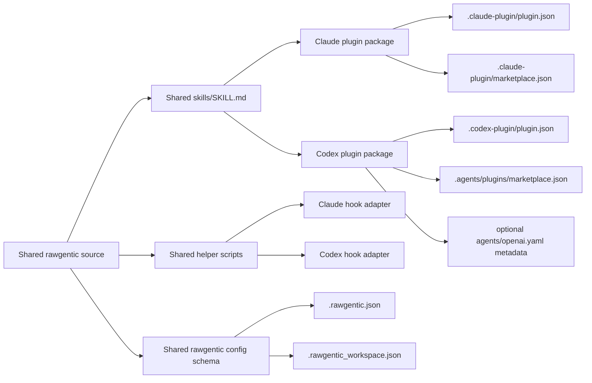
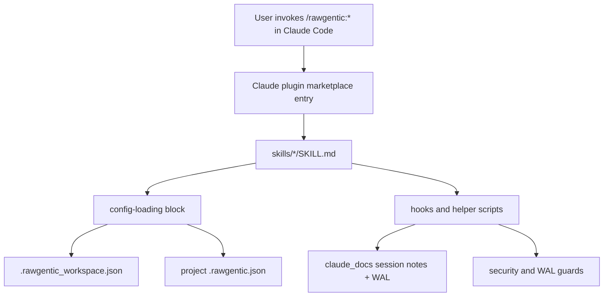
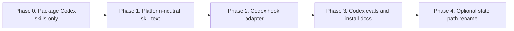
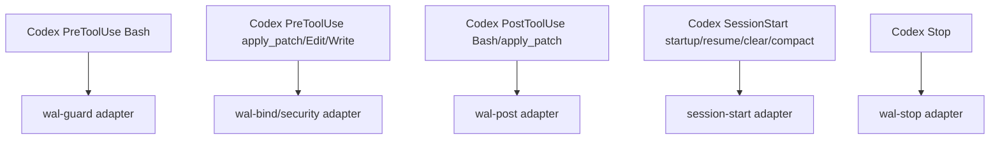
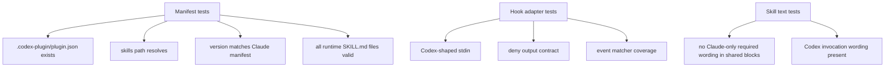
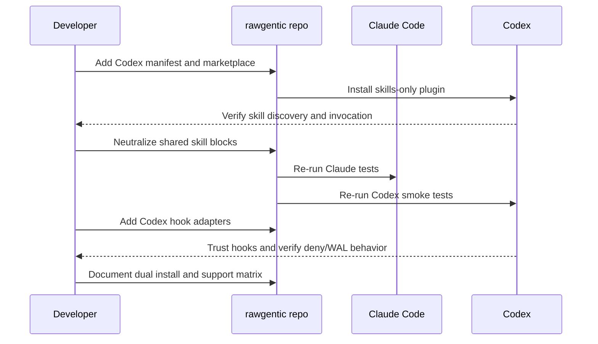

# Rawgentic Dual-Platform Compatibility Report

Date: 2026-07-02

Scope: Evaluate the current rawgentic repository and propose a solution that allows the same workflow system to work in Claude Code and Codex.

## Executive Summary

Rawgentic is already close to Codex-compatible at the skill-file level because Codex and Claude both consume `SKILL.md` directories with frontmatter. The repo is not Codex-ready as a plugin today because it only has Claude packaging, the hook configuration is Claude-specific, and the skill bodies contain scattered Claude-specific assumptions.

Recommended direction: keep one shared workflow source, add a Codex package surface, and introduce small platform adapters for hooks, invocation wording, session IDs, and persistent notes paths. Do not fork all 17 skills into separate Claude and Codex copies unless you are willing to pay a permanent drift cost.



## Confirmed Facts

| Area | Confirmed in repo/docs | Meaning |
|---|---|---|
| Claude packaging exists | `.claude-plugin/plugin.json` has `name`, `version`, description, metadata only. `.claude-plugin/marketplace.json` whitelists all 17 skills. | Current distribution target is Claude Code. |
| Codex packaging absent | No `.codex-plugin/`, `.agents/skills`, or `.agents/plugins` files exist in the repo. | Codex cannot install rawgentic as a native Codex plugin from this checkout today. |
| Skill shape mostly portable | Every runtime skill is already `skills/<name>/SKILL.md`; docs say this is the rawgentic authoring format. Codex also expects a skill directory containing `SKILL.md` with `name` and `description`. | The skills are the reusable core. |
| Skill trigger UX differs | Rawgentic docs and skills describe `/rawgentic:*` slash commands. Codex explicitly activates skills through `/skills`, `$skill`, implicit matching, or plugin selection. | Codex users should invoke skills as `$rawgentic:create-issue` or through plugin/skill selection, not Claude-style slash commands. |
| Hooks need adaptation | Current `hooks/hooks.json` uses `${CLAUDE_PLUGIN_ROOT}`, Claude tool names, and `PostToolUseFailure`. | A Codex `hooks/hooks.json` cannot be a copy-paste of the Claude file. |
| Hook block protocol is Claude-specific | `security_guard_lib.py` emits `permissionDecision: deny` and prose says it is for Claude. | Need to verify Codex's exact blocking output contract before enabling hard-blocking hooks in Codex. |
| Shared-block system exists | `shared/blocks` plus `scripts/sync_shared_blocks.py` already single-source repeated prose into skills. | Use this mechanism for platform-neutral config-loading and invocation text. |

## Current Architecture



## Target Architecture

```mermaid
flowchart TD
  subgraph Shared_Core[Shared core]
    S[skills/*/SKILL.md]
    B[shared/blocks]
    L[hooks/* libraries and helper CLIs]
    R[rawgentic config schema]
  end

  subgraph Claude_Surface[Claude surface]
    CP[.claude-plugin/plugin.json]
    CM[.claude-plugin/marketplace.json]
    CH[hooks/claude-hooks.json or generated hooks/hooks.json]
    CX[/rawgentic:* invocation wording]
  end

  subgraph Codex_Surface[Codex surface]
    OP[.codex-plugin/plugin.json]
    OM[.agents/plugins/marketplace.json]
    OH[hooks/codex-hooks.json or generated hooks/hooks.json]
    OX[$rawgentic:* or skill-picker invocation wording]
  end

  Shared_Core --> Claude_Surface
  Shared_Core --> Codex_Surface
```

## Compatibility Matrix

| Component | Claude today | Codex fit | Risk | Required work |
|---|---:|---:|---|---|
| `skills/*/SKILL.md` files | Works | Mostly works | Medium | Replace Claude-only wording with platform-neutral wording or generated platform sections. |
| Skill names like `rawgentic:create-issue` | Works | Likely acceptable but should be tested in Codex selectors | Low/Medium | Create a Codex local install test and confirm selection/invocation display. |
| `.claude-plugin/plugin.json` | Works | Not used | Low | Keep unchanged for Claude. |
| `.claude-plugin/marketplace.json` | Works | Not used | Low | Keep unchanged for Claude. |
| `.codex-plugin/plugin.json` | Missing | Required for Codex plugin distribution | High | Add Codex manifest with `skills: "./skills/"` or a curated/generated skill directory. |
| Codex marketplace | Missing | Needed for repo or personal install testing | High | Add `.agents/plugins/marketplace.json` or document `codex plugin marketplace add ./...`. |
| `hooks/hooks.json` | Works for Claude | Not directly portable | High | Add Codex hook config with Codex matcher names and command paths. |
| `security-guard.py` | Claude hard-block output | Unknown until tested against Codex hook contract | High | Add output adapter and Codex hook tests before enabling as hard block. |
| WAL hooks | Claude event/tool model | Partial fit | High | Map Codex events and tool names; decide whether Codex MVP includes WAL parity. |
| `claude_docs` state path | Works but platform-named | Works only as legacy name | Medium | Decide whether to keep for backward compatibility or introduce neutral `agent_docs`. |
| Reflexion/superpowers dependencies | Claude plugin commands | Codex has different built-in skills/plugins | High | Replace command-style references with capability-based steps and optional Codex skill names. |
| WF5 Codex CLI reviewer | Already uses Codex from Claude | In Codex, using `codex exec` from inside Codex may be redundant or problematic | Medium/High | Decide whether WF5 becomes "separate reviewer mode" in Codex or stays shell-based. |

## Recommended Solution

Use a staged dual-surface package.



### Phase 0 - Codex skills-only MVP

Goal: make rawgentic usable in Codex without lifecycle hooks.

Deliverables:

- Add `.codex-plugin/plugin.json`:

```json
{
  "name": "rawgentic",
  "version": "2.44.0",
  "description": "SDLC workflow skills and safety workflows for Codex and Claude Code.",
  "skills": "./skills/"
}
```

- Add `.agents/plugins/marketplace.json` for local Codex testing.
- Add a Codex install section to `README.md`.
- Add tests that verify all whitelisted Claude skills also exist for Codex packaging.

Tradeoff: workflows can run, but automatic WAL/security/session hooks are not Codex-parity yet.

### Phase 1 - Platform-Neutral Skill Text

Goal: stop the skill bodies from assuming Claude while preserving Claude behavior.

Use existing `shared/blocks` generation instead of manually editing 17 skills in divergent ways.

Replace:

| Current wording | Neutral wording |
|---|---|
| "Claude root" | "workspace root" |
| `/rawgentic:setup` only | "invoke `rawgentic:setup` through your agent's skill mechanism" |
| `CLAUDE_CODE_SESSION_ID` only | "agent session id, resolved by platform adapter" |
| `claude_docs` as conceptual name | "rawgentic session store", with current default path documented |
| `Grep/Glob/Read` | "use available file search/read tools, such as ripgrep or the agent's file tools" |
| `/reflexion:critique` hard dependency | "run configured critique skill/plugin if available; otherwise perform inline critique and mark the gate degraded" |

Important: keep `claude_docs` as a filesystem default until you decide on a migration. Renaming state paths is a data migration, not just a wording change.

### Phase 2 - Codex Hook Adapter

Goal: restore safety and WAL behavior in Codex after tests prove the hook protocol.

Codex hook config should be separate from Claude hook config.



Known mapping from current Codex manual:

| Rawgentic Claude matcher | Codex equivalent to test |
|---|---|
| `Bash` | `Bash` |
| `Edit|Write|MultiEdit|NotebookEdit` | `apply_patch`, `Edit`, `Write` if supported by matcher |
| `Task` | Codex subagent events or MCP tool names, not direct `Task` |
| `PostToolUseFailure` | No matching event confirmed in the Codex hook section read |
| `UserPromptSubmit` | Exists, but matcher is ignored |

Do not enable hard-blocking Codex hooks until a small test fixture proves:

1. The hook receives the fields rawgentic expects: `tool_name`, `tool_input`, `session_id`, `tool_use_id`, `cwd`.
2. Codex honors the adapter's deny/block output.
3. Hook trust flow is acceptable for users.
4. Multiple matching hooks running concurrently does not break WAL ordering expectations.

### Phase 3 - Codex Evals and Drift Guards

Add test coverage parallel to the existing Claude marketplace tests:



### Phase 4 - Optional State Store Rename

Only do this if you want the public model to be truly agent-neutral.

Option A: keep `claude_docs` forever.

- Lowest risk.
- Backward compatible.
- Awkward in Codex docs.

Option B: introduce `rawgentic_docs` or `agent_docs` with backward-compatible fallback.

- Better naming.
- Requires migration, tests, and rollback plan.
- Hooks and skills must treat old and new paths carefully.

My recommendation: defer this until after Codex skills and hooks work.

## Decisions I Need From You

1. Should Codex MVP be skills-only, or must it include hooks from the first release?
2. Do you want the public installation model to be a Codex plugin marketplace entry, repo-scoped `.agents/skills`, or both?
3. Should `claude_docs` remain the persistent state path for compatibility, or should a neutral path be introduced later?
4. In Codex, should WF5 adversarial review still shell out to `codex exec`, or should it become an instruction-only "independent review" workflow using the current Codex thread plus explicit constraints?
5. Are Reflexion and Superpowers required dependencies for Claude only, or should rawgentic define equivalent optional Codex dependencies?

## Suggested Implementation Order



## File-Level Worklist

| File/path | Action |
|---|---|
| `.codex-plugin/plugin.json` | Add Codex plugin manifest. |
| `.agents/plugins/marketplace.json` | Add local Codex marketplace for testing and repo-scoped install. |
| `README.md` | Add "Use with Claude" and "Use with Codex" install paths plus support matrix. |
| `docs/skill-development.md` | Extend with Codex packaging and dual-platform guidance. |
| `shared/blocks/*.md` | Make repeated workflow prose platform-neutral. |
| `scripts/sync_shared_blocks.py` | Add platform-neutral block sources or generated variants if needed. |
| `hooks/hooks.json` | Keep as Claude hook config or rename/generated from Claude source. |
| `hooks/codex-hooks.json` or `hooks/hooks.codex.json` | Add Codex hook config after output contract is tested. |
| `hooks/security_guard_lib.py` | Add output adapter if Codex deny protocol differs. |
| `hooks/wal-lib.sh` | Add platform session-id resolution and Codex tool-name summary mapping. |
| `tests/` | Add Codex manifest, skill parity, and hook adapter tests. |

## Sources Used

- `.claude-plugin/plugin.json`: current Claude manifest and version.
- `.claude-plugin/marketplace.json`: current 17-skill whitelist.
- `hooks/hooks.json`: current Claude hook wiring.
- `hooks/security_guard_lib.py`: current Claude deny output.
- `docs/skill-development.md`: current rawgentic skill authoring and shared-block conventions.
- Current Codex manual fetched locally to `/tmp/openai-docs-cache/codex-manual.md`: Codex skills, plugins, hooks, and import behavior.

## Bottom Line

The lowest-risk solution is not "convert rawgentic from Claude to Codex." It is "make rawgentic a shared workflow core with two thin platform surfaces." Skills can be shared almost immediately. Hooks need a tested adapter. Public docs should present Claude and Codex as first-class install targets, while being explicit that hook parity is a later phase unless you decide it is mandatory for the MVP.
